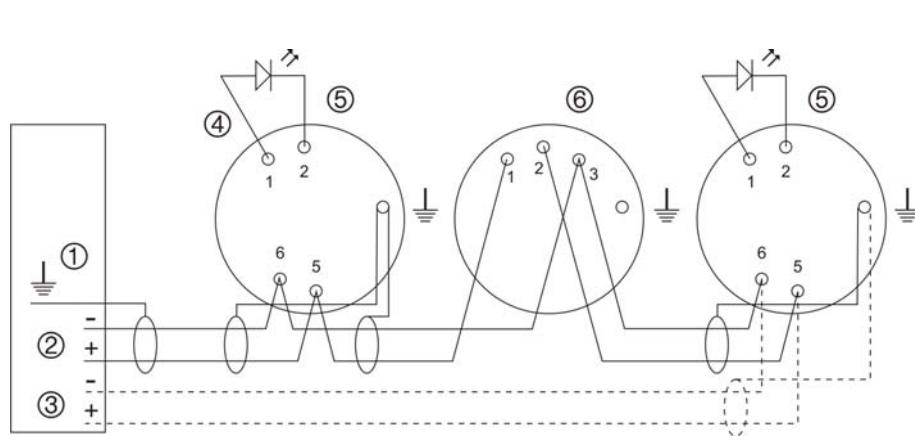
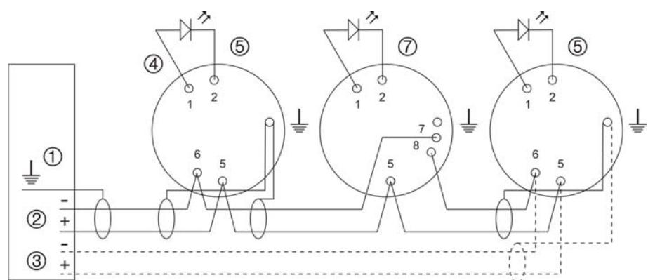

# DB2000 Mounting Bases Installation Sheet

#### **EN DA DE FR IT NL PL PT RU SV**

**2** 

**1** 

# **EN: Installation Sheet**

## **Description**

This document includes installation information for UTC Fire & Security DB2002, DB2003, DB2004, and DB2016 bases.

## **Installation**

**Caution:** For general guidelines on system planning, design, installation, commissioning, use and maintenance, refer to the EN54-14 standard and local regulations.

Polarity must be observed to ensure full functionality with all compatible devices

See Figure 1 for DB2002, DB2004, and DB2003 mounting bases.

See Figure 2 for DB2002, DB2004, and DB2016 mounting bases.

- 1. Earth shield (optional)
- 2. Loop driver
- 3. Loop driver return (Class A wiring only)
- 4. Remote indicator
- 5. DB2002 / DB2004 base with 2000 series detector
- 6. (Figure 1) DB2003 base with IU2016 loop isolator
- 7. (Figure 2) DB2016 isolating base with 2000 series detector

**WARNING:** The IU2016 isolator and DB2003 mounting base must not be installed in the same loop as the DB2016 isolating base.

#### **DB2002 and DB2004 bases for 2000 series detectors**

Terminal connections are as follows:

- Terminal 1 Remote indicator (positive)
- Terminal 2 Remote indicator (negative)
- Terminal 5 Line in / out (positive)
- Terminal 6 Line in / out (negative)

#### **DB2003 base for IU2016 isolator**

Terminal connections are as follows:

- Terminal 1 Line in (positive)
- Terminal 2 Line out (positive)
- Terminal 3 Line in / out (negative)

## **DB2016 isolating base for 2000 series detectors**

Terminal connections are as follows:

- Terminal 1 Remote indicator (positive)
- Terminal 2 Remote indicator (negative)
- Terminal 5 Line in / out (positive) • Terminal 6 – Not used
- Terminal 7 Line in (negative)
- Terminal 8 Line out (negative)

## **Maintenance**

Basic maintenance consists of a yearly inspection. Do not modify internal wiring or circuitry.

## **Testing the isolator**

To test the isolator provoke a short circuit in the loop and check to see that the corresponding LED indicator is activated.

## **Specifications**

| DB2002, DB2003, and DB2004                                        |                                                         |
|-------------------------------------------------------------------|---------------------------------------------------------|
| Number of terminals: DB2002, DB2004 DB2003                  | 4 3                                                  |
| Earth contact                                                     | Yes                                                     |
| Remote indicator option                                           | Yes (DB2002, DB2004 only)                               |
| IP Rating                                                         | IP30                                                    |
| Operating temperature Storage temperature Relative humidity | −10 to +50ºC −10 to +70ºC 10 to 95% noncondensing |
| Colour                                                            | White                                                   |
| Dimensions (W × H × D) DB2002, DB2003 DB2004                | Ø 100 × 9 mm Ø 100 × 17 mm                           |
| Weight: DB2002, DB2003 DB2004                               | 38 g 41 g                                            |
| DB2016                                                            |                                                         |
| Operating voltage                                                 | 17 to 34 VDC (28 VDC nominal)                        |
| Current consumption: Standby Isolated Passing            | < 30 µA < 1.6 mA Max. 800 mA                      |
| Line resistance                                                   | 0.1Ω                                                    |
| Number of terminals                                               | 5                                                       |
| Earth contact                                                     | Yes                                                     |
| Remote indicator option                                           | Yes                                                     |
| IP rating                                                         | IP30                                                    |

| Storage temperature −10 to +70ºC Relative humidity 10 to 95% noncondensing Colour White Dimensions Ø 100 × 13 mm Weight 49 g | Operating temperature | −10 to +50ºC |
|---------------------------------------------------------------------------------------------------------------------------------------------------------|-----------------------|--------------|
|                                                                                                                                                         |                       |              |
|                                                                                                                                                         |                       |              |
|                                                                                                                                                         |                       |              |
|                                                                                                                                                         |                       |              |
|                                                                                                                                                         |                       |              |

## **Regulatory information**

| Manufacturer           | Thunderous Sounders Electronics Co. Ltd., No, 21, Kai Fe 3rd, Pao En Industrial Area, Ren De Village, Tainan, Taiwan, R.O.C. |
|------------------------|------------------------------------------------------------------------------------------------------------------------------------|
|                        | Authorized EU manufacturing representative: UTC Fire & Security B.V. Kelvinstraat 7, 6003 DH Weert, Netherlands              |
| Year of manufacture | The first two digits of the product serial number (located on the product identification label) are the year of manufacture. |
|                        | The first two digits of the DATE MFG number (located on the product identification label) are the year of manufacture.       |
| Product code           | DB2016                                                                                                                             |
| Description            | Isolating base                                                                                                                     |
| Certification          |                                                                                                                                    |
| CPD certificate        | 0786-CPD-20635                                                                                                                     |
| EN 54                  | EN54-17:2005/AC:2007                                                                                                               |

## **Contact information**

For contact information, see www.utcfireandsecurity.com.

# **DA: Installations vejledning**

## **Beskrivelse**

Dette dokument beskriver installations informationer for detektor sokler af typen DB2002, DB2003, DB2004, og DB2016 fra UTC Fire & Security.

## **Installation**

**ADVARSEL!** Vær opmærksom på de generelle retningslinjer for systemplanlægning og -udformning, installation, ibrugtagning, anvendelse og vedligeholdelse i henhold til EN54:14 samt de lokale bestemmelser.

Polariteten skal overholdes ved tilslutning af enhederne for at sikre fuld funktionalitet, på alle kompatible enheder.

Figur 1 viser tilslutning for DB2002, DB2004, og DB2003 detektor sokler. Figur 2 viser tilslutning for DB2002, DB2004, og DB2016 detektor sokler.

- 1. Jord (valgfrit)
- 2. Sløjfe tilslutning
- 3. Sløjfe tilslutning retur (Kun klasse A tilslutning)
- 4. Fjern indikation
- 5. DB2002 / DB2004 detektor sokkel med 2000 serie detektorer
- 6. (På figur 1) DB2003 detektor sokkel med IU2016 sløjfe isolator
- 7. (På figur 2) DB2016 isolator sokkel med 2000 serie detektorer

**ADVARSEL!** IU2016 sløjfe isolator og DB2003 sokkel må ikke blive installeret på den samme sløjfe som DB2016 isolator soklen.

#### **DB2002 og DB2004 sokkel for 2000 serie detektorer**

Terminal forbindelserne er som følger:

- Terminal 1 Fjernindikation ( + )
- Terminal 2 Fjernindikation ( − )
- Terminal 5 Sløjfe ind/ud ( + )
- Terminal 6 Sløjfe ind/ud ( − )

#### **DB2003 sokkel for IU2016 isolator**

Terminal forbindelserne er som følger:

- Terminal 1 Sløjfe ind ( + )
- Terminal 2 Sløjfe ud ( + )
- Terminal 3 Sløjfe ind/ud ( − )

#### **DB2016 isolator sokkel for 2000 serie detektorer**

Terminal forbindelserne er som følger:

- Terminal 1 Fjernindikation ( + )
- Terminal 2 Fjernindikation ( − )
- Terminal 5 Sløjfe ind/ud ( + )
- Terminal 6 Bruges ikke
- Terminal 7 Sløjfe ind ( − )
- Terminal 8 Sløjfe ud ( − )

## **Vedligeholdelse**

Den grundlæggende vedligeholdelse er begrænset til et årligt eftersyn. Der må ikke ændres på de indvendige ledningsforbindelser eller strømkredse.

#### **Test af isolator**

For at teste isolatoren laves en kortslutning på sløjfen, og det kontrolleres at LED indikatoren bliver aktiveret.

## **Tekniske specifikationer**

| DB2002, DB2003, og DB2004                                          |                                                                 |
|--------------------------------------------------------------------|-----------------------------------------------------------------|
| Antal terminaler: DB2002, DB2004 DB2003                      | 4 3                                                          |
| Jord tilslutning                                                   | Ja                                                              |
| Fjernindikation                                                    | Ja (DB2002, DB2004)                                             |
| Tæthedsklasse                                                      | IP30                                                            |
| Driftstemperatur Opbevaringstemperatur Relativ luftfugtighed | −10 til +50ºC −10 til +70ºC Ikke-kondenserende 10 til 95% |
| Farve                                                              | Hvid                                                            |
| Dimensioner: DB2002, DB2003 DB2004                           | Ø 100 × 9 mm Ø 100 × 17 mm                                   |
| Vægt: DB2002, DB2003 DB2004                                  | 38 g 41 g                                                    |

| DB2016                    |                                 |
|---------------------------|---------------------------------|
| Driftsspænding            | 17 til 34 VDC (28 VDC nominelt) |
| Strømforbrug:             |                                 |
| Hviletilstand             | < 30 µA                         |
| Isolering aktiv           | < 1.6 mA                        |
| Strømgennemgang på sløjfe | Max. 800 mA                     |
| Sløjfe modstand           | 0.1Ω                            |
| Antal terminaler          | 5                               |
| Jord tilslutning          | Ja                              |
| Fjernindikation           | Ja                              |
| Tæthedsklasse             | IP30                            |
| Driftstemperatur          | −10 til +50ºC                   |
| Opbevaringstemperatur     | −10 til +70ºC                   |
| Relativ luftfugtighed     | Ikke-kondenserende 10 til 95%   |
| Farve                     | Hvid                            |
| Dimensioner               | Ø 100 × 13 mm                   |
| Vægt                      | 49 g                            |

## **Certificering og overholdelse**

| Producent      | Thunderous Sounders Electronics Co. Ltd., No, 21, Kai Fe 3rd, Pao En Industrial Area, Ren De Village, Tainan, Taiwan, R.O.C. |
|----------------|------------------------------------------------------------------------------------------------------------------------------------|
|                | Producentrepræsentant (Europa) UTC Fire & Security B.V. Kelvinstraat 7, 6003 DH Weert, Netherlands                           |
| Produktionsår  | Produktionsåret er de første to tal i produktets serienummer (placeret på produktidentifikationsetiketten)                   |
| Produktkode    | DB2016                                                                                                                             |
| Beskrivelse    | Isolator sokkel                                                                                                                    |
| Certificering  |                                                                                                                                    |
| CPD-certifikat | 0786-CPD-20635                                                                                                                     |
| EN54           | EN54-17:2005/AC:2007                                                                                                               |

## **Kontaktinformation**

Kontaktinformation kan findes på vores webside: www.utcfireandsecurity.com

# **DE: Installationsanweisungen**

## **Beschreibung**

Dieses Dokument enthält Informationen zur Installation der folgenden Sockel DB2002, DB2003, DB2004 und DB2016 aus der UTC Fire & Security Aritech 2000-Serie.

### **Installation**

**Warnung:** Allgemeine Richtlinien zu Planung, Projektierung, Montage, Inbetriebsetzung, Betrieb und Instandhaltung finden Sie in der Norm EN 54-14 und in den örtlich geltenden Vorschriften.

Die Polarität muss beachtet werden, um ein volle Funktionalität mit allen Komponenten gewährleisten zu können.

Abbildung 1 zeigt Anschluss der DB2002, DB2004 und DB2003 Sockel. Abbildung 2 zeigt Anschluss der DB2002, DB2004 und DB2016 Sockel.

- 1. Abschirmung (empfohlen)
- 2. Ringanschluss
- 3. Ringrückleitungsanschluss (nur Klasse A Verdrahtung)
- 4. Parallelanzeigeanschluss
- 5. DB2002 / DB2004 Sockel mit 2000 Melderserie
- 6. (In Abbildung 1) DB2003 Sockel mit IU2016 Isolatormodul
- 7. (In Abbildung 2) DB2016 Isolatorsockel mit 2000 Melderserie

**ACHTUNG:** Der IU2016 Isolator und der DB2003 Sockel dürfen nicht gemeinsam mit dem DB2016 Isolatorsockel in einer Ringleitung installiert werden.

#### **DB2002 und DB2004 Sockel für 2000 Melderserie**

Anschlussklemmen sind wie folgt:

- Klemme 1 Parallelanzeige (Plus)
- Klemme 2 Parallelanzeige (Minus)
- Klemme 5 Ring IN / OUT (Plus)
- Klemme 6 Ring IN / OUT (Minus)

#### **DB2003 Sockel für IU2016 Isolatormodul**

Anschlussklemmen sind wie folgt:

- Klemme 1 Ring IN (Plus)
- Klemme 2 Ring OUT (Plus)
- Klemme 3 Ring IN / OUT (Minus)

#### **DB2016 Isolatorsockel für 2000 Melderserie**

Anschlussklemmen sind wie folgt:

- Klemme 1 Parallelanzeige (Plus)
- Klemme 2 Parallelanzeige (Minus)
- Klemme 5 Ring IN / OUT (Plus)
- Klemme 6 Nicht belegt
- Klemme 7 Ring IN (Minus)
- Klemme 8 Ring OUT (Minus)

## **Wartung**

Grundlegend sollte einmal jährlich eine Wartung erfolgen. Die interne Verdrahtung nicht verändern.

#### **Testen des Isolator**

Um den Isolator zu testen, produzieren Sie einen Kurzschluss auf der Ringleitung, um zu sehen ob die entsprechende LED-Anzeige aktiviert ist.

## **Technische Daten**

| DB2002, DB2003, und DB2004 Sockel               |                     |  |
|-------------------------------------------------|---------------------|--|
| Anzahl der Klemmen: DB2002, DB2004 DB2003 | 4 3              |  |
| Erdungsanschluss                                | Ja                  |  |
| Parallelanzeigeanschluss                        | Ja (DB2002, DB2004) |  |
| IP-Schutzklasse                                 | IP30                |  |

| −10 bis +50ºC −10 bis +70ºC Nicht kondensierend 10 bis 95% Weiß |  |
|--------------------------------------------------------------------------|--|
|                                                                          |  |
| Ø 100 × 9 mm                                                             |  |
| Ø 100 × 17 mm                                                            |  |
|                                                                          |  |
| 38 g                                                                     |  |
| 41 g                                                                     |  |
|                                                                          |  |

| DB2016 Isolatorsockel     |                                |
|---------------------------|--------------------------------|
| Betriebsspannung          | 17 bis 34 VDC (28 VDC nominal) |
| Stromaufnahme:            |                                |
| Ruhestromaufnahme         | < 30 µA                        |
| Isolierend                | < 1.6 mA                       |
| Stromdurchlass            | Max. 800 mA                    |
| Ringwiderstand            | 0.1Ω                           |
| Anzahl der Klemmen        | 5                              |
| Erdungsanschluss          | Ja                             |
| Parallelanzeigeanschluss  | Ja                             |
| IP-Schutzklasse           | IP30                           |
| Betriebstemperatur        | −10 bis +50ºC                  |
| Lagerungstemperatur       | −10 bis +70ºC                  |
| Relative Luftfeuchtigkeit | Nicht kondensierend 10 bis 95% |
| Farbe                     | Weiß                           |
| Maße                      | Ø 100 × 13 mm                  |
| Gewicht                   | 49 g                           |

## **Zertifikate und Einhaltung von Bestimmungen**

| Hersteller       | Thunderous Sounders Electronics Co. Ltd., No, 21, Kai Fe 3rd, Pao En Industrial Area, Ren De Village, Tainan, Taiwan, R.O.C.         |
|------------------|--------------------------------------------------------------------------------------------------------------------------------------------|
|                  | Europäische Herstellerniederlassung: UTC Fire & Security B.V. Kelvinstraat 7, 6003 DH Weert, Netherlands                             |
| Herstellungsjahr | Das Herstellungsjahr wird durch die ersten beiden Stellen der Produktseriennummer angegeben (auf dem Produktbezeichnungsetikett). |
| Produkt code     | DB2016                                                                                                                                     |
| Beschreibung     | Isolatorsockel                                                                                                                             |
| Zertifikate      |                                                                                                                                            |
| CPD-Zertifikat   | 0786-CPD-20635                                                                                                                             |
| EN54             | EN54-17:2005/AC:2007                                                                                                                       |

## **Kontaktinformationen**

Kontaktinformationen finden Sie auf unserer Website: www.utcfireandsecurity.com.

# **FR: Instructions d'installations**

## **Description**

Ce document inclue les informations d'installation pour les bases UTC Fire & Security DB2002, DB2003, DB2004, et DB2016.

## **Installation**

**Attention:** Suivant les directives générales pour l'installation, la mise en service et la maintenance, référez vous à la directive EN54:14.

La polarité doit être observée pour assurer un fonctionnement correct de l'isolateur.

La figure 1 montre les connexions pour les bases DB2002, DB2004 et DB2003. La figure 2 montre les connexions pour les bases DB2002, DB2004 et DB2016.

- 1. Point de masse (optionnel)
- 2. Connection de boucle
- 3. Retour de connection de boucle (Classe A uniquement)
- 4. Indicateur à led à distance
- 5. Base DB2002 / DB2004avec les détecteurs de la série 2000
- 6. (Figure 1) Base DB2003 avec l'isolateur de boucle IU2016
- 7. (Figure 2) Base DB2016 avec isolateur intégré pour les détecteurs de la série 2000

**ATTENTION:** L'isolateur IU2016 avec sa base DB2003 ne doivent pas être utilisés avec des bases DB2016 installées sur la même boucle.

#### **Bases DB2002 et DB2004**

Les connexions du bornier sont:

- Borne 1 Indicateur d'action (positive)
- Borne 2 Indicateur d'action (negative)
- Borne 5 Bus (ligne à polarité positive)
- Borne 6 Bus (ligne à polarité negative)

#### **Base DB2003 pour l'isolateur IU2016**

Les connexions du bornier sont:

- Borne 1 Entrée du bus (ligne à polarité positive)
- Borne 2 Sortie du bus (ligne à polarité positive)
- Borne 3 Bus (ligne à polarité negative)

#### **Base DB2016 avec isolateur**

Les connexions du bornier sont:

- Borne 1 Indicateur d'action (ligne à polarité positive)
- Borne 2 Indicateur d'action (ligne à polarité negative)
- Borne 5 Bus (ligne à polarité positive)
- Borne 6 Inutilisée
- Borne 7 Entrée du bus (ligne à polarité negative)
- Borne 8 Sortie du bus (ligne à polarité negative)

### **Maintenance**

La maintenance de base se limite à une inspection annuelle. Ne pas modifier le câblage interne.

#### **Comment tester l'isolateur**

Pour tester l'isolateur, provoquer un court circuit sur la boucle et verifier que le led correspondent est active.

## **Caractéristiques techniques**

| Bases DB2002, DB2003 et DB2004                                                        |                                                          |  |
|---------------------------------------------------------------------------------------|----------------------------------------------------------|--|
| Nombre de bornes: DB2002, DB2004 DB2003                                         | 4 3                                                   |  |
| Borne de terre                                                                        | Oui                                                      |  |
| Sortie indicateur d'action                                                            | Oui (DB2002, DB2004)                                     |  |
| Indice IP                                                                             | IP30                                                     |  |
| Température d'utilisation Température de stockage Humidité relative             | −10 à +50ºC −10 à +70ºC Sans condensation 10 à 95% |  |
| Couleur                                                                               | Blanc                                                    |  |
| Dimensions: DB2002, DB2003 DB2004                                               | Ø 100 × 9 mm Ø 100 × 17 mm                            |  |
| Poids: DB2002, DB2003 DB2004                                                    | 38 g 41 g                                             |  |
|                                                                                       |                                                          |  |
| Base DB2016                                                                           |                                                          |  |
| Tension de fonctionnement                                                             | 17 à 34 V cc (28 V cc nominal)                           |  |
| Consomation de courant: En veille Isolé Limite de courant avant isolation | < 30 µA < 1.6 mA Max. 800 mA                       |  |
| Impédance                                                                             | 0.1Ω                                                     |  |
| Nombre de bornes                                                                      | 5                                                        |  |
| Borne de terre                                                                        | Oui                                                      |  |
| Sortie indicateur d'action                                                            | Oui                                                      |  |
| Indice IP                                                                             | IP30                                                     |  |
| Température d'utilisation Température de stockage Humidité relative             | −10 à +50ºC −10 à +70ºC Sans condensation 10 à 95% |  |
| Couleur                                                                               | Blanc                                                    |  |
| Dimensions:                                                                           | Ø 100 × 13 mm                                            |  |
| Poids                                                                                 | 49 g                                                     |  |

## **Certification et conformité**

| Fabricant            | Thunderous Sounders Electronics Co. Ltd., No, 21, Kai Fe 3rd, Pao En Industrial Area, Ren De Village, Tainan, Taiwan, R.O.C.               |
|----------------------|-----------------------------------------------------------------------------------------------------------------------------------------------------|
|                      | Représentant européen de la fabrication: UTC Fire & Security B.V. Kelvinstraat 7, 6003 DH Weert, Netherlands                                  |
| Année de fabrication | L'année de fabrication est inclue dans les deux chiffres premiers du numéro de serié du produit, qui ce trouve sur l'étiquette du produit. |
| Code de produit      | DB2016                                                                                                                                              |
| Description          | Base avec isolateur intégré                                                                                                                         |

| Certification            |                |
|--------------------------|----------------|
| Numéro du certificat CPD | 0786-CPD-20635 |

EN54 EN54-17:2005/AC:2007

## **Pour nous contacter**

Trouvez les informations pour nous contacter sur notre site web : www.utcfireandsecurity.com.

# **IT: Istruzioni di installazione**

## **Descrizione**

Il presente documento contiene informazioni per le basi UTC Fire & Security tipo DB2002, DB2003, DB2004 e DB2016.

## **Installazione**

**Attenzione:** per indicazioni di carattere generale inerenti la configurazione del sistema, il progetto, l'installazione, la messa in funzione, l'utilizzo e la manutenzione riferirsi alla direttiva standard EN54:14 e normative e locali.

Osservare la polarità dei dispositivi per assicurare la completa funzionalità di tutte le apparecchiature compatibili.

Figura 1 mostra I collegamenti per le basi DB2002, DB2004 e DB2003. Figura 2 mostra I collegamenti per le basi DB2002, DB2004 e DB2016.

- 1. Schermo a terra (opzionale)
- 2. Loop
- 3. Ritorno del loop (solo collegamento in classe A)
- 4. Indicatore remoto
- 5. Base DB2002 / DB2004 con rivelatore serie 2000
- 6. (Figura 1) Base DB2003 con isolatore di loop IU2016
- 7. (Figura 2) Base isolatrice DB2016 con rivelatore serie 2000

**ATTENZIONE:** l'isolatore IU2016 con la relativa base DB2003 non deve essere installato su un loop che utilizza una o più basi isolatrici DB2016.

#### **Basi DB2002 e DB2004 per rivelatori della serie 2000**

Le connessioni dei morsetti sono le seguenti:

- Morsetto 1 Indicatore remoto (positivo)
- Morsetto 2 Indicatore remoto (negativo)
- Morsetto 5 Linea loop IN/OUT (positivo)
- Morsetto 6 Linea loop IN/OUT (negativo)

### **Base DB2003 per isolatore IU2016**

Le connessioni dei morsetti sono le seguenti:

- Morsetto 1 Linea IN (positivo)
- Morsetto 2 Linea OUT (positivo)
- Morsetto 3 Linea IN/OUT (negativo)

## **Base isolatrice DB2016 per rivelatori serie 2000**

Le connessioni dei morsetti sono le seguenti:

- Morsetto 1 Indicatore remoto (positivo)
- Morsetto 2 Indicatore remoto (negativo)
- Morsetto 5 Linea IN/OUT (positivo)
- Morsetto 6 Non usato
- Morsetto 7 Linea IN (negativo)
- Morsetto 8 Linea OUT (negativo)

## **Manutenzione**

La manutenzione richiesta è stata ridotta ad una ispezione all'anno. Non modificare I collegamenti interni o la circuiteria.

#### **Test dell'isolatore**

Per provare l'isolatore provocare un corto circuito sul loop e controllare se si accende l'apposito indicatore LED sulla base.

## **Specifiche tecniche**

| Basi DB2002, DB2003 e DB2004                                                  |                                                                |
|-------------------------------------------------------------------------------|----------------------------------------------------------------|
| Numero di morsetti: DB2002, DB2004 DB2003                               | 4 3                                                         |
| Contatto di terra                                                             | Si                                                             |
| Opzione indicatore remoto                                                     | Si (DB2002, DB2004)                                            |
| Grado di protezione                                                           | IP30                                                           |
| Temperatura di funzionamento Temperatura di stoccaggio Umidità relativa | da −10 a +50ºC da −10 a +70ºC Senza condensa da 10 a 95% |
| Colore                                                                        | Bianco                                                         |
| Dimension DB2002, DB2003 DB2004                                         | Ø 100 × 9 mm Ø 100 × 17 mm                                  |
| Peso: DB2002, DB2003 DB2004                                             | 38 g 41 g                                                   |
| Base DB2016                                                                   |                                                                |
| Tensione di funzionamento                                                     | da 17 a 34 Vcc (28 Vcc nominali)                            |
| Consumo di corrente: A riposo Isolato Corrente passante              | < 30 µA < 1,6 mA Max. 800 mA                             |
| Resistenza di linea                                                           | 0,1Ω                                                           |
| Numero di morsetti                                                            | 5                                                              |
| Contatto di terra                                                             | Si                                                             |
| Opzione indicatore remoto                                                     | Si                                                             |
| Grado di protezione                                                           | IP30                                                           |
| Temperatura di funzionamento Temperatura di stoccaggio Umidità relativa | da −10 a +50ºC da −10 a +70ºC Senza condensa 10 to 95%   |
| Colore                                                                        | Bianco                                                         |
| Dimensioni:                                                                   | Ø 100 × 13 mm                                                  |
| Peso                                                                          | 49 g                                                           |
|                                                                               |                                                                |

## **Certificazione e conformità**

| Fabbricante            | Thunderous Sounders Electronics Co. Ltd., No, 21, Kai Fe 3rd, Pao En Industrial Area, Ren De Village, Tainan, Taiwan, R.O.C.                                                      |
|------------------------|-----------------------------------------------------------------------------------------------------------------------------------------------------------------------------------------|
|                        | Rappresentante del fabbricante (Europa): UTC Fire & Security B.V. Kelvinstraat 7, 6003 DH Weert, Netherlands                                                                   |
| Anno di produzione     | Per conoscere l'anno di produzione del prodotto verificare le prime due cifre del numero di serie del prodotto stesso. Riferirsi all'etichetta di identificazione prodotto. |
| Codice prodotto        | DB2016                                                                                                                                                                                  |
| Descrizione            | Base isolatrice                                                                                                                                                                         |
| Certificazione         |                                                                                                                                                                                         |
| CPD Certificato numero | 0786-CPD-20635                                                                                                                                                                          |
| EN54                   | EN54-17:2005/AC:2007                                                                                                                                                                    |

## **Informazioni di contatto**

Le informazioni di contatto sono disponibili sul sito web www.utcfireandsecurity.com.

# **NL: Installatie instructies**

## **Omschrijving**

Dit document bevat installatie informatie voor UTC Fire & Security DB2002, DB2003, DB2004, en DB2016 montagevoeten.

## **Installatie**

**LET OP:** Voor algemene voorschriften voor systeem planning, ontwerp, installatie, in bedrijf stellen, gebruik en onderhoud, verwijzen we naar de EN54:14 standaards and lokale regelgeving.

Polariteit moet in acht genomen worden om van volledige functionaliteit verzekerd te zijn.

Figuur 1 overzicht van aansluiting voor DB2002, DB2004, en DB2003 montagevoeten. Figuur 2 overzicht van aansluiting voor DB2002, DB2004, en DB2016 montagevoeten.

- 1. Aardscherm (optioneel)
- 2. Lus drijver
- 3. Lus drijver retour (Class A bedrading)
- 4. Neven indicator
- 5. DB2002 / DB2004 montagevoet met 2000 series detector
- 6. (Figuur 1) DB2003 montagevoet met IU2016 lus isolator 7. (Figuur 2) DB2016 isolator montagevoet met 2000 series
- detector

**WAARSCHUWING:** De IU2016 isolator en DB2003 montagevoet mogen niet in dezelfde lus worden geinstalleerd als de DB2016 isolator montagevoet.

#### **DB2002 en DB2004 montagevoet voor 2000 series detectors**

Klem aansluitingen zijn als volgt:

- Klem 1 Neven indicator (positief)
- Klem 2 Neven indicator (negatief)
- Klem 5 Lijn in / uit (positief)
- Klem 6 Llijn in / uit (negatief)

#### **DB2003 montagevoet voor IU2016 isolator**

Klem aansluitingen zijn als volgt:

- Klem 1 Llijn in (positief)
- Klem 2 Lijn uit (positief)
- Klem 3 Llijn in / uit (negatief)

**DB2016 isolator montagevoet voor 2000 series detectors** 

Klem aansluitingen zijn als volgt:

- Klem 1 Neven indicator (positief)
- Klem 2 Neven indicator (negatief)
- Klem 5 Lijn in / uit (positief)
- Klem 6 Ongebruikt
- Klem 7 Lijn in (negatief)
- Klem 8 Lijn uit (negatief)

## **Onderhoud**

Basis onderhoud is verminderd tot een jaarlijkse inspectie. Wijzig geen interne bedrading of circuits.

#### **Testen van de isolator**

Voor het testen van de isolator maak een kortsluiting in de lus en controleer of de LED van de isolator gaat branden.

## **Technische specificaties**

| DB2002, DB2003, en DB2004 montagevoet                                  |                                                                 |  |
|------------------------------------------------------------------------|-----------------------------------------------------------------|--|
| Aantal aansluitklemmen: DB2002, DB2004 DB2003                    | 4 3                                                          |  |
| Aardklem                                                               | Ja                                                              |  |
| Neven indicator mogelijkheid                                           | Ja (DB2002, DB2004)                                             |  |
| IP waarde                                                              | IP30                                                            |  |
| Bedrijfstemperatuur Opslagtemperatuur Relatieve luchtvochtigheid | −10 tot +50ºC −10 tot +70ºC Zonder condensatie 10 tot 95% |  |
| Kleur                                                                  | Wit                                                             |  |
| Afmetingen: DB2002, DB2003 DB2004                                | Ø 100 × 9 mm Ø 100 × 17 mm                                   |  |
| Gewicht: DB2002, DB2003 DB2004                                   | 38 g 41 g                                                    |  |
|                                                                        |                                                                 |  |
| DB2016 isolator montagevoet                                            |                                                                 |  |
| Operating voltage                                                      | 17 tot 34 VDC (28 VDC nominaal)                                 |  |
| Stroom consumptie: Stand-by Geisoleerd Toelaatbare stroom     | < 30 µA < 1.6 mA Max. 800 mA                              |  |

| Lijn weerstand                           | 0.1Ω                           |
|------------------------------------------|--------------------------------|
| Aantal aansluitklemmen                   | 5                              |
| Aardklem                                 | Ja                             |
| Neven indicator mogelijkheid             | Ja                             |
| IP waarde                                | IP30                           |
| Bedrijfstemperatuur Opslagtemperatuur | −10 tot +50ºC −10 tot +70ºC |
| Relatieve luchtvochtigheid               | Zonder condensatie 10 tot 95%  |
| Kleur                                    | Wit                            |
| Afmetingen                               | Ø 100 × 13 mm                  |
| Gewicht                                  | 49 g                           |

## **Certificering en naleving**

| Fabrikant       | Thunderous Sounders Electronics Co. Ltd., No, 21, Kai Fe 3rd, Pao En Industrial Area, Ren De Village, Tainan, Taiwan, R.O.C. |
|-----------------|------------------------------------------------------------------------------------------------------------------------------------|
|                 | Vertegenwoordiger van fabrikant (Europa): UTC Fire & Security B.V. Kelvinstraat 7, 6003 DH Weert, Netherlands                |
| Productiejaar   | De twee eerste cijfers van het serienummer van uw product geven het productiejaar aan (zie het productidentificatielabel)    |
| Product code    | DB2016                                                                                                                             |
| Omschrijving    | Isolator montagevoet                                                                                                               |
| Certificering   |                                                                                                                                    |
| CPD-certificaat | 0786-CPD-20635                                                                                                                     |
| EN54            | EN54-17:2005/AC:2007                                                                                                               |

## **Contact informatie**

Bezoek onze website voor contact informatie: www.utcfireandsecurity.com.

# **PL: Instrukcja instalacji**

## **Opis**

Ten document zawiera informacje dot. instalacji podstaw UTC Fire & Security DB2002, DB2003, DB2004 i DB2016.

## **Instalacja**

**UWAGA:** Należy przestrzegać lokalnych i ogólnych (EN54:14) przepisów dotyczących planowania, projektowania, instalowania i konserwacji systemu.

Przy podłączaniu urządzeń należy przestrzegać prawidłowej polaryzacji.

Rysunek 1 pokazuje połączenia dla podstaw DB2002, DB2004 i DB2003. Rysunek 2 pokazuje połączenia dla podstaw DB2002, DB2004 i DB2016.

- 1. Ekran przewodu (opcjonalny)
- 2. Pętla (początek pętli)
- 3. Powrót pętli (tylko dla pętli- klasy A )
- 4. Wskaźnik wyniesiony
- 5. Podstawa DB2002 / DB2004 z czujką serii 2000
- 6. (Na rysunku 1) Podstawa DB2003 z izolatorem zwarć IU2016
- 7. (Na rysunku 2) Podstawa z wbudowanym izolatorem zwarć DB2016 z zamontowaną czujką serii 2000

**OSTRZEŻENIE:** Na tej samej pętli nie wolno jednocześnie stosować izolatorów w podstawie DB2016 i podstaw DB2003 z izolatorem IUB2016.

#### **Podstawy DB2002 i DB2004 do czujek serii 2000**

Zaciski spełniają następujące funkcje:

- Zacisk 1 Wyniesiony wskaźnik zadziałania (plus)
- Zacisk 2 Wyniesiony wskaźnik zadziałania (minus)
- Zacisk 5 Wej/wyj pętli (plus)
- Zacisk 6 Wej/wyj pętli (minus)

#### **Podstawa DB2003 z izolatorem IU2016**

Zaciski spełniają następujące funkcje:

- Zacisk 1 Wej. pętli (plus)
- Zacisk 2 Wyj. pętli (plus)
- Zacisk 3 Wej/wyj pętli (minus)

#### **Podstawa z wbudowanym izolatorem DB2016**

Zaciski spełniają następujące funkcje:

- Zacisk 1 Wyniesiony wskaźnik zadziałania (plus)
- Zacisk 2 Wyniesiony wskaźnik zadziałania (minus)
- Zacisk 5 Wej/wyj pętli (plus)
- Zacisk 6 Nie używany
- Zacisk 7 Wej. pętli (minus)
- Zacisk 8 Wyj. pętli (minus)

### **Konserwacja**

Konserwacja jest ogranoczona do corocznych przeglądów. Nie należy dokonywać żadnych zmian w konstrukcji podstaw lub w okablowaniu.

#### **Test izolatora**

W celu przetestowania urządzenia należy zewrzeć pętlę, na której jest zainstalowane, co powinno spowodować aktywację izolatora oraz diody LED, która znajduje się w jego obudowie.

## **Dane techniczne**

| DB2002, DB2003 i DB2004         |                      |
|---------------------------------|----------------------|
| Ilość zacisków:                 |                      |
| DB2002, DB2004                  | 4                    |
| DB2003                          | 3                    |
| Zacisk ekranu (uziemienia)      | Tak                  |
| Wyjście na wskaźnik zadziałania | Tak (DB2002, DB2004) |
| Klasa środowiskowa              | IP30                 |

| Temperatura pracy Temperatura magazynowania Wilgotność względna | −10 do +50ºC −10 do +70ºC Bez kondensacji 10 do 95% |
|-----------------------------------------------------------------------|-----------------------------------------------------------|
| Kolor                                                                 | Biały                                                     |
| Wymiary: DB2002, DB2003 DB2004                                  | Ø 100 × 9 mm Ø 100 × 17 mm                             |
| Waga: DB2002, DB2003 DB2004                                     | 38 g 41 g                                              |
| DB2016                                                                |                                                           |
| Napięcie pracy                                                        | 17 do 34 VDC (28 VDC nominalnie)                       |
| Pobór prądu:                                                          |                                                           |
| Spoczynkowo                                                           | < 30 µA                                                   |
| Izolacji Maksymalny prąd                                           | < 1.6 mA Max. 800 mA                                   |
|                                                                       |                                                           |

| przepuszczany                                                         |                                                           |
|-----------------------------------------------------------------------|-----------------------------------------------------------|
| Rezystancja linii                                                     | 0.1Ω                                                      |
| Ilość zacisków                                                        | 5                                                         |
| Zacisk ekranu (uziemienia)                                            | Tak                                                       |
| Wyjście na wskaźnik zadziałania                                       | Tak                                                       |
| Klasa środowiskowa                                                    | IP30                                                      |
| Temperatura pracy Temperatura magazynowania Wilgotność względna | −10 do +50ºC −10 do +70ºC Bez kondensacji 10 do 95% |
| Kolor                                                                 | Biały                                                     |
| Wymiary                                                               | Ø 100 × 13 mm                                             |
| Waga                                                                  | 49 g                                                      |

## **Certyfikacja i poświadczenie zgodności**

| Producent            | Thunderous Sounders Electronics Co. Ltd., No, 21, Kai Fe 3rd, Pao En Industrial Area, Ren De Village, Tainan, Taiwan, R.O.C.        |  |
|----------------------|-------------------------------------------------------------------------------------------------------------------------------------------|--|
|                      | Przedstawiciel producenta (w Europie): UTC Fire & Security B.V. Kelvinstraat 7, 6003 DH Weert, Netherlands                          |  |
| Data produkcji (rok) | Rok produkcji definiowany jest przy pomocy dwóch pierwszych cyfr numeru seryjnego produktu (umieszczonego na etykietce produktu) |  |
| Symbol produktu      | DB2016                                                                                                                                    |  |
| Opis                 | Podstawa z wbudowanym izolatorem                                                                                                          |  |
| Certyfikacja         |                                                                                                                                           |  |
| Certyfikat CPD       | 0786-CPD-20635                                                                                                                            |  |
| EN54                 | EN54-17:2005/AC:2007                                                                                                                      |  |

## **Informacje kontaktowe**

Informacje kontaktowe są dostępne w naszej witrynie internetowej: www.utcfireandsecurity.com.

# **PT: Instruções de instalação**

## **Descrição**

Este documento inclui informação de instalação para as bases DB2002, DB2003, DB2004, e DB2016 da UTC Fire & Security.

## **Instalação**

**Advertência:** Para informação geral sobre planeamento do sistema, arquitectura, instalação, configuração, utilização e manutenção, consulte a norma EN54:14 ou a regulamentações locais.

Deve ser observada a polaridade por forma a assegurar a funcionalidade total com todos os dispositivos compatíveis.

Figura 1 indica as ligações para as bases DB2002, DB2004, e DB2003. Figura 2 indica as ligações para as bases DB2002, DB2004, e DB2016.

- 1. Blindagem (opcional)
- 2. Loop
- 3. Retorno de Loop (Somente Classe A)
- 4. Sinalizador Remoto
- 5. Base DB2002 / DB2004 com detector da série 2000.
- 6. (Na Figura 1) base DB2003 com isolador IU2016
- 7. (Na Figure 2) base isoladora DB2016 com detector da série 2000

**AVISO:** O isolador IU2016 com a base DB2003 não devem ser instalados no mesmo loop com a base com isoladora DB2016.

#### **Bases DB2002 e DB2004 para detectores da série 2000**

Os terminais de ligação são os seguintes:

- Terminal 1 Sinalizador remoto (positivo)
- Terminal 2 Sinalizador remoto (negativo)
- Terminal 5 Entrada/Saída de linha (positivo)
- Terminal 6 Entrada/Saída de linha (negativo)

#### **Base DB2003 para isolador IU2016**

Os terminais de ligação são os seguintes:

- Terminal 1 Entrada de linha (positivo)
- Terminal 2 Saída de linha (positivo)
- Terminal 3 Entrada/Saída de linha (negativo)

**Base Isoladora DB2016 para detectores da série 2000** 

Os terminais de ligação são os seguintes:

- Terminal 1 Sinalizador remoto (positivo)
- Terminal 2 Sinalizador remoto (negativo)
- Terminal 5 Entrada/saída de linha (positivo)
- Terminal 6 Não utilizado
- Terminal 7 Entrada de linha (negativo)
- Terminal 8 Saída de linha (negativo)

## **Manutenção**

A manutenção básica encontra-se reduzida a uma inspecção anual. Não modificar as ligações ou circuitos internos.Testing the isolator

#### **Testar o isolador**

Para testar o isolador provoque um curto-circuito no loop e verifique se o LED indicador correspondente é activado.

## **Especificações Técnicas**

| Bases DB2002, DB2003 e DB2004                     |                                        |  |
|---------------------------------------------------|----------------------------------------|--|
| Número de terminais: DB2002, DB2004            | 4                                      |  |
| DB2003                                            | 3                                      |  |
| Contacto de terra                                 | Sim                                    |  |
| Ligação para sinalizador remoto                   | Sim (DB2002, DB2004)                   |  |
| Classe IP                                         | IP30                                   |  |
| Temperatura de Operação                           | −10 a +50ºC                            |  |
| Temperatura de armazenamento Humidade relativa | −10 a +70ºC Não condensado 10 a 95% |  |
| Cor                                               | Branco                                 |  |
| Dimensões:                                        |                                        |  |
| DB2002, DB2003                                    | Ø 100 × 9 mm                           |  |
| DB2004                                            | Ø 100 × 17 mm                          |  |
| Peso                                              |                                        |  |
| DB2002, DB2003                                    | 38 g                                   |  |
| DB2004                                            | 41 g                                   |  |

#### **Base DB2016**

| Tensão de operação              | 17 a 34 VDC (28 VDC nominal) |
|---------------------------------|------------------------------|
| Consumo corrente:               |                              |
| Repouso                         | < 30 µA                      |
| Isolado                         | < 1.6 mA                     |
| Passagem de corrente            | Max. 800 mA                  |
| Resistência de Linha            | 0.1Ω                         |
| Número de terminais             | 5                            |
| Contacto de terra               | Sim                          |
| Ligação para sinalizador remoto | Sim                          |
| Classe IP                       | IP30                         |
| Temperatura de Operação         | −10 a +50ºC                  |
| Temperatura de armazenamento    | −10 a +70ºC                  |
| Humidade relativa               | Não condensado 10 a 95%      |
| Cor                             | Branco                       |
| Dimensões                       | Ø 100 × 13 mm                |
| Peso                            | 49 g                         |

## **Certificação e cumprimento**

| Fabricante        | Thunderous Sounders Electronics Co. Ltd., No, 21, Kai Fe 3rd, Pao En Industrial Area, Ren De Village, Tainan, Taiwan, R.O.C.                     |  |
|-------------------|--------------------------------------------------------------------------------------------------------------------------------------------------------|--|
|                   | Representante do fabricante (Europa) UTC Fire & Security B.V. Kelvinstraat 7, 6003 DH Weert, Netherlands                                         |  |
| Ano de fabrico    | O ano de fabrico é indicado pelos primeiros 2 dígitos do número de série do equipamento (localizado na etiqueta de identificação do produto). |  |
| Código de Produto | DB2016                                                                                                                                                 |  |
| Descrição         | Base Isoladora                                                                                                                                         |  |
| Certificação      |                                                                                                                                                        |  |
| Certificado CPD   | 0786-CPD-20635                                                                                                                                         |  |
| EN54              | EN54-17:2005/AC:2007                                                                                                                                   |  |

## **Informação de contacto**

Para informações de contacto, consulte o nosso Web site: www.utcfireandsecurity.com.

## **RU: Инструкции по установке**

## **Описание**

Этот документ включает информацию по установке монтажных оснований DB2002, DB2003, DB2004, и DB2016 производства UTC Fire & Security.

## **Установка**

**ВНИМАНИЕ:** Для получения общей информации о проектировании системы, разработке, монтаже, вводе в эксплуатацию, использованию и обслуживанию обратитесь к нормам EN54:14 и локальным требованиям.

Соблюдайте полярность для гарантии правильного функционирования всех совместимых устройств.

На рисунке 1 изображено подключение баз DB2002, DB2004 и DB2003. Рисунок 2 демонстрирует подключения для баз DB2002, DB2004 и DB2016.

- 1. Заземление экрана (опционально)
- 2. Шлейфовая плата
- 3. Шлейфовая плата возврат. (Только для класса А)
- 4. Выносной индикатор
- 5. Монтажная база DB2002 / DB2004 с извещателем серии 2000
- 6. (Рисунок 1) База DB2003 с изолятором IU2016
- 7. (Рисунок 2) База-изолятор DB2016 с извещателем серии 2000

**ВНИМАНИЕ:** Изолятор IU2016 с монтажным основанием DB2003 не должен быть установлен в одном шлейфе с базой-изолятором DB2016.

#### **Монтажные базы DB2002 и DB2004 для извещателей серии 2000**

Произведите подключения следующим образом:

- Клемма 1 выносной индикатор (положит.)
- Клемма 2 выносной индикатор (отриц.)
- Клемма 5 шлейф вх / вых (положит.)
- Клемма 6 шлейф вх / вых (отриц.)

#### **Монтажная база DB2003 для изолятора IU2016**

Произведите подключения следующим образом:

- Клемма 1 шлейф вх (положит.)
- Клемма 2 шлейф вых (положит.)
- Клемма 3 шлейф вх / вых (отриц.)

#### **Монтажная база-изолятор DB2016 для извещателей серии 2000**

Произведите подключения следующим образом:

- Клемма 1 выносной индикатор (положит.)
- Клемма 2 выносной индикатор (отриц.)
- Клемма 5 шлейф вх / вых (положит.)
- Клемма 6 не используется
- Клемма 7 шлейф вх (отриц.)
- Клемма 8 шлейф вых (отриц.)

### **Техническое обслуживаниеe**

Базовое обслуживание сводится до ежегодного технического осмотра. Не изменяйте внутреннюю проводку и схемы подключения.

#### **Тестирование изолятора**

Для тестирования изолятора необходимо сделать короткое замыкание на шлейфе и посмотреть за сработкой соответствующего светодиодного индикатора.

### **Технические характеристики**

| DB2002, DB2003 и DB2004                                                |                                                                 |  |
|------------------------------------------------------------------------|-----------------------------------------------------------------|--|
| Количество клемм: DB2002, DB2004 DB2003                          | 4 3                                                          |  |
| Контакт заземления                                                     | Да                                                              |  |
| Возможность подкл. выносного индикатора                             | Да (DB2002, DB2004)                                             |  |
| Класс защиты                                                           | IP30                                                            |  |
| Рабочая температура Температура хранения Относительная влажность | от −10 до +50ºC от −10 до +70ºC (Noncondensing) 10 до 95% |  |
| Цвет                                                                   | Белый                                                           |  |
| Размеры: DB2002, DB2003 DB2004                                   | Ø 100 × 9 mm Ø 100 × 17 mm                                   |  |
| Вес: DB2002, DB2003 DB2004                                       | 38 g 41 g                                                    |  |

| DB2016                                                                 |                                                               |
|------------------------------------------------------------------------|---------------------------------------------------------------|
| Рабочее напряжение                                                     | от 17 до 34 В пост. (28 В пост. номинал.)                  |
| Энергопотребление: Дежурный режим Режим изоляции Максимально  | < 30 µA < 1.6 mA макс. 800 mA                           |
| Сопротивление цепи                                                     | 0.1Ω                                                          |
| Количество клемм                                                       | 5                                                             |
| Контакт заземления                                                     | Да                                                            |
| Возможность подкл. выносного индикатора                             | Да                                                            |
| Класс защиты                                                           | IP30                                                          |
| Рабочая температура Температура хранения Относительная влажность | от −10 до +50ºC от −10 до +70ºC Noncondensing 10 до 95% |
| Цвет                                                                   | Белый                                                         |
| Размеры                                                                | Ø 100 × 13 mm                                                 |
| Вес                                                                    | 49 g                                                          |

## **Информация по сертификатам**

| Производитель  | Thunderous Sounders Electronics Co. Ltd., No, 21, Kai Fe 3rd, Pao En Industrial Area, Ren De Village, Tainan, Taiwan, R.O.C.     |
|----------------|----------------------------------------------------------------------------------------------------------------------------------------|
|                | Представитель производителя (Европа): UTC Fire & Security B.V. Kelvinstraat 7, 6003 DH Weert, Netherlands                        |
| Год выпуска    | Первые две цифры серийного номера соответствуют году выпуска изделия. Серийный номер находится на идентификационной наклейке. |
| Код продукта   | DB2016                                                                                                                                 |
| Описание       | Монтажная база-изолятор                                                                                                                |
| Сертификаты    |                                                                                                                                        |
| Сертификат CPD | 0786-CPD-20635                                                                                                                         |
| EN54           | EN54-17:2005/AC:2007                                                                                                                   |

## **Контактная информация**

Для получения контактной информации посетите сайт: www.utcfireandsecurity.com.

## **SV: Installationsanvisning**

## **Beskrivning**

Det här dokumentet innehåller installationsinformation för följande UTC Fire & Security produkter DB2002, DB2003, DB2004, och DB2016 sockel.

### **Installation**

**OBS:** Generella instruktioner vid systemplanering design, installation, användning och underhåll, refererar till EN54:14 standard och lokala regler.

Observera polaritetsberoendet för att tillförsäkra full funktionalitet med alla enheter.

Bild 1 visar anslutning av DB2002, DB2004, och DB2003 sockel. Bild 2 visar anslutning av DB2002, DB2004, och DB2016 sockel.

- 1. Jordanslutning
- 2. Slinga
- 3. Slinga (Klass A anslutning)
- 4. Remote LED
- 5. DB2002 / DB2004 sockel med 2000 serien detektorer
- 6. (I I bild 1) DB2003 sockel med IU2016 sling isolator
- 7. (I bild 2) DB2016 isolatorsockel med 2000 serien detektorer

**VARNING:** IU2016 isolator och DB2003 sockel kan ej installeras på samma slinga som DB2016 isolatorsockel.

**DB2002 och DB2004 sockel för 2000 serien detektorer** 

Anslutningarna är följande:

- Terminal 1 Remote LED ( + )
- Terminal 2 Remote LED ( − )
- Terminal 5 Line in / out ( + )
- Terminal 6 Line in / out ( − )

#### **DB2003 sockel för IU2016 isolator**

Anslutningarna är följande:

- Terminal 1 Line in ( + )
- Terminal 2 Line out ( + )
- Terminal 3 Line in / out ( − )

#### **DB2016 isolatorsockel för 2000 serien detektorer**

#### Anslutningarna är följande

- Terminal 1 Remote indicator ( + )
- Terminal 2 Remote indicator ( − )
- Terminal 5 Line in / out ( + )
- Terminal 6 Används ej
- Terminal 7 Line in ( − )
- Terminal 8 Line out ( − )

## **Underhåll**

Grundläggande underhåll har reducerats till en årlig inspektion. Ändra inte internt kablage eller kretsar.

#### **Provning av isolator**

För att prova isolatorn, gör en kortslutning på slingan för att kontrollera att LED indikeringen aktiveras på isolatorn.

## **Tekniska data**

| DB2002, DB2003 och DB2004 |                     |  |
|---------------------------|---------------------|--|
| Anslutningar:             |                     |  |
| DB2002, DB2004            | 4                   |  |
| DB2003                    | 3                   |  |
| Jordanslutning            | Ja                  |  |
| Remote LED                | Ja (DB2002, DB2004) |  |
| IP rating                 | IP30                |  |

| Driftstemperatur Förvaringstemperatur Relativ luftfuktighet | −10 till +50ºC −10 till +70ºC Icke-kondenserande 10 till 95% Vit |  |
|-------------------------------------------------------------------|---------------------------------------------------------------------------|--|
| Färg                                                              |                                                                           |  |
| Mått:                                                             |                                                                           |  |
| DB2002, DB2003                                                    | Ø 100 × 9 mm                                                              |  |
| DB2004                                                            | Ø 100 × 17 mm                                                             |  |
| Vikt:                                                             |                                                                           |  |
| DB2002, DB2003                                                    | 38 g                                                                      |  |
| DB2004                                                            | 41 g                                                                      |  |
|                                                                   |                                                                           |  |
| DB2016                                                            |                                                                           |  |
| Driftspänning                                                     | 17 till 34 VDC (28 VDC nominal)                                           |  |
| Strömförbrukning:                                                 |                                                                           |  |
| Vila                                                              | < 30 µA                                                                   |  |
| Isolator                                                          | < 1.6 mA                                                                  |  |
| Genomgående ström                                                 | Max. 800 mA                                                               |  |
| Ledningsresistans                                                 | 0.1Ω                                                                      |  |
| Anslutningar                                                      | 5                                                                         |  |
| Jordanslutning                                                    | Ja                                                                        |  |
| Remote LED                                                        | Ja                                                                        |  |
| IP rating                                                         | IP30                                                                      |  |
| Driftstemperatur                                                  | −10 till +50ºC                                                            |  |

−10 till +70ºC

Icke-kondenserande 10 till 95%

## **Certifiering och överensstämmelse**

Mått Ø 100 × 13 mm

| Leverantör      | Thunderous Sounders Electronics Co. Ltd., No, 21, Kai Fe 3rd, Pao En Industrial Area, Ren De Village, Tainan, Taiwan, R.O.C.                  |
|-----------------|-----------------------------------------------------------------------------------------------------------------------------------------------------|
|                 | Tillverkarens representant (Europa) UTC Fire & Security, Kelvinstraat 7, 6003 DH Weert, The Netherlands                                       |
| Tillverkningsår | Tillverkningsåret är inkluderat som de två första siffrorna i produktens serienummer (som är placerat på produktens identifieringsetikett) |
| Produktkod      | DB2016                                                                                                                                              |
| Beskrivning     | Isolatorsockel                                                                                                                                      |
| Certifiering    |                                                                                                                                                     |
| CPD-certifikat  | 0786-CPD-20635                                                                                                                                      |
| EN54            | EN54-17:2005/AC:2007                                                                                                                                |

## **Kontaktuppgifter**

Förvaringstemperatur Relativ luftfuktighet

Färg Vit

Vikt 49 g

För information om kontaktuppgifter besök: www.utcfireandsecurity.com.