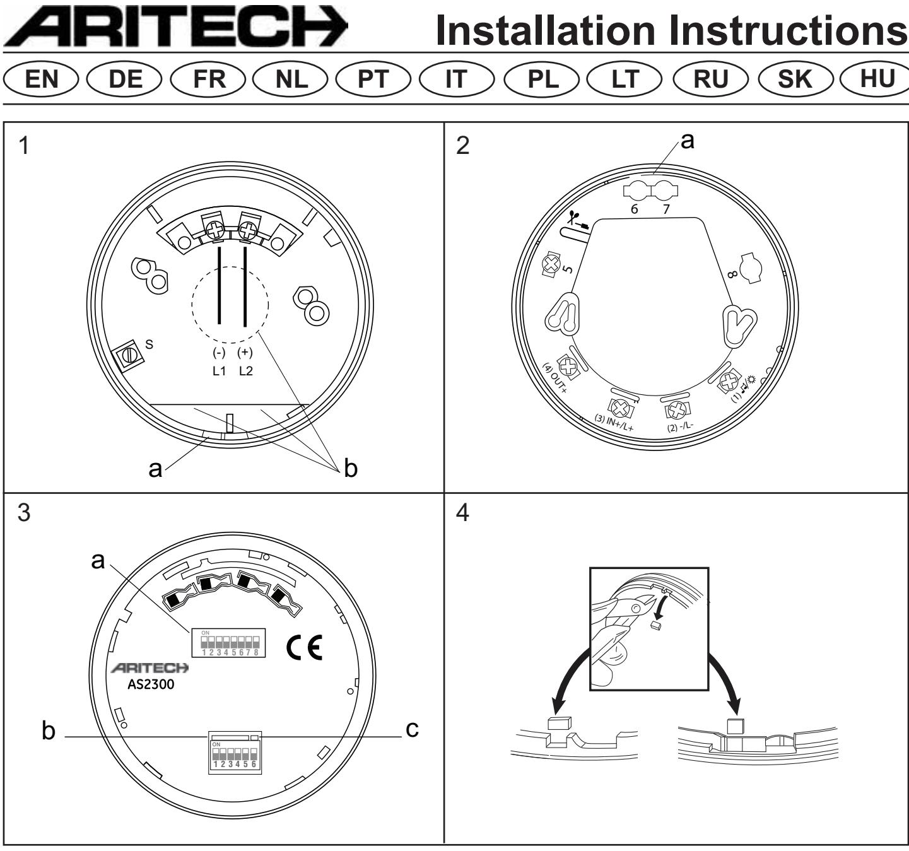
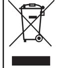
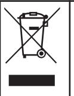
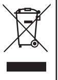
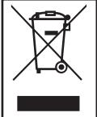
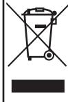

**EN Installation instructions**

# **Description**

This document includes installation information for Aritech AS2300 series addressable, loop powered sounders and sounder/beacons.

AS2300 series sounders and beacons are designed for use in Aritech analogue addressable fire systems running the 2000 Series protocol.

The sounders can be put into different operating modes.

To avoid sound interference between devices in the same locality, the sounders are synchronised automatically.

# **Installation**

**CAUTION:** This product must be installed by qualified personnel adhering to the TS54-14 specification and any other applicable local authority regulations.

The AS2300 series is polarity sensitive.

Drill out the cable entries and mounting holes as required on the base. (See figure 1b.) A 20mm hole cutter must be used for the deep base cable entries since attempting to knock them out may crack the base.

Secure the base to the mounting surface with pan-head screws.

UTC Fire & Security BV. Kelvinstraat 7, NL- 6003DH Weert, The Netherlands. +31 495 45 67 35 +31 495 55 00 42

# **AS2300 Series Loop Powered Sounders & Sounder/Beacons**

# **Electrical connections**

Electrical connections marked on the product are as follows:

L+ = Line (positive) L- = Line (negative) E = earth / screen

**Note:** The separate earth terminal is provided on the deep base for connecting the screen or functional earth. On the shallow base, terminal 5 can be used for this purpose. (See figures 1 and 2)

# **Addressing**

Each device requires a numeric address between 1 and 128 for identification purposes. This is set using switches 1-8 on the Address Selector DIP switch (see Figure 3a). See the table at the end of this document for a complete list of address settings.

When the AS2366 or AS2367 is used in conjunction with the FP1200/2000 range of fire panels, the device must have an address of 80 or higher when it is used as a sounder and beacon. When an address lower than 80 is assigned to the device, it will function as a sounder only, without the beacon flashing.

# **Tone selection and volume control**

The device tone is set using switches 1-5 on the Tone Selector DIP switch (see Figure 3b). See the table at the end of this document for a complete list of tone / DIP switch settings.

Switch 6 on the Tone Selector DIP switch is used to select the sound volume (See figure 3c). The default setting (switch OFF) is high volume. Changing the switch to ON reduces the sound output by 8dB.

# **Locking mechanism**

To lock a sounder onto the base, remove the locking tab on the base as shown in Figure 4, before attaching the sounder.

# **To remove a locked sounder,**

- Remove the small rubber bung from the hole on the side of the sounder.
- Insert a screwdriver (or similar) into the hole and press the clip at the same time as twisting the sounder head.

**Note:** the O-ring and bung must be fitted to maintain the weatherproofing.

## **Maintenance and testing**

Basic maintenance is reduced to an annual inspection. Do not modify internal wiring or circuitry. Test all devices after installation.

# **Troubleshooting**

Before investigating individual units for faults, check the system wiring is fault free. Earth faults on data loops may cause communication errors.

# **Common problems and causes are:**

| Problem         | Possible Cause                         |
|-----------------|----------------------------------------|
| No response or  | Incorrect address setting or incorrect |
| missing         | loop wiring (polarity reversed)        |
| Device fails to | Control panel has incorrect cause and  |
| operate         | effect programming                     |

# **Technical specification:**

| Supply voltage  17 to 28 VDC                       |               |
|----------------------------------------------------|---------------|
| Current consumption @ 24 VDC:                      |               |
| Switch on surge  < 1.2 mA                          |               |
| Standby  310 µA                                    |               |
| Alarm (Sounder)  5.1 mA                            |               |
| Alarm (Beacon)  3 mA                               |               |
| Peak Sound Level @ 90º ± 3 dB(A)  97dBA dBA at 1m* |               |
| Number of Tones  32                                |               |
| Frequency Range  400 - 2850 Hz*                    |               |
| Volume Adjustment ………………… 8db (Typical)            |               |
| Synchronisation  Automatic                         |               |
| Casing  High Impact                                |               |
|                                                    | Polycarbonate |
| IP rating (shallow base)  IP21                     |               |
| IP rating (deep base)  IP65                        |               |
| Cable size  min. 0.28 mm2/                         |               |
|                                                    | max. 2.5 mm2  |
| Operating temperature  -10°C to +55°C              |               |
| Storage temperature  -10ºC to +55ºC                |               |
| Relative humidity (non condensing) 5% to 95%       |               |
| Dimensions (shallow base) (dia x h)  100 x 81 mm   |               |
| Dimensions (deep base) (dia x h)  100 x 104 mm     |               |
| Weight (shallow base)  215 g                       |               |
| Weight (deep base)  250 g                          |               |
| Device Type Code  0E (H)                           |               |

*depends on selected tone and input voltage. See tone table for details. Certified on tones 1,2,3,6,7 & 13 only.

| Certification and approvals information |                                                                                                                                                      |  |
|-----------------------------------------|------------------------------------------------------------------------------------------------------------------------------------------------------|--|
| Product code                            | AS2363, AS2364, AS2363W, AS2364W AS2366, AS2367, AS2366W, AS2367W, AS2366WY, AS2367WY                                                          |  |
| Description                             | Addressable Sounder and Sounder/Beacon                                                                                                               |  |
| Certification                           |                                                                                                                                                      |  |
| Compliance                              | EN54-3 Type A                                                                                                                                        |  |
| CPD certification body               | BRE Global Ltd and LPCB                                                                                                                              |  |
| CPD certificate number               | AS2363, AS2363W: 0832-CPD-1342 AS2364, AS2364W: 0832-CPD-1343 AS2366,AS2366W,AS2366WY: 0832-CPD-1344 AS2367,AS2367W,AS2367WY: 0832-CPD-1345 |  |
| CPD certificate year                 | The year of certification is included in the first two digits of your product serial number (located on the product identification label).     |  |
| Technical Data Document              | 18-187051                                                                                                                                            |  |

Products marked with this symbol cannot be disposed of as unsorted municipal waste in the European Union. For proper recycling, return this product to your local supplier upon the purchase of equivalent new equipment, or dispose of it at designated collection points.

For more information see: www.recyclethis.info.

# **DE Installationsanleitung**

# **Adressierbare, von der Schleife gespeiste Sounder & Sounder/Warnleuchten, Serie AS2300**

# **Beschreibung**

Dieses Dokument erläutert den Einbau der adressierbaren, von der Schleife gespeisten Sounder und Sounder/Warnleuchten der Serie AS2300 von Aritech.

Sounder und Warnleuchten der Serie AS2300 sind ausgelegt zur Verwendung in analogen, adressierbaren Brandmeldeanlagen vom Typ Aritech, die unter dem Protokoll der Serie 2000 laufen und Modelle für die Verwendung im Freien und in Innenräumen umfassen.

Die Sounder können in unterschiedliche Betriebsarten geschaltet werden.

Um Toninterferenzen zwischen verschiedenen Soundern am gleichen Ort zu vermeiden, werden die Sounder automatisch synchronisiert.

# **Installation**

**VORSICHT:** Dieses Produkt darf nur von Fachpersonal nach TS54-14 und allen anderen zutreffenden Vorschriften und Bestimmungen der zuständigen regionalen Behörden installiert werden.

Die Serie AS2300 ist polaritätssensibel.

Die Kabeleinführungsöffnungen und Befestigungslöcher am Meldersockel aufbohren. (Siehe Abb. 1b.) Für die Kabeleinführungen der tiefen Meldersockel muss ein 20-mm-Lochschneider benutzt werden; nicht versuchen, die Kabeleinführungen herauszudrücken, weil dadurch Risse im Meldersockel verursacht werden könnten.

Den Meldersockel an der Montagefläche mit Flachkopfschrauben sichern.

# **Elektrische Anschlüsse**

Die Kennzeichnung der elektrischen Anschlüsse am Produkt ist wie folgt: L+ = Plusleiter (positiv)

- L- = Minusleiter (negativ) E = Erdung/Schirmung
**Hinweis:** Die separate Erdungsklemme am tiefen Meldersockel ist für den Anschluss an die Schirmung bzw. Funktionserdung vorgesehen. Am flachen Meldersockel kann für diesen Zweck die Anschlussklemme 5

# **Adressierung**

Zu Zwecken der Kennung ist für jedes Gerät eine numerische Adresse zwischen 1 und 128 erforderlich. Diese wird mit den Schaltern 1-8 am Address Selector DIP-Schalter eingestellt (siehe Abb. 3a). Eine Übersicht über alle Adresseinstellungen entnehmen Sie bitte der Tabelle am Ende dieses Dokuments.

Wenn Modell AS2366 oder AS2367 zusammen mit der Brandmeldezentrale FP1200/2000 Serie eingesetzt wird, muss das Gerät eine Adresse von 80 haben oder höher, wenn es als Alarm (Sounder) und Warnleuchte verwendet wird. Wenn dem Gerät eine Adresse unter 80 zugewiesen wurde, wird dieses nur als Alarm fungieren, also ohne blinkende Warnleuchte!

## **Tonauswahl und Lautstärkeregelung**

benutzt werden (siehe Abbildungen 1 und 2).

Der Alarmton des Geräts wird mit den Schaltern 1-5 am Tone Selector DIP-Schalter eingestellt (siehe Abb. 3b). Eine Übersicht über alle Toneinstellungen / DIP-Schaltereinstellungen finden Sie in der Tabelle am Ende dieses Dokuments.

Schalter 6 am Tone Selector DIP-Schalter dient zur Regelung der Tonlautstärke (siehe Abb. 3c). Die Standardeinstellung (Schalter AUS) ist hohe Lautstärke. Wird der Schalter auf EIN gestellt, so wird die Tonausgabe um 8 dB verringert.

# **Verriegelung**

Um einen Sounder an einem Meldersockel anzubringen, wird die Sperre am Sockel wie in Abb. 4 gezeigt, entfernt, bevor der Sounder eingesetzt wird.

# **Entfernen eines verriegelten Sounders:**

**•** Den kleinen Gummistopfen aus dem Loch an der Seite des Sounders entfernen. • Einen Schraubendreher (oder ein ähnliches Werkzeug) in das Loch einsetzen;

gleichzeitig den Clip drücken und den Sounderkopf drehen. **Hinweis:** Damit der Brandmelder wetterfest bleibt, müssen der O-Ring und Stopfen eingebaut sein.

# **Wartung und Prüfung**

Die grundlegende Wartung ist auf eine jährliche Inspektion beschränkt. Die Innenverdrahtung oder Stromkreise dürfen nicht modifiziert werden. Alle Geräte nach dem Einbau prüfen!

# **Fehlerbehebung**

Bevor die einzelnen Geräte auf Störungen untersucht werden, muss geprüft werden, dass die Verdrahtung des Systems fehlerfrei ist. Erdschlüsse in Datenschleifen können Kommunikationsfehler verursachen.

# **Häufige Probleme und Ursache sind:**

| Problem                       | Mögliche Ursache                                                                         |
|-------------------------------|------------------------------------------------------------------------------------------|
| Keine Reaktion                | Falsche Adresseinstellung oder fehlerhafte Schleifenverdrahtung (Polarität umgekehrt) |
| Betriebsausfall des Geräts | Die Ursache-und-Wirkung-Programmierung der Systemsteuerung ist fehlerhaft             |

# **Technische Daten:**

| Versorgungsspannung  17 bis 28 V DC                     |  |
|---------------------------------------------------------|--|
| Stromverbrauch bei 24 V DC:                             |  |
| Einschaltspitze  <1,2 mA                                |  |
| Standby  310 µA                                         |  |
| Alarm (Sounder)  5,1 mA                                 |  |
| Alarm (Warnleuchte)  3 mA                               |  |
| Spitze Geräuschpegel bei 90 º ± 3 dB(A)  97dBA in 1 m*  |  |
| Anzahl der Töne  32                                     |  |
| Frequenzbereich  400 - 2.850 Hz*                        |  |
| Lautstärkeregelung …………………… 8 db (typisch)              |  |
| Synchronisation  Automatisch                            |  |
| Gehäuse  Schlagfestes Polycarbonat                      |  |
| IP-Schutzart (flacher Meldersockel)  IP21               |  |
| IP-Schutzart (tiefer Meldersockel)  IP65                |  |
| Kabelgröße  min. 0.28 mm2/max. 2.5 mm2                  |  |
| Betriebstemperatur  -10 ºC bis +55 ºC                   |  |
| Lagertemperatur  -10 ºC bis +55 ºC                      |  |
| Relative Feuchte (nicht kondensierend) 5 % bis 95 %     |  |
| Abmessungen (flacher Meldersockel) (Ø x H)  100 x 81 mm |  |
| Abmessungen (tiefer Meldersockel) (Ø x H)  100 x 104 mm |  |
| Gewicht (flacher Meldersockel)  215 g                   |  |
| Gewicht (tiefer Meldersockel)  250 g                    |  |
| Code Gerätetyp  0E (H)                                  |  |

* Abhängig vom ausgewählten Ton und der Eingangsspannung. Angaben: Siehe Ton-Tabelle. Nur zertifiziert für Töne 1,2,3,6,7 & 13.

| Zertifizierung und Genehmigungen  |                                                                                                                                                          |  |
|-----------------------------------|----------------------------------------------------------------------------------------------------------------------------------------------------------|--|
| Produktcode                       | AS2363, AS2364, AS2363W, AS2364W, AS2366, AS2367, AS2366W, AS2367W, AS2366WY, AS2367WY                                                             |  |
| Bezeichnung                       | Adressierbarer Sounder und Sounder/Warnleuchte                                                                                                           |  |
| Zertifizierung                    |                                                                                                                                                          |  |
| Konformität                       | EN54-3 Typ A                                                                                                                                             |  |
| CPD- Zertifizierungsstelle     | BRE Global Ltd und LPCB                                                                                                                                  |  |
| Nummer des CPD-Prüfzertifikats | AS2363, AS2363W: 0832-CPD-1342 AS2364, AS2364W: 0832-CPD-1343 AS2366, AS2366W, AS2366WY: 0832-CPD-1344 AS2367, AS2367W, AS2367WY: 0832-CPD-1345 |  |
| Jahr des CPD- Zertifikats      | Das Jahr der Zertifizierung ist durch die ersten zwei Ziffern der Seriennummer des Produkts (am Produkt-Kennschild) angegeben.                     |  |
| Technisches Datenblatt         | 18-187051                                                                                                                                                |  |

Produkte die mit diesem Symbol gekennzeichnet sind, durfen nicht als u nsortierter städtischer Abfall in der europäischen Union entsorgt werden. Fur die korrekte Wiederverwertung bringen Sie dieses Produkt zu Ihrem lokalen Lieferanten nach dem Kauf der gleichwertigen neuen Ausrustung zuruck, oder entsorgen Sie das Produkt an den gekennzeichneten Sammelstellen. Weitere Informationen hierzu finden Sie auf der folgenden Website: www.recyclethis.info.

# **FR Notice d'instructions**

# **Sirène adressable de série Aritech AS2300, alimentée en boucle**

# **Description**

Ce document comprend des informations relatives à l'installation de sondeurs de série Aritech AS2300, adressables, mécaniques en boucle fermée et de sondeur/balises.

Les sondeurs et les balises de série AS2300 sont conçus pour être utilisés sur des réseaux d'incendie adressables, de type Aritech, qui utilisent le protocole de série 2000 et incluent des modèles pour une utilisation intérieure et extérieure.

Les sondeurs ont différents modes de fonctionnement.

Les sons sont automatiquement synchronisés pour éviter toute interférence avec des sondeurs situés à proximité.

# **Installation**

**ATTENTION :** Ce produit doit être installé par un personnel qualifié qui respecte le cahier des charges TS54-14 et toutes les autres règles applicables propres à l'autorité locale. La série AS2300 est sensible à la polarité.

Percez les entrées de câble et les trous de montage, à la base, comme indiqué. (Voir figure 1b.) Utilisez une scie emporte-pièce de 20mm pour séparer les entrées de câble de la base de haute profondeur.

Fixez la base à la surface de fixation à l'aide de vis à tête cylindrique.

## **Connexions électriques**

Les connexions électriques qui figurent sur le produit sont les suivantes :

- L+ = Ligne (positive)
- L- = Ligne (négative)
- E = terre / écran

**Note :** La base est munie d'une borne de terre distincte, à la base de haute profondeur, qui permet de connecter l'écran ou la terre. Sur la base de faible profondeur, la borne 5 peut être utilisée à cet effet. (Voir figures 1 et 2).

## **Adressage**

Chaque outil nécessite une adresse numérique d'identification comprise entre 1 et 128. Des interrupteurs 1-8 de commutateur d'adresse DIP, permettent d'effectuer ce paramétrage. (Voir figure 3). Reportez-vous à la table figurant en bas de ce document, pour obtenir une liste complète des paramétrages d'adresse.

Lorsque le AS2366 ou le AS2367 est utilisé avec la gamme FP1200/2000 d'alarmes anti-incendie, le périphérique doit avoir une adresse de 80 ou plus lorsqu'il est utilisé en tant que sondeur ou balise. Lorsqu'une adresse inférieure à 80 est assignée au périphérique, il fonctionnera seulement en tant que sondeur, sans que la balise ne clignote.

# **Sélection du son et réglage du volume**

Le son de l'appareil se règle à l'aide d'interrupteurs 1-5 du commutateur DIP (voir figure 3b). Reportez-vous à la table figurant en bas de ce document, pour obtenir une liste complète des paramétrages du son / commutateur DIP.

L'interrupteur 6, du commutateur de sélecteur de sons DIP, permet de sélectionner le volume du son (voir figure 3c). Le réglage par défaut (hors circuit) correspond à un volume important. Positionnez l'interrupteur sur ON pour réduire la sortie du son à 8dB.

# **Démontage d'un sondeur fixé**

Retirez le petit bouchon de caoutchouc de l'orifice, du côté du sondeur. Insérez un tournevis (ou l'équivalent) dans l'orifice et appuyez sur le clip simultanément, pour faire pivoter la tête du sondeur.

**Note :** le joint torique et la bonde doivent être ajustés pour préserver l'étanchéisation du joint.

## **Maintenance et essais**

La maintenance de base se limite à une inspection par an. Ne modifiez pas le câblage ou les circuits internes. Testez tous les appareils après l'installation.

## **Dépannage**

Avant de rechercher les défauts de chacune des unités, vérifiez que le câblage du système est correct. Les défauts à la terre sur les boucles de données, peuvent entraîner des erreurs de communication.

# **Problèmes les plus fréquents et leurs causes :**

| Du problème                                                    | Cause possible                                        |
|----------------------------------------------------------------|-------------------------------------------------------|
| Pas de réponse ou paramétrage câblage de l'adresse manquant | incorrecte boucle, incorrecte (polarité inversée)  |
| L'appareil ne fonctionne pas                                   | la programmation du tableau de bord est incorrecte |

# **Spécification technique :**

| Tension d'alimentation  17 à 28 V CC                 |                  |
|------------------------------------------------------|------------------|
| Consommation de courant @ 24 VDC:                    |                  |
| Surtension de l'alimentation  < 1.2 mA               |                  |
| Réserve  310 µA                                      |                  |
| Alarme (sondeur)  5.1 mA                             |                  |
| Alarme (balise)  3 mA                                |                  |
| Niveau sonore de crête @ 90º ± 3 dB(A)  97dBA à 1m*  |                  |
| Nombre de sons  32                                   |                  |
| Bande de fréquences  400 - 2850 Hz*                  |                  |
| Réglage du volume …………………… 8db (typique)             |                  |
| Synchronisation  Automatique                         |                  |
| Boîtier  Polycarbonate à résistance                  |                  |
|                                                      | élevée aux chocs |
| Valeur nominale IP (base de faible profondeur)  IP21 |                  |
| Valeur nominale IP (base de haute profondeur)  IP65  |                  |
| Taille du câble  min. 0.28 mm2/max. 2.5 mm2          |                  |
| Température d'exploitation  -10°C à +55°C            |                  |
| Température de stockage  -10ºC à +55ºC               |                  |
| Degré hygrométrique (sans condensation) 5% à 95%     |                  |
| Dimensions (base de faible profondeur) 100 x 81 mm   |                  |
| Dimensions (base de haute profondeur) 100 x 104 mm   |                  |
| Poids (base de faible profondeur)  215 g             |                  |
| Poids (base de haute profondeur)  250 g              |                  |
| Code du type d'unité  0E (H)                         |                  |
|                                                      |                  |

*dépend du son sélectionné et de la tension d'entrée. Pour de plus amples détails, reportez-vous à la table de son. Certifiée uniquement pour les sons 1, 2, 3, 6, 7 et 13.

| Informations relative s à la certification et à l'agrément |                                                                                                                                                                                    |  |
|------------------------------------------------------------|------------------------------------------------------------------------------------------------------------------------------------------------------------------------------------|--|
| Code de produit                                            | AS2363,AS2364,AS2363W,AS2364W,AS2366, AS2367,AS2366W,AS2367W,AS2366WY, AS2367WY                                                                                              |  |
| Description                                                | Du sondeur adressable et sondeur/balise                                                                                                                                            |  |
| Certification                                              |                                                                                                                                                                                    |  |
| Conformité                                                 | EN54-3 Type A                                                                                                                                                                      |  |
| Organisme de certification DPC                          | BRE Global Ltd et LPCB                                                                                                                                                             |  |
| Numéro de certificat DPC                                   | AS2363,AS2363W: 0832-CPD-1342 AS2364,AS2364W: 0832-CPD-1343 AS2366,AS2366W,AS2366WY: 0832-CPD-1344 AS2367,AS2367W,AS2367WY: 0832-CPD-1345                                 |  |
| Année du certificat DPC                                    | L'année de certification correspond aux deux premiers caractères numériques du numéro de série de votre produit (mentionnés sur l'étiquette d'identification du produit). |  |
| Fiche technique                                            | 18-187051                                                                                                                                                                          |  |

Les produits marqués de ce symbole peuvent pas être éliminés comme déchets municipaux non triés dans l'Union européenne. Pour le recyclage, retourner ce produit à votre fournisseur au moment de l'achat d'un nouvel équipement équivalent, ou à des points de collecte désignés. Pour plus d'informations, voir: www.recyclethis.info.

# **NL Montageinstructies**

# **AS2300 Sirenes en Sirene/Flitslichtcombinaties met lusvoeding**

# **Beschrijving**

In dit document vindt u informatie over de installatie van de Aritech AS2300 adresseerbare, lusgevoede sirenes en sirene/flitslichtcombinaties.

De AS2300 sirenes en flitslichten zijn ontworpen voor Aritech analoge adresseerbare brandalarmsystemen die gebruik maken van het protocol van de 2000-serie, en kunnen zowel binnenshuis als buitenshuis worden geïnstalleerd.

De sirenes kunnen op verschillende alarmmodi worden ingesteld.

De geluidssignalen worden automatisch gesynchroniseerd zodat interferentie tussen sirenes binnen dezelfde ruimte wordt voorkomen.

# **Installatie**

**LET OP:** Dit product moet worden geïnstalleerd door gekwalificeerde vakmensen die zich houden aan de norm TS-54-14 en elke overige toepasbare plaatselijke regelgeving. De AS2300-modellen zijn polariteitgevoelig.

Boor in de bodemplaat de nodige kabel- en bevestigingsopeningen uit. (Zie afb. 1b.) Voor de kabelopeningen in modellen met een diepe bodemplaat moet een gatenzaag van 20mm worden gebruikt; door te proberen de openingen uit te kloppen, kan de plaat barsten.

Schroef de bodemplaat op de montageplaat vast met bolkopschroeven.

# **Elektrische aansluitingen**

De elektrische aansluitingen zijn op het product als volgt gemarkeerd:

L+ = Voeding (positief)

- L- = Voeding (negatief)
- E = aarde / scherm

**Opmerking**: Op de diepe bodemplaat is een afzonderlijke aardaansluiting voorzien voor de afscherming of functionele aarde. Op de vlakke bodemplaat kan hiervoor aansluitklem 5 worden gebruikt. (Zie afb. 1 en 2.)

# **Adressering**

Voor identificatiedoeleinden is voor elk toestel een numeriek adres tussen 1 en 128 vereist. Dit adres wordt ingesteld door middel van dipschakelaars 1-8 op het adresschakelblok (zie afb. 3a). In de tabel op het eind van dit document vindt u de volledige lijst van adresinstellingen.

Als u de AS2366 of AS2367 gebruikt in combinatie met de FP/1200/2000 serie brandpanelen, dient u eenadres van 80 of hoger toe tekennenaan het apparaat, indien het wordttoegepastalssirene en flitslicht. Alseenadres lager dan 80 wordttoegekendaan het apparaat, zal de flitslichtfunctienietwordengeactiveerd en zal het apparaatalleenalssirenedienen.

# **Toonselectie en volumeregeling**

Het geluidssignaal wordt ingesteld door middel van dipschakelaars 1-5 op het toonschakelblok (zie afb. 3b). In de tabel op het eind van dit document vindt u de volledige lijst van toon- / dipschakelaarinstellingen.

Met dipschakelaar 6 op het toonschakelblok selecteert u het geluidsvolume (zie afb. 3c). De fabrieksinstelling (schakelaar op OFF) is Hoog volume. Door deze schakelaar op ON te zetten wordt het geluidsvolume met 8dB verminderd.

# **Vergrendelingsmechanisme**

Om de sirene op de bodemplaat te bevestigen verwijdert u het vergrendelingsblokje (zie afb. 4) en plaatst u vervolgens de sirene.

# **Een vergrendelde sirene demonteren**

Verwijder de kleine rubberen spon uit de opening in de zijkant van de sirene. Steek een schroevendraaier (of iets dergelijks) in de opening en druk op de klem terwijl u de bovenkant van de sirene verdraait.

**Opmerking:** Voor de weerbestendigheid moeten de O-ring en de spon worden aangebracht.

# **Onderhoud en controle**

Het basisonderhoud blijft beperkt tot een jaarlijkse inspectie. Wijzig in geen geval de interne bedrading of het schakelschema. Controleer na de installatie de werking van alle toestellen.

# **Bij problemen**

Controleer de systeembedrading op storingen voordat u afzonderlijke units op gebreken onderzoekt. Gebreken in de aardverbinding van datalussen kunnen tot communicatiefouten leiden.

# **Veel voorkomende problemen en hun oorzaak:**

| Probleem                  | Mogelijke oorzaak                                                          |
|---------------------------|----------------------------------------------------------------------------|
| Geen respons of ontbreekt | Foutief adres ingesteld of fout in bedrading lus (polariteit omgekeerd) |
| Toestel werkt niet        | Bedieningspaneel is verkeerd geprogram meerd voor oorzaak en gevolg     |

## **Technische gegevens**:

| Voedingsspanning  17 - 28 V DC                          |  |
|---------------------------------------------------------|--|
| Stroomverbruik bij 24 V DC:                             |  |
| Piek bij inschakelen  < 1,2 mA                          |  |
| Stand-by  310 µA                                        |  |
| Alarm (Sirene)  5,1 mA                                  |  |
| Alarm (Flitslicht)  3 mA                                |  |
| Hoogste geluidsniveau op 90º ± 3 dB(A)  97 dBA op 1 m*  |  |
| Aantal beschikbare tonen  32                            |  |
| Frequentiebereik  400 - 2850 Hz*                        |  |
| Volumeregeling  8db (typisch)                           |  |
| Synchronisatie  Automatisch                             |  |
| Behuizing  Slagvast polycarbonaat                       |  |
| IP-classificatie (vlakke bodemplaat)  IP 21             |  |
| IP-classificatie (diepe bodemplaat)  IP 65              |  |
| Kabeldikte  min. 0.28 mm2/max. 2.5 mm2                  |  |
| Bedrijfstemperatuur  -10°C tot +55°C                    |  |
| Opslagtemperatuur  -10ºC tot +55ºC                      |  |
| Relatieve vochtigheid (zonder condens)  5% tot 95%      |  |
| Afmetingen (vlakke bodemplaat) (dia x h) … 100 x 81 mm  |  |
| Afmetingen (diepe bodemplaat) (dia x h) …. 100 x 104 mm |  |
| Gewicht (vlakke bodemplaat)  215 g                      |  |
| Gewicht (diepe bodemplaat)  250 g                       |  |
| Code toesteltype  0E (H)                                |  |

* afhankelijk van geselecteerde toon en ingangsspanning. Raadpleeg de toontabel voor meer informatie. Alleen gecertificeerd voor tonen 1, 2, 3, 6, 7 en 13.

| Informatie over certificaten en goedkeuringen |                                                                                                                                                      |  |
|-----------------------------------------------|------------------------------------------------------------------------------------------------------------------------------------------------------|--|
| Productcode                                   | AS2363,AS2364,AS2363W,AS2364W,AS2366, AS2367,AS2366W,AS2367W,AS2366WY, AS2367WY                                                                |  |
| Beschrijving                                  | Adresseerbare sirene en sirene/flitslicht                                                                                                            |  |
| Certificaat                                   |                                                                                                                                                      |  |
| Conform met                                   | EN54-3                                                                                                                                               |  |
| CPD certificatie-instelling                   | BRE Global Ltd en LPCB                                                                                                                               |  |
| CPD certificaat-nummer                        | AS2363,AS2363W: 0832-CPD-1342 AS2364,AS2364W: 0832-CPD-1343 AS2366,AS2366W,AS2366WY: 0832-CPD-1344 AS2367,AS2367W,AS2367WY: 0832-CPD-1345   |  |
| CPD certificatiejaar                          | De eerste twee cijfers van het serienummer van uw toestel geven het certificatiejaar aan (het serienummer vindt u op het identi ficatielabel). |  |
| Technisch datadocument                        | 18-187051                                                                                                                                            |  |

Producten met deze label mogen niet verwijdert worden via de gemeentelijke huisvuilscheiding in de Europese Gemeenschap. Voor correcte vorm van kringloop, geef je de producten terug aan jou locale leverancier tijdens het aankopen van een gelijkaardige nieuw toestel, of geef het af aan een gespecialiseerde verzamelpunt. Meer informatie vindt u op de volgende website: www.recyclethis.info.

# **PT Manual de Instalação**

# **Sinalizadores Sonoros e Sinalizadores Sonoros/Luminosos Alimentados em Circuito Fechado Série AS2300**

# **Descrição**

Este documento inclui informações de instalação para sinalizadores sonoros e sonoros/luminosos alimentados em circuito fechado e endereçáveis Aritech série AS2300.

Os sinalizadores sonoros e luminosos série AS2300 são projetados para uso nos sistemas de incêndio analógicos endereçáveis Aritech executando o protocolo Série 2000 e inclui modelos para uso interno e externo.

Os sinalizadores sonoros podem ser postos em diferentes modos operacionais.

Os tons são automaticamente sincronizados para evitar interferência entre sinalizadores no mesmo local.

## **Instalação**

**CUIDADO:** Este produto deve ser instalado por pessoal qualificado aderindo à especificação TS54-14 e a qualquer outro regulamento local aplicável. A série AS2300 é sensível à polaridade.

Perfure as entradas de cabos e furos de montagem na base conforme for necessário (veja a Figura 1b). Será necessário usar um corta-furos de 20 mm para as entradas de cabos da base funda porque se tentar fazer os furos por meio de batidas poderá rachar a base.

Fixe a base à superfície de montagem com parafusos de cabeça plana.

### **Conexões elétricas**

As conexões elétricas marcadas no produto são as seguintes:

L+ = linha (positivo)

- L- = linha (negativo)
- E = terra / blindagem

**Nota:** É fornecido um terminal de terra separado na base funda para conectar a blindagem ou o terra funcional. Na base rasa, o terminal 5 pode ser usado para este fim (veja as Figuras 1 e 2)

#### **Endereçamento**

Cada dispositivo exige um endereço numérico entre 1 e 128 para fins de identificação. Este endereço é definido usando as chaves 1-8 do DIP switch do Seletor de Endereços (veja a Figura 3a). Consulte a tabela no fim deste documento para uma lista completa das definições de endereço.

Quando o AS2366 ou o AS2367 são usados em conjunto com a gama FP1200/2000 de painéis de incêndio, o dispositivo deve ter um endereço de 80 ou superior quando é usado como um sinalizador sonoro e luminoso. Quando um endereço inferior a 80 é atribuído ao dispositivo, irá funcionar apenas como um sinalizador sonoro, sem o piscar do sinalizar luminoso.

## **Seleção do tom e controle do volume**

O tom do dispositivo é definido usando as chaves 1-5 do DIP switch Seletor de Tons (veja a Figura 3b). Consulte a tabela no fim deste documento para uma lista completa das definições de tom/DIP switch.

A chave 6 do DIP switch Seletor de Tons é usada para selecionar o volume do som (veja a Figura 3c). A definição padrão (chave desligada – OFF) é volume alto. Ao mudar a chave para ligada (ON) reduz o som em 8 dB.

## **Mecanismo de travamento**

Para travar um sinalizador na base, remova a patilha de travamento da base como indicado na Figura 4, antes de introduzir o sinalizador.

## **Remoção de um sinalizador travado**

Remova a pequena rolha de borracha do orifício do lado do sinalizador. Introduza uma chave de fendas (ou semelhante) no orifício e pressione o clipe e ao mesmo tempo torça a cabeça do sinalizador.

**Nota:** O anel em "O" e a rolha devem ser montados para manter a resistência às intempéries.

## **Manutenção e testes**

A manutenção básica consiste em uma inspeção anual. Não modifique a fiação ou os circuitos internos. Teste todos os dispositivos após a instalação.

## **Resolução de problemas**

Antes de investigar falhas nas unidades individuais, confirme que a fiação do sistema não tem nenhum defeito. Falhas de terra e circuitos fechados de dados podem provocar erros de comunicação.

## **Problemas e causas comuns :**

| Problema                       | Causa Possível                                                                                       |
|--------------------------------|------------------------------------------------------------------------------------------------------|
| Nenhuma resposta ou ausente | Definição incorreta do endereço ou fiação incorreta do circuito fechado (polaridade invertida) |
| O dispositivo não funciona     | O painel de controle tem programação incorreta de causa e efeito                                  |

# **Especificações Técnicas :**

| Tensão de alimentação  17 a 28 VCC                  |  |
|-----------------------------------------------------|--|
| Consumo de corrente a 24 VCC:                       |  |
| Surto de ligação  < 1,2 mA                          |  |
| Standby  310 µA                                     |  |
| Alarme (sonoro)  5,1 mA                             |  |
| Alarme (luminoso)  3 mA                             |  |
| Nível de som de pico a 90º ± 3 dB(A)  97 dBA a 1 m* |  |
| Número de tons  32                                  |  |
| Intervalo de frequência  400 – 2850 Hz*             |  |
| Ajuste do volume …………………… 8 db (típico)             |  |
| Sincronização  Automática                           |  |
| Caixa  Policarbonato de alto impacto                |  |
| Classificação IP (base rasa)  IP21                  |  |
| Classificação IP (base funda)  IP65                 |  |
| Dimensões do cabo  min. 0.28 mm2/max. 2.5 mm2       |  |
| Temperatura operacional  -10°C a +55°C              |  |
| Temperatura de armazenamento  -10°C a +55°C         |  |
| Umidade relativa (sem condensação) 5% a 95%         |  |
| Dimensões (base rasa) (diâm x alt)  100 x 81 mm     |  |
| Dimensões (base funda) (diâm x alt)  100 x 104 mm   |  |
| Peso (base rasa)  215 g                             |  |
| Peso (base funda)  250 g                            |  |
| Código do tipo de dispositivo  0E (H)               |  |
|                                                     |  |

*depende do tom selecionado e da tensão de alimentação. Consulte a tabela de tons para detalhes. Certi¬ficado somente para os tons 1,2,3,6,7 e 13.

## **Certificação e informações sobre aprovação**

| Código do produto              | AS2363,AS2364,AS2363W,AS2364W,AS2366, AS2367,AS2366W,AS2367W,AS2366WY, AS2367WY                                                                       |
|--------------------------------|-------------------------------------------------------------------------------------------------------------------------------------------------------------|
| Descrição                      | Sinalizador sonoro e sonoro/luminoso endereçável                                                                                                            |
| Certificação                   |                                                                                                                                                             |
| Conformidade                   | EN54-3 Tipo A                                                                                                                                               |
| Órgão de certificação CPD      | BRE Global Ltd e LPCB                                                                                                                                       |
| Número de certificação CPD  | AS2363, AS2363W: 0832-CPD-1342 AS2364, AS2364W: 0832-CPD-1343 AS2366,AS2366W,AS2366WY: 0832-CPD-1344 AS2367,AS2367W,AS2367WY: 0832-CPD-1345        |
| Ano de certificação CPD        | O ano de certificação está incluído nos dois primeiros dígitos do número de série do produto (localizado na etiqueta de identificação do produto). |
| Documento de dados técnicos | 18-187051                                                                                                                                                   |

Produtos marcados com este símbolo não podem ser eliminados como resíduos urbanos indiferenciados na União Europeia. Para proceder à reciclagem adequada, devolva este produto ao seu fornecedor local na compra de novo equipamento equivalente, ou entregue-o nos pontos de recolha designados para o efeito. Para mais informações, ver www.recyclethis.info.

**IT Istruzioni di installazione**

# **Sirene e sirene con lampeggiante alimentati da loop serie AS2300**

# **Descrizione**

Questo documento contiene informazioni riguardanti sirene e sirene con lampeggiante indirizzabili alimentati da loop Aritech Serie AS2300. Le sirene e i lampeggianti della serie AS2300 sono stati progettati per essere utilizzati nei sistemi antincendio indirizzabili analogici Aritech che gestiscono il protocollo serie 2000, e comprendono modelli per uso interno ed esterno.

Le sirene possono essere impostate in modalità operative diverse. I toni vengono sincronizzati automaticamente per evitare l'interferenza fra sirene diverse nello stesso sito.

# **Installazione**

**ATTENZIONE:** Questo prodotto deve essere installato da personale qualificato nel rispetto della norma TS54-14 e di qualsiasi altro regolamento locale pertinente. La serie AS2300 è sensibile alla polarità.

Praticare nella base i fori necessari per l'ingresso dei cavi e il montaggio (vedere figura 1b.) Per l'ingresso dei cavi nella base ad alto profilo occorre usare un trapano con punta da 20 mm perché la semplice pressione rischia di incrinare la base.

Fissare la base alla superficie di montaggio per mezzo di viti a testa tronco-conica.

# **Collegamenti elettrici**

I collegamenti elettrici contrassegnati sul prodotto sono i seguenti:

- L+ = Linea (positiva)
- L- = Linea (negativa)
- E = Terra / schermo

**NB** - : sulla base ad alto profilo è previsto un morsetto di terra separato per collegare lo schermo o la terra funzionale. A questo scopo, sulla base a basso profilo, si può usare il morsetto 5 (vedere le figure 1 e 2)

# **Impostazione dell'indirizzo**

A ogni dispositivo occorre assegnare un indirizzo numerico compreso fra 1 e 128 a scopo identificativo. Per far questo si usano gli interruttori 1-8 sul selettore degli indirizzi a dip switch (vedere figura 3a). Per un elenco completo dei valori d'impostazione degli indirizzi, vedere la tabella presente al termine di questo documento.

Quando l'AS2366 o l'AS2367 vengono utilizzati insieme alla gamma di centrali antincendio FP1200/2000, l'indirizzo dell'apparecchio deve essere pari a 80 o più alto quando l'apparecchio è usato come sirena e lampeggiante. Con un indirizzo più basso di 80 l'apparecchio funzionerà solo come sirena e il lampeggiante non lampeggerà.

# **Scelta del tono e controllo del volume**

Il tono del dispositivo viene impostato per mezzo degli interruttori 1-5 sul selettore a dip-switch dei toni (vedere figura 3b). Per un elenco completo dei valori d'impostazione dei toni / dip-switch, vedere la tabella al termine di questo documento.

L'interruttore 6 sul dip-switch del selettore toni viene usato per impostare il volume sonoro (vedere figura 3c). Il valore pre-impostato (interruttore OFF) è volume alto. Spostando l'interruttore su ON si riduce l'emissione sonora di 8 dB.

# **Meccanismo di bloccaggio**

Per fissare una sirena alla base, togliere la linguetta di bloccaggio come illustrato in figura 4, prima di inserire la sirena.

## **Per estrarre una sirena bloccata**

Togliere il piccolo tappo di gomma dal foro che si trova sul lato della sirena. Inserire un cacciavite (o un attrezzo simile) nel foro e contemporaneamente premere il fermaglio e ruotare la testa della sirena. **NB:** perchè l'apparecchiatura possa essere resistente alle intemperie occorre montare l'O-ring e il tappo.

# **Manutenzione e collaudo**

La manutenzione di base si riduce a un'ispezione annuale. Non modificare la cavetteria o il circuito interno. Collaudare tutti gli apparecchi dopo l'installazione.

# **Localizzazione dei guasti**

Prima di ricercare eventuali guasti presenti su apparecchi singoli, controllare che non vi siano guasti sulla cavetteria del sistema. I guasti a terra sui loop di trasmissione dei dati possono causare errori di comunicazione.

# **Problemi e cause comuni sono :**

| Problema                   | Causa possibile:                                                                      |
|----------------------------|---------------------------------------------------------------------------------------|
| Mancanza di risposta       | Impostazione indirizzo sbagliata o ca blaggio del loop errato (polarità invertita) |
| L'apparecchio non funziona | Il quadro comandi ha una program mazione causa-effetto errata                      |

# **Caratteristiche tecniche :**

| Tensione di alimentazione  da 17 a 28 VDC                      |                     |
|----------------------------------------------------------------|---------------------|
| Consumo di corrente @ 24 VDC:                                  |                     |
| Sovracorrente all'accensione  < 1,2 mA                         |                     |
| A riposo  310 µA                                               |                     |
| Allarme (sirena)  5,1 mA                                       |                     |
| Allarme (lampeggiante)  3 mA                                   |                     |
| Livello sonoro massimo @ 90º ± 3 dB(A)  97 dBA a 1m*           |                     |
| Numero di toni  32                                             |                     |
| Campo di frequenza  400 - 2.850 Hz*                            |                     |
| Regolazione volume …………………… 8 db (valore tipico)               |                     |
| Sincronizzazione  Automatica                                   |                     |
| Custodia  Policarbonato ad alta                                |                     |
|                                                                | resistenza all'urto |
| Protezione IP (base a basso profilo) … IP21                    |                     |
| Protezione IP (base ad alto profilo) … IP65                    |                     |
| Dimens. cavi  min. 0,28 mm2/                                   |                     |
|                                                                | massima 2,5 mm2     |
| Temperatura di esercizio …………… da -10°C a +55°C                |                     |
| Temperatura di stoccaggio  da -10ºC a +55ºC                    |                     |
| Umidità relativa (senza condensa)  da 5% a 95%                 |                     |
| Dimensioni (base a basso profilo) (diam. x alt.)  100 x 81 mm  |                     |
| Dimensioni (base ad alto profilo) (diam. x alt.)  100 x 104 mm |                     |
| Peso (base a basso profilo)  215 g                             |                     |
| Peso (base ad alto profilo)  250 g                             |                     |
| Codice del tipo di apparecchio  0E (H)                         |                     |

*dipende dal tono selezionato e dalla tensione d'ingresso. Per i dettagli vedere la tabella dei toni. Certificato solo sui toni 1,2,3,6,7 & 13.

| Informazioni sulla certificazione e le omologazioni |                                                                                                                                                       |  |
|-----------------------------------------------------|-------------------------------------------------------------------------------------------------------------------------------------------------------|--|
| Codice Prodotto                                     | AS2363,AS2364,AS2363W,AS2364W,AS2366, AS2367, AS2366W, AS2367W, AS2366WY, AS2367WY                                                              |  |
| Descrizione                                         | Sirena e sirena/fanale indirizzabile                                                                                                                  |  |
| Certificazione                                      |                                                                                                                                                       |  |
| Conformità                                          | EN54-3 Tipo A                                                                                                                                         |  |
| Ente di certificazione CPD                          | BRE Global Ltd and LPCB                                                                                                                               |  |
| N. del certificato CPD                              | AS2363, AS2363W: 0832-CPD-1342 AS2364, AS2364W: 0832-CPD-1343 AS2366,AS2366W,AS2366WY: 0832-CPD-1344 AS2367,AS2367W,AS2367WY: 0832-CPD-1345  |  |
| Anno del certificato CPD                            | L'anno di certificazione è incluso nelle prime due cifre del n. di matricola del prodotto (situato sull'etichetta identificativa del prodotto). |  |
| Documenta dei Dati tecnici 18-187051                |                                                                                                                                                       |  |

I prodotti contrassegnati con questo simbolo, non possono essere smaltiti nei comuni contenitori per lo smaltimento rifiuti, nell'Unione Europea. Per il loro corretto smaltimento, potete restituirli al vostro fornitore locale a seguito dell'acquisto di un prodotto nuovo equivalente, oppure rivolgervi e consegnarli presso i centri di raccolta preposti. Per maggiori informazioni vedere: ww.recyclethis.info.

# **PL Instrukcja montażu**

# **Akustyczny sygnalizator zasilany z pętli i sygnalizator optyczno-akustyczny serii AS2300**

# **Opis**

Niniejszy dokument obejmuje informacje dotyczące montażu dla adresowalnych, zasilanych z pętli sygnalizatorów akustycznych i sygnalizatorów optycznoakustycznych serii Aritech AS2300.

Sygnalizatory akustyczne i optyczne serii AS2300 zostały zaprojektowane do użycia w adresowalnych analogiczne systemach przeciwpożarowych obsługujących protokół serii 2000 i obejmują modele odpowiednio przystosowane do użytku wewnątrz i na zewnątrz budynków.

Sygnalizatory można ustawić na różne tryby pracy.

Sygnały są automatycznie synchronizowane, co zapobiega zakłóceniom pomiędzy sygnalizatorami położonymi w bliskiej odległości od siebie.

# **Montaż**

**UWAGA:** Produkt ten musi zostać zainstalowany przez wykwalifikowany personel stosujący się do warunków specyfikacji TS54-14 i innych odpowiednich przepisów władz lokalnych. Seria AS2300 jest wrażliwa na polaryzację.

Wywiercić wejścia kabli i otworów mocujących w miejscach wskazanych w podstawie (patrz rysunek 1b). Do tworzenia głębokich wejść w podstawie należy użyć wycinarki otworów o przekroju 20 mm, ponieważ próby ich wybijania mogą zakończyć się pęknięciem podstawy.

Przykręcić podstawę wkrętami z łbem walcowym z gniazdem do powierzchni montażowej.

## **Połączenia elektryczne**

Połączenia elektryczne zaznaczone na produkcie to:

L+ = Lina (dodatnia)

L- = Lina (ujemna)

E = Uziemienie / osłona

**Uwaga:** Osobny zacisk uziomowy został zapewniony do podstawy głębokiej w celu podłączenia osłony lub uziemienia funkcjonalnego. W przypadku płytkiej podstawy, zacisk 5. może zostać użyty w tym celu (patrz rysunki 1 i 2).

### **Adresowanie**

Każde urządzenie wymaga adresu numerycznego pomiędzy 1 a 128 w celach identyfikacyjnych. Jest on ustawiany przy pomocy przełączników 1- 8 na mikroprzełączniku DIP selektora adresów (patrz rysunek 3a). Tabela znajdującą się na końcu niniejszego dokumentu zawiera pełną listę ustawień adresowych.

W trakcie korzystania jednocześnie z urządzeń serii AS2366 lub AS2367 i z centrali sygnalizacji pożaru serii FP1200/2000 urządzenie musi mieć nadany adres o wysokości 80 lub więcej, kiedy używane jest jako sygnalizator akustyczno-optyczny. Jeśli urządzeniu nadany zostanie adres niższy niż 80 będzie ono funkcjonowało jedynie jako sygnalizator akustyczny bez elementu świetlnego

## **Wybór sygnału i kontrola głośności**

Sygnał urządzenia można ustawić korzystając z przełączników 1- 5 na mikroprzełączniku DIP selektora sygnałów (patrz rysunek 3b). Tabela znajdującą się na końcu niniejszego dokumentu zawiera pełną listę sygnałów/ustawień mikroprzełącznika DIP.

Przełącznik 6 na mikroprzełączniku DIP selektora sygnałów służy do wyboru głośności dźwięku (patrz rysunek 3c). Ustawienia domyślne (WYŁĄCZENIE) to punkt wysokiej głośności dźwięku. Zmiana przełącznika na tryb WŁĄCZONY zmniejsza wyjście akustyczne o 8dB.

### **Mechanizm blokujący**

W celu zablokowania sygnalizatora akustycznego w podstawie należy usunąć zapadkę blokującą znajdującą się na podstawie zgodnie z rysunkiem 4., przed umieszczeniem w niej sygnalizatora.

### **Zdejmowanie zablokowanego sygnalizatora**

Wyjąć małą gumową zatyczkę z otworu znajdującego się na bocznej stronie sygnalizatora. Do otworu wprowadzić śrubokręt (lub podobne narzędzie) i nacisnąć zacisk jednocześnie przekręcając głowicę sygnalizatora.

**Uwaga:** należy zamontować uszczelkę o przekroju okrągłym i zatyczkę, aby zapewnić utrzymanie odporności na warunki atmosferyczne.

#### **Konserwacja i testowanie**

Podstawowe czynności konserwacyjne przeprowadzane są co roku. Nie należy modyfikować okablowania wewnętrznego lub zespołu obwodów elektrycznych. Po zakończeniu montażu należy przetestować wszystkie urządzenia.

#### **Postępowanie w przypadku wystąpienia problemów**

Przed przystąpieniem do badania poszczególnych jednostek urządzenia pod kątem wykrycia usterek należy sprawdzić czy w systemie okablowania nie wystąpiły usterki. Usterki uziemienia na pętlach informacyjnych mogą powodować błędy komunikacyjne.

# **Najczęściej występujące problemy są wywoływanie przez:**

| Problem                                     | Prawdopodobna przyczyna                                                |
|---------------------------------------------|------------------------------------------------------------------------|
| Brak odpowiedzi                             | Niepoprawne ustawienia adresowe lub                                    |
|                                             | niepoprawne okablowanie pętli                                          |
|                                             | (zmiana polaryzacji)                                                   |
| Urządzenie nie działa                       | Panel kontrolny ma niepoprawne programowanie przyczynowo –skutkowe. |
| Specyfikacja techniczna :                   |                                                                        |
|                                             | Napięcie zasilania  17 do 28 VDC                                       |
| Zużycie prądu przy 24 VDC:                  |                                                                        |
|                                             | Prąd udarowy przy włączeniu < 1,2 mA                                   |
|                                             | Tryb gotowości  310 µA                                                 |
|                                             | Alarm (sygnalizator akustyczny)  5,1 mA                                |
|                                             | Alarm (sygnalizator optyczny)  3 mA                                    |
|                                             | Punkt najwyższej głośności przy 90º ± 3 dB(A)  97 dBA przy 1m*         |
| Liczba sygnałów  32                         |                                                                        |
|                                             | Zakres częstotliwości  400 - 2850 Hz*                                  |
|                                             | Dostosowywanie głośności …………………… 8db (typowo)                         |
|                                             | Synchronizacja  automatyczna                                           |
|                                             | Obudowa  poliwęglan wysokiej klasy                                     |
| Stopień ochrony IP (płytka podstawa)  IP21  |                                                                        |
| Stopień ochrony IP (głęboka podstawa)  IP65 |                                                                        |
|                                             | Rozmiar kabla  min.kwadratowe0.28mm2 /                              |
|                                             | maxkwadratowe2.5mm2                                                    |
|                                             | Temperatura pracy -10°C do +55°C                                       |
|                                             | Temperatura przechowywania  -10ºC do +55ºC                             |
|                                             | Wilgotność względna (bez kondensacji) 5% do 95%                        |
|                                             | Wymiary (płytka podstawa) (przekątna x wysokość)  100 x 81 mm          |
|                                             | Wymiary (głęboka podstawa) (przekątna x wysokość)  100 x 104 mm        |
|                                             | Waga (płytka podstawa)  215 g                                          |
|                                             | Waga (głęboka podstawa)  250 g                                         |
|                                             | Rodzaj kodu urządzenia  0E (H)                                         |

*zależy od wybranego sygnału i napięcia wejściowego; szczegóły znajdują się w tabeli sygnałów; certyfikowany tylko na sygnałach 1,2,3,6,7 i 13.

| Informacje na temat certyfikatów i zatwierdzeń |                                                                                                                                                        |  |
|------------------------------------------------|--------------------------------------------------------------------------------------------------------------------------------------------------------|--|
| Kod produktu                                   | AS2363,AS2364,AS2363W,AS2364W,AS2366, AS2367,AS2366W,AS2367W,AS2366WY, AS2367WY                                                                  |  |
| Opis                                           | Adresowalny sygnalizator akustyczny i optyczno-akustyczny                                                                                           |  |
| Certyfikat                                     |                                                                                                                                                        |  |
| Zgodne z                                       | EN54-3 rodzaj A                                                                                                                                        |  |
| Organ certyfikatu CPD                          | BRE Global Ltd and LPCB                                                                                                                                |  |
| Numer certyfikatu CPD                          | AS2363, AS2363W: 0832-CPD-1342 AS2364, AS2364W: 0832-CPD-1343 AS2366,AS2366W,AS2366WY: 0832-CPD-1344 AS2367,AS2367W,AS2367WY: 0832-CPD-1345   |  |
| Rok certyfikatu CPD                            | Pierwsze dwie cyfry naszego numeru seryjnego (umieszczonego na tabliczce indentyfikacyjnej produktu) reprezentują rok przyznania certyfikatu. |  |
| Dokument zawierający dane techniczne        | 18-187051                                                                                                                                              |  |

W Unii Europejskiej produkty oznaczone tym symbolem mogą być usuwane tylko jako posegregowane odpady komunalne. Dla zapewnienia właściwej utylizacji, należy zwrócić ten produkt do dostawcy przy zakupie ekwiwalentnego, nowego urządzenia albo dostarczyć go do wyznaczonego punktu zbiórki. Więcej informacji można znaleźć na stronie internetowej www.recyclethis.info.

# **LT Montavimo instrukcijos**

# **AS2300 serijos iš kontūro maitinami garso signalizatoriai ir garso signalizatoriai su švyturėliais**

## **Aprašymas**

Šiame dokumente pateikta informacija apie 'Aritech AS2300' serijos adresuojamųjų, iš kontūro maitinamų garso signalizatorių ir garso signalizatorių su švyturėliais montavimą.

AS2300 serijos garso signalizatoriai ir švyturėliai yra skirti naudoti 'Aritech' analoginėse adresuojamose priešgaisrinėse sistemose, veikiančiose 2000 serijos protokolo pagrindu; jų modelių yra skirtų naudoti tiek patalpose, tiek ir lauke.

Garso signalizatoriai gali veikti skirtingais darbo režimais.

Tonai automatiškai sinchronizuojami siekiant išvengti toje pačioje vietoje įrengtų garso signalizatorių trukdžių.

## **Montavimas**

**DĖMESIO:** šį gaminį turi montuoti kvalifikuoti darbuotojai, laikydamiesi TS54-14 specifikacijos ir visų kitų taikomų vietos valdžios nustatytų taisyklių. AS2300 serijos signalizatoriai yra jautrūs poliškumui.

Kaip reikalaujama, pagrinde išgręžkite kabelių įvadus ir montavimo skyles. (Žr. 1b pav.) Gręžiant kabelių įvadus įleidžiamajame pagrinde reikia naudoti 20 mm gręžimo antgalį, nes mėginant juos išmušti pagrindas gali skilti.

Pritvirtinkite pagrindą prie montuojamojo paviršiaus varžtais su užapvalintomis galvutėmis.

## **Elektrinės jungtys**

Elektrinės jungtys ant gaminio yra paženklintos taip:

- L+ = linija (teigiama)
- L– = linija (neigiama)
- E = įžeminimas / ekranas

**Pastaba:** ant įleidžiamojo pagrindo yra atskiras įžeminimo gnybtas ekranui arba aktyviajai įžeminimo jungčiai prijungti. Paviršinio pagrindo atveju šiam tikslui galima naudoti gnybtą Nr. 5. (Žr. 1 ir 2 pav.)

### **Adresavimas**

Identifikavimo sumetimais kiekvienam signalizatoriui turi būti priskirtas skaitmeninis adresas nuo 1 iki 128. Jis nustatomas naudojant adresų selektoriaus DIP perjungiklio 1–8 jungiklius (žr. 3a pav.). Visas adresų nuostatų sąrašas pateiktas šio dokumento pabaigoje.

Naudojant AS2366 arba AS2367 kartu su FP1200/2000 serijos priešgaisriniais skydais, prietaisas privalo turėti adresą 80 arba aukštesnį, kada jis naudojamas kaip garsinis įspėjimas ir švyturėlis. Kai prietaisui priskiriamas žemesnis nei 80 adresas, jis veiks tik kaip garsinis įspėjimas, o švyturėlis nemirksės.

### **Tono parinkimas ir garsumo reguliavimas**

Signalizatoriaus tonas nustatomas naudojant tono selektoriaus DIP perjungiklio 1–5 jungiklius (žr. 3b pav.). Visas tonų ir DIP perjungiklio nuostatų sąrašas pateiktas šio dokumento pabaigoje.

Tonų selektoriaus DIP perjungiklio 6 jungiklis naudojamas parinkti garsumo lygį (žr. 3c pav.). Standartinė nuostata (perjungiklis padėtyje OFF) atitinka didžiausią garsumo lygį. Nustačius perjungiklį į padėtį ON garso stiprumas sumažinamas 8 dB.

#### **Fiksuojamasis mechanizmas**

Norėdami užfiksuoti garso signalizatorių ant pagrindo, prieš įstatydami garso signalizatorių nuimkite nuo pagrindo fiksuojamąją trinkelę, kaip parodyta 4 pav.

### **Užfiksuoto garso signalizatoriaus nuėmimas**

Išimkite guminį kamštelį iš skylės, esančios ant garso signalizatoriaus šono. Įstatykite atsuktuvą (arba panašų įrankį) į skylę ir nuspauskite spaustuką tuo pat metu sukdami garso signalizatoriaus galvutę.

**Pastaba:** sandarinamąjį žiedą ir kamštelį reikia uždėti, kad signalizatorius būtų apsaugotas nuo atmosferos poveikio.

### **Priežiūra ir bandymas**

Pagrindinė priežiūra apribota tik kasmetine patikra. Nedarykite jokių vidinių laidų ir grandyno modifikacijų. Po sumontavimo išbandykite visus signalizatorius.

## **Trikčių aptikimas ir šalinimas**

Prieš ieškodami atskirų prietaisų trikčių patikrinkite, ar nėra trikčių sistemos laidų jungtyse. Duomenų kontūrų įžeminimo triktys gali sukelti ryšio klaidas.

# **Dažniausiai pasitaikančios problemos ir jų priežastys yra tokios:**

| Problema                                              | Galima priežastis                                                                                   |  |  |
|-------------------------------------------------------|-----------------------------------------------------------------------------------------------------|--|--|
| Nėra atsako                                           | Neteisingas adreso nustatymas arba neteisingai sujungti kontūro laidai (sukeistas poliškumas) |  |  |
| Prietaisas neveikia                                   | Valdymo skyde neteisingai užprogramuota priežastis ir rezultatas                                 |  |  |
| Techninė specifikacija:                               |                                                                                                     |  |  |
|                                                       | Maitinimo įtampa  17–28 V (nuolatinė srovė)                                                         |  |  |
| Srovės sąnaudos esant 24 V nuolatinės srovės įtampai: |                                                                                                     |  |  |
|                                                       | Įjungimo viršįtampis  < 1,2 mA                                                                      |  |  |
|                                                       | Parengtis  310 µA                                                                                   |  |  |
| Pavojaus signalas (garso signalizatorius)  5,1 mA     |                                                                                                     |  |  |
|                                                       | Pavojaus signalas (švyturėlis)  3 mA                                                                |  |  |
|                                                       | Maksimalus garsumo lygis esant 90º ± 3 dB(A)  97 dBA 1m atstumu*                                    |  |  |
| Tonų skaičius  32                                     |                                                                                                     |  |  |
|                                                       | Dažnių diapazonas  400–2850 Hz*                                                                     |  |  |
|                                                       | Garsumo reguliavimas …………………… 8db (tipinis)                                                         |  |  |
|                                                       | Sinchronizacija  automatinė                                                                         |  |  |
|                                                       | Korpusas  didelio atsparumo                                                                         |  |  |
|                                                       | smūgiams polikarbonatas                                                                             |  |  |
|                                                       | IP klasė (paviršinis pagrindas)  IP21 IP                                                            |  |  |
| klasė (įleidžiamasis pagrindas)  IP65                 |                                                                                                     |  |  |
|                                                       | Kabelio dydis  min. kv. 0.28 mm2 /                                                                  |  |  |
|                                                       | maks. kv. 2.5 mm2                                                                                   |  |  |
|                                                       | Darbinė temperatūra  nuo -10°C iki +55°C                                                            |  |  |
|                                                       | Laikymo temperatūra  nuo -10ºC iki +55ºC                                                            |  |  |
|                                                       | Santykinis oro drėgnumas (be kondensacijos) nuo 5% iki 95%                                          |  |  |
|                                                       | Matmenys (paviršinis pagrindas) (skersmuo x h)  100 x 81 mm                                         |  |  |
|                                                       | Matmenys (įleidžiamasis pagrindas) (skersmuo x h)  100 x 104 mm                                     |  |  |
| Masė (paviršinis pagrindas)  215 g                    |                                                                                                     |  |  |
| Masė (įleidžiamasis pagrindas)  250 g                 |                                                                                                     |  |  |
| Prietaiso tipo kodas  0E (H)                          |                                                                                                     |  |  |
|                                                       |                                                                                                     |  |  |

*priklausomai nuo parinkto tono ir įvado įtampos. Išsamiau žr. tonų lentelėje. Sertifikuoti tonai yra tik 1, 2, 3, 6, 7 ir 13,

| Sertifikavimo ir patvirtinimo informacija |                                                                                                                                                      |  |
|-------------------------------------------|------------------------------------------------------------------------------------------------------------------------------------------------------|--|
| Gaminio kodas                             | AS2363,AS2364,AS2363W,AS2364W,AS2366, AS2367, AS2366W, AS2367W, AS2366WY, AS2367WY                                                             |  |
| Aprašymas                                 | Adresuojamas garso signalizatorius ir garso signalizatorius su švyturėliu                                                                         |  |
| Sertifikavimas                            |                                                                                                                                                      |  |
| Atitiktis                                 | EN54-3, A tipas                                                                                                                                      |  |
| CPD sertifikavimo institucija             | BRE Global Ltd ir LPCB                                                                                                                               |  |
| CPD sertifikato numeris                   | AS2363, AS2363W: 0832-CPD-1342 AS2364, AS2364W: 0832-CPD-1343 AS2366,AS2366W,AS2366WY: 0832-CPD-1344 AS2367,AS2367W,AS2367WY: 0832-CPD-1345 |  |
| CPD sertifikavimo metai                   | Sertifikavimo metus nurodo pirmieji du jūsų gaminio serijos numerio (nurodyto ant jūsų gaminio identifikavimo etiketės) skaitmenys.         |  |
| Techninių duomenų dokumentas           | 18-187051                                                                                                                                            |  |

Įrangą, pažymėtą šiuo simboliu, draudžiama šalinti Europos Sąjungos viešose nerūšiuotų atliekų šalinimo sistemose. Eksploatavimui nebetinkamą įrangą pristatykite į tam skirtas surinkimo vietas arba, perkant naujus anlogiškus gaminius, grąžinkite ją pardavėjui, kad ji būtų tinkamai utilizuota. Daugiau informacijos rasite šioje interneto svetainėje: www.recyclethis.info.

# **RU Инструкции по монтажу**

## **Пожарные извещатели и извещатели-маячки серии AS2300 с питанием по кольцевой схеме Инструкции по монтажу**

# **Описание**

В настоящем документе содержится информация по монтажу адресных, питаемых по кольцевой схеме извещателей и извещателей-маячков серии AS2300 компании Aritech.

Извещатели и маячки серии AS2300 предназначаются для использования в адресно-аналоговых системах пожарной сигнализации компании Aritech, которые работают по протоколу серии 2000 (2000 Series), и включают модели для применения как внутри, так и снаружи помещений.

Извещатели могут настраиваться на разные рабочие режимы.

Звуковые сигналы автоматически синхронизируются, с тем чтобы не допускать перекрывания сигнализации от извещателей, расположенных поблизости на одной и той же площадке.

## **Монтаж**

**ПРЕДУПРЕЖДЕНИЕ:** Данное изделие должно устанавливаться квалифицированными специалистами с соблюдением технических условий TS54-14 и любых других применимых инструкций местных служб. Устройства серии AS2300 требуют соблюдения правильной полярности.

Высверлите отверстия для кабельных вводов и монтажные отверстия, необходимые на основании. (См. Рис. 1b). Для проникновения кабелей через основание большей толщины должно использоваться сверло диаметром 20 мм, поскольку получение отверстий путем выколотки может привести к растрескиванию основания.

Прикрепите основание к монтажной поверхности с помощью винтов с плоской цилиндрической головкой.

## **Электрические соединения**

Для осуществления электрических соединений изделие маркируется следующим образом:

- L+ = Линия (плюс)
- L- = Линия (минус) E = земля / экран

Примечание: На основании большей толщины предусмотрен отдельный концевик заземления для подсоединения экрана или рабочего заземления. На основании меньшей толщины для этой цели может использоваться концевик 5. (См. Рис. 1 и 2).

## **Адресация**

Для целей идентификации каждое устройство требует присвоения цифрового адреса от 1 до 128. Это задается с помощью выключателей 1-8 на DIP-переключателе выбора адреса (см. Рис. 3a). Полный перечень адресных настроек приводится в таблице в конце данного документа.

Когда устройство серии AS2366 или AS2367 используется вместе с пожарными панелями семейства FP1200/2000, то у него должен быть цифровой адрес от 80 и выше, для того, чтобы оно выполняло функции пожарного извещателя и извещателя-маячка. Если присвоен цифровой адрес ниже 80, то устройство будет функционировать только как пожарный извещатель, без мигающего маячка

## **Выбор звукового тона и регулировка громкости**

Звуковой тон устройства настраивается с помощью выключателей 1- 5 на DIP-переключателе выбора звукового тона (см. Рис. 3b). Полный перечень настроек звукового тона/ DIP-переключателей приводится в таблице в конце данного документа.

Для выбора громкости звука используется выключатель 6 на DIPпереключателе выбора звукового тона (см. Рис. 3c). Настройкой по умолчанию (выключатель в положении ВЫКЛ.) является высокая громкость. Перевод выключателя в положение ВКЛ. приводит к снижению громкости звука на 8 дБ

## **Фиксирующий механизм**

Для фиксации извещателя на основании снимите запорную лапку на основании, как показано на Рис. 4, прежде чем вставлять извещатель.

## **Для снятия зафиксированного извещателя**

Извлеките небольшую резиновую пробку из отверстия на боковой стороне извещателя. Вставьте отвертку (или другой подобный инструмент) в отверстие и

нажмите на зажим-клипсу, одновременно поворачивая головку извещателя.

**Примечание:** уплотнительное кольцо и пробка должны быть установлены для обеспечения защиты от воздействия внешних условий.

## **Техническое обслуживание и проверка**

Техническое обслуживание заключается в ежегодной одноразовой проверке. Не вводите изменения в во внутреннюю проводку или в схему. Проверяйте все устройства после их установки.

## **Определение и устранение неисправностей**

Прежде чем проводить поиск неисправностей в отдельных устройствах, проверьте отсутствие дефектов в электропроводке системы. Неисправности заземления в контурах данных могут вызывать ошибки связи.

# **Общие проблемы и их причины :**

| Проблема                             | Возможная причина                                                                             |
|--------------------------------------|-----------------------------------------------------------------------------------------------|
| Отсутствие или пропадание реакции | Неправильная настройка адреса или неправильная проводка контура (перепутана полярность) |
| Устройство не работает               | Неправильное программирование причинно-следственной связи для панели управления         |

## **Технические характеристики :**

| Напряжение питания 17 - 28 В пост. тока                      |                  |
|--------------------------------------------------------------|------------------|
| Потребляемый ток при 24 В пост. тока:                        |                  |
| Бросок напряжения при включении  < 1,2 мА                    |                  |
| Режим ожидания  310 мкА                                      |                  |
| Режим сигнализации (извещатель)  5,1 мА                      |                  |
| Режим сигнализации (маячок)  3 мА                            |                  |
| Пиковый уровень звука при 90 ± 3 дБА  97 дБА на расст. 1 м*  |                  |
| Количество звуковых тонов  32                                |                  |
| Диапазон частот  400 - 2850 Гц*                              |                  |
| Регулировка громкости  8 дБ (типовая)                        |                  |
| Синхронизация  Автоматическая                                |                  |
| Корпус  Ударопрочный                                         |                  |
|                                                              | поликарбонат     |
| Класс защиты IP (основание меньшей толщины) IP21             |                  |
| Класс защиты IP (основание большей толщины)  IP65            |                  |
| Размер кабеля  мин. кв.0.28 мм2 /                            |                  |
|                                                              | макс. кв.2.5 мм2 |
| Рабочая температура  -10°C +55°C                             |                  |
| Температура при хранении  -10°C +55°C                        |                  |
| Относительная влажность (без конденсации)  5% - 95%          |                  |
| Размеры (основание меньшей толщины) (диам.х h) 100 х 81 мм   |                  |
| Размеры (основание большей толщины) (диам.х h)  100 х 104 мм |                  |
| Вес (основание меньшей толщины)  215 г                       |                  |
| Вес (основание большей толщины)  250 г                       |                  |
| Шифр типа устройства  0E (H)                                 |                  |

*зависит от выбранного звукового тона и входного напряжения. См. данные в таблице для звуковых тонов. Устройство сертифицировано только для звуковых тонов 1, 2, 3, 6, 7 и 13.

| Данные по сертификации и допуску к эксплуатации |                                                                                                                                                    |
|-------------------------------------------------|----------------------------------------------------------------------------------------------------------------------------------------------------|
| Код изделия AS2366,                          | AS2363, AS2364, AS2363W, AS2364W, AS2367, AS2366W, AS2367W, AS2366WY, AS2367WY                                                               |
| Описание                                        | Адресный извещатель и извещатель-маячок                                                                                                            |
| Сертификация                                    |                                                                                                                                                    |
| Соответствие стандарту                          | EN54-3 Type A                                                                                                                                      |
| Сертификация CPD для корпуса                 | BRE Global Ltd и LPCB                                                                                                                              |
| Номер сертификации CPD                          | AS2363, AS2363W: 0832-CPD-1342 AS2364, AS2364W: 0832-CPD-1343 AS2366,AS2366W,AS2366WY:0832-CPD-1344 AS2367,AS2367W,AS2367WY:0832-CPD-1345 |
| Год сертификации CPD                            | Год сертификации указан первыми двумя цифрами серийного номера вашего изделия (приводится на паспортной табличке изделия).                   |
| Документ Тех. данных                            | 18-187051                                                                                                                                          |

Согласно европейской директиве об отходах электрического и электронного оборудования (WEEE), помеченное этим символом оборудование нельзя утилизировать как обычные отходы на территории ЕС. Для надлежащей утилизации по окончании срока эксплуатации пользователь должен возвратить данное оборудование локальному поставщику в момент покупки аналогичного нового оборудования, или сдать в специальный пункт приема. Подробности можно найти на веб-сайте: www.recyclethis.info.

# **SK Návod na inštaláciu**

# **Slučkovo napájané sirény a kombinácie siréna/maják radu AS2300**

# **Popis**

Tento dokument obsahuje informácie o inštalácii slučkovo napájaných sirén a kombinácií siréna/maják Aritech radu AS2300.

Sirény a majáky radu AS2300 sú určené na použitie v analógových adresovateľných protipožiarnych systémoch Aritech s protokolom radu 2000 a zahŕňajú modely pre interiérové a exteriérové použitie.

Sirény sa dajú uviesť do rôznych prevádzkových režimov.

Tóny sa automaticky synchronizujú, aby sa zabránilo vzájomnému rušeniu medzi jednotlivými sirénami na rovnakom mieste. Sirene diverse nella stessa località.

# **Inštalácia**

**UPOZORNENIE:** Tento výrobok musí inštalovať kvalifikovaný personál a to v súlade so smernicou TS54-14 a všetkými ostatnými miestnymi predpismi. Rad AS2300 si vyžaduje dodržanie správnej polarity.

Na podstavci vyvŕtajte potrebné káblové vstupy a montážne otvory. (Pozri obrázok 1b.) Pri vytváraní káblových vstupoch v hlbokom podstavci je potrebné použiť frézu s priemerom 20 mm, pretože pokus o vyrazenie týchto otvorov by mohlo spôsobiť prasknutie podstavca.

Upevnite podstavec k montážnemu povrchu skrutkami s polguľatou hlavou.

## **Elektrické prípojky**

Elektrické prípojky sú na produkte označené nasledovne:

L+ = vodič (kladný) L- = vodič (záporný) E = uzemnenie / monitor

**Poznámka:** Na hlbokom podstavci sa nachádza samostatná uzemňovacia svorka na pripojenie monitora alebo funkčného uzemnenia. Na plytkom podstavci môžete na tento účel použiť svorku 5. (Pozri obrázky 1 a 2)

### **Adresovanie**

Každé zariadenie si na účely identifikácie vyžaduje číselnú adresu v rozmedzí od 1 do 128. Táto sa nastavuje pomocou spínačov 1-8 na DIP spínači voliča adries (pozri obrázok 3a). Úplný zoznam nastavení adries nájdete v tabuľke na konci tohto dokumentu.

Ak sa AS2366 alebo AS2367 použije spolu s protipožiarnymi panelmi radu FP1200/2000, zariadenie musí mať adresu 80 alebo vyššiu, ak má fungovať ako akustický hlásič (siréna) a maják. Ak sa zariadeniu pridelí adresa nižšia ako 80, bude fungovať iba ako akustický hlásič, bez zábleskov svetelného majáka.

## **Výber tónu a ovládanie hlasitosti**

Tón zariadenia sa nastavuje spínačmi 1-5 na DIP spínači voliča tónov (pozri obrázok 3b). Úplný zoznam tónov/nastavení DIP spínača nájdete v tabuľke na konci tohto dokumentu.

Spínač 6 na DIP spínači voliča tónov sa používa na voľbu hlasitosti (pozri obrázok 3c). Východzie nastavenie (spínač VYP.) je nastavenie na vysokú hlasitosť. Zapnutím spínača sa zníži hlasitosť zvuku o 8 dB.

## **Zaisťovací mechanizmus**

Ak chcete sirénu na podstavci zaistiť, pred vložením sirény odstráňte zaisťovaciu západku na podstavci (podľa obrázku 4). Uvoľnenie zaistenej sirény

Odstráňte malú gumenú zátku z otvoru na bočnej strane sirény. Do otvoru vložte skrutkovač (alebo podobný nástroj), zatlačte sponu a súčasne otáčajte hlavu sirény.

Poznámka: Tesniaci krúžok a zátka musia byť osadené kvôli zachovaniu odolnosti voči okolitým podmienkam.

## **Údržba a testovanie**

Základná údržba predstavuje len každoročnú kontrolu. Nemodifikujte internú kabeláž alebo obvody. Po nainštalovaní všetky zariadenia preskúšajte.

#### **Riešenie problémov**

Skôr, než začnete kontrolovať poruchy jednotlivých jednotiek, skontrolujte neporušenosť systémovej kabeláže. Poruchy uzemnenia na dátových slučkách môžu spôsobiť komunikačné problémy.

# **Bežné problémy a ich príčiny :**

| Problém                                                | Možná príčina                                                             |
|--------------------------------------------------------|---------------------------------------------------------------------------|
| Žiadna odozva alebo vynechanie                         | Nesprávne nastavenie adresy alebo nesprávne zapojená                   |
|                                                        | slučka (otočená polarita)                                                 |
| Zariadenie nefunguje                                   | Ovládací panel nemá správne napro gramovanú logiku príčiny a následk   |
| Technické špecifikácie :                               |                                                                           |
| Prívodné napätie  17 až 28 V DC                        |                                                                           |
| Spotreba prúdu pri 24 V DC:                            |                                                                           |
| Zapínací impulz < 1,2 mA                               |                                                                           |
| Pohotovostný režim  310 µA                             |                                                                           |
| Alarm (siréna)  5,1 mA                                 |                                                                           |
| Alarm (maják)  3 mA                                    |                                                                           |
|                                                        | Vrcholová úroveň hlasitosti pri 90º ± 3 dB(A)  97 dBAvo vzdialenosti 1 m* |
| Počet tónov  32                                        |                                                                           |
| Frekvenčný rozsah  400 - 2850 Hz*                      |                                                                           |
| Nastavenie hlasitosti …………………… 8 db (typické)          |                                                                           |
|                                                        | Synchronizácia  automatická Kryt vysoko                                   |
|                                                        | odolný polykarbonát                                                       |
| Klasifikácia IP (plytký podstavec)  IP21               |                                                                           |
| Klasifikácia IP (hlboký podstavec)  IP65               |                                                                           |
| Veľkosť kábla  min. 0.28 mm2/                          |                                                                           |
|                                                        | max. 2.5 mm2                                                              |
| Prevádzková teplota  -10 °C až +55 °C                  |                                                                           |
| Skladovacia teplota  -10 ºC až +55 ºC                  |                                                                           |
| Relatívna vlhkosť (nekondenzujúca) 5 % až 95 %         |                                                                           |
| Rozmery (plytký podstavec) (priemer x v)  100 x 81 mm  |                                                                           |
| Rozmery (hlboký podstavec) (priemer x v)  100 x 104 mm |                                                                           |
| Hmotnosť (plytký podstavec)  215 g                     |                                                                           |
| Hmotnosť (hlboký podstavec)  250 g                     |                                                                           |
| Typový kód zariadenia  0E (H)                          |                                                                           |

závisí od zvoleného tónu a vstupného napätia. Detaily nájdete v tabuľke tónov. Certifikované len pre tóny 1, 2, 3, 6, 7 a 13.

| Informácie o certifikácii a schválení |                                                                                                                                                    |  |
|---------------------------------------|----------------------------------------------------------------------------------------------------------------------------------------------------|--|
| Kód produktu                          | AS2363,AS2364,AS2363W,AS2364W,AS2366, AS2367,AS2366W,AS2367W,AS2366WY, AS2367WY                                                              |  |
| Popis                                 | Adresovateľná siréna a kombinácia siréna/maják                                                                                                  |  |
| Certifikácia                          |                                                                                                                                                    |  |
| Spĺňa normy                           | EN54-3                                                                                                                                             |  |
| CPD osvedčovací orgán                 | BRE Global Ltd and LPCB                                                                                                                            |  |
| Certifikačné číslo CPD                | AS2363,AS2363W: 0832-CPD-1342 AS2364,AS2364W: 0832-CPD-1343 AS2366,AS2366W,AS2366WY: 0832-CPD-1344 AS2367,AS2367W,AS2367WY: 0832-CPD-1345 |  |
| Rok CPD osvedčenia                    | Certifikačný rok je uvedený v prvých dvoch čísliciach výrobného čísla vášho produktu (nachádza sa na identifikačnom štítku produktu).        |  |
| Technická dokumentácia                | 18-187051                                                                                                                                          |  |

S produktmi označeny^mi ty^mto symbolom sa v Európskej únii nesmie nakladať ako s netriedeny^m komunálnym odpadom. Na správnu recykláciu vráťte tento produkt vášmu lokálnemu dodávateľovi pri nákupe ekvivalentného nového zariadenia alebo ho uložte v na to určeny^ch zberny^ch miestach. Pre viac informácii pozrite: www.recyclethis.info.

# **HU Telepítési utasítások**

# **AS2300 sorozatú hurokról táplált hangjelzők illetve hang-/fényjelzők**

# **Leírás**

Ez a dokumentum a Aritech AS2300 sorozatú, címezhető, hurokról táplál hangjelzők illetve hang-/fényjelzők telepítési információit tartalmazza.

Az AS2300 sorozatú hangjelzőket és fényjelzőket a Aritech analóg címzésű tűzjelző rendszerekben történő használatra tervezték, a 2000 sorozat protokollja szerint működnek, és beltéri illetve kültéri használatra szolgáló modelleket foglalnak magukba.

A hangjelzőket különböző működési módokba lehet beállítani.

A hangtónusokok szinkronizálása automatikusan történik, hogy elkerüljék az ugyanazon a helyen lévő két hangjelző interferenciáját.

# **Telepítés**

**VIGYÁZAT:** E terméket szakképzet személyzetnek, a TS54-14 műszaki jellemzők és egyéb vonatkozó helyi rendeletek szigorú betartásával kell telepíteni. Polaritásérzékeny az AS2300 sorozat

Az aljzatnak megfelelően fúrja ki a kábel bevezető nyílásokat és a szerelési furatokat. (Lásd 1b ábra.) A süllyesztett aljzatoknál, egy 20 mm-es lyukvágót kell használni a kábel bevezető nyílások kivágására, mivel a kiütésük megkísérlése az aljzat töréséhez vezethet.

Kúpfejű csavarokkal rögzítse a szerelési felületre az aljzatot.

# **Elektromos csatlakozások**

A terméken az elektromos érintkezők jelölése a következő:

L+ = vezeték (pozitív) L- = vezeték (negatív) E = föld / árnyékolás

Megjegyzés: Süllyesztett aljzat esetében, az árnyékolás vagy a funkcionális földelés csatlakoztatására egy külön érintkező áll rendelkezésre. (Lásd 1. és 2. ábra.)

# **Címzés**

Azonosítási célból minden eszközhöz 1 és 128 közötti numerikus címet kell rendelni. Ennek beállítást a Címválasztó DIP kapcsolón lévő 1-8 kapcsolókkal lehet elvégezni (lásd 3a ábra). Lásd e dokumentum végén lévő teljes címbeállítási lista.

Amikor az AS2366 vagy az AS2367 eszközt az FP1200/2000 sorozatú tűzjelző központokkal együtt használják, akkor az eszköz címét 80 vagy ennél nagyobb értékre kell beállítani, ha hang- és fényjelzőként használatos. Ha az eszköz címe kisebb, mint 80, akkor csak hangjelzőként működik és a fényjelző nem villog.

# **Hangtónus választás és hangszintszabályozás**

Ezen eszköz hangtónusát a Hangtónus választó DIP kapcsoló 1-5 kapcsolójának használatával lehet beállítani (lásd 3b. ábra). Lásd e dokumentum végén lévő teljes hangtónus / DIP kapcsoló beállítás lista.

A Hangtónus választó DIP kapcsoló 6-os kapcsolója a hangszint beállítására szolgál (lásd 3c ábra). A magas hangszint az alapértelmezett beállítás (OFF állás). 8dB szinttel csökken a hangszint az ON beállítása esetében.

# **Reteszelési mechanizmus**

A hangjelző aljzatra történő rögzítéséhez, a 4. ábrának megfelelően vegye ki az aljzaton lévő reteszelő fület, a hangjelző beszerelése előtt.

# **Reteszelt hangjelző kiszerelése**

Vegye ki a hangjelző oldalán lévő lyukból a kicsi gumidugaszt. Dugjon egy csavarhúzót (vagy hasonlót) a lyukba, majd nyomja meg a kapcsot, miközben elfordítja a hangjelző házát.

Megjegyzés: a vízzárás fenntartására vissza kell az O-gyűrűt és a dugaszt tenni.

## **Karbantartás és ellenőrzés**

Az alap karbantartás az éves átvizsgálásra korlátozódik. Ne módosítsa a belső huzalozást vagy a kapcsolást. Telepítés után az összes eszközt ellenőrizze.

# **Hibaelhárítás**

Mielőtt az egyes egységek hibaelhárításához kezd, ellenőrizze a rendszer vezetékezésének hibamentességét. Az adathurkok földelési hibái kommunikációs hibákat okozhatnak.

# **Általános problémák és okaik :**

| Probléma                      | Lehetséges ok                                                                    |
|-------------------------------|----------------------------------------------------------------------------------|
| Nincs vagy hiányzik a válasz. | Helytelen címbeállítás vagy helytelen hurokvezetékezés (fordított polaritás). |
| Nem működik az eszköz.        | A vezérlő panel helytelen ok és okozat programozása.                          |

# **Műszaki jellemzők** :

| Tápfeszültség  17 és 28 V közötti                                |                         |
|------------------------------------------------------------------|-------------------------|
|                                                                  | egyenfeszültség         |
| Áramfelvétel 24 V egyenfeszültség esetén:                        |                         |
| Bekapcsolási áramlökés  < 1,2 mA                                 |                         |
| Készenlét  310 µA                                                |                         |
| Riasztás (hangjelző)  5,1 mA                                     |                         |
| Riasztás (fényjelző)  3 mA                                       |                         |
| Csúcs hangszint 90º esetén ± 3 dB(A)  97 dBA 1 m*                |                         |
| Hangtónusokok száma  32                                          |                         |
| Frekvenciatartomány  400 - 2850 Hz*                              |                         |
| Hangszint beállítás …………………… 8 db (jellemző)                     |                         |
| Szinkronizálás  Automatikus                                      |                         |
| Ház Ütésálló polikarbonát                                        |                         |
| IP besorolás (alacsony aljzat)  IP21                             |                         |
| IP besorolás (süllyesztett aljzat)  IP65                         |                         |
| Kábelméret  minimum négyzet 0.28 mm2                             |                         |
|                                                                  | maximum négyzet 2.5 mm2 |
| Működési hőmérséklettartomány  -10°C és +55°C között             |                         |
| Tárolási hőmérséklet  -10ºC és +55ºC között                      |                         |
| Relatív nedvességtartalom (nem kicsapódó) 5% és 95% között       |                         |
| Méretek (alacsony aljzat) (átmérő x magasság)  100 x 81 mm       |                         |
| Méretek (süllyesztett aljzat) (átmérő x magasság) . 100 x 104 mm |                         |
| Tömeg (alacsony aljzat)  215 g                                   |                         |
| Tömeg (süllyesztett aljzat)  250 g                               |                         |
| Eszköztípus kód  0E (H)                                          |                         |
|                                                                  |                         |

*a kijelölt hangtónustól és a bemeneti feszültségtől függ. Az adatok a hangtónus táblázatban találhatóak. Csupán az 1,2,3,6,7 és13 hangtónusokra van tanúsítva.

| Tanúsítási és jóváhagyási információk |                                                                                                                                                    |  |
|---------------------------------------|----------------------------------------------------------------------------------------------------------------------------------------------------|--|
| Termékkód                             | AS2363,AS2364,AS2363W,AS2364W,AS2366, AS2367,AS2366W,AS2367W,AS2366WY, AS2367WY                                                              |  |
| Leírás                                | Címezhető hangjelző illetve hang-/fényjelző                                                                                                        |  |
| Tanúsítás                             |                                                                                                                                                    |  |
| Megfelelőség                          | EN54-3Atípus                                                                                                                                       |  |
| CPD tanúsító testület                 | BRE Global Ltd és LPCB                                                                                                                             |  |
| CPD tanúsítványszám                   | AS2363,AS2363W: 0832-CPD-1342 AS2364,AS2364W: 0832-CPD-1343 AS2366,AS2366W,AS2366WY: 0832-CPD-1344 AS2367,AS2367W,AS2367WY: 0832-CPD-1345 |  |
| CPD tanúsítás éve                     | Atanúsítás éve a termék sorozatszámának első két számjegye (a termék azonosítási címkéjén található).                                        |  |
| Műszaki adatok dokumentuma         | 18-187051                                                                                                                                          |  |

Az ezen jellel ellátott termékek az Európai Unión csak a kijelölt módon és helyen dobhatók ki. Az elektronikai hulladék leadható a termék forgalmazójánál az új termék vásárlásakor, vagy a kijelölt elektronikai hulladékudvarokban.

További információ a www.recyclethis.info oldalon.

# **AS2300 SeriesLoop Powered Sounders&Sounder-Beacons Installation Instructions**

# **Address settings**

| 1         | 2          | 3          | 4          | 5          | 6          | 7          |
|-----------|------------|------------|------------|------------|------------|------------|
| 8         | 9          | 01         | 11         | 21         | 31         | 41         |
|           |            |            |            |            |            |            |
| 51        | 61         | 71         | 81         | 91         | 02         | 12         |
| 22        | 32         | 42         | 52         | 62         | 72         | 82         |
| 92 63  | 03 73   | 13 83   | 23 93   | 33 04   | 43 14   | 53 24   |
|           |            |            |            |            |            |            |
| 34        | 44         | 54         | 64         | 74         | 84         | 94         |
| 05        | 15         | 25         | 35         | 45         | 55         | 65         |
| 75        | 85         | 95         | 06         | 16         | 26         | 36         |
| 46 17  | 56 27   | 66 37   | 76 47   | 86 57   | 96 67   | 07 77   |
|           |            |            |            |            |            |            |
| 87        | 97         | 08         | 18         | 28         | 38         | 48         |
| 58        | 68         | 78         | 88         | 98         | 09         | 19         |
| 29        | 39         | 49         | 59         | 69         | 79         | 89         |
| 99 601 | 001 701 | 101 801 | 201 901 | 301 011 | 401 111 | 501 211 |
|           |            |            |            |            |            |            |
| 311       | 411        | 511        | 611        | 711        | 811        | 911        |
| 021       | 121        | 221        | 321        | 421        | 521        | 621        |
| 721       | 821        |            |            |            |            |            |

# **AS2300 Series Loop Powered Sounders & Sounder-Beacons Installation Instructions**

# **TONE SETTING**

| ALARM1 | TONETYPE | TONEDESCRIPTION/ APPLICATION                            | DIPSWITCH            | ALARM 2 | ALARM 3 | Max.dBA@1m |
|--------|----------|---------------------------------------------------------|----------------------|---------|---------|------------|
| 1.     |          | 970Hz                                                   | ON 1 2 3 4 5 6 | 18      | 4       | 97         |
| 2.     |          | 800Hz/970Hz @2Hz                                        | ON 1 2 3 4 5 6    | 1       | 4       | 97         |
| 3.     |          | 800Hz – 970Hz @1Hz                                      | ON 1 2 3 4 5 6    | 1       | 4       | 97         |
| 4.     |          | 970Hz 1s OFF/1s ON                                      | ON 1 2 3 4 5 6    | 1       | 4       | 97         |
| 5.     |          | 970Hz, 0.5s/ 630Hz, 0.5s                                | ON 1 2 3 4 5 6    | 4       | 4       | 97         |
| 6.     |          | 554Hz, 0.1s/ 440Hz, 0.4s (AFNORNFS32 001 )              | ON 1 2 3 4 5 6    | 1       | 4       | 96         |
| 7.     |          | 500–1200Hz,3.5s/ 0.5sOFF(NEN2575:2000'DutchSlow whoop') | ON 1 2 3 4 5 6    | 1       | 4       | 97         |
| 8.     |          | 420Hz 0.625s ON/0.625s OFF(Australia AS1670 Alert tone) | ON 1 2 3 4 5 6    | 9       | 4       | 96         |
| 9.     |          | 500–1200Hz,0.5s/ 0.5sOFFx3/1.5sOFF(AS1670Evacuation)    | ON 1 2 3 4 5 6    | 1       | 4       | 94         |
| 10.    |          | 550Hz/440Hz @0.5Hz                                      | ON 1 2 3 4 5 6    | 19      | 4       | 97         |
| 11.    |          | 970Hz, 0.5s ON/0.5s OFFx 3/ 1.5s OFF(ISO8201 )          | ON 1 2 3 4 5 6    | 1       | 4       | 97         |
| 12.    |          | 2850Hz, 0.5s ON/0.5s OFFx 3/1.5s OFF(ISO8201)           | ON 1 2 3 4 5 6    | 1       | 4       | 91         |
| 13.    |          | 1200Hz – 500Hz @1Hz (DIN 33 404)                        | ON 1 2 3 4 5 6    | 1       | 4       | 94         |
| 14.    |          | 400Hz                                                   | ON 1 2 3 4 5 6    | 18      | 4       | 96         |
| 15.    |          | 550Hz, 0.7s/1000Hz, 0.33s                               | ON 1 2 3 4 5 6    | 1       | 4       | 97         |
| 16.    |          | 1500Hz – 2700Hz @3Hz                                    | ON 1 2 3 4 5 6    | 1       | 4       | 93         |
| 17.    |          | 750Hz                                                   | ON 1 2 3 4 5 6    | 1       | 4       | 90         |
| 18.    |          | 2400Hz                                                  | ON 1 2 3 4 5 6    | 1       | 4       | 91         |
| 19.    |          | 660Hz                                                   | ON 1 2 3 4 5 6    | 18      | 4       | 86         |
| 20.    |          | 660Hz 1.8s ON/1.8s OFF                                  | ON 1 2 3 4 5 6    | 19      | 4       | 86         |
| 21.    |          | 660Hz 0.15s ON/0.15s OFF                                | ON 1 2 3 4 5 6    | 19      | 4       | 85         |
| 22.    |          | 510Hz, 0.25s/ 610Hz, 0.25s                              | ON 1 2 3 4 5 6    | 1       | 4       | 96         |
| 23.    |          | 800/1000Hz 0.5s each (1Hz)                              | ON 1 2 3 4 5 6    | 1       | 4       | 97         |
| 24.    |          | 250Hz – 1200Hz @12Hz                                    | ON 1 2 3 4 5 6    | 1       | 4       | 92         |
| 25.    |          | 500Hz – 1200Hz @0.33Hz                                  | ON 1 2 3 4 5 6    | 1       | 4       | 97         |
| 26.    |          | 2400Hz – 2900Hz @ 9Hz                                   | ON 1 2 3 4 5 6    | 18      | 4       | 89         |
| 27.    |          | 2400Hz – 2900Hz @3Hz                                    | ON 1 2 3 4 5 6    | 18      | 4       | 91         |
| 28.    |          | 800Hz – 970Hz @100Hz                                    | ON 1 2 3 4 5 6    | 1       | 4       | 91         |
| 29.    |          | 800Hz – 970Hz @9Hz                                      | ON 1 2 3 4 5 6    | 1       | 4       | 94         |
| 30.    |          | 800Hz – 970Hz @3Hz                                      | ON 1 2 3 4 5 6    | 1       | 4       | 95         |
| 31.    |          | 800Hz, 0.25s ON/1s OFF                                  | ON 1 2 3 4 5 6    | 1       | 4       | 97         |
| 32.    |          | 500Hz – 1200Hz, 3.75s/0.25s OFF(AS2220)                 | ON 1 2 3 4 5 6    | 8       | 4       | 97         |