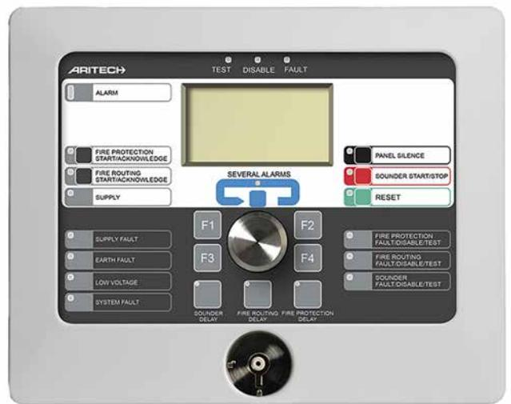

## 2X-FR-SCFB-C

**Brandförsvarstablå för centralapparat 2X**

## 2X-FR-SCFB-C **Brandförsvarstablå för centralapparat 2X**

## **Technical specifications**

## **Mått**

| Physical dimensions | 300 x 140 x 330 mm (W x H x D) |
|---------------------|--------------------------------|
| Net weight          | 1.37 kg                        |
| Shipping weight     | 2 kg                           |
| Mounting type       | Surface Mount                  |

As a company of innovation, UTC Fire & Security reserves the right to change product specifications without notice. For the latest product specifications, visit UTC Fire & Security online or contact your sales representative.

Powered by TCPDF (www.tcpdf.org)