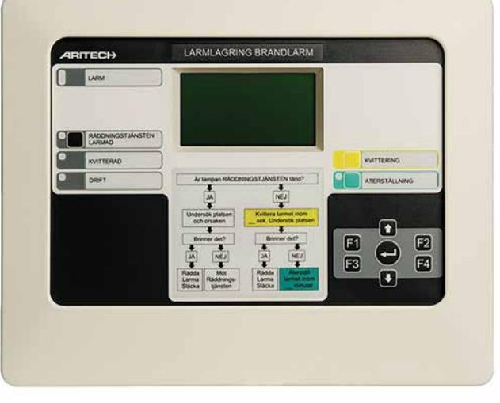

# 2X-FR-D-C

**Larmlagringstablå för centralapparat 2X (kräver att brandcentralen har ett nätverkskort 2010-2-NB installerat).**

## **Översikt**

2X-FR-D-C-06 är en extern larmlagringstablå som uppfyller kraven i SBF 110:6 och SBF 110:7. Larmlagringstablån passar till brandlarmcentraler i 2X-serien. Undersökningstid och larmlagringstid kan programmeras mellan 1 till 10 minuter. Enheten är försedd med en grafisk LCD-display och LED-indikeringar för brand, kvittering, räddningstjänsten larmad och drift. Aktivering av larmlagring sker via centralapparaten. Larmlagringstablån är försedd med 2 övervakade programmerbara ingångar, 1 reläutgång för brand, 1 reläutgång för fel, 1 RS232, 2 USB och 1 Ethernetport.

## **Enkel installation**

2X-FR-SCFB-C-06 har ett inbyggt nätverkskort och ansluts enkelt till Aritechs centralapparater i 2X-serien via ett nätverk (Firenet), dit även enheter som brandförsvarstablåer och repeaters kan anslutas. Anslutningen i centralapparaten sker via ett nätverkskort (2010-2-NB) som beställs separat. Kabeln som används till brandnätverket Firenet är Cat5 och den maximala kabellängden mellan centralapparat och larmlagringstablå är 1200 meter.

### **Användarvänlig**

Larmlagringstablån ger tydlig information om vilken eller vilka sektioner och detektorer som larmar för brand eller fel och förenklar handhavandet för både användare och räddningstjänst. Enheten är kompakt i sitt utförande och monteras på vägg.

#### **Godkännanden**

- CE / CPD
- BS5839-1-kompatibel
- WEEE / RoHS-kompatibel

### **Details**

- Uppfyller kraven i SBF 110:6 och SBF 110:7
- Programmerbar kvitterings- och undersökningstid 1-10 minuter
- Grafisk LDC-display med information i klartext
- Ethernet port med TCP/IP för fjärrdiagnostik, underhåll och programmering
- 2 USB-anslutningar, 1 RS232-anslutning
- 2 övervakade programmerbara ingångar
- 2 reläutgångar, brand och fel
- Redundant Firenet nätverkskommunikation
- Redundant 24 VDC matning
- DIN-montage eller skruv

# 2X-FR-D-C

**Larmlagringstablå för centralapparat 2X (kräver att brandcentralen har ett nätverkskort 2010-2-NB installerat).**

## **Technical specifications**

| Mått                |                                |
|---------------------|--------------------------------|
| Physical dimensions | 300 x 140 x 330 mm (W x H x D) |
| Net weight          | 1.37 kg                        |
| Shipping weight     | 2 kg                           |
| Mounting type       | Surface Mount                  |

As a company of innovation, UTC Fire & Security reserves the right to change product specifications without notice. For the latest product specifications, visit UTC Fire & Security online or contact your sales representative.

Powered by TCPDF (www.tcpdf.org)