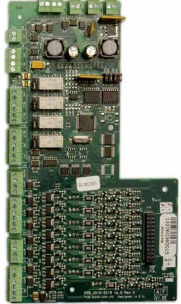

# 2010-2-PIB **IO-kort 8 ingångar/8 utgångar, övervakade + 4 reläutgångar**

#### **Översikt**

IO-kort med 8 övervakade in- och 8 utgångar + 4 reläutgångar till brandlarmcentral 2X med stor kapsling.

#### **Funktion**

2010-2-PIB IO-kort har 8 övervakade in- och utgångar samt 4 reläutgångar (N.O) för kompatibla centralaparater i 2X-serien med stor kapsling. Kortet kan drivas från centralapparaten eller från en extern strömkälla, vilket ger 24 VDC till var och en av de övervakade utgångarna. Vid användning av en extern strömkälla kan utgångarna belastas med 500 mA vardera. Ingångar och utgångar (ej reläutgångar) övervakas för kortslutning och avbrott. 2010-2-PIB används också tillsammans med ADP-ESPA-U för kommunikation via ESPA 4.4.4.

#### **Montering och anslutning**

2010-2-PIB pluggas på direkt på centralkortet. Anslutningsplintarna på in- och utgångar är jackbara. Kortet kan matas med en extern strömförsörjning för att minska på centralens belastning och kunna belasta utgångarna med en högre last.

#### **Details**

- 8 övervakade ingångar
- 8 övervakade utgångar
- 4 reläutgångar (N.C)
- Möjlighet till extern strömmatning
- Interface till ESPA 4.4.4 via RS-485
- Jackbara anslutningsplintar

## 2010-2-PIB **IO-kort 8 ingångar/8 utgångar, övervakade + 4 reläutgångar**

#### **Technical specifications**

| Electrical                  |                                                     |
|-----------------------------|-----------------------------------------------------|
| Power supply type           | VDC                                                 |
| Operating voltage           | 24 VDC                                              |
| Physical                    |                                                     |
| Physical dimensions         | 105 x 192 mm (W x H)                                |
| Net weight                  | 164 g                                               |
| Shipping weight             | 240 g                                               |
| Mounting type               | In cabinet                                          |
| Environmental               |                                                     |
| Operating temperature       | +5 to +40°C                                         |
| Storage temperature         | -20 to +50°C                                        |
| Relative humidity           | 10 to 95% noncondensing                             |
| Standards & regulation      |                                                     |
| Certification               | EN54-2, EN54-13                                     |
| Standards                   | EN54-2, EN54-13                                     |
| Environmental               | CPD, WEEE, RoHS                                     |
| Operating voltage           |                                                     |
|                             | 24 VDC                                              |
|                             |                                                     |
| Current supply              |                                                     |
| Standby                     | 40 mA max.                                          |
| Activated                   | 4050 mA max.                                        |
| Current per output          |                                                     |
| Activated                   | 500 mA at 25°C                                      |
| Input activation (VdS)      |                                                     |
| Open circuit                | >3.9 kOhm                                           |
| Quiescent                   | 2.2 kOhm to 3.3 kOhm                                |
| Activated                   | 60.2 Ohm to 1.7 kOhm                                |
| Short circuit               | <60.2 Ohm                                           |
| Input activation (standard) |                                                     |
| Open circuit                | >20.2 kOhm                                          |
| Quiescent                   | 15 kOhm                                             |
| Activated                   | 60.2 Ohm to 8 kOhm                                  |
| Short circuit               | <60.2 Ohm                                           |
| End-of-line termination     |                                                     |
| Input (VdS)                 | 2.2 kOhm to 3.3 kOhm resistor (FSD, SST,EMZ)        |
| Input (typical)             | EOL 15 kOhm, 1/4 W resistor (FSE, ÜE, FAULT,        |
|                             | configurable)                                       |
| Output (typical)            | EOL 15 kOhm, 1/4 W resistor                         |
| Output (EN 54-13)           | EOL Class B (EN 54-13) device                       |
| Relay contact rating        |                                                     |
|                             | 2 A at 30 VDC                                       |
|                             | 3.3 kOhm / 680 Ohm switched relay output activation |
| Activated                   | 560 Ohm                                             |
| Not activated               | 3.3 kOhm                                            |
|                             |                                                     |

### **Weight** 164 g **Dimensions (W × H)** 105 × 192 mm **Compatibility**

Relative humidity 10 to 95% (noncondensing)

**Operating environment** Operating temperature −5 to +40°C Storage temperature −20 to +50°C

Release 3 hardware / firmware

As a company of innovation, UTC Fire & Security reserves the right to change product specifications without notice. For the latest product specifications, visit UTC Fire & Security online or contact your sales representative.

Powered by TCPDF (www.tcpdf.org)