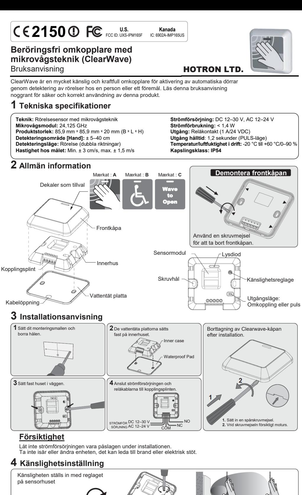
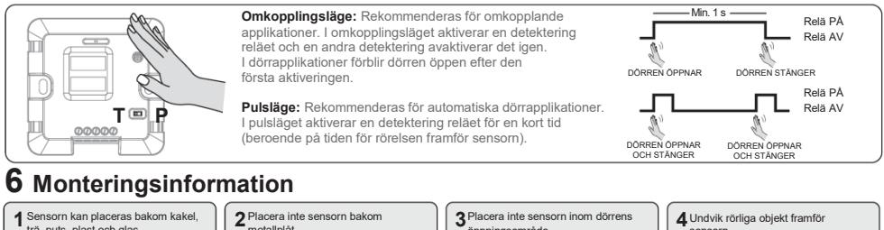

## **5 Omkopplingsläge/pulsläge**

trä, puts, plast och glas.

**Min.** 5 cm

**Max.**

40 cm 5 cm

metallplåt.

40 cm

sensorn.

**Hotron Ltd.** 26 Dublin Street, Carlow, Irland Tel: +353 (0)59 914 0345 Fax: +353 (0)59 914 0543 www.hotron.com

öppningsområde.