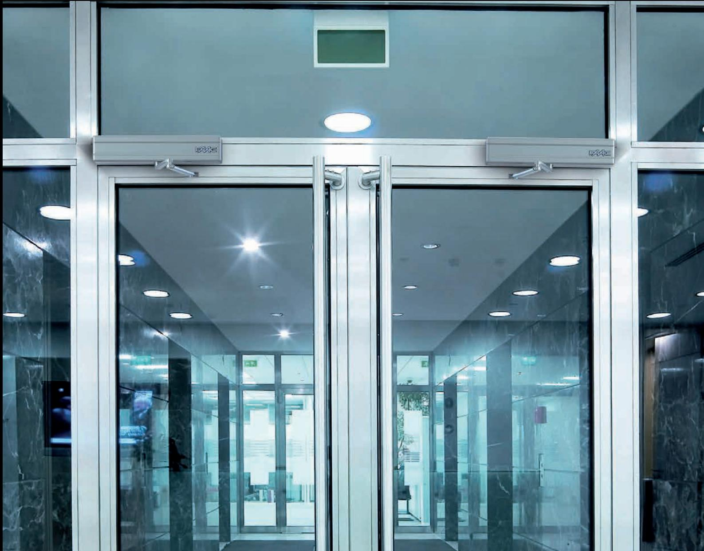

# **DÖRRAUTOMATIK** Nordiskt sortiment

FAAC Nordic utvecklar och tillverkar sedan början på 70-talet motoriseringar för portar, grindar och bommar. Fram till 2009 gjordes detta i ett annat namn, - DAAB, främst kända för sina högklassiga produkter avsedda för industriellt bruk.

The FAAC Group, med huvudkontoret i Bologna, Italien är marknadsledande inom öppnings- och styrautomatik för portar, grindar och dörrar och finns representerade i ett 70-tal länder över hela världen. I Sverige är produkterna sedan länge kända för sin kvalitet och funktion.

SWING-LEAF GATE OPERATOR SWING-LEAF GATE SLIDING GATE OPERATOR SLIDING GATE Behovet av drivutrustning för dörrmiljöer i Europa och övriga världen är stort och bara ökar, så även här i Sverige, inte minst drivet av ökade krav på tillgänglighet. Vår breda kompetens inom motoriseringar av dörrmiljöer har gjort oss kända för professionella lösningar för såväl kommersiella/offentliga applikationer som bostadsanpassningar.

**ENTRANCES & AUTOMATIC DOORS ENTRANCES & AUTOMATIC DOORS**

OPERATOR

OPERATOR

# **SLAGDÖRRSAUTOMATIK 950N2**

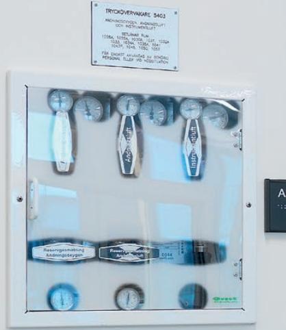

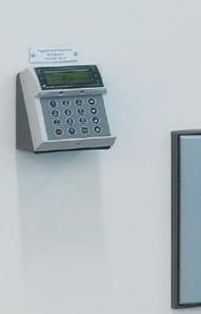

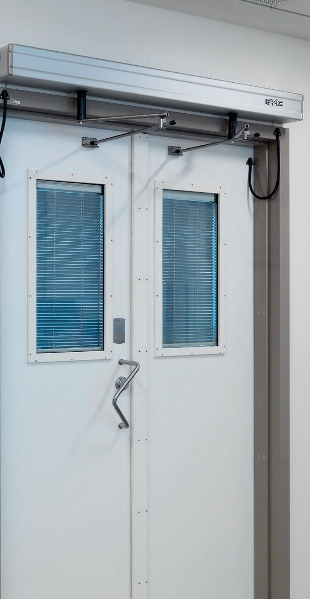

# **950N2**

#### **Slagdörrsautomatik typ 950N2**

Tystgående elektromekanisk dörröppnare för slagdörrar med stängningsfunktion via returfjäder eller motor. Integrerad styrenhet med dörrprocessor för självdiagnostik och kontinuerlig kontroll av samtliga dörrfunktioner.

- Godkänd enligt Dörrstandard EN 16005
- Försedd med funktionsomkopplare
- Samma enhet passar för både höger- och vänsterhängda dörrar
- För ledad arm eller glidarm
- Push & Go funktion
- Självåterställande vid driftstörning
- Strömförsörjning 230V, 100VA
- Tillval: Batteri back-up under förlängd kåpa, lackerad i valfri RAL/NCS kulör *Typgodkänd för brandklassning*

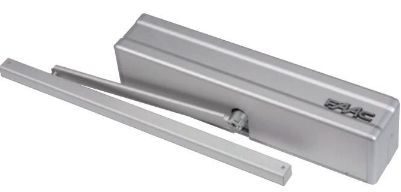

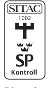

*E30, A30 och EI30 utan fallkolv.*

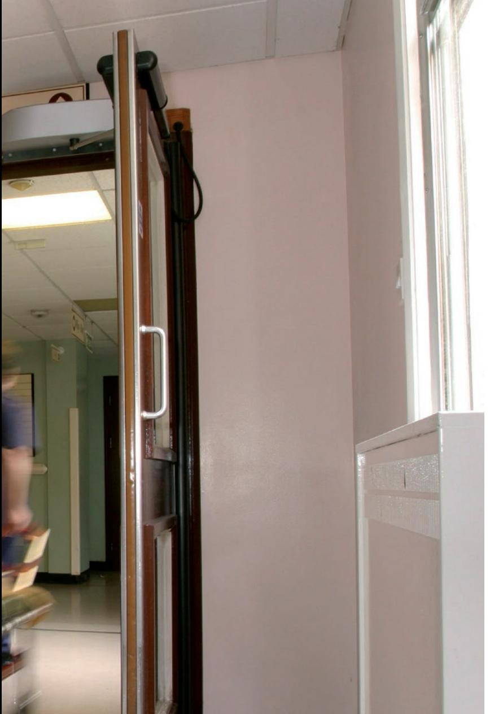

#### **950N2, med fjäderstängning**

- Stänger med fjäderhjälp
- Aluminiumkåpa
- Elektromekanisk motor
- Dörrbladsvikt, max 367 kg
- Dörrbladsbredd, max 1400 mm
- Brandklassad EI30

#### **950N2, med motorstängning**

- Stänger med motor
- Aluminiumkåpa
- Elektromekanisk motor
- Dörrbladsvikt, max 130 kg
- Dörrbladsbredd, max 1000 mm
- Ej brandklassad

**950N2** Art. nr. 013622

**950N2 UF** Art. nr. 013645

#### **TEKNISKA SPECIFIKATIONER**

Effektförbrukning 100 W Användningsfrekvens Kontinuerlig Hinderavkänning Standard Vikt 10 kg Skyddsklass IP 23 Öppningsvinkel 0° - 125° Armar Ledad arm (tryckande)

Strömförsörjning 230 V (+6 - 10%) 50 (60) Hz Drivenhet 24 VDC med enkodersystem Aktivering Elektromekanisk med returfjäder Dimensioner 530 x 100 x 120 mm (b x h x d) Dragkraft Justerbar från 60% till 100% Öppningshastighet Justerbar från 30% till 100% Stängningshastighet Justerbar från 30% till 100% Öppethålltid Justerbar från 1 till 30 s Standarddriftlägen Automatisk - manuell - öppen Glidarm (dragande)

#### **STANDARDFUNKTIONER**

- Driftlägen: AUTOMATISK MANUELL ÖPPEN
- Självavkännande av öppet och stängt läge och avkänning av dörrens vikt
- Hinderavkänning vid såväl öppning som stängning
- Valbar "Push & Go" funktion (öppningskommando genom tryck på dörren)
- Valbar intrångsfunktion automatiken motverkar oväntade försök att öppna dörren manuellt eller av kraftig vind
- Manuell drift vid eventuellt strömavbrott
- Trimskruvar för inställning av motorns öppningsoch stängningshastighet samt öppethålltid
- Utformad för installation av; radar, passiv infraröd sensor, tryckknappar för öppning/stängning, fotoceller, elektriska lås och programmeringsverktyg
- Lock Kick, för hög friktion vid stängning mot tröga/ hårda tätningslister eller låskolvar. Fungerar även i Lågenergi de sista cm. innan helt stängt läge

# **ARMAR TILL SLAGDÖRRSAUTOMATIK 950N2**

#### **Armsats, tryckande**

- Ledad arm för tryckande funktion i Aluminium
- Utgående axel med splineskoppling 20 mm
- Max dörrsmyg 250 mm
- För dörrsmyg över 250 mm fi nns extra armförlängare

#### **Armsats, dragande**

- Glidarm för dragande funktion i Aluminium
- Utgående axel med splineskoppling 20 mm
- Max dörrsmyg 160 mm
- Längd arm 330 och 430 mm

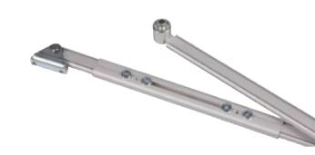

#### **950 TR Aluminium** Art. nr. 010111 **Extra armförlängare** Art. nr. 010715

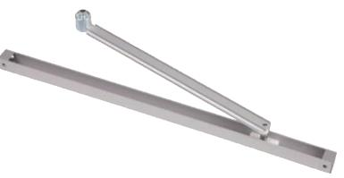

#### **950 DR Aluminium** DR330 Art. nr. 010506 DR430 Art. nr. 010112

#### **Armsats, universell**

- Dragande och tryckande
- Används i speciella dörrmiljöer
- Möjligt att kapa armen till olika längder beroende på dörrbladsbredd
- Längre motorarm samt längre glidskena

#### **Armsats, tryckande**

- Standardarm för tryckande funktion
- Utgående axel med splineskoppling 28 mm
- Max dörrsmyg 250 mm
- Tillverkad i stål, justerbar längd
- Brandklassad EI30 tillsammans med FAAC 950N2

#### **Armsats, dragande**

- Standardarm för dragande funktion
- Utgående axel med splineskoppling 28 mm resp. 18 mm
- Max dörrsmyg 160 mm
- Tillverkad i stål, armlängder 330 mm och 430 mm

#### **Armsats, dragande**

- Specialarm för dragande funktion tillsammans med automatik utan returfjäder (950N2 UF)
- Utgående axel med splineskoppling 28 mm
- Öppen Z-profi l som medger frikopplad öppning av t.ex. hissdörrar
- Max dörrsmyg 160 mm
- Tillverkad i stål, armlängd 430 mm

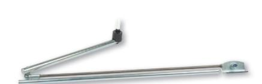

#### **950/DR/600/28** Art. nr. 011362

**950 TR Standard** Art. nr. 008458

# **950 DR**

DR430/28 Art. nr. 008462 DR330/18 Art. nr. 008483

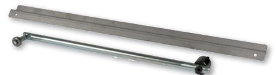

**950 DR Z-arm** Art. nr. 008482

# **TILLBEHÖR TILL 950N2**

#### **Montageplåt**

- Montageplåt med gängade hål (automatik) och försänkta hål (vägg) för att förenkla installationen, T = 8 mm.
- Finns i längre utförande vid batteri back-up, art. nr. 012430

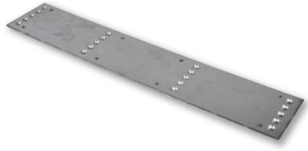

**950 TR/DR** Art.nr. 011389 (inkl. fästskruvar)

#### **Axelkoppling, aluminiumarm**

- Utgående axel för olika montagehöjder Finns i tre höjder
- Standard 20 mm, Mellan 50 mm, Lång 80 mm
- Observera att vid förlängning av axel tar man bort standardkopplingen på 20 mm, t. ex förlänger 50 mm axel endast 30 mm
- Passar till art. nr. 010111, 010112 samt 010506

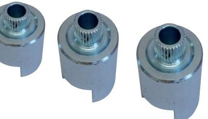

#### **950 TR/DR**

Standard 20 mm Art.nr. 010512 Mellan 50 mm Art.nr. 010507 Lång 80 mm Art.nr. 010508

#### **Axelkoppling, stålarm**

- Finns för utgående axel i tre längder
- Standardlängd 28 mm
- Kort 18 mm
- Passar till art. nr. 008458, 008462, 008482 samt 011362

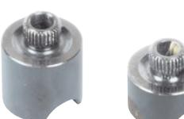

#### **950 TR/DR** Kort 18 mm Art.nr. 008484 Standard 28 mm Art.nr. 011418

#### **Axelförlängare, stålarm**

- Förlängare för att öka montagehöjd. Finns i tre höjder
- Kort 30 mm, Mellan 60 mm, Lång 80 mm
- Mellankopplingsdel ingår. Skruv beställs separat
- Passar till art. nr. 008458, 008462, 008482 samt 011362

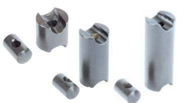

| 950 TR/DR                      |
|--------------------------------|
| Kort 30 mm Art.nr. 008436   |
| Mellan 60 mm Art.nr. 008495 |
| Lång 80 mm Art.nr. 008500   |
|                                |

#### **Skruv till axelförlängare, stålarm**

- Skruv till förlängare för att öka montagehöjd
- Till förlängare 30/60/80 mm
- Passar till art. nr. 008436, 008495 resp. 008500

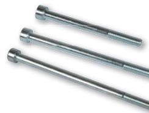

**950 TR/DR** För 30 mm Art.nr. 008437 För 60 mm Art.nr. 008438 För 80 mm Art.nr. 008502

# **TILLBEHÖR TILL 950N2**

#### **Radiomottagare DS, instick**

Radiomottagare FAAC RP 433 DS

- 1-kanal insticksmodell 433 MHz som passar direkt i dörrautomatik FAAC 950N2
- Mottagaren programmeras enkelt med DIP-omkopplare
- Passar till radiosändare art. nr. 008394, 008395 och 008396

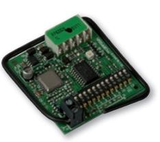

 **RP 433 DS** Art.nr. 008407

#### **Radiomottagare SLH, instick**

Radiomottagare FAAC RP 433 SLH

- 1-kanal insticksmodell 433 MHz som passar direkt i dörrautomatik FAAC 950N2
- Mottagaren programmeras enkelt med självlärande programmering
- Passar till radiosändare art. nr. 009403, 009404 (vit), 009406, 009407 (svart)
- Finns även i 868 MHz art. nr. 008409

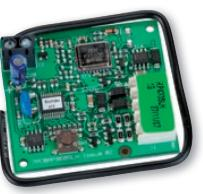

#### **RP 433 SLH** Art.nr. 007986

**Batteri back-up** 

- 24 VDC 2 x 3,2 Ah
- Monteras under förlängd kåpa

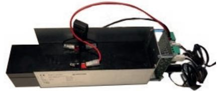

#### **Batteri back-up** Art.nr. 011744

#### **Programväljare/Programmeringsverktyg**

- LK EVO Programväljare
- KP EVO Programmeringsverktyg

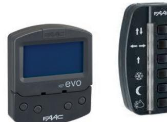

#### **Programmeringsverktyg** LK EVO Art. nr. 013153 KP EVO Art. nr. 013531

#### **Lackerad kåpa**

- FAAC 950 kåpa i aluminium kan beställas lackerad i valfri färg
- Vid beställning uppge RAL-nummer

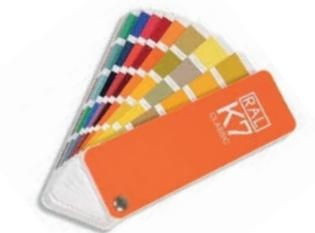

**Kåpa 950N2** Art.nr. 010842

## **RESERVDELAR 950N2**

**Drivrem**  Drivremssats till FAAC 950N2

**Motor**  Motor till FAAC 950N2

**Styrkort**  Styrkort till FAAC 950N2

**Drivrem 950N2** Art.nr. 008247

**Motor 950N2** Art.nr. 008378

**Styrkort 950N2** Art.nr. 013647

**I/O kort 950N2** Art.nr. 013648

**I/O kort**  In-/utgångskort till FAAC 950N2

**Gavelsats** Komplett gavelsats inkl. funktionsväljare till FAAC 950N2

#### **Glidkloss 950 DR**

Till slagdörrsautomatik FAAC 950N2

- Glidkloss med tapp till dragande armsystem
- Passar till armar art. nr. 008462, 008483 och 011362
- Finns i två höjder. Standard (42 mm) til DR430/DR600 och Kort (32 mm) till DR330

#### **Glidkloss 950N glidarm**

Till slagdörrsautomatik FAAC 950N2

- Glidkloss med tapp till dragande armsystem
- Passar till armar art. nr. 010112 samt 010506

#### **Rullhjul 950 DR Z**

Till slagdörrsautomatik FAAC 950N2

- Rullhjul med axel till dragande armsystem med Z-skena
- Passar till arm art. nr. 008482
- Höjd 42 mm

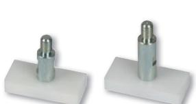

#### **Gavelsats 950N2** Art.nr. 010509

**Glidkloss 950 DR** Standard 42 mm Art.nr. 008474 Kort 32 mm Art.nr. 008485

**Glidkloss 950 DR Alu** Art.nr. 010513

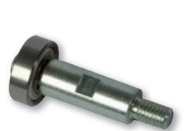

**Rullhjul 950 DR Z** Art.nr. 008491

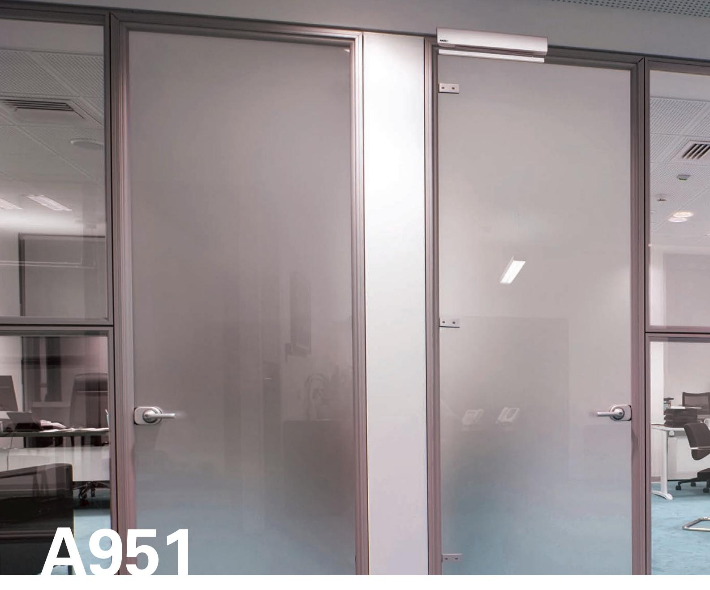

#### **Slagdörrsautomatik typ A951**

Tystgående elektromekanisk dörröppnare för invändiga slagdörrar, stängningsfunktion med motor. Integrerad styrenhet med processor för självdiagnostik och kontinuerlig kontroll av samtliga dörrfunktioner.

- Godkänd enligt Dörrstandard EN 16005
- Kompakt enhet, endast 7 cm hög
- Samma enhet passar för både höger- och vänsterhängda dörrar
- Försedd med funktionsväljare
- För tryckande/dragande armsystem
- Självåterställande vid driftstörning
- Strömförsörjning 230V
- Tillval: Batteri back-up, kåpa lackerad i valfri RAL/NCS kulör

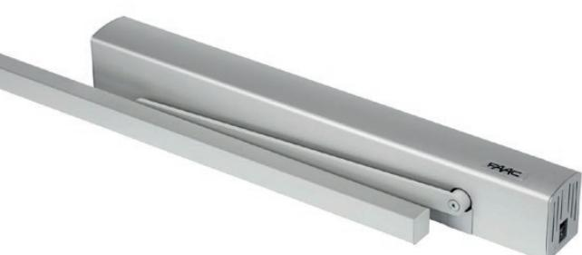

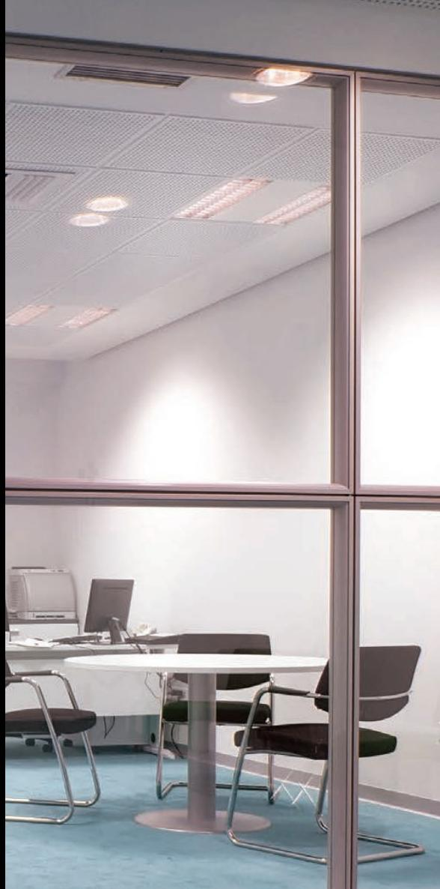

#### **TEKNISKA SPECIFIKATIONER**

Strömförsörjning 220 - 240 V - 50/60 Hz Effektförbrukning 100 W Användningsfrekvens Kontinuerlig Drivenhet Elektromekanisk, 24 VDC med enkoder Hinderavkänning Standard Dimensioner 575 x 62 x 78 mm (b x h x d) Vikt 7 kg Skyddsklass IP 23 Max. öppningsvinkel 100° - 125° Öppningstid Justerbar från 4 till 10 s Stängningstid Justerbar från 4 till 10 s Öppethålltid Justerbar från 0 till 30 s (nattläge 90 s) Standarddriftsfunktioner Automatisk - manuell - nattläge Armar Ledad arm (tryckande) Glidarm (dragande)

#### **STANDARDFUNKTIONER**

- Driftlägen: AUTOMATISK MANUELL NATTLÄGE
- Självavkännande av öppet och stängt läge samt avkänning av dörrens vikt
- Hinderavkänning vid såväl öppning som stängning
- Valbar intrångsfunktion automatiken motverkar manuella öppningsförsök
- Valbar "Push & Go"-funktion (öppningskommando genom tryck på dörren)
- Manuell drift vid eventuellt strömavbrott
- Programmering via display och knappar på automatiken
- Utformad för installation av radar, passiv infraröd sensor, tryckknappar för öppning/stängning, fotoceller, elektriska lås och programmeringsverktyg

#### **A951** Art. nr. 013447

#### **A951, med motorstängning**

- Aluminiumkåpa
- Elektromekanisk motor
- Dörrbladsvikt, max 100 kg
- Dörrbladsbredd, max 1100 mm

# **ARMAR OCH TILLBEHÖR TILL A951**

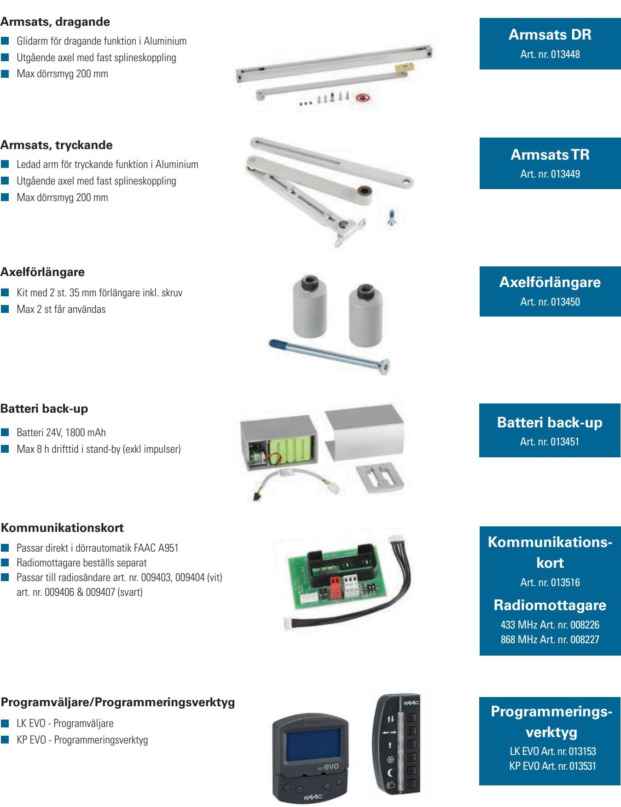

### **RESERVDELAR A951**

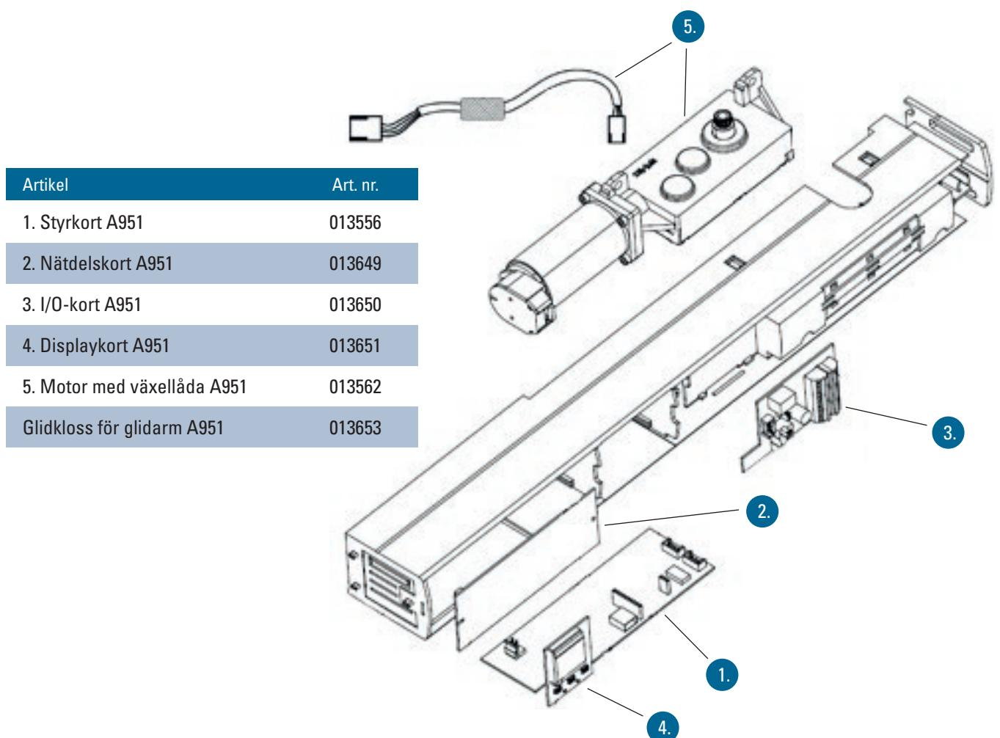

# **ÖVRIGA TILLBEHÖR**

**Se våra kompletta tillbehörssidor, sid 15-20**

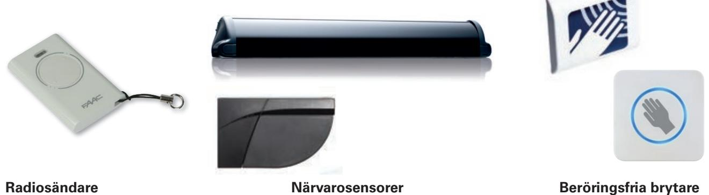

# **EN 16005**

## **Säkerhetsregler för dörrar: Dörrstandard EN 16005**

EU's säkerhetsstandard för automatiska dörrar SS-EN 16005 innebär att samma regelverk gäller i hela EU och att produkterna utvecklas lika för alla marknader. Vidstående bild illustrerar vilka olika risker som skall bedömas, enligt denna nya standard, vid varje installation: mekanisk risk orsakad av rörliga delar, anslag, krossande, avklippande, in-dragande, skärande och intrasslande.

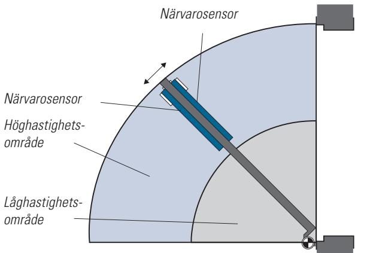

*Illustrationen ovan är ett utdrag ur standarden som visar risker som skall bedömas i riskanalysen för varje applikation.*

En riskbedömning av applikationen skall göras för att defi niera vilka säkerhetsåtgärder som måste göras. Baserat på olika kriterier i standarden värderas applikationen i vår riskbedömning antingen som lågenergi eller högenergi applikation. En högenergi applikation skall t.ex. utrustas med en eller fl era närvarosensorer som skall förhindra att dörren träffar person i applikationen.

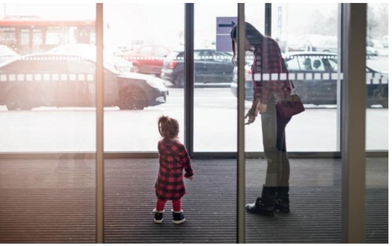

*Bakkantsensor används skjutdörrens bakkant för att förhindra att klämfara uppstår. EN16005 anger att säkerhetsavståndet mellan dörrens baksida och vägg hinder bör vara minst 200 mm. Om avståndet är mindre skall området säkras med sensor för övervakning.*

# **NÄRVAROSENSORER, SLAGDÖRRAR**

#### **Närvarosensor 4SAFE**

- Aktiv infraröd sensorlist som monteras på dörrbladet och ger ett kollisions- och klämskydd
- Enkel och diskret installation
- 1-modul med 4 strålar
- Godkänd enligt EN16005
- Svart
- Karmöverföring ingår

#### **Närvarosensor Uniscan**

- Aktiv infraröd sensorlist som monteras på dörrbladet och ger ett kollisions- och klämskydd
- Enkel och diskret installation
- Optikenhet med 8 strålar för hög säkerhet
- Godkänd enligt EN16005
- Silver
- Karmöverföring säljs separat art. nr. 008545

#### **FLATSCAN**

- Säkerhetssensor för slagdörrar
- Täcker både fram- och bakkant på dörrbladet
- Finns i höger/vänster, svart och silverutförande

- 
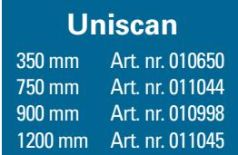

350 mm Art. nr. 011719 700 mm Art. nr. 011779 900 mm Art. nr. 011780 1200 mm Art. nr. 011782

**4SAFE**

| FLATSCAN |                 |  |  |  |  |  |
|----------|-----------------|--|--|--|--|--|
|          | Svart           |  |  |  |  |  |
| Höger    | Art. nr. 012693 |  |  |  |  |  |
| Vänster  | Art. nr. 012694 |  |  |  |  |  |
| Silver   |                 |  |  |  |  |  |
| Höger    | Art. nr. 013082 |  |  |  |  |  |
| Vänster  | Art. nr. 013083 |  |  |  |  |  |

# **FJÄRRKONTROLLER**

Fjärrkontroller för att kunna justera närvarosensorerna.

#### **Fjärrkontroll 4SAFE/FLATSCAN/IXIO**

- Universal fjärrkontroll till sensorer och radar
- Underlättar programmering och drifttagning
- Flera inställningsmöjligheter

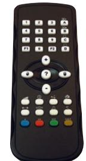

**4SAFE/ FLATSCAN/IXIO** Art.nr. 012138

> **Uniscan** Art.nr. 010369

#### **Fjärrkontroll, Uniscan** Dubbelriktad kommunikation med sensorn

- Olika konfi gurationer kan lätt programmeras via fjärrkontrollen
- Integrerad detektor för infrarött ljus för enkel inställning av ljusridån

# **ARMBÅGSKONTAKTER**

#### **Armbågskontakt, AK plast**

- Armbågskontakt i tålig ABS-plast med trycke i aluminiumfärg och grå ram
- 1 x slutande kontaktfunktion
- Kapslingsklass IP-67
- Mått: 250 x 95 mm
- Kan kompletteras med ytterligare en mikrobrytare, art. nr. 008449

#### **Armbågskontakt, AK alumin**

- Armbågskontakt i vandalsäkert utförande helt i aluminium
- 2 x slutande kontaktfunktion
- Kapslingsklass IP-67
- Mått: 245 x 80 mm

#### **Armbågskontakt, AK Hiss, FAAC**

- Armbågskontakt i vandalsäkert utförande helt i aluminium för hiss
- 2 x slutande kontaktfunktion
- Radioöverföring
- Kabel för matning 12VDC

#### **Armbågskontakt, AK Radio, FAAC**

- Armbågskontakt i vandalsäkert utförande helt i aluminium
- 2 x slutande kontaktfunktion
- Radioöverföring med batteri

#### **Armbågskontakt, AK Radio, Erone**

- Armbågskontakt med radioöverföring 433 Mhz
- Aluminium med silverfärgat lock
- 1 x slutande kontaktfunktion
- IP67
- Inkl. batteri

#### **Armbågskontakt, AK Svart**

- Aluminium
- Svart lock
- 1 x slutande kontaktfunktion
- IP67

#### **Prisma Button**

- Anpassad efter miljöer med hårda hygienkrav
- Vandalsäker
- Finns även i längder 800 och 1200 mm

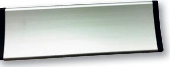

Mottagare Art nr. 008407

**AK Hiss** Art.nr. 008668

**AK Radio** Art.nr. 008667 Mottagare Art nr. 008407

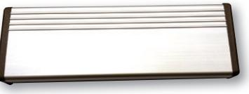

**AK Radio** Art.nr. 011668 Mottagare Art.nr. 011670

> **AK L Svart** Art.nr. 009943

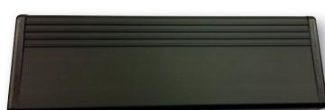

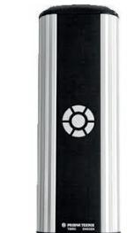

**Prisma Button**

300 - Art.nr. 013149

För optimerad och säker installation se resp. bruksanvisning på: **www.faac.se**

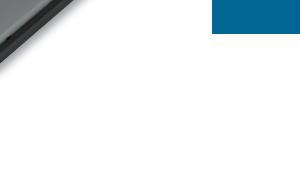

**AK alumin** Art.nr. 008450

**AK plast** Art.nr. 008498

# **RADIO**

#### **Radiosändare, 1-knapp**

Radiosändare FAAC TM1 433 DS

- Handsändare 433 MHz med 1 knapp och lysdiodindikering
- Handsändaren programmeras enkelt med DIP´s i batteriluckan Batteri typ 12V, 23A (ingår i leverans)
- Lättryckt knapp för handikappanpassning
- Mått: 75 X 37 x 14 mm

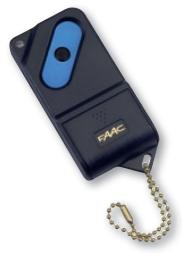

**TM1 433 DS** Art.nr. 008394

#### **Radiosändare, 2-knapp**

Radiosändare FAAC TM2 433 DS

- Handsändare 433 MHz med 2 knapp och lysdiodindikering
- Handsändaren programmeras enkelt med DIP´s i batteriluckan Batteri typ 12V, 23A (ingår i leverans)
- Lättryckt knapp för handikappanpassning
- Mått: 75 X 37 x 14 mm

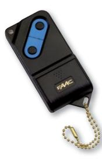

**TM2 433 DS** Art.nr. 008395

**TM3 433 DS** Art.nr. 008396

#### **Radiosändare, 3-knapp**

Radiosändare FAAC TM2 433 DS

- 4-kanal med dubbeltryck på två knappar samt knapp 1-3
- Handsändare 433 MHz med 3 knapp och lysdiodindikering
- Handsändaren programmeras enkelt med DIP´s i batteriluckan Batteri typ 12V, 23A (ingår i leverans)
- Lättryckt knapp för handikappanpassning
- Mått: 75 X 37 x 14 mm

#### **Radiomottagare, 2-kanal**

Radiomottagare FAAC XR2 433 C

- Universell radiomottagare 433 MHz, 2-kanal
- Levereras komplett med box IP44, mått: 88 x 69 x 30 mm
- Spänningsmatning 12-24VAC/DC
- Ett fl ertal valbara reläfunktioner

#### **Radiomottagare, 4-kanal**

Radiomottagare FAAC XR4 433 C

- Universell radiomottagare 433 MHz, 4-kanal
- Levereras komplett med box IP44, mått: 88 x 69 x 30 mm
- Spänningsmatning 12-24VAC/DC
- Ett fl ertal valbara reläfunktioner

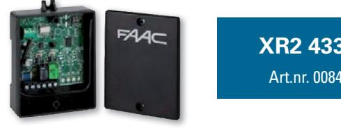

 **XR2 433 C** Art.nr. 008411

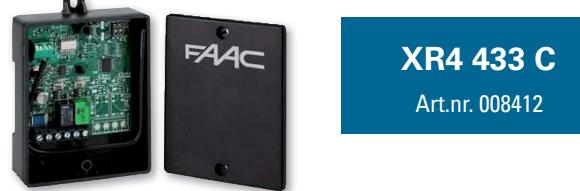

# **RADIO**

#### **Radiosändare, 2-knapp**

Radiosändare FAAC XT2 433 SLH

- Handsändare 433 MHz med 2 knapp och lysdiodindikering
- Självlärande programmering med knapparna
- Batterier 2 x 3V, typ CR2032 (ingår i leverans)
- Liten snygg "Ipod-design" med rem
- Mått: 64 x 40 x 10 mm
- Passar tillsammans med mottagare ex. art. nr. 008411, 008412, 007986 och 013516/008226
- Finns även i 868 MHz art. nr. 009405 (vit) resp. art. nr. 009408 (svart)

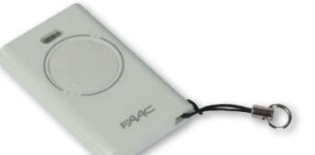

#### **XT2 433 SLHLR** Vit - Art.nr. 009403

Svart - Art.nr. 009406

#### **Radiosändare, 4-knapp**

Radiosändare FAAC XT4 433 SLH

- Handsändare 433 MHz med 4 knapp och lysdiodindikering
- Självlärande programmering med knapparna
- Batterier 2 x 3V, typ CR2032 (ingår i leverans)
- Liten snygg "Ipod-design" med rem
- Mått: 64 x 40 x 10 mm
- Passar tillsammans med mottagare ex. art. nr. 008411, 008412, 007986 och 013516/008226
- Finns även i 868 MHz art. nr. 009343 (vit) resp. art. nr. 009409 (svart)

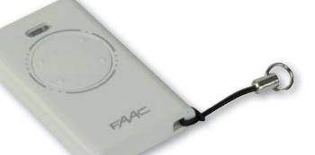

#### **XT4 433 SLHLR**

Vit - Art.nr. 009404 Svart - Art.nr. 009407

#### **Radiosändare, 1-knapp**

Erone, lättryckt

- Extra lättryckt fjärrkontroll för personer med funktionshinder
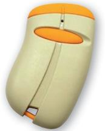

**Erone 1-knapp** Art.nr. 011634

#### **Radiomottagare, Mini** Erone 85 användare

- 1 kanal
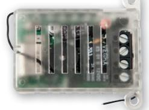

**Erone Mini 12-24 V** Art.nr. 011670

# **ÖVRIG KRINGUTRUSTNING**

#### **Låsbar strömbrytare, 2-pol**

Strömbrytare 3-pol med dekal att användas vid installation av dörrautomatik.

- Brytaren är låsbar (lås ingår ej)
Nyckelkontakt för ASSA-cylinder.

 Återfjädrande NO/NC kontaktfunktion Exkl. cylinder och cylinderkopp

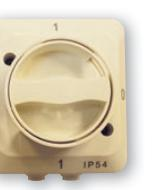

**SBL-2P** Art.nr. 012182

**NB** Art.nr. 008453

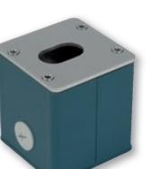

#### **Nyckelbrytare**

**Nyckelkontakt**

Nyckelbrytare typ DN-L.

Slagtålig aluminium

Nyckelmanöverlåda

- Nyckellåda typ DN-L (till)- från (till)
- Exkl. låscylinder och cylinderhylsa

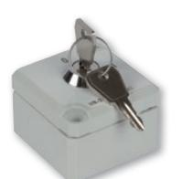

**DN-L** Art.nr. 000545

#### **Sparkplatta ES**

- Sparkplatta i vandalsäkert utförande i hårdgummi
- 5 m. ledning är pågjuten och har 1 x slutande kontaktfunktion
- Gulmarkerat trycke
- Kapslingsklass IP-67
- Mått: 150 x 150 x 15 mm

#### **Beröringsfri brytare, XMS**

- Beröringsfri brytare, aktivering med radar. Aktiveringsavstånd 10-50 cm
- Lämplig vid handikappanpassad installation samt vid höga krav på hygien
- För infällt montage, dosa för utvändigt montage beställs separat
- Mått: 85 x 85 mm

#### **Beröringsfri brytare, CleanSwitch**

- Beröringsfri brytare, aktivering med radar. Aktiveringsavstånd 10-50 cm
- Lämplig vid handikappanpassad installation samt vid höga krav på hygien
- För infällt montage, dosa för utvändigt montage beställs separat
- Optisk återkoppling i olika färger (valbart)
- Kan fås med olika piktogram eller tryck
- Mått: 88 x 88 mm

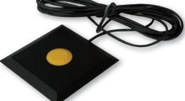

**Sparkplatta** Art.nr. 008506

**XMS** Art. nr. 013523 Dosa Art. nr. 013524

**CleanSwitch** Art. nr. 013667 Dosa Art. nr. 013668

# **ÖVRIG KRINGUTRUSTNING**

#### **Stativ för AK/kortläsare**

- Varmförzinkat stativ inkl. bultkorg
- Höjd 1200 mm

#### **Radar, Eagle One**

Regnkåpa till Eagle

- Riktningskännande radar
IP54

- 12-24 V AC/DC
- Regnkåpa som tillbehör

# Art.nr. 002807

**Stativ AK/kort**

**Eagle One** Art.nr. 009458 Regnkåpa Art.nr. 011768

#### **Dörrstopp D2**

- Finns för höger och vänster utförande
- Dörrstopp som används i miljöer med glasade entréer eller liknande

#### **Dörrstopp D2** Höger Art.nr. 012323

Vänster Art.nr. 012324

#### **Dörrstopp D1 för vägg/tak**

- Klarar 100 kg belastning
- Passar för hårt utsatta miljöer så som idrottsanläggningar och skolor

#### **Dörrstopp D1** Art.nr. 012288

#### **Skylt Dörrautomatik**

Informationsskylt om att dörr är utrustad med dörrautomatik med push-and-go funktion.

- Mått: 75 x 100 mm
- Dekal fi nns för tryck resp. dragande sida på dörr

**Skylt** Tryckande Art.nr. 008688 Dragande Art.nr. 008689

# **SKJUTDÖRRSAUTOMATIK A1400 AIR**

# **A1400 AIR**

A1400 AIR är en kraftfull, kompakt och energibesparande skjutdörrsautomatik som består av följande:

- Upphängningsbalk i anodiserad aluminium med spår för justering i höjd och bredd
- Kåpa i anodiserad aluminium med smarta infästningar, lätt att montera. Anpassningsbar till olika dörrbladstjocklekar 2 olika kåphöjder: 100 resp. 140 mm
- Motorpaket med integrerad enkoder
- Vagnar med syntethjul, justerbara i höjd + 7,5 mm.

Integrerad styrautomatik innehåller bland annat: Inbyggd styrning för lås, batterier samt sensorer. Programmerbar via display på styrautomatiken alt. externt programmeringsverktyg. Automatiska inställningar:

- Bestämning av öppen och stängd position
- Mätning av dörrbladsvikt samt friktion
- Val av optimal hastighet, acceleration och retardation
- Sensorövervakning Resetfunktion Programmerbara säkerhetsfunktioner

#### För optimerad och säker installation se resp. bruksanvisning på: **www.faac.se**

#### **TEKNISKA SPECIFIKATIONER**

Strömförsörjning 220 - 240 V - 50/60 Hz Effektförbrukning 140 W Användningsfrekvens 100% Max. dörrbladtjocklek 65 mm Elektrisk motor 36V motor med enkoder Max. strömförbrukning tillbehör 1 A -24V Drivenhet Elmotor med remdrift Öppningshastighet, 10 - 75 cm/s (enkelblad) justerbar 20 - 150 cm/s (dubbelblad) Stängningshastighet, 10 - 75 cm/s (enkelblad) justerbar 20 - 150 cm/s (dubbelblad) Partiell öppning Justerbar 5% - 95% av total öppning Öppethålltid 0 - 30 s eller energisparläge Öppethålltid, nattläge 0 - 240 s Enkoder Standard Sensorövervakning EN 16005 som standard, frånkopplingsbar Lågenergiläge EN 16005 som standard, frånkopplingsbar Drifttemperatur -20°C - +55°C Skyddsklass IP 23, endast för inomhusbruk Standarder som stöds EN 16005, EN 13489-1 PI "c", EN13489-2, EN 60335-1, EN 60335-2, EN ISO 12100,

A1400 AIR är energibesparande tack vare inbyggd smart automatik och har kapacitet även för tyngre dörrar med dubbelmotor.

EN 61000-6-2, EN 61000-6-3

| Modell        | Dörrblad        | Max. Dörrbladsbredd, mm | Max. Dörrbladsvikt, kg |
|---------------|-----------------|-------------------------|------------------------|
| A1400 AIR 1   | Enkel           | 700 - 3000              | 200                    |
| A1400 AIR 2   | Dubbel          | 800 - 3000              | 120 + 120              |
| A1400 AIR A1  | Enkel           | 700 - 3000              | 200                    |
| A1400 AIR A2  | Dubbel          | 800 - 3000              | 120 + 120              |
| A1400 AIR DM1 | Enkel           | 800 - 3000              | 250                    |
| A1400 AIR DM2 | Dubbel          | 900 - 3000              | 180 + 180              |
| A1400 AIR T2  | Enkel teleskop  | 1100 - 3000             | 110 + 110              |
| A1400 AIR T4  | Dubbel teleskop | 1400 - 4000             | 60 + 60 + 60 + 60      |
| A1400 AIR AT2 | Enkel teleskop  | 1100 - 3000             | 110 + 110              |
| A1400 AIR AT4 | Dubbel teleskop | 1400 - 4000             | 60 + 60 + 60 + 60      |

A = Självbärande balk

DM = Dubbelmotor

T = Teleskop

# **TILLBEHÖR SKJUTDÖRRSAUTOMATIK A1400 AIR**

**Elektromekaniskt motorlås** Bistabilt lås med manuell frikoppling

**Motorlås** Art. nr. 008716

#### **Radar IXIO - DT**

- Kombinerad radar + sensor för skjutdörrar Fjärrkontroll art. nr. 012138

#### **Sensor IXIO - ST**

- Bakkantssensor för skjutdörrar Fjärrkontroll art. nr. 012138

#### **Sensor IXIO - ST** Art. nr. 012058 **Regnkåpa** Art. nr. 012390

**Golvstyrning** Bild 1 Art. nr. 008479 Bild 2 Art. nr. 009802 Bild 3 Art. nr. 008182 Bild 4 Art. nr. 008132 Bild 5 Art. nr. 008284

**Radar IXIO - DT** Art. nr. 011965 **Regnkåpa** Art. nr. 012390

#### **Golvstyrning**

- 1. Golvstyrning exkl. glidkloss golvmontage

- 2. Golvstyrning exkl. glidkloss partimontage

4. Golvstyrning golv 5. Glidkloss

- LK EVO Programväljare
- SDK EVO Programmeringsverktyg

**Programmeringsverktyg** LK EVO Art. nr. 013153 SDK EVO Art. nr. 013347

## **RESERVDELAR SKJUTDÖRRSAUTOMATIK A1400 AIR**

| Artikel                    | A1400 AIR | A1400 AIR T | Finns för höjd | Art. nr. |
|----------------------------|-----------|-------------|----------------|----------|
| 1. Löpvagn                 |           |             | -              | 010964   |
| 2. Löpvagn A 1400 AIR T RH |           |             | -              | 013518   |
| 3. Löpvagn A 1400 AIR T LH |           |             | -              | 013517   |
| 4. Remfäste                |           |             | -              | 009911   |
| 5. Styrautomatik           |           |             | -              | 013243   |
| 6. Ändstopp                |           |             | -              | 011059   |
| 7. Motor                   |           |             | -              | 009526   |
| 8. Motor A1400 AIR DM      |           |             | -              | 013488   |
| 9. Motorlås                |           |             | -              | 008716   |
| 10. Drivrem, metervara     |           |             | -              | 013154   |
| 11. Gavelplåt              |           |             | 100            | 008718   |
| 12.Gavelplåt               |           |             | 140            | 009286   |
| 13. Gavelplåt              |           |             | -              | 010050   |
| 14. Batteri                |           |             | -              | 008717   |
| 15. Vajer                  |           |             | -              | 010047   |

# **RKU**

#### **FAAC RKU Uppgraderingskit**

FAAC RKU består av följande:

- Elmotor
- Rem
- Löphjulsbeslag
- Brythjul
- Beslag
- Batteripaket
- Styrautomatik
- Div. skruvar och beslag

#### **RKU** Art. nr. 013607

#### **Uppgraderingskit**

Elmotor med remdrift

- Dörrbladsvikt, max 200 kg
- Passagebredd, 700 3000 mm
- Enkelblad

Med FAAC RKU Uppgraderingskit kan du få liv i utslitna skjutdörrar. FAAC RKU kan monteras på de flesta fabrikat Enkelt och snabbt att installera.

# **FAAC'S PRODUKTSORTIMENT**

#### **Vägbommar**

- Ett 10-tal olika automatiska vägbommar finns i sortimentet
- Elektromekaniska resp. Elektrohydrauliska; finns i snabba, starka, lackerade eller rostfria utföranden

#### **Grind- och villagrindautomatik**

- Nordens bredaste sortiment för villagrindar
- Mer än 40.000 grindar i Norden är automatiserade med DAAB och FAAC produkter
- Anpassade för Nordiskt klimat och förhållande

#### **Industrigrindautomatik**

- Nordens bredaste sortiment för industrigrindar
- Mer än 65.000 grindar i Norden är automatiserade med DAAB och FAAC produkter
- Anpassade för Nordiskt klimat och förhållande

#### **Pollare**

- Säkerhetspollare M30 och M50
- Trafikpollare för offentliga miljöer
- Unik design som ger enkel access vid service och underhåll
- Enkel att installera

SWING-LEAF GATE OPERATOR

SLIDING GATE OPERATOR

SLIDING GATE OPERATOR

SWING-LEAF GATE OPERATOR

**ENTRANCES & AUTOMATIC DOORS ENTRANCES & AUTOMATIC DOORS**

FAAC Nordic är baserat i Perstorp. Vi har utvecklat och tillverkat förstklassig drivutrustning för port- och grindautomatik sedan början av 1970-talet. Våra produkter driver en stor del av de grindar, portar och bommar som installeras i Norden. Våra kunder återfinns både inom näringslivet och offentlig/statlig verksamhet och även för privata bostäder.

FAAC Koncernen är marknadsledande inom öppningsoch styrautomatik för portar och grindar. FAAC finns representerade i ett 70-tal länder runt om i världen och har sitt huvudkontor i Bologna.

HUVUDKONTOR

FAAC Nordic AB Box 125, SE-284 22 Perstorp, Sweden Tel. +46 435 77 95 00 Fax +46 435 77 95 29 www.faac.se