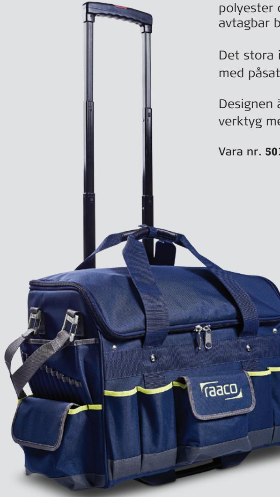
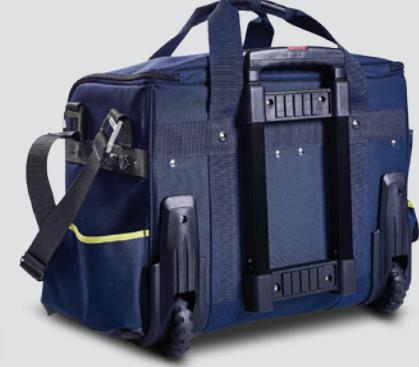
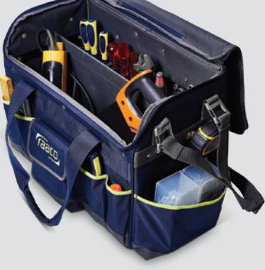
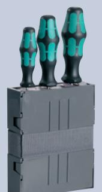
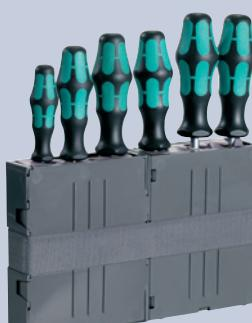
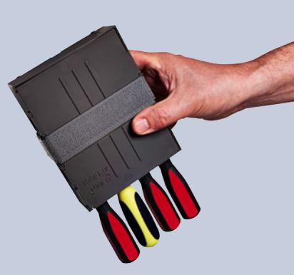

## Tool Trolley PRO

Trolley med fastmonterad verktygsväska. Väskan är tillverkad av slitstark polyester och innehåller in och utvändiga fickor, verktygshållare samt en avtagbar bärrem.

Det stora invändiga utrymmet är uppdelat med hjälp av en flyttbar mellanvägg med påsatt Velcro i sidorna till att montera Tool Fix (extra tillbehör).

Designen är rymlig, praktisk och öppen, så du snabbt för översikt över dina verktyg med lätt tillgång till innehållet. Lastbar 40kg.

Vara nr. **50140269**

1040 x 520 x 310 mm 445 x 520 x 310 mm

Alla priser är SEK exkl. Moms.

## Extra tillbehör Tool fix

Patenterat Toolfix system som håller verktygen säkert på plats. Passar till verktyg upp till 30mm.

Monterad med Kardborrband

1/4 Tool Fix Art.nr. **50140268**

1/2 Tool Fix Art.nr. **50140267**

**www.copiax.se**