# **Monteringsanvisning panikregel ASSA 1125**

Denna monteringsanvisning avser ASSA panikregel 1125 med följande artikelnummer: 361282, 361283 samt 361284 i kombination med ASSA låshus modell 761-50/70, 762-50/70, 767-50/70 samt 772-50/70.

I kombination med ovanstående låshus kan ASSA 1125 förses med utvändigt öppningsbeslag, cylinder och/eller trycke enligt följande:

- Behörssats ASSA 3325, artikelnummer 354565, innehållande cylinderbehör samt trycke.
- Behörssats ASSA 3425, artikelnummer 354564, innehållande cylinderbehör samt täckskylt.

Till panikregel ASSA 1125 får endast följande ASSA slutbleck användas: Modell 1264 1-8 med artikelnummer: 357207, 357208, 357730, 357732, 357728, 357729, 357731 samt 357733.

Modell 1487 1-5 med artikelnummer: 357545, 357546, 357547, 357547 samt 357548. Modell 2530-50/70 med artikelnummer: 363759, 363760, 363761, 363762, 363763, 363764, 363765 och 363766.

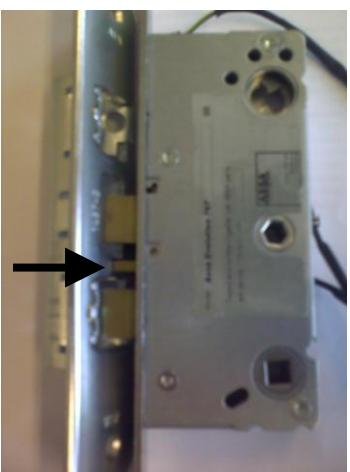

**Viktigt!!**

**Försäkra dig om att förreglingsfallen träffar bommen på slutblecket innan du stänger dörren.**

#### **Varning!**

Säkerhetsegenskaperna på denna produkt är avgörande för dess överensstämmelse med SS-EN 1125. Ingen modifiering eller ändring av något slag annat än de som beskrivs i montageinstruktionen är tillåtna. ASSA ansvarar ej för funktionen av produkter som ej monterats i enlighet med bifogade instruktioner eller då bifogad drift- och underhållsinstruktion ej följts.

## **Klassificering enligt SS-EN 1125:2008**

| 1 | 2 | 3 | 4 | 5 | 6 | 7 | 8 | 9 | 10 |
|---|---|---|---|---|---|---|---|---|----|
| 3 | 6 | 6 | B | 1 | 3 | 2 | 2 | B | A  |

- 1) (3) lämplig att användas på högfrekventa dörrar;
- 2) (6) testad till 100 000 cykler;
- 3) (6) för dörrvikt upp till 200 kg, dörrbredd ≤1320 mm, dörrhöjd ≤2520 mm;
- 4) (B) lämplig att användas på brand- och rökklassade dörrar;
- 5) (1) säker att använda på dörrar i utrymningsvägar;
- 6) (3) hög korrosionsbeständighet;
- 7) (2) klass 2 säkerhetsnivå 1000 N;
- 8) (2) panikregelns utstick upp till 100 mm från dörrblad;
- 9) (B) "touch-bar" typ B för panikreglar;
- 10) (A) lämplig att användas på enkeldörr och dubbeldörr: endast aktivt dörrblad.

ASSA AB 091189 Utgåva / Edition 5 Sida / Page 1 / 15 160824

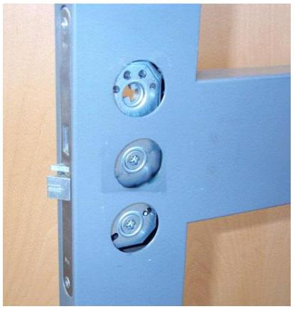

- 1. Montera låshuset. Den sexkantiga medbringaren vänds mot dörrens insida. För att säkerställa funktionen skall dörrspringan vara 1-3 mm. Montera slutblecket. Tillse att slutbleck och låshusets fall/fallar är väl smorda och löper lätt
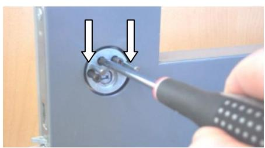

2. Utsidans cylinder monteras med 4 st höghållfasta cylinderskruvar genom den runda styrningen. De två styrpinnarna kapas vid behov enligt tabell och trycks fast i styrningen.

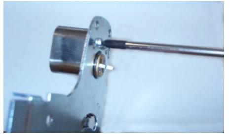

- 3. Kapa medbringaren på insidans cylinder enligt tabell. Fäst cylindern mot bottenplattan med två st 13 mm cylinderskruvar.
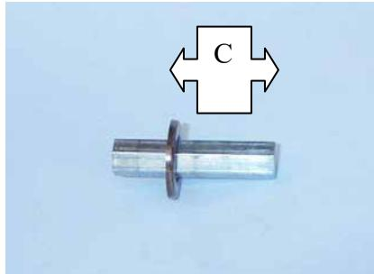

4. Justera stoppbrickan på den sexkantpinnen enligt tabell med hjälp av det bifogade rörverktyget. Två längder av sexkantpinnar bifogas för olika dörrtjocklekar. Pinnen kapas vid behov.

| Dörrens | Längd cyl.medbringare | Längd styrpinne | Stoppbricka/sexkantpinne |  |
|---------|-----------------------|-----------------|--------------------------|--|
| C-mått  | 0 / -1 mm             | ± 2 mm          | C-mått                   |  |
| 16,5 mm | 4 mm                  | 20 mm           | 12 mm                    |  |
| 20 mm   | 7 mm                  | 20 mm           | 17 mm                    |  |
| 25 mm   | 12 mm                 | 20 mm           | 22 mm                    |  |
| 30 mm   | 17 mm                 | 30 mm           | 27 mm                    |  |
| 35 mm   | 22 mm                 | 30 mm           | 32 mm                    |  |
| 40 mm   | 27 mm                 | 30 mm           | 37 mm                    |  |
| 45 mm   | 32 mm                 | 30 mm           | 42 mm                    |  |
| 50 mm   | 37mm                  | 46 mm           | 47 mm                    |  |
| 55 mm   | 42 mm                 | 46 mm           | 52 mm                    |  |

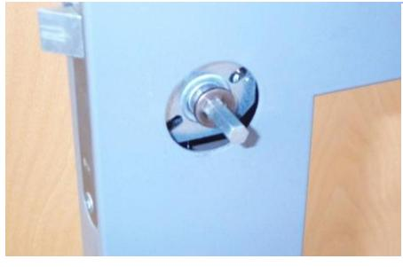

5. Stoppbrickan skall vid monteringen i låshuset vara vänd mot panikregelns centralenhet för att hindra sexkantpinnen att tappa ingreppet i låshusets tryckesroddare.

6. Montera centralenheten. Var noggrann med passningen mellan cylindermedbringaren och styrningen samt mellan sexkantpinnen och låshuset. Kulkopplingen skall vid monteringen vara vänd mot panikregelns tryckstång.

- 7. Kontrollera låshusets funktioner via cylindrarna:
- Regelutlåsning via cylinder på insida och utsida
- Indragning av regel/fall/fallar via cylinder på insida och utsida

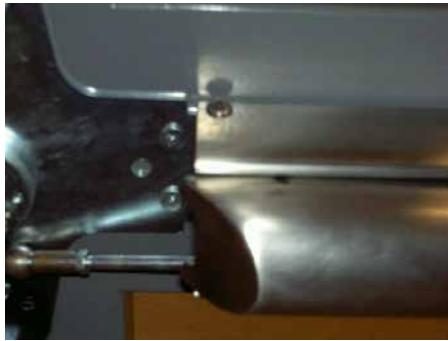

8. Fixera tryckstången med en insexskruv vid främre enheten.

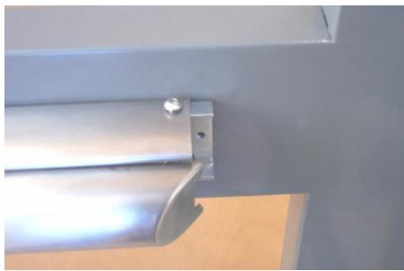

- 9. Skruva bort det förmonterade petskyddet från bakre fästet, placera tryckstången vågrätt på dörrbladet och skruva lätt fast det bakre fästet i dörren.
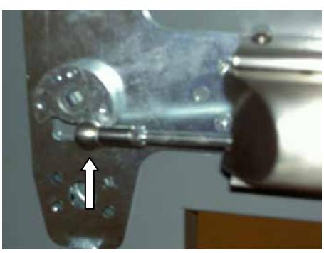

- 10. Koppla ihop tryckstångens länkarm med centralenhetens kulkoppling och montera låsringen på länkstångens kulkoppling.
- 11. Kontrollera följande funktioner:
- Öppning via tryckstången provas minst fem gånger. För låshus med hakregel skall denna vara utlåst vid provningen.
- Förregling av regel / fall / fallar

Vid behov justeras länkarmen enligt följande:

- -Ingen förregling/mekanismen för mycket förspänd;
- Vrid länkarmens kulkoppling medurs
- -Ej helt indragen fall/för kort slag på länkarmen:
- Vrid länkarmens kulkoppling moturs

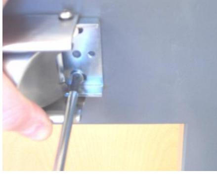

- 12. Skruva fast det bakre fästet ordentligt i dörren.
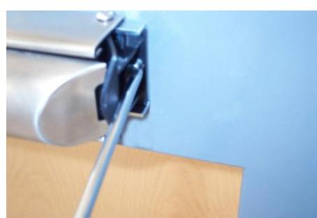

- 13. Montera petskyddet på bakre fästet.
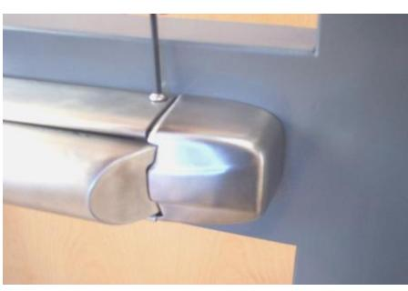

14. Montera den bakre kåpan och tryckstången på fästet med två insexskruvar.

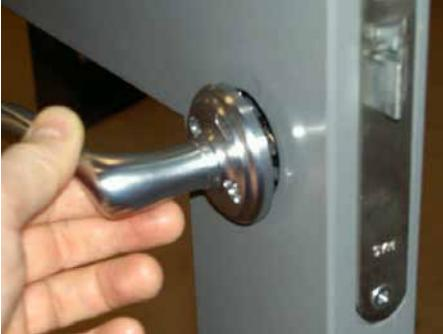

- 15. Montera utsidans trycke/täckskylt.
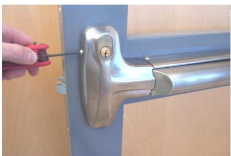

- 16. Montera den främre kåpan och tryckstången på centralenheten med fyra insexskruvar.

- 17. Montera bifogad efterlysande dekal på tryckstången.
- 18. Funktionsprova återigen enligt punkt 11.
# **Drift- och underhållsinstruktion för panikregel ASSA 1125**

# **Panikutrymningsbeslag**

#### **Underhållsintervall: Minst en gång i månaden**

Kontrollera att alla skruvar är väl fastdragna samt att beslagets öppningsmekanism löper utan svårighet.

Öppna dörren genom att trycka på öppningsmekanismen. Tillse att låshusets fallkolv greppar väl in i slutblecket när dörren stänger. Därvid skall panikutrymningsbeslaget återfjädra till utgångsläget.

Vid montage av utvändig tryckesfunktion skall även återinrymningsfunktionen kontrolleras. Kontrollera att panikutrymningsbeslagets dekal är oskadad och väl synlig.

# **Låshus**

# **Underhållsintervall: Minst två gånger per år**

Smörjning med fett på båda sidor av fall och regel skall ske vid installation samt därefter minst två gånger per år.

Använd smörjfett med god vidhäftning, t ex ASSA Låsfett eller liknande.

#### **Slutbleck**

#### **Underhållsintervall: Minst två gånger per år**

Glidytan mellan slutbleck och låshusets fall skall smörjas vid installation samt därefter minst två gånger per år.

Använd smörjfett med god vidhäftning, t ex ASSA Låsfett eller liknande.

Kontrollera glappet mellan slutbleck och låshusets fall. Justera vid behov.

#### **Låscylinder**

#### **Underhållsintervall: Minst två gånger per år**

Rengöring och smörjning skall ske minst två gånger per år. Använd ASSA Låsspray. Vid högfrekvent användning eller i utsatt miljö rekommenderas tätare underhållsintervall. *Varning!* Använd aldrig olja eller grafit i låscylindrar.

# **Mounting instruction panic exit device ASSA 1125**

This mounting instruction is intended for installation of panic exit device ASSA 1125 with following ordering numbers: 361282, 361283 and 361284 in combination with ASSA lock cases model 761-50/70, 762-50/70, 767-50/70 and 772-50/70.

With these lock cases ASSA 1125 can be installed together with following outside modular profile accessories:

- Accessory set ASSA 3325, ordering no 354565, including outside round cylinder cover and handle.

- Accessory set ASSA 3425, ordering no 354564, including outside round cylinder cover and cover plate for handle position.

ASSA 1125 must be installed together with ASSA strike plate model 1264 1-8 with following ordering numbers: 357207, 357208, 357730, 357732, 357728, 357729, 357731 and 357733. Model 1487 1-5 with ordering numbers: 357545, 357546, 357547, 357547 and 357548. Model 2530-50/70 with ordering numbers: 363759, 363760, 363761, 363762, 363763, 363764, 363765 and 363766.

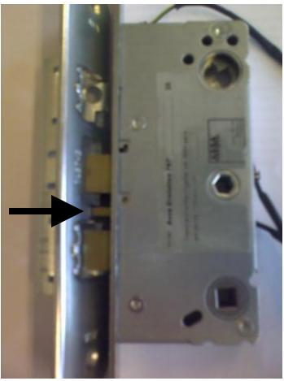

#### **Important!!**

**Make sure that the deadlocking latch hits the beam on the strike before you close the door.**

#### **Warning!**

The safety features of this product are essential to its compliance with EN 1125. No modification of any kind, other than those described in these instructions, are permitted. ASSA takes no responsibility for products not mounted as described in these instructions or if enclosed maintenance and operating instruction not are followed.

## **Classification according to EN 1125:2008**

| 1 | 2 | 3 | 4 | 5 | 6 | 7 | 8 | 9 | 10 |
|---|---|---|---|---|---|---|---|---|----|
| 3 | 6 | 6 | B | 1 | 3 | 2 | 2 | B | A  |

| 1)  | (3) suitable for use in high frequency applications;                     |
|-----|--------------------------------------------------------------------------|
| 2)  | (6) tested to 100 000 cycles;                                            |
| 3)  | (6) for a door mass of up to 200 kg,                                     |
|     | door width ≤1320 mm, door height ≤2520 mm;                               |
| 4)  | (B) suitable for use on fire/smoke resisting door assemblies;            |
| 5)  | (1) safe for use on escape route doors;                                  |
| 6)  | (3) high corrosion resistance;                                           |
| 7)  | (2) grade 2 security level 1000 N;                                       |
| 8)  | (2) horizontal bar projection of up to 100 mm;                           |
| 9)  | (B) "touch-bar" type B of panic exit device;                             |
| 10) | (A) suitable for use on a single door and double door: active leaf only. |
|     |                                                                          |

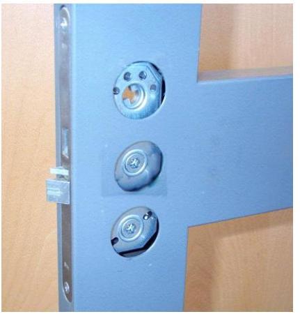

- 1. Install the lock case. The six-sided follower shall be turned against the panic device. The gap between door and frame shall be 1-3 mm to insure a proper function. Install the strike plate. Make sure that the latches and the strike plate are well lubricated and operate smoothly.
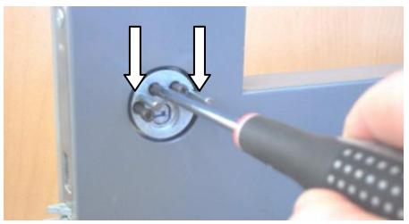

2. Outside cylinder is fixed by four high security bolts through the round mounting piece. The two steering pins are, if necessary, cut according to the table below and pressed into the mounting piece.

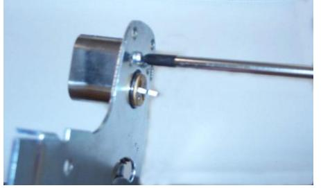

3. Cut the inside cylinder follower according to the table below. Attach the cylinder to the central unit bottom plate with two 13 mm screws.

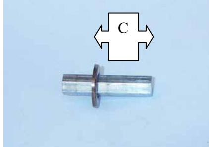

4. Use the circular tube tool and adjust the stop washer on the six-sided follower according to the table below. Put the adjusted six-sided follower into the lock case with the stop washer against the cylinder follower on the lock case.

Two lengths of the six-sided follower are enclosed in the package to suit different door thickness. The follower must if necessary be cutted.

| C-measure | Length of cylinder | Length steering pin | Stop washer/six-sided |  |
|-----------|--------------------|---------------------|-----------------------|--|
| of door   | follower           | ± 2 mm              | follower              |  |
|           | 0 / -1 mm          |                     | C-measure             |  |
| 16,5 mm   | 4 mm               | 20 mm               | 12 mm                 |  |
| 20 mm     | 7 mm               | 20 mm               | 17 mm                 |  |
| 25 mm     | 12 mm              | 20 mm               | 22 mm                 |  |
| 30 mm     | 17 mm              | 30 mm               | 27 mm                 |  |
| 35 mm     | 22 mm              | 30 mm               | 32 mm                 |  |
| 40 mm     | 27 mm              | 30 mm               | 37 mm                 |  |
| 45 mm     | 32 mm              | 30 mm               | 42 mm                 |  |
| 50 mm     | 37mm               | 46 mm               | 47 mm                 |  |
| 55 mm     | 42 mm              | 46 mm               | 52 mm                 |  |

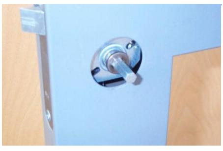

5. The stop washer must be turned against the central unit to prevent the six-sided follower to slip out from the lock case.

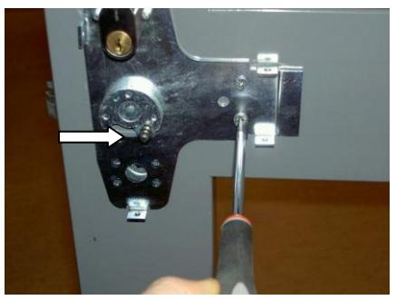

6. Attach the central unit. Pay attention to the connection between the cylinder follower and the mounting piece and between the six-sided follower and the lock case.

During installation the ball-and-socket joint must be turned against the direction of the panic bar.

7. Check the function from in- and outside cylinder:

- Function of dead bolt through in- and outside cylinder.
- Retraction of latch and deadlocking through in- and outside cylinder.

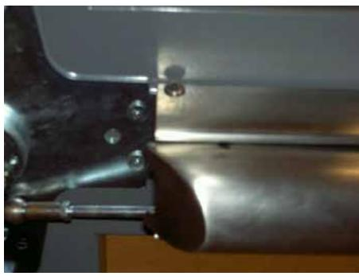

8. Attach the panic bar to the central unit with one Allen screw.

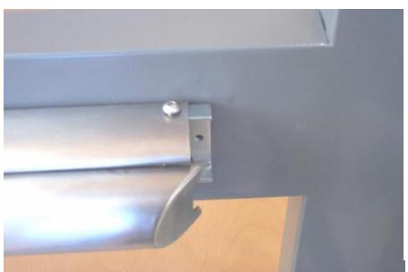

9. Remove the pre-mounted manipulation protection from the rear mounting bracket, place the push bar in a horizontal position and attach the rear mounting bracket firmly with one screw to the door.

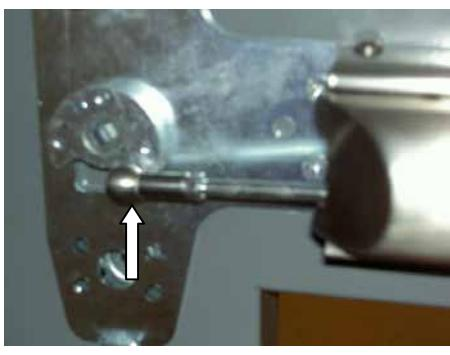

10. Connect the ball-and-socket joint between the panic bar and the central unit. Secure the ball-and-socket joint with the lock clip.

- 11. Check following functions:
- Opening by panic bar minimum five times. When lock case with hook bolt is used; hook bolt shall be in a locked position while testing.
- Deadlocking of dead bolt/latch/latches

If necessary, adjust the link arm like this:

- -No deadlocking/mechanism to hard:
- Turn the socket joint on the link arm clockwise.
- -Not fully retracted latch/to short movement on the link arm:
- Turn the socket joint on the link arm anti-clockwise.

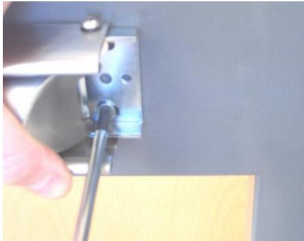

12. Attach the rear mounting bracket to the door with both screws.

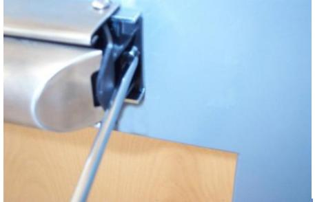

13. Attach the plastic manipulation protection to the bracket.

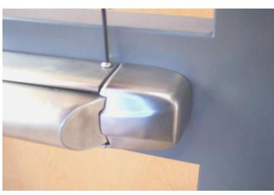

14. Attach the rear cover and the panic bar to the rear bracket with two Allen screws.

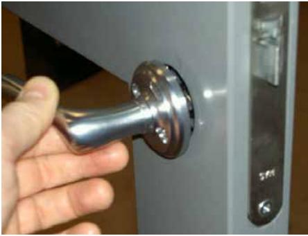

15. Attach the outside accessory; handle or cover plate.

When handle is used, se picture how spindle and spindle spring is to be installed.

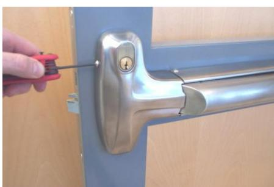

- 16. Attach front cover and panic bar with four Allen screws.
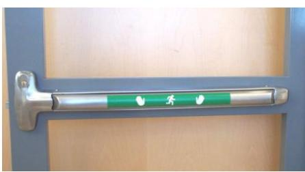

- 17. Attach enclosed after glowing stripe on the push bar.
- 18. Test the function again according to point 11.
# **Maintenance and operating instruction for panic exit device ASSA 1125**

# **Panic exit device**

# **Regular intervals of at least: One month**

Check all fastenings, screws etc and that the panic bar operates in good order. Open the door by pressing the panic bar. Ensure that the latch moves freely and get a god engagement in the strike plate when the door is closed. The panic bar shall easily return to its starting position after closing.

If outside handle is connected, also check the re-entry function after opening by the panic bar. Check that the after glowing stripe is undamaged and well visible. Replace with a new stripe if necessary.

#### **Lock case**

# **Regular intervals of at least: Six months**

Lubricate both sides of latch and dead bolt at installation and there after every six month. Use quality grease with high adhesive capacity, such as ASSA Lock Grease or similar.

# **Strike plate**

# **Regular intervals of at least: Six months**

Lubricate the sliding surface between strike plate and latch at installation and there after every six month.

Use quality grease with high adhesive capacity, such as ASSA Lock Grease or similar. The gap between door and frame shall be 1-3 mm to insure a proper function. Adjust if necessary.

#### **Lock cylinder**

#### **Regular intervals of at least: Six months**

Cleaning and lubricating is recommended before summer and winter.

Use ASSA Lock Spray for lubrication.

At high frequency use or hard environment a shorter period of maintenance is recommended. *Warning!* Never use oil or graphite lubricants in a lock cylinder.

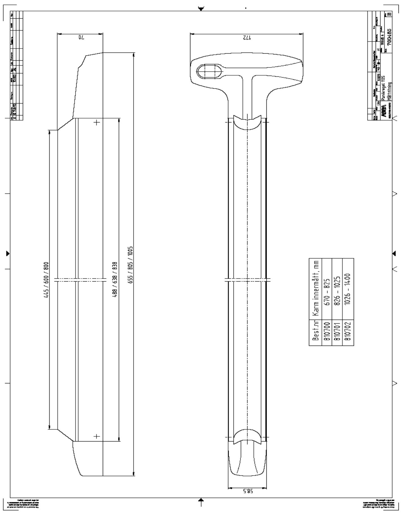

ASSA AB 091189 Utgåva / Edition 5 Sida / Page 15 / 15 160824