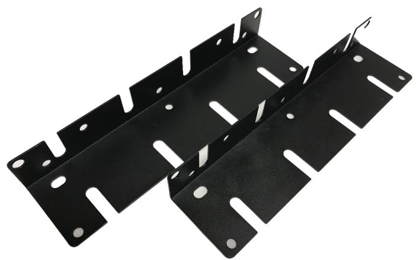

## T-19" FIXATING BR

Levereras parvis. Observera 1 par behövs till XM kapslingar, 2 par till XL & XXL kapslingar.

## Produktinformation

| Låsbar kapsling          | Nej     |
|--------------------------|---------|
| Antal kabelgenomföringar | 0       |
| Vikt (Kg)                | 0,2     |
| Väggmontage              | Nej     |
| 19¨ rackmontage          | Ja      |
| E-nummer                 | 5257180 |

| Teknisk specifikation      |             |
|----------------------------|-------------|
| Färg                       | Svart       |
| CE-godkänd                 | Ja          |
| Uppfyller RoHS2 direktivet | Ja          |
| Ursprungsland              | Sweden      |
| Tillverkare                | Milleteknik |

