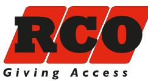
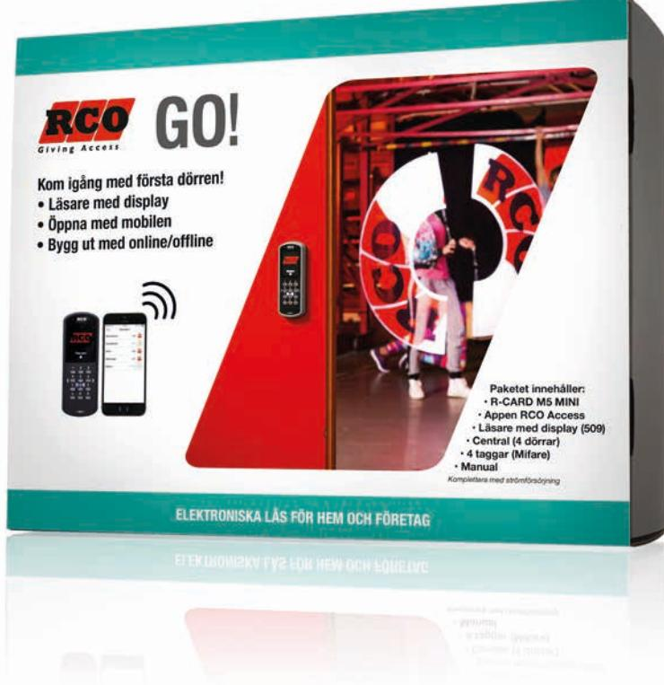
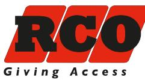
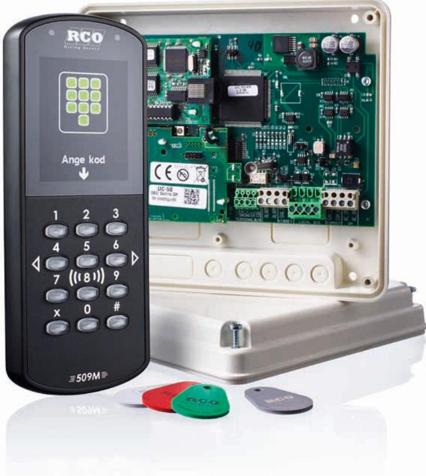

## RCO GO!

# **STARTPAKET RCO GO!**

### ALDRIG HAR DET VARIT SÅ ENKELT ATT FÅ TILLGÅNG TILL ETT AVANCERAT PASSERSYSTEM

Det har aldrig varit lättare att få ta del av det avancerade passersystemets alla funktioner för det lilla kontoret, bostadsrättsföreningen eller företaget. Vi har tagit fram ett helt nytt startpaket till våra återförsäljare. Paketet innehåller läsare med display och funktionaliteten att öppna dörren med mobilen. Med startpaketet GO är det enkelt att komma igång med ett modernt, skalbart och funktionellt passersystem som givetvis byggs ut på ett smidigt sätt. När din verksamhet växer och du vill utöka systemet med fler dörrar eller lägga till andra smidiga funktioner finns vi där. Vi följer med dig när din verksamhet växer.

> ELEKTRONISKA LÅS FÖR HEM OCH FÖRETAG RCO Security AB | 08-546 560 00 | info@rco.se | www.rco.se

## RCO GO!

#### STARTPAKETET MED MÖJLIGHETER

Det har aldrig varit så enkelt för det lilla företaget eller bostadsrättsföreningen att få tillgång till ett avancerat passersystem. Med vårt nya startpaket GO! är det lätt att komma igång och lika lätt att utöka med fler dörrar eller funktioner. Vi följer med när din verksamhet växer.

#### Paketet innehåller:

- Mjukvara R-CARD M5 MINI
- Appen RCO Access (med denna kan du fjäröppna dörren)
- En läsare med display i vilken du kan lägga in din egen logotype. Läsaren är enkel och intuitiv att använda då dörrfunktionerna visualiseras med bilder.
- Central för fyra dörrar
- Fyra stycken taggar
- Manual

Komplettera med strömförsörjning

#### Lösningar för alla

RCOs system använder sig av öppna gränssnitt så om du vill kan du kan enkelt integrera med andra system. Vi är säkra på att vi kan erbjuda just den lösning du behöver. Oavsett om det är en företagslösning eller en flerbostadslösning. Det kan du vara säker på.

#### RCO – en säker och trygg leverantör

Svenska RCO Security AB är en ledande leverantör, på den nordiska marknaden, av produkter och lösningar inom passer- och säkerhetssystem. Vårt erbjudande kännetecknas av god kvalitet, hög tillgänglighet och innovation. Tillverkningen sker vid vår egen utvecklingsavdelning i Järfälla utanför Stockholm där vi också har vårt huvudkontor. Genom närhet till våra kunder skapar vi en trygg, säker och smidig vardag.

#### Kontakt och försäljning

Försäljning, installation och service av våra produkter sker via ett brett nät av återförsäljare (lås-, larm-, teleoch elinstallatörer).

Läs mer på www.rco.se eller kontakta någon av våra återförsäljare.

#### ELEKTRONISKA LÅS FÖR HEM OCH FÖRETAG

RCO Security AB | 08-546 560 00 | info@rco.se | www.rco.se