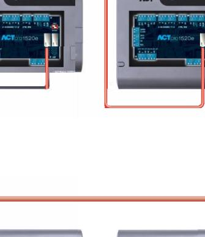
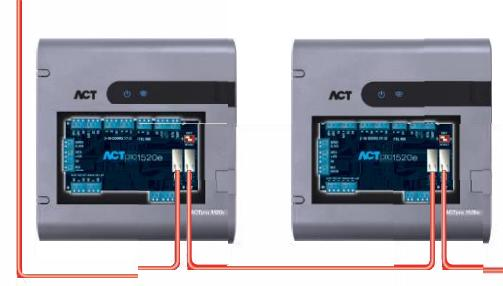
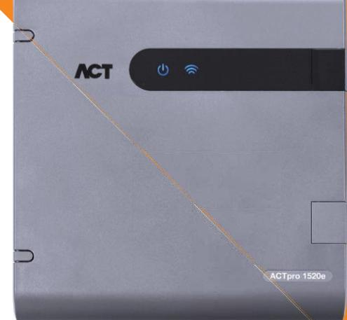
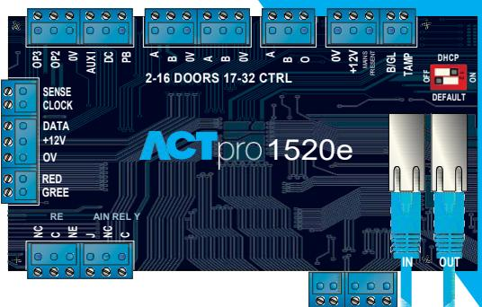

# IP-styrenhet för en dörr med 2 amp PSU

## **Introduktion:**

ACTpro 1520e är en IP-styrenhet för en dörr med 12V DC 2 amp PSU och innehåller en ethernet-brytare med dubbla portar. Styrenheten stöder 60 000 användare och innehåller en mängd avancerade funktioner, inklusive spänningsövervakning och glaskrossövervakning. ACTpro 1520e-styrenheten är idealisk för en dörr eller ett system som behöver växa till tusentals dörrar.

### **Funktioner:**

- Ethernet-brytare med dubbla portar möjliggör
- IP-anslutning
- 12V DC 2 amp PSU
- 60 000 användare (4 elektroniska nycklar per användare)
- 1 000 användargrupper
- Kompatibel med alla ACTpro-system
- Spänningsövervakning
- Glaskrossövervakning
- Övervakning av nätspänningsnärvaro, utmatningsspänning och sabotage
- Fel rapporterade på webbgränssnittet och ACT-företagsprogramvaran
- Anti-passback
- Brandåsidosättning
- Sluss/Interlock
- Larma/larma av centralapparat för inkräktarlarm
- IO-modulsupport (ACTpro IOM)
- Hisskontroll
- TCP/IP DHCP/Statiska IP-adresser
- Extra rättigheter och dörrplaner ingår
- Webserver inuti
- Statuslysdioder
- Utrymme i inneslutningen för kabelhantering
- Utrymme i inneslutningen för 1 x 7Hr amp-batteri
- Stöder dörrhanteringsteknik med upp till 32 dörrar
- Kompatibel med alla ACT-läsare

# **Produktspecifikation:**

|                 | ACTpro 1520e            |
|-----------------|-------------------------|
| Driftspänning   | 12V DC                  |
| Drifttemperatur | -10 till +50°C          |
| Storlek         | 235 mm x 255 mm x 85 mm |
| Vikt            | 950 g                   |
| Montering       | Yta                     |
| Installation    | Inomhus                 |

### **Certifieringar:**

Styrenheten till ACTpro 1520e uppfyller följande EU-direktiv: Utrustning för informationsbehandling – Säkerhet – EN60950-1 EMC-direktivet – 2004/108/EG

e

LAN

LAN

#### **Elektriska specifikation ACTpro 1520e**

| Inmatningsspänning          | 230VAC +/- 10 %                               |
|-----------------------------|-----------------------------------------------|
| Frekvens                    | 47-53 Hz                                      |
| Inmatningssäkring           | 625mA 250V anti-överspänningssäkring          |
| Utmatningsspänning          | 13,65V (+/- 5 %)                              |
| Maxlast                     | 2A @ 25°C                                     |
| Elektrisk utmatningssäkring | Ja                                            |
| Batteriström                | ~0,5A för batteriurladdning till ~10V         |
| Batteriskydd                | Djup urladdning/överladdning/Omvänd polaritet |

#### **Orderinformation**

| ACTpro 1520e | IP-styrenhet för en dörr med 12 Volt 2 amp PSU |
|--------------|------------------------------------------------|
| ACTpro 1500e | IP-styrenhet en dörr                           |
| ACTpro IOM   | IO-modul (8 ingångar och 8 utgångar)           |

| Produktjämförelser                                 | ACTpro 1520e              | ACTpro 1500e              | ACTpro 4000               | ACTpro 4200               |
|----------------------------------------------------|---------------------------|---------------------------|---------------------------|---------------------------|
| Användare                                          | 60 000                    | 60 000                    | 60 000                    | 60 000                    |
| Kort per användare                                 | 4                         | 4                         | 2 (kräver SD-kort för 4)  | 2 (kräver SD-kort för 4)  |
| Användargrupper                                    | 1 000                     | 1 000                     | 1 000                     | 1 000                     |
| Dörrar på styrenhet                                | 1                         | 1                         | 2                         | 4                         |
| Extra rättigheter                                  | Ja                        | Ja                        | Kräver SD-kort            | Kräver SD-kort            |
| Dörrplan                                           | Ja                        | Ja                        | Kräver SD-kort            | Kräver SD-kort            |
| Logga händelser                                    | 5 000                     | 5 000                     | 5 000                     | 5 000                     |
| Dörr övervakning (Forcerad dörr/dörr på glänt)  | Ja                        | Ja                        | Ja                        | Ja                        |
| Anti-passback                                      | Ja                        | Ja                        | Ja                        | Ja                        |
| Brandlarmsåsidosättning                            | Ja                        | Ja                        | Ja                        | Ja                        |
| Sluss/Interlock                                    | Ja                        | Ja                        | Ja                        | Ja                        |
| Larma/larma av centralapparat för inkräktarlarm | Ja                        | Ja                        | Ja                        | Ja                        |
| IO-modul-support                                   | Ja                        | Ja                        | Ja                        | Ja                        |
| Hisskontroll                                       | Ja                        | Ja                        | Ja                        | Ja                        |
| Spänningsövervakning                               | Ja                        | Ja                        | Ja                        | Ja                        |
| AC nätspänningsövervakning                         | Ja                        | Ja                        | Ja                        | Ja                        |
| Batteriövervakning                                 | Ja                        | Ja                        | Ja                        | Ja                        |
| Glaskrossövervakning                               | Ja                        | Ja                        | Ja                        | Ja                        |
| Sabotageövervakning                                | Ja                        | Ja                        | Ja                        | Ja                        |
| PSU                                                | Ja (2 Amp)                | Nej                       | Nej                       | Ja (3 Amp)                |
| Ethernet-portar                                    | 2                         | 2                         | 1                         | 1                         |
| Webbserver på insidan                              | Ja                        | Ja                        | Nej                       | Nej                       |
| Knappsats/LCD-gränssnitt                           | Nej                       | Nej                       | Ja                        | Ja                        |
| DHCP/Statisk IP-adress                             | Ja                        | Ja                        | Ja                        | Ja                        |
| NetBIOS-namn                                       | Ja                        | Ja                        | Ja                        | Ja                        |
| Ingång Utgång Läsare                               | Ja (flera upp till 500mA) | Ja (flera upp till 500mA) | Ja (flera upp till 500mA) | Ja (flera upp till 500mA) |
| Tidsåtgärder                                       | Ja                        | Ja                        | Ja                        | Ja                        |
| Växlare/Spärr                                      | Ja                        | Ja                        | Ja                        | Ja                        |
| Endast kort eller endast PIN-kod                   | Ja                        | Ja                        | Ja                        | Ja                        |
| Kort och PIN-kod                                   | Ja                        | Ja                        | Ja                        | Ja                        |
| Dubbelanvändare                                    | Ja                        | Ja                        | Ja                        | Ja                        |
| Giltighetstid                                      | Ja                        | Ja                        | Ja                        | Ja                        |
| Samlingsrapporter                                  | Ja                        | Ja                        | Ja                        | Ja                        |
| Dörr relä utgång                                   | 5 amp                     | 5 amp                     | 5 amp                     | 5 amp                     |
| Externt relä utgång                                | 1 amp                     | 1 amp                     | 1 amp                     | 1 amp                     |
| Programmerbara ingångar                            | 2                         | 2                         | 2                         | 2                         |
| Programmerbara utgångar                            | 2 (100 mA)                | 2 (100 mA)                | 2 (100 mA)                | 2 (100 mA)                |
| ACT Support för dörrstationer (RS485)              | Ja (31 Dörrstationer)     | Ja (31 Dörrstationer)     | Ja (14 Dörrstationer)     | Ja (14 Dörrstationer)     |
| Support RS485 ihopkopplade styrenheter          | Ja                        | Ja                        | Ja                        | Ja                        |
| Support TCP/IP-anslutna styrenheter                | Ja                        | Ja                        | Nej                       | Nej                       |
| Max ACT-styrenheter på ACT Enterprise Obegränsat   |                           | Obegränsat                | Obegränsat                | Obegränsat                |
| Garanti                                            | 5 år                      | 5 år                      | 5 år                      | 5 år                      |
| Stöder ACTpro läsare                               | Ja                        | Ja                        | Ja                        | Ja                        |
| Stöder tredjepartsläsare från Wiegand              | Ja                        | Ja                        | Ja                        | Ja                        |
| Stöder tredjepartsläsare från C&D                  | Ja                        | Ja                        | Ja                        | Ja                        |
|                                                    |                           |                           |                           |                           |

Unit C1, South City Business Centre, Tallaght, Dublin 24, Irland **Tfn** +353 (0)1 466 2570

Unit 601, Birchwood 1, Dewhurst Road, Birchwood, Warrington, WA3 7GB, Storbritannien **Tfn** +44 (0)161 236 9488

**www.act.eu**