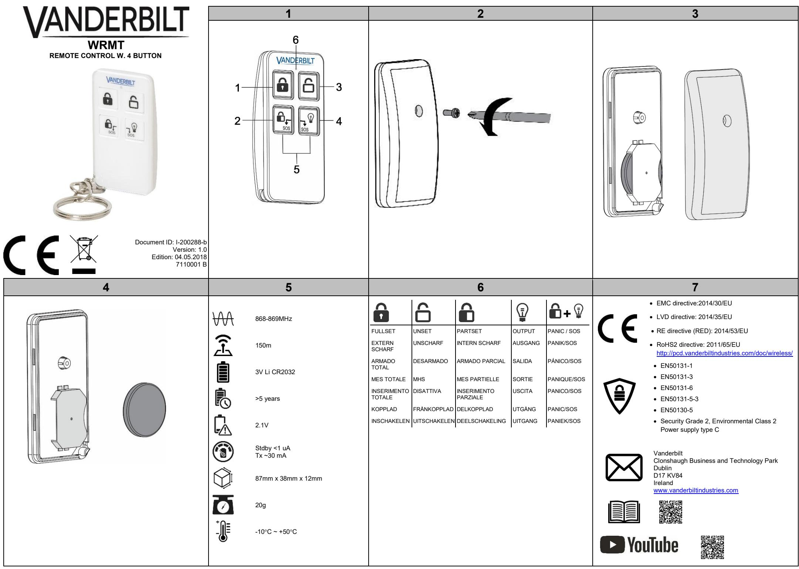

| EN                                                                                                                                     | DE                                                                                                                  | FR                                                                                                                               | ES                                                                                                                                    |
|----------------------------------------------------------------------------------------------------------------------------------------|---------------------------------------------------------------------------------------------------------------------|----------------------------------------------------------------------------------------------------------------------------------|---------------------------------------------------------------------------------------------------------------------------------------|
| OVERVIEW                                                                                                                               | ÜBERBLICK                                                                                                           | PRÉSENTATION                                                                                                                     | VISIÓN GENERAL                                                                                                                        |
| The WRMT 4-button Remote is a device which allows a user to                                                                            | Die WRMT-Fernbedienung mit 4 Tasten ermöglicht die Bedienung                                                        | La télécommande WRMT à 4 boutons permet à l'utilisateur d'activer le                                                             | El dispositivo remoto WRMT de 4 botones es un dispositivo que permite al                                                              |
| remotely operate the SPC system. The device supports UNSET,                                                                            | des SPC-System per Fernzugriff. Das Gerät unterstützt die                                                           | système SPC à distance. Elle prend en charge les fonctionnalités MHS                                                             | usuario manejar de forma remota el sistema SPC. El dispositivo es                                                                     |
| FULLSET, PARTSET functionality, as well as the operation of                                                                            | Funktionen UNSCHARFSCHALTEN, EXTERN SCHARFSCHALTEN                                                                  | (Mise Hors Service), MES totale (Mise En Service), MES partielle, et                                                             | compatible con las funciones DESARMADO, ARMADO TOTAL, ARMADO                                                                          |
| defined outputs and an SOS feature.                                                                                                    | und INTERN SCHARFSCHALTEN sowie den Betrieb von definierten                                                         | peut être utilisée pour envoyer des signaux de sortie définis et un SOS.                                                         | PARCIAL, así como con el funcionamiento de las salidas definidas y una                                                                |
| DISCOVERY AND ASSIGNMENT PROCESS                                                                                                       | Ausgängen und eine SOS-Funktion.                                                                                    | DÉTECTION ET PROCESSUS                                                                                                           | función SOS.                                                                                                                          |
| To discover the WRMT from the SPC control panel:                                                                                       | ERKENNEN UND ZUWEISEN                                                                                               | D'AFFECTATION                                                                                                                    | PROCESO DE DESCUBRIMIENTO Y                                                                                                           |
| 1. In the SPC browser, select Users>Wireless FOB.                                                                                   | Erkennen der WRMT über die SPS-Webseite:                                                                            | Pour trouver l'émetteur WRMT via la page Web de SPC :                                                                            | ASIGNACIÓN                                                                                                                            |
| 2. On the WRMT, press and hold both SOS buttons (Fig. 1,                                                                            | 1. Im Zentralenbrowser die Optionen Benutzer>Fernbedienung                                                          | 1. Dans la fenêtre du navigateur, sélectionnez Utilisateurs>Tag radio                                                            | Para descubrir el WRMT a través de la página web del SPC:                                                                             |
| items 2 and 4).                                                                                                                        | wählen.                                                                                                             | sans fil.                                                                                                                        | 1. En el navegador del panel, seleccione Usuarios>Mando vía radio.                                                                 |
| The LED (Fig. 1, item 6) blinks Red once and then Green. 3. Click Refresh on the Wireless FOB page to display the                | 2. Auf der WRMT beide SOS-Tasten drücken und gedrückt halten                                                        | 2. Sur la télécommande WRMT, appuyez et maintenez enfoncés les                                                                   | 2. En el WRMT, pulse y mantenga presionados los dos botones SOS                                                                    |
| WRMT.                                                                                                                                  | (Abb. 1, Elemente 2 und 4).                                                                                         | deux boutons SOS (Fig. 1, éléments 2 et 4).                                                                                      | (fig. 1, elementos 2 y 4).                                                                                                            |
| You can now assign the discovered WRMT to a system                                                                                     | Die LED (Abb. 1, Element 6) blinkt einmal rot und dann grün.                                                        | La LED (Fig. 1, élément 6) clignote en rouge une fois, puis en vert.                                                             | El LED (fig. 1, elemento 6) parpadea en rojo una vez y después se                                                                     |
| user.                                                                                                                                  | 3. Auf der Browserseite der Fernbedienung auf Aktualisieren klicken, um die WRMT anzuzeigen.                     | 3. Cliquez sur Rafraîchir sur la page de Tag radio sans fil pour afficher la télécommande WRMT.                               | queda encendido en verde. 3. Haga clic en Actualizar en la página del Mando vía radio para                                      |
| To enrol the WRMT and assign to User (n) through a keypad:                                                                             | Nun kann die erkannte WRMT einem Systembenutzer zugewiesen                                                          | Vous pouvez maintenant assigner la télécommande WRMT                                                                             | visualizar el WRMT.                                                                                                                   |
| 1. On the keypad, select USERS>EDIT>USER (n)>RF                                                                                     | werden.                                                                                                             | détectée à un utilisateur système.                                                                                               | Ahora puede asignar el WRMT descubierto a un usuario del sistema.                                                                     |
| FOB>ENABLED.                                                                                                                           |                                                                                                                     |                                                                                                                                  |                                                                                                                                       |
| The keypad displays the ADD screen with a flashing                                                                                     | Anmelden der WRMT und Zuweisen eines Benutzers über ein Bedienteil:                                              | Pour enregistrer la télécommande WRMT et l'assigner à un Utilisateur(n) via le clavier :                                      | Para registrar el WRMT y asignarlo al usuario (n) a través de un teclado:                                                          |
| ENROL DEVICE message.                                                                                                                  | 1. Auf dem Bedienteil                                                                                               | 1. Sur le clavier, sélectionnez                                                                                               | 1. En el teclado, seleccione USUARIOS>EDITAR>USUARIO                                                                               |
| 2. On the WRMT, press and hold the two SOS buttons (Fig. 1,                                                                         | BENUTZER>BEARBEITEN>BENUTZER>FERNBEDIENUNG>AK                                                                       | UTILISATEURS>ÉDITION>UTILISATEUR(n)>RF                                                                                           | (n)>MANDO VÍA RADIO>HABILITADO.                                                                                                       |
| items 2 and 4). The LED blinks Red once and then Green to                                                                              | TIVIERT wählen.                                                                                                     | FOB>ACTIVÉ.                                                                                                                      | El teclado muestra la pantalla AÑADIR con un mensaje intermitente                                                                     |
| confirm enrollment.                                                                                                                    | Das Bedienteil zeigt den Bildschirm HINZUFÜGEN mit der                                                              | L'écran AJOUTER est affiché sur le clavier ; le message                                                                          | de INSCRIBIR DISPOSITIVO.                                                                                                             |
| The WRMT is assigned to User (n).                                                                                                      | blinkenden Meldung GERÄT ANMELDEN an.                                                                               | INSCRIVEZ l'APPAREIL clignote.                                                                                                   | 2. En el WRMT, pulse y mantenga presionados los dos botones SOS                                                                    |
| For more detailed instructions on the configuration of a WRMT device, see the SPC installation and configuration instructions (Fig. | 2. Auf der WRMT die beiden SOS-Tasten drücken und halten (Abb. 1,                                                   | 2. Sur la télécommande WRMT, appuyez et maintenez enfoncés les deux boutons SOS (Fig. 1, éléments 2 et 4). La LED (Fig. 1, | (fig. 1, elementos 2 y 4). El LED parpadea en rojo una vez y                                                                          |
| 7, QR code).                                                                                                                           | Elemente 2 und 4). Die LED blinkt einmal rot und dann grün, um                                                      | élément 6) clignote en rouge une fois, puis en vert pour confirmer                                                               | después se quedan encendido en verde para confirmar el registro. El WRMT se ha asignado al usuario (n).                            |
| CLEAR REGISTRATION                                                                                                                     | die Anmeldung zu bestätigen.                                                                                        | l'enregistrement.                                                                                                                | Para obtener instrucciones más detalladas sobre la configuración de un                                                                |
|                                                                                                                                        | Die WRMT ist nun einem Benutzer zugewiesen. Detailliertere Anweisungen zur Konfiguration eines WRMT-Gerätes      | La télécommande WRMT est assignée à l'utilisateur (n).                                                                           | dispositivo WRMT, consulte las instrucciones de instalación y                                                                         |
| When you delete a WRMT from your system, you must also clear the internal registration in the WRMT before you can re-use the        | können den SPC-Installations- und -Konfigurationsanweisungen                                                        | Pour recevoir des instructions plus détaillées concernant la                                                                     | configuración del SPC (fig. 7, código QR).                                                                                            |
| WRMT.                                                                                                                                  | entnommen werden (Abb. 7, QR-Code).                                                                                 | configuration d'un équipement WRMT, voir les instructions d'installation                                                         | ELIMINAR UN REGISTRO                                                                                                                  |
| 1. On the WRMT, press and hold the PARTSET and UNSET                                                                                | LÖSCHEN DER REGISTRIERUNG                                                                                           | et de configuration SPC (Fig. 7, code QR).                                                                                       | Al borrar un WRMT del sistema, también debe borrar el registro interno                                                                |
| buttons (Fig. 1, items 2 and 3).                                                                                                       | Wenn eine WRMT aus dem System gelöscht wird, muss auch die interne                                                  | SUPPRESSION DE L'ENREGISTREMENT                                                                                                  | en el WRMT antes de poder volver a utilizar el WRMT.                                                                                  |
| The LED blinks Red and Orange to confirm that registration                                                                             | Registrierung in der WRMT gelöscht werden, damit die WRMT wieder                                                    | Lorsque vous supprimez un équipement WRMT de votre système, vous                                                                 | 1. En el WRMT, pulse y mantenga presionados los botones ARMADO                                                                        |
| is cleared.                                                                                                                            | verwendet werden kann.                                                                                              | devez également supprimer l'enregistrement interne de l'équipement                                                               | PARCIAL y DESARMADO (fig. 1, elementos 2 y 3).                                                                                        |
| DEVICE OPERATION                                                                                                                       | 1. Auf der WRMT die Tasten INTERN SCHARFSCHALTEN und                                                                | WRMT avant de pouvoir le réutiliser. 1. Sur la télécommande WRMT, appuyez et maintenez enfoncés les                           | El LED parpadea en rojo y naranja para confirmar que se ha eliminado el                                                               |
| Once enrolled on the SPC system, the WRMT can be used to                                                                               | UNSCHARFSCHALTEN drücken und gedrückt halten (Abb. 1,                                                               | deux boutons MES Partielle et MHS (Fig. 1, éléments 2 et 3).                                                                     | registro.                                                                                                                             |
| FULLSET, UNSET or PARTSET the system. The WRMT can also                                                                                | Elemente 2 und 3).                                                                                                  | La LED clignote en rouge et orange pour confirmer la suppression de                                                              | FUNCIONAMIENTO DEL DISPOSITIVO                                                                                                        |
| be used to turn on outputs or to raise a panic alarm (Fig. 6).                                                                         | Die LED blinkt rot und orange, um die Löschung der Registrierung zu bestätigen.                                  | l'enregistrement.                                                                                                                | Una vez registrado en el sistema SPC, el WRMT puede usarse para el                                                                    |
| For all actions, the LED (Fig 1, item 6) blinks Red then Green.                                                                        |                                                                                                                     | UTILISATION DE LA TÉLÉCOMMANDE                                                                                                   | ARMADO TOTAL, DESARMADO o ARMADO PARCIAL del sistema. El WRMT también se puede utilizar para activar las salidas o para emitir una |
| For FULLSET, UNSET or PARTSET actions the background LED behind the appropriate button blinks Red to indicate the updated           | GERÄTEBETRIEB                                                                                                       | Une fois enregistrée dans le système SPC, la télécommande WRMT                                                                   | alarma de pánico (fig. 6).                                                                                                            |
| system status.                                                                                                                         | Sobald die Anmeldung auf dem SPC-System erfolgt ist, kann die WRMT                                                  | peut être utilisée pour activer la MES totale, MHS ou MES partielle du                                                           |                                                                                                                                       |
| LOW BATTERY                                                                                                                            | zum EXTERN SCHARFSCHALTEN, UNSCHARFSCHALTEN oder INTERN SCHARFSCHALTEN des Systems verwendet werden. Die         | système. La télécommande WRMT peut également être utilisée pour                                                                  | Para todas las acciones, el LED (Fig. 1, elemento 6) parpadea en rojo y                                                               |
| If the battery in a device is low, for every operation the LED (Fig. 1,                                                                | WRMT dient außerdem zum Einschalten der Ausgänge oder zum                                                           | activer les signaux de sortie ou envoyer une alarme de panique (Fig. 6).                                                         | luego en verde. Para las acciones ARMADO TOTAL, DESARMADO o ARMADO                                                                 |
| item 6) blinks Red 3 times then blinks Green.                                                                                          | Aktivieren eines Überfallalarms (Abb. 6).                                                                           | Pour toutes les actions, la LED (fig. 1, élément 6) clignote en rouge puis                                                       | PARCIAL, el LED de fondo detrás del botón apropiado parpadea en rojo                                                                  |
| BATTERY REPLACEMENT                                                                                                                    |                                                                                                                     | en vert.                                                                                                                         | para indicar el estado del sistema actualizado.                                                                                       |
| 1. Open the screw on the back of the WRMT (Fig. 2)                                                                                  | Bei allen Aktionen blinkt die LED (Abb. 1, Element 6) rot und dann grün. Bei den Aktionen EXTERN SCHARFSCHALTEN, | Pour les actions MES TOTALE, MHS ou MES PARTIELLE, le voyant                                                                     | BATERÍA BAJA                                                                                                                          |
| 2. Open the cover of the WRMT (Fig. 3).                                                                                             | UNSCHARFSCHALTEN oder INTERN SCHARFSCHALTEN blinkt die                                                              | d'arrière-plan derrière le bouton approprié clignote en rouge pour                                                               | Si la batería de un dispositivo está baja, el LED (fig. 1, elemento 6)                                                                |
| 3. Pull out the old battery (Fig. 4).                                                                                               | Hintergrund-LED hinter der entsprechenden Taste rot, um den                                                         | indiquer l'état du système mis à jour.                                                                                           | parpadea 3 veces en rojo y luego parpadea en verde con cada operación.                                                                |
| 4. Insert new battery, verify the correct polarity.                                                                                 | aktualisierten Systemstatus anzuzeigen.                                                                             | PILE FAIBLE                                                                                                                      | SUSTITUCIÓN DE LA BATERÍA                                                                                                             |
|                                                                                                                                        | BATTERIE SCHWACH                                                                                                    | Si la pile de la télécommande est faible, la LED (fig. 1, élément 6)                                                             | 1. Abra el tornillo en la parte posterior del WRMT (fig. 2)                                                                           |
| CAUTION                                                                                                                                | Wenn die Batterie im Gerät schwach ist, blinkt die LED (Abb. 1,                                                     | clignote en rouge 3 fois, puis en vert, chaque fois que l'utilisateur                                                            | 2. Abra la cubierta del WRMT (fig. 3).                                                                                                |
| The battery must be replaced by 3V Lithium models                                                                                      | Element 6) bei jedem Betrieb dreimal rot und anschließend grün.                                                     | appuie sur un bouton.                                                                                                            | 3. Extraiga la batería usada (fig. 4).                                                                                                |
| CR2032.                                                                                                                                | AUSTAUSCH DER BATTERIE                                                                                              | REMPLACEMENT DE LA PILE                                                                                                          | 4. Inserte una batería nueva, verifique que la polaridad sea correcta                                                                 |
|                                                                                                                                        | 1. Die Schraube auf der Rückseite der WRMT lösen (Abb. 2).                                                          | 1. Enlever la vis à l'arrière de la télécommande WRMT (fig. 2).                                                                  |                                                                                                                                       |

- 
**PRECAUCIÓN** La batería debe sustituirse por modelos de litio de 3 V CR2032.

**ACHTUNG**

mit 3 V ausgetauscht werden.

Die Batterie muss gegen eine Lithium-Batterie CR2032

4. Eine neue Batterie einlegen und dabei auf die korrekte Polarität

2. Die Abdeckung der WRMT öffnen (Abb. 3). 3. Die alte Batterie herausnehmen (Abb. 4).

achten.

2. Ouvrir le couvercle (fig. 3). 3. Sortir la pile vide (fig. 4).

> **ATTENTION** La pile doit être remplacée uniquement par une nouvelle

> > pile CR2032 3V au lithium.

4. Insérer la nouvelle pile en respectant la polarité.

## **IT NL SV PANORAMICA**

Il telecomando a 4 tasti WRMT è un dispositivo che consente all'utente di azionare in remoto il sistema SPC. Il dispositivo supporta funzionalità quali UNSET (disattiva), FULLSET (inserimento totale), PARTSET (inserimento parziale), così come il funzionamento di uscite definite e una caratteristica SOS.

## **PROCESSO DI ASSEGNAZIONE E RILEVAMENTO**

- **Per rilevare il WRMT attraverso la pagina Web SPC:** 1. Nel browser del pannello selezionare **Utenti**>**Telecomando (FOB)**.
- 2. Sul WRMT, premere e tenere premuti i pulsanti SOS (Fig. 1, elementi 2 e 4).
- Il LED (Fig. 1, elemento 6) lampeggia in rosso una volta, poi in verde.
- 3. Fare clic su **Ricarica** sulla pagina del **Telecomando (FOB)** per visualizzare il WRMT. Ora è possibile assegnare il dispositivo WPAN rilevato a un utente del sistema.

**Per iscrivere il WRMT e assegnarlo a un utente usando una tastiera:**

- 1. Sulla tastiera selezionare **UTENTI>MODIFICA>UTENTE(I) >TELECOMAN. (FOB) >ABILITATO**. La tastiera mostra la schermata **AGGIUNGI** con un messaggio
- **ISCRIVERSI DISPOSITIVO** lampeggiante. 2. Sul WRMT, premere e mantenere premuti i due pulsanti SOS
- (Fig. 1, elementi 2 e 4). Il LED lampeggia in rosso una volta e poi in verde per confermare che l'iscrizione è avvenuta. Il WRMT è assegnato a Utente(i).

Per istruzioni più dettagliate sulla configurazione di un dispositivo WRMT, fare riferimento alle istruzioni di installazione e configurazione dell'SPC (Fig. 7, codice QR).

## **CANCELLAZIONE DELLA REGISTRAZIONE**

Quando si elimina un WRMT dal sistema, è necessario eliminare la registrazione interna del WRMT prima di poter riutilizzare il WRMT. 1. Sul WRMT, premere e tenere premuti i pulsanti INSERIMENTO

- PARZIALE e DISATTIVA (Fig. 1, elementi 2 e 3).
- Il LED lampeggia in rosso e arancione per confermare
- l'eliminazione della registrazione.

#### **FUNZIONAMENTO DEL DISPOSITIVO**

Una volta registrato sul sistema SPC, il WRMT può essere usato per INSERIMENTO TOTALE, DISATTIVA o INSERIMENTO PARZIALE. Il WRMT può inoltre essere usato per attivare le uscite o sollevare un allarme panico (Fig. 6).

Per tutte le azioni, il LED (Fig 1, elemento 6) lampeggia in rosso, quindi in verde.

Per le azioni INSERIMENTO TOTALE, DISATTIVA o INSERIMENTO PARZIALE, il LED di sfondo dietro il pulsante appropriato lampeggia in rosso per indicare lo stato del sistema aggiornato.

## **BATTERIA SCARICA**

Se la batteria del dispositivo è scarica, ad ogni operazione il LED (Fig. 1, elemento 6) lampeggia in rosso 3 volte, poi in verde.

#### **SOSTITUZIONE DELLA BATTERIA**

- 1. Svitare la vite sulla parte posteriore del WRMT (Fig. 2).
- 2. Aprire il coperchio del WRMT (Fig. 3).
- 3. Estrarre la vecchia batteria (Fig. 4).

4. Inserire la nuova batteria, verificando la corretta polarità.

#### **ATTENZIONE**

La batteria deve essere sostituita con modelli al litio 3V CR2032.

# **OVERZICHT**

De WRMT is een afstandsbediening met 4 knoppen voor het SPCsysteem. Met de WRMT kunt u het SPC-systeem uitschakelen, inschakelen en gedeeltelijk inschakelen. Daarnaast kunt u ingestelde uitgangen activeren en een paniekalarm verzenden.

## **PROCEDURE VOOR DETECTIE EN TOEWIJZEN**

#### **De WRMT detecteren via de SPC-webpagina:**

- 1. Selecteer in het browserscherm **Gebruikers>Draadloze FOB**. 2. Druk op de WRMT op de twee SOS-knoppen en houd deze
- ingedrukt (Afb. 1, item 2 en 4). De led (Afb. 1, item 6) knippert een keer rood en daarna groen. 3. Klik op **Vernieuwen** op de pagina **Draadloze FOB** om de
- WRMT weer te geven. U kunt nu de gedetecteerde WRMT toewijzen aan een gebruiker
- van het SPC-systeem.

#### **De WRMT registreren en toewijzen aan Gebruiker (n) met een keypad:**

- 1. Selecteer op het keypad **GEBRUIKERS**>**BEWERKEN**>**GEBRUIKER** (n)>**RF FOB**>**INGESCHAKELD**.
	- Het scherm **TOEVOEGEN** wordt geopend. Hierin knippert het bericht **INLEREN APPARAAT**.
- 2. Druk op de WRMT op de twee SOS-knoppen en houd deze ingedrukt (Afb. 1, item 2 en 4). De led knippert een keer rood en vervolgens groen om de registratie te bevestigen.
- De WRMT is toegewezen aan Gebruiker (n). Zie de instructies voor installatie en configuratie van het SPCsysteem voor uitgebreidere instructies voor de configuratie van een

WRMT (Afb. 7, QR-code).

### **REGISTRATIE WISSEN**

Als u een WRMT uit het systeem verwijdert, moet u ook de interne registratie in de WRMT wissen voordat u de WRMT opnieuw kunt gebruiken.

- 1. Druk op de WRMT op de knoppen DEELSCHAKELING en UITSCHAKELEN en houd deze ingedrukt (Afb. 1, item 2 en 3). De led knippert rood en oranje om te bevestigen dat de registratie is gewist.
# **BEDIENING VAN DE WRMT**

Met een WRMT die is geregistreerd in het SPC-systeem, kan het systeem worden INSCHAKELEN, UITSCHAKELEN DEELSCHAKELING. Met de WRMT kunt u ook uitgangen activeren en een paniekalarm verzenden (Afb. 6)

Voor alle acties knippert de LED (Fig. 1, item 6) Rood en vervolgens Groen.

Voor INSCHAKELEN, UITSCHAKELEN of DEELSCHAKELING acties knippert de achtergrond-led achter de betreffende knop rood om de bijgewerkte systeemstatus aan te geven.

## **LAAG BATTERIJNIVEAU**

Als de batterij in een apparaat bijna leeg is, knippert de led (Afb. 1, item 6) 3 keer rood en vervolgens groen.

# **BATTERIJ VERVANGEN**

- 1. Draai de schroef op de achterzijde van de WRMT los (Afb. 2).
- 2. Haal de achterzijde van de WRMT los (Afb. 3).
- 3. Verwijder de oude batterij (Afb. 4). 4. Plaats de nieuwe batterij. Let op de polariteit.

**LET OP** Gebruik alleen CR2032 lithium-batterijen van 3 volt.

# **ÖVERSIKT**

WRMT-fjärrkontrollen med 4 knappar är en enhet som låter användaren fjärrstyra SPC-systemet. Enheten stöder funktionerna FRÅNKOPPLING, TILLKOPPLING och DELTILLKOPPLING samt även styrning av definierade utgångar och en SOS-funktion.

## **PROCESS FÖR IDENTIFIERING OCH TILLDELNING**

#### **För att identifiera WRMT-enheten via SPC-webbplatsen:**

- 1. På panelwebbläsaren, välj **Användare>Trådlös radiofjärrkontroll**.
- 2. Tryck på och håll ner båda SOS-knapparna (bild 1, post 2 och 4) på WRMT-enheten.
- Lysdioden (bild 1, post 6) blinkar en gång med rött ljus och sedan med grönt ljus.
- 3. Klicka på Uppdatera på sidan Trådlös radiofjärrkontroll för att visa WRMT-enheten.

Nu kan du tilldela den identifierade WRMT-enheten till en systemanvändare.

#### **För att registrera WRMT-enheten och tilldela användaren via knappsatsen:**

- 1. Välj
- **ANVÄNDARE>REDIGERA>ANVÄNDARE>FJÄRRKONTRO LL>AKTIVERAD** på knappsatsen.

Skärmbilden **LÄGG TILL** med det blinkande meddelandet **ANMÄLAN DEVICE** visas på manöverpanelen.

- 2. Tryck på och håll ner de två SOS-knapparna (bild 1, post 2 och 4) på WRMT-enheten. Lysdioden blinkar en gång med rött ljus och sedan med grönt ljus för att bekräfta registreringen. WRMT-enheten har tilldelats till användaren.
Läs anvisningarna om SPC-installation och inställning (bild 7, QRkod) om du vill få mer detaljerad information om inställningen av WRMT-enheten.

## **RADERA EN REGISTRERING**

När du raderar en WRMT-enhet från systemet, måste du även radera den interna registreringen i WRMT-enheten innan du kan använda den igen.

- 1. Tryck och håll ner knapparna DELTILLKOPPLING och FRÅNKOPPLING (bild 1, post 2 och 3) på WRMT-enheten. Lysdioden blinkar med rött och orange ljus för att bekräfta att registreringen har raderats.
### **ANVÄNDA ENHETEN**

När WRMT-enheten har registrerats i SPC-systemet kan den användas för att styra systemfunktionerna FRÅNKOPPLING, TILLKOPPLING och DELTILLKOPPLING. WRMT-enheten kan även användas för att slå på utgångar eller för att utlösa ett paniklarm (bild 6).

För alla åtgärder blinkar LED-lampan (Fig 1, punkt 6) Röd och Grön. För FRÅNKOPPLING, TILLKOPPLING och DELTILLKOPPLING åtgärder blinkar bakgrundslampan bakom lämplig knapp röd för att indikera den uppdaterade systemstatusen.

#### **LÅG BATTERINIVÅ**

Om batterinivån i enheten är låg kommer lysdioden (bild 1, post 6) att blinka med rött ljus 3 gånger för att sedan blinka med grönt ljus varje gång en åtgärd utförs.

## **BYTE AV BATTERI**

- 1. Skruva loss skruven som sitter på baksidan av WRMT-enheten (bild 2).
- 2. Ta bort höljet från WRMT-enheten (bild 3).
- 3. Plocka ur det gamla batteriet (bild 4).
- 4. Sätt i det nya batteriet och kontrollera att polariteten är korrekt.

Batteriet måste bytas ut mot ett litiumbatteri av typen CR2032 och med 3V spänning.

**OBS!**