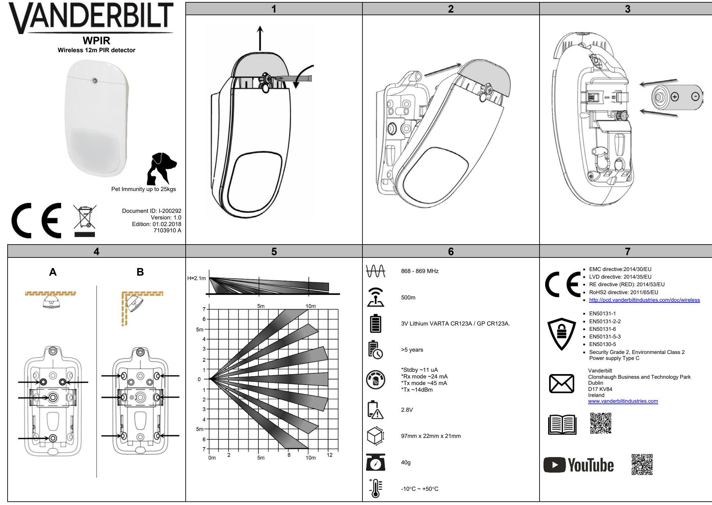

| EN                                                                                                                                        | DE                                                                                                                                                                              |                                                                                             |                                                                                                              |                                                                                                                                                                                                        | ES                                                                                                                                                                                                                                                                                                        |                                                         |                                                                                                                                                                                                                                                                                                                                      |                                                          | FR                                                                                                                                                                                             |                                                                                                                                           |                                                                                                                                                                                                                                                                                          |           |                                    |                                                        |
|-------------------------------------------------------------------------------------------------------------------------------------------|---------------------------------------------------------------------------------------------------------------------------------------------------------------------------------|---------------------------------------------------------------------------------------------|--------------------------------------------------------------------------------------------------------------|--------------------------------------------------------------------------------------------------------------------------------------------------------------------------------------------------------|-----------------------------------------------------------------------------------------------------------------------------------------------------------------------------------------------------------------------------------------------------------------------------------------------------------|---------------------------------------------------------|--------------------------------------------------------------------------------------------------------------------------------------------------------------------------------------------------------------------------------------------------------------------------------------------------------------------------------------|----------------------------------------------------------|------------------------------------------------------------------------------------------------------------------------------------------------------------------------------------------------|-------------------------------------------------------------------------------------------------------------------------------------------|------------------------------------------------------------------------------------------------------------------------------------------------------------------------------------------------------------------------------------------------------------------------------------------|-----------|------------------------------------|--------------------------------------------------------|
| OVERVIEW                                                                                                                                  |                                                                                                                                                                                 |                                                                                             | ÜBERBLICK                                                                                                    |                                                                                                                                                                                                        |                                                                                                                                                                                                                                                                                                           |                                                         | VISIÓN GENERAL                                                                                                                                                                                                                                                                                                                       |                                                          |                                                                                                                                                                                                |                                                                                                                                           | PRÉSENTATION                                                                                                                                                                                                                                                                             |           |                                    |                                                        |
| The WPIR is an advanced, fully supervised low-current wireless                                                                            | Der WPIR ist ein moderner, vollständig überwachter und kabelloser                                                                                                               |                                                                                             |                                                                                                              |                                                                                                                                                                                                        | El WPIR es un detector de movimiento vía radio avanzado,                                                                                                                                                                                                                                                  |                                                         |                                                                                                                                                                                                                                                                                                                                      |                                                          | Le WPIR est un détecteur de mouvements sans fil évolué, à faible                                                                                                                               |                                                                                                                                           |                                                                                                                                                                                                                                                                                          |           |                                    |                                                        |
| motion detector.                                                                                                                          |                                                                                                                                                                                 |                                                                                             | Bewegungsmelder mit niedrigem Stromverbrauch.                                                                |                                                                                                                                                                                                        |                                                                                                                                                                                                                                                                                                           |                                                         | completamente supervisado y de baja corriente.                                                                                                                                                                                                                                                                                       |                                                          |                                                                                                                                                                                                |                                                                                                                                           | consommation de courant et entièrement surveillé.                                                                                                                                                                                                                                        |           |                                    |                                                        |
| DISCOVERY AND ENROLLMENT PROCESS                                                                                                          | ERKENNUNG UND REGISTRIERUNG                                                                                                                                                     |                                                                                             |                                                                                                              |                                                                                                                                                                                                        |                                                                                                                                                                                                                                                                                                           | PROCESO DE BÚSQUEDA Y REGISTRO                          |                                                                                                                                                                                                                                                                                                                                      |                                                          |                                                                                                                                                                                                | RECHERCHE ET CONNEXION                                                                                                                    |                                                                                                                                                                                                                                                                                          |           |                                    |                                                        |
| Discover the WPIR detector from the SPC control panel:                                                                                    | Erkennen des WPIR-Melders in der SPC-Zentrale:                                                                                                                                  |                                                                                             |                                                                                                              |                                                                                                                                                                                                        | Búsqueda del detector WPIR desde el panel de control                                                                                                                                                                                                                                                      |                                                         |                                                                                                                                                                                                                                                                                                                                      |                                                          | Recherche du détecteur WPIR depuis la centrale SPC :                                                                                                                                           |                                                                                                                                           |                                                                                                                                                                                                                                                                                          |           |                                    |                                                        |
| 1. In the SPC browser, select Configuration>Wireless and click Enroll New Sensor.                                                   | 1.                                                                                                                                                                              | Wählen Sie im SPS-Browser die Optionen Konfiguration>Kabellos, und klicken Sie auf Neuen |                                                                                                              |                                                                                                                                                                                                        | SPC: 1.                                                                                                                                                                                                                                                                                                | En el navegador SPC, seleccione Configuración>Vía radio |                                                                                                                                                                                                                                                                                                                                      |                                                          | 1. Dans le navigateur SPC, sélectionnez Configuration>Sans fil et cliquez sur Connecter un nouveau capteur.                                                                              |                                                                                                                                           |                                                                                                                                                                                                                                                                                          |           |                                    |                                                        |
| 2. Open the detector (Fig. 1, Fig. 2).                                                                                                 | Sensor registrieren.                                                                                                                                                            |                                                                                             |                                                                                                              |                                                                                                                                                                                                        |                                                                                                                                                                                                                                                                                                           | y haga clic en Registrar un nuevo sensor.               |                                                                                                                                                                                                                                                                                                                                      |                                                          | 2. Ouvrez le détecteur (Fig 1, Fig 2).                                                                                                                                                      |                                                                                                                                           |                                                                                                                                                                                                                                                                                          |           |                                    |                                                        |
| 3. Insert the battery taking care to observe correct polarity (Fig. 3). Inserting the battery starts the discovery process from     | 2. Öffnen Sie den Melder (Abb. 1 und 2). 3. Achten Sie beim Einlegen der Batterie auf die korrekte                                                                     |                                                                                             |                                                                                                              |                                                                                                                                                                                                        | 2. Abra el detector (fig. 1, fig. 2). 3. Inserte la batería teniendo cuidado de que la polaridad sea correcta (fig. 3). Al insertar la batería se inicia el proceso de búsqueda desde el dispositivo. 4. Durante el proceso de búsqueda se produce la siguiente secuencia de LED: |                                                         |                                                                                                                                                                                                                                                                                                                                      |                                                          | 3. Insérez la pile en veillant à la polarité (Fig. 3). Le processus de recherche démarre dès que la pile est insérée. 4. Durant le processus de recherche, la LED change plusieurs |                                                                                                                                           |                                                                                                                                                                                                                                                                                          |           |                                    |                                                        |
| the device.                                                                                                                               | Polarität (Abb. 3). Durch das Einlegen der Batterie startet die Erkennung des Gerätes. 4. Während der Erkennung leuchten die LEDs in der nachstehenden Reihenfolge: |                                                                                             |                                                                                                              |                                                                                                                                                                                                        |                                                                                                                                                                                                                                                                                                           |                                                         |                                                                                                                                                                                                                                                                                                                                      |                                                          |                                                                                                                                                                                                |                                                                                                                                           |                                                                                                                                                                                                                                                                                          |           |                                    |                                                        |
| 4. During the discovery process, the following LED sequence occurs:                                                                 |                                                                                                                                                                                 |                                                                                             |                                                                                                              |                                                                                                                                                                                                        |                                                                                                                                                                                                                                                                                                           |                                                         |                                                                                                                                                                                                                                                                                                                                      |                                                          | fois d'état :                                                                                                                                                                                  |                                                                                                                                           |                                                                                                                                                                                                                                                                                          |           |                                    |                                                        |
| LED (Fig. 1 item State Duration (s)                                                                                                 |                                                                                                                                                                                 |                                                                                             |                                                                                                              |                                                                                                                                                                                                        |                                                                                                                                                                                                                                                                                                           |                                                         |                                                                                                                                                                                                                                                                                                                                      |                                                          |                                                                                                                                                                                                | LED (Fig. 1, repère 1)                                                                                                                 | État                                                                                                                                                                                                                                                                                     | Durée (s) |                                    |                                                        |
| 1)                                                                                                                                        |                                                                                                                                                                                 |                                                                                             |                                                                                                              | LED (Abb. 1,                                                                                                                                                                                           | Status                                                                                                                                                                                                                                                                                                    | Dauer (s)                                               |                                                                                                                                                                                                                                                                                                                                      | LED (fig. 1,                                             | Estado                                                                                                                                                                                         | Duración (s)                                                                                                                              | Mise sous tension Vert/rouge                                                                                                                                                                                                                                                             |           | Clignotement                       | 20 – 25                                                |
| Power up Green/Red                                                                                                                     | Fast Flash 20 - 25                                                                                                                                                              |                                                                                             | Einschalten                                                                                                  | Element 1) Grün/rot                                                                                                                                                                                 | Schnelles                                                                                                                                                                                                                                                                                                 | 20–25                                                   | Encendido                                                                                                                                                                                                                                                                                                                            | elemento 1) Verde/rojo                                | Parpadeo                                                                                                                                                                                       | 20 - 25                                                                                                                                   | Début de la                                                                                                                                                                                                                                                                              | Vert      | rapide Clignotement             | 3 - 5                                                  |
| Discovery Start Green Discovery CompleteGreen                                                                                       | Slow Flash 3 - 5 Steady                                                                                                                                                      | 3 - 5                                                                                       |                                                                                                              |                                                                                                                                                                                                        | Blinken                                                                                                                                                                                                                                                                                                   |                                                         |                                                                                                                                                                                                                                                                                                                                      |                                                          | rápido                                                                                                                                                                                         |                                                                                                                                           | recherche                                                                                                                                                                                                                                                                                |           | lent                               |                                                        |
| Discovery Failed* Red                                                                                                                  | Steady                                                                                                                                                                          |                                                                                             | Erkennungsstart                                                                                              | Grün                                                                                                                                                                                                   | Langsame                                                                                                                                                                                                                                                                                                  | 3–5                                                     | Iniciar búsqueda                                                                                                                                                                                                                                                                                                                     | Verde                                                    | Parpadeo                                                                                                                                                                                       | 3 - 5                                                                                                                                     | Recherche terminée Vert                                                                                                                                                                                                                                                                  |           | Fixe                               | 3 - 5                                                  |
| 5. You can now enroll the device by configuring the                                                                                    |                                                                                                                                                                                 |                                                                                             | Erkennung                                                                                                    | Grün                                                                                                                                                                                                   | s Blinken Konstant 3–5                                                                                                                                                                                                                                                                                 |                                                         |                                                                                                                                                                                                                                                                                                                                      |                                                          | lento                                                                                                                                                                                          |                                                                                                                                           | Recherche échouée*                                                                                                                                                                                                                                                                    | Rouge     | Fixe                               |                                                        |
| Description, Zone, Zone Type and other settings in the SPC system.                                                                     |                                                                                                                                                                                 |                                                                                             | abgeschlossen                                                                                                |                                                                                                                                                                                                        |                                                                                                                                                                                                                                                                                                           |                                                         | Búsqueda finalizada                                                                                                                                                                                                                                                                                                               | Verde                                                    | Fijo                                                                                                                                                                                           | 3 - 5                                                                                                                                     | 5. Vous pouvez maintenant connecter le dispositif en                                                                                                                                                                                                                                  |           |                                    |                                                        |
|                                                                                                                                           | Discover and enroll the WPIR detector from the keypad                                                                                                                           |                                                                                             | Erkennung                                                                                                    | Rot                                                                                                                                                                                                    | Konstant                                                                                                                                                                                                                                                                                                  |                                                         | Búsqueda fallida*                                                                                                                                                                                                                                                                                                                    | Rojo                                                     | Fijo                                                                                                                                                                                           |                                                                                                                                           | configurant la Description, la Zone, le Type de zone et les                                                                                                                                                                                                                              |           |                                    |                                                        |
| 1. On the keypad, select WIRELESS>SENSORS>ADD>ENROL.                                                                                |                                                                                                                                                                                 |                                                                                             | 5.                                                                                                           | fehlgeschlagen* 5. Ahora puede registrar el dispositivo configurando la Sie können nun das Gerät registrieren, indem Sie die descripción, zona, tipo de zona y otros ajustes en el sistema |                                                                                                                                                                                                                                                                                                           |                                                         |                                                                                                                                                                                                                                                                                                                                      |                                                          |                                                                                                                                                                                                |                                                                                                                                           | autres paramètres sur le système SPC. Recherche et connexion du détecteur WPIR depuis le                                                                                                                                                                                              |           |                                    |                                                        |
| The keypad displays the ADD screen with a flashing                                                                                        |                                                                                                                                                                                 |                                                                                             | Beschreibung, die Zone, den Zonentyp und weitere                                                             |                                                                                                                                                                                                        |                                                                                                                                                                                                                                                                                                           |                                                         | SPC                                                                                                                                                                                                                                                                                                                                  |                                                          |                                                                                                                                                                                                |                                                                                                                                           | clavier                                                                                                                                                                                                                                                                                  |           |                                    |                                                        |
| ENROL DEVICE message. 2. Follow steps 2 - 4 in the Discover process above.                                                          |                                                                                                                                                                                 |                                                                                             | Erkennen und Registrieren des WPIR-Melders am                                                                | Einstellungen im SPC-System konfigurieren.                                                                                                                                                             |                                                                                                                                                                                                                                                                                                           |                                                         | Búsqueda y registro del detector WPIR desde el teclado 1.                                                                                                                                                                                                                                                                         | En el teclado, seleccione VÍA                            |                                                                                                                                                                                                |                                                                                                                                           | 1. Sur le clavier, sélectionnez SANS FIL>CAPTEURS>AJOUTER>TOUCHE CONNEXION.                                                                                                                                                                                                        |           |                                    |                                                        |
| The keypad displays the FOUND SENSOR message.                                                                                             |                                                                                                                                                                                 |                                                                                             | Bedienteil:                                                                                                  |                                                                                                                                                                                                        |                                                                                                                                                                                                                                                                                                           |                                                         |                                                                                                                                                                                                                                                                                                                                      | RADIO>SENSORES>AÑADIR>REGISTRO.                          |                                                                                                                                                                                                |                                                                                                                                           | L'écran AJOUTER est affiché sur le clavier ; le message                                                                                                                                                                                                                                  |           |                                    |                                                        |
| 3. Click OK. 4. You can now enroll the device by configuring the AREA,                                                           |                                                                                                                                                                                 |                                                                                             | 1. Wählen Sie am Bedienteil                                                                               |                                                                                                                                                                                                        |                                                                                                                                                                                                                                                                                                           |                                                         | El teclado muestra la pantalla AÑADIR con un mensaje intermitente de INSCRIBIR DISPOSITIVO. 2. Siga los pasos 2 a 4 del proceso de búsqueda indicado anteriormente. El teclado muestra el mensaje SENSOR ENCONTRADO. 3. Haga clic en OK. 4. Ahora puede registrar el dispositivo configurando los ajustes |                                                          |                                                                                                                                                                                                |                                                                                                                                           | ACTIVATION DU DISPOSITIF clignote. 2.                                                                                                                                                                                                                                                 |           |                                    |                                                        |
| ZONE TYPE and ZONE settings.                                                                                                              |                                                                                                                                                                                 |                                                                                             |                                                                                                              | KABELLOS>SENSOREN>HINZUFÜGEN>EINLERNEN. Das Bedienteil zeigt den Bildschirm HINZUFÜGEN mit der                                                                                                      |                                                                                                                                                                                                                                                                                                           |                                                         |                                                                                                                                                                                                                                                                                                                                      |                                                          |                                                                                                                                                                                                |                                                                                                                                           | Suivez les étapes 2 - 4 de la procédure de recherche ci dessus. Le message CAPTEUR TROUVÉ est affiché sur le clavier. 3. Cliquez sur OK. 4. Vous pouvez maintenant connecter le dispositif en configurant la ZONE, le TYPE DE ZONE et les paramètres de la ZONE. |           |                                    |                                                        |
| 5. Click OK.                                                                                                                           |                                                                                                                                                                                 |                                                                                             |                                                                                                              | blinkenden Meldung GERÄT ANMELDEN an.                                                                                                                                                                  |                                                                                                                                                                                                                                                                                                           |                                                         |                                                                                                                                                                                                                                                                                                                                      |                                                          |                                                                                                                                                                                                |                                                                                                                                           |                                                                                                                                                                                                                                                                                          |           |                                    |                                                        |
| 6. The keypad displays the UPDATED message. The WPIR is now enrolled on your SPC system.                                            |                                                                                                                                                                                 |                                                                                             | 2. Erkennungsvorgangs aus.                                                                                | Führen Sie die Schritte 2–4 des oben aufgeführten                                                                                                                                                      |                                                                                                                                                                                                                                                                                                           |                                                         |                                                                                                                                                                                                                                                                                                                                      |                                                          |                                                                                                                                                                                                |                                                                                                                                           |                                                                                                                                                                                                                                                                                          |           |                                    |                                                        |
| *DISCOVERY FAILED                                                                                                                         |                                                                                                                                                                                 |                                                                                             |                                                                                                              | Das Bedienteil zeigt die Meldung SENSOR GEFUNDEN an.                                                                                                                                                   |                                                                                                                                                                                                                                                                                                           |                                                         |                                                                                                                                                                                                                                                                                                                                      |                                                          |                                                                                                                                                                                                |                                                                                                                                           |                                                                                                                                                                                                                                                                                          |           |                                    |                                                        |
| Remove the battery, wait for around 10 seconds and repeat the                                                                             |                                                                                                                                                                                 |                                                                                             | 3. Klicken Sie auf OK. 4. Sie können nun das Gerät registrieren, indem Sie die                      |                                                                                                                                                                                                        |                                                                                                                                                                                                                                                                                                           |                                                         | ÁREA, TIPO DE ZONA y ZONA. 5. Haga clic en OK.                                                                                                                                                                                                                                                                                 |                                                          |                                                                                                                                                                                                |                                                                                                                                           | 5. Cliquez sur OK.                                                                                                                                                                                                                                                                    |           |                                    |                                                        |
| process.                                                                                                                                  |                                                                                                                                                                                 |                                                                                             | Einstellungen BEREICH, ZONENTYP und ZONE                                                                     |                                                                                                                                                                                                        |                                                                                                                                                                                                                                                                                                           |                                                         | 6. El teclado muestra el mensaje ACTUALIZADO.                                                                                                                                                                                                                                                                                     |                                                          |                                                                                                                                                                                                |                                                                                                                                           | 6. Le message MIS À JOUR est affiché. Le WPIR est maintenant connecté à votre système SPC.                                                                                                                                                                                         |           |                                    |                                                        |
| Mounting Process                                                                                                                          |                                                                                                                                                                                 |                                                                                             | konfigurieren. 5. Klicken Sie auf OK.                                                                  |                                                                                                                                                                                                        |                                                                                                                                                                                                                                                                                                           |                                                         |                                                                                                                                                                                                                                                                                                                                      | El WPIR está ahora registrado en su sistema SPC.         |                                                                                                                                                                                                |                                                                                                                                           | *RECHERCHE ÉCHOUÉE                                                                                                                                                                                                                                                                       |           |                                    |                                                        |
| The detector can be mounted flat on a wall (Fig. 4, A) or in a 90º wall corner (Fig. 4, B). You must use the correct mounting holes as |                                                                                                                                                                                 |                                                                                             | 6. Das Bedienteil zeigt die Meldung AKTUALISIERT an. Der WPIR ist nun in Ihrem SPC-System registriert. |                                                                                                                                                                                                        |                                                                                                                                                                                                                                                                                                           |                                                         | *BÚSQUEDA FALLIDA Retire la batería, espere unos 10 segundos y repita el proceso.                                                                                                                                                                                                                                                 |                                                          |                                                                                                                                                                                                |                                                                                                                                           | Retirez la pile, attendez environ 10 secondes et répétez la                                                                                                                                                                                                                              |           |                                    |                                                        |
| indicated in Fig. 4.                                                                                                                      |                                                                                                                                                                                 |                                                                                             |                                                                                                              |                                                                                                                                                                                                        |                                                                                                                                                                                                                                                                                                           |                                                         |                                                                                                                                                                                                                                                                                                                                      |                                                          |                                                                                                                                                                                                | procédure.                                                                                                                                |                                                                                                                                                                                                                                                                                          |           |                                    |                                                        |
| • Recommended mounting height – 2.1m to 2.3m. • Select the best mounting position to ensure complete                             |                                                                                                                                                                                 |                                                                                             | *ERKENNUNG FEHLGESCHLAGEN Nehmen Sie die Batterie heraus, warten Sie etwa 10 Sekunden, und                |                                                                                                                                                                                                        |                                                                                                                                                                                                                                                                                                           |                                                         | Proceso de montaje El detector puede montarse en una pared (fig. 4, A) o en una                                                                                                                                                                                                                                                   |                                                          |                                                                                                                                                                                                | MONTAGE                                                                                                                                   |                                                                                                                                                                                                                                                                                          |           |                                    |                                                        |
| coverage of the area (Fig. 5).                                                                                                            |                                                                                                                                                                                 |                                                                                             | wiederholen Sie den Vorgang.                                                                                 |                                                                                                                                                                                                        |                                                                                                                                                                                                                                                                                                           |                                                         | esquina de pared de 90º (fig. 4, B). Debe utilizar los orificios de                                                                                                                                                                                                                                                                  |                                                          |                                                                                                                                                                                                | Le détecteur peut être monté à plat sur un mur (Fig. 4, A) ou dans un coin à 90º (Fig. 4, B). Utilisez les perforations appropriées au |                                                                                                                                                                                                                                                                                          |           |                                    |                                                        |
| Avoid the following locations: • In direct sunlight.                                                                                |                                                                                                                                                                                 |                                                                                             | Montage                                                                                                      |                                                                                                                                                                                                        |                                                                                                                                                                                                                                                                                                           |                                                         | montaje correctos como se indica en la fig. 4. • Altura de montaje recomendada: de 2,1 a 2,3 m.                                                                                                                                                                                                                                |                                                          |                                                                                                                                                                                                |                                                                                                                                           | montage (Fig. 4).                                                                                                                                                                                                                                                                        |           |                                    |                                                        |
| • Areas that may change temperature rapidly.                                                                                           | Der Melder kann direkt auf einer ebenen Oberfläche wie einer Wand                                                                                                               |                                                                                             |                                                                                                              |                                                                                                                                                                                                        | • Seleccione la mejor posición de montaje para asegurar una                                                                                                                                                                                                                                            |                                                         |                                                                                                                                                                                                                                                                                                                                      |                                                          | • Hauteur de montage recommandée, entre 2,1 et 2,3 m.                                                                                                                                       |                                                                                                                                           |                                                                                                                                                                                                                                                                                          |           |                                    |                                                        |
| • Areas where there are air ducts or substantial airflows. After mounting the detector, carry out a walktest to ensure that         | (Abb. 4, A) oder in einer 90°-Wandecke (Abb. 4, B) befestigt werden. Sie müssen die korrekten Montagelöcher (wie in Abb. 4                                                   |                                                                                             |                                                                                                              |                                                                                                                                                                                                        | cobertura completa del área (fig. 5). Evite las siguientes ubicaciones:                                                                                                                                                                                                                                |                                                         |                                                                                                                                                                                                                                                                                                                                      |                                                          | • Choisissez la meilleure position de montage pour garantir une couverture complète de la zone (Fig. 5).                                                                                 |                                                                                                                                           |                                                                                                                                                                                                                                                                                          |           |                                    |                                                        |
| movement is detected throughout the effective range of the device.                                                                        | angegeben) verwenden.                                                                                                                                                           |                                                                                             |                                                                                                              |                                                                                                                                                                                                        | • Directamente bajo la luz solar.                                                                                                                                                                                                                                                                      |                                                         |                                                                                                                                                                                                                                                                                                                                      |                                                          | Évitez les emplacements suivants :                                                                                                                                                             |                                                                                                                                           |                                                                                                                                                                                                                                                                                          |           |                                    |                                                        |
| If necessary, adjust the settings for the detector using your SPC                                                                         | • Empfohlene Montagehöhe: 2,1 bis 2,3 m. • Wählen Sie die beste Montageposition, um eine vollständige                                                                  |                                                                                             |                                                                                                              |                                                                                                                                                                                                        | • Áreas que pueden cambiar rápidamente de temperatura.                                                                                                                                                                                                                                                 |                                                         |                                                                                                                                                                                                                                                                                                                                      |                                                          | • Exposition directe au soleil. • Zones avec des changements brusques de température.                                                                                                 |                                                                                                                                           |                                                                                                                                                                                                                                                                                          |           |                                    |                                                        |
| system.                                                                                                                                   | Abdeckung des Bereichs sicherzustellen (Abb. 5).                                                                                                                                |                                                                                             |                                                                                                              |                                                                                                                                                                                                        | • Áreas donde hay conductos de aire o corrientes de aire significativas.                                                                                                                                                                                                                            |                                                         |                                                                                                                                                                                                                                                                                                                                      |                                                          | • Zones avec des conduites d'air ou des débits d'air importants.                                                                                                                            |                                                                                                                                           |                                                                                                                                                                                                                                                                                          |           |                                    |                                                        |
| BATTERY REPLACEMENT                                                                                                                       |                                                                                                                                                                                 |                                                                                             | Vermeiden Sie eine Montage an folgenden Orten:                                                               |                                                                                                                                                                                                        |                                                                                                                                                                                                                                                                                                           |                                                         | Después de montar el detector, lleve a cabo un test de intrusión                                                                                                                                                                                                                                                                     |                                                          |                                                                                                                                                                                                |                                                                                                                                           | Après avoir monté le détecteur, effectuez un test de marche afin de vous assurer de la détection correcte des déplacements dans la                                                                                                                                                    |           |                                    |                                                        |
| CAUTION                                                                                                                                   |                                                                                                                                                                                 |                                                                                             | • In direktem Sonnenlicht •                                                                            | Bereiche mit starken Temperaturschwankungen                                                                                                                                                            |                                                                                                                                                                                                                                                                                                           |                                                         | para asegurarse de que se detecta el movimiento en todo el alcance efectivo del dispositivo.                                                                                                                                                                                                                                      |                                                          |                                                                                                                                                                                                |                                                                                                                                           | plage de fonctionnement de l'appareil.                                                                                                                                                                                                                                                   |           |                                    |                                                        |
| The battery must be replaced by a 3V Type CR123A Lithium such as VARTA CR123A or GP CR123A.                                            | • Bereiche mit Luftkanälen oder merklichen Luftströmungen Führen Sie nach der Montage des Melders einen Gehtest durch, um                                                 |                                                                                             |                                                                                                              |                                                                                                                                                                                                        | En caso necesario, ajuste la configuración del detector utilizando su                                                                                                                                                                                                                                     |                                                         |                                                                                                                                                                                                                                                                                                                                      |                                                          | Si nécessaire, corrigez les paramètres du détecteur en utilisant votre système SPC.                                                                                                         |                                                                                                                                           |                                                                                                                                                                                                                                                                                          |           |                                    |                                                        |
|                                                                                                                                           |                                                                                                                                                                                 |                                                                                             | sicherzustellen, dass im Wirkbereich des Gerätes Bewegungen                                                  |                                                                                                                                                                                                        |                                                                                                                                                                                                                                                                                                           |                                                         | sistema SPC.                                                                                                                                                                                                                                                                                                                         |                                                          |                                                                                                                                                                                                |                                                                                                                                           | REMPLACEMENT DE LA PILE                                                                                                                                                                                                                                                                  |           |                                    |                                                        |
|                                                                                                                                           |                                                                                                                                                                                 |                                                                                             | erkannt werden.                                                                                              |                                                                                                                                                                                                        |                                                                                                                                                                                                                                                                                                           |                                                         | SUSTITUCIÓN DE LA BATERÍA                                                                                                                                                                                                                                                                                                            |                                                          |                                                                                                                                                                                                |                                                                                                                                           |                                                                                                                                                                                                                                                                                          |           |                                    |                                                        |
|                                                                                                                                           |                                                                                                                                                                                 |                                                                                             | Passen Sie gegebenenfalls die Einstellungen für den Melder mithilfe des SPC-Systems an.                   |                                                                                                                                                                                                        |                                                                                                                                                                                                                                                                                                           |                                                         |                                                                                                                                                                                                                                                                                                                                      | La batería debe sustituirse por una de litio de 3 V tipo | PRECAUCIÓN                                                                                                                                                                                     |                                                                                                                                           |                                                                                                                                                                                                                                                                                          |           | ATTENTION                          |                                                        |
|                                                                                                                                           |                                                                                                                                                                                 |                                                                                             | AUSTAUSCH DER BATTERIE                                                                                       |                                                                                                                                                                                                        |                                                                                                                                                                                                                                                                                                           |                                                         |                                                                                                                                                                                                                                                                                                                                      | CR123A como por ejemplo VARTA CR123A o GP                |                                                                                                                                                                                                |                                                                                                                                           |                                                                                                                                                                                                                                                                                          |           | exemple VARTA CR123A ou GP CR123A. | Utilisez uniquement une pile CR123A 3V au lithium, par |
|                                                                                                                                           |                                                                                                                                                                                 |                                                                                             |                                                                                                              | VORSICHT                                                                                                                                                                                               |                                                                                                                                                                                                                                                                                                           |                                                         |                                                                                                                                                                                                                                                                                                                                      |                                                          | CR123A.                                                                                                                                                                                        |                                                                                                                                           |                                                                                                                                                                                                                                                                                          |           |                                    |                                                        |
|                                                                                                                                           |                                                                                                                                                                                 |                                                                                             |                                                                                                              | Die Batterie muss gegen eine 3-V-Lithium-Batterie vom                                                                                                                                                  |                                                                                                                                                                                                                                                                                                           |                                                         |                                                                                                                                                                                                                                                                                                                                      |                                                          |                                                                                                                                                                                                |                                                                                                                                           |                                                                                                                                                                                                                                                                                          |           |                                    |                                                        |

Typ CR123A ausgetauscht werden (z. B. VARTA CR123A oder GP CR123A).

| IT                                                                                                                                                                                                                     |                                                                                                               |                        |            | NL                                                                                                                       |                                                                                      |                       |                                                                        | SV                                                                                                                                             |                                                                                                            |                       |             |  |
|------------------------------------------------------------------------------------------------------------------------------------------------------------------------------------------------------------------------|---------------------------------------------------------------------------------------------------------------|------------------------|------------|--------------------------------------------------------------------------------------------------------------------------|--------------------------------------------------------------------------------------|-----------------------|------------------------------------------------------------------------|------------------------------------------------------------------------------------------------------------------------------------------------|------------------------------------------------------------------------------------------------------------|-----------------------|-------------|--|
| PANORAMICA                                                                                                                                                                                                             |                                                                                                               |                        |            |                                                                                                                          |                                                                                      |                       |                                                                        |                                                                                                                                                |                                                                                                            |                       |             |  |
| Lo WPIR è un rilevatore di movimento a bassa corrente,                                                                                                                                                                 |                                                                                                               |                        |            | OVERZICHT De WPIR is een geavanceerde, volledig bewaakte laagspanning                                                 |                                                                                      |                       |                                                                        | ÖVERSIKT WPIR-enheten är en avancerad, helt övervakad, trådlös rörelsedetektor                                                              |                                                                                                            |                       |             |  |
| completamente controllato e avanzato.                                                                                                                                                                                  |                                                                                                               |                        |            | draadloze bewegingsdetector.                                                                                             |                                                                                      |                       |                                                                        | med låg spänning.                                                                                                                              |                                                                                                            |                       |             |  |
| PROCESSO DI SCOPERTA E                                                                                                                                                                                                 |                                                                                                               |                        |            | PROCEDURE VOOR DETECTIE EN                                                                                               |                                                                                      |                       |                                                                        | PROCESS FÖR IDENTIFIERING OCH                                                                                                                  |                                                                                                            |                       |             |  |
|                                                                                                                                                                                                                        |                                                                                                               |                        |            | REGISTRATIE                                                                                                              |                                                                                      |                       |                                                                        | TILLDELNING                                                                                                                                    |                                                                                                            |                       |             |  |
| RILEVAMENTO Rilevare il rilevatore WPIR dal pannello di controllo SPC:                                                                                                                                              |                                                                                                               |                        |            | De WPIR-detector detecteren vanaf het SPC                                                                                |                                                                                      |                       |                                                                        | Identifiera WPIR-detektorn från SPC-kontrollpanelen:                                                                                           |                                                                                                            |                       |             |  |
| 1. Nel browser SPC selezionare Configurazione>Wireless e                                                                                                                                                            |                                                                                                               |                        |            | bedieningspaneel                                                                                                         |                                                                                      |                       |                                                                        | 1. I SPC-webbläsaren, välj Konfiguration>Trådlös och klicka på                                                                              |                                                                                                            |                       |             |  |
| fare clic su Registra nuovo sensore. 2. Aprire il rilevatore (Fig. 1, Fig. 2). 3. Inserire la batteria prestando attenzione a rispettare la corretta polarità (Fig. 3). L'inserimento della batteria dà |                                                                                                               |                        |            | 1.                                                                                                                       | Open de SPC-browser en selecteer Configuratie>Draadloos en klik op Nieuwe sensor  |                       |                                                                        | Registrera ny sensor.                                                                                                                          |                                                                                                            |                       |             |  |
|                                                                                                                                                                                                                        |                                                                                                               |                        |            | registreren.                                                                                                             |                                                                                      |                       |                                                                        | 2. 3.                                                                                                                                       | Öppna detektorn (bild 1, bild 2). Sätt i batteriet och kontrollera att polariteten är korrekt (bild 3). |                       |             |  |
|                                                                                                                                                                                                                        |                                                                                                               |                        |            | 2.                                                                                                                       | Open de detector (Afb. 1, Afb. 2).                                                   |                       |                                                                        |                                                                                                                                                | När batteriet har satts i börjar identifieringsprocessen från                                              |                       |             |  |
| inizio al processo di rilevamento dal dispositivo. 4. Durante il processo di rilevamento ha luogo la seguente                                                                                                    |                                                                                                               |                        | 3.         | Plaats de batterij. Let op de polariteit (Afb. 3). Door het plaatsen van de batterij wordt het detectieproces van het |                                                                                      |                       | enheten. Under identifieringsprocessen lyser/blinkar lysdioderna på |                                                                                                                                                |                                                                                                            |                       |             |  |
| sequenza LED:                                                                                                                                                                                                          |                                                                                                               |                        |            | apparaat gestart.                                                                                                        |                                                                                      |                       |                                                                        | 4. följande sätt:                                                                                                                           |                                                                                                            |                       |             |  |
|                                                                                                                                                                                                                        | LED (Fig. 1,                                                                                                  | Stato                  | Durata (s) | 4. branden:                                                                                                           | Tijdens het detectieproces gaan de ledlampjes als volgt                              |                       |                                                                        |                                                                                                                                                | Lysdiod (bild 1,                                                                                           | Status                | Varaktighet |  |
|                                                                                                                                                                                                                        | elemento 1)                                                                                                   |                        |            |                                                                                                                          | LED (Afb. 1 item                                                                     | Status                | Duur (s)                                                               |                                                                                                                                                | post 1)                                                                                                    |                       | (sek)       |  |
| Accensione                                                                                                                                                                                                             | Verde/Rosso                                                                                                   | Lampeggia velocemen | 20 - 25    |                                                                                                                          | 1)                                                                                   |                       |                                                                        | Uppstart                                                                                                                                       | Grönt/rött ljus                                                                                            | Snabba blinkningar | 20–25       |  |
|                                                                                                                                                                                                                        |                                                                                                               | te                     |            | Opstarten                                                                                                                | Groen/rood                                                                           | Snel                  | 20 - 25                                                                | Identifiering inleds Grönt ljus                                                                                                                |                                                                                                            | Långsamma             | 3–5         |  |
| Inizio rilevamento                                                                                                                                                                                                     | Verde                                                                                                         | Lampeggia              | 3 - 5      |                                                                                                                          |                                                                                      | knipperen             |                                                                        |                                                                                                                                                |                                                                                                            | blinkningar           |             |  |
|                                                                                                                                                                                                                        |                                                                                                               | lentamente             |            | Start van detectie                                                                                                       | Groen                                                                                | Langzaam knipperen | 3 - 5                                                                  | Identifiering                                                                                                                                  | Grönt ljus                                                                                                 | Fast ljus             | 3–5         |  |
| Rilevamento completato                                                                                                                                                                                              | Verde                                                                                                         | Fisso                  | 3 - 5      | Detectie voltooid                                                                                                        | Groen                                                                                | Brandt                | 3 - 5                                                                  | avslutad                                                                                                                                       |                                                                                                            |                       |             |  |
| Rilevamento non                                                                                                                                                                                                        | Rosso                                                                                                         | Fisso                  |            | Detectie mislukt*                                                                                                        | Rood                                                                                 | Brandt                |                                                                        | Identifiering misslyckades*                                                                                                                 | Rött ljus                                                                                                  | Fast ljus             |             |  |
| riuscito*                                                                                                                                                                                                              |                                                                                                               |                        |            | 5.                                                                                                                       | U kunt het apparaat nu registreren door de beschrijving, de                          |                       |                                                                        | 5.                                                                                                                                             | Du kan nu tilldela enheten genom att konfigurera Beskrivning,                                              |                       |             |  |
| 5.                                                                                                                                                                                                                     | Adesso è possibile registrare il dispositivo configurando la                                                  |                        |            |                                                                                                                          | zone, het zonetype en andere instellingen te configureren in                         |                       |                                                                        |                                                                                                                                                | Sektion, Sektionstyp och andra inställningar i SPC-systemet.                                               |                       |             |  |
|                                                                                                                                                                                                                        | Descrizione, la Zona, il Tipo di zona e altre impostazioni nel                                                |                        |            | het SPC-systeem De WPIR-detector detecteren en registreren vanaf de                                                   |                                                                                      |                       |                                                                        | Identifiera och tilldela WPIR-detektorn med hjälp av                                                                                           |                                                                                                            |                       |             |  |
| sistema SPC Rilevare e registrare il rilevatore WPIR dalla tastiera Sulla tastiera selezionare                                                                                                                   |                                                                                                               |                        |            |                                                                                                                          |                                                                                      |                       |                                                                        | manöverpanelen Välj TRÅDLÖS>SENSORER>LÄGG TILL>INLÄST med hjälp av                                                                          |                                                                                                            |                       |             |  |
|                                                                                                                                                                                                                        |                                                                                                               |                        |            | keypad                                                                                                                   |                                                                                      |                       |                                                                        |                                                                                                                                                |                                                                                                            |                       |             |  |
| 1.                                                                                                                                                                                                                     |                                                                                                               |                        |            | 1. Selecteer op de keypad                                                                                             |                                                                                      |                       |                                                                        | 1. manöverpanelen.                                                                                                                          |                                                                                                            |                       |             |  |
|                                                                                                                                                                                                                        | WIRELESS>SENSORI>AGGIUNGI>REGISTRA.                                                                           |                        |            |                                                                                                                          | DRAADLOOS>SENSOREN>TOEVOEGEN>INLEREN.                                                |                       |                                                                        |                                                                                                                                                | Skärmbilden LÄGG TILL med det blinkande meddelandet                                                        |                       |             |  |
|                                                                                                                                                                                                                        | La tastiera mostra la schermata AGGIUNGI con un                                                               |                        |            |                                                                                                                          | Het scherm TOEVOEGEN wordt geopend. Hierin knippert het bericht INLEREN APPARAAT. |                       |                                                                        |                                                                                                                                                | INLÄST DEVICE visas på manöverpanelen.                                                                     |                       |             |  |
| 2.                                                                                                                                                                                                                     | messaggio ISCRIVERSI DISPOSITIVO lampeggiante. Seguire i passaggi 2 - 4 nel processo di Rilevamento sopra. |                        |            | 2.                                                                                                                       | Voer stap 2 - 4 uit van het hierboven beschreven                                     |                       |                                                                        | 2.                                                                                                                                             | Följ steg 2–4 i identifieringsprocessen ovan. Meddelandet SENSOR HITTAD visas på manöverpanelen.        |                       |             |  |
|                                                                                                                                                                                                                        | La tastiera mostra il messaggio SENSORE TROVATO.                                                              |                        |            | detectieproces.                                                                                                          |                                                                                      |                       |                                                                        | 3. Klicka på OK.                                                                                                                            |                                                                                                            |                       |             |  |
| 3. Fare clic su OK.                                                                                                                                                                                                 |                                                                                                               |                        |            | 3. Klik op OK.                                                                                                        | Op het keypad verschijnt het bericht SENSOR GEVONDEN.                                |                       |                                                                        | 4.                                                                                                                                             | Du kan nu tilldela enheten genom att konfigurera inställningarna                                           |                       |             |  |
| 4.                                                                                                                                                                                                                     | Adesso è possibile registrare il dispositivo configurando le impostazioni AREA, TIPO DI ZONA e ZONA.       |                        |            | 4.                                                                                                                       | U kunt de apparaat nu registreren door het GEBIED, ZONE                              |                       |                                                                        | 5. Klicka på OK.                                                                                                                            | för OMRÅDE, SEKTIONSTYP och SEKTION.                                                                       |                       |             |  |
| 5. Fare clic su OK.                                                                                                                                                                                                 |                                                                                                               |                        |            |                                                                                                                          | TYPE en de ZONE in te stellen.                                                       |                       |                                                                        | 6.                                                                                                                                             | Meddelandet UPPDATERAD visas på manöverpanelen.                                                            |                       |             |  |
| 6.                                                                                                                                                                                                                     | La tastiera mostra il messaggio AGGIORNATO.                                                                   |                        |            | 5. Klik op OK. 6.                                                                                                  | Op het keypad verschijnt het bericht BIJGEWERKT.                                     |                       |                                                                        |                                                                                                                                                | WPIR-enheten finns nu tilldelad i ditt SPC-system.                                                         |                       |             |  |
|                                                                                                                                                                                                                        | Il WPIR è ora registrato sul sistema SPC.                                                                     |                        |            |                                                                                                                          | De WPIR is nu geregistreerd bij het SPC-systeem.                                     |                       |                                                                        | *IDENTIFIERING MISSLYCKADES                                                                                                                    |                                                                                                            |                       |             |  |
| *RILEVAMENTO NON RIUSCITO Togliere la batterie, attendere circa 10 secondi e ripetere il processo.                                                                                                                  |                                                                                                               |                        |            | *DETECTIE MISLUKT                                                                                                        |                                                                                      |                       |                                                                        | Plocka ur batteriet, vänta i cirka 10 sekunder och upprepa sedan processen.                                                                 |                                                                                                            |                       |             |  |
|                                                                                                                                                                                                                        |                                                                                                               |                        |            | Verwijder de batterij, wacht ongeveer 10 seconden en herhaal het                                                         |                                                                                      |                       |                                                                        |                                                                                                                                                |                                                                                                            |                       |             |  |
|                                                                                                                                                                                                                        | PROCESSO DI MONTAGGIO                                                                                         |                        |            | proces.                                                                                                                  |                                                                                      |                       |                                                                        | Monteringsprocess                                                                                                                              |                                                                                                            |                       |             |  |
| Il rilevatore può essere montato sulla parete (Fig. 4, A) o in un angolo di parete a 90º (Fig. 4, B). Bisogna usare i fori di montaggio                                                                             |                                                                                                               |                        |            | DETECTOR MONTEREN                                                                                                        |                                                                                      |                       |                                                                        | Detektorn kan monteras plant på en vägg (bild 4, A) eller i en vinkel på 90º, i hörnet mellan två väggar (bild 4, B). Du måste använda rätt |                                                                                                            |                       |             |  |
| corretti indicati nella Fig. 4.                                                                                                                                                                                        |                                                                                                               |                        |            | De detector kan worden gemonteerd op een vlakke wand (Afb. 4, A)                                                         |                                                                                      |                       |                                                                        | monteringshål enligt anvisningarna på bild 4.                                                                                                  |                                                                                                            |                       |             |  |
| •                                                                                                                                                                                                                      | Altezza di montaggio consigliata – da 2,1 m a 2,3 m.                                                          |                        |            | of een hoek van 90º (Afb. 4, B). Gebruik de correcte                                                                     |                                                                                      |                       |                                                                        | •                                                                                                                                              | Rekommenderad monteringshöjd: 2,1–2,3 meter.                                                               |                       |             |  |
| •                                                                                                                                                                                                                      | Selezionare la posizione di montaggio migliore per garantire la copertura completa dell'area (Fig. 5).     |                        |            | montageopeningen zoals aangegeven in Afb. 4. •                                                                        | De aanbevolen hoogte voor montage is 2,1 - 2,3 m.                                    |                       |                                                                        | •                                                                                                                                              | Välj ut lämplig plats för montering för att få fullständig täckning av                                     |                       |             |  |
| Evitare i punti seguenti:                                                                                                                                                                                              |                                                                                                               |                        |            | •                                                                                                                        | Selecteer de beste montagepositie voor een volledige dekking                         |                       |                                                                        | hela området (bild 5). Undvik följande platser:                                                                                             |                                                                                                            |                       |             |  |
| • Alla luce solare diretta.                                                                                                                                                                                         |                                                                                                               |                        |            | van het gebied (Afb. 5).                                                                                                 |                                                                                      |                       |                                                                        | • I direkt solljus.                                                                                                                         |                                                                                                            |                       |             |  |
| •                                                                                                                                                                                                                      | Aree soggette e rapidi oscillazioni di temperature.                                                           |                        |            | Vermijd de volgende locaties: • In direct zonlicht.                                                                |                                                                                      |                       |                                                                        | •                                                                                                                                              | Platser med stora och snabba temperaturvariationer.                                                        |                       |             |  |
| • sostanziali.                                                                                                                                                                                                      | Aree in cui sono presenti condotti di aria o flussi d'aria                                                    |                        |            | •                                                                                                                        | Gebieden met snelle temperatuurwisselingen.                                          |                       |                                                                        | • luftströmmar.                                                                                                                             | Platser där det finns ventilationskanaler eller kraftigare                                                 |                       |             |  |
| Dopo aver montato il rilevatore, eseguire un test di camminata per                                                                                                                                                     |                                                                                                               |                        |            | •                                                                                                                        | Gebieden met luchtkanalen of aanzienlijke luchtstromingen.                           |                       |                                                                        | Efter att detektorn har monterats bör du utföra ett gångtest för att försäkra                                                                  |                                                                                                            |                       |             |  |
| garantire che il movimento è rilevato all'interno dell'area effettiva del                                                                                                                                              |                                                                                                               |                        |            | Voer na montage van de detector een looptest uit om te controleren                                                       |                                                                                      |                       |                                                                        | dig om att rörelserna detekteras inom hela enhetens mätområde.                                                                                 |                                                                                                            |                       |             |  |
| dispositivo. Se necessario, regolare le impostazioni per il rilevatore usando il                                                                                                                                    |                                                                                                               |                        |            | of beweging overal in het detectiebereik van het apparaat wordt gedetecteerd.                                         |                                                                                      |                       |                                                                        | Om så krävs kan du justera detektorns inställningar med hjälp av SPC                                                                           |                                                                                                            |                       |             |  |
| sistema SPC.                                                                                                                                                                                                           |                                                                                                               |                        |            | Pas zo nodig de instellingen van de detector aan in het SPC                                                              |                                                                                      |                       |                                                                        | systemet.                                                                                                                                      |                                                                                                            |                       |             |  |
| SOSTITUZIONE DELLA BATTERIA                                                                                                                                                                                            |                                                                                                               |                        |            | systeem.                                                                                                                 |                                                                                      |                       |                                                                        | BYTE AV BATTERI                                                                                                                                |                                                                                                            |                       |             |  |
|                                                                                                                                                                                                                        | La batteria deve essere sostituita con una batteria di                                                        | ATTENZIONE             |            | BATTERIJ VERVANGEN                                                                                                       | LET OP                                                                               |                       |                                                                        |                                                                                                                                                | VAR FÖRSIKTIG! Batteriet måste bytas ut mot ett litiumbatteri på 3 V                                    |                       |             |  |