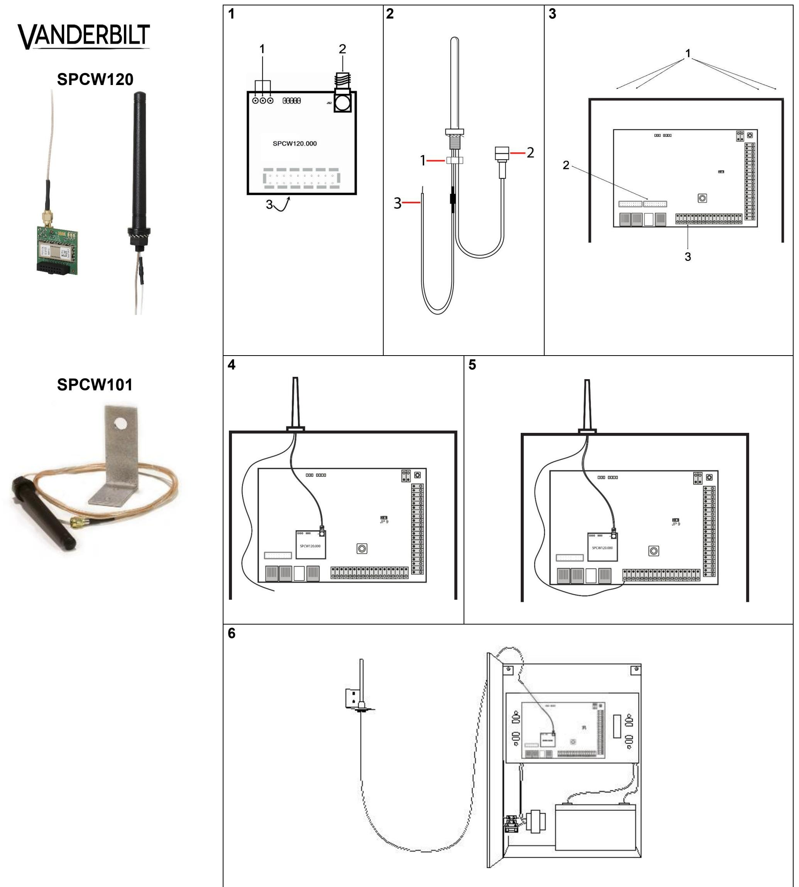

# **English – Installation Instructions**

**WARNING** - Before starting to install and work with this device, please read the *Safety Instructions*.

When changing or installing a SPCW120 on the SPC system, ensure that all anti-static precautions are adhered to while handling connectors, wires, terminals and PCBs.

### **EC Declaration of Conformity**

Hereby, Vanderbilt International (IRL) Ltd declares that this radio equipment type is in compliance with all relevant EU Directives for CE marking.

- Directive 2014/30/EU (Electromagnetic Compatibility Directive)
- Directive 2014/35/EU (Low Voltage Directive)
- Directive 2014/53/EU (Radio Equipment Directive)
- Directive 2011/65/EU Restriction of the use of certain hazardous substances Directive)

The full text of the EU declaration of conformity is available at http://pcd.vanderbiltindustries.com/doc/SPC.

## **Product Description**

The SPCW120 transceiver provides a wireless interface for the SPC controller that enables wireless devices (for example, magnetic contacts, motion detectors, and remote controls) to be enrolled on the system.

The SPCW120 incorporates the following elements, as shown in Fig.1 and Fig. 2.

| Fig. 1: SPCW120 transceiver |                                                        |  |
|-----------------------------|--------------------------------------------------------|--|
| 1                           | Indication LEDs - activated when signals are received. |  |
| 2                           | Female SMA connector to attach an external antenna.    |  |
| 3                           | 1 x 10 pin connector (on back)                         |  |
|                             |                                                        |  |

#### **Fig.2: Antenna with Tamper Lead**

- **1** Locking nut **2** SMA male interface for connection to SPCW120 **3** Tamper lead
## **Installing the SPCW120 transceiver and antenna in the SPC4xxx/5xxx/6xxx housing**

#### **Fig. 3**

- **1** Knockouts for antenna on top of housing
- **2** 10 pin connector for SPCW120
- **3** Tamper terminal (T1)
- 1. Disconnect the mains supply.
- 2. Remove the cover and disconnect the battery.
- 3. Locate the circular knockouts at the top of the metallic housing. Choose the desired knockout for your antenna and carefully knock out an access area.
- 4. Position the SPCW120 on the PCB in the location shown (Fig.3 item 1) with the SMA connector/antenna towards the top of the controller board.
- 5. Firmly but gently press down to secure the SPCW120.
- 6. Unscrew the locking nut from the antenna screw fitting and remove it completely from the antenna lead. Retain the serrated washer on the antenna.
- 7. Insert the antenna lead, tamper lead, and screw fitting down into the exposed knockout opening and pull the lead through until the antenna is sitting flush on top of the housing.
- 8. From within the housing, fit the nut over the antenna lead and tamper lead and onto the screw fitting of the antenna.
- 9. Tighten the nut on the screw, securing the antenna onto the housing.
- 10. Screw the SMA male connector into the female connector on the SPCW120 (Fig.1, item 2).
- 11. Connect the tamper lead (Fig.2, item 3) into the tamper terminal (marked T1 on the PCB) on the connector block (Fig.3, item 3).
- 12. Reconnect the battery and close the cover.
- 13. Reconnect the mains supply.

You are now ready to configure your SPC panel to receive wireless signal from nearby devices.

> For further instructions about enrolling and configuring your wireless devices with your SPC system, please scan the following QR code.

#### **Installing the external antenna (SPCW101)**

Depending on your installation location, it may be necessary to mount an antenna away from the SPC4xxx/5xxx/6xxx housing.

The SPCW101 antenna comes with a single antenna lead of 2 metres. There is no tamper lead with the SPCW101 antenna. The long antenna lead enables you to choose a mounting position that will enhance the wireless reception of a SPCW120 transceiver. The antenna is mounted on an external bracket outside the cabinet (Fig.6).

To connect the SPCW101 to the SPCW120 transceiver, follow the steps in the section *Installing the SPCW120 transceiver and antenna in the SPC4xxx/5xxx/6xxx housing* in this document. Ignore the instructions concerning the tamper lead.

## **Technical Data SPCW120**

| Radio module           | SPC RF receiver (868-869 MHz)                            |
|------------------------|----------------------------------------------------------|
| Operating current      | Max.10 mA at 12 VDC                                      |
| Quiescent current      | Max.10 mA at 12 VDC                                      |
| Operating temperature  | -10 ~ +50 °C                                             |
| Dimensions (W x H x D) | Module: 34 x 38 x 20mm, Antenna 140 x 22mm               |
| Weight                 | 44g (Module 12g, Antenna 32g)                            |
| Cable length SPCW101   | 2m                                                       |
| Standards SPCW120      | Complies to: EN50131-3:2009, EN50131-5-3:2005+A1:2008 |

## **Deutsch – Installationsanleitung**

**WARNUNG** - Lesen Sie vor der Installation und Verwendung dieses Geräts die Sicherheitshinweise.

Beim Austauschen oder Installieren eines SPCW120 im SPC-System müssen während der Handhabung von Anschlüssen, Drähten, Klemmen und Platinen alle Antistatik-Maßnahmen getroffen werden.

## **EG-Konformitätserklärung**

Hiermit erklärt Vanderbilt International (IRL) Ltd, dass dieser Funkgerätetyp den Anforderungen aller relevanten EU-Richtlinien für die CE-Kennzeichnung entspricht.

- Richtlinie 2014/30/EU (Richtlinie über elektromagnetische Verträglichkeit)
- Richtlinie 2014/35/EU (Niederspannungsrichtlinie)
- Richtlinie 2014/53/EU (Richtlinie über Funkanlagen)
- Richtlinie 2011/65/EU (Richtlinie zur Beschränkung der Verwendung bestimmter gefährlicher Stoffe)

Der vollständige Text der EU-Konformitätserklärung steht unter http://pcd.vanderbiltindustries.com/doc/SPC zur Verfügung.

## **Produktbeschreibung**

Der Sender-Empfänger SPCW120 bietet eine drahtlose Schnittstelle für den SPC-Controller, mit der drahtlose Geräte (z. B. Magnetkontakte, Bewegungsmelder und Fernbedienungen) im System angemeldet werden können.

Der SPCW120 besteht aus folgenden Komponenten, die in Abb. 1 und 2 dargestellt sind.

## **Abb. 1: Sender-Empfänger SPCW120**

| 1 | Anzeige-LEDs – Leuchten, wenn Signale empfangen werden. |  |  |
|---|---------------------------------------------------------|--|--|
| 2 | SMA-Anschlussbuchse für eine externe Antenne.           |  |  |

- **3** 1 × 10-poliger Anschluss (auf der Rückseite)
## **Abb. 2: Antenne mit Sabotagekontaktkabel**

- **1** Abschlussbuchse
- **2** SMA-Anschlussstecker für Verbindung mit SPCW120
- **3** Sabotagekontaktkabel

## **Installieren des Sender-Empfängers SPCW120 und der Antenne im SPC4xxx/5xxx/6xxx-Gehäuse**

#### **Abb. 3**

- **1** Vorgestanzte Öffnungen für Antenne auf Gehäuseoberseite
- **2** 10-poliger Anschluss für SPCW120
- **3** Sabotagekontaktanschluss (T1)

1. Die Stromversorgung trennen.

- 2. Die Abdeckung entfernen und die Batterie ausstecken.
- 3. Vorgestanzte Öffnungen auf der Oberseite des Blechgehäuses suchen. Die gewünschte vorgestanzte Öffnung für die Antenne vorsichtig herausbrechen.
- 4. Den Sender-Empfänger SPCW120 an der dargestellten Position (Abb. 3, Element 1) auf die Leiterplatte aufsetzen, so dass der SMA-Anschluss und die Antenne zur Oberseite der Controller-Platine zeigen.
- 5. Das Modul vorsichtig nach unten drücken, bis der SPCW120 einrastet.
- 6. Die Abschlussbuchse von der Antennenschraubenhalterung abdrehen und vollständig vom Antennendraht entfernen. Die Fächerscheibe der Antenne aufbewahren.
- 7. Den Antennendraht, das Sabotagekontaktkabel und die Schraubenhalterung

- durch die herausgebrochene Öffnung führen und den Draht so weit durchziehen, bis die Antenne bündig auf der Gehäuseoberfläche sitzt.
- 8. Im Inneren des Gehäuses die Abschlussbuchse über den Antennendraht und das Sabotagekontaktkabel auf der Schraubenhalterung der Antenne anbringen.
- 9. Die Mutter auf der Schraube festziehen und somit die Antenne auf dem Gehäuse befestigen.
- 10. Den SMA-Stecker in die Anschlussbuchse am SPCW120 schrauben (Abb. 1, Element 2).
- 11. Das Sabotagekontaktkabel (Abb. 2, Element 3) mit dem Sabotagekontakt (T1- Markierung auf der Leiterplatte) am Anschlussblock (Abb. 3, Element 3) verbinden.
- 12. Die Batterie wieder anschließen und die Abdeckung schließen.
- 13. Die Stromversorgung wieder herstellen.

Nun kann die SPC-Zentrale konfiguriert werden, um Funksignale von nahe gelegenen Geräten zu empfangen.

Weitere Anweisungen zur Anmeldung und Konfiguration von drahtlosen Geräten mit dem SPC-System werden Ihnen angezeigt, wenn Sie folgenden QR-Code scannen.

## **Installieren der externen Antenne (SPCW101)**

Je nach Installationsort könnte es notwendig sein, eine Antenne in einigem Abstand vom SPC4xxx/5xxx/6xxx-Gehäuse zu montieren.

Der Antenne SPCW101 liegt ein einzelner, 2 Meter langer Antennendraht bei. Es gibt kein Sabotagekontaktkabel. Mithilfe des langen Antennendrahts kann eine Montageposition gewählt werden, die den Funkempfang für einen SPCW120- Empfänger verbessert. Die Antenne wird auf einer externen Halterung am Schrank befestigt (Abb. 6).

Für den Anschluss der SPCW101 an den Sender-Empfänger SPCW120 sind die Schritte im Abschnitt **Installieren des Empfängers SPCW120 und der Antenne im SPC4xxx/5xxx/6xxx-Gehäuse** in diesem Dokument zu beachten. Die Anweisungen in Bezug auf das Sabotagekontaktkabel können ignoriert werden.

## **SPCW120 – Technische Daten**

| Funkmodul               | SPC-Funkempfänger (868–869 MHz)                                                           |
|-------------------------|-------------------------------------------------------------------------------------------|
| Betriebsstrom           | Max. 10 mA bei 12 V Gleichspannung                                                        |
| Ruhestrom               | Max. 10 mA bei 12 V Gleichspannung                                                        |
| Betriebstemperatur      | -10 bis +50 °C                                                                            |
| Abmessungen (B × H × T) | Modul: 34 × 38 × 20 mm, Antenne: 140 × 22 mm                                              |
| Gewicht                 | 44 g (Modul 12 g, Antenne 32 g)                                                           |
| Kabellänge SPCW101      | 2 m                                                                                       |
| Normen SPCW120          | Erfüllt die Anforderungen folgender Normen: EN 50131-3:2009, EN 50131-5-3:2005+A1:2008 |

## **Español – Instrucciones de instalación**

**ADVERTENCIA:** Antes de instalar y usar este dispositivo, lea las Instrucciones de seguridad.

Cuando cambie o instale un SPCW120 en el sistema SPC, debe tomar todas las precauciones antiestáticas al manipular conectores, cables, terminales y placas.

#### **Declaración de conformidad CE**

Por la presente, Vanderbilt International (IRL) Ltd declara que este tipo de equipo de radio cumple con todas las directivas de la UE relevantes para el marcado CE.

- Directiva 2014/30/UE (directiva de compatibilidad electromagnética)
- Directiva 2014/35/UE (directiva de bajo voltaje)
- Directiva 2014/53/UE (directiva de equipos radioeléctricos)
- Directiva 2011/65/UE (directiva sobre restricciones a la utilización de determinadas sustancias peligrosas)

El texto completo de la declaración UE de conformidad está disponible en http://pcd.vanderbiltindustries.com/doc/SPC

#### **Descripción del producto**

El transceptor SPCW120 proporciona una interfaz vía radio para el controlador SPC que permite registrar en el sistema dispositivos vía radio (por ejemplo, contactos magnéticos, detectores de movimiento y controles remotos).

El SPCW120 incorpora los siguientes elementos, como se muestra en la fig. 1 y la fig. 2.

| Fig. 1: Transceptor SPCW120 |                                                          |  |
|-----------------------------|----------------------------------------------------------|--|
| 1                           | LEDs indicadores (se activan cuando se reciben señales). |  |
| 2                           | Conector SMA hembra para acoplar una antena exterior.    |  |
| 3                           | Conector de 1 x 10 pines (en la parte posterior)         |  |
|                             |                                                          |  |

#### **Fig. 2: Antena con conductor de tamper**

**1** Tuerca de bloqueo

- **2** Conector SMA macho para realizar la conexión al SPCW120
#### **3** Conductor de tamper

## **Instalación del SPCW120 en la carcasa del SPC4xxx/5xxx/6xxx**

## **Fig. 7**

- **1** Módulo vía radio (en la imagen, el SPCW110)
- **2** Ranura del módem principal
- 1. Desconecte el equipo de la red de alimentación.
- 2. Retire la cubierta y desconecte la pila.
- 3. Si hay un módem instalado en la ranura del módem principal en el controlador, extráigalo.
- 4. Coloque el módulo vía radio sobre el controlador con el conector / la antena SMA mirando hacia la parte superior de la placa del controlador.
- 5. Presione firmemente, pero con cuidado, para fijar el módulo (Fig. 5).
- 6. Si había un módem instalado en la ranura del módem principal por encima del módulo vía radio, sustitúyalo.
- 7. Conecte de nuevo la pila y cierre la cubierta.
- 8. Vuelva a conectar el equipo a la red de alimentación.

## **Instalación del SPCW114 en el teclado compacto SPCK52x**

- 1. Desconecte la alimentación del teclado.
- 2. Desenrosque el tornillo de fijación que hay en la base del teclado y abra la cubierta posterior haciendo palanca en las lengüetas con un destornillador adecuado.
- 3. Retire la cubierta frontal del teclado.
- 4. Coloque el módulo vía radio sobre la PCI del teclado (Fig. 10).

## **Fig. 10: PCI del teclado compacto 1** Interruptor de tamper **2** Conmutadores rotativos **3** Antena vía radio **4** PCI del módulo vía radio **5** Zócalo de conectores

- 5. Inserte los pines de la base del módulo en el zócalo de conectores (Fig. 6).
- 6. Para cerrar la unidad, enganche la parte superior de la cubierta frontal en los ojales de fijación de la base del teclado y empújela hacia abajo. Presione firmemente para asegurarse de que los dos clips de la base encajen con las correspondientes ranuras de la cubierta frontal.
- 7. Conecte de nuevo la alimentación del teclado.

#### **Instalación de la antena exterior en una carcasa metálica**

#### **Fig. 8: Antena exterior**

| 1  | Tuerca de bloqueo                                                                    |
|----|--------------------------------------------------------------------------------------|
| 2  | Conector SMA macho para realizar la conexión al módulo del receptor vía radio     |
| 1. | Localice los discos de chapa extraíbles en la parte superior de la carcasa metálica. |

- Elija el disco que desee y retírelo con cuidado para abrir un orificio de acceso.
- 2. Desatornille la tuerca de bloqueo de la fijación atornillada de la antena y retírela completamente del conductor de la antena. Mantenga la arandela dentada en la antena.
- 3. Inserte el conductor de la antena y la fijación atornillada en el orificio de acceso abierto y tire del conductor hasta que la antena quede a ras con la parte superior de la carcasa.
- 4. Desde dentro de la carcasa, fije la tuerca sobre el conductor de la antena y sobre la fijación atornillada de la antena.
- 5. Apriete la tuerca sobre el tornillo, asegurando la antena sobre la carcasa.
- 6. Enrosque el conector SMA macho al conector hembra del receptor vía radio.
- 7. Para habilitar el funcionamiento de la antena exterior en el sistema (solo SPCW110), en el teclado, entre en el modo Técnico total.
- 8. Vaya a VÍA RADIO > ANTENA EXTERIOR > HABILITAR > SELECC. La antena vía radio está instalada (Fig. 11).

## **Instalación de antena exterior (SPCW101) para módulos GSM o vía radio**

La longitud del cable de 2 metros permite colocar la antena en una gran variedad de posiciones para mejorar, en caso necesario, la recepción de un módulo GSM o vía radio. La antena se puede montar sobre un soporte exterior fuera de la caja (Fig. 12).

- 1. Desconecte el equipo de la red de alimentación.
- 2. Retire la cubierta y desconecte la pila.
- 3. Desatornille la tuerca de bloqueo de la fijación atornillada de la antena y retírela completamente del conductor de la antena. Mantenga la arandela dentada en la antena.
- 4. Inserte el conductor de la antena y la fijación atornillada en la abertura del soporte y tire del conductor hasta que la antena quede a ras con la parte superior del soporte.
- 5. Por debajo del soporte, fije la tuerca sobre el conductor de la antena y sobre la fijación atornillada de la antena.
- 6. Apriete la tuerca sobre el tornillo, asegurando la antena sobre el soporte.
- 7. Enrosque el conector SMA macho al conector hembra del módulo GSM o del receptor vía radio.
- 8. Conecte de nuevo la pila y cierre la cubierta.
- 9. Vuelva a conectar el equipo a la red de alimentación.
- 10. Para habilitar el funcionamiento de la antena exterior en el sistema (solo SPCW110), en el teclado, entre en el modo Técnico total.
- 11. Vaya a VÍA RADIO > ANTENA EXTERIOR > HABILITAR > SELECC. La antena vía radio está instalada (Fig. 12).

## **Datos técnicos SPCW120**

| Módulo de radio                            | Receptor RF SiWay (868 MHz)                  |
|--------------------------------------------|----------------------------------------------|
| Corriente de funcionamiento                | Máx. 10 mA a 12 V CC                         |
| Corriente de reposo                        | Máx. 10 mA a 12 V CC                         |
| Temperatura de funcionamiento -10 ~ +50 °C |                                              |
| Dimensiones (An. x Al. x Pr.)              | PCI: 50 x 22 x 20mm                          |
| Peso                                       | 0,05kg                                       |
| Longitud de cable SPCW101                  | 2m                                           |
| Normas SPCW120                             | EN50131-3:2009, EN50131-5- 3:2005+A1:2008 |

# **Français – Instructions d'installation**

**AVERTISSEMENT**- Avant de commencer l'installation de ce produit, merci de prendre connaissance des *Consignes de sécurité*.

Lors du remplacement ou de l'installation d'un SPCW120 sur un système SPC, assurez-vous que toutes les précautions antistatiques sont respectées lors de la manipulation des connecteurs, fils, bornes et cartes de circuit imprimé.

### **Déclaration de conformité CE**

Par la présente, Vanderbilt International (IRL) déclare que ce type d'équipement radio respecte toutes les Directives de l'Union européenne applicables au marquage CE.

- Directive 2014/30/UE (Directive compatibilité électromagnétique)
- Directive 2014/35/UE (Directive sur les équipements basse tension)
- Directive 2014/53/UE (directive dite RED relative à l'équipement radio)
- Directive 2011/65/UE (Directive relative à la limitation de l'utilisation de certaines substances dangereuses)

Le texte intégral de la Déclaration de conformité aux Directives de l'Union européenne est disponible à http://pcd.vanderbiltindustries.com/doc/SPC

## **Description du produit**

L'émetteur-récepteur SPCW120 dote la centrale SPC d'une interface Wi-Fi qui permet aux périphériques sans fil (par exemple : les contacts magnétiques, les détecteurs de mouvement ou les télécommandes) d'être enregistrés dans le système.

Le SPCW120 comprend les éléments suivants, illustrés dans la fig. 1 et dans la fig. 2.

| Fig. 1 : Émetteur-récepteur SPCW120 |                                                         |  |
|-------------------------------------|---------------------------------------------------------|--|
| 1                                   | LED d'état - activés quand des signaux sont reçus.      |  |
| 2                                   | Connecteur SMA femelle pour relier une antenne externe. |  |
| 3                                   | Connecteur 1 x 10 broches (à l'arrière)                 |  |
|                                     |                                                         |  |

#### **Fig. 2 : Antenne avec câble d'autosurveillance**

| 1 | Contre-écrou                                    |
|---|-------------------------------------------------|
| 2 | Interface SMA mâle pour la connexion du SPCW120 |
| 3 | Câble d'autosurveillance                        |
|   |                                                 |

## **Installation du SPCW120 dans le boîtier du SPC4xxx/5xxx/6xxx**

|  |  | Fig. 7 |  |
|--|--|--------|--|
|--|--|--------|--|

- **1** Module radio (exemple du SPCW110)
- **2** Emplacement du modem principal
- 1. Débranchez l'alimentation électrique.
- 2. Retirez le capot et déconnectez la batterie.
- 3. Enlevez le modem placé en modem principal sur la centrale, le cas échéant.
- 4. Positionnez le module radio sur la centrale avec le connecteur/antenne SMA pointant vers le haut de la carte de la centrale.
- 5. Appuyez fermement mais sans forcer pour fixer le module (Fig. 5).
- 6. Replacer le modem dans son logement de modem principal en passant sur le module radio si un avait été installé au préalable.
- 7. Reconnectez la batterie et fermez le capot.
- 8. Reconnectez l'alimentation électrique.

## **Installation du SPCW114 dans le clavier compact SPCK52x**

- 1. Déconnectez l'alimentation électrique du clavier.
- 2. Ouvrez le clavier en desserrant la vis de fixation à partir du bas du clavier et en faisant levier sur les languettes d'accès à l'aide d'un tournevis approprié.
- 3. Retirez le capot avant du clavier.
- 4. Positionnez le module radio sur la carte du clavier (Fig. 10).

#### **Fig. 10 : Carte du clavier compact**

- **1** Bouton antisabotage
- **2** Roues codeuses d'adressage
- **3** Antenne radio
- **4** Carte du module radio

- **5** Embase de connecteur
- 5. Insérez les broches du module radio dans le connecteur (Fig. 6).
- 6. Pour fermer l'unité, enclenchez le haut du capot avant dans les languettes de fixation de la base du clavier et appuyez vers le bas. Appuyez fermement pour s'assurer que les deux attaches situées sur la base s'enclenchent complètement dans les cavités du capot avant.
- 7. Reconnectez l'alimentation électrique au clavier.

## **Installation de l'antenne externe sur une embase métallique**

#### **Fig. 8 : Antenne externe**

- **1** Contre-écrou
- **2** Interface SMA mâle pour la connexion du module de réception radio
- 1. Localisez les zones prédécoupées sur la partie supérieure de boitier métallique. Choisissez les zones voulues et découpez soigneusement une zone d'accès.
- 2. Dévissez le contre-écrou du filetage de l'antenne et enlevez-le complètement du câble d'antenne. Maintenez la rondelle dentelée sur l'antenne.
- 3. Insérez le câble et l'extrémité filetée de l'antenne dans l'accès pratiqué et tirez le câble jusqu'à ce que l'antenne affleure sur le haut du boîtier.

- 
- 4. À l'intérieur du boîtier, enfilez le contre-écrou sur le câble et sur le filetage de l'antenne.
- 5. Serrez le contre-écrou sur la vis pour stabiliser l'antenne sur le boîtier.
- 6. Vissez le connecteur mâle SMA dans le connecteur femelle du récepteur radio.
- 7. Pour activer l'utilisation de l'antenne externe dans le système (SPCW110 uniquement), passez en mode Paramétrage sur le clavier.
- 8. Allez à RADIO > ANTENNE EXTERNE > VALIDÉ > SELECTIONNER. L'antenne radio est installée (Fig. 11).

## **Installation de l'antenne externe (SPCW101) pour le module GSM ou radio**

La longueur du câble (2 mètres) permet un certain nombre de positions de montage pour augmenter la qualité de la réception radio d'un module GSM ou d'un module radio, si nécessaire. L'antenne peut être montée sur un support de fixation à l'extérieur du boîtier (Fig. 12).

- 1. Débranchez l'alimentation électrique.
- 2. Retirez le capot et déconnectez la batterie.
- 3. Dévissez le contre-écrou du filetage de l'antenne et enlevez-le complètement du câble d'antenne. Maintenez la rondelle dentelée sur l'antenne.
- 4. Insérez le câble et l'extrémité filetée de l'antenne dans l'orifice du support et tirez le câble jusqu'à ce que l'antenne s'encastre dans le support.
- 5. Sous le support, enfilez le contre-écrou sur le câble et sur le filetage de l'antenne.
- 6. Serrez le contre-écrou sur le filetage pour stabiliser l'antenne sur le support.
- 7. Vissez le connecteur mâle SMA dans le connecteur femelle du module GSM ou du récepteur radio.
- 8. Reconnectez la batterie et fermez le capot.
- 9. Reconnectez l'alimentation électrique.
- 10. Pour activer l'utilisation de l'antenne externe dans le système (SPCW110 uniquement), passez en mode Paramétrage sur le clavier.
- 11. Allez à RADIO > ANTENNE EXTERNE > VALIDÉ > SELECTIONNER. L'antenne radio est installée (Fig. 12).

## **Caractéristiques techniques SPCW120**

| Module radio                     | Récepteur SPC RF (868 MHz)                |
|----------------------------------|-------------------------------------------|
| Courant de service               | Max.10 mA pour 12 VCC                     |
| Courant de repos                 | Max.10 mA pour 12 VCC                     |
| Température de fonctionnement | -10 ~ +50 °C                              |
| Dimensions (l x h x p)           | Carte de circuit imprimé : 50 x 22 x 20mm |
| Poids                            | 0,05kg                                    |
| Longueur du câble SPCW101        | 2m                                        |
| Normes SPCW120                   | EN50131-3:2009, EN50131-5-3:2005+A1:2008  |

## **Italiano – Istruzioni di installazione**

**AVVERTENZA** - Prima di procedere con l'installazione e l'utilizzo di questo dispositivo, leggere le *Istruzioni di sicurezza*.

Quando caricate o installate un SPCW120 sul sistema SPC, verificate che tutte le precauzioni antistatiche siano state rispettate durante il maneggiamento di connettori, cavi, terminali e PCB.

## **Dichiarazione di conformità CE**

Con la presente Vanderbilt International (IRL) Ltd dichiara che questo tipo di apparecchio radio è conforme a tutte le relative Direttive UE per la marcatura CE.

- Direttiva 2014/30/UE (Direttiva sulla compatibilità elettromagnetica)
- Direttiva 2014/35/UE (Direttiva sulla bassa tensione)
- Direttiva 2014/53/UE (Direttiva sulle apparecchiature radio)
- Direttiva 2011/65/UE (Direttiva sulla restrizione dell'uso di determinate sostanze pericolose)

Il testo completo della dichiarazione di conformità UE è disponibile accedendo al seguente link http://pcd.vanderbiltindustries.com/doc/SPC

## **Descrizione del prodotto**

Il ricetrasmettitore SPCW120 è un modulo con interfaccia wireless per il controllore SPC che consente ai dispositivi (ad esempio, contatti magnetici, rilevatori di movimento e telecomandi) di essere registrati sul sistema.

L'SPCW120 presenta i seguenti elementi, come mostrato nelle Fig. 1 e 2.

#### **Fig. 1: Ricetrasmettitore SPCW120**

- **1** LED di indicazione attivati quando si ricevono segnali.
- **2** Connettore SMA femmina per collegare un'antenna esterna.
- **3** 1 connettore a 10 pin (sul retro)

| Fig. 2: Antenna con cavo antisabotaggio |                                                      |
|-----------------------------------------|------------------------------------------------------|
| 1                                       | Dado di fissaggio                                    |
| 2                                       | Interfaccia maschio SMA per la connessione a SPCW120 |
| 3                                       | Cavo antisabotaggio                                  |

## **Installazione di SPCW110/111 nell'alloggiamento SPC4xxx/5xxx/6xxx**

**Fig. 7**

- **1** Modulo wireless (SPCW110 in figura)
- **2** Fessura del modem primario
- 1. Scollegare l'alimentazione.
- 2. Togliere il coperchio e scollegare la batteria.
- 3. Togliere il modem dalla fessura del modem primario sul controllore se installato.
- 4. Posizionare il modulo wireless sul controllore con il connettore SMA/antenna verso l'alto della scheda del controllore.
- 5. Premere saldamente, ma delicatamente, verso il basso per fissare il modulo (Fig. 5).
- 6. Sostituire il modem nella fessura primaria del modem sul modulo wireless, se precedentemente installato.
- 7. Ricollegare la batteria e chiudere il coperchio.
- 8. Collegare nuovamente l'alimentazione.

## **Installazione di SPCW114 nella tastiera compatta SPCK52x**

- 1. Scollegare l'alimentazione dalla tastiera.
- 2. Aprire la tastiera svitando la vite di fissaggio dalla base della tastiera e i pulsanti di accesso facendo leva con un apposito cacciavite.
- 3. Togliere il coperchio anteriore della tastiera.
- 4. Posizionare il modulo wireless sulla tastiera PCB (Fig. 10).

## **Fig. 10: Tastiera compatta PCB**

- **1** Interruttore tamper
- **2** Interruttori rotativi
- **3** Antenna wireless
- **4** PCB modulo wireless
- **5** Presa del connettore
- 5. Inserire i connettori a pin alla base del modulo nella presa del connettore (Fig. 6).
- 6. Per chiudere l'unità, agganciare la parte superiore del coperchio anteriore nelle asole di fissaggio della base della tastiera e premere verso il basso. Premere saldamente per accertarsi che i due morsetti alla base si incastrino bene con le rientranze corrispondenti nel coperchio anteriore.
- 7. Ricollegare l'alimentazione alla tastiera.

## **Installazione dell'antenna esterna su un alloggiamento in metallo**

#### **Fig. 8: Antenna esterna**

- **1** Dado di fissaggio **2** Interfaccia maschio SMA per la connessione al modulo ricevitore wireless
- 1. Identificare gli estrattori circolari sopra all'alloggiamento in metallo. Scegliere il tassello desiderato e scoprire con cura un'area di ingresso.
- 2. Svitare il dado di fissaggio dal raccordo a vite e rimuoverlo completamente dal cavo dell'antenna. Lasciare la rondella seghettata sull'antenna.
- 3. Inserire il cavo dell'antenna e la parte inferiore del raccordo a vite nel foro liberato dal tassello e tirare il cavo fino a quando l'antenna raggiunge la parte superiore dell'alloggiamento.
- 4. Dall'interno dell'alloggiamento inserire il dado sul cavo dell'antenna e sul raccordo a vite dell'antenna.
- 5. Serrare il dado sul filetto fissando l'antenna all'alloggiamento.
- 6. Avvitare il connettore maschio SMA nel connettore femmina sul ricevitore wireless.
- 7. Per consentire il funzionamento dell'antenna esterna sul sistema (solo SPCW110), sulla tastiera, accedere alla modalità Installatore Completo.
- 8. Accedere a WIRELESS > ANTENNA ESTERNA > ABILITATO > SELEZIONA. L'antenna wireless è installata (Fig. 11).

## **Installazione dell'antenna esterna (SPCW101) per moduli GSM o moduli wireless**

La lunghezza cavo di 2 metri consente un vasto numero di posizioni di montaggio per migliorare, se necessario, la ricezione wireless di un modulo GSM o di un modulo wireless. L'antenna può essere montata su un supporto esterno fuori dall'alloggiamento (Fig. 12).

- 1. Scollegare l'alimentazione.
- 2. Togliere il coperchio e scollegare la batteria.
- 3. Svitare il dado di fissaggio dal raccordo a vite e rimuoverlo completamente dal cavo dell'antenna. Lasciare la rondella seghettata sull'antenna.
- 4. Inserite il cavo dell'antenna e la parte inferiore del raccordo a vite nel foro del supporto e tirare il cavo fino a che l'antenna non si trovi sulla parte superiore del supporto.
- 5. Dalla parte inferiore del supporto inserire il dado sul cavo dell'antenna e sul raccordo a vite dell'antenna.
- 
- 6. Serrare il dado sul filetto fissando l'antenna al supporto.
- 7. Avvitare il connettore maschio SMA nel connettore femmina sul modulo GSM o ricevitore wireless.
- 8. Ricollegare la batteria e chiudere il coperchio.
- 9. Collegare nuovamente l'alimentazione.
- 10. Per consentire il funzionamento dell'antenna esterna sul sistema (solo SPCW110), sulla tastiera, accedere alla modalità Installatore Completo.
- 11. Accedere a WIRELESS > ANTENNA ESTERNA > ABILITATO > SELEZIONA. L'antenna wireless è installata (Fig. 12).

## **Specifiche tecniche SPCW120**

| Modulo radio             | Ricevitore RF SPC (868 MHz)              |  |
|--------------------------|------------------------------------------|--|
| Corrente di esercizio    | Max.10 mA a 12 VCC                       |  |
| Corrente di riposo       | Max.10 mA a 12 VCC                       |  |
| Temperatura di esercizio | tra -10 e +50 °C                         |  |
| Dimensioni (L x A x P)   | PCB: 50 x 22 x 20mm                      |  |
| Peso                     | 0,05kg                                   |  |
| Lunghezza cavo SPCW101   | 2m                                       |  |
| Standard SPCW120         | EN50131-3:2009, EN50131-5-3:2005+A1:2008 |  |

# **Nederlands – Installatie-instructies**

**Waarschuwing** - Lees de *Veiligheidsinstructies* voordat u dit apparaat installeert en in gebruik neemt.

Neem bij het vervangen of installeren van een SPCW120 op het SPCsysteem alle voorzorgsmaatregelen om de vorming van statische energie te voorkomen als u werkt met connectoren, draden, klemmen en printplaten.

## **EC-verklaring van conformiteit**

Vanderbilt International (IRL) Ltd verklaart hierbij dat dit type radioapparatuur voldoet aan alle relevante EU-richtlijnen voor CE-markering.

- Richtlijn 2014/30/EU (Elektromagnetische compatibiliteit)
- Richtlijn 2014/35/EU (Laagspanning)
- Richtlijn 2014/53/EU (Radioapparatuur)
- Richtlijn 2011/65/EU (Beperking van gevaarlijke stoffen)

De volledige tekst van de EU-verklaring van conformiteit is beschikbaar op http://pcd.vanderbiltindustries.com/doc/SPC

## **Productbeschrijving**

De SPCW120 transceiver verzorgt een draadloze interface voor de SPC-controller waarmee draadloze apparaten (bijvoorbeeld magnetische contacten, bewegingsdetectoren en afstandsbedieningen) in het systeem kunnen worden geregistreerd.

De SPCW120 bestaat uit de volgende elementen, zoals aangegeven in Afb. 1 en Afb.

## **Afb. 1: SPCW120 transceiver**

| 1 | Indicatie-leds - worden geactiveerd bij de ontvangst van signalen. |
|---|--------------------------------------------------------------------|
| 2 | Vrouwelijke SMA-connector voor aansluiten van een externe antenne. |
| 3 | 1 x 10 pins connector (op achterzijde)                             |

## **Afb. 2: Antenne met sabotagekabel**

| 1 | Borgmoer |  |
|---|----------|--|
|   |          |  |

- **2** Mannelijke SMA-interface voor aansluiten op SPCW120
- **3** Sabotagekabel

## **Installatie van de SPCW110/111 in de SPC4xxx/5xxx/6xxx behuizing**

#### **Afb. 7**

- **1** Draadloze Module (SPCW110 afgebeeld)
- **2** Primaire modemslot
- 1. Koppel de stroomvoorziening af.
- 2. Open het deksel en koppel de batterij af.
- 3. Verwijder de modem uit de primaire modemgleuf op de controller als die geïnstalleerd is.
- 4. Positioneer de draadloze module op de controller zodat de SMAconnector/antenne opwaarts gericht zijn naar de bovenkant van de controllerkaart.
- 5. Stevig naar beneden drukken om de module te zekeren (afb. 5).
- 6. Vervang de modem in het primaire modemslot via de draadloze module, indien die eerder werd geïnstalleerd.
- 7. Sluit de batterij terug aan en sluit het deksel.
- 8. Koppel de stroomvoorziening terug aan.

## **Installatie van de SPCW114 in het SPCK52x Compact keypad**

- 1. Koppel de stroomvoorziening voor het keypad af.
- 2. Open het keypad door de borgschroef los te maken aan de onderkant van het keypad en door de druklippen met een passende schroevendraaier los te klikken.
- 3. Verwijder de frontkap van het keypad.
- 4. Positie van de draadloze module op het printplaat keypad (Afb. 10).

#### **Afb. 10: Compact Printplaat Keypad**

- **1** Sabotageschakelaar
- **2** Draaischakelaars
- **3** Draadloze antenne **4** Printplaat draadloze module
- **5** Stekkeraansluiting

- 5. Steek de pinconnector aan de onderkant van de module in de aansluiting (afb. 6).
- 6. Haak de bovenkant van het frontdkesel in de borglippen aan de onderkant van het keypad om de unit te sluiten en druk het frontdeksel naar beneden. Stevig drukken om ervoor te zorgen dat de twee klemmen op de basis volledig in de overeenkomstige uitsparingen in het frontdeksel klikken.
- 7. Sluit het keypad terug op het stroomnet aan.

## **Installatie van de externe antenne op een metalen behuizing**

#### **Afb. 8: Externe antenne**

- **1** Borgmoer
- Mannelijke SMA-interface voor aansluiting op een draadloze
- **2** ontvangermodule
- 1. Plaats de cirkelvormige uitdrukstukken bovenaan op de metalen behuizing. Kies het gewenste uitdrukstuk en druk dit voorzichtig uit.
- 2. Draai de borgschroef los van de schroeffitting van de antenne en verwijder ze volledig van de antennekabel. Zorg ervoor dat de tandring op de antenne blijft zitten.
- 3. Steek de antennedraad en de schroeffitting door de vrijgemaakte opening en trek de kabel door tot de antenne gelijk komt met de bovenkant van de behuizing.
- 4. Breng de moer van de binnenkant van de behuizing over de antennedraad en op de schroeffitting van de antenne aan.
- 5. Draai de moer op de schroef en zeker de antenne op de behuizing.
- 6. Schroef de mannelijke SMA-connector in de vrouwelijke connector op de draadloze ontvanger.
- 7. Om de werking van de externe antenne op het systeem (alleen SPCW110) mogelijk te maken, gaat u op het keypad naar de modus Full Engineer.
- 8. Ga naar DRAADLOOS > EXTERNE ANTENNE > GEACTIVEERD> SELECT. De draadloze antenne is geïnstalleerd (afb. 11).

## **Installatie van de externe antenne (SPCW101) voor GSM of draadloze modules**

De kabellengte van 2 meter maakt een aantal montageposities mogelijk om de draadloze ontvangst van een GSM of draadloze module mogelijk te maken als dat nodig is. De antenne kan op een externe console buiten de kast worden aangesloten (afb. 12).

- 1. Koppel de stroomvoorziening af.
- 2. Open het deksel en koppel de batterij af.
- 3. Draai de borgschroef los van de schroeffitting van de antenne en verwijder ze volledig van de antennekabel. Zorg ervoor dat de tandring op de antenne blijft zitten.
- 4. Steek de antennedraad en de schroeffitting door de opening in de console en trek de kabel door tot de antenne gelijkkomt met de bovenkant van de console.
- 5. Breng de moer onder de console over de antennedraad en op de schroeffitting van de antenne aan.
- 6. Draai de moer op de schroef en zeker de antenne op de console.
- 7. Schroef de mannelijke SMA-connector in de vrouwelijke connector op de GSMmodule of de draadloze ontvanger.
- 8. Sluit de batterij terug aan en sluit het deksel.
- 9. Koppel de stroomvoorziening terug aan.
- 10. Om de werking van de externe antenne op het systeem (alleen SPCW110) mogelijk te maken, gaat u op het keypad naar de modus Full Engineer.
- 11. Ga naar DRAADLOOS > EXTERNE ANTENNE > GEACTIVEERD> SELECT. De draadloze antenne is geïnstalleerd (afb. 12).

## **Technische gegevens SPCW120**

| Radiomodule            | SPC RF-ontvanger (868 MHz)               |
|------------------------|------------------------------------------|
| Bedrijfsstroom         | Max. 10 mA bij 12 VDC                    |
| Ruststroom             | Max. 10 mA bij 12 VDC                    |
| Bedrijfstemperatuur    | -10 ~ +50°C                              |
| Afmetingen (B x H x D) | Printplaat: 50 x 22 x 20mm               |
| Gewicht                | 0,05kg                                   |
| Kabellengte SPCW101    | 2m                                       |
| Normen SPCW120         | EN50131-3:2009, EN50131-5-3:2005+A1:2008 |

## **Svenska – Installationsinstruktioner**

- **VARNING:** Innan du börjar installera och arbeta med denna enhet, var god läs *Säkerhetsinstruktionerna*.
- När du byter eller installerar en SPCW120 i SPC-systemet, var noga med att vidta åtgärder för att undvika antistatisk effekt vid hantering av kontakter, ledningar, terminaler och kretskort.

## **EG-försäkran om överensstämmelse**

Härmed försäkrar Vanderbilt International (IRL) Ltd att denna typ av radioutrustning överensstämmer med alla relevanta EU-direktiv för CE-märkning.

- Direktiv 2014/30/EU (Direktivet om Elektromagnetisk Kompatibilitet)
- Direktiv 2014/35/EU (Lågspänningsdirektivet)
- Direktiv 2014/53/EU (Radioutrustningsdirektivet)
- Direktiv 2011/65/EU (Direktivet om begränsning av användning av vissa farliga ämnen)

Den fullständiga texten för EU-försäkran om överensstämmelse finns på http://pcd.vanderbiltindustries.com/doc/SPC

## **Produktbeskrivning**

Sändarmottagaren SPCW120 tillhandahåller en trådlös interface för SPCkontrollenheten vilket gör det möjligt att registrera trådlösa enheter (till exempel magnetiska kontakter, rörelsedetektorer och fjärrkontroller) i systemet. SPCW120 har följande delar, som visas på bild 1 och 2.

#### **Bild 1: Sändmottagare SPCW120**

- **1** LED-Indikation aktiveras när det tas emot signaler.
- **2** SMA-honkontakt för anslutning till en extern antenn.
- **3** Kontakt med 1 x 10 stift (på baksidan)

#### **Bild 2: Antenn med Antisabotagekabel**

| 1 | Låsmutter                                  |
|---|--------------------------------------------|
| 2 | SMA-hankontakt för anslutning till SPCW120 |
| 3 | Antisabotagekabel                          |

## **Installera SPCW120 i höljet för SPC4xxx/5xxx/6xxx**

## **Fig. 7**

- **1** Trådlös modul (SPCW120 visas)
- **2** Primärt modemutrymme
- 1. Koppla ur elnätet.
- 2. Ta bort höljet och koppla ur batteriet.
- 3. Ta bort modemet från utrymmet för det primära modemet på centralapparaten om en sådan finns installerad.
- 4. Placera den trådlösa modulen på centralapparaten så att SMAkontakten/antennen pekar uppåt mot den övre delen av centralapparatens kretskort.
- 5. Tryck hårt men försiktigt ned för att fästa modulen (Fig. 5).
- 6. Sätt tillbaka modemet i utrymmet för det primära modemet över den trådlösa modulen, om ett sådant installerats tidigare.
- 7. Koppla åter in batteriet och stäng höljet.
- 8. Koppla in elnätet igen.

## **Installera SPCW114 i den kompakta knappsatsen för SPCK52x**

- 1. Koppla från knappsatsens strömförsörjning.
	- 2. Öppna knappsatsen genom att lossa fästskruven från knappsatsens underdel och lyfta åtkomstflikarna med en lämplig skruvmejsel.
	- 3. Ta bort knappsatsens främre hölje.
	- 4. Placera den trådlösa modulen på knappsatsens kretskort (Fig. 10).

## **Fig. 10: Den kompakta knappsatsens kretskort**

- **1** Sabotagebrytare
- **2** Vridomkopplare
- **3** Trådlös antenn
- **4** Kretskort för trådlös modul
- **5** Kontaktuttag
- 5. För in stiftkontakterna på modulens botten i kontaktuttaget (Fig. 6).
- 6. Stäng enheten genom att fästa den övre delen av det främre höljet på knappsatsbasens säkerhetsöglor och trycka nedåt. Tryck hårt för att säkerställa att de två klämmorna på basen sitter fast ordentligt i motsvarande fördjupningar i det främre höljet.
- 7. Återkoppla strömmen till knappsatsen.

## **Installera den externa antennen på ett metallhölje**

## **Fig. 8: Extern antenn 1** Låsmutter

- **2** SMA-hankontakt för anslutning till trådlös mottagarmodul
- 1. Hitta de runda utslagshålen på metallhöljets övre del. Välj önskat utslagshål och slå försiktigt ut ett hål.
- 2. Skruva loss låsmuttern från antennens skruvfäste och ta bort den från antennkabeln. Behåll tandbrickan på antennen.
- 3. För antennkabeln och skruvfästet genom det exponerade utslagshålet och dra igenom kabeln tills antennen sitter direkt på höljets ovandel.
- 4. Från höljets insida, trä muttern över antennens kabel och på antennens skruvfäste.
- 5. Dra åt skruvens mutter som fäster antennen på höljet.
- 6. Skruva i SMA-hankontakten i honuttaget på den trådlösa mottagaren.
- 7. Aktivera den externa antennen i systemet (endast SPCW110) genom att ange läget Full Engineer (fullständig installatör) på knappsatsen:
- 8. Gå till WIRELESS (trådlös) > EXTERNAL ANTENNA (extern antenn) > ENABLED (aktiverad) > SELECT (välj). Den trådlösa antennen är installerad (Fig.11).

## **Installera den externa antennen (SPCW101) för GSM eller trådlösa moduler**

Kabellängden två meter möjliggör flera monteringslägen för att förbättra den trådlösa mottagningen av en GSM- eller trådlös modul vid behov. Antennen kan monteras på ett externt fäste utanför inkapslingen (Fig. 12).

- 1. Koppla ur elnätet.
- 2. Ta bort höljet och koppla ur batteriet.
- 3. Skruva loss låsmuttern från antennens skruvfäste och ta bort den från antennkabeln. Behåll tandbrickan på antennen.
- 4. För antennkabeln och skruvfästet genom öppningen på fästet och dra igenom kabeln tills antennen sitter direkt på fästets ovandel.
- 5. Under fästet, trä muttern över antennens kabel och på antennens skruvfäste.
- 6. Dra åt skruvens mutter som fäster antennen på fästet.
- 7. Skruva i SMA-hankontakten i honuttaget på GSM-modulen eller radiomottagaren.
- 8. Koppla åter in batteriet och stäng höljet.
- 9. Koppla in elnätet igen.

- 10. Aktivera den externa antennen i systemet (endast SPCW110) genom att ange läget Full Engineer (fullständig installatör) på knappsatsen:
- 11. Gå till WIRELESS (trådlös) > EXTERNAL ANTENNA (extern antenn) > ENABLED (aktiverad) > SELECT (välj). Den trådlösa antennen är installerad (Fig.12).

#### **Tekniska data SPCW120**

| SPC RF-mottagare (868 MHz)               |  |
|------------------------------------------|--|
| Max. 10 mA vid 12 V DC                   |  |
| Max. 10 mA vid 12 V DC                   |  |
| -10 ~ +50 °C                             |  |
| KRETSKORT: 50 x 22 x 20mm                |  |
| 0,05kg                                   |  |
| 2m                                       |  |
| EN50131-3:2009, EN50131-5-3:2005+A1:2008 |  |
|                                          |  |