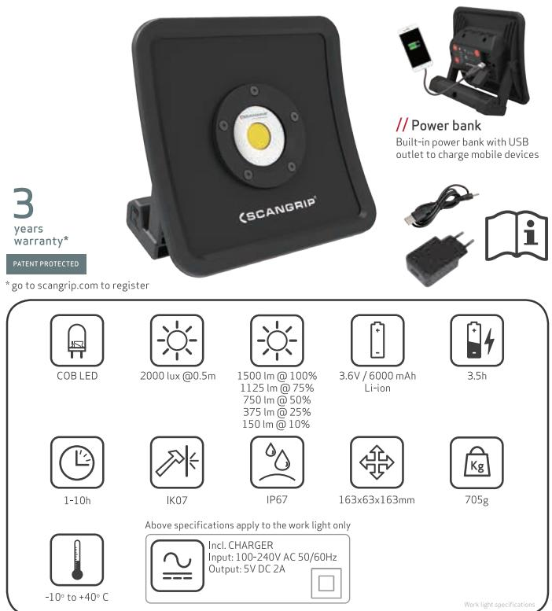
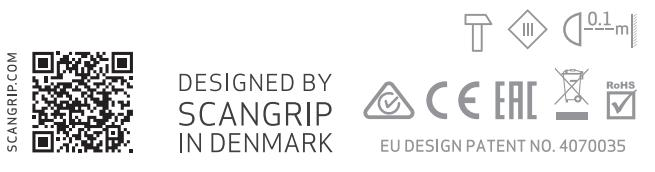

# NOVA R

## 03.5439/03.5439AU/03.5439UK

#### WARNING - Risk of fire Minimum distance from lighted objects 0.1m

## UK NOVA R

## WARNING / BATTERY TIPS

- . Always respect applicable legislation for w orking with electrical equipment in order to reduce the risk of accidents
- Avoid looking directly into the beam of light, as this will result in dazzling
- Do not use the lamp near a naked flame
- Protect the mains cable from oil, heat and sharp edges
- Always replace the battery with an original SCANGRIP battery
- Do not leave the battery without charge for an extended period- Deep discharge risks damaging the battery
- The light source of this luminaire is not replaceable; when the light source reaches its end of . life the whole luminaire shall be replaced
- Luminaire is only suitable for direct mounting on non-combustible surfaces.
- Charging Indoor Only.

Power bank

- Built-in power bank with USB outlet to charge mobile devices
- Output: 5V, 2A
- Capacity: 6000mAh

Discarded electrical products must not be disposed of together with household waste. Please use recycling facilities. Ask your local authority or retailer for advice on recycling.

- The battery must be removed from the device before it is broken up
- The device must be disconnected from the mains when the battery is removed
- Please dispose of the battery safely

### DK NOVA R

## ADVARSEL / BATTERITIPS

- . Respekter altid den gældende lovgivning for arbejde med elektrisk udstyr for dermed at reducere risikoen for ulykker
- . Undgå at se direkte ind i lysstrålen, da det vil medføre blænding
- Anvend ikke lampen i nærheden af åben ild
- Beskyt netledningen mod olie, varme og skarpe kanter
- Udskift altid batteriet med et originalt SCANGRIP-batteri
- Efterlad ikke batteriet fladt, da det kan medføre, at det IKKE kan genoplades
- Lyskilden på lampen kan ikke udskiftes: når lyskilden er opbrugt skal hele lampen udskiftes
- Lampen er kun egnet til direkte montering på ikke-brændbare overflader
- Oplad kun lampen indendørs

Power bank

- Indbygget power bank med USB-tilslutning for opladning af mobile enheder
- Ladespænding/-strøm 5 V, 2 A
- Kapacitet: 6000 mAh

Kasserede elektriske produkter må ikke bortskaffes sammen med husholdningsaffald. Benyt venligst genbrugsanlæg. Spørg din lokale kommune eller for genbrug rådgivning.

- Batteriet skal fjernes fra apparatet, før det ophugges
- Apparatet skal frakobles forsyningsnettet, når batteriet fjernes
- Batteriet skal bortskaffes på en sikker måde

## DE NOVA R

## ACHTUNG / AKKUPFLEGE

- Beachten Sie immer die allgemeinen Sicherheitsvorschriften für den Gebrauch von Elektrog-. eräten, um die Unfallgefahr zu verringern
- Nicht direkt in das Licht schauen, da es Blendung verursacht
- Die Lampe nie in der Nähe von offenen Flammen benutzen
- Netzkabel vor Ol, Hitze und scharfen Gegenständen schützen
- Nur originale SCANGRIP-Akkus als Ersatzteile verwenden
- Die Lampe nicht mit entleertem Akku aufbewahren, da dies den Akku ZERSTOREN kann
- Die Lichtquelle dieser Lampe ist nicht austauschbar; wenn die Lichtguelle defekt ist, oder das Lebensende erreicht hat, muß die gesamte Lampe ersetzt werden
- Die Armatur ist nur für die Direktmontage auf nicht brennbaren Oberflächen geeignet .
- Nur drinnen aufladen .

Powerbank

- Eingebaute Powerbank mit USB-Buchse für Aufladen von mobilen Einheiten.
- Ladespannung/ strom: 5 V, 2 A
- Kapazität: 6000 mAh

Altgeräte dürfen nicht mit dem Hausmüll entsorgt werden müssen separat über Sonder müllannahmestellen entsorgt oder an den Handel zurückgegeben werden. Handel und Kommunen sind zur kostenlosen Rücknahme verpflichtet.

- Vor Entsorgung die Batterie entfernen
- Das Gerät von der 230 V Netzstromversorgung trennen vor Auswechseln des Akkus
- Der Akku ist ordnungsgemäß zu entsorgen

#### FR NOVA R

## ATTENTION / CONSEILS SUR LA PILE

- . ll faut toujours respecter les lois en vigueur pour le travail avec l'équipement électrique. Ceci pour réduire le risque d'accidents
- Ne pas regarder directement dans le faisceau de lumière. Ceci pour éviter l'éblouissement
- Ne jamais utiliser la lampe à proximité de flammes
- Protéger le câble électrique contre l'huile, la chaleur, et des objets à arêtes tranchants
- Utiliser toujours une pile originale de SCANGRIP lors du remplacement
- Ne laisser pas la pile à plat. Dans ce cas il y a un risque de décharge excessive avec la conséquence que la pile ne soit plus réutilisable
- Les lampes LED ne peuvent pas être remplacées : lorsque les lampes sont en fin de vie, remplacer l'ensemble de l'équipement
- Ce luminaire est conçu uniquement pour un montage direct sur des surfaces non combustibles
- Charger uniquement à l'intérieur .

## Banque d'alimentation

- Banque d'alimentation intégrée avec prise USB pour charger les appareils mobiles
- Sortie : 5 V. 2 A
- Capacité : 6000 mAh
	- ll est interdit de jeter les produits électriques mis au rebut avec les ordures ménagères. Il faut les retourner à un centre de recyclage. Consulter les autorités locales ou le revendeur pour conseils sur le recyclage
		- Il faut enlever la pile de l'appareil avant la mise au rebut
		- Il faut débrancher l'appareil du réseau avant d'enlever la pile
		- Eliminer la pile d'une manière assurant la sécurité

#### ES NOVA R

ADVERTENCIA / CONSEJOS SOBRE LA BATERÍA

- Para reducir el riesgo de accidentes, respete siempre la legislación aplicable para el trabajo con equipos eléctricos
- Evite mirar directamente el haz de luz, ya que produce deslumbramiento
- No use la lámpara cerca de una llama abierta
- Proteja el cable de alimentación del aceite, el calor y los cantos afilados
- Sustituya siempre la batería por una batería SCANGRIP original
- No deje la batería totalmente descargada, ya que podría ser IMPOSIBLE cargarla de nuevo
- La fuente de luz de esta luminaria no es reemplazable; cuando la fuente de luz alcanzaal final de su vida, se sustituye toda la luminaria
- Esta luminaria solo es adecuada para el montaje directo sobre superficies no combustibles
- Cargar exclusivamente en interiores

Cargador de batería

- Cargador de batería integrado con toma USB para cargar dispositivos móviles
- Salida: 5 V, 2 A
- Capacidad: 6000 mAh

Los productos eléctricos no pueden desecharse junto con los residuos domésticos. Le rogamos que use los centros de reciclaje. Solicite asesoramiento sobre reciclaje al vendedor o a las autoridades locales

- La batería debe extraerse del dispositivo antes de que se descomponga
- Cuando se extraiga la batería, el dispositivo debe estar desconectado de la red eléctrica
- e rogamos que deseche la batería de forma segura

#### PT NOVA R

## AVISO / SUGESTÕES PARA A BATERIA

- Respeite sempre a legislação aplicável ao trabalho com equipamento elétrico a fim de reduzir . o risco de acidentes
- Evite olhar diretamente para o feixe de luz, uma vez que ofusca
- Não utilize a lâmpada perto de uma chama nua
- Proteja o cabo da rede elétrica do óleo, do calor e das arestas cortantes
- Substitua sempre a bateria por uma bateria SCANGRIP original
- Não deixe a bateria descarregada, pois será IMPOSSÍVEL carregá-la outra vez.
- A fonte de luz desta luminária não é substituível; quando a fonte de luz atinge ao fim de sua vida toda a luminária deve ser substituído
- . A luminária é adequada apenas para montagem direta em superfícies não combustíveis
- Carregamento apenas em interiores

#### Banco de alimentação

- Banco de alimentação integrado com saída USB para carregar dispositivos móveis
- Potência de saída: 5 V, 2 A
- Capacidade: 6000 mAh

Os produtos elétricos rejeitados não devem ser eliminados juntamente com o lixo doméstico. Utilize os centros de reciclagem. Peça à autoridade local ou ao vendedor conselhos sobre reciclagem

- A bateria tem de ser retirada do dispositivo antes de ser desmontado
- O dispositivo tem de estar desligado da rede elétrica quando se retira a bateria
- Elimine a bateria de uma forma segura

## NOVA R

IT

## AVVERTENZA / SUGGERIMENTI PER LA BATTERIA

- Proteja o cabo da rede elétrica do óleo, do calor e das arestas cortantes .
- . Evitare di guardare direttamente il fascio di luce in quanto provocherebbe abbagliamento
- . Non usare la lampada in prossimità di fiamme libere
- Proteggere il cavo di alimentazione da olio, calore e spigoli vivi .
- . Sostituire sempre la batteria con una batteria originale SCANGRIP
- Non lasciare la batteria scarica, dato che ciò potrebbe renderla NON PIÙ IN GRADO di essere . ricaricata.
- . La sorgente luminosa non è sostituibile, quando questa sarà a fine vita si dovrà provvedere alla sostituzione completa della lampada
- L'apparecchio di illuminazione è adatto solo per il montaggio diretto su superfici non combustibili . Caricare solo in interni

Power bank

- Power bank incorporato con uscita USB per caricare dispositivi mobili.
- Potenza in uscita: 5 V, 2 A
- Capacità: 6000 mAh

l prodotti elettrici al termine del ciclo di vita non devono essere smaltiti insieme ai rifiuti domes tici. Si raccomanda di utilizzare gli impianti di riciclaggio. Chiedere alle autorità locali o al proprio rivenditore per informazioni sul riciclaggio

- Rimuovere la batteria dal dispositivo prima che questo venga smantellato
- Scollegare il dispositivo dalla rete elettrica prima di rimuovere la batteria
- Smaltire la batteria in modo sicuro

#### NL NOVA R

## WAARSCHUWING / BATTERIJTIPS

- . Volg bij werkzaamheden met elektrische uitrusting altijd de geldende wet- en regelgeving om de kans op ongevallen te minimaliseren
- . Kijk niet direct in de lamp om verblinding te voorkomen.
- Gebruik de lamp niet in de nabijheid van open vuur
- Bescherm de voedingskabel tegen olie, warmte en scherpe kanten
- Vervang de batterij altijd door een originele batterij van SCANGRIP
- Bewaar de batterij niet leeg, omdat de batterij anders NIET MEER kan worden opgeladen
- . De lichtpeer van deze lamp kan niet worden vervangen; wanneer de peer is uitgebrand, moet de hele lamp worden vervangen
- . De lichtarmatuur is uitsluitend geschikt voor directe montage op niet-brandbare oppervlakken
- . Uitsluitend binnen opladen

#### Powerbank

- . Ingebouwde powerbank met USB-uitgang voor het opladen van mobiele apparaten
- Uitgangsspanning: 5 V, 2 A .
- Vermogen: 6000 mAh

| / |
|---|
|   |
| 1 |
|   |

- Afgedankte elektrische producten mogen niet worden afgevoerd met het huishoudelijk afval. Lever in bij een afvalinzamelstation. Vraag uw plaatselijke overheid of winkelier om advies inzake recycling
- Voordat het apparaat wordt verschroot. moet de batterij uit het apparaat worden verwiiderd
- Het apparaat moet worden losgekoppeld van de netvoeding voordat de batterij wordt verwijderd
- Voer de batterij veilig af

### PL NOVA R

## OSTRZEŻENIE / PORADY DOTYCZĄCE AKUMULATORA

- Aby zmniejszyć ryzyko wystąpienia wypadku, należy zawsze przestrzegać odpowiednich . przepisów dotyczacych pracy z urządzeniami elektrycznymi
- Nie patrzeć bezpośrednio na wiązkę światła, gdyż spowoduje to oślepienie .
- . Nie używać lampy w pobliżu otwartego ognia
- . Chronić przewody elektryczne przed olejem, wysoka temperaturą i ostrymi krawędziami
- . Podczas wymiany należy zawsze stosować oryginalny akumulator firmy SCANGRIP
- . Nie należy dopuszczać do całkowitego rozładowania akumulatora, ponieważ może to oznaczać BRAK MOŻLIWOŚCI jego ponownego naładowania
- Źródło światła tej oprawy nie są wymienne; gdy źródło światła osiąga jego koniec życia . cała oprawa zastępuje się
- . Oprawę można montować tylko bezpośrednio na powierzchniach niepalnych
- . Ładowanie tylko w zamkniętych pomieszczeniach

### Power bank

- Wbudowany power bank z wyjściem USB do ładowania urządzeń mobilnych. .
- Wyjście: 5 V, 2 A .
- Pojemność: 6000 mAh

Nie wolno utylizować zużytych urządzeń elektrycznych wraz z odpadami domowymi. Należy skorzystać z placówek przetwarzania odpadów. Więcej informacji na temat przetwarzania odpadów udzielają lokalne władze lub sprzedawca

- Przed utylizacją urządzenia należy z niego wyciągnąć baterie/akumulator

- Urządzenie musi być odłączone od sieci podczas wyciągania baterii/akumulatora
- Baterie/akumulatory należy utylizować w sposób bezpieczny

#### BG NOVA R

#### ПРЕДУПРЕЖДЕНИЕ / СЪВЕТИ ЗА БАТЕРИЯТА

- . Винаги спазвайте приложимото законодателство при работа с електрическо оборудване. за да се намали рискът от злополуки
- . Избягвайте да гледате директно в светлинния лъч, тъй като това ще доведе до заслепяване
- . Не използвайте лампата в близост до открит пламък е
- . Защитете захранващия кабел от масло, топлина и остри ръбове
- . Винаги сменяйте батерията с оригинална батерия на SCANGRIP
- . Не оставяйте батерията изтощена, защото това може да я направи НЕСПОСОБНА да се зарежда отново.
- . Светлинният източник на това осветително тяло не е сменяема: когато източникът на светлина достига си край на -живота на цялото осветителя се заменя
- . Осветителното тяло е подходящо само за директен монтаж върху негорящи повърхности
- . Зареждане само на закрито

#### Многоелементна батерия

- . Вградена многоелементна батерия с USB изход за зареждане на мобилни устройства
- . Изходни параметри: 5V, 2A
- . Капацитет: 6000mAh

Излезлите от употреба електрически уреди не трябва да се изхвърлят заедно с битовите отпадъци. Моля, използвайте пунктове за рециклиране. Обърнете се към вашите местни власти или търговеца на дребно за съвет относно рециклирането

- Батерията трябва да бъдат извадена от устройството, преди то да бъде разбито
- Устройството трябва да бъде изключено от електрическата мрежа, когато се вади батерията
- Моля, изхвърляйте батерията по безопасен начин

MANUFACTURER'S WARRANTY - Information for customers in Australia and New Zealand only This SCANGRIP product is guaranteed for a period of 2 (two) years from date of purchase. This guarantee shall become invalid if the product has been misused, tampered with or accidentally damaged. If the product is defective, we undertake to repair or replace the product or any part of it that is defective; or wholly or partly recompense you if they are defective. This guarantee is in addition to other rights and remedies available to consumers, all of which are given by us to you if you are a consumer. Our goods come with guarantees that cannot be excluded under the Australian or New Zealand Consumer Law. You are entitled to a replacement or refund for a major failure and for compensation for any other reasonably foreseeable loss or damage. You are also entitled to have the goods repaired or replaced if the goods fail to be of acceptable quality and the failure does not amount to a major failure. If you wish to make claim, please return this product to the original place of purchase together with your purchase receipt or go to our website www.scangrip.com and fill out the claim form.

