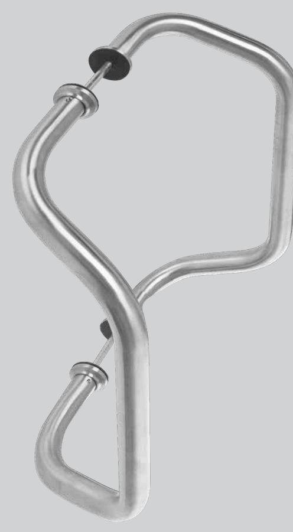
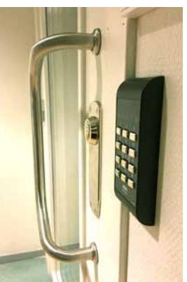
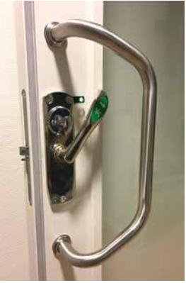
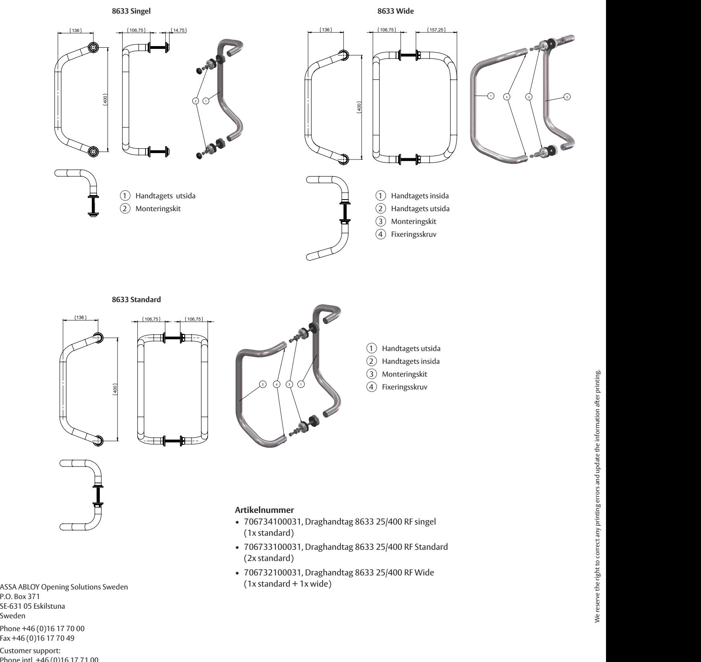

## ASSA ABLOY Draghandtag 8633

8633 Singel, Standard och Wide

Draghandtag 8633 i borstat, syrafast rostfritt stål (EN 1.4404 / AISI 316L) för bästa tänkbara korrosionssäkerhet. Designen är diskret och lämpar sig därför för de flesta typer av dörrar. Formen möjliggör även kombination med nödutrymningsbeslag och panikreglar. 8633 finns i tre modeller Singel, Standard och Wide.

Vissa dörrtyper kan kräva lämplig förstärkning för att klara det höga moment som uppstår vid brukandet.

## **Egenskaper**

- Material: Borstat syrafast stål AISI 316L, EN 1.44040
- Tre modeller: Singel, standard (par), Wide och Standard (par)
- Genomgående med dold fastsättning
- Levereras med M8 bult som klarar dörrtjocklek 35-90 mm
- Mått: Ø 25 mm, CC 400 mm

Viktigt: Tänk på att den fria öppningsbredden minskar om du använder draghandtag på nöd- och panikdörrar.

## ASSA ABLOY Draghandtag 8633

8633 Singel, Standard och Wide 136

136

136

136

136

Customer support: Phone intl. +46 (0)16 17 71 00 Phone nat. 0771-640 640 Fax +46 (0)16 17 73 72 e-mail: helpdesk.se.openingsolutions@assaabloy.com www.assaabloyopeningsolutions.se

P.O. Box 371

Sweden