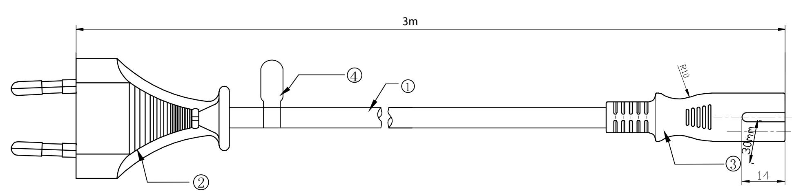
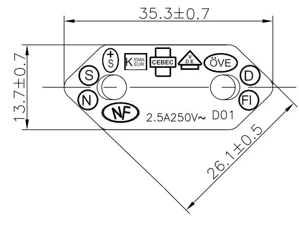
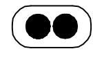
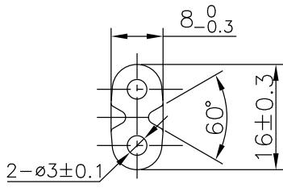

APPROVED

CHECKED

## H05VVH2-F 2X0.75mm²

|       |                                       |                         | (4)                                                           | TAG               | 1PCS | DELTACO TAG                                         |               |
|-------|---------------------------------------|-------------------------|---------------------------------------------------------------|-------------------|------|-----------------------------------------------------|---------------|
|       |                                       |                         | (3)                                                           | IEC C7            | 1PCS | WHITE PVC                                           |               |
|       |                                       |                         | (2)                                                           | IEC 7/16          | 1PCS | WHITE PVC                                           |               |
|       |                                       |                         | (1)                                                           | CABLE             | 1PCS | H05VV-F 2*0.75mm²  WHITE PVC JACKET OD:3.4*5.6mm |               |
|       |                                       |                         | NO.                                                           | PARTS NAME   Q'TY |      |                                                     | SPECIFICATION |
| DRAWN | ITEM NO. DRAW NO. UNIT SCALE | DEL-109JM mm NONE | DESCRIPTION: CEE7/16 — IEC C7 H05VVH2-F 2*0.75mm² 3m |                   |      |                                                     | онио Служб    |