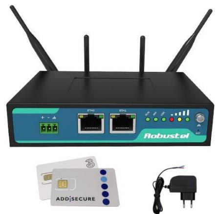

# **Routerpaket R2000 förkonfigurerad och installerade SIM-kort**

Denna router är förberedd för att enkelt kunna användas till passage- och portelefonisystem från Axema, Aptus samt många andra larm och övervakningssystem. I routern sitter SIM-kort från Tre redan monterat och är förberedd även för kort från Addsecure. Aktiverar enkelt det som passar bäst eller bägge två om man vill ha extra säkerhet för uppkoppling.

## **Paketets innehåll**

1st Router R2000 1st Nätadapter 2st mobilnätsantenner 1st SIM-kort

## **LAN-inställningar**

Routern har konfigurerats för att klara de vanligaste behoven och har därför redan från start 2 olika LAN-områden.

#### **ETH 0**

| IP-adress 192.168.0.1 | Nätmask 255.255.255.0 | DHCP 192.168.0.2 – 192.168.0.100 |
|--------------------------|--------------------------|-------------------------------------|
| Port Forward 1           | Port Forward 2           | Port Forward 3                      |
| 20101 – 192.168.0.101    | 20102 – 192.168.0.102    | 20103 – 192.168.0.103               |

#### **ETH 1**

| IP-adress          | Nätmask            | DHCP                  |
|--------------------|--------------------|-----------------------|
| 10.0.0.1           | 255.255.255.0      | 10.0.0.2 – 10.0.0.100 |
| Port Forward 1     | Port Forward 2     | Port Forward 3        |
| 10101 – 10.0.0.201 | 10102 – 10.0.0.202 | 10103 – 10.0.0.203    |

#### **Aptus**

Anslut mot valfri port och konfigurerar Aptus-systemet/systemen med IP: 192.168.0.101 - 103

## **Axema**

Anslut mot ETH 0 system innehållande B60. För system med upp till 10 portar och utan B60 ska de anslutas till ETH 1.

## **SIM-kort**

SIM 1 är bestyckat med ett kort för **Tre Telematik** – som ger en publik fast IP-adress som gör att man når utrustningen från Internet.

SIM 2 är förberedd för ett kort för **Addsecure Link Go** – som ger en säker uppkoppling som gör att man når utrustningen via VPN. Kontakta oss på info@acandia.se eller 08-5222 4030 för utskick av SIM-kort.

Aktivering av abonnemang görs enkelt på: www.acandia.se/aktivering

### **Inloggning**

Inloggningsuppgifter till routerns webgränssnitt: User: admin Password: **Copiax2Go**

## **Mer detaljerade instruktioner**

Fullständig manual, instruktioner hur routern är konfigurerad, hur man ställer om till andra konfigurationer samt hur man hämtar hem och installerar VPN-certifikat för Addsecure Link Go finns på sidan:

www.acandia.se/copiax

Du kan även kontakta Acandia och få kostnadsfri hjälp att via fjärråtkomst konfigurera om routern.

Tel: **08-5222 4030** Mail: info@acandia.se