# Mullion Reader

User Manual

Document ID: A-100410 Edition date: 21.06.2018

Data and design subject to change without notice. / Supply subject to availability.

© 2018 Copyright by Vanderbilt

We reserve all rights in this document and in the subject thereof. By acceptance of the document the recipient acknowledges these rights and undertakes not to publish the document nor the subject thereof in full or in part, nor to make them available to any third party without our prior express written authorization, nor to use it for any purpose other than for which it was delivered to him.

MIFARE and MIFARE Classic are trademarks of NXP B.V.

MIFARE DESFire are registered trademarks of NXP B.V. and are used under license.

Hereby, Vanderbilt International (IRL) Ltd declares that this equipment type is in compliance with the following EU Directives for CE marking: • Directive 2014/30/EU (Electromagnetic Compatibility Directive)

- Directive 2014/53/EU (Radio Equipment Directive)
- Directive 2011/65/EU (Restriction of the use of certain hazardous substances Directive)
- The full text of the EU declaration of conformity is available at: http://van.fyi?Link=DoC

http://van.fyi/?Link=ACTcardReaders

# **Table of Contents**

| 1 Introduction                                                 | 4  |
|----------------------------------------------------------------|----|
| 2 Technical data                                               | 5  |
| 3 Safety regulations                                           | 7  |
| 4 Reader components and package contents                       | 8  |
| 4.1 Reader components                                          | 8  |
| 4.2 Package contents                                           | 8  |
| 5 Mounting and connecting                                      | 9  |
| 5.1 Mounting a reader                                          | 9  |
| 5.2 Mounting a reader with cables fed from the side            | 10 |
| 5.3 Connecting the cables                                      | 12 |
| 5.3.1 Connecting the reader in OSDP mode                       | 12 |
| 5.3.2 Connecting the reader in Wiegand mode                    | 13 |
| 5.4 Setting the Jumpers                                        | 15 |
| 5.4.1 Setting the Jumpers for OSDP                             | 15 |
| 5.4.2 Setting the Jumpers for Wiegand                          | 16 |
| 6 Closing the reader                                           | 18 |
| 7 Disassembling the reader                                     | 19 |
| 7.1 To disassemble the reader:                                 | 19 |
| 7.2 To remove the terminal block:                              | 20 |
| 8 Default settings                                             | 21 |
| 8.1 3CT Tool                                                   | 21 |
| 8.2 Setting burst mode using the keypad                        | 22 |
| 9 Connecting the reader to SiPass integrated                   | 23 |
| 9.1 Connecting the reader to SiPass integrated in OSDP mode    | 23 |
| 9.2 Setting OSDP address for the reader                        | 24 |
| 9.3 Connecting the reader to SiPass integrated in Wiegand mode | 24 |
| 10 Connecting the reader to ACT                                | 25 |
| 10.1 Connecting the reader to ACT in OSDP mode                 | 25 |
| 10.2 Setting the OSDP address for the reader                   | 26 |
| 10.3 Connecting the reader to ACT in Wiegand mode              | 28 |
| 11 Connecting the reader to SPC                                | 29 |

# **1 Introduction**

The VR20M-MFand VR50M-MF are mullion-mount card readers with modern anti-hacking security over OSDP and support for the traditional Wiegand protocol. When installed as part of a secure system over OSDP, the communication from the reader or the controller they are connected to cannot be compromised. The readers are made of hard wearing materials and will endure most weather conditions. The readers are easy to mount and can be mounted on a flat surface. The readers can be cleaned with most kinds of domestic detergents. All readers have a multicolour light frame. The VR50M-MF has a keypad for PIN code.

# **2 Technical data**

|                         | VR20M-MF                                                                                                              | VR50M-MF                                                                                                              |
|-------------------------|-----------------------------------------------------------------------------------------------------------------------|-----------------------------------------------------------------------------------------------------------------------|
| Protocol                | OSDP or Wiegand                                                                                                       | OSDP or Wiegand                                                                                                       |
| Interface to controller | RS485 or Wiegand                                                                                                      | RS485 or Wiegand                                                                                                      |
| Operating voltage       | 8.5 – 30.0VDC                                                                                                         | 8.5 – 30.0VDC                                                                                                         |
| Power consumption       | DC 12V 50mA Peak 150mA DC 24V 35mA Peak 100mA                                                                      | DC 12V 50mA Peak 150mA DC 24V 35mA Peak 100mA                                                                      |
| Tamper protection       | Yes                                                                                                                   | Yes                                                                                                                   |
| Card technology         | MIFARETM                                                                                                              | MIFARE                                                                                                                |
| Card compatibility      | MIFARE Classic MIFARE Plus MIFARE DESFire EV1/ EV2                                                              | MIFARE Classic MIFARE Plus MIFARE DESFire EV1/ EV2                                                              |
| Reading distance        | MIFARE Classic-up to 6 cm MIFARE Plus-up to 6 cm MIFARE DESfire EV1/ EV2-the card must be held to the reader | MIFARE Classic-up to 6 cm MIFARE Plus-up to 6 cm MIFARE DESfire EV1/ EV2-the card must be held to the reader |
| Indicators              | 3 x LED (red/yellow/green) 1 x Buzzer Multicolour light frame                                                   | 3 x LED (red/yellow/green) 1 x Buzzer Multicolour light frame                                                   |
| Keypad                  | No                                                                                                                    | Yes                                                                                                                   |
| Operating temperature   | - 40°C to + 70°C                                                                                                      | - 40°C to + 70°C                                                                                                      |
| IP rating               | IP55                                                                                                                  | IP55                                                                                                                  |
| IK class                | 08                                                                                                                    | 08                                                                                                                    |
| Housing                 | Zinc cast metal bezel with polycarbonate plastic front                                                             | Zinc cast metal bezel with polycarbonate plastic front                                                             |
| Color                   | Black, matt chrome                                                                                                    | Black, matt chrome                                                                                                    |
| Dimensions (WxHxD) mm   | Surface mounted: 48 x 129 x 22                                                                                        | Surface mounted: 48 x 129 x 24                                                                                        |

#### **Cable length guide**

| OSDP    | Max. 8 readers | Max. 1 km Belden cable         |
|---------|----------------|--------------------------------|
| Wiegand | Max. 4 readers | Max. 30m copper cable (0.5 mm) |

# **3 Safety regulations**

#### General

- l Follow all warnings and instructions marked on the device.
- l Keep this document for reference purposes.
- l Please consider any additional country-specific, local laws, safety standards, or regulations concerning installation, operation, and disposal of the product.

#### Liability claim

- l Do not make any changes or modifications to the device.
- l Use only spare parts and accessories that have been approved by the manufacturer.

# **4 Reader components and package contents**

The following diagrams identify the reader components and the items that come packaged with the reader.

## **4.1 Reader components**

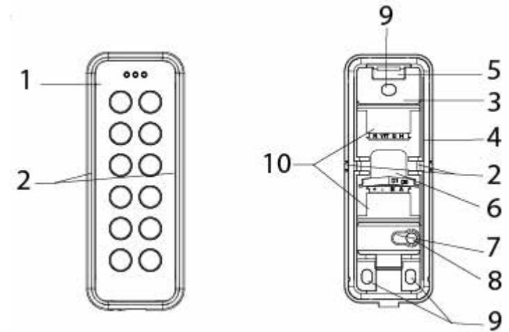

| 1 | Front         | 6  | Location where cables can come through the back |
|---|---------------|----|----------------------------------------------------|
| 2 | Knockouts x 2 | 7  | Tamper base                                        |
| 3 | Base          | 8  | Screw for tamper protection                        |
| 4 | Gasket        | 9  | Mounting holes                                     |
| 5 | Hook          | 10 | Upper and lower terminal block locations           |

## **4.2 Package contents**

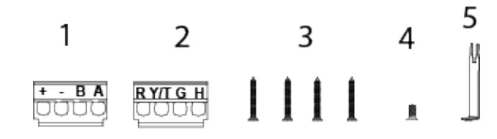

| 5 | Opening tool                                                       |
|---|--------------------------------------------------------------------|
| 4 | Cover screw                                                        |
| 3 | Mounting/Tamper screws                                             |
| 2 | R Y/T G H terminal block for Wiegand (upper terminal block)        |
| 1 | + - B A terminal block for OSDP and Wiegand (lower terminal block) |

# **5 Mounting and connecting**

The mullion readers are surface-mounted readers. The readers can be mounted with cables led through the back of the unit or led in from either side through knockout gaps.

For wiring details please refer to:

- l *Connecting the cables* on page 12.
## **5.1 Mounting a reader**

To ensure a close fit, mount the reader on a flat surface.

To attach the base to a surface:

- 1. Make a small hole in the back of the base gasket shown in the diagram below. Use this hole to feed the cable through the gasket and into the reader base.
- 2. Attach the base to the wall with three screws: one in the middle at the top of the base, and one in each of the corners at the bottom of the base.

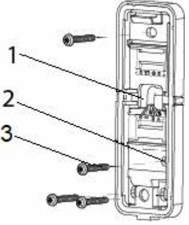

| 1 | Location to make a hole for wires |
|---|-----------------------------------|
| 2 | Tamper base                       |
| 3 | Tamper screw                      |

- 3. If tamper protection is required, fix the screw into the hole on the tamper base. Do not over tighten the screw as this can damage the tamper base.
- 4. Continue to follow the instructions detailed in *Connecting the cables* on page 12.

## **5.2 Mounting a reader with cables fed from the side**

If the cables are fed from the side:

- 1. Remove the gasket from the base.
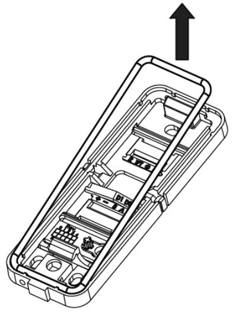

- 2. Identify which of the knockouts the cables should be fed through.
- 3. Use a pliers to pull the knockout away from the base.

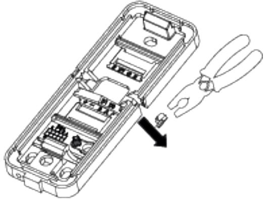

- 4. Remove the corresponding knockout on the cover.
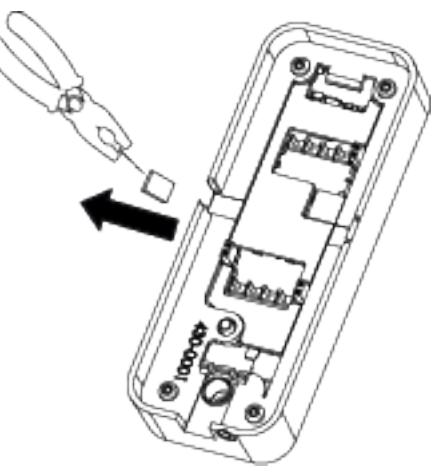

- 5. Attach the base to the wall with three screws: one in the middle at the top of the base and one in each of the corners at the bottom of the base.
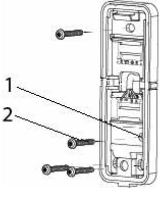

| 1 | Tamper base  |
|---|--------------|
| 2 | Tamper screw |

- 6. If tamper protection is required, fix the screw into the hole on the tamper base. Do not over tighten the screw as this can damage the tamper base.
- 7. Feed the cables through the opening and reinsert the gasket. Proceed to the instructions for *Connecting the cables* on the next page.

Vanderbilt recommend sealing the gap that the knockout creates with a sillicone sealant. Do this after you have closed the reader. Please note that a reader with a removed knockout does not meet the standard for IP 55.

## **5.3 Connecting the cables**

### **5.3.1 Connecting the reader in OSDP mode**

Use the terminal block marked +-BA (see number 2 in *Package contents* on page 8 and a pair of twisted screened cable to connect the cables in OSDP mode.

- 1. Attach the cables according to the respective indicators on the second, +-BA terminal block (lower terminal block) and the base:

| Reader | Controller |
|--------|------------|
| +      | +12V       |
| -      | 0V         |
| B      | B          |
| A      | A          |

- 2. Insert the ridge on the end of the terminal block marked +-BA into the slot marked +,-,B,A.
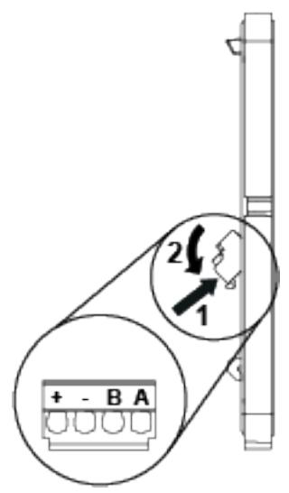

- 3. Gently push the terminal block towards the base until it clicks.
- 4. Push the cables back.

Please note that you must set the Jumpers to configure your application. For more information on setting the Jumpers in OSDP mode see *Setting the Jumpers for OSDP* on page 15.

On the reverse of the front plate, Jumper 3 is used to determine EOL (see the diagram in *Connecting the cables* above). By default EOL is ON and the reader acts as the last reader on the bus. However, if the reader is an intermediate reader on the bus, Jumper 3 must be removed.

### **5.3.2 Connecting the reader in Wiegand mode**

Use the terminal blocks marked +-BA and RY/TGH and a pair of twisted screened cables (4 pairs + screen), such as Belden 9502 to connect the reader in Wiegand mode.

- 1. Attach the cables according to the respective indicators on the communication and power terminal block (+-BA terminal block (lower terminal block)):

| Reader | Controller |
|--------|------------|
| +      | +12V       |
| -      | 0V         |
| B      | Wiegand D1 |
| A      | Wiegand D0 |

- 2. Attach the cables on the LED, tamper, and horn terminal block (RY/TGH terminal block (upper terminal block)):

| Reader                                                                                                                                                                                      | Controller (Generic) | Controller (SPC)     | Controller (ACT) |
|---------------------------------------------------------------------------------------------------------------------------------------------------------------------------------------------|----------------------|----------------------|------------------|
| R                                                                                                                                                                                           | Red LED              | VO1                  | Red              |
| Y/T*                                                                                                                                                                                        | Tamper input         | Zone Input (tamper)1 | Tamper input1    |
| G                                                                                                                                                                                           | Green LED            | VA1                  | Green            |
| H                                                                                                                                                                                           | Buzzer output        | System Output1       | Buzzer output1   |
| *The Tamper output (default setting) connection may alternatively be configured to provide a Yellow input to the reader. The Tamper output/ Yellow input options are mutually exclusive. |                      |                      |                  |

1This connection is optional.

- 3. Insert the ridge on the end of the upper or lower terminal block into the corresponding slot.
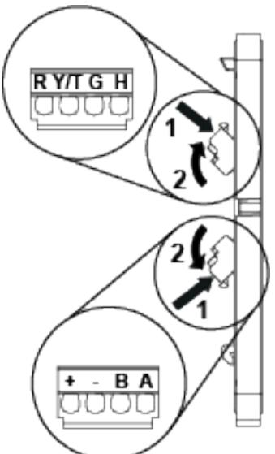

- 4. Gently push the terminal block towards the base until it clicks.
- 5. Remove the Jumper 3 (see the diagram in *Connecting the cables* on the previous page). Jumper 3 is used to determine EOL. By default the reader has EOL ON. EOL is always off in Wiegand mode.

Please note that you must set the Jumpers to configure your application. For more information on setting the Jumpers in Wiegand mode see *Setting the Jumpers for Wiegand* on page 16.

## **5.4 Setting the Jumpers**

There are three Jumpers inside the front of the reader. Use the Jumpers to set the reader to OSDP or Wiegand mode, to set OSDP Addressing or Wiegand format, and to set the End Of Line (EOL) status for the reader.

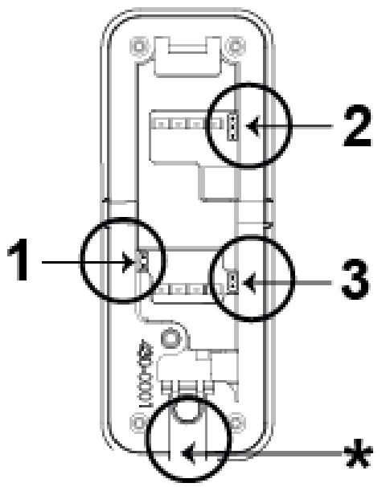

| 1 | Set reader to OSDP or Wiegand mode          |
|---|---------------------------------------------|
| 2 | Set OSDP addressing or Wiegand formats      |
| 3 | Set End Of Line (EOL) status for the reader |
| * | This indicates the bottom of the reader     |

### **5.4.1 Setting the Jumpers for OSDP**

The diagrams below show how to position the Jumpers to get the desired functions from the terminal blocks. Note that the EOL is ON for a sole reader or for the last reader on the RS485 bus.

#### **Jumper 1**

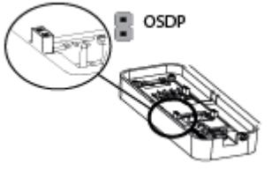

Jumper 1 is ON to select OSDP.

#### **Jumper 2**

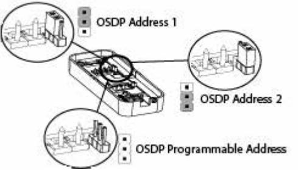

- l Jumper 2 is ON the first two pins for OSDP Address 1.
- l Jumper 2 is ON the bottom two pins for OSDP Address 2.
- l Jumper 2 is OFF for OSDP Programmable Address.

#### **Jumper 3**

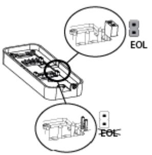

- l Jumper 3 is ON to enable EOL.
- l Jumper 3 is OFF to disable EOL.

### **5.4.2 Setting the Jumpers for Wiegand**

The diagrams below show how to position the Jumpers to get the desired functions from the terminal blocks. Note that in Wiegand mode EOL is not fitted. Wiegand can be set at 26 bit, 32 bit or 56 bit.

#### **Jumper 1**

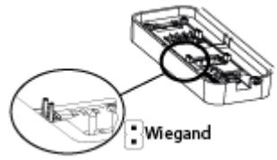

Jumper 1 is OFF to select Wiegand.

#### **Jumper 2**

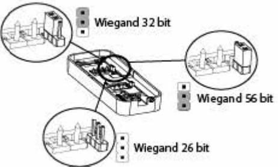

- l Jumper 2 is ON the first two pins for Wiegand 32 bit.
- l Jumper 2 is ON the bottom two pins for Wiegand 56 bit.
- l Jumper 2 is OFF for Wiegand 26 bit.

#### **Jumper 3**

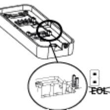

- l Jumper 3 is OFF to disable EOL.
- l Jumper 3 is always OFF in Wiegand mode.

# **6 Closing the reader**

To close the reader:

- 1. Holding the front of the reader at an angle, insert the hook on the top of the base into the corresponding slot in the front of the reader and slide down.
- 2. Gently press in the bottom of the reader front until the snap lock confirms a secure attachment.
- 3. Screw the cover screw (see number 4 in *Package contents* on page 8) into the bottom of the reader.

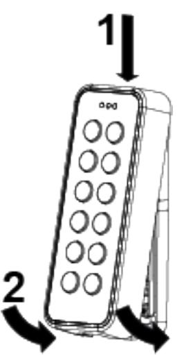

# **7 Disassembling the reader**

## **7.1 To disassemble the reader:**

- 1. Remove the cover screw.
- 2. Insert the opening tool in the slot between the base and the front and push gently upwards.

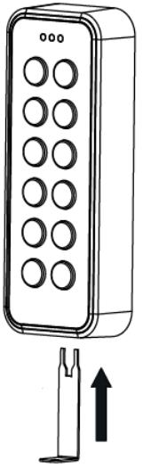

- 3. Use the opening tool to pull the reader outwards and upwards.

- 4. When the front of the reader is disconnected from the snap lock, lift the front and slide upwards to disengage from the hook at the top.
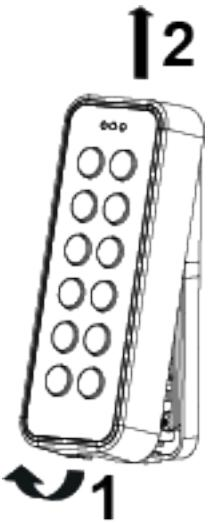

## **7.2 To remove the terminal block:**

- 1. Push down gently on the end of the terminal block marked with either +-BA or RY/TGH.
- 2. Tilt the terminal block away from the base.

# **8 Default settings**

| Reading MIFARE Classic                                                                                                   | UID                                                              |
|--------------------------------------------------------------------------------------------------------------------------|------------------------------------------------------------------|
| Reading MIFARE Plus SL1 – SL3                                                                                            | UID                                                              |
| Reading MIFARE DESFire EV1                                                                                               | UID                                                              |
| Communications mode                                                                                                      | OSDP (to change to Wiegand mode remove Jumper 1 and Jumper 3) |
| Backlight                                                                                                                | Always on (change with 3CT tool)                                 |
| Bus address                                                                                                              | 1 (Up to eight are supported)                                    |
| Wiegand output                                                                                                           | 32 bit                                                           |
| Wiegand key PIN burst                                                                                                    | 8 bits                                                           |
| Light frame                                                                                                              | Follows Red, Green LED inputs in Wiegand mode                    |
| Tamper/Yellow Connection                                                                                                 | Tamper output (change to yellow LED with 3CT tool)               |
| Wiegand heart beat mode                                                                                                  | OFF                                                              |
| Time-out for configuration card (keypad backlight turns off when this timeout expires subsequent to last keypress) | 3 seconds                                                        |
| Activation time-out                                                                                                      | 30 seconds                                                       |
| Hold-off time for card read                                                                                              | 100 milliseconds                                                 |
| Reception for card (time before the same card will be detected in the field again)                                    | Inactive                                                         |
| Min background illumination                                                                                              | 12                                                               |
| Max background illumination                                                                                              | 255                                                              |
| Off-line indication                                                                                                      | Yes                                                              |
| Buzzer volume for key press                                                                                              | 2                                                                |
|                                                                                                                          |                                                                  |
| Buzzer volume for card read                                                                                              | 2                                                                |

## **8.1 3CT Tool**

To change the default configuration of the reader, use the 3CT tool. You can purchase the 3CT tool as a separate download. You can use the 3CT tool to configure MIFARE Classic and DESFire EV1 card formats to be configured along with Wiegand options to be used for the card readers. For further information, please contact Vanderbilt International Ltd.. The 3CT tool configures the format in which user cards are interpreted by the card reader. The 3CT tool supports configuration of the following options: Tamper Output / Yellow Input and Heart beat Mode.

| Option          | Default setting | Information                                                                    |
|-----------------|-----------------|--------------------------------------------------------------------------------|
| Yellow input    | Disabled        | Selects Tamper Output when disabled                                            |
| Heart beat mode | Disabled        | Ensures a comms message is sent every 10 seconds to controller when enabled |

For more information on 3CT please see the User manual for Configuration Card Creation Tool which is included when you purchase the 3CT tool.

The readers use FreeRTOS. For further information, please visit www.freetos.org.

## **8.2 Setting burst mode using the keypad**

The default burst mode is 8 bit. This can only be changed to 4 bit if you are using the reader in Wiegand mode. To change from 8 bit to 4 bit burst :

- 1. Set Jumper 2 in the desired Wiegand position as shown in *Connecting the cables* on page 12.
- 2. Ensure Jumper 1 and Jumper 3 are removed.
- 3. Power up the reader while holding the X key. The red and green indicators alternately turn on.
- 4. Press the key sequence 1414 to specify that 4 bit burst is required.
- 5. Hold down the ✓ key until you hear the affirmative beep.
- 6. To change back to 8 bit burst from 4 bit burst, follow the steps above pressing the key sequence 1818 instead of 1414.

# **9 Connecting the reader to SiPass integrated**

## **9.1 Connecting the reader to SiPass integrated in OSDP mode**

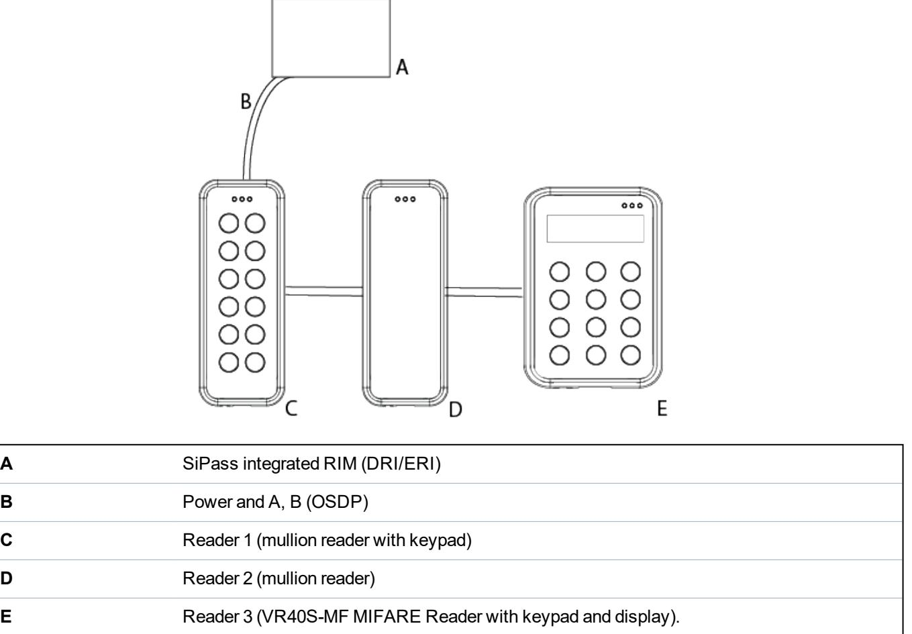

The connection between a reader and a Reader Interface Module (RIM) is as follows:

| RIM (DRI/ERI) |   | VRxx-MF |
|---------------|---|---------|
| 12 V          | ⃡ | +       |
| 0V            | ⃡ | -       |
| Tx/+          | ⃡ | A       |
| Rx/-          | ⃡ | B       |

SiPass integrated can support both the VR and NGCR readers on the same OSDP bus.

## **9.2 Setting OSDP address for the reader**

You can set the reader address to 1 (default setting), 2 , or programmed with a value from 1 to 8 using the Jumper. Place the Jumper in one of the three positions shown in the diagram below to achieve the desired address. Additional addresses are automatically assigned by the controller from 3 to 8 following the order in which the readers are powered up.

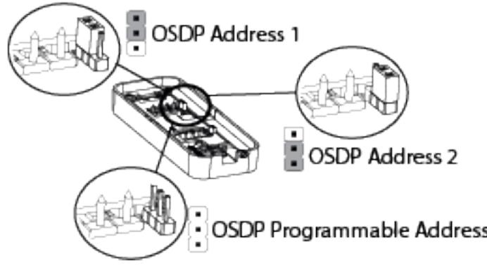

When the reader is first powered up, the yellow LED flashes. The flashing lights stop when it is correctly configured to SiPass integrated. This can be tested by holding a card next to the reader. A correctly configured reader acknowledges the card according to the SiPass integrated settings.

Please note that a new reader will always get the next free bus address. For example, if a reader with bus address 5 is removed and a new reader is installed, the new reader gets address 5.

## **9.3 Connecting the reader to SiPass integrated in Wiegand mode**

For more detail on connecting the reader to SiPass integrated via Wiegand see *Connecting the reader in Wiegand mode* on page 13.

# **10 Connecting the reader to ACT**

## **10.1 Connecting the reader to ACT in OSDP mode**

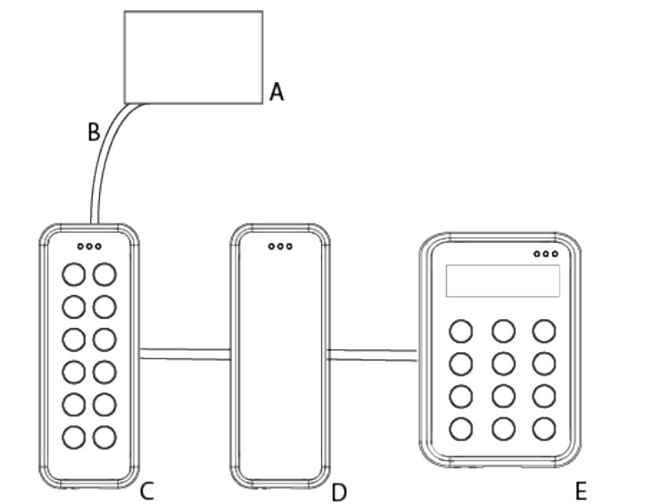

| A | ACTpro 1520e                                              |
|---|-----------------------------------------------------------|
| B | Power and A, B (OSDP)                                     |
| C | Reader 1 (mullion reader with keypad)                     |
| D | Reader 2 (mullion reader)                                 |
| E | Reader 3 (VR40S-MF MIFARE Reader with keypad and display) |

ACTpro 1520e can support both the VR and NGCR readers on the same OSDP bus.

The connection between a reader and an ACTpro 1520e is as follows:

| ACTpro 1520e |   | VRxx-MF |
|--------------|---|---------|
| +12/24 V     | ⃡ | +       |
| OSDP/NET 0V  | ⃡ | -       |
| OSDP/NET A   | ⃡ | A       |
| OSDP/NET B   | ⃡ | B       |

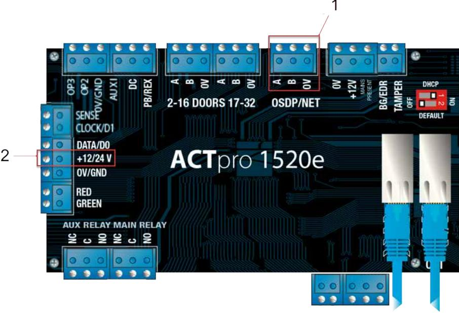

| 1 | A,B,0V  |
|---|---------|
| 2 | +12/24V |

- 1. Connect the cables as shown in the table on the previous page.
- 2. Use this terminal to supply power to the readers.

## **10.2 Setting the OSDP address for the reader**

The ACTpro 1520e controller automatically assigns an address to each reader. Therefore, Jumper 2 should be removed for OSDP operation. The serial number of the reader is used to identify and enrol a reader on the system . The serial number can be found on a sticker on the reverse of the front cover of the reader (bordered in red in the image below).

During installation:

- l Record the 7 digit serial number.
- l Record the door name.
- l Record if a reader is an entry or exit reader.

In the OSDP reader section of ACTEnterprise Software input the following attributes:

- l Name
- l Serial number
- l Direction

| Name          | Main door - Entry reader |   |
|---------------|--------------------------|---|
| Serial Number | 5000001                  | ? |
| Direction     | Entry                    |   |
| Description   |                          |   |

## **10.3 Connecting the reader to ACT in Wiegand mode**

For more detail on connecting the reader to ACT via Wiegand see *Connecting the reader in Wiegand mode* on page 13.

If you are connecting an exit reader in Wiegand mode, you should wire the D0 from the reader to SENSE on the ACTpro 1520e (bordered in red on the image below).

# **11 Connecting the reader to SPC**

The SPC connection to a mullion reader is via Wiegand. For more detail on connecting via Wiegand see *Connecting the reader in Wiegand mode* on page 13.

© Vanderbilt 2018 Data and design subject to change without notice. Supply subject to availability. Document ID: A-100410 Edition date: 21.06.2018

**vanderbiltindustries.com**

@VanderbiltInd Vanderbilt Industries

Issued by **Vanderbilt International Ltd.** Clonshaugh Business and Technology Park Clonshaugh, Dublin D17 KV 84, Ireland

vanderbiltindustries.com/contact