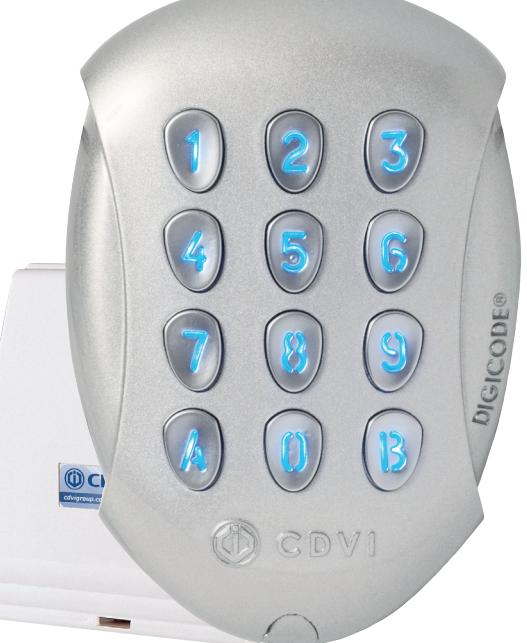
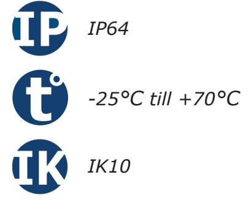
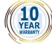
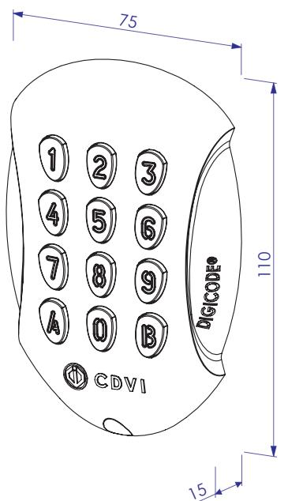
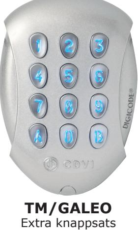
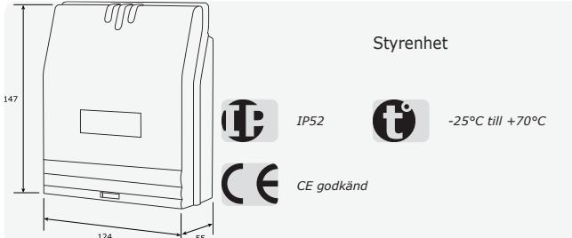
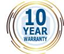

# **Produktblad**

## **Kodlås - GALEO BT**

### **Produktbeskrivning**

Kodlås tillverkat i gjutaluminium för styrning av tre dörrar, inklusive styrbox. All programmering sker via appen MyDigicode sköter man programmering av koder och tidsinställningar etc.

Kodlåset är ett utanpåliggande och delat montage. Elektroniken är inkapslad för att öka vandalskyddet och skydda elektroniken mot vatten, vilket gör att kodlåset kan monteras utomhus, utan väderskydd. Bakgrundsbelysta knappar med justerbar belysningstid.

Kodlåset klarar upp till 100 st valfria fyreller femsiffriga användarkoder. Kodlåset har tre reläutgångar samt ingång för extern tryckknapp.

### **Funktioner**

- Programmeras med app MyDigicode
- Möjlighet att dela ut tillfälliga koder
- Lås upp dörren med telefon/kod
- Tre reläutgångar (3 NO/NC)
- Delat montage för högre säkerhet

### **Teknisk information**

**Material:** Zamak® gjutaluminium **Installation:** Delat montage **Montering:** Utanpåliggande **Bakgrundsbelysning:** Ja **Ljudindikering:** Ja **Antal koder:** Klarar upp till 100 koder **Kodlängd:** 4 eller 5 siffror **Utgångar:** Tre reläutgångar (3 NO/NC) **Max belastning:** 6A/250V~ **Funktioner:** Puls, växlande eller tid (1-99 sek.) **Programmering via app:** Ja **Dimensioner (L x B x H):** 110 x 75 x 15mm **Spänningsmatning:** 12-24Vac eller 12-48Vdc **Strömförbrukning:** 54 till 195mA **Inbyggt EEPROM-minne:** Ja **Kapslingsklass:** IP64 **Temperaturområde:** -25°C till +70°C **Miljötestad:** Saltspray **Vibrationssäkrad:** Ja **Slagtålighet:** IK10

### **Tillbehör**

