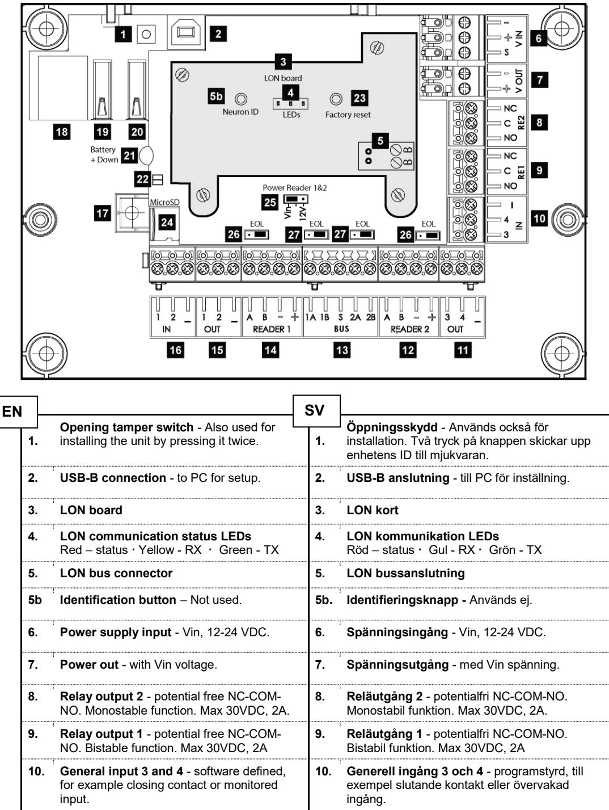
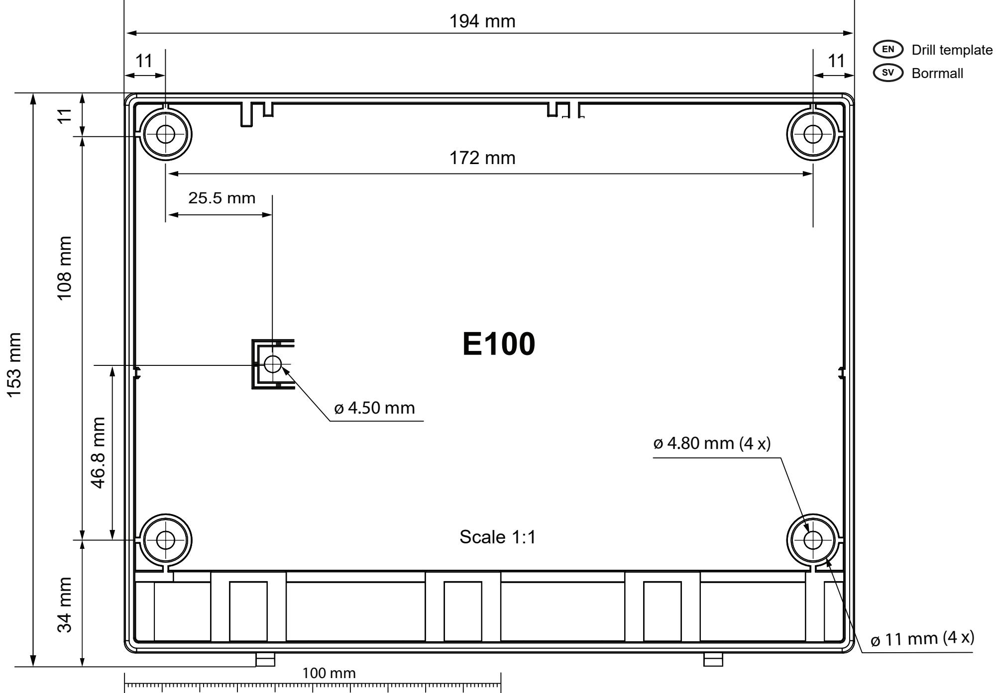

## **Omnis E100 Hardware Technical Information / Teknisk information**

| Neuron ID:   | Serial nr / serie nr: | Date / datum: |
|--------------|--------------------------|---------------|
| Name / namn: | Place / plats:           |               |
| IN 1/2:      | RLY 1:                   |               |
| IN 3/4:      | RLY 2:                   |               |
| OUT 1/2:     | OUT 3/4:                 |               |

| Technical data                                                                                                                                                                                                                                                                                              |                                                                                                            | Teknisk data                                                                                                                                                                                                                                                                                                                 |                                                                                                                |
|-------------------------------------------------------------------------------------------------------------------------------------------------------------------------------------------------------------------------------------------------------------------------------------------------------------|------------------------------------------------------------------------------------------------------------|------------------------------------------------------------------------------------------------------------------------------------------------------------------------------------------------------------------------------------------------------------------------------------------------------------------------------|----------------------------------------------------------------------------------------------------------------|
| Power supply Nominal voltage has margins for transformer tolerances, mains supply variations and interruptions.                                                                                                                                                                              | 20 - 29 V DC 1Vpp ripple                                                                             | Strömförsörjning Nominell spänning har marginaler för transformatortoleranse, nätspännings variationer och avbrott.                                                                                                                                                                                           | 20 - 29 V DC 1Vpp ripple                                                                                 |
| Power consumption Full on represents:  500mA load on high-speed USB connector  100mA load on full speed USB connector  No readers connected  Relays activated  RS485 communication on all ports with EOL resistors  Micro-SD Memory card installed | Without reader Idle: 12V DC: 200 mA 24V DC: 125 mA Full on: 12V DC: 600mA 24V DC: 400 mA | Ström förbrukning Full last representerar:  500mA (5V) last på high-speed USB kontakten  100mA (5V) last på full-speed USB kontakten  Inga läsare anslutna  Reläer aktiverade  RS485 kommunikation på alla portar med EOL motstånd  Micro-SD minneskort anslutet | Exklusive läsare Vila: 12V DC: 200 mA 24V DC: 125 mA Full last: 12V DC: 600mA 24V DC: 400 mA |
| Detector inputs                                                                                                                                                                                                                                                                                             | 4 general inputs.                                                                                          | Ingångar                                                                                                                                                                                                                                                                                                                     | 4 generella ingångar                                                                                           |
| Detector power                                                                                                                                                                                                                                                                                              | 12V DC, max 500mA – shared with 12 V reader current consumption.                                     | Detektor matning                                                                                                                                                                                                                                                                                                          | 12V DC max 500mA - delad med 12V läsarström försörjning.                                              |

| Outputs                                                                                                                                    | 2 relay outputs. Max 30VDC, 2A. One bi-stable, one mono stable. 4 Open-collector outputs, max load 0.5A One power supply output with Vin, max load 2A. | Utgångar                                                                                                                                    | 2 reläutgångar. Max 30VDC, 2A. En bistabil, en monostabil. Fyra öppen-kollektor utgångar, max last 0,5A. En spänningsutgång med Vin, max last 2A. |
|--------------------------------------------------------------------------------------------------------------------------------------------|-----------------------------------------------------------------------------------------------------------------------------------------------------------------------------------------|---------------------------------------------------------------------------------------------------------------------------------------------|---------------------------------------------------------------------------------------------------------------------------------------------------------------------|
| Reader connections An electronic fuse blows when the total current to both reader interfaces exceeds 700 mA. | Two (RS485, Clock-Data or Wiegand) plus Power out. Max 700 mA (jumper in Vin position) Max 200 mA (jumper in 12V position)                                               | Läsar anslutning En elektronisk säkring löser ut när totala strömmen till båda läsargränssnitten överstiger 700 mA. | Två (RS485, Clock-Data eller Wiegand) plus spänning. Max 700 mA (bygel i Vin läge) Max 200 mA (bygel i 12V läge)                                  |
| Battery type                                                                                                                               | CR2032                                                                                                                                                                                  | Batterityp                                                                                                                                  | CR2032                                                                                                                                                              |
| Communication                                                                                                                              | TCP/IP and RS485                                                                                                                                                                        | Kommunikation                                                                                                                               | TCP/IP och RS485                                                                                                                                                    |
| Network cable                                                                                                                              | RB2010 or similar                                                                                                                                                                       | Nätverks kabel                                                                                                                           | RB2010 eller liknande                                                                                                                                               |
| Protocol                                                                                                                                   | Echelon LonTalk                                                                                                                                                                         | Protokoll                                                                                                                                   | Echelon LonTalk                                                                                                                                                     |
| Temperature range                                                                                                                          | - 40°C to +55°C                                                                                                                                                                      | Temperatur område                                                                                                                        | - 40°C till +55°C                                                                                                                                                |
| Dimensions (W x H x D)                                                                                                                  | 201 x 156 x 53 mm                                                                                                                                                                       | Dimensioner (B x H x D)                                                                                                                  | 201 x 156 x 53 mm                                                                                                                                                   |
| Weight                                                                                                                                     | 650 grams                                                                                                                                                                               | Vikt                                                                                                                                        | 650 gram                                                                                                                                                            |
| Tamper switch                                                                                                                              | Opening tamper switch and removal tamper switch                                                                                                                                      | Sabotage kontakt                                                                                                                         | Öppningsskydd och nedrivningsskydd                                                                                                                               |
| Environmental class                                                                                                                     | II, IEC 60839-11-1                                                                                                                                                                      | Miljötålighets klass                                                                                                                     | II, IEC 60839-11-1                                                                                                                                                  |
| Type                                                                                                                                       | B                                                                                                                                                                                       |                                                                                                                                             | B                                                                                                                                                                   |
| Designed for EN 50131-1 Security Grade 3                                                                                             |                                                                                                                                                                                         | EN 50131-1                                                                                                                                  | Designad för Larmklass 3                                                                                                                                      |

© Vanderbilt International (IRL) Ltd Document no. A-100409-3 Edition 2018-04-09 Document version: 3

| 11. | Open-collector output 3 and 4 - software defined.                                                                                                                                                                                                                   | 11. | Öppen kollektor utgång 3 och 4 - programstyrd.                                                                                                                                                                                                                    |
|-----|---------------------------------------------------------------------------------------------------------------------------------------------------------------------------------------------------------------------------------------------------------------------------|-----|----------------------------------------------------------------------------------------------------------------------------------------------------------------------------------------------------------------------------------------------------------------------|
| 12. | Reader 1 or 2 bus connection plus power - max 700mA (Vin) or 200mA (12V) in total for both outputs.                                                                                                                                                              | 12. | Läsaranslutning 1 eller 2 plus spänning - max 700mA (Vin) eller 200mA (12V) totalt för båda utgångarna.                                                                                                                                                        |
| 13. | RS485 BUS - see also 27.                                                                                                                                                                                                                                               | 13. | RS485 BUS - se även 27.                                                                                                                                                                                                                                           |
| 14. | LED Reader 1 or 2 bus connection plus power - max 700mA (Vin) or 200mA (12V) in total for both outputs.                                                                                                                                                          | 14. | Läsaranslutning 1 eller 2 plus spänning - max 700mA (Vin) eller 200mA (12V) totalt för båda utgångarna.                                                                                                                                                        |
| 15. | Open-collector output 1 and 2 - software defined.                                                                                                                                                                                                                   | 15. | Öppen kollektor utgång 1 och 2 - programstyrd.                                                                                                                                                                                                                    |
| 16. | General input 1 and 2 - software defined, for example closing contact or monitored input.                                                                                                                                                                        | 16. | Generell ingång 1 och 2 - programstyrd, till exempel slutande kontakt eller övervakad ingång.                                                                                                                                                               |
| 17. | screw must be mounted Removal tamper - to fulfill the tamper feature.                                                                                                                                                                                               | 17. | Bortbrytningsskydd. - Skruv måste monteras för att uppfylla funktionen.                                                                                                                                                                                        |
| 18. | Ethernet port RJ45 (network).                                                                                                                                                                                                                                             | 18. | Ethernet port RJ45 (nätverk).                                                                                                                                                                                                                                        |
| 19. | USB-A Hi-speed – alarm transmitter port                                                                                                                                                                                                                             | 19. | USB-A Hi-speed – port för larmsändare                                                                                                                                                                                                                          |
| 20. | USB-A Full-speed – alarm transmitter port                                                                                                                                                                                                                           | 20. | USB-A Full-speed – port för larmsändare                                                                                                                                                                                                                           |
| 21. | Battery socket - type CR2032. Note that the supplied battery should be mounted with the plus (+) downwards.                                                                                                                                                      | 21. | Batterihållare - typ CR2032. Notera att medföljande batteri skall monteras med plus (+) nedåt.                                                                                                                                                              |
| 22. | LED indicator:  Constant red: Booting, no IP-address  Red blink: Not installed  Constant green: Installed, not connected to server computer  Green blink: Installed and connected to host computer  Constant green and red: Special login mode. | 22. | LED indikator:  Konstant röd: Uppstart, saknar IP adress  Röd blink: Ej installerad  Konstant grön: Installerad, inte ansluten mot värddator  Grön blink: Installerad och ansluten mot värddator  Konstant grön och röd: Speciell inloggning. |
| 23. | Reset button – used for identifying the internal node ID.                                                                                                                                                                                                           | 23. | Återställningsknapp – används för att identifiera den interna noden.                                                                                                                                                                                           |
| 24. | for Micro-SD card slot, no card is supplied – future use.                                                                                                                                                                                                           | 24. | Micro-SD korthållare, inget kort levereras - framtida användning.                                                                                                                                                                                                 |
| 25. | Power Reader 1 and 2, jumper - voltage output for reader, Vin or 12V DC. Default Vin.                                                                                                                                                                            | 25. | Power Reader 1 och 2, byglar - spänningsutgång för läsare, Vin or 12V DC. Standard Vin.                                                                                                                                                                        |
| 26. | EOL Reader 1 och 2, jumper - End of line resistor for reader 1 and 2. Default ON.                                                                                                                                                                                      | 26. | EOL läsare 1 och 2, byglar - End Of Line motstånd för läsare 1 och 2. Standard ON.                                                                                                                                                                          |
| 27. | EOL BUS 1 and 2, jumpers - End of Line resistor. Default ON.                                                                                                                                                                                                        | 27. | EOL BUS 1 and 2, byglar - End Of Line motstånd. Standard ON.                                                                                                                                                                                                   |

© Vanderbilt International (IRL) Ltd Document no. A-100409-3_en_sv Edition 2018-04-09 Document version: 3

