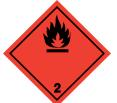

# SÄKERHETSDATABLAD ALBEDO 100 PERMANENT METALLIC

I enlighet med Förordning (EG) Nr 1907/2006, Bilaga II, ändrad genom Förordning (EG) Nr 453/2010

#### AVSNITT 1: Namnet på ämnet/blandningen och bolaget/företaget

| 1.1. Produktbeteckning                         |                                                                                                                      |
|------------------------------------------------|----------------------------------------------------------------------------------------------------------------------|
| Produktnamn                                    | ALBEDO 100 PERMANENT METALLIC                                                                                        |
| Produktnummer                                  | 35158, 35162                                                                                                         |
|                                                | 1.2. Relevanta identifierade användningar av ämnet eller blandningen och användningar som det avråds från            |
| Identifierade användningar                     | Reflekterande spray                                                                                                  |
|                                                | 1.3. Närmare upplysningar om den som tillhandahåller säkerhetsdatablad                                               |
| Leverantör                                     |                                                                                                                      |
|                                                | TrackInvent AB                                                                                                       |
|                                                | Anckargripsgatan 3                                                                                                   |
|                                                | SE-211 19 Malmo                                                                                                      |
|                                                | SWEDEN                                                                                                               |
|                                                | +46(0)40 – 23 13 10 info@albedo100.se                                                                             |
|                                                |                                                                                                                      |
| 1.4. Telefonnummer för nödsituationer          |                                                                                                                      |
| Nationellt telefonnummer för nödsituationer | Giftinformationen 010-456 67 00. Vid akuta fall, ring 112, begär giftinformation.                                    |
| AVSNITT 2: Farliga egenskaper                  |                                                                                                                      |
| 2.1. Klassificering av ämnet eller blandningen |                                                                                                                      |
| Klassificering (EC 1272/2008)                  |                                                                                                                      |
|                                                |                                                                                                                      |
| Fysikaliska faror                              | Aerosol 1 - H222, H229                                                                                               |
| Hälsofaror                                     | Ej Klassificerad                                                                                                     |
| Miljöfaror                                     | Ej Klassificerad                                                                                                     |
| 2.2. Märkningsuppgifter                        |                                                                                                                      |
| Piktogram                                      |                                                                                                                      |
|                                                |                                                                                                                      |
| Signalord                                      | Fara                                                                                                                 |
| Faroangivelser                                 | H222 Extremt brandfarlig aerosol. H229 Tryckbehållare: Kan sprängas vid uppvärmning.                              |
| Skyddsangivelser                               | P210 Får inte utsättas för värme, heta ytor, gnistor, öppna lågor och andra antändningskällor. Rökning förbjuden. |
|                                                | P211 Spreja inte över öppen låga eller andra antändningskällor.                                                      |
|                                                | P251 Får inte punkteras eller brännas, gäller även tömd behållare.                                                   |
|                                                | P410+P412 Skyddas från solljus. Får inte utsättas för temperaturer över 50°C/122°F.                                  |
|                                                | P102 Förvaras oåtkomligt för barn.                                                                                   |
| Kompletterande information                     | EUH066 Upprepad kontakt kan ge torr hud eller hudsprickor.                                                           |
| på etiketten                                   |                                                                                                                      |
| 2.3. Andra faror                               |                                                                                                                      |

Produkten innehåller inte något ämne som är klassificerat som PBT eller vPvB. Innehåller: Isobutan.

| AVSNITT 3: Sammansättning/information om beståndsdelar                           |                                                                       |                                                                                                  |  |  |
|----------------------------------------------------------------------------------|-----------------------------------------------------------------------|--------------------------------------------------------------------------------------------------|--|--|
| 3.2. Blandningar                                                                 |                                                                       |                                                                                                  |  |  |
| DIMETYLETER                                                                      |                                                                       | 35-50%                                                                                           |  |  |
| CAS-nummer: 115-10-6                                                             | EG-nummer: 204-065-8                                                  | REACH-registreringsnummer: 01- 2119472128-37                                                  |  |  |
| Klassificering Flam. Gas 1 - H220 Press. Gas, Compressed - H280            |                                                                       |                                                                                                  |  |  |
| BUTYLACETAT                                                                      |                                                                       | 15-24.9%                                                                                         |  |  |
| CAS-nummer: 123-86-4                                                             | EG-nummer: 204-658-1                                                  | REACH-registreringsnummer: 01- 2119485493-29-0000                                             |  |  |
| Klassificering Flam. Liq. 3 - H226 STOT SE 3 - H336                        |                                                                       |                                                                                                  |  |  |
| METYLETYLKETON                                                                   |                                                                       | 0.1-0.99%                                                                                        |  |  |
| CAS-nummer: 78-93-3                                                              | EG-nummer: 201-159-0                                                  |                                                                                                  |  |  |
| Klassificering Flam. Liq. 2 - H225 Eye Irrit. 2 - H319 STOT SE 3 - H336 |                                                                       |                                                                                                  |  |  |
| Alla faroangivelser anges i klartext i avsnitt 16.                               |                                                                       |                                                                                                  |  |  |
| AVSNITT 4: Åtgärder vid första hjälpen                                           |                                                                       |                                                                                                  |  |  |
| 4.1. Beskrivning av åtgärder vid första hjälpen                                  |                                                                       |                                                                                                  |  |  |
| Generell information                                                             | Sök läkarhjälp om besvär kvarstår.                                    |                                                                                                  |  |  |
| Inandning                                                                        | underlättar andningen.                                                | Flytta den skadade personen till frisk luft och håll denne varm och i stillhet i en position som |  |  |
| Förtäring                                                                        | Drick ett par glas vatten eller mjölk. Framkalla inte kräkning.       |                                                                                                  |  |  |
| Hudkontakt                                                                       | Tvätta huden noggrant med tvål och vatten.                            |                                                                                                  |  |  |
| Kontakt med ögonen                                                               | Skölj med vatten. Sök läkarhjälp om besvär kvarstår.                  |                                                                                                  |  |  |
|                                                                                  | 4.2. De viktigaste symptomen och effekterna, både akuta och fördröjda |                                                                                                  |  |  |

| Generell information | Lösningsmedelsmissbruk kan leda till dödsfall. |
|----------------------|------------------------------------------------|
|                      |                                                |

- Inandning Ångor kan orsaka huvudvärk, trötthet, yrsel och illamående.
- Förtäring Kan orsaka illamående, huvudvärk, yrsel och förgiftning.
- Hudkontakt Upprepad kontakt kan ge torr hud eller hudsprickor.
- Kontakt med ögonen Kan orsaka tillfällig ögonirritation.
- 4.3. Angivande av omedelbar medicinsk behandling och särskild behandling som eventuellt krävs

| Anmärkningar för läkaren                                  | Inga specifika rekommendationer.                                                                                                                |  |
|-----------------------------------------------------------|-------------------------------------------------------------------------------------------------------------------------------------------------|--|
| AVSNITT 5: Brandbekämpningsåtgärder                       |                                                                                                                                                 |  |
| 5.1. Släckmedel                                           |                                                                                                                                                 |  |
| Lämpliga släckmedel                                       | Släck med skum, koldioxid eller pulver.                                                                                                         |  |
|                                                           | 5.2. Särskilda faror som ämnet eller blandningen kan medföra                                                                                    |  |
| Särskilda faror                                           | Behållare kan brisera eller explodera vid upphettning, beroende på häftig tryckstegring. Extremt brandfarligt.                               |  |
| 5.3. Råd till brandbekämpningspersonal                    |                                                                                                                                                 |  |
| Skyddsåtgärder vid brandbekämpning                     | Behållare i närheten av brand ska flyttas eller kylas med vatten.                                                                               |  |
| Särskild skyddsutrustning för brandbekämpningspersonal | Använd kemskyddsdräkt. Använd andningsapparat med lufttillförsel (SCBA) och lämpliga skyddskläder.                                           |  |
| AVSNITT 6: Åtgärder vid oavsiktliga utsläpp               |                                                                                                                                                 |  |
|                                                           | 6.1. Personliga skyddsåtgärder, skyddsutrustning och åtgärder vid nödsituationer                                                                |  |
| Personliga skyddsåtgärder                                 | För personligt skydd, se Avsnitt 8.                                                                                                             |  |
| 6.2. Miljöskyddsåtgärder                                  |                                                                                                                                                 |  |
| Miljöskyddsåtgärder                                       | Undvik att spill eller avrinningsvatten kommer ned i avlopp, avloppssystem eller vattendrag.                                                    |  |
| 6.3. Metoder och material för inneslutning och sanering   |                                                                                                                                                 |  |
| Metoder för sanering                                      | Stora spill: Valla in och absorbera spill med sand, jord eller annat icke brännbart material. Små spill: Torka bort med papper eller textil. |  |
| 6.4. Hänvisning till andra avsnitt                        |                                                                                                                                                 |  |
| Hänvisning till andra avsnitt                             | För personligt skydd, se Avsnitt 8. Angående avfallshantering, se punkt 13.                                                                     |  |
| AVSNITT 7: Hantering och lagring                          |                                                                                                                                                 |  |
| 7.1. Skyddsåtgärder för säker hantering                   |                                                                                                                                                 |  |
| Skyddsåtgärder vid användning                          | Får inte utsättas för värme, gnistor och öppen låga. Skyddas mot direkt solljus. Ät inte, drick inte eller rök inte under hanteringen.       |  |
|                                                           | 7.2. Förhållanden för säker lagring, inklusive eventuell oförenlighet                                                                           |  |
| Skyddsåtgärder vid lagring                                | Aerosolburkar: Får inte utsättas för direkt solljus eller temperaturer över 50°C. Förpackningen förvaras torrt.                              |  |
| 7.3. Specifik slutanvändning                              |                                                                                                                                                 |  |
| Specifik slutanvändning                                   | De identifierade användningarna för produkten finns beskrivna i Avsnitt 1.2.                                                                    |  |
| AVSNITT 8: Begränsning av exponeringen/personligt skydd   |                                                                                                                                                 |  |
| 8.1. Kontrollparametrar                                   |                                                                                                                                                 |  |
| Gränsvärden för exponering på arbetsplatsen               |                                                                                                                                                 |  |

#### DIMETYLETER

Nivågränsvärde (8 timmar, NGV): AFS 500 ppm 950 mg/m³ Korttidsvärde (15 minuter, KTV): AFS 800 ppm 1500 mg/m³

### BUTYLACETAT

Nivågränsvärde (8 timmar, NGV): AFS 100 ppm 500 mg/m³ Korttidsvärde (15 minuter, KTV): AFS 150 ppm 700 mg/m³

### METYLETYLKETON

Nivågränsvärde (8 timmar NGV): HGV 50 ppm 150 mg/m³ Korttidsgränsvärde (15 minuter KGV): HGV 300 ppm 900 mg/m³ AFS = Arbetsmiljöverkets Författningssamling. HGV = Hygieniskt gränsvärde

### DIMETYLETER (CAS: 115-10-6)

| DNEL | Näringsverksamhet - Inandning; Långtids- systemiska effekter: 1894 mg/m³ Konsument - Inandning; Långtids- systemiska effekter: 471 mg/m³ |
|------|---------------------------------------------------------------------------------------------------------------------------------------------|
| PNEC | - Sötvatten; 0,155 mg/l - Saltvatten; 0,016 mg/l                                                                                         |
|      | - Sediment (Sötvatten); 0,681 mg/kg                                                                                                         |
|      | - Sediment (Havsvatten); 0,069 mg/kg                                                                                                        |
|      | - Jord; 0,045 mg/kg                                                                                                                         |
|      | BUTYLACETAT (CAS: 123-86-4)                                                                                                                 |
| DNEL | Industri - Inandning; Korttids- systemiska effekter: 960 mg/m³                                                                              |
|      | Industri - Inandning; Korttids- lokala effekter: 960 mg/m³                                                                                  |
|      | Industri - Inandning; Långtids- systemiska effekter: 480 mg/m³                                                                              |
|      | Industri - Inandning; Långtids- lokala effekter: 480 mg/m³                                                                                  |
|      | Konsument - Inandning; Korttids- systemiska effekter: 859.7 mg/m³                                                                           |
|      | Konsument - Inandning; Korttids- lokala effekter: 859.7 mg/m³                                                                               |
|      | Konsument - Inandning; Långtids- systemiska effekter: 102.34 mg/m³                                                                          |
|      | Konsument - Inandning; Långtids- lokala effekter: 102.34 mg/m³                                                                              |
| PNEC | - Sötvatten; 0.18 mg/l                                                                                                                      |
|      | - Saltvatten; 0.018 mg/l                                                                                                                    |
|      | - Successiv frisättning; 0.36 mg/l                                                                                                          |
|      | - STP; 35.6 mg/l                                                                                                                            |
|      | - Sediment (Sötvatten); 0.981 mg/kg                                                                                                         |
|      | - Sediment (Havsvatten); 0.0981 mg/kg                                                                                                       |
|      | - Jord; 0.0903 mg/kg                                                                                                                        |

### 8.2. Begränsning av exponeringen

| Skyddsutrustning                      |                                                                                                                                                               |
|---------------------------------------|---------------------------------------------------------------------------------------------------------------------------------------------------------------|
| Lämpliga tekniska kontrollåtgärder | All hantering ska bara ske i välventilerade utrymmen.                                                                                                         |
| Ögonskydd/ansiktsskydd                | Ögonskydd som uppfyller en godkänd standard ska användas om en riskbedömning indikerar att kontakt med ögonen är möjlig.                                   |
| Handskydd                             | Kemikalie-resistenta, ogenomträngliga skyddshandskar som ska uppfylla en godkänd standard ska användas om en riskbedömning visar att hudkontakt är möjlig. |
|                                       | Annat skydd för hud och kropp Använd lämplig skyddsutrustning vid långvarig exponering och/eller hög koncentration av ångor, sprej eller dimma.            |
| Hygienåtgärder                        | Tvätta händerna vid slutet på varje arbetspass och innan måltider, rökning och toalettbesök.                                                                  |

Andningsskydd Ingen särskild rekommendation angiven men skyddsfilter kan behövas mot organiska ångor eller damm.

### AVSNITT 9: Fysikaliska och kemiska egenskaper

| 9.1. Information om grundläggande fysikaliska och kemiska egenskaper |                                             |  |
|----------------------------------------------------------------------|---------------------------------------------|--|
| Utseende                                                             | Aerosol.                                    |  |
| Färg                                                                 | Färglös.                                    |  |
| Lukt                                                                 | Svag.                                       |  |
| Lukttröskel                                                          | Ej fastställt.                              |  |
| pH                                                                   | Ej fastställt.                              |  |
| Smältpunkt                                                           | Ej fastställt.                              |  |
| Initial kokpunkt och kokpunktsintervall                           | Ej fastställt.                              |  |
| Flampunkt                                                            | Tekniskt omöjligt att ta fram uppgifter.    |  |
| Avdunstningshastighet                                                | Ej fastställt.                              |  |
| Avdunstningsfaktor                                                   | Ej fastställt.                              |  |
| Brandfarlighet (fast form, gas)                                      | Ej fastställt.                              |  |
| Övre/undre brännbarhetsgräns eller explosionsgräns             | Ej fastställt.                              |  |
| Annan brandfarlighet                                                 | Ej fastställt.                              |  |
| Ångtryck                                                             | Ej fastställt.                              |  |
| Ångdensitet                                                          | Ej fastställt.                              |  |
| Relativ densitet                                                     | Ej fastställt.                              |  |
| Bulkdensitet                                                         | Ej fastställt.                              |  |
| Löslighet                                                            | Inga specifika testdata finns tillgängliga. |  |
| Fördelningskoefficient                                               | Ej fastställt.                              |  |
| Självantändningstemperatur                                           | Ej fastställt.                              |  |
| Sönderfallstemperatur                                                | Ej fastställt.                              |  |
| Viskositet                                                           | Ej fastställt.                              |  |
| Explosiva egenskaper                                                 | Ej fastställt.                              |  |
| Explosiv under inverkan av låga                                   | Ja                                          |  |
| Oxiderande egenskaper                                                | Ej fastställt.                              |  |
| 9.2. Annan information                                               |                                             |  |
| Annan information                                                    | Inte relevant.                              |  |
| Brytningsindex                                                       | Ej fastställt.                              |  |
| Partikelstorlek                                                      | Ej fastställt.                              |  |

| Molekylvikt                                                                    | Ej fastställt.                                                                                                                                   |  |
|--------------------------------------------------------------------------------|--------------------------------------------------------------------------------------------------------------------------------------------------|--|
| Flyktighet                                                                     | Mycket flyktig.                                                                                                                                  |  |
| Mättnadskoncentration                                                          | Ej fastställt.                                                                                                                                   |  |
| Kritisk temperatur                                                             | Ej fastställt.                                                                                                                                   |  |
| Flyktig organisk förening                                                      | Ingen information krävs.                                                                                                                         |  |
| AVSNITT 10: Stabilitet och reaktivitet                                         |                                                                                                                                                  |  |
| 10.1. Reaktivitet                                                              |                                                                                                                                                  |  |
| Reaktivitet                                                                    | Det finns inga kända reaktivitetsdata associerade med produkten.                                                                                 |  |
| 10.2. Kemisk stabilitet                                                        |                                                                                                                                                  |  |
| Stabilitet                                                                     | Stabil vid normal omgivningstemperatur och avsedd användning.                                                                                    |  |
| 10.3. Risken för farliga reaktioner                                            |                                                                                                                                                  |  |
| Risken för farliga reaktioner                                                  | Okänd.                                                                                                                                           |  |
| 10.4. Förhållanden som ska undvikas                                            |                                                                                                                                                  |  |
| Förhållanden som ska undvikas                                               | Undvik värme, lågor och andra antändningskällor.                                                                                                 |  |
| 10.5. Oförenliga material                                                      |                                                                                                                                                  |  |
| Material som ska undvikas                                                      | Det är inte troligt att något specifikt material eller grupp av material kommer att reagera med produkten så att en farlig situation uppstår. |  |
| 10.6. Farliga sönderdelningsprodukter                                          |                                                                                                                                                  |  |
|                                                                                |                                                                                                                                                  |  |
| Farliga sönderdelningsprodukter                                             | Okänd.                                                                                                                                           |  |
| AVSNITT 11: Toxikologisk information                                           |                                                                                                                                                  |  |
| 11.1. Information om de toxikologiska effekterna                               |                                                                                                                                                  |  |
| Toxikologiska effekter                                                         | Ingen data finns tillgänglig för produkten som sådan.                                                                                            |  |
| Akut toxicitet - oral Anmärkningar (oralt LD₅₀)                             | Kriterierna för klassificering kan på grundval av tillgängliga data inte anses vara uppfyllda.                                                   |  |
| Akut toxicitet - dermalt Anmärkningar (dermalt LD₅₀)                        | Kriterierna för klassificering kan på grundval av tillgängliga data inte anses vara uppfyllda.                                                   |  |
| Akut toxicitet - inandning Anmärkningar (inandning LC₅₀)                 | Kriterierna för klassificering kan på grundval av tillgängliga data inte anses vara uppfyllda.                                                   |  |
| Frätande/irriterande på huden Frätande/irriterande på huden                 | Kriterierna för klassificering kan på grundval av tillgängliga data inte anses vara uppfyllda.                                                   |  |
| Allvarlig ögonskada/ögonirritation Allvarlig                                | Kriterierna för klassificering kan på grundval av tillgängliga data inte anses vara uppfyllda.                                                   |  |
| ögonskada/ögonirritation Luftvägssensibilisering Luftvägssensibilisering | Kriterierna för klassificering kan på grundval av tillgängliga data inte anses vara uppfyllda.                                                   |  |

| Hudsensibilisering                                               | Kriterierna för klassificering kan på grundval av tillgängliga data inte anses vara uppfyllda.                                                                                                                                                               |
|------------------------------------------------------------------|--------------------------------------------------------------------------------------------------------------------------------------------------------------------------------------------------------------------------------------------------------------|
| Mutagenitet i könsceller Genotoxicitet - in vitro             | Innehåller inga ämnen som är känt mutagena.                                                                                                                                                                                                                  |
| Cancerogenitet Cancerogenitet                                 | Innehåller inte något ämne som är känt cancerframkallande.                                                                                                                                                                                                   |
| Reproduktionstoxicitet Reproduktionstoxicitet - fertilitet | Innehåller inget ämne som är känt reproduktionstoxiskt.                                                                                                                                                                                                      |
| Specifik organtoxicitet – enstaka exponering                     |                                                                                                                                                                                                                                                              |
| STOT - enstaka exponering                                        | Kriterierna för klassificering kan på grundval av tillgängliga data inte anses vara uppfyllda.                                                                                                                                                               |
| Specifik organtoxicitet – upprepad exponering                    |                                                                                                                                                                                                                                                              |
| STOT - upprepad exponering                                       | Kriterierna för klassificering kan på grundval av tillgängliga data inte anses vara uppfyllda.                                                                                                                                                               |
| Fara vid aspiration Fara vid aspiration                       | Inte relevant.                                                                                                                                                                                                                                               |
| Generell information                                             | Långvarig och upprepad kontakt med lösningsmedel över en lång period kan leda till bestående hjärtbesvär.                                                                                                                                                 |
| Inandning                                                        | Ångor kan ha en narkotisk effekt. Symptom efter överexponering kan inkludera följande: Huvudvärk. Trötthet. Yrsel. Illamående, kräkning. Kan orsaka luftvägsirritation.                                                                                   |
| Förtäring                                                        | Kan orsaka irritation. Symptom efter överexponering kan inkludera följande: Magsmärta. Illamående, kräkning. Diarré.                                                                                                                                      |
| Hudkontakt                                                       | Upprepad kontakt kan ge torr hud eller hudsprickor.                                                                                                                                                                                                          |
| Kontakt med ögonen                                               | Kan orsaka tillfällig ögonirritation.                                                                                                                                                                                                                        |
| Akuta och kroniska hälsofaror                                    | Långvarig och upprepad kontakt med lösningsmedel över en lång period kan leda till bestående hjärtbesvär. Långvarig eller upprepad exponering för ångor i höga koncentrationer kan orsaka följande negativa effekter: Illamående, kräkning. Huvudvärk. |

### DIMETYLETER

| Inte tillämpligt.                   |
|-------------------------------------|
|                                     |
| Inte tillämpligt.                   |
| Risk för köldskador. BUTYLACETAT |
|                                     |
| 10 768,0                            |
| Råtta                               |
|                                     |

| Akut toxicitet - dermalt                      |          |                |  |
|-----------------------------------------------|----------|----------------|--|
| Akut toxicitet dermalt (LD₅₀ mg/kg)        | 17 600,0 |                |  |
| Djurslag                                      | Kanin    |                |  |
| Akut toxicitet - inandning                    |          |                |  |
| Akut toxicitet inandning (LC₅₀ ångor mg/l) | 40,0     |                |  |
| Djurslag                                      | Råtta    |                |  |
| ATE inandning (ångor mg/l)                 | 40,0     |                |  |
|                                               |          | METYLETYLKETON |  |
| Akut toxicitet - oral                         |          |                |  |
| Akut toxicitet oral (LD₅₀ mg/kg)           | 2 000,0  |                |  |
| Djurslag                                      | Råtta    |                |  |
| Akut toxicitet - dermalt                      |          |                |  |
| Akut toxicitet dermalt (LD₅₀ mg/kg)        | 5 000,0  |                |  |
| Djurslag                                      | Kanin    |                |  |
| Akut toxicitet - inandning                    |          |                |  |
| Akut toxicitet inandning (LC₅₀ ångor mg/l) | 9,0      |                |  |
| Djurslag                                      | Råtta    |                |  |
| ATE inandning (ångor mg/l)                 | 9,0      |                |  |
|                                               |          |                |  |

### AVSNITT 12: Ekologisk information

Ekotoxicitet Det finns inga ekotoxicitetsdata för produkten.

#### 12.1. Toxicitet

Toxicitet Det finns inga data om produkten som sådan.

### DIMETYLETER

| Akut toxicitet - fisk                                  | LC50, 96 timmar: > 4.1 mg/l, Poecilia reticulata (Guppy)                   |
|--------------------------------------------------------|----------------------------------------------------------------------------|
| Akut toxicitet - vattenlevande ryggradslösa djur | EC₅₀, 48 timmar: > 4.4 mg/l, Daphnia magna                                 |
|                                                        | Akut toxicitet - vattenväxter EC₅₀, 96 timmar: 154.9 mg/l, Sötvattensalger |

#### BUTYLACETAT

Akut toxicitet - fisk LC50, 96 timmar: 18 mg/l, Pimephales promelas (Knölskallelöja)

Akut toxicitet vattenlevande ryggradslösa djur EC₅₀, 48 timmar: 10-100 mg/l, Daphnia magna Akut toxicitet - vattenväxter IC₅₀, 72 timmar: 674,7 mg/l, Scenedesmus subspicatus METYLETYLKETON Akut toxicitet - fisk LC50, 96 timmar: 400 mg/l, Lepomis macrochirus (Blågälad solabborre) Akut toxicitet vattenlevande ryggradslösa djur EC₅₀, 48 timmar: >520 mg/l, Daphnia magna Akut toxicitet - vattenväxter IC₅₀, 72 timmar: 110 mg/l, Saltvattensalger 12.2. Persistens och nedbrytbarhet Persistens och nedbrytbarhet Det finns inga data gällande nedbrytbarheten av produkten. DIMETYLETER Persistens och nedbrytbarhet Produkten är inte biologiskt lättnedbrytbar. BUTYLACETAT Biologisk nedbrytning - Degradation (%) 98: 28 dagar OECD 301C 12.3. Bioackumuleringsförmåga Bioackumuleringsförmåga Inga data tillgängliga om bioackumulering. Fördelningskoefficient Ej fastställt. DIMETYLETER Bioackumuleringsförmåga Produkten innehåller inte något ämne som förväntas vara bioackumulerande. BUTYLACETAT Bioackumuleringsförmåga BCF: 14, Fördelningskoefficient log Pow: 1,81 METYLETYLKETON Fördelningskoefficient log Pow: 0,68 12.4. Rörligheten i jord Rörlighet Ingen information tillgänglig DIMETYLETER Adsorptions/desorptionsko Vatten - Koc: ~ 7.759 @ °C

12.5. Resultat av PBT- och vPvB-bedömningen

efficient

ICAO klass/riskgrupp 2.1

# ALBEDO 100 PERMANENT METALLIC

Resultat av PBT- och vPvBbedömningen Produkten innehåller inte något ämne som är klassificerat som PBT eller vPvB.

| 12.6. Andra skadliga effekter             |                                                                                                                                                                                                                                                                                                                                      |  |  |
|-------------------------------------------|--------------------------------------------------------------------------------------------------------------------------------------------------------------------------------------------------------------------------------------------------------------------------------------------------------------------------------------|--|--|
| Andra skadliga effekter                   | Ingen information krävs.                                                                                                                                                                                                                                                                                                             |  |  |
| AVSNITT 13: Avfallshantering              |                                                                                                                                                                                                                                                                                                                                      |  |  |
| 13.1. Avfallsbehandlingsmetoder           |                                                                                                                                                                                                                                                                                                                                      |  |  |
| Generell information                      | Tillverkaren av denna produkt uppfyller kraven om producentansvar enligt miljöbalken och dess förordning om producentansvar (SFS 2014:1073) genom att betala förpackningsavgift för omhändertagande och återvinning av förpackningsavfallet.                                                                                   |  |  |
| Avfallshanteringsmetoder                  | Plastlock och ventilknapp sorteras som hårdplast. Pystomma aerosoler sorteras som metallavfall. Ej tömda aerosolburkar sorteras som FARLIGT AVFALL och skall tas om hand om enligt Avfallsförordningen (SFS 2011:927). Kontakta kommunens miljöförvaltning för lokala bestämmelser.                                         |  |  |
| Avfallsslag                               | Ej tömda förpackningar: Avfallskod 14 06 03* Tomma förpackningar: Avfallskod 15 01 04                                                                                                                                                                                                                                             |  |  |
| AVSNITT 14: Transportinformation          |                                                                                                                                                                                                                                                                                                                                      |  |  |
| Generell                                  | Aerosoler får transporteras på väg (ADR) som begränsad mängd ( 1L ) om varje kolli väger högst 30 kg i kartong eller 20 kg på brickor med sträck- eller krympfilm. Varje kolli skall märkas med en kvadrat, ställt på ett hörn (diamantformad), den övre och undre delen skall vara svart, med en sidlängd av minst 100 mm. |  |  |
| 14.1. UN-nummer                           |                                                                                                                                                                                                                                                                                                                                      |  |  |
| UN Nr. (ADR/RID)                          | 1950                                                                                                                                                                                                                                                                                                                                 |  |  |
| UN Nr. (IMDG)                             | 1950                                                                                                                                                                                                                                                                                                                                 |  |  |
| UN Nr. (ICAO)                             | 1950                                                                                                                                                                                                                                                                                                                                 |  |  |
| UN Nr. (ADN)                              | 1950                                                                                                                                                                                                                                                                                                                                 |  |  |
| 14.2. Officiell transportbenämning        |                                                                                                                                                                                                                                                                                                                                      |  |  |
| Officiell transportbenämning (ADR/RID) | AEROSOLS                                                                                                                                                                                                                                                                                                                             |  |  |
| Officiell transportbenämning (IMDG)    | AEROSOLS                                                                                                                                                                                                                                                                                                                             |  |  |
| Officiell transportbenämning (ICAO)    | AEROSOLS                                                                                                                                                                                                                                                                                                                             |  |  |
| Officiell transportbenämning (ADN)     | AEROSOLS                                                                                                                                                                                                                                                                                                                             |  |  |
| 14.3. Faroklass för transport             |                                                                                                                                                                                                                                                                                                                                      |  |  |
| ADR/RID klass                             | 2.1                                                                                                                                                                                                                                                                                                                                  |  |  |
| ADR/RID klassificeringskod                | 5F                                                                                                                                                                                                                                                                                                                                   |  |  |
| ADR/RID etikett                           | 2.1                                                                                                                                                                                                                                                                                                                                  |  |  |
| IMDG klass                                | 2.1                                                                                                                                                                                                                                                                                                                                  |  |  |

ADN klass 2.1

#### Transportetiketter

### 14.4. Förpackningsgrupp

Inte tillämpligt.

### 14.5. Miljöfaror

Miljöfarligt ämne/vattenförorenande ämne Nej.

| 14.6. Särskilda skyddsåtgärder |          |  |
|--------------------------------|----------|--|
| EmS                            | F-D, S-U |  |
| ADR transportkategori          | 2        |  |
| Tunnelrestriktionskod          | (D)      |  |

### 14.7. Bulktransport enligt bilaga II till MARPOL 73/78 och IBC-koden

#### Bulktransport enligt bilaga II till MARPOL 73/78 och IBCkoden Inte relevant.

#### AVSNITT 15: Gällande föreskrifter

### 15.1. Föreskrifter/lagstiftning om ämnet eller blandningen när det gäller säkerhet, hälsa och miljö

| Nationella föreskrifter | Myndigheten för samhällsskydd och beredskaps föreskrifter om aerosolbehållare: MSBFS 2014:1 AFS 2015:7 Arbetsmiljöverkets författningssamling om Hygieniska Gränsvärden             |
|-------------------------|-------------------------------------------------------------------------------------------------------------------------------------------------------------------------------------------|
| EU-förordning           | Europaparlamentets och Rådets Förordning (EG) nr 1907/2006 av den 18 december 2006 om registrering, utvärdering, godkännande och begränsning av kemikalier (REACH) (med ändringar). |
|                         | Europaparlamentets och Rådets Förordning (EG) nr 1272/2008 av den 16 december 2008 om                                                                                                     |
|                         | klassificering, märkning och förpackning av ämnen och blandningar (med ändringar).                                                                                                        |

#### 15.2. Kemikaliesäkerhetsbedömning

Ingen kemikaliesäkerhetsbedömning har genomförts.

#### AVSNITT 16: Annan information

| Generell information | Genomgång av säkerhetsdatablad med personal som skall hantera produkten rekommenderas.         |
|----------------------|---------------------------------------------------------------------------------------------------|
| Revisionskommentarer | OBSERVERA: Streck i marginalen indikerar betydande ändringar jämfört med den tidigare utgåvan. |
| Utgiven av           | Östergren                                                                                         |
| Revisionsdatum       | 2017-01-13                                                                                        |
| Revision             | 1                                                                                                 |
| SDS nummer           | 20864                                                                                             |

| Faroangivelser i fulltext | H220 Extremt brandfarlig gas.                                   |
|---------------------------|-----------------------------------------------------------------|
|                           | H222 Extremt brandfarlig aerosol.                               |
|                           | H225 Mycket brandfarlig vätska och ånga.                        |
|                           | H226 Brandfarlig vätska och ånga.                               |
|                           | H229 Tryckbehållare: Kan sprängas vid uppvärmning.              |
|                           | H280 Innehåller gas under tryck. Kan explodera vid uppvärmning. |
|                           | H319 Orsakar allvarlig ögonirritation.                          |
|                           | H336 Kan göra att man blir dåsig eller omtöcknad.               |
|                           |                                                                 |

Denna information gäller endast det specifika materialet och är möjligen inte relevant för sådant material som används i kombination med andra material eller i annan process. Denna information är, enligt företagets kunskap och övertygelse, korrekt och pålitlig vid angivet datum. Ingen garanti, försäkran eller framställning görs emellertid för dess korrekthet, pålitlighet eller fullständighet. Det är användarens ansvar att försäkra sig om användbarheten av sådan information för det egna särskilda användningsområdet.