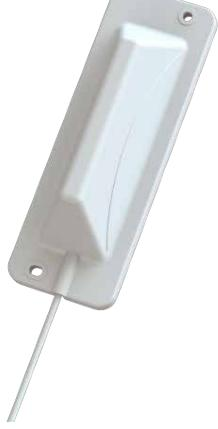
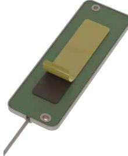
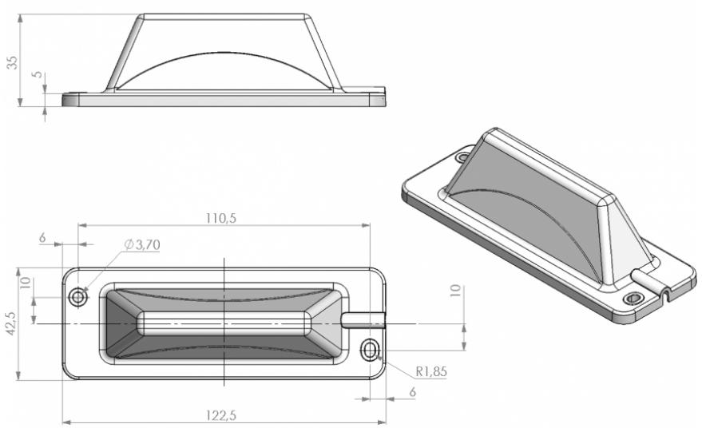

# Datasheet 1 / 2

## **IOT826**

### **Wall Mounted Low Profile Multiband Antenna**

Slim multiband antenna designed for the mobile NB-IOT, GSM(2G), UMTS(3G) and LTE(4G) systems

- Directional antenna combining the 2G/3G/4G technologies in one installation
- Easy mouting on vertical surfaces
- No groundplane needed

#### Electrical Specifications:

| 790 - 960 MHz, 1710 - 2170 MHz, 2500 - 2690 MHz (LTE 800/1800/2600, UMTS 900/2100, GSM 850/900/1800/1900(PCS)) |
|----------------------------------------------------------------------------------------------------------------------|
| See "FREQUENCY"                                                                                                      |
| Linear stripline                                                                                                     |
| 50 Ohm                                                                                                               |
| < 2.5:1 (790-960 MHz / 1710-2170 MHz), < 1.5:1 (2500-2690 MHz)                                                    |
| Linear                                                                                                               |
| 0 dBd, 2.1 dBi                                                                                                       |
| Directional                                                                                                          |
| 5 W                                                                                                                  |
| Direct Ground (DC-short)                                                                                             |
|                                                                                                                      |

| Mechanical Specifications: |                                            |  |
|----------------------------|--------------------------------------------|--|
| Color                      | White                                      |  |
| Length                     | 122.5 mm                                   |  |
| Height                     | 35 mm                                      |  |
| Weight                     | 160 g                                      |  |
| Width                      | 42.5 mm                                    |  |
| Mounting place             | On wall                                    |  |
| Materials                  | ASA, PCB, PE, PVC and copper               |  |
| Operating temperature   | -40C to +70C                               |  |
| Connector                  | SMA-male (Other connector types available) |  |

# Datasheet 2 / 2

| Cable                  | White RG174 (Other cable types available)             |  |  |
|------------------------|-------------------------------------------------------|--|--|
|                        |                                                       |  |  |
| Ordering information:  |                                                       |  |  |
| P/N                    | 48006-010 (2 m RG174 cable + SMA-male) (Bulk packing) |  |  |
| P/N                    | 48006-011 (2 m RG174 cable + SMA-male) (Polybag)      |  |  |
|                        |                                                       |  |  |
| Packaging Information: |                                                       |  |  |
| Type                   | Bulk or Polybag                                       |  |  |

Outline Drawing

Powered by TCPDF (www.tcpdf.org)

SCAN ANTENNA A/S | LITERBUEN 15 | DK-2740 SKOVLUNDE | DENMARK | TEL. +45 4333 1620 **Disclaimer:** Every effort has been made to ensure the accuracy of the information in this product sheet. SCAN Antenna A/S reserves the right to introduce changes to this information without notice.