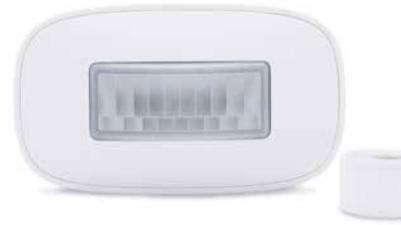
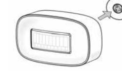
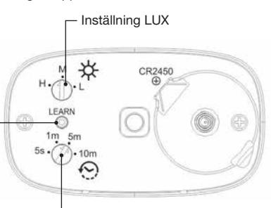
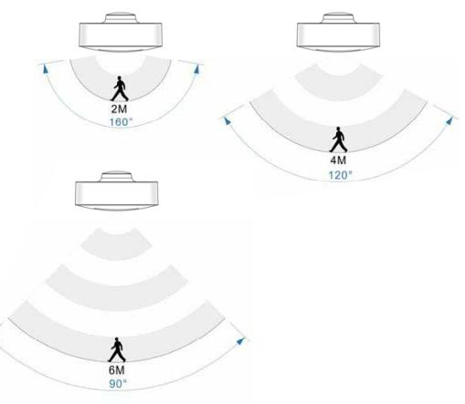

**MIMST-1703** 

**TEKNISK DATA** 

# **MIMST-1703** RÖRELSEVAKT

För inomhusbruk

## **SVENSKA**

En liten och smidig rörelsevakt för inomhusbruk. Ej lämplig att använda med dimmermottagare. *OBS. Före användning måste bakstycket lossas och skyddsremsan som sitter under batteriet avlägsnas.*

## **INLÄRNING AV MOTTAGARE**

1. Sätt mottagaren i inlärningsläge. 2. Tryck en gång på inlärningsknappen.

### **BEKRÄFTELSE INLÄRNING**

Om en lampa är ansluten till mottagaren blinkar denna två gånger.

## **RADERING AV MOTTAGARE**

1. Sätt mottagaren i inlärningsläge. 2. Tryck två gånger i snabb följd på inlärningsknappen.

#### **BEKRÄFTELSE AV RADERING**

Om en lampa är ansluten till mottagaren blinkar denna två gånger.

#### **INSTALLATION**

- 1. Skruva fast magnetfästet på ett plant underlag. 2. Placera rörelsedetektorn på fästet. OBS linsens position enligt
- bild.
- 3. Justera till önskad vinkel.

#### **VRED FÖR LJUSKÄNSLIGHET (LUX)**

Med vredet ställs detektorns känslighet i förhållande till omgivande ljusförhållande in.

| Läge H | Detekterar rörelse oavsett omgivande ljusförhållande. (Använd detta läge vid inkoppling mot dörrklocka) |
|--------|------------------------------------------------------------------------------------------------------------|
| Läge M | Detekterar rörelse vid omgivande ljus nivå under 20 LUX (±5 LUX)                                           |
|        |                                                                                                            |

- Läge L Detekterar rörelse vid omgivande ljus nivå under 10 LUX (±5 LUX)
### **VRED FÖR TIDSINTERVALL**

Vid detektering av rörelse skickar rörelsevakten en PÅ signal till inlärda mottagare, efter valt tidsintervall skickas sedan en AV signal. Med vredet för tidsintervall ställs önskad fördröjning in.

- 5 s AV-signal skickas 5 sekunder efter detektering av rörelse
- 1 m AV-signal skickas 1 minut efter detektering av rörelse
- 5 m AV-signal skickas 5 minuter efter detektering av rörelse
- 10 m AV-signal skickas 10 minuter efter detektering av rörelse

## Inlärningsknapp

**BAKSIDA**

#### Inställningsvred tidsintervall

#### NEXA AB, DATAVÄGEN 37B, 436 32 ASKIM, SWEDEN info@nexa.se | www.nexa.se

*Declaration of conformity finns tillgänglig på www.nexa.se*

Batteri 1 x 3 V CR2450 Frekvens System Nexa (433,92 MHz)

Räckvidd upp till 30 m Strömförbrukning < 1 W (standby) Drifttemperatur 0–40 °C IP klassificering Inomhusbruk Max ERP 10 mW Mått 37,5 x 65 x 31 mm

#### **Säkerhet och information**

**Räckvidd inomhus:** upp till 30 m (optimala förhållanden). Räckvidden är starkt beroende av lokala förhållanden, till exempel om det finns metaller i närheten. Exempelvis har den tunna metallbeläggning i energiglas med låg emissivitet negativ inverkan på radiosignalernas räckvidd. Det kan finnas begränsningar för användningen av enheten utanför EU. Om tillämpligt bör du kontrollera att enheten överensstämmer med lokala föreskrifter. **Max belastning:** Anslut aldrig lampor eller utrustning som överskrider mottagarens maximala belastning. Det kan leda till fel, kortslutning eller brand.

**Livsuppehållande utrustning:** Använd aldrig Nexas produkter till livsuppehållande utrustning eller andra apparater där fel eller störningar kan få livshotande följder.

**Störningar:** Alla trådlösa enheter kan drabbas av störningar som kan påverka prestandan och räckvidden. Det minsta avståndet mellan två mottagare bör därför vara åtminstone 50 cm **Reparation:** Försök inte att reparera produkten. Den innehåller inga reparerbara delar.

**Vattentäthet:** Produkten är inte vattentät. Se till att den alltid är torr. Fukt gör att elektroniken inuti fräts sönder och kan leda till kortslutning, fel och risk för elstötar.

**Rengöring:** Rengör produkten med en torr trasa. Använd inte kemikalier, lösningsmedel eller starka rengöringsmedel.

**Miljö:** Utsätt inte produkten för stark värme eller kyla, eftersom det kan skada eller förkorta de elektroniska kretsarnas livslängd.