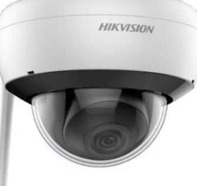
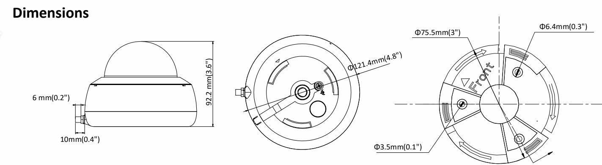
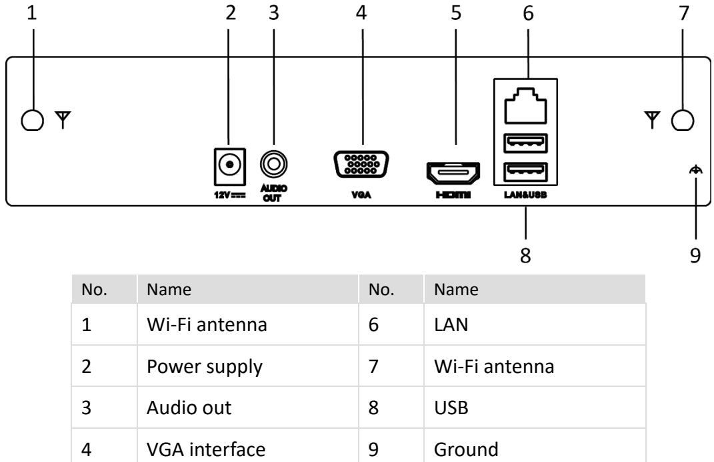

#### **DS-2CD2141G1-IDW1 4 MP IR Fixed Network Dome Camera**

## **Key Features**

- 1/3" Progressive Scan CMOS
- 2560 × 1440 @20fps
- 2.8/4 mm fixed lens
- Wi-Fi Connection
- H.265+, H.265, H.264+, H.264
- Color: 0.01 Lux @(F1.2; AGC ON), 0.028 Lux @(F2.0; AGC ON)
- 3D Digital Noise Reduction
- Audio I/O: 1 built-in mic, mono sound
- IP66

### **Specifications**

| Camera                      |                                                                                                                                                    |  |  |  |
|-----------------------------|----------------------------------------------------------------------------------------------------------------------------------------------------|--|--|--|
| Image Sensor                | 1/3" Progressive Scan CMOS                                                                                                                         |  |  |  |
| Min. Illumination           | Color: 0.01 Lux @(F1.2; AGC ON), 0.028 Lux @(F2.0; AGC ON)                                                                                         |  |  |  |
| Shutter Speed               | 1/3 s to 1/100,000 s                                                                                                                               |  |  |  |
| Slow Shutter                | Yes                                                                                                                                                |  |  |  |
| Auto-Iris                   | No                                                                                                                                                 |  |  |  |
| Day & Night                 | IR Cut Filter                                                                                                                                      |  |  |  |
| Digital Noise Reduction     | 3D DNR                                                                                                                                             |  |  |  |
| Wide Dynamic Range          | DWDR                                                                                                                                               |  |  |  |
| Axis Adjustment             | Pan: 0° to 355°, tilt: 0° to 75°                                                                                                                   |  |  |  |
| Lens                        |                                                                                                                                                    |  |  |  |
| Focal Length                | 2.8/4 mm                                                                                                                                           |  |  |  |
| Aperture                    | F2.0                                                                                                                                               |  |  |  |
| Focus                       | No                                                                                                                                                 |  |  |  |
| FOV                         | 2.8 mm, horizontal FOV: 100°, vertical FOV: 55°, diagonal FOV: 117° 4 mm, horizontal field of view: 75°, vertical FOV: 41°, diagonal FOV: 88°   |  |  |  |
| Lens Mount                  | M12                                                                                                                                                |  |  |  |
| IR                          |                                                                                                                                                    |  |  |  |
| IR Range                    | Up to 30 m                                                                                                                                         |  |  |  |
| Wavelength                  | 850nm                                                                                                                                              |  |  |  |
| Compression Standard        |                                                                                                                                                    |  |  |  |
| Video Compression           | Main stream: H.265/H.264 Sub-stream: H.265/H.264/MJPEG                                                                                          |  |  |  |
| H.264 Type                  | Baseline Profile/Main Profile/High Profile                                                                                                         |  |  |  |
| H.264+                      | Main stream supports                                                                                                                               |  |  |  |
| H.265 Type                  | Main Profile                                                                                                                                       |  |  |  |
| H.265+                      | Main stream supports                                                                                                                               |  |  |  |
| Audio Compression           | G.711/G.722.1/G.726/MP2L2/PCM                                                                                                                      |  |  |  |
| Audio Bit Rate              | 64Kbps(G.711)/16Kbps(G.722.1)/16Kbps(G.726)/32-192Kbps(MP2L2)                                                                                      |  |  |  |
| Video Bit Rate              | 32 Kbps to 8Mbps                                                                                                                                   |  |  |  |
| Audio Sampling Rate         | 8 kHz/16 kHz/32 kHz/44.1 kHz/48 kHz                                                                                                                |  |  |  |
| Environment Noise Filtering | Yes                                                                                                                                                |  |  |  |
| Smart Feature-set           |                                                                                                                                                    |  |  |  |
| Region of Interest          | Support 1 fixed region for main stream and sub-stream                                                                                              |  |  |  |
| Image                       |                                                                                                                                                    |  |  |  |
| Max. Resolution             | 2560 × 1440                                                                                                                                        |  |  |  |
| Main Stream                 | 50Hz: 20fps (2560 × 1440), 25fps (2304 × 1296, 1920 × 1080, 1280 × 720) 60Hz: 20fps (2560 × 1440), 30fps (2304 × 1296, 1920 × 1080, 1280 × 720) |  |  |  |
| Sub Stream                  | 50Hz: 25fps (640 × 480, 640 × 360, 320 × 240) 60Hz: 30fps (640 × 480, 640 × 360, 320 × 240)                                                     |  |  |  |
| Image Enhancement           | BLC/3D DNR                                                                                                                                         |  |  |  |
| Image Settings              | Saturation, brightness, contrast and sharpness are adjustable via client software and web browser                                                  |  |  |  |
| Day/Night Switch            | Auto/Scheduled/Day/Night                                                                                                                           |  |  |  |
| Network                     |                                                                                                                                                    |  |  |  |

| Alarm Trigger                    | Motion detection, video tampering, network disconnected, IP address conflict, illegal login, HDD error, HDD full              |  |  |  |
|----------------------------------|----------------------------------------------------------------------------------------------------------------------------------|--|--|--|
| Network Storage                  | Support built-in microSD/SDHC/SDXC card (128G), local storage and NAS (NFS,SMB/CIFS), ANR                                        |  |  |  |
| Protocols                        | TCP/IP, ICMP, HTTP, HTTPS, FTP, DHCP, DNS, DDNS, RTP, RTSP, RTCP, PPPoE, NTP, UPnP, SMTP, SNMP, IGMP, QoS, IPv6, UDP, Bonjour |  |  |  |
| General Function                 | One-key reset, heartbeat, mirror, password protection, privacy mask, watermark, IP address filter                                |  |  |  |
| Firmware Version                 | V5.5.60                                                                                                                          |  |  |  |
| API                              | ONVIF(PROFILE S,PROFILE G), ISAPI                                                                                                |  |  |  |
| Simultaneous Live View           | Up to 6 channels                                                                                                                 |  |  |  |
| User/Host                        | Up to 32 users                                                                                                                   |  |  |  |
|                                  | 3 levels: Administrator, Operator and User                                                                                       |  |  |  |
| Client                           | iVMS-4200, Hik-Connect, iVMS-5200, iVMS-4500                                                                                     |  |  |  |
| Web Browser                      | IE8+, Chrome 31.0-44, Firefox 30.0-51, Safari 8.0+                                                                               |  |  |  |
| Interface                        |                                                                                                                                  |  |  |  |
| Communication Interface          | 1 RJ45 10M/100M self-adaptive Ethernet port                                                                                      |  |  |  |
| On-board Storage                 | Built-in microSD/SDHC/SDXC slot, up to 128 GB                                                                                    |  |  |  |
| Audio I/O                        | 1 Built-in mic, mono sound                                                                                                       |  |  |  |
| Video Out                        | No                                                                                                                               |  |  |  |
| Alarm I/O                        | No                                                                                                                               |  |  |  |
| Reset Button                     | Yes                                                                                                                              |  |  |  |
| Wi-Fi                            |                                                                                                                                  |  |  |  |
| Wireless Standards               | IEEE802.11b, 802.11g, 802.11n                                                                                                    |  |  |  |
| Frequency Range                  | 2.412 GHz - 2.472 GHz                                                                                                            |  |  |  |
| Channel Bandwidth                | 20/40MHz                                                                                                                         |  |  |  |
|                                  | 802.11b: CCK, QPSK, BPSK,                                                                                                        |  |  |  |
| Protocols                        | 802.11g/n: OFDM                                                                                                                  |  |  |  |
| Security                         | 64/128-bit WEP, WPA/WPA2, WPA-PSK/WPA2-PSK, WPS                                                                                  |  |  |  |
| Transfer Rates                   | 11b/g: 54Mbps, 11n: up to 150Mbps                                                                                                |  |  |  |
| Wireless Range                   | Up to 50 m                                                                                                                       |  |  |  |
|                                  | (The performance varies based on actual environment)                                                                             |  |  |  |
| Power Consumption                | <20dBm                                                                                                                           |  |  |  |
| General                          |                                                                                                                                  |  |  |  |
| Operating Conditions             | -30 °C to +60 °C (-22 °F to +140 °F), Humidity 95% or less (non-condensing)                                                      |  |  |  |
| Power Supply                     | 12 VDC ± 25%, Φ 5.5 mm coaxial plug power                                                                                        |  |  |  |
| Power Consumption and Current | 12 VDC, 0.5 A, Max: 6W                                                                                                           |  |  |  |
| Protection Level                 | IP66                                                                                                                             |  |  |  |
| Material                         | Plastic                                                                                                                          |  |  |  |
| Dimensions                       | Camera: Φ 121.4 mm × 92.2 mm (Φ 4.8" × 3.6") With package: 150 mm × 150 mm × 141 mm (5.9" × 5.9" × 5.6")                      |  |  |  |
| Weight                           | Camera: 467g (1 lb.) With package: 725g (1.6 lb.)                                                                             |  |  |  |

## **Available Model:**

DS-2CD2141G1-IDW1(2.8/4 mm)

Distributed by

=

# HIKVISION

Headquarters

No.555 Dianmo Road, Binjiang District, Hangzhou 310051, China T +86-571-8807-5998 overseasbusiness@hikvision.com

Hikvision USA T +1-909-895-0400 sales.usa@hikvision.com

Hikvision Italy T +39-0438-6902 info.it@hikvision.com

Hikvision Singapore T +65-6684-4718 sg@hikvision.com

Hikvision Africa T +27 (10) 0351172 sale.africa@hikvision.com Hikvision Europe T +31-23-55-42-770 info.eu@hikvision.com

Hikvision France 1 +33(0)1-85-330-450 info.fr@hikvision.com

Hikvision Oceania T +61-2-8599-4233 salesau@hikvision.com

Hikvision Hong Kong T +852-2151-1761

HIkvision Middle East T +971-4-8816086 salesme@hikvision.com

Hikvision Spain T +34-91-737-16-55 info.es@hikvision.com

Hikvision Canada T +1-909-895-0400 sales.usa@hikvision.com Hikvision Russia T +7-495-669-67-99 saleru@hikvision.com

Hikvision Poland T +48-22-460-01-50 poland@hikvision.com

Hikvision Korea 1 +82-31-731-8841 sales.korea@hikvision.com Hikvision India T +91-22-28469900 sales@pramahikvision.com

Hikvision UK T +01628-902140 support.uk@hikvision.com

Hikvision Brazil 1 +55 11 3318-0050 Latam.support@hikvision.com

© Hikvision Digital Technology Co., Ltd. 2017 | Data subject to change without notice | 05056020180801

# **DS-7100NI-K1/W/M Series Wi-Fi NVR**

## **Features and Functions**

#### **Video Input and Transmission**

- Up to 4/8 IP cameras (max. incoming bandwidth: 50 Mbps)
- Live view of the connected camera at up to 4 MP resolution

#### **Compression and Recording**

- H.264, H.265, H.264+, and H.265+ compression.
- Full channel recording at up to 4 MP resolution

#### **Video Output**

- HDMI/VGA output with up to 1920 × 1080 resolution
#### **Storage and Playback**

- 1 SATA interface for HDD with up to 6 TB capacity
- Up to 4/8-ch synchronous playback
- Smart search for efficient playback

#### **Smart Function**

- Supports line crossing and intrusion VCA (Video Content Analytics) events for IP cameras
#### **Network & Ethernet Access**

- Hik-Connect for easy network management
- One 100M Ethernet network interface

#### **Wi-Fi Features**

- Provides Wi-Fi function.
- Up to 16 terminals, including mobile phone and laptop, can access NVR via Wi-Fi
- Dual external antenna design offers more powerful and stable signal.

# **Specifications**

| Model                  |                                | DS-7104NI-K1/W/M                                                                          | DS-7108NI-K1/W/M |  |
|------------------------|--------------------------------|-------------------------------------------------------------------------------------------|------------------|--|
| Video/Audio input   | IP video input                 | 4-ch                                                                                      | 8-ch             |  |
|                        | Incoming/outgoing bandwidth | 50/40 Mbps                                                                                |                  |  |
| Video/Audio output  | HDMI/VGA output                | 1-ch, resolution: 1920 × 1080/60Hz, 1280 × 1024/60Hz, 1280 × 720/60Hz, 1024 × 768/60Hz |                  |  |
|                        | Audio output                   | 1-ch, RCA (linear, 1 KΩ)                                                                  |                  |  |
| Decoding               | Recording resolution           | 4 M/3 M/1080p/1.3 M/720p                                                                  |                  |  |
|                        | Synchronous playback           | 4-ch                                                                                      | 8-ch             |  |
|                        | Capacity                       | 2-ch@1080p / 1-ch@4 MP                                                                    |                  |  |
| Hard disk              | SATA                           | 1 SATA interface                                                                          |                  |  |
|                        | Capacity                       | Up to 6 TB capacity for each disk                                                         |                  |  |
| Wireless parameters | Frequency band                 | 2.4 GHz                                                                                   |                  |  |
|                        | Antenna structure              | 2 × 2MIMO                                                                                 |                  |  |
|                        | Transmission speed 144 Mbps |                                                                                           |                  |  |
|                        | Transmission standard          | IEEE 802.11b/g/n                                                                          |                  |  |
| External interface  | Network interface              | 1, RJ45 10/100M Ethernet interface                                                        |                  |  |
|                        | USB interface                  | Rear panel: 2 × USB 2.0                                                                   |                  |  |
| General                | Power supply                   | 12 VDC                                                                                    |                  |  |
|                        | Consumption (without HDDs)  | ≤ 12 W                                                                                    |                  |  |
|                        | Working temperature            | -10 °C to +55 °C (14 °F to 131 °F)                                                        |                  |  |
|                        | Working humidity               | 10% to 90%                                                                                |                  |  |
|                        | Dimensions (W × D × H)      | 260 × 246 × 48 mm (10.2" × 9.7" × 1.9")                                                   |                  |  |
|                        | Weight (without HDDs)          | ≤ 1 kg (2.2 lb)                                                                           |                  |  |

Physical Interfaces

## Available Models

5

HDMI interface

DS-7104NI-KI/W/M, DS-7108NI-KI/W/M

# HIKVISION

Headquarters

Distributed by

No.555 Qianmo Road, Binjiang District, Hangzhou 310051, China T +86-571-8807-5998 overseasbusiness(@hikvision.com

Hikvision USA T +1-909-895-0400 sales.usa@hikvision.com

Hikvision Italy
T +39-0438-6902 info.it@hikvision.com

Hikvision Singapore
T +65-6684-4718 sg@hikvision.com

Hikvision Africa T +27 (10) 0351172 sale.africa@hikvision.com Hikvision Europe T +31-23-55-42-770 info.eu@hikvision.com

Hikvision France
T +33(0)1-85-330-450 info.fr@hikvision.com

Hikvision Oceania T +61-2-8599-4233 salesau@hikvision.com

Hikvision Hong Kong +852-5151-1761

Hikvision Middle East T +971-4-8816086 salesme@hikvision.com

Hikvision Spain 1 +34-91-737-16-55 info.es@hikvision.com

Hikvision Canada
T +1-909-895-0400 sales.usa@hikvision.com Hikvision Russia
T +7-495-669-67-99 saleru@hikvision.com

Hikvision Poland T +48-22-460-01-50 poland@hikvision.com

Hikvision Korea T +82-31-731-8841 sales.korea@hikvision.com Hikvision India T +91-22-28469900 sales@pramahikvision.com

Hikvision UK T +01628-902140 support.uk@hikvision.com

Hikvision Brazil T +55 11 3318-0050 Latam.support@hikvision.com

© Hikvision Digital Technology Co., Ltd. 2017 | Data subject to change without notice |

030496180426