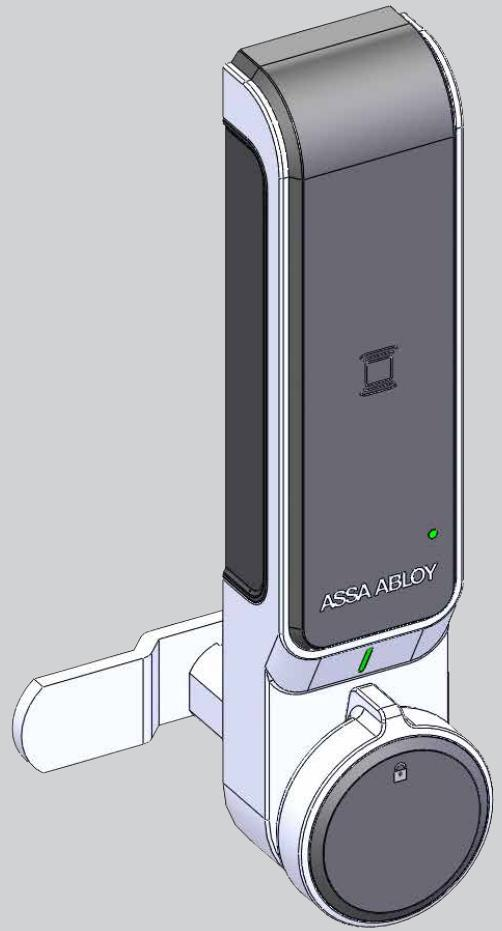
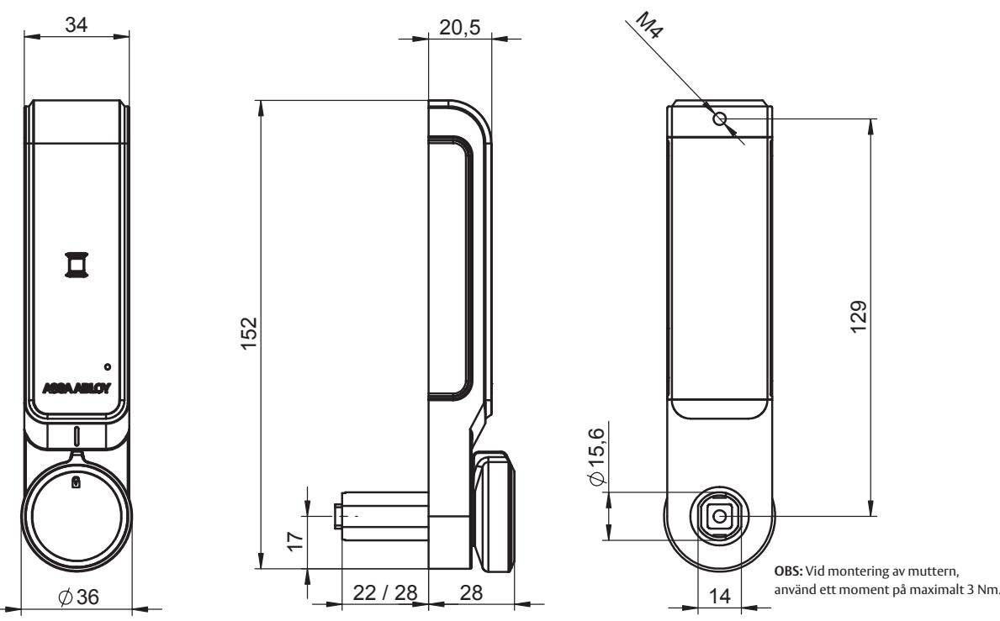

# Elektromekaniskt skåplås ASSA ABLOY SENSE

## Modell ML52RA

### **Användningsområde**

ASSA ABLOY SENSE är ett fristående batteridrivet elektromekaniskt lås som stödjer Mifare-kort. Låset är avsett för användning i torra utrymmen, men kan kompletteras med en tätande gummipackning för användning i fuktiga inomhusmiljöer.

#### **Egenskaper**

- Låset monteras enkelt i befintligt hålurtag och kräver endast ett extra hål för en skruv.
- Låset finns i vertikalt, höger och vänsterutförande.
- Låset finns i två längder, för montering på dörrar med upp till 15 respektive 23 mm tjocklek.
- Låset har såväl ljus som ljud för att förenkla användningen.
- Låset erbjuder 3 kortnivåer. Användarkort, Vaktmästarkort och Huvudkort.
- Låset är försett med en USB-port för möjlighet att kunna energisätta låset i det fall att batterierna blir urladdade.
- Standardreglar för mekaniska skåplåscylindrar används (se datablad för reglar) och beställs separat.
- Överlastskydd i vredet.

#### **Funktion**

Låset går att ställa I 2 stycken användarlägen. Dessa är: 1. Privat läge

I detta läge öppnas låset med samma kort under en längre tid

- 2. Publikt läge
	- I detta läge visar användaren valfritt kompatibelt kort då skåpet låses. Samma kort används senare för att öppna. Låset går nu åter att låsa med valfritt kort.

Låset kan snabbprogrammeras för att driftsätta låset på bara några sekunder. För mer flexibel programmering rekommenderar vi att man köper programmeringskittet.

För installation och ändringar av ett större antal lås finns ett så kallat kopieringskort som avsevärt förkortar tidsåtgången för detta, se separat datablad.

# Elektromekaniskt skåplås ASSA ABLOY SENSE

## Modell ML52RA

### **Tekniska data**

- Batterier: 3 st AAA Antalet öppningar innan batteribyte: 15 000 st
- Antalet möjlig användarkort som kan registreras: 50
- Antalet möjlig vaktmästarkort som kan registreras: 5
- Antalet möjlig huvudkort som kan registreras: 5
- USB-port: Micro Typ B

| Artikelnummer Lås       |               |
|-------------------------|---------------|
| SENSE Kort              | 493340 000000 |
| SENSE Lång              | 493341 000000 |
| Artikelnummer Tillbehör |               |
| Gummipackning           | 493390 000000 |
| Programmerings-kit      | 493391 000000 |

ASSA ABLOY Opening Solutions Sweden P.O. Box 371 SE-631 05 Eskilstuna Sweden Phone +46 (0)16 17 70 00 Fax +46 (0)16 17 70 49 Customer support:

Phone intl. +46 (0)16 17 71 00 Phone nat. 0771-640 640 Fax +46 (0)16 17 73 72 e-mail: helpdesk.se.openingsolutions@assaabloy.com www.assaabloyopeningsolutions.se