# **Network Video Recorder**

## **Quick Start Guide**

UD00615B

|                                      | Chapter1 Panels Description 7            |                                       |  |  |  |  |
|--------------------------------------|------------------------------------------|---------------------------------------|--|--|--|--|
| 1.1                                  |                                          | Front Panel 7                         |  |  |  |  |
|                                      | 1.1.1                                    | DS-9600NI Series7                     |  |  |  |  |
|                                      | 1.1.2                                    | DS-8600NI and DS-7700NI Series9       |  |  |  |  |
|                                      | 1.1.3                                    | DS-7600NI Series 11                   |  |  |  |  |
| 1.2 Rear Panel  11                |                                          |                                       |  |  |  |  |
|                                      | 1.2.1                                    | DS-9600NI and DS-8600NI Series 11     |  |  |  |  |
|                                      | 1.2.2                                    | DS-7700NI Series 12                   |  |  |  |  |
|                                      | 1.2.3                                    | DS-7600NI Series 13                   |  |  |  |  |
|                                      | Chapter 2Installation and Connections 15 |                                       |  |  |  |  |
| 2.1                                  |                                          | NVR Installation 15                   |  |  |  |  |
| 2.2                                  | Hard Disk Installation 15                |                                       |  |  |  |  |
|                                      | 2.2.1                                    | DS-9600NI Series 15                   |  |  |  |  |
|                                      | 2.2.2                                    | Other Models 17                       |  |  |  |  |
| 2.3                                  |                                          | Connections 19                        |  |  |  |  |
|                                      | 2.3.1                                    | Alarm Input Wiring 19                 |  |  |  |  |
|                                      | 2.3.2                                    | Alarm Output Wiring 19                |  |  |  |  |
|                                      | 2.3.3                                    | Using Alarm Connectors 19             |  |  |  |  |
|                                      | 2.3.4                                    | Controller Connection 20              |  |  |  |  |
| 2.4                                  |                                          | HDD Storage Calculation Chart  21     |  |  |  |  |
|                                      |                                          | Chapter 3Menu Operation 22            |  |  |  |  |
| 3.1                                  |                                          | Menu Structure  22                    |  |  |  |  |
| 3.2                                  |                                          | Startup and Shutdown 22               |  |  |  |  |
| 3.3                                  |                                          | Activating Your Device  23            |  |  |  |  |
| 3.4                                  |                                          | Using the Unlock Pattern for Login 24 |  |  |  |  |
| 3.5                                  |                                          | Login and Logout  25                  |  |  |  |  |
|                                      | 3.5.1                                    | User Login  25                        |  |  |  |  |
|                                      | 3.5.2                                    | User Logout  26                       |  |  |  |  |
| 3.6                                  |                                          | Using the Setup Wizard  26            |  |  |  |  |
| 3.7                                  |                                          | Network Settings 27                   |  |  |  |  |
| 3.8                                  |                                          | Adding IP Cameras 27                  |  |  |  |  |
| 3.9                                  |                                          | Live View  28                         |  |  |  |  |
| 3.10                                 |                                          | One-Touch RAID Configuration  29      |  |  |  |  |
| 3.11                                 | Recording Settings 30                    |                                       |  |  |  |  |
|                                      | 3.12 Playback  30                     |                                       |  |  |  |  |
| Chapter 4Accessing by Web Browser 32 |                                          |                                       |  |  |  |  |

#### **Quick Start Guide**

COPYRIGHT ©2016 Hangzhou Hikvision Digital Technology Co., Ltd.

#### **ALL RIGHTS RESERVED.**

Any and all information, including, among others, wordings, pictures, graphs are the properties of Hangzhou Hikvision Digital Technology Co., Ltd. or its subsidiaries (hereinafter referred to be "Hikvision"). This user manual (hereinafter referred to be "the Manual") cannot be reproduced, changed, translated, or distributed, partially or wholly, by any means, without the prior written permission of Hikvision. Unless otherwise stipulated, Hikvision does not make any warranties, guarantees or representations, express or implied, regarding to the Manual.

#### **About this Manual**

This Manual is applicable to Network Video Recorder (NVR).

The Manual includes instructions for using and managing the product. Pictures, charts, images and all other information hereinafter are for description and explanation only. The information contained in the Manual is subject to change, without notice, due to firmware updates or other reasons. Please find the latest version in the company website (http://overseas.hikvision.com/en/).

Please use this user manual under the guidance of professionals.

#### **Trademarks Acknowledgement**

and other Hikvision's trademarks and logos are the properties of Hikvision in various jurisdictions. Other trademarks and logos mentioned below are the properties of their respective owners.

#### **Legal Disclaimer**

TO THE MAXIMUM EXTENT PERMITTED BY APPLICABLE LAW, THE PRODUCT DESCRIBED, WITH ITS HARDWARE, SOFTWARE AND FIRMWARE, IS PROVIDED "AS IS", WITH ALL FAULTS AND ERRORS, AND HIKVISION MAKES NO WARRANTIES, EXPRESS OR IMPLIED, INCLUDING WITHOUT LIMITATION, MERCHANTABILITY, SATISFACTORY QUALITY, FITNESS FOR A PARTICULAR PURPOSE, AND NON-INFRINGEMENT OF THIRD PARTY. IN NO EVENT WILL HIKVISION, ITS DIRECTORS, OFFICERS, EMPLOYEES, OR AGENTS BE LIABLE TO YOU FOR ANY SPECIAL, CONSEQUENTIAL, INCIDENTAL, OR INDIRECT DAMAGES, INCLUDING, AMONG OTHERS, DAMAGES FOR LOSS OF BUSINESS PROFITS, BUSINESS INTERRUPTION, OR LOSS OF DATA OR DOCUMENTATION, IN CONNECTION WITH THE USE OF THIS PRODUCT, EVEN IF HIKVISION HAS BEEN ADVISED OF THE POSSIBILITY OF SUCH DAMAGES.

REGARDING TO THE PRODUCT WITH INTERNET ACCESS, THE USE OF PRODUCT SHALL BE WHOLLY AT YOUR OWN RISKS. HIKVISION SHALL NOT TAKE ANY RESPONSIBILITES FOR ABNORMAL OPERATION, PRIVACY LEAKAGE OR OTHER DAMAGES RESULTING FROM CYBER ATTACK, HACKER ATTACK, VIRUS INSPECTION, OR OTHER INTERNET SECURITY RISKS; HOWEVER, HIKVISION WILL PROVIDE TIMELY TECHNICAL SUPPORT IF REQUIRED.

SURVEILLANCE LAWS VARY BY JURISDICTION. PLEASE CHECK ALL RELEVANT LAWS IN YOUR JURISDICTION BEFORE USING THIS PRODUCT IN ORDER TO ENSURE THAT YOUR USE CONFORMS THE APPLICABLE LAW. HIKVISION SHALL NOT BE LIABLE IN THE EVENT THAT THIS PRODUCT IS USED WITH ILLEGITIMATE PURPOSES.

IN THE EVENT OF ANY CONFLICTS BETWEEN THIS MANUAL AND THE APPLICABLE LAW, THE LATER PREVAILS.

### **Regulatory Information**

### **FCC Information**

**FCC compliance:** This equipment has been tested and found to comply with the limits for a Class A digital device, pursuant to part 15 of the FCC Rules. These limits are designed to provide reasonable protection against harmful interference when the equipment is operated in a commercial environment. This equipment generates, uses, and can radiate radio frequency energy and, if not installed and used in accordance with the instruction manual, may cause harmful interference to radio communications. Operation of this equipment in a residential area is likely to cause harmful interference in which case the user will be required to correct the interference at his own expense.

### **FCC Conditions**

This device complies with part 15 of the FCC Rules. Operation is subject to the following two conditions:

1. This device may not cause harmful interference.

2. This device must accept any interference received, including interference that may cause undesired operation.

### **EU Conformity Statement**

This product and - if applicable - the supplied accessories too are marked with "CE" and comply therefore with the applicable harmonized European standards listed under the EMC Directive 2004/108/EC, the RoHS Directive 2011/65/EU.

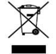

2012/19/EU (WEEE directive): Products marked with this symbol cannot be disposed of as unsorted municipal waste in the European Union. For proper recycling, return this product to your local supplier upon the purchase of equivalent new equipment, or dispose of it at designated collection

points. For more information see: www.recyclethis.info

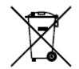

2006/66/EC (battery directive): This product contains a battery that cannot be disposed of as unsorted municipal waste in the European Union. See the product documentation for specific battery information. The battery is marked with this symbol, which may include lettering to indicate

cadmium (Cd), lead (Pb), or mercury (Hg). For proper recycling, return the battery to your supplier or to a designated collection point. For more information see: www.recyclethis.info

### **Industry Canada ICES-003 Compliance**

This device meets the CAN ICES-3 (A)/NMB-3(A) standards requirements.

### **Safety Instruction**

These instructions are intended to ensure that user can use the product correctly to avoid danger or property loss.

The precaution measure is divided into "Warnings" and "Cautions"

**Warnings:** Serious injury or death may occur if any of the warnings are neglected.

**Cautions:** Injury or equipment damage may occur if any of the cautions are neglected.

| Warnings Follow these   | Cautions Follow these  |
|-------------------------------|------------------------------|
| safeguards to prevent serious | precautions to prevent |
| injury or death.              | potential injury or material |
|                               | damage.                      |

### **Warnings** ● Proper configuration of all passwords and other security settings is the responsibility of the installer and/or end-user.

- In the use of the product, you must be in strict compliance with the electrical safety regulations of the nation and region. Please refer to technical specifications for detailed information.
- Input voltage should meet both the SELV (Safety Extra Low Voltage) and the Limited Power Source with 100~240 VAC or 12 VDC according to the IEC60950-1 standard. Please refer to technical specifications for detailed information.
- Do not connect several devices to one power adapter as adapter overload may cause over-heating or a fire hazard.
- Please make sure that the plug is firmly connected to the power socket.
- If smoke, odor or noise rise from the device, turn off the power at once and unplug the power cable, and then please contact the service center.

### **Preventive and Cautionary Tips**

Before connecting and operating your device, please be advised of the following tips:

- Ensure unit is installed in a well-ventilated, dust-free environment.
- Unit is designed for indoor use only.
- Keep all liquids away from the device.
- Ensure environmental conditions meet factory specifications.
- Ensure unit is properly secured to a rack or shelf. Major shocks or jolts to the unit as a result of dropping it may cause damage to the sensitive electronics within the unit.
- Use the device in conjunction with an UPS if possible.
- Power down the unit before connecting and disconnecting accessories and peripherals.
- A factory recommended HDD should be used for this device.
- Improper use or replacement of the battery may result in hazard of explosion. Replace with the same or equivalent type only. Dispose of used batteries according to the instructions provided by the battery manufacturer.

### **Applicable Models**

This manual is applicable to the models listed in the following table.

| Series          | Model            |
|-----------------|------------------|
|                 | DS-9608NI-I8     |
|                 | DS-9616NI-I8     |
| DS-9600NI-I8    | DS-9632NI-I8     |
|                 | DS-9664NI-I8     |
|                 | DS-9616NI-I16    |
| DS-9600NI-I16   | DS-9632NI-I16    |
|                 | DS-9664NI-I16    |
|                 | DS-7608NI-I2     |
| DS-7600NI-I2    | DS-7616NI-I2     |
|                 | DS-7632NI-I2     |
|                 | DS-7608NI-I2/8P  |
| DS-7600NI-I2/P  | DS-7616NI-I2/16P |
|                 | DS-7632NI-I2/16P |
|                 | DS-7708NI-I4     |
| DS-7700NI-I4    | DS-7716NI-I4     |
|                 | DS-7732NI-I4     |
|                 | DS-7708NI-I4/8P  |
| DS-7700NI-I4/P  | DS-7716NI-I4/16P |
|                 | DS-7732NI-I4/16P |
|                 | DS-8608NI-K8     |
| DS-8600NI-K8    | DS-8616NI-K8     |
|                 | DS-8632NI-K8     |
|                 | DS-7708NI-K4     |
| DS-7700NI-K4    | DS-7716NI-K4     |
|                 | DS-7732NI-K4     |
|                 | DS-7708NI-K4/8P  |
| DS-7700NI-K4/P  | DS-7716NI-K4/16P |
|                 | DS-7732NI-K4/16P |
|                 | DS-7608NI-K2     |
| DS-7600NI-K2    | DS-7616NI-K2     |
|                 | DS-7632NI-K2     |
|                 | DS-7608NI-K2/8P  |
| DS-7600NI-K2/P  | DS-7616NI-K2/16P |
|                 | DS-7632NI-K2/16P |
|                 | DS-7604NI-K1     |
| DS-7600NI-K1    | DS-7608NI-K1     |
|                 | DS-7616NI-K1     |
| DS-7600NI-K1/4P | DS-7604NI-K1/4P  |

### **Symbol Conventions**

The symbols that may be found in this document are defined as follows.

| Symbol | Description                                                                                                                                                           |
|--------|-----------------------------------------------------------------------------------------------------------------------------------------------------------------------|
|        | Indicates a potentially hazardous situation, which if not avoided, could result in equipment damage, data loss, performance degradation, or unexpected results. |
|        | Provides additional information to emphasize or supplement important points of the main text.                                                                      |

# **Chapter1 Panels Description**

## **1.1 Front Panel**

### **1.1.1 DS-9600NI Series**

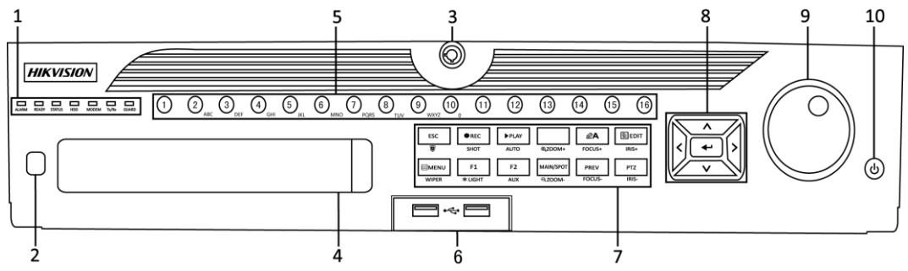

Figure 1. 1 DS-9600NI-I8 Series

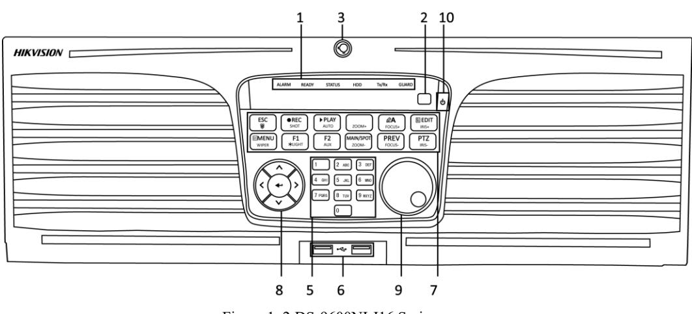

Figure 1. 2 DS-9600NI-I16 Series

| No. | Name       |        | Function Description                                            |
|-----|------------|--------|-----------------------------------------------------------------|
| 1   |            | ALARM  | Turns red when a sensor alarm is detected.                      |
|     |            | READY  | Turns blue when the device is functioning properly.             |
|     |            | STATUS | Turns blue when device is controlled by an IR remote.           |
|     |            |        | Turns red when controlled by a keyboard and purple when IR      |
|     | Status     |        | remote and keyboard is used at the same time.                   |
|     | Indicators | HDD    | Flickers red when data is being read from or written to HDD.    |
|     |            | MODEM  | Reserved for future usage.                                      |
|     |            | Tx/Rx  | Flickers blue when network connection is functioning properly.  |
|     |            |        | Turns blue when the device is in armed status; at this time, an |
|     |            | GUARD  | alarm is enabled when an event is detected.                     |

| No. | Name                 |                  | Function Description                                                                                        |  |
|-----|----------------------|------------------|-------------------------------------------------------------------------------------------------------------|--|
|     |                      |                  | Turns off when the device is unarmed. The arm/disarm status                                                 |  |
|     |                      |                  | can be changed by pressing and holding on the ESC button for                                                |  |
|     |                      |                  | more than 3 seconds in live view mode.                                                                      |  |
| 2   | IR Receiver          |                  | Receiver for IR remote control.                                                                             |  |
| 3   |                      | Front Panel Lock | Locks or unlocks the panel by the key.                                                                      |  |
| 4   |                      | DVD-R/W          | Slot for DVD-R/W disk.                                                                                      |  |
|     |                      |                  | Switches to the corresponding channel in live view or PTZ                                                   |  |
|     |                      |                  | control mode.                                                                                               |  |
|     | Alphanumeric Buttons |                  | Inputs numbers and characters in edit mode.                                                                 |  |
| 5   |                      |                  | Switches between different channels in playback mode.                                                       |  |
|     |                      |                  | Turns blue when the corresponding channel is recording; turns                                               |  |
|     |                      |                  | red when the channel is in network transmission status; turns                                               |  |
|     |                      |                  | pink when the channel is recording and transmitting.                                                        |  |
| 6   |                      | USB Interfaces   | Universal Serial Bus (USB) ports for additional devices such as USB mouse and USB Hard Disk Drive (HDD). |  |
|     |                      | ESC              | Returns to the previous menu.                                                                               |  |
|     |                      |                  | Presses for arming/disarming the device in live view mode.                                                  |  |
|     |                      |                  | Enters the Manual Record settings menu.                                                                     |  |
|     |                      | REC/SHOT         | Presses this button followed by a numeric button to call a PTZ                                              |  |
|     |                      |                  | preset in PTZ control settings.                                                                             |  |
|     |                      |                  | Turns audio on/off in the playback mode.                                                                    |  |
|     |                      | PLAY/AUTO        | Enters the playback mode.                                                                                   |  |
|     |                      |                  | Automatically scans in the PTZ control menu.                                                                |  |
|     |                      | ZOOM+            | Zooms in the PTZ camera in the PTZ control setting.                                                         |  |
|     |                      |                  | Adjusts focus in the PTZ Control menu.                                                                      |  |
|     |                      | A/FOCUS+         | Switches between input methods (upper and lower case alphabet,                                              |  |
|     |                      |                  | symbols and numeric input).                                                                                 |  |
|     |                      |                  | Edits text fields. When editing text fields, it also deletes the                                            |  |
|     |                      |                  | character in front of the cursor.                                                                           |  |
|     | Composite            | EDIT/IRIS+       | Checks the checkbox in the checkbox fields.                                                                 |  |
| 7   | Keys                 |                  | Adjusts the iris of the camera in PTZ control mode.                                                         |  |
|     |                      |                  | Generates video clips for backup in playback mode.                                                          |  |
|     |                      |                  | Enters/exits the folder of USB device and eSATA HDD.                                                        |  |
|     |                      | MAIN/SPOT/ZOO    | Switches between main and spot output.                                                                      |  |
|     |                      | M                | Zooms out the image in PTZ control mode.                                                                    |  |
|     |                      |                  | Selects all items on the list when used in a list field.                                                    |  |
|     |                      | F1/ LIGHT        | Turns on/off PTZ light (if applicable) in PTZ control mode.                                                 |  |
|     |                      |                  | Switches between play and reverse play in playback mode.                                                    |  |
|     |                      | F2/ AUX          | Cycles through tab pages.                                                                                   |  |
|     |                      |                  | Switches between channels in synchronous playback mode.                                                     |  |
|     |                      | MENU/WIPER       | Returns to the Main menu (after successful login).                                                          |  |
|     |                      |                  | Presses and holds the button for five seconds to turn off audible key beep.                              |  |
|     |                      |                  | Starts wiper (if applicable) in PTZ control mode.                                                           |  |

| No. | Name                |            | Function Description                                             |  |  |
|-----|---------------------|------------|------------------------------------------------------------------|--|--|
|     |                     |            | Shows/hides the control interface in playback mode.              |  |  |
|     |                     | PREV/FOCUS | Switches between single screen and multi-screen mode.            |  |  |
|     |                     |            | Adjusts the focus in conjunction with the A/FOCUS+ button in     |  |  |
|     |                     |            | PTZ control mode.                                                |  |  |
|     |                     | PTZ/IRIS   | Enters the PTZ Control mode.                                     |  |  |
|     |                     |            | Adjusts the iris of the PTZ camera in PTZ control mode.          |  |  |
|     |                     | DIRECTION  | Navigates between different fields and items in menus.           |  |  |
|     |                     |            | In the playback mode, use the Up and Down buttons to speed up    |  |  |
|     |                     |            | and slow down recorded video. Use the Left and Right buttons     |  |  |
|     |                     |            | to select the next and previous video files.                     |  |  |
|     |                     |            | Cycles through channels in live view mode.                       |  |  |
|     | Control             |            | Controls the movement of the PTZ camera in PTZ control mode.     |  |  |
| 8   | Buttons             | ENTER      | Confirms selection in any of the menu modes.                     |  |  |
|     |                     |            | Checks the checkbox fields.                                      |  |  |
|     |                     |            | Plays or pauses the video playing in playback mode.              |  |  |
|     |                     |            | Advances the video by a single frame in single-frame playback    |  |  |
|     |                     |            | mode.                                                            |  |  |
|     |                     |            | Stops/starts auto switch in auto-switch mode.                    |  |  |
|     | JOG SHUTTLE Control |            | Moves the active selection up and down in a menu.                |  |  |
|     |                     |            | Cycles through different channels in live view mode.             |  |  |
| 9   |                     |            | Jumps 30s forward/backward in video files in the playback        |  |  |
|     |                     |            | mode.                                                            |  |  |
|     |                     |            | Controls the movement of the PTZ camera in PTZ control mode.     |  |  |
|     | POWER ON/OFF        |            | Long press the button for more than 3 seconds to turn on/off the |  |  |
| 10  |                     |            | NVR.                                                             |  |  |

### **1.1.2 DS-8600NI and DS-7700NI Series**

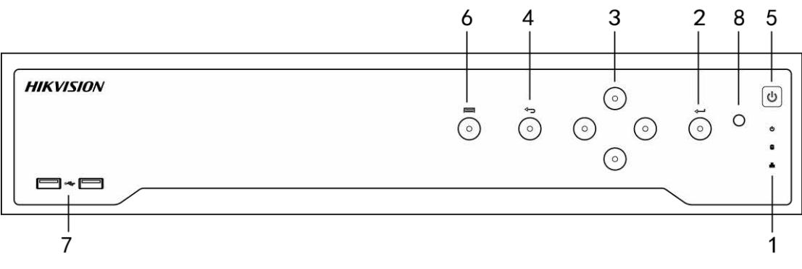

Figure 1. 3 DS-8600NI-K8 Series

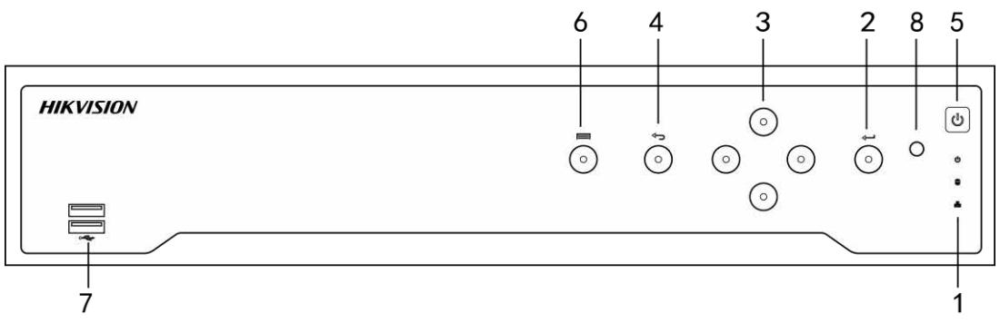

Figure 1. 4 DS-7700NI Series

| No. | Name                 |               | Function Description                                                                                                                                                                        |  |
|-----|----------------------|---------------|---------------------------------------------------------------------------------------------------------------------------------------------------------------------------------------------|--|
| 1   |                      | POWER         | Turns green when NVR is powered up.                                                                                                                                                         |  |
|     | Status Indicators | HDD           | Blinks red when HDD is reading/writing.                                                                                                                                                     |  |
|     |                      | Tx/Rx         | Blinks green when network connection is functioning normally.                                                                                                                               |  |
|     | 2 ENTER           |               | The Enter button is used to confirm selection in menu mode; or used to check checkbox fields and ON/OFF switch.                                                                          |  |
|     |                      |               | In playback mode, it can be used to play or pause the video.                                                                                                                                |  |
|     |                      |               | In single-frame play mode, pressing the Enter button will play the video by a single frame.                                                                                              |  |
|     |                      |               | In auto sequence view mode, the buttons can be used to pause or resume auto sequence.                                                                                                    |  |
|     |                      |               | The Enter button is used to confirm selection in menu mode; or used to check checkbox fields and ON/OFF switch.                                                                          |  |
|     | 3 DIRECTION       |               | In menu mode, the direction buttons are used to navigate between different fields and items and select setting parameters.                                                               |  |
|     |                      |               | In playback mode, the Up and Down buttons are used to speed up and slow down record playing, and the Left and Right buttons are used to move the recording 30s forwards or backwards. |  |
|     |                      |               | In the image setting interface, the up and down button can adjust                                                                                                                           |  |
|     |                      |               | the level bar of the image parameters.                                                                                                                                                      |  |
|     |                      |               | In live view mode, these buttons can be used to switch channels.                                                                                                                            |  |
| 4   | Back                 |               | Back to the previous menu.                                                                                                                                                                  |  |
| 5   |                      | POWER ON/OFF  | Power on/off switch.                                                                                                                                                                        |  |
| 6   |                      | MENU          | Access the main menu interface.                                                                                                                                                             |  |
| 7   |                      | USB Interface | Universal Serial Bus (USB) ports for additional devices such as USB mouse and USB Hard Disk Drive (HDD).                                                                                 |  |

|  |  |  |  |  | Table 1. 2 Panel Description |
|--|--|--|--|--|------------------------------|
|--|--|--|--|--|------------------------------|

### **1.1.3 DS-7600NI Series**

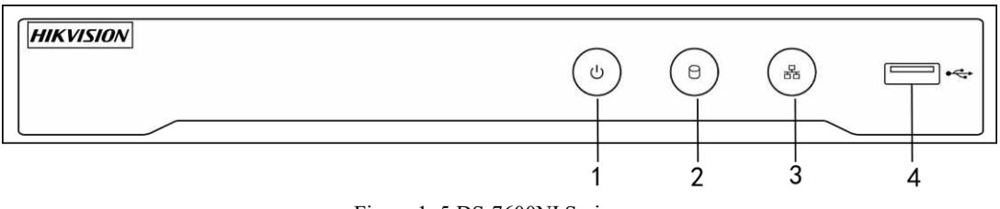

Figure 1. 5 DS-7600NI Series

Table 1. 3 Panel Description

| No. | Name          | Connections                                                                                                |
|-----|---------------|------------------------------------------------------------------------------------------------------------|
| 1   | POWER         | Turns green when NVR is powered up.                                                                        |
| 2   | HDD           | Flickers red when data is being read from or written to HDD.                                               |
| 3   | Tx/Rx         | Flickers blue when network connection is functioning properly.                                             |
| 4   | USB Interface | Universal Serial Bus (USB) port for additional devices such as USB mouse and USB Hard Disk Drive (HDD). |

# **1.2 Rear Panel**

### **1.2.1 DS-9600NI and DS-8600NI Series**

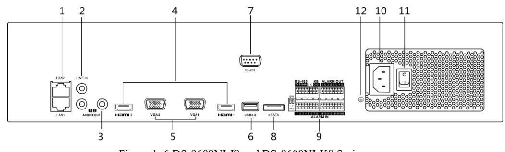

Figure 1. 6 DS-9600NI-I8 and DS-8600NI-K8 Series

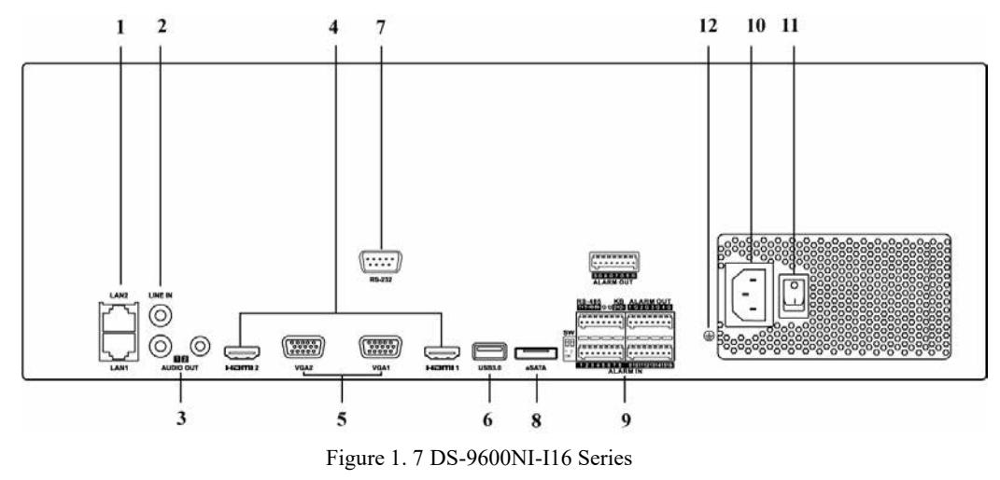

| No. | Name                                                                                        | Description                                                             |  |
|-----|---------------------------------------------------------------------------------------------|-------------------------------------------------------------------------|--|
| 1   | LAN1/LAN2 Interface 2 RJ-45 10/100/1000 Mbps self-adaptive Ethernet interfaces provided. |                                                                         |  |
| 2   | LINE IN                                                                                     | RCA connector for audio input.                                          |  |
| 3   | AUDIO OUT 2 RCA connectors for audio output.                                             |                                                                         |  |
| 4   | HDMI1/HDMI2                                                                                 | HDMI video output connector.                                            |  |
| 5   | VGA1/VGA2                                                                                   | DB9 connector for VGA output. Display local video output and menu.      |  |
| 6   | USB 3.0 interface                                                                           | Universal Serial Bus (USB) ports for additional devices such as USB     |  |
|     |                                                                                             | mouse and USB Hard Disk Drive (HDD).                                    |  |
| 7   | RS-232 Interface Connector for RS-232 devices.                                           |                                                                         |  |
| 8   | eSATA                                                                                       | Connects external SATA HDD, CD/DVD-RM.                                  |  |
|     |                                                                                             | D+, D- pin connects to Ta, Tb pin of controller. For cascading devices, |  |
|     | Controller Port                                                                             | the first NVR's D+, D- pin should be connected with the D+, D- pin of   |  |
| 9   |                                                                                             | the next NVR.                                                           |  |
|     | ALARM IN                                                                                    | Connector for alarm input.                                              |  |
|     | ALARM OUT                                                                                   | Connector for alarm output.                                             |  |
| 10  | 100 to 240 VAC                                                                              | 100 to 240 VAC power supply.                                            |  |
| 11  | Power Switch                                                                                | Switch for turning on/off the device.                                   |  |
| 12  | GROUND                                                                                      | Ground (needs to be connected when NVR starts up).                      |  |

Table 1. 4 Panel Description

### **1.2.2 DS-7700NI Series**

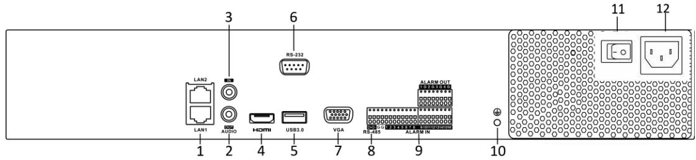

Figure 1. 8 DS-7700NI-I4 and DS-7700NI-K4 Series

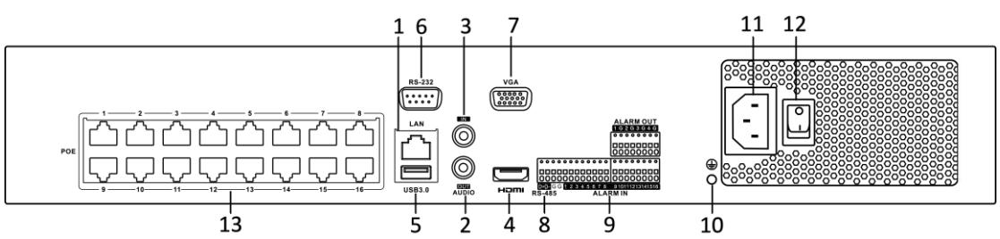

Figure 1. 9 DS-7700NI-I4/16P and DS-7700NI-K4/16P Series

The DS-7708NI-I4/8P and DS-7708NI-K4/8P provides 8 network Interfaces with PoE function.

Table 1. 5 Panel Description

| No. | Name                                                                 | Description                                                   |  |
|-----|----------------------------------------------------------------------|---------------------------------------------------------------|--|
| 1   | LAN Interface 1 network interface provided for DS-7700NI-I4/P and |                                                               |  |
|     |                                                                      | DS-7700NI-K4/P, and 2 network interfaces for DS-7700NI-I4 and |  |

| No. | Name                        | Description                                                            |  |
|-----|-----------------------------|------------------------------------------------------------------------|--|
|     |                             | DS-7700NI-K4.                                                          |  |
| 2   | AUDIO OUT                   | RCA connector for audio output.                                        |  |
| 3   | LINE IN                     | RCA connector for audio input.                                         |  |
| 4   | HDMI                        | HDMI video output connector.                                           |  |
| 5   | USB 3.0 interface           | Universal Serial Bus (USB) ports for additional devices such as USB    |  |
|     |                             | mouse and USB Hard Disk Drive (HDD).                                   |  |
| 6   | RS-232 Interface            | Connector for RS-232 devices.                                          |  |
| 7   | VGA                         | DB9 connector for VGA output. Display local video output and menu.     |  |
| 8   | RS-485 Interface            | Half-duplex connector for RS-485 devices.                              |  |
| 9   | ALARM IN                    | Connector for alarm input.                                             |  |
|     | ALARM OUT                   | Connector for alarm output.                                            |  |
| 10  | GROUND                      | Ground (needs to be connected when NVR starts up).                     |  |
| 11  | AC 100V ~ 240V              | 100V to 240VAC power supply.                                           |  |
| 12  | Power Switch                | Switch for turning on/off the device.                                  |  |
| 13  | Network Interfaces with     | Network interfaces for the cameras and to provide power over Ethernet. |  |
|     | PoE function (supported  |                                                                        |  |
|     | by DS-7700NI-I4/P and |                                                                        |  |
|     | DS-7700NI-K4/P)             |                                                                        |  |

### **1.2.3 DS-7600NI Series**

**DS-7600NI-I2(/P) and DS-7600NI-K2 (/P)** 

Figure 1. 10 DS-7600NI-I2 and DS-7600NI-K2 Series

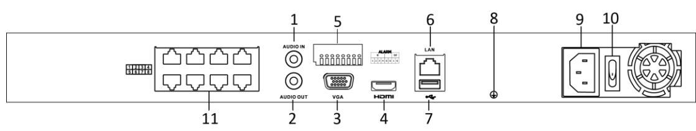

Figure 1. 11 DS-7600NI-I2/8P and DS-7600NI-K2/8P Series

The DS-7616NI-I2/16P and DS-7632NI-I2/16P provide 16 network Interfaces with PoE function.

Table 1. 6 Panel Description

| No. | Name          | Description                                                        |  |
|-----|---------------|--------------------------------------------------------------------|--|
| 1   | Audio In      | RCA connector for audio input.                                     |  |
| 2   | Audio Out     | RCA connector for audio output.                                    |  |
| 3   | VGA Interface | DB9 connector for VGA output. Display local video output and menu. |  |
| 4   | HDMIInterface | HDMI video output connector.                                       |  |

| 5  | ALARM IN                | Connector for alarm input.                                                                                          |  |
|----|-------------------------|---------------------------------------------------------------------------------------------------------------------|--|
|    | ALARM OUT               | Connector for alarm output.                                                                                         |  |
| 6  | LAN Network Interface   | 1 10/100/1000 Mbps self-adaptive Ethernet interface                                                                 |  |
| 7  | USB Interface           | Universal Serial Bus (USB 3.0) ports for additional devices such as                                                 |  |
|    |                         | USB mouse and USB Hard Disk Drive (HDD).                                                                            |  |
| 8  | Ground                  | Ground (needs to be connected when NVR starts up).                                                                  |  |
| 9  | Power Supply            | 12 VDC power supply for DS-7600NI-I4 and DS-7600NI-K4, and 100 to 240 VAC for DS-7600NI-I4/P and DS-7600NI-K4/P. |  |
|    |                         |                                                                                                                     |  |
| 10 | Power Switch            | Switch for turning on/off the device.                                                                               |  |
| 11 | Network Interfaces with |                                                                                                                     |  |
|    | PoE function            | Network interfaces for the cameras and to provide power over Ethernet.                                              |  |
|    | (supported by           |                                                                                                                     |  |
|    | DS-7600NI-I2/P)         |                                                                                                                     |  |

### **DS-7600NI-K1 and DS-7600NI-K1/4P**

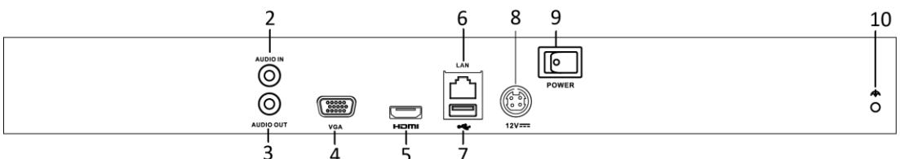

Figure 1. 12 DS-7600NI-K1 Series

Table 1. 7 Panel Description

| No. | Name                                    | Description                                                            |  |
|-----|-----------------------------------------|------------------------------------------------------------------------|--|
| 1   | Network Interfaces with PoE function | Network interfaces for the cameras and to provide power over Ethernet. |  |
| 2   | Audio In                                | RCA connector for audio input.                                         |  |
| 3   | Audio Out                               | RCA connector for audio output.                                        |  |
| 4   | VGA Interface                           | DB9 connector for VGA output. Display local video output and menu.     |  |
| 5   | HDMIInterface                           | HDMI video output connector.                                           |  |
| 6   | LAN Network Interface                   | 1 10/100/1000 Mbps self-adaptive Ethernet interface for                |  |
|     |                                         | DS-7600NI-K1;                                                          |  |
|     |                                         | 1 100 Mbps full-duplex Ethernet interface for DS-7600NI-K1/4P.         |  |
| 7   | USB Interface                           | Universal Serial Bus (USB 3.0) ports for additional devices such as    |  |
|     |                                         | USB mouse and USB Hard Disk Drive (HDD).                               |  |
| 9   | Power Supply                            | 12VDC power supply for DS-7600NI-K1 and 48 VDC power supply            |  |
|     |                                         | for DS-7600NI-K1/4P.                                                   |  |
| 10  | Ground                                  | Ground (needs to be connected when NVR starts up).                     |  |

## **Chapter 2 Installation and Connections**

## **2.1 NVR Installation**

During installation of the NVR:

- **1.** Use brackets for rack mounting.
- **2.** Ensure ample room for audio and video cables.
- **3.** When routing cables, ensure that the bend radius of the cables are no less than five times than its diameter.
- **4.** Connect the alarm cable.
- **5.** Allow at least 2cm (≈0.75-inch) of space between racks mounted devices.
- **6.** Ensure the NVR is grounded.
- **7.** Environmental temperature should be within the range of -10 to +55º C, +14 to +131º F.
- **8.** Environmental humidity should be within the range of 10% to 90%.

## **2.2 Hard Disk Installation**

### *Before you start:*

Disconnect the power from the NVR before installing a hard disk drive (HDD). A factory recommended HDD

should be used for this installation.

**Tools Required:** Screwdriver.

### **2.2.1 DS-9600NI Series**

### *Purpose:*

The following section introduces the HDD installation for the DS-9600NI-I8 and DS-9600NI-I16 series NVR. Take the example of DS-9616NI-I16 series to describe installation steps.

*Steps:* 

- **1.** Fasten the hard disk mounting handle to the hard disk with screws.
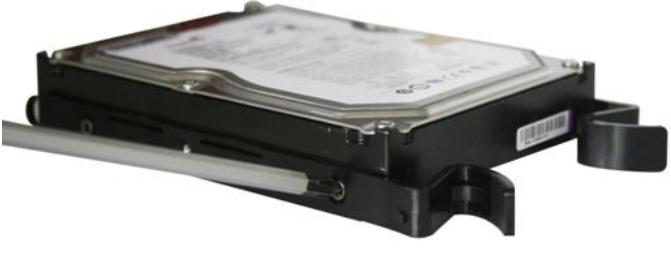

Figure 2. 1 Fasten Hard Disk

- **2.** Insert the key and turn in clockwise direction to open the panel lock.
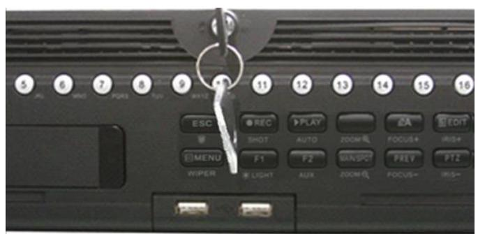

Figure 2. 2 Insert Panel Key

- **3.** Press the buttons on the panel of two sides and open the front panel.
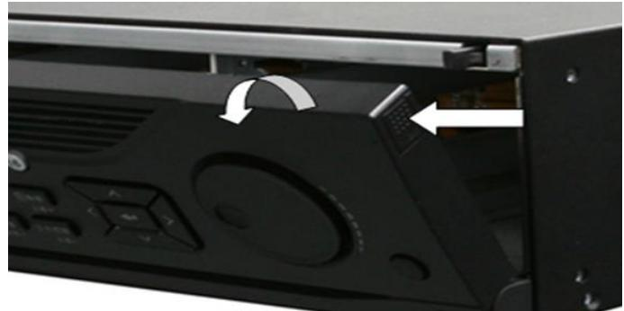

Figure 2. 3 Open Panel Lock

- **4.** Insert the hard disk along the slot until it is placed into position.
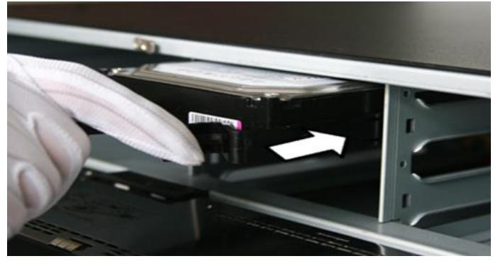

Figure 2. 4 Insert Hard Disk

- **5.** Repeat the above steps to install other hard disks onto the NVR. After having finished the installation of all hard disks, close the front panel and lock it with the key again.

Figure 2. 5 Lock Panel

### **2.2.2 Other Models**

### *Purpose:*

The following section introduces the HDD installation for the DS-7600NI and DS-7700NI series NVR. Take the example of DS-7600NI to describe installation steps.

### *Steps:*

- 1. Remove the cover from the NVR by unfastening the screws on the rear and side panel.
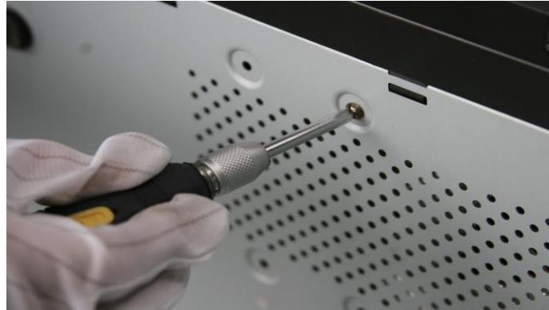

Figure 2. 6 Remove Cover

- 2. Connect one end of the data cable to the motherboard of NVR and the other end to the HDD.
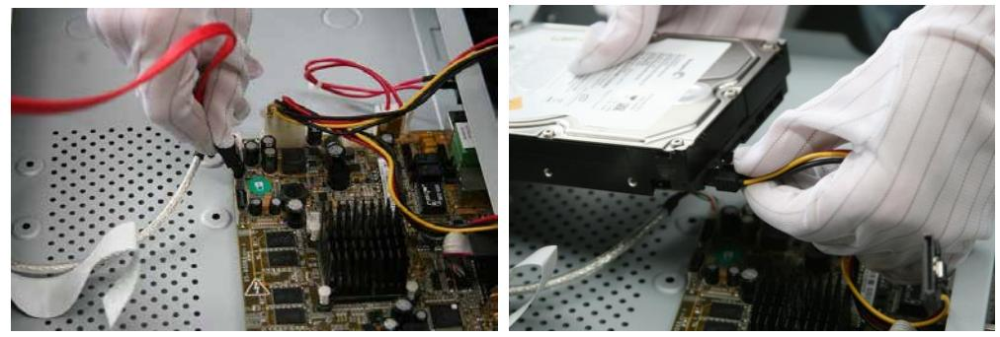

Figure 2. 7 Connect Data Cable

- 3. Connect the power cable to the HDD.
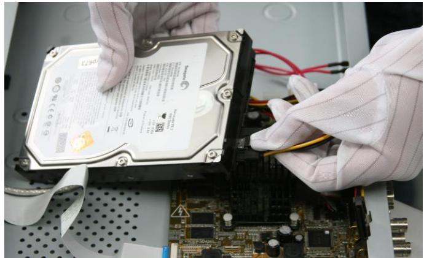

Figure 2. 8 Connect Power Cable

- 4. Place the HDD on the bottom of the device and then fasten the screws on the bottom to fix the HDD.
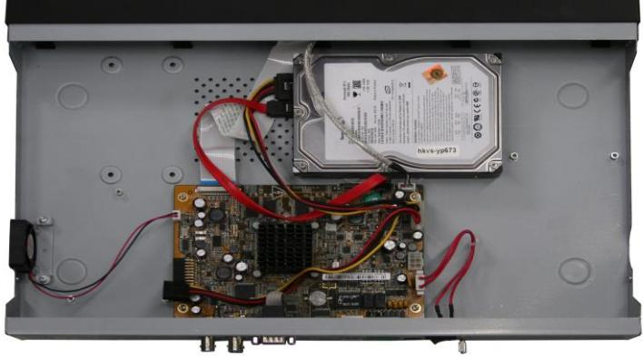

Figure 2. 9 Fix Hard Disk

### **2.3 Connections**

### **2.3.1 Alarm Input Wiring**

The alarm input is an open/closed relay. To connect the alarm input to the device, use the following diagram.

If the alarm input is not an open/close relay, please connect an external relay between the alarm input and the device.

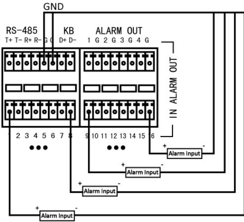

Figure 2. 10 Alarm Input Wiring

### **2.3.2 Alarm Output Wiring**

To connect to an alarm output (AC or DC load), use the following diagram:

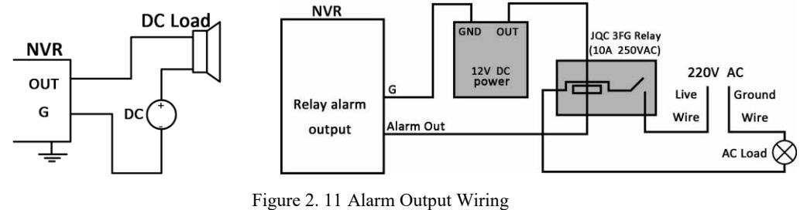

For DC load, the jumpers can be used within the limit of 12V/1A safely.

To connect an AC load, jumpers should be left open (you must remove the jumper on the motherboard in the NVR). Use an external relay for safety (as shown in the figure above).

There are 4 jumpers (JP6, JP9, JP10, and JP11) on the motherboard, each corresponding with one alarm output. By default, jumpers are connected. To connect an AC load, jumpers should be removed.

#### *Example:*

If you connect an AC load to the alarm output 3 of the NVR, then you must remove the JP 3 jumper.

### **2.3.3 Using Alarm Connectors**

To connect alarm devices to the NVR:

- 1. Disconnect *pluggable block* from the ALARM IN /ALARM OUT terminal block.
- 2. Unfasten stop screws from the *pluggable block*, insert signal cables into slots and fasten stop screws. Ensure signal cables are tight.
- 3. Connect *pluggable block* back into terminal block.

### **2.3.4 Controller Connection**

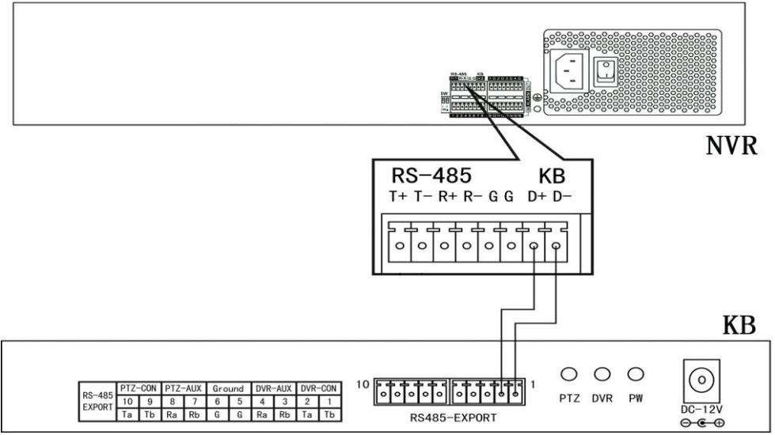

Figure 2. 12 Controller Connection

To connect a controller to the NVR:

- 1. Disconnect pluggable block from the KB terminal block.
- 2. Unfasten stop screws from the KB D+, D- *pluggable block*, insert signal cables into slots and fasten stop screws. Ensure signal cables are in tight.
- 3. Connect Ta on controller to D+ on terminal block and Tb on controller to D- on terminal block. Fasten stop screws.
- 4. Connect *pluggable block* back into terminal block.

Make sure both the controller and NVR are grounded.

## **2.4 HDD Storage Calculation Chart**

The following chart shows an estimation of storage space used based on recording at one channel for an hour at a fixed bit rate.

| Bit Rate | Storage Used |
|----------|--------------|
| 96K      | 42M          |
| 128K     | 56M          |
| 160K     | 70M          |
| 192K     | 84M          |
| 224K     | 98M          |
| 256K     | 112M         |
| 320K     | 140M         |
| 384K     | 168M         |
| 448K     | 196M         |
| 512K     | 225M         |
| 640K     | 281M         |
| 768K     | 337M         |
| 896K     | 393M         |
| 1024K    | 450M         |
| 1280K    | 562M         |
| 1536K    | 675M         |
| 1792K    | 787M         |
| 2048K    | 900M         |
| 4096K    | 1.8G         |
| 8192K    | 3.6G         |
| 16384K   | 7.2G         |

Please note that supplied values for storage space used is just for reference. The storage values in the chart are estimated by formulas and may have some deviation from actual value.

## **Chapter 3 Menu Operation**

## **3.1 Menu Structure**

Refer to the following figure for the menu structure:

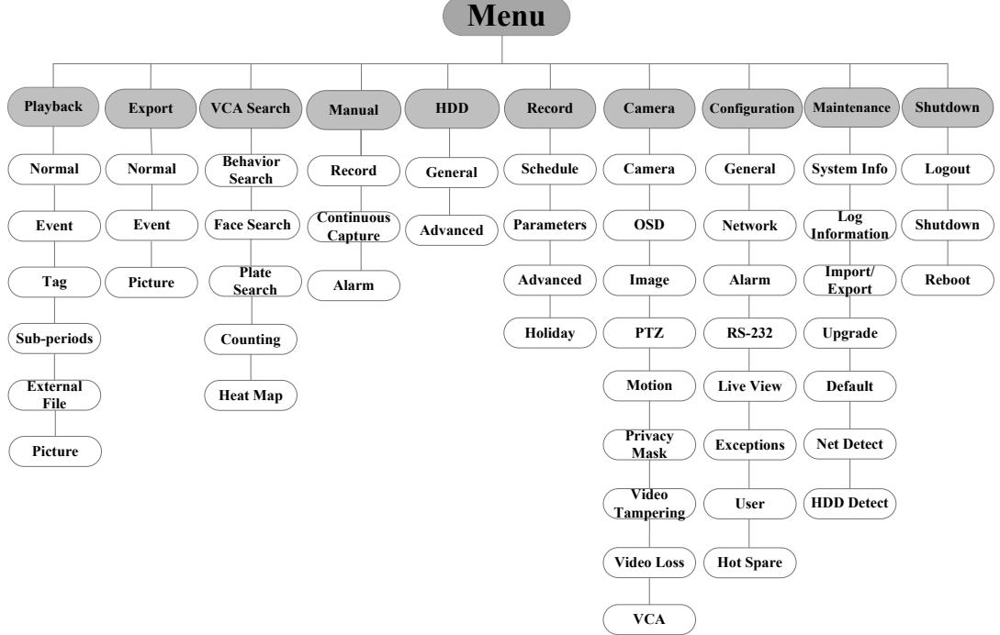

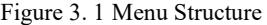

The menu structure may vary according to different models.

### **3.2 Startup and Shutdown**

Proper startup and shutdown procedures are crucial to expanding the life of the NVR. To start your NVR:

- **1.** Check the power supply is plugged into an electrical outlet. It is HIGHLY recommended that an Uninterruptible Power Supply (UPS) be used in conjunction with the device. The Power button) on the front panel should be red, indicating the device is receiving the power.
- **2.** Press the POWER button on the front panel. The Power LED should turn blue. The unit will begin to start. After the device starts up, the wizard will guide you through the initial settings, including modifying password, date and time settings, network settings, HDD initializing, and recording.

To shut down the NVR:

- **1.** Enter the Shutdown menu.
Menu > Shutdown

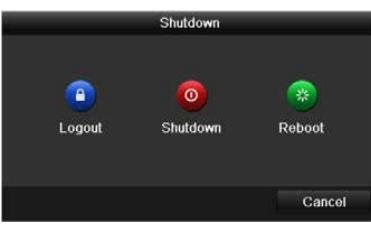

Figure 3. 2 Shutdown

- **2.** Select the **Shutdown** button.
- **3.** Click the **Yes** button.

## **3.3 Activating Your Device**

#### *Purpose:*

For the first-time access, you need to activate the device by setting an admin password. No operation is allowed before activation. You can also activate the device via Web Browser, SADP or client software.

#### *Steps:*

- **1.** Input the same password in the text field of **Create New Password** and **Confirm New Password**.
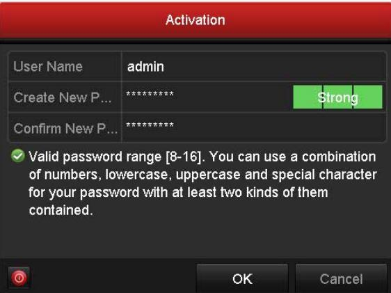

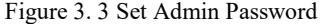

**STRONG PASSWORD RECOMMENDED***–We highly recommend you create a strong password of your own choosing (Using a minimum of 8 characters, including at least three of the following categories: upper case letters, lower case letters, numbers, and special characters.) in order to increase the security of your product. And we recommend you reset your password regularly, especially in the high security system, resetting the password monthly or weekly can better protect your product.*

- **2.** Click **OK** to save the password and activate the device.

For the old version device, if you upgrade it to the new version, the following dialog box will pop up once the

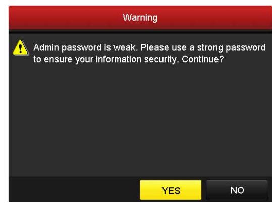

device starts up. You can click **YES** and follow the wizard to set a strong password.

Figure 3. 4 Warning of Weak Password

### **3.4 Using the Unlock Pattern for Login**

For the Admin user, you can configure the unlock pattern for device login.

After the device is activated, you can enter the following interface to configure the device unlock pattern. *Steps:* 

- 1. Use the mouse to draw a pattern among the 9 dots on the screen. Release the mouse when the pattern is done.
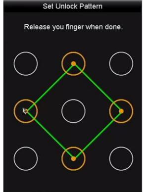

Figure 3. 5 Draw the Pattern

- Connect at least 4 dots to draw the pattern.
- Each dot can be connected for once only.
- 2. Draw the same pattern again to confirm it. When the two patterns match, the pattern is configured successfully.
- 3. You can use the configured unlock pattern for future login.

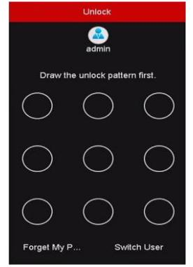

Figure 3. 6 Draw the Unlock Pattern

## **3.5 Login and Logout**

### **3.5.1 User Login**

*Purpose:* 

If NVR has logged out, you must login the device before operating the menu and other functions.

### *Steps:*

- 1. Select the **User Name** in the dropdown list.

| Login     |       |    |        |  |
|-----------|-------|----|--------|--|
| User Name | admin |    | >      |  |
| Password  |       |    |        |  |
|           |       |    |        |  |
|           |       |    |        |  |
|           |       | OK | Cancel |  |

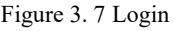

- 2. Input **Password**.
- 3. Click **OK** to log in.

In the Login dialog box, if you enter the wrong password 7 times, the current user account will be locked for 60 seconds.

|                                               | Login     |                                        |        |  |
|-----------------------------------------------|-----------|----------------------------------------|--------|--|
|                                               | User Name | admin                                  |        |  |
| Attention                                     | Password  |                                        |        |  |
| Incorrect password. The account is locked. |           | The account will unlock in 48 seconds. |        |  |
| OK                                            |           | OK                                     | Cancel |  |

Figure 3. 8 Account Lock

### **3.5.2 User Logout**

### *Purpose:*

After logging out, the monitor turns to the live view mode and if you want to perform any operations, you need to enter user name and password log in again.

### *Steps:*

- 1. Enter the Shutdown menu.
Menu > Shutdown

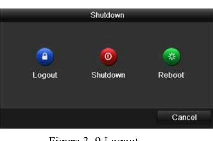

Figure 3. 9 Logout

### 2. Click **Logout**.

After you have logged out the system, menu operation on the screen is invalid. It is required to input a user name and password to unlock the system.

## **3.6 Using the Setup Wizard**

The Setup Wizard can walk you through some important settings of the device. By default, the Setup Wizard starts once the device has loaded.

Check the checkbox to enable Setup Wizard when device starts. Click **Next** to continue the setup wizard. Follow the guide of the Setup Wizard to configure the system resolution, system date/time, network settings, HDD management, record settings, etc.

|             | Wizard                                 |      |      |
|-------------|----------------------------------------|------|------|
| Time Zone   | (GMT+08:00) Beijing, Urumqi, Singapore |      | >    |
| Date Format | MM-DD-YYYY                             |      | >    |
| System Date | 04-23-2015                             |      | I    |
| System Time | 20:30:39                               |      | 0    |
|             |                                        |      |      |
|             | Previous                               | Next | Exit |

Figure 3. 10 Wizard

### **3.7 Network Settings**

#### *Purpose:*

Network settings must be properly configured before you operate NVR over network.

#### *Steps:*

- 1. Enter the Network Settings interface.
	- Menu > Configuration > Network

| Working Mode          |                     | Net Fault-tolerance          |            |                                            | S |
|-----------------------|---------------------|------------------------------|------------|--------------------------------------------|---|
| Select NIC            |                     | bondo                        |            |                                            | > |
| NIC Type              |                     | 10M/100M/1000M Self-adaptive |            |                                            | S |
| Enable DHCP           |                     | ്ട്ര                         |            |                                            |   |
| IPv4 Addre  10 .16 .1 |                     | .96                          |            | IPv6 Addre  fe80 :: c256:e3ff:fe2b:e1e1/64 |   |
| IPv4 Subn             | 255 . 255 . 255 . 0 |                              | IPv6 Addre |                                            |   |
| IPv4 Defa             | .16 . 1 10       | .254                         | IPv6 Defa  |                                            |   |
| MAC Address           |                     | c0:56:e3:2b:e1:e1            |            |                                            |   |
| MTU(Bytes)            |                     | 1500                         |            |                                            |   |
| Preferred DNS Server  |                     |                              |            |                                            |   |
| Alternate DNS Server  |                     |                              |            |                                            |   |
| Main NIC              |                     | LAN1                         |            |                                            |   |
|                       |                     |                              |            |                                            |   |
|                       |                     |                              |            | Back Apply                              |   |

Figure 3. 11 Network Settings

- Two self-adaptive 10M/100M/1000M network interfaces for DS-9600NI-I8, DS-9600NI-I16, DS-8600NI-K8, DS-7700NI-I4 and DS-7700NI-K4, and the multi-address and network fault tolerance working modes are configurable.
- One self-adaptive 10M/100M/1000M network interface for DS-7600NI-K2/I2(/P), DS-7700NI-I4/P and DS-7700NI-K4/P.
- One self-adaptive 10M/100M network interface for DS-7600NI-K1 (/P).
- 2. Select the **General** tab.
- 3. In the **General Settings** interface, you can configure the following settings: NIC Type, IPv4 Address, IPv4 Gateway, MTU and DNS Server.

If the DHCP server is available, you can check the checkbox of **DHCP** to automatically obtain an IP address and other network settings from that server.

- 4. After having configured the general settings, click the **Apply** button to save the settings.
## **3.8 Adding IP Cameras**

#### *Purpose:*

Before you can get live video or record the video files, you should add the network cameras to the connection list of the device.

#### *Before you start:*

Ensure the network connection is valid and correct, and the IP camera to add has already been activated. Please

refer to the *User Manual* for activating the inactive IP camera.

You can select one of the following three options to add the IP camera.

### **OPTION 1:**

### *Steps:*

- 1. Click to select an idle window in the live view mode.
- 2. Click the icon in the center of the window to pop up the Add IP Camera interface.

|                   |             |            | Add IP Camera      |             |        |
|-------------------|-------------|------------|--------------------|-------------|--------|
| No.               |             | IP Address | Amount of Channels | Device Type | P      |
|                   |             | 10.16.1.14 | 1                  | IPC         | H      |
| 1                 | 1 - - |            |                    |             |        |
| IP Camera Address |             | 10.16.1.14 |                    |             |        |
| Protocol          |             | ONVIF      |                    |             |        |
| Management Port   |             | 80         |                    |             |        |
| Channel Port      |             | 1          |                    |             | 2      |
| Transfer Protocol |             | Auto       |                    |             | >      |
| User Name         |             | admin      |                    |             |        |
| Admin Password    |             |            |                    |             |        |
|                   |             |            | Search             | Add         | Cancel |

Figure 3. 12 Add IP Camera

- 3. Select the detected IP camera and click the **Add** button to add it directly, and you can click the **Search** button to refresh the online IP camera manually.
Or you can choose to custom add the IP camera by editing the parameters in the corresponding text field and then click the **Add** button to add it.

## **3.9 Live View**

Icons are provided on screen in Live View mode to indicate camera status. These icons include:

#### **Live View Icons**

In the live view mode, there are icons at the upper-right corner of the screen for each channel, showing the status of the record and alarm in the channel for quick reference.

Alarm (video loss, tampering, motion detection, VCA or sensor alarm)

Record (manual record, continuous record, motion detection, VCA or alarm triggered record)

Alarm and Record

Event/Exception (event and exception information, appears at the lower-left corner of the screen.)

## **3.10 One-Touch RAID Configuration**

The RAID is supported by DS-9600NI-I8 and DS-9600NI-I16 series NVR only.

#### *Purpose:*

The device supports the RAID storage function. Through one-touch configuration, you can quickly create the disk array. By default, the array type to be created is RAID 5.

#### *Before you start:*

As the default array type is RAID 5, at least 3 HDDs must be installed in you device. And if more than 10 HDDs are installed, 2 arrays can be configured.

#### *Steps:*

- 1. Enter the Physical Disk Settings interface.
	- Menu > HDD > RAID

|         | Capacity Array | Type   | Status     | Model             |        |
|---------|----------------|--------|------------|-------------------|--------|
| 1       | 931.51GB       | Normal | Functional | ST31000340NS      | 19     |
| 3 1  | 931.51GB       | Normal | Functional | ST31000526SV      | 19     |
| 5 11 | 931.51GB       | Normal | Functional | WDC WD10EVVS-6  ■ |        |
| 7       | 931.51GB       | Normal | Functional | WDC WD10EVVS-6  厨 |        |
|         |                |        |            |                   |        |
|         |                |        |            | One-touch C       | Create |

Figure 3. 13 RAID Settings Interface

- 2. Click **One-touch Configuration** to enter the One-touch Array Configuration interface.
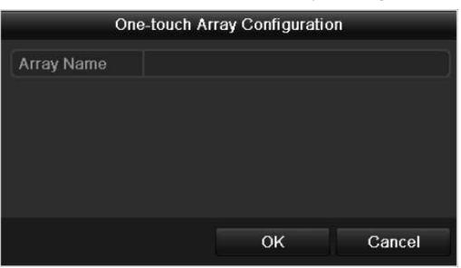

Figure 3. 14 One-touch Array Configuration

3. Edit the array name in the **Array Name** text field and click **OK** button to start configuring array.

If you install 4 HDDs or more for one-touch configuration, a hot spare disk will be set by default. It is

recommended to set a hot spare disk for automatically rebuilding the array when the array is abnormal.

- **4.** When the array configuration is completed, click **OK** button in the pop-up message box to finish the settings**.**
## **3.11 Recording Settings**

### *Before you start:*

Make sure that the disk has already been installed. If not, please install a disk and initialize it. You may refer to the user manual for detailed information.

### *Purpose:*

Two kinds of record types are introduced in the following section, including Instant Record and All-day Record. And for other record types, you may refer to the user manual for detailed information.

After rebooting all the manual records enabled are canceled.

#### *Steps:*

- 1. On the live view window, right lick the window and move the cursor to the **Start Recording** option, and select **Continuous Record** or **Motion Detection Record** on your demand.
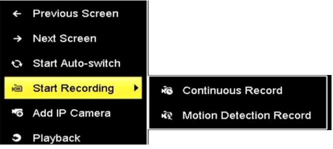

Figure 3. 15 Start Recording from Right-click Menu

- 2. Click the **Yes** button in the pop-up Attention message box to confirm the settings. All the channels will start to record in the selected mode.
## **3.12 Playback**

The recorded video files on the hard disk can be played back in the following modes: instant playback, all-day

playback for the specified channel, and playback by normal/event/smart/tag/sub-periods/external file search.

#### *Steps:*

- **1.** Enter playback interface.
Click menu>playback or from the right-click menu.

- **2.** Check the checkbox of channel(s) in the channel list and then double-click to select a date on the calendar.
- **3.** You can use the toolbar in the bottom part of Playback interface to control playing progress.

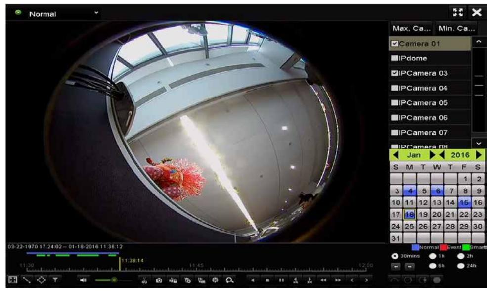

Figure 3. 16 Playback Interface

Select the channel(s) to or execute simultaneous playback of multiple channels.

## **Chapter 4 Accessing by Web Browser**

You shall acknowledge that the use of the product with Internet access might be under network security risks. For avoidance of any network attacks and information leakage, please strengthen your own protection. If the product does not work properly, please contact with your dealer or the nearest service center.

#### *Purpose:*

You can get access to the device via web browser. You may use one of the following listed web browsers: Internet Explorer 6.0, Internet Explorer 7.0, Internet Explorer 8.0, Internet Explorer 9.0, Internet Explorer 10.0, Apple Safari, Mozilla Firefox, and Google Chrome. The supported resolutions include 1024*768 and above.

#### *Steps:*

- 1. Open web browser, input the IP address of the device and then press Enter.
- 2. Login to the device.
	- If the device has not been activated, you need to activate the device first before login.

| Activation |                                                                                                                                                                                        |        |
|------------|----------------------------------------------------------------------------------------------------------------------------------------------------------------------------------------|--------|
| User Name  | admin                                                                                                                                                                                  |        |
| Password   |                                                                                                                                                                                        | Strong |
|            | Valid password range [8-16]. You can use a combination of numbers, lowercase, uppercase and special character for your password with at least two kinds of them contained. |        |
| Confirm    |                                                                                                                                                                                        |        |
|            |                                                                                                                                                                                        | OK     |

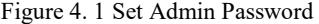

- 1) Set the password for the admin user account.
- 2) Click **OK** to login to the device.

 If the device is already activated, enter the user name and password in the login interface, and click the **Login** button.

**STRONG PASSWORD RECOMMENDED***– We highly recommend you create a strong password of your own choosing (using a minimum of 8 characters, including upper case letters, lower case letters, numbers, and special characters) in order to increase the security of your product. And we recommend you reset your password regularly, especially in the high security system, resetting the password monthly or weekly can better protect your product.* 

| 이 admin |
|------------|
| al      |
|            |
| Login      |
|            |
|            |

Figure 4. 2 Login

- 3. Install the plug-in before viewing the live video and managing the camera. Please follow the installation prompts to install the plug-in.
You may have to close the web browser to finish the installation of the plug-in.

After login, you can perform the operation and configuration of the device, including the live view, playback, log search, configuration, etc.

**0304021060201**

34

Network Video Recorder Quick Start Guide