## Network Covert Camera

Quick Start Guide

#### *UD04315B*

**1**

#### **Quick Start Guide**

COPYRIGHT © 2017 Hangzhou Hikvision Digital Technology Co., Ltd.

## **ALL RIGHTS RESERVED.**

Any and all information, including, among others, wordings, pictures, graphs are the properties of Hangzhou Hikvision Digital Technology Co., Ltd. or its subsidiaries (hereinafter referred to be "Hikvision"). This user manual (hereinafter referred to be "the Manual") cannot be reproduced, changed, translated, or distributed, partially or wholly, by any means, without the prior written permission of Hikvision. Unless otherwise stipulated, Hikvision does not make any warranties, guarantees or representations, express or implied, regarding to the Manual.

#### **About this Manual**

This Manual is applicable to 64xx Network Camera.

The Manual includes instructions for using and managing the product. Pictures, charts, images and all other information hereinafter are for description and explanation only. The information contained in the Manual is subject to change, without notice, due to firmware updates or other reasons. Please find the latest version in the company website

(http://overseas.hikvision.com/en/).

Please use this user manual under the guidance of professionals.

## **Trademarks Acknowledgement**

and other Hikvision's trademarks and logos are the properties of Hikvision in various jurisdictions. Other trademarks and logos mentioned below are the properties of their respective owners.

**2**

#### **Legal Disclaimer**

TO THE MAXIMUM EXTENT PERMITTED BY APPLICABLE LAW, THE PRODUCT DESCRIBED, WITH ITS HARDWARE, SOFTWARE AND FIRMWARE, IS PROVIDED "AS IS", WITH ALL FAULTS AND ERRORS, AND HIKVISION MAKES NO WARRANTIES, EXPRESS OR IMPLIED, INCLUDING WITHOUT LIMITATION, MERCHANTABILITY, SATISFACTORY QUALITY, FITNESS FOR A PARTICULAR PURPOSE, AND NON-INFRINGEMENT OF THIRD PARTY. IN NO EVENT WILL HIKVISION, ITS DIRECTORS, OFFICERS, EMPLOYEES, OR AGENTS BE LIABLE TO YOU FOR ANY SPECIAL, CONSEQUENTIAL, INCIDENTAL, OR INDIRECT DAMAGES, INCLUDING, AMONG OTHERS, DAMAGES FOR LOSS OF BUSINESS PROFITS, BUSINESS INTERRUPTION, OR LOSS OF DATA OR DOCUMENTATION, IN CONNECTION WITH THE USE OF THIS PRODUCT, EVEN IF HIKVISION HAS BEEN ADVISED OF THE POSSIBILITY OF SUCH DAMAGES.

REGARDING TO THE PRODUCT WITH INTERNET ACCESS, THE USE OF PRODUCT SHALL BE WHOLLY AT YOUR OWN RISKS. HIKVISION SHALL NOT TAKE ANY RESPONSIBILITES FOR ABNORMAL OPERATION, PRIVACY LEAKAGE OR OTHER DAMAGES RESULTING FROM CYBER ATTACK, HACKER ATTACK, VIRUS INSPECTION, OR OTHER INTERNET SECURITY RISKS; HOWEVER, HIKVISION WILL PROVIDE TIMELY TECHNICAL SUPPORT IF REQUIRED.

SURVEILLANCE LAWS VARY BY JURISDICTION. PLEASE CHECK ALL RELEVANT LAWS IN YOUR JURISDICTION BEFORE USING THIS PRODUCT IN ORDER TO ENSURE THAT YOUR USE CONFORMS THE APPLICABLE LAW. HIKVISION SHALL NOT BE LIABLE IN THE EVENT THAT THIS PRODUCT IS USED WITH ILLEGITIMATE PURPOSES.

**3**

IN THE EVENT OF ANY CONFLICTS BETWEEN THIS MANUAL AND THE APPLICABLE LAW, THE LATER PREVAILS.

## **Regulatory Information**

## **FCC Information**

Please take attention that changes or modification not expressly approved by the party responsible for compliance could void the user's authority to operate the equipment.

**FCC compliance:** This equipment has been tested and found to comply with the limits for a Class B digital device, pursuant to part 15 of the FCC Rules. These limits are designed to provide reasonable protection against harmful interference in a residential installation. This equipment generates, uses and can radiate radio frequency energy and, if not installed and used in accordance with the instructions, may cause harmful interference to radio communications. However, there is no guarantee that interference will not occur in a particular installation. If this equipment does cause harmful interference to radio or television reception, which can be determined by turning the equipment off and on, the user is encouraged to try to correct the interference by one or more of the following measures:

—Reorient or relocate the receiving antenna.

—Increase the separation between the equipment and receiver.

—Connect the equipment into an outlet on a circuit different from that to which the receiver is connected.

—Consult the dealer or an experienced radio/TV technician for help.

## **FCC Conditions**

This device complies with part 15 of the FCC Rules. Operation is subject to the following two conditions:

1. This device may not cause harmful interference.

2. This device must accept any interference received, including interference that may cause undesired operation.

## **EU Conformity Statement**

This product and - if applicable - the supplied accessories too are marked with "CE" and comply therefore with the applicable harmonized European **4**

standards listed under the EMC Directive 2014/30/EU, the RoHS Directive 2011/65/EU

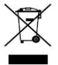

2012/19/EU (WEEE directive): Products marked with this symbol cannot be disposed of as unsorted municipal waste in the European Union. For proper recycling, return this product to your local supplier

upon the purchase of equivalent new equipment, or dispose of it at designated collection points. For more information see: www.recyclethis.info

2006/66/EC (battery directive): This product contains a battery that cannot be disposed of as unsorted municipal waste in the European Union. See the product documentation for specific battery information. The battery is marked with this symbol,

which may include lettering to indicate cadmium (Cd), lead (Pb), or mercury (Hg). For proper recycling, return the battery to your supplier or to a designated collection point. For more information see: www.recyclethis.info

## **Industry Canada ICES-003 Compliance**

This device meets the CAN ICES-3 (B)/NMB-3(B) standards requirements.

## **Safety Instruction**

These instructions are intended to ensure that user can use the product correctly to avoid danger or property loss.

The precaution measure is divided into "Warnings" and "Cautions"

**Warnings:** Serious injury or death may occur if any of the warnings are neglected.

**Cautions:** Injury or equipment damage may occur if any of the cautions are neglected.

| Warnings Follow these safeguards to prevent serious injury or death. | Cautions Follow these precautions to prevent potential injury or material damage. |
|-------------------------------------------------------------------------------|-----------------------------------------------------------------------------------------|

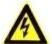

## **Warnings**

- Proper configuration of all passwords and other security settings is the responsibility of the installer and/or end-user.
- In the use of the product, you must be in strict compliance with the electrical safety regulations of the nation and region. Please refer to technical specifications for detailed information.

- Input voltage should meet both the SELV (Safety Extra Low Voltage) and the Limited Power Source with 24 VAC or 12 VDC according to the IEC60950-1 standard. Please refer to technical specifications for detailed information.
- Do not connect several devices to one power adapter as adapter overload may cause over-heating or a fire hazard.
- Please make sure that the plug is firmly connected to the power socket. When the product is mounted on wall or ceiling, the device shall be firmly fixed.
- If smoke, odor or noise rise from the device, turn off the power at once and unplug the power cable, and then please contact the service center.

- Make sure the power supply voltage is correct before using the camera.
- Do not drop the camera or subject it to physical shock.
- Do not touch sensor modules with fingers. If cleaning is necessary, use clean cloth with a bit of ethanol and wipe it gently. If the camera will not be used for an extended period, please replace the lens cap to protect the sensor from dirt.
- Do not aim the camera at the sun or extra bright places. Blooming or smearing may occur otherwise (which is not a malfunction), and affect the endurance of sensor at the same time.

- The sensor may be burned out by a laser beam, so when any laser equipment is in using, make sure that the surface of sensor will not be exposed to the laser beam.
- Do not place the camera in extremely hot, cold (the operating temperature shall be-30°C ~+60°C, or -40°C ~ +60°C if the camera model has an "H" in its suffix), dusty or damp locations, and do not expose it to high electromagnetic radiation.
- To avoid heat accumulation, good ventilation is required for operating environment.
- Keep the camera away from liquid while in use.
- While in delivery, the camera shall be packed in its original packing, or packing of the same texture.
- Regular part replacement: a few parts (e.g. electrolytic capacitor) of the equipment shall be replaced regularly according to their average enduring time. The average time varies because of differences between operating environment and using history, so regular checking is recommended for all the users. Please contact with your dealer for more details.
- Improper use or replacement of the battery may result in hazard of explosion. Replace with the same or equivalent type only. Dispose of used batteries according to the instructions provided by the battery manufacturer.
- If the product does not work properly, please contact your dealer or the nearest service center. Never attempt to disassemble the camera yourself. (We shall not assume any responsibility for problems caused by unauthorized repair or maintenance.)

## **Table of Contents**

| 1 Appearance Description 10               |    |  |  |  |
|----------------------------------------------|----|--|--|--|
| 1.1 General Appearance                       | 10 |  |  |  |
| 1.2 Front Panel                              | 11 |  |  |  |
| 1.3 Rear Panel                               | 13 |  |  |  |
| 1.4 Sensor Units                             | 14 |  |  |  |
| 2 Installation                               | 19 |  |  |  |
| 2.1 Installing the Main Unit                 | 19 |  |  |  |
| 2.2 Installing the Block-Shaped Sensor Unit  | 21 |  |  |  |
| 2.2.1 Concealed Mounting                     | 21 |  |  |  |
| 2.2.2 Exposed Mounting                       | 23 |  |  |  |
| 2.2.3 Mounting with Pole-Shaped Bracket      | 25 |  |  |  |
| Installing the Cylindrical Sensor Unit       | 33 |  |  |  |
| Installing the Fixed Focal Sensor Unit       | 35 |  |  |  |
| 2.5 Installing the Ball-Shaped Sensor Unit   | 39 |  |  |  |
| 2.5.1 Mounting with the Included Bracket     | 39 |  |  |  |
| 2.5.2 Mounting with a Incline Bracket        | 43 |  |  |  |
| 3 Setting the Network Camera over the LAN    | 47 |  |  |  |
| Wiring                                       | 47 |  |  |  |
| Activating the Camera                        | 48 |  |  |  |
| Activation via Web Browser                   | 48 |  |  |  |
| Activation via SADP Software                 | 49 |  |  |  |
| Modifying the IP Address                     | 51 |  |  |  |
| 4 Accessing via Web Browser                  | 54 |  |  |  |
| 5 Operating via Hik-Connect App              | 56 |  |  |  |
| 5.1 Enable Hik-Connect Service on Camera     | 56 |  |  |  |
| Enable Hik-Connect Service via SADP Software | 56 |  |  |  |

| Enable Hik-Connect Service via Web Browser | 57 |
|--------------------------------------------|----|
| 5.2 Hik-Connect Setup                      | 59 |
| 5.3 Adding Camera to Hik-Connect           | 59 |
| 5.4 Initializing the Memory Card           | 61 |

0504051070109

# **1 Appearance Description**

## **1.1 General Appearance**

The general appearance of the covert camera is shown below:

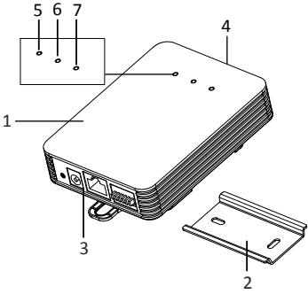

Figure 1-1 General Appearance

Table 1-1 Description of the General Appearance

| No. | Description   |
|-----|---------------|
| 1   | Main unit     |
| 2   | Mounting rail |

| Network Covert Camera·Quick Start Guide |  |  |
|-----------------------------------------|--|--|
|-----------------------------------------|--|--|

| No. | Description                                                       |                                                                                               |  |
|-----|-------------------------------------------------------------------|-----------------------------------------------------------------------------------------------|--|
| 3   | Rear panel                                                        |                                                                                               |  |
| 4   | Front panel                                                       |                                                                                               |  |
| 5   | Solid red: Power-on POWER Indicator LED Unlit: Power-off |                                                                                               |  |
| 6   | STATUS Indicator LED                                           | Solid green: The camera works properly. Unlit: The camera does not work properly. |  |
| 7   | LINK Indicator LED                                          | Flashing amber: Network properly connected. Unlit: Network disconnected.                |  |

## **1.2 Front Panel**

The covert camera equips with three types of front panel, as shown in Figure 1-2, Figure 1-3, and Figure 1-4. 

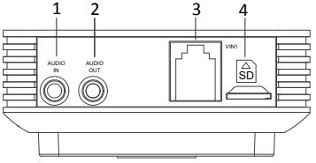

Figure 1-2 The Type I Front Panel

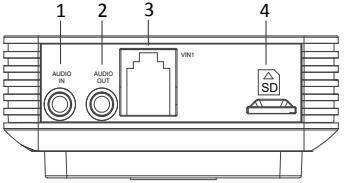

Figure 1-3 The Type II Front Panel

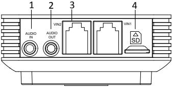

Figure 1-4 The Type III Front Panel

Table 1-2 Description of the Front Panel

| No. | Description                          |
|-----|--------------------------------------|
| 1   | Audio input                          |
| 2   | Audio output                         |
| 3   | RJ-12 video input interface(s) |
| 4   | MicroSD card slot                    |

## **1.3 Rear Panel**

The rear panel of the covert camera is shown in Figure 1-5.

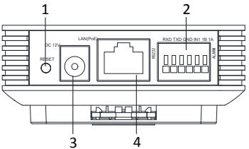

Figure 1-5 Rear Panel

Table 1-3 Description of the Rear Panel

| No. | Description                                        |
|-----|----------------------------------------------------|
| 1   | Reset                                              |
| 2   | Power input                                        |
| 3   | RS-232 and alarm input and output interfaces |
| 4   | Ethernet interface with PoE function            |

## **1.4 Sensor Units**

The different covert camera model is equipped with four different types of sensor unit, including block-shaped sensor unit, cylindrical sensor unit, fixed focal sensor unit and ball-shaped sensor unit.

**Type I: Block-Shaped Sensor Unit**

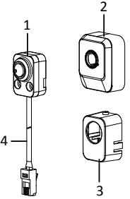

Figure 1-6 Block-Shaped Sensor Unit

Table 1-4 Description of the Block-Shaped Sensor Unit

| No. | Description                             |
|-----|-----------------------------------------|
| 1   | Block-Shaped sensor unit                |
| 2   | Decorative cover                        |
| 3   | Straight mounting bracket               |
| 4   | Video output cable with RJ-12 interface |

**Type II: Cylindrical Sensor Unit** 

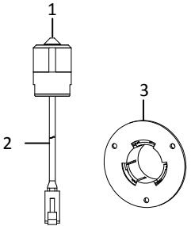

Figure 1-7 Cylindrical Sensor Unit

Table 1-5 Description of the Block-Shaped Sensor Unit

| No. | Description                             |
|-----|-----------------------------------------|
| 1   | Cylindrical Sensor Unit                 |
| 2   | Video output cable with RJ-12 interface |
| 3   | Round Rail Mounting Bracket             |

**Type III: Fixed Focal Sensor Unit** 

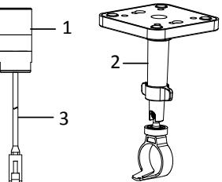

Figure 1-8 Fixed Focal Sensor Unit

Table 1-6 Description of the Block-Shaped Sensor Unit

| No. | Description                             |
|-----|-----------------------------------------|
| 1   | Fixed Focal Camera                      |
| 2   | Ceiling Mounting Bracket                |
| 3   | Video output cable with RJ-12 interface |

## **Type IV: Ball-Shaped Sensor Unit**

The ball-shaped sensor unit has two models with different

communication interfaces, the RJ-12 interface and M12 interface.

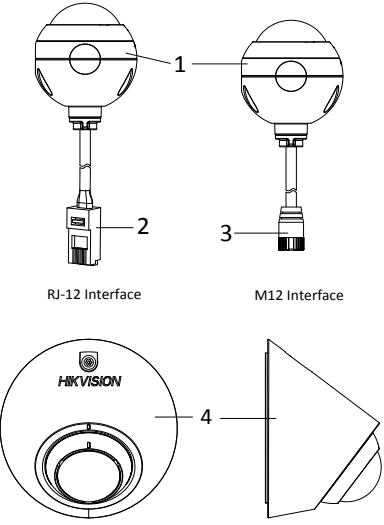

Figure 1-9 Ball-Shaped Sensor Unit and Included Bracket

Table 1-7 Description of Ball-Shaped Sensor Unit

| No. | Description                             |
|-----|-----------------------------------------|
| 1   | Ball-Shaped Sensor Unit                 |
| 2   | Video output cable with RJ-12 interface |
| 3   | Video out cable with M12 aviation plug  |
| 4   | Bracket Included                        |

# **2 Installation**

#### *Before you start:*

- Make sure the device in the package is in good condition and all the assembly parts are included.
- The standard power supply is 12 V DC or 24 V AC, please make sure your power supply matches with your camera.
- Make sure all the related equipment is power-off during the installation.
- Check the specification of the products for the installation environment.
- Make sure that the wall is strong enough to withstand four times the weight of the camera and the bracket.

For the camera that supports IR, you are required to pay attention to the following precautions to prevent IR reflection:

- Make sure that there is no reflective surface too close to the camera lens. The IR light from the camera may reflect back into the lens causing reflection.
## **2.1 Installing the Main Unit**

## *Steps:*

- Secure the mounting rail onto the installation surface with the supplied screws.
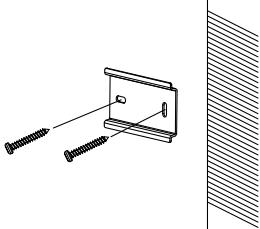

Figure 2-1 Secure the Mounting Rail

- Secure the bracket on the rear surface of the main unit with corresponding screws.
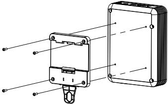

Figure 2-2 Secure Bracket onto Main Unit

Do not upside down the main unit when you fasten the bracket.

- Hang the main unit together with the bracket to the mounting rail and complete the installation.
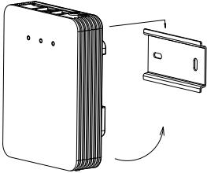

Figure 2-3 Hang the Main Unit

## **2.2 Installing the Block-Shaped Sensor Unit**

This series of camera support concealed mounting and exposed mounting with a decorative cover.

## **2.2.1 Concealed Mounting**

Please make sure that the mounting surface is suitable for adhesive pasting.

## *Steps:*

- 1. Drill on the mounting surface, as shown in Figure 2-4.
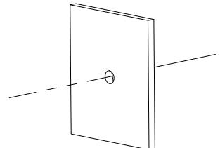

Drill on the Surface

Make sure the drilling hole is big enough for the camera lens.

- 2. Remove a side of the adhesive tape on the bracket. Paste the bracket on mounting surface by aligning with the drilled hole.
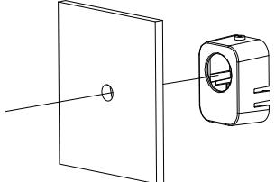

Paste the Bracket

- 3. Install the block-shaped sensor unit into the bracket and make it to be buckled.
- 4. Tighten the fastening screw on the top of the bracket.
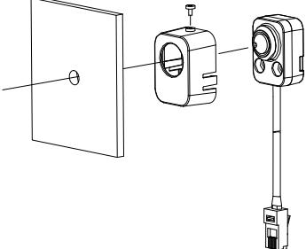

Insert the Block-shaped Sensor Unit

## **2.2.2 Exposed Mounting**

## *Steps:*

- Fix the Block-shaped sensor unit on the mounting surface with screws, as shown in Figure 2-7.
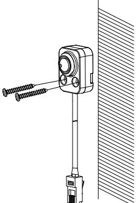

Fix the Block-shaped Sensor Unit

- For cement surface mounting, you need to use the expansion screw to fix the camera.
- For wooden surface mounting, you can just use the self-tapping screw to fix the camera.
- 5. Shield the sensor unit with the decorative cover. As shown in Figure 2-8.

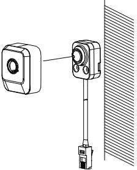

Hood the Cover

## **2.2.3 Mounting with Pole-Shaped Bracket**

If you purchase the camera with a pole-shaped mounting bracket,

follow the steps to complete installation of the lens and the bracket.

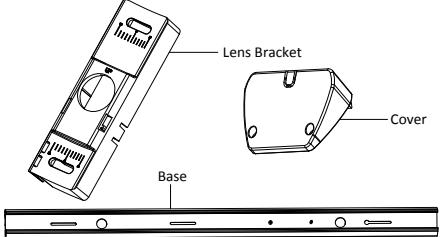

Pole-Shaped Bracket Component

## *Steps:*

- 1. Fit the lens and the lens cable into the lens bracket as shown below.
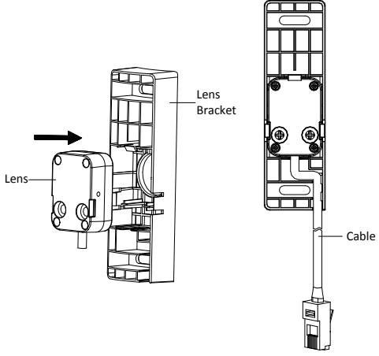

Fit Lens and Lens Cable into Lens Bracket

- 2. Make a mark at a height of 1.83m (6ft.) on wall (or other desired mounting position). Align the "1.83m (6ft.)" sticker on base with the mark on wall. Then, mark the first expansion screw hole as shown in the figure below.
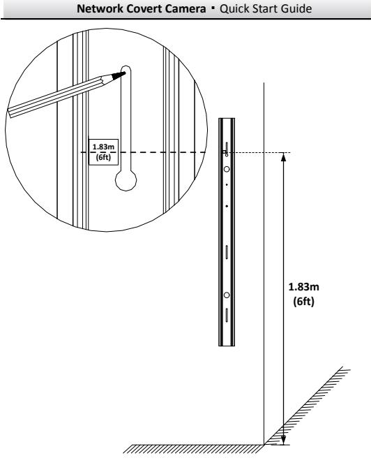

Marking for Installation

- 3. Install the first expansion screw loosely and hang the bracket base on the screw.
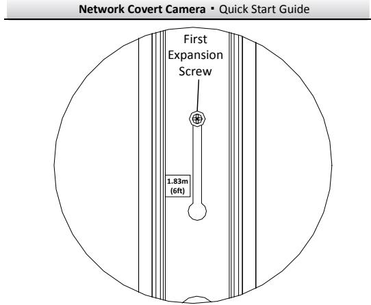

Hang the Bracket Base

- 4. Plan and prepare cable routing. This bracket supports cable routing through wall and on surface, select one way according to your actual needs.
	- 1). If you choose to route cable through wall, drill a cable hole according to the size and height of cable hole on the base. See Figure 2-13.
	- 2). If you choose to route cable on surface, make a cable hole on the top or bottom cover. See Figure 2-13.

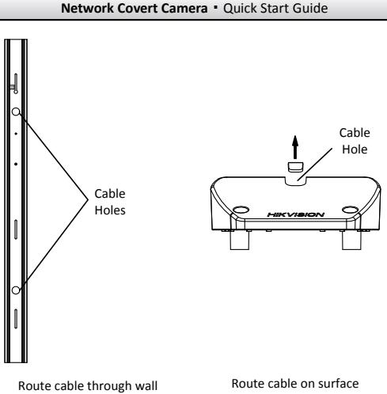

Plan Cable Routing

- 5. Route cable and fit the lens bracket into the base. Use a screw to secure the lens bracket. See Figure 2-14.
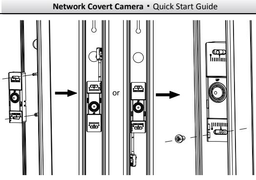

Install and Secure Lens Bracket

- 6. Loosely screw the thumbscrew to the base. Adjust the panning position of the lens, and tighten the thumbscrew.
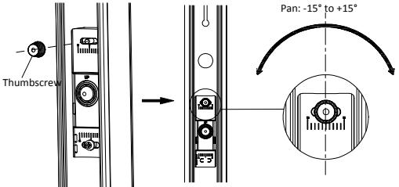

Install Thumbscrew and Adjust Panning Position

- 7. Screw the top cover to the base.
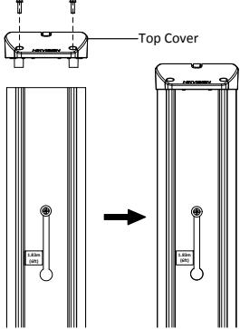

Install Top Cover

- 8. Install the second expansion screw. Tighten the first expansion screw. See Figure 2-17.
- 9. Peel off protective films on both side of the decorative cover. Slide the decorative cover in the base. See Figure 2-18.

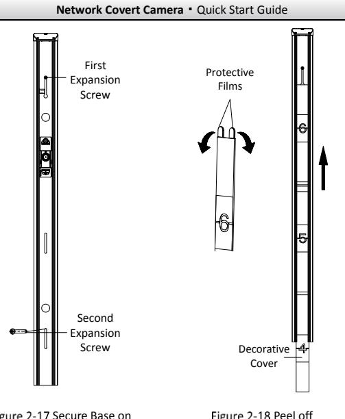

Secure Base on Wall 

Peel off Protective Films and Slide the Decorative Cover in the Base

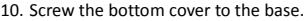

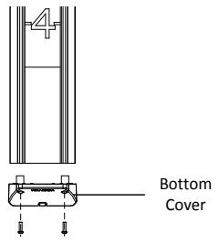

Install Bottom Cover

## **Installing the Cylindrical Sensor Unit**

This series of camera only support concealed mounting.

Please make sure that the mounting surface is suitable for adhesive pasting.

## *Steps:*

- 1. Drill on the mounting surface, as shown in Figure 2-20.
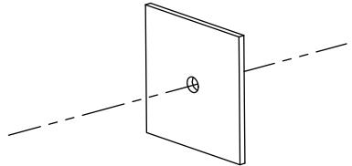

Drill on the Surface

Make sure that the drilling hole is big enough for the camera lens.

- 2. Remove a side of the adhesive tape on the bracket. Paste the bracket on the mounting surface with aligning with the drilling hole. As shown in figure below.
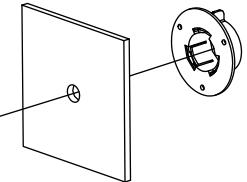

Paste the Bracket

- 3. Install the cylindrical sensor into the mounting hole in the round rail bracket.
- 4. Turn the locking sleeve to fix the sensor.
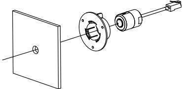

Install the Cylindrical Sensor

## **Installing the Fixed Focal Sensor Unit**

## *Steps:*

- 1. Fix the mounting base of the bracket to the ceiling with the supplied screws.
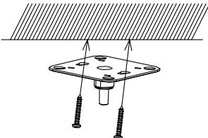

Fix the Ceiling Mounting Bracket

- 2. Hood the bracket cover to the mounting base.
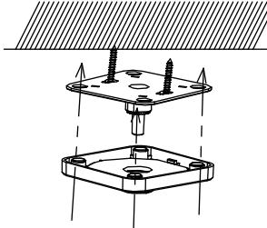

Hood the Bracket Cover

- 3. Screw the bracket to the mounting base.
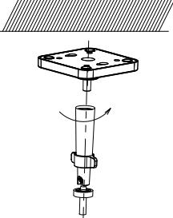

Screw the Bracket

**37**

Another shorter bracket is also selectable; please select the bracket according to your demand.

- 4. Loop the fixed focal unit with the loop of the bracket, and tighten it with the supplied screw. As shown in Figure 2-26.
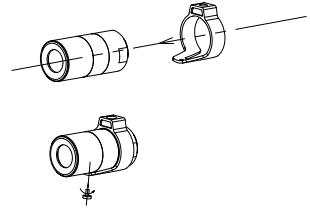

Loop the Fixed Focal Unit

- 5. Align the assembled fixed focal unit to the bracket, and rotate the unit to tighten the unit with the bracket.
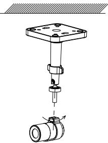

**38**

Install the Fixed Focal Unit to the Bracket

- 6. Loosen the knob to adjust the surveillance angle, and then tighten the lock nut to complete the installation.

Figure 2-28 Complete the Installation

## **2.5 Installing the Ball-Shaped Sensor Unit**

## **2.5.1 Mounting with the Included Bracket**

## *Steps:*

- 1. Paste the drill template to the desired mounting place. Drill two screw holes and a hole for routing cable according to the drill template.
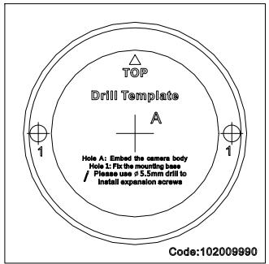

Figure 2-29 Drill Template

- 2. Route the camera cable through the mounting base of the included bracket. Fixed the mounting base to the wall or ceiling.
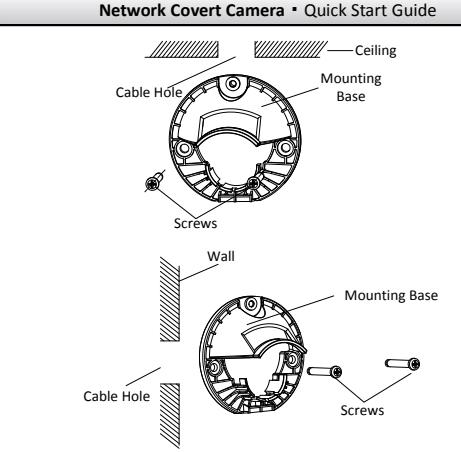

Figure 2-30 Fix the Mounting Bracket on Ceiling or on Wall

- 3. Place the camera in the bracket cover.

Figure 2-31 Place the Camera in Bracket Cover

- 4. Get the wedge on the bracket cover stuck in the slot of the mounting base, close the cover, and screw the bracket cover on the mounting base loosely.
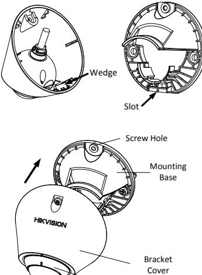

CameraFigure 2-32 Install the Camera and Bracket Cover

- 5. Adjust the surveillance angle.
	- 3). Stick the supplied plastic ring in the camera
	- 4). Connect the cables and power on the camera to view the image.
	- 5). Hold and move the plastic ring to adjust the panning, tilting, and rotating position to desired place.

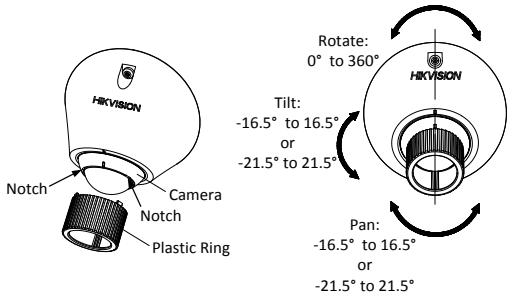

Figure 2-33 Adjust the View Angle

6). Remove the plastic ring after adjustment finished.

For the camera equipped with a fisheye lens, the panning and tilting adjusting range is -16.5° to 16.5**°**. For the camera equiped with a regular fixed focal lens, the adjusting range is -21.5° to 21.5°.

- 6. Tighten the screw on the bracket cover.
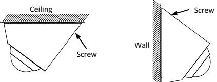

Figure 2-34 Tighten the Screw

## **2.5.2 Mounting with a Incline Bracket**

## *Before you start:*

There is no incline bracket included in the package. If you choose this mounting type, you need to provide a bracket before starting. The shown bracket below is only for demonstration.

## *Steps:*

- 1. Paste the drill template to the desired mounting place. Drill two screw holes and a hole for routing cable according to the drill template.
**44**

Figure 2-35 Drill Template

- 2. Route the camera cable through the mounting base of the incline bracket. And fix the camera to the mounting base with the fixing ring and screw.

The screw should be installed loosely to leave some space for view angle adjustment.

Figure 2-36 Fix the Camera to Mounting Base

- 3. Install the incline bracket with camera on the wall or ceiling with supplied screws.
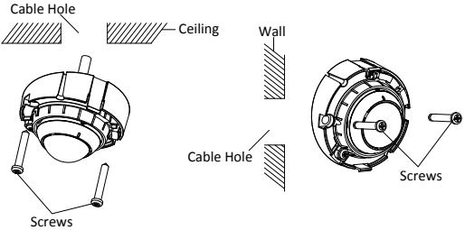

Figure 2-37 Fix the Camera and Mounting Base to Wall or Ceiling

- 4. Adjust view angle of the camera. Refer to *Step 5 in Section 2.5.1*.
- 5. Tighten the screw on fixing ring.
- 6. Install the incline bracket cover.

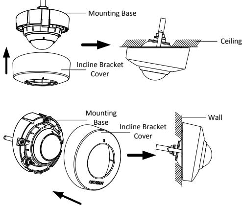

Figure 2-38 Install the Incline Bracket Cover

# **3 Setting the Network Camera over the LAN**

## *Note:*

You shall acknowledge that the use of the product with Internet access might be under network security risks. For avoidance of any network attacks and information leakage, please strengthen your own protection.

If the product does not work properly, contact your dealer or the nearest service center for help.

## **Wiring**

Connect the camera to network according to the following figures.

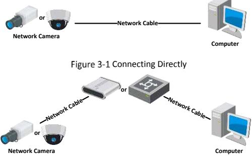

Connecting via a Switch or a Router

## **Activating the Camera**

You are required to activate the camera first by setting a strong password for it before you can use the camera.

Activation via Web Browser, Activation via SADP, and Activation via Client Software are all supported. We will take activation via SADP software and Activation via Web Browser as examples to introduce the camera activation.

## *Note:*

Refer to the User Manual of Network Camera for Activation via Client Software.

## **Activation via Web Browser**

## *Steps:*

- 1. Power on the camera. Connect the camera to your computer or the switch/router which your computer connects to.
- 2. Input the IP address into the address bar of the web browser, and press Enter to enter the activation interface.

## *Notes:*

- The default IP address of the camera is 192.168.1.64.
- The computer and the camera should belong to the same subnet.
- For the camera enables the DHCP by default, you need to use the SADP software to search the IP address.

| Network Covert Camera·Quick Start Guide |  |  |  |  |
|-----------------------------------------|--|--|--|--|
|                                         |  |  |  |  |
|                                         |  |  |  |  |
|                                         |  |  |  |  |
|                                         |  |  |  |  |
|                                         |  |  |  |  |
|                                         |  |  |  |  |
|                                         |  |  |  |  |

Activation Interface(Web)

- 3. Create a password and input the password into the password field.
	- **STRONG PASSWORD RECOMMENDED***– We highly recommend you create a strong password of your own choosing (using a minimum of 8 characters, including upper case letters, lower case letters, numbers, and special characters) in order to increase the security of your product. And we recommend you reset your password regularly, especially in the high security system, resetting the password monthly or weekly can better protect your product.*
- 4. Confirm the password.
- 5. Click **OK** to save the password and enter the live view interface.

## **Activation via SADP Software**

SADP software is used for detecting the online device, activating the camera, and resetting the password.

Get the SADP software from the supplied disk or the official website, and install the SADP according to the prompts.

Follow the steps to activate the camera.

#### *Steps:*

- 1. Run the SADP software to search the online devices.
- 2. Check the device status from the device list, and select the inactive device.

| Select inactive device. Input and confirm password. |  |  |  |  |  |
|-----------------------------------------------------------|--|--|--|--|--|
|                                                           |  |  |  |  |  |
|                                                           |  |  |  |  |  |
|                                                           |  |  |  |  |  |
|                                                           |  |  |  |  |  |
|                                                           |  |  |  |  |  |
|                                                           |  |  |  |  |  |
|                                                           |  |  |  |  |  |
|                                                           |  |  |  |  |  |
|                                                           |  |  |  |  |  |
|                                                           |  |  |  |  |  |
|                                                           |  |  |  |  |  |
|                                                           |  |  |  |  |  |
|                                                           |  |  |  |  |  |
|                                                           |  |  |  |  |  |
|                                                           |  |  |  |  |  |
|                                                           |  |  |  |  |  |
|                                                           |  |  |  |  |  |

SADP Interface

## *Note:*

The SADP software supports activating the camera in batch. Refer to the user manual of SADP software for details.

- 3. Create and input the new password in the password field, and confirm the password.
**51**

**STRONG PASSWORD RECOMMENDED***– We highly* 

*recommend you create a strong password of your own choosing (using a minimum of 8 characters, including upper case letters, lower case letters, numbers, and special characters) in order to increase the security of your product. And we recommend you reset your password regularly, especially in the high security system, resetting the password monthly or weekly can better protect your product.* 

#### *Note:*

You can enable the Hik-Connect service for the device during activation. Refer to Chapter 5.1 for detailed information.

- 4. Click **Activate** to start activation.
You can check whether the activation is completed on the popup window. If activation failed, make sure that the password meets the requirement and try again.

## **Modifying the IP Address**

#### *Purpose:*

To view and configure the camera via LAN (Local Area Network), you need to connect the network camera in the same subnet with your PC.

Use the SADP software or client software to search and change the IP address of the device. We take modifying the IP Address via SADP software as an example to introduce the IP address modification.

For IP address modification via client software, refer to the user manual of client software.

#### *Steps:*

- 1. Run the SADP software.
- 2. Select an active device.
- 3. Change the device IP address to the same subnet with your computer by either modifying the IP address manually or checking the checkbox of Enable DHCP.

| I Modify Network Parameters |                                                                                                                                                                                |
|-----------------------------|--------------------------------------------------------------------------------------------------------------------------------------------------------------------------------|
| Enable DHCP                 |                                                                                                                                                                                |
| Enable Hik-Connect          |                                                                                                                                                                                |
|                             | Device Serial No .:   XX-XXXXXXXXXXXXXXXXXXXXXXXXXXXXXXXXXXXXXXXXXXXXXXXXXXXXXXXXXXXXXXXXXXXXXXXXXXXXXXXXXXXXXXXXXXXXXXXXXXXXXXXXXXXXXXXXXXXXXXXXXXXXXXXXXXXXXXXXXXXXXXXXXXXXX |
| 19 Address:                 | 192.168.1.64                                                                                                                                                                   |
| Papa Ez                     | 0000                                                                                                                                                                           |
| Subnet Mosk:                | 255.255.255.0                                                                                                                                                                  |
| Gateway:                    | 192.168.1.1                                                                                                                                                                    |
| IPv6 Address:               | =                                                                                                                                                                              |
| IPv6 Gateway:               | t =                                                                                                                                                                            |
| IPv6 Prefix Length:         | 0                                                                                                                                                                              |
| HTTP Port                   | 80                                                                                                                                                                             |
|                             | Security Verification                                                                                                                                                          |
| Admin Password              |                                                                                                                                                                                |
|                             | Modily                                                                                                                                                                         |
|                             | Forgot Password                                                                                                                                                                |

Modify the IP Address

#### *Note:*

You can enable the Hik-Connect service for the device during activation. Refer to Chapter 5.1 for detailed information.

- 4. Input the admin password and click **Modify** to activate your IP address modification.
The batch IP address modification is supported by the SADP. Refer to the user manual of SADP for details.

## **4 Accessing via Web Browser**

## *System Requirement:*

Operating System: Microsoft Windows XP SP1 and above version

CPU: 2.0 GHz or higher

RAM: 1G or higher

Display: 1024×768 resolution or higher

Web Browser: Internet Explorer 8.0 and above version, Apple Safari 5.0.2 and above version, Mozilla Firefox 5.0 and above version and Google Chrome 18 and above version

## *Steps:*

- 1. Open the web browser.
- 2. In the browser address bar, input the IP address of the network camera, and press the **Enter** key to enter the login interface.

## *Note:*

- The default IP address is 192.168.1.64. You are recommended to change the IP address to the same subnet with your computer.
- 3. Input the user name and password.

The admin user should configure the device accounts and user/operator permissions properly. Delete the unnecessary accounts and user/operator permissions.

## *Note:*

The device IP address gets locked if the admin user performs 7 failed password attempts (5 attempts for the user/operator).

- 4. Click **Login**.
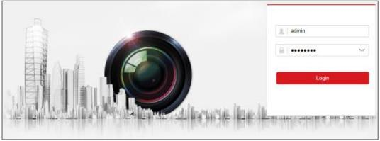

Login Interface

- 5. Install the plug-in before viewing the live video and managing the camera. Follow the installation prompts to install the plug-in.
#### *Note:*

You may have to close the web browser to finish the installation of the plug-in.

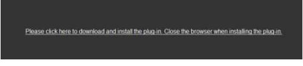

Download Plug-in

- 6. Reopen the web browser after the installation of the plug-in and repeat steps 2 to 4 to login.
#### *Note:*

For detailed instructions of further configuration, please refer to the user manual of network camera.

# **5 Operating via Hik-Connect App**

## *Purpose:*

Hik-Connect is an application for mobile devices. With the App, you can view live image of the camera, receive alarm notification and so on.

## *Note:*

Hik-Connect service is not supported by certain camera models.

## **5.1 Enable Hik-Connect Service on Camera**

## *Purpose:*

Hik-Connect service should be enabled on your camera before using the service.

You can enable the service through SADP software or web browser.

## **Enable Hik-Connect Service via SADP Software**

## *Steps:*

- 1. Check the checkbox of **Enable Hik-Connect** on:
	- 1). "Activate the Device" page during camera activation, refer to Chapter 3.2.2.
	- 2). Or "Modify Network Parameters" page during modifying IP address, refer to Chapter 3.3.
- 2. Create a verification code or change the verification code.

| Tips                                                                                                                                         | × |
|----------------------------------------------------------------------------------------------------------------------------------------------|---|
| To enable Hik-Connect service, you need to create a verification code or change the verification code.                                    |   |
| Verification Code                                                                                                                         |   |
| 6 to 12 letters or numbers, case sensitive. You are recommended to use a combination of no less than 8 letters or numbers.          |   |
| Confirm Verification Code                                                                                                                 |   |
| The Hik-Connect service will require internet access. Please read the "Terms of Service and "Privacy Policy" before enabling the service. |   |
| Cancel                                                                                                                                       |   |

Verification Code Setting (SADP)

## *Note:*

The verification code is required when you add the camera to Hik-Connect app.

- 3. Click and read "Terms of Service" and "Privacy Policy".
- 4. Confirm the settings.

## **Enable Hik-Connect Service via Web Browser**

#### *Before you start:*

You need to activate the camera before enabling the service. Refer to Chapter 3.2.

**58**

#### *Steps:*

- 1. Access the camera via web browser. Refer to Chapter 4.
- 2. Enter platform access configuration interface: Configuration >

Network > Advanced Settings > Platform Access

| Enable               |                     |                                                                                                  |
|----------------------|---------------------|--------------------------------------------------------------------------------------------------|
| Platform Access Mode | Hik-Connect         | >                                                                                                |
| Server IP            | dev.hik-connect.com | Custom                                                                                           |
| Register Status      | Offline             | >                                                                                                |
| Verification Code    |                     | ಗ್ಗ                                                                                              |
|                      |                     | 6 to 12 letters (a to z, A to Z) or numbers (0 to 9), case sensitive. You are recommended to use |
|                      |                     |                                                                                                  |
| Save                 |                     |                                                                                                  |

Platform Access Configuration (Web)

- 3. Select Platform Access Mode as Hik-Connect.
- 4. Check the checkbox of Enable.
- 5. Click and read "Terms of Service" and "Privacy Policy" in pop-up window.
- 6. Create a verification code or change the verification code for the camera.

#### *Note:*

The verification code is required when you add the camera to Hik-Connect app.

- 7. Save the settings.
## **5.2 Hik-Connect Setup**

## *Steps:*

- 1. Download and install the Hik-Connect app by searching "Hik-Connect" in App Store or Google PlayTM.
- 2. Launch the app and register for a Hik-Connect user account.
- 3. Log in Hik-Connect app after registration.

## **5.3 Adding Camera to Hik-Connect**

## *Before you start:*

You need to enable the Hik-Connect service on camera before adding it to your Hik-Connect account. Refer to Chapter 5.1.

## *Steps:*

- 1. Use a network cable to connect the camera with a router if the camera does not support Wi-Fi.
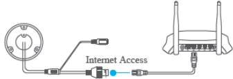

Figure 5-3 Connect a Router

## *Note:*

After the camera connects to the network, please wait one minute before any operation on the camera using Hik-Connect app.

- 2. In the Hik-Connect app, tap "+" on the upper-right corner and then scan the QR code of the camera to add the camera.
You can find the QR code on the camera or on the cover of the

Quick Start Guide of the camera in the package.

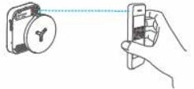

Figure 5-4 Scan QR Code

## *Note:*

If the QR code is missing or too blur to be recognized, you can also add the camera by tapping the icon and inputting the camera's serial number.

- 3. Input the verification code of your camera.
## *Note:*

- The required verification code is the code you create or change when you enabling Hik-Connect service on camera.
- If you forget the verification code, you can check the current verification code on **Platform Access** configuration page via web browser.
- 4. Follow the prompts to set the network connection and add the camera to your Hik-Connect account.

## *Note:*

For detailed information, refer to the user manual of the Hik-Connect app.

## **5.4 Initializing the Memory Card**

## *Steps:*

Check the memory card status by tapping on the Storage Status in the Device Settings interface.

If the memory card status displays as Uninitialized, tap to initialize it. The status will then change to Normal. You can then start recording any event triggered video in the camera such as motion detection.

