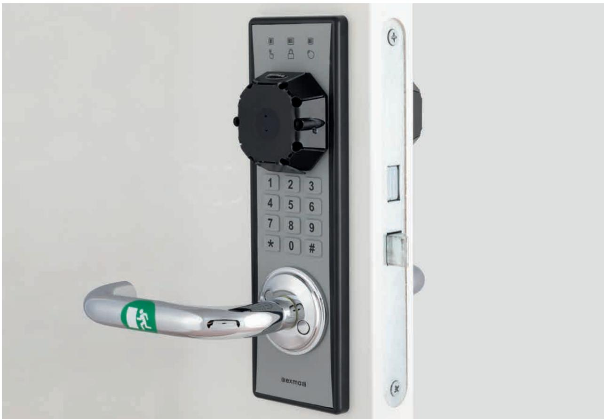

# Montering & Funktion

**Duo Alarm**

Det svensktillverkade låssystemet

# Tack & välkommen

Vi på Exma Säkerhetssystem AB vill tacka dig för att du valt oss och hälsa dig välkommen som kund. Du är nu ägare av ett svensktillverkat lås av absolut högsta kvalitet.

## (((exma))

## Innehållsförteckning

| Monteringsanvisning, dörr                                             |  |
|-----------------------------------------------------------------------|--|
| Insida                                                                |  |
| Genomskärning                                                         |  |
| Anslutning av flexkabel, utsidan…………………………………………………………………………………………… 5 |  |
| Montering                                                             |  |
| Spänningssättning                                                     |  |
| Batterier                                                             |  |
| Märkning och dekaler                                                  |  |

## Monteringsanvisning, dörr

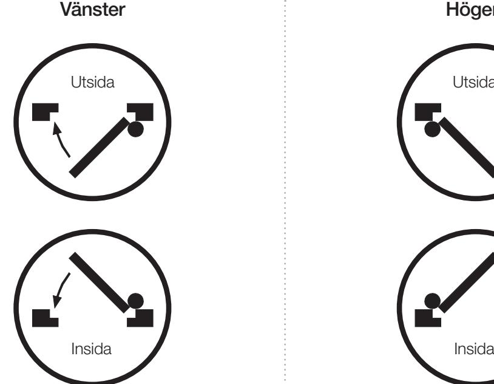

Utsida Höger

## Insida

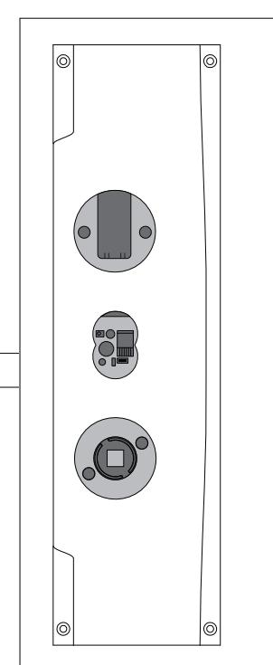

Vänsterhängd utåtgående dörr eller högerhängd inåtgående dörr

### Högerhängd utåtgående dörr eller vänsterhängd inåtgående dörr

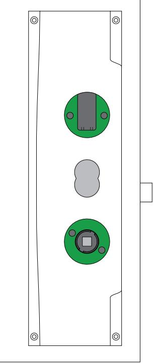

## Genomskärning

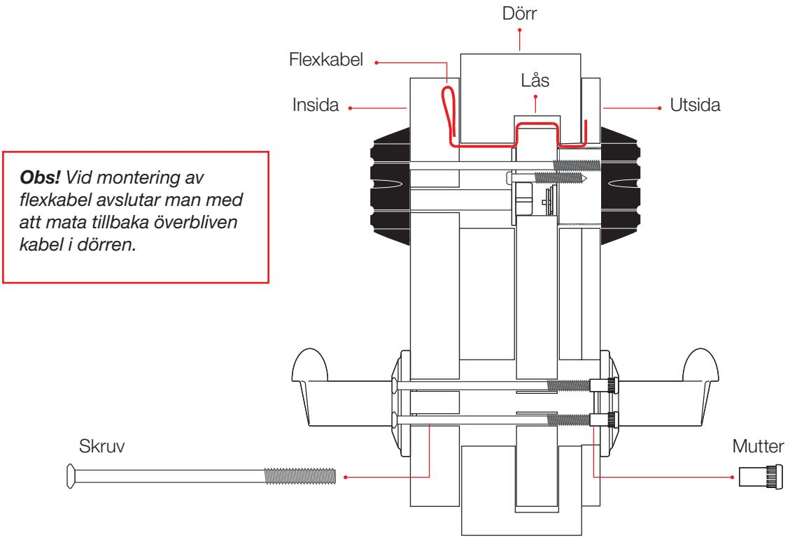

## Anslutning av flexkabel, utsidan

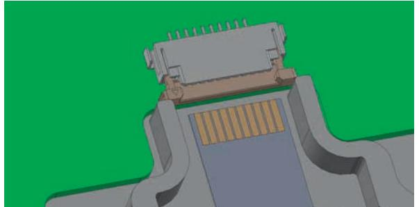

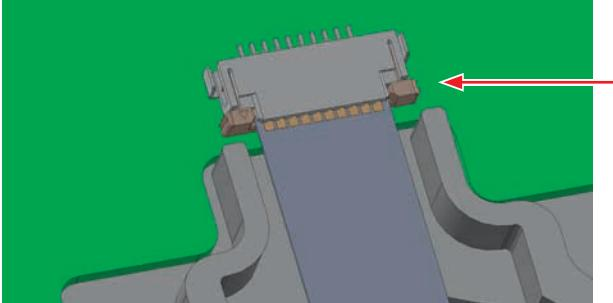

*Obs! Vid montering av flexkabeln ska de blanka kontaktytorna peka uppåt. Det är viktigt att det lilla låsstycket i kontakten hamnar i intryckt läge eftersom det hindrar flexkabeln från att falla ur vid montering.*

## Montering

Montera in- och utsida med dörrtrycket så att enheterna blir fixerade.

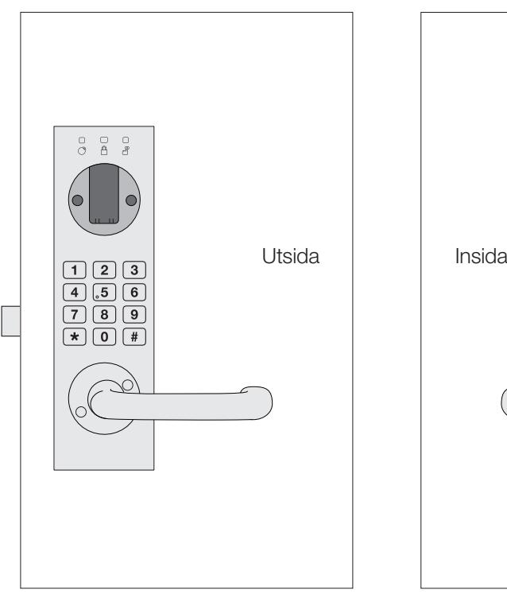

Steg 1 *Obs! Glöm inte att montera flatkabeln samt långskylten mellan trycke och funktionsenhet på insidan.*

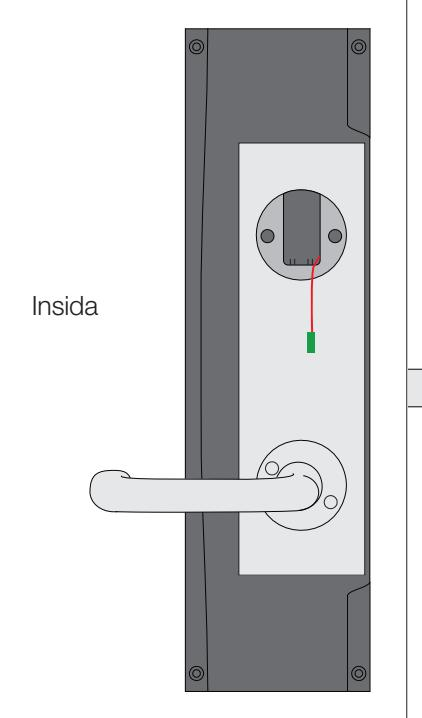

### Steg 2

Därefter monteras utsidans summer.

Dra kabeln genom det fjärilsformade hålet (cylinderroddaren) i låset och fäst summern temporärt med en av de genomgående klippskruvarna. Anslut kontakten med rätt polaritet på valfri kontakt.

Anslut därefter insidans summer på den andra kontakten.

*Obs! Viktigt att polariteten blir rätt för att summern ska fungera (röd/svart).*

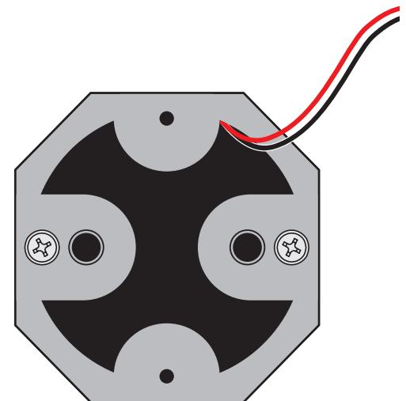

### Steg 3

### Utan inre fästplatta monterad Med inre fästplatta monterad

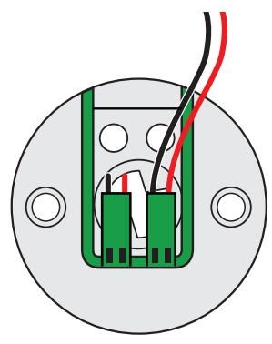

Bilden visar hur kontakterna ska orienteras när enheten är monterad med plåten utåt. Dvs. vid vänsterhängd, utåtgående dörr eller högerhängd, inåtgående dörr.

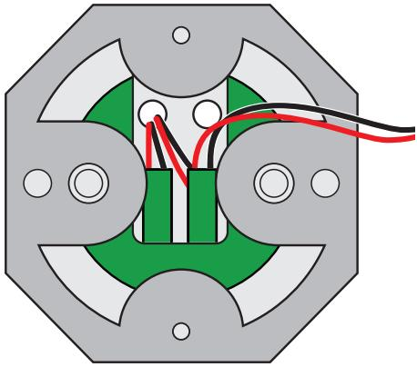

Bilden visar hur kontakterna ska orienteras när enheten är monterad med kretskortet utåt. Dvs. vid högerhängd, utåtgående dörr eller vänsterhängd, inåtgående dörr.

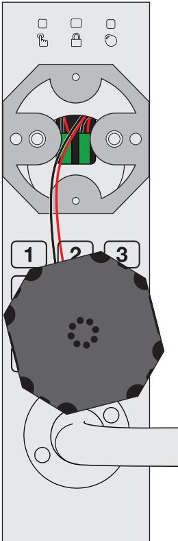

*Tips! Det kan underlätta att hålla täckskylten och monteringsbrickan i handen vid montering av summerkontakten för att få mer plats.*

Skruva fast utvändig summer med de två klippskruvarna genom fästplåten för den inre summern som bilden visar.

Överbliven kabel läggs in i hålet.

### Steg 4 Steg 5

Montera den invändiga summerkåpan med 2 st M3x20 skruvar.

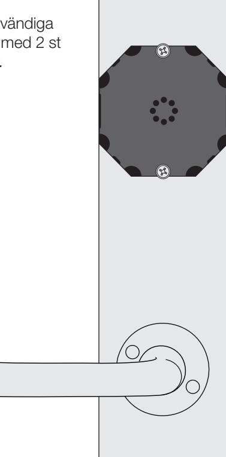

## Spänningssättning

Se till att dörrtrycket inte är nedtryckt utan står i horisontellt läge.

*Obs! Första gången enheten spänningssätts så kommer larmet att ljuda direkt.*

Lossa de två skruvarna nederst på den invändiga enheten. Se till att inte batterikassetten faller ned och rycker ur kabeln.

Batterikassetten dras därefter nedåt.

### Steg 1 Steg 2 Steg 3

Sätt därefter i batterierna (batterikontakten). Var dock medveten om att larmet kommer att aktiveras vilket bekräftar att sumrarna är rätt anslutna.

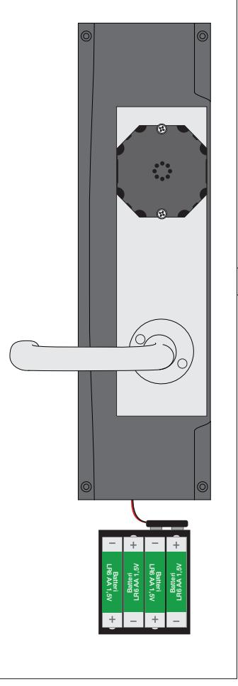

Ta bort batterikontakten, enheten tystnar.

Nästa gång som enheten spänningssätts är den tyst och redo för programmering. Detta sker även om enheten varit spänningslös under flera minuter.

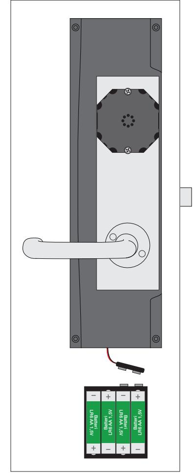

*Obs! För programmering av koder, se separat Duo Code och Duo Alarm Användarmanual.*

## Batterier

### Batterivarning

När det är dags att byta batterier varnar enheten med fyra korta pip när du använder den.

Batterierna har då cirka 4,5V kvar.

Hur länge batterierna kan driva enheten efter att du har fått varningsignalen beror på batterityp och temperatur.

Vi rekommenderar att du skiftar batterierna så snart som möjligt efter varningssignal.

### Batteribyte

Lossa de två skruvarna nederst på den invändiga enheten. Se till att inte batterikassetten faller ned och rycker ur kabeln.

Batterikassetten dras därefter nedåt.

Sätt in fyra nya batterier, typ LR6 AA 1,5V.

Skjut upp batterikassetten i enheten och fäst skruvarna.

Lämna de gamla batterierna till godkänd återvinning.

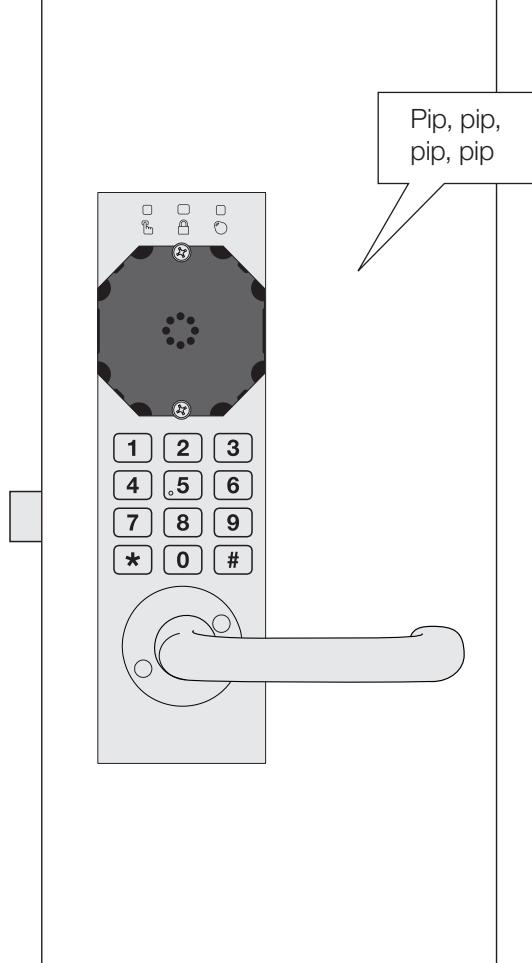

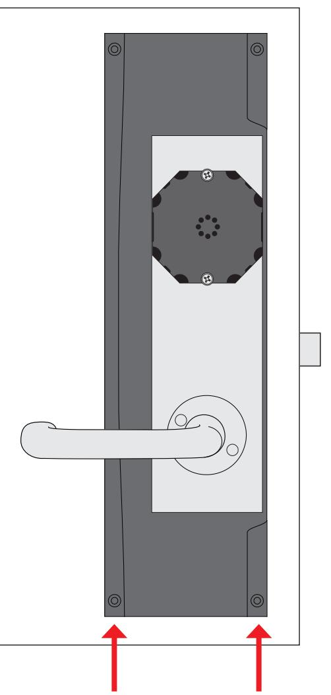

## Märkning och dekaler

Dekalerna som följer med i paketet appliceras enligt nedan.

För utpassering Använd tryckknapp

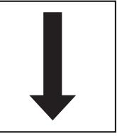

### Utsida/butikslokal Insida/personalutrymme

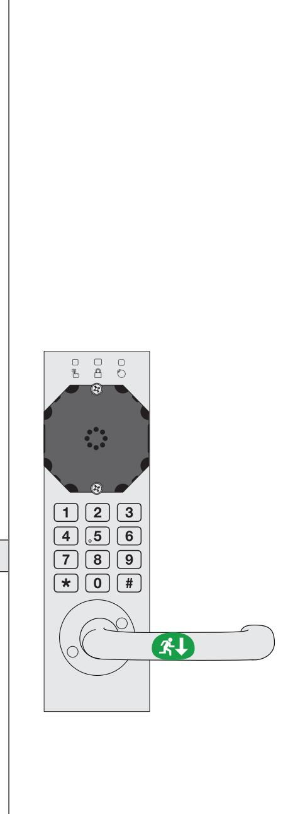

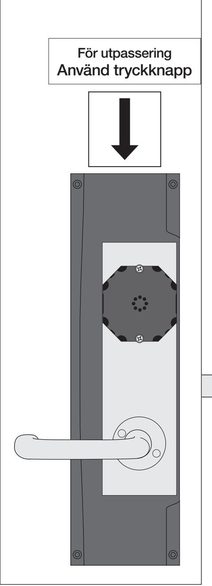

## (((exma))

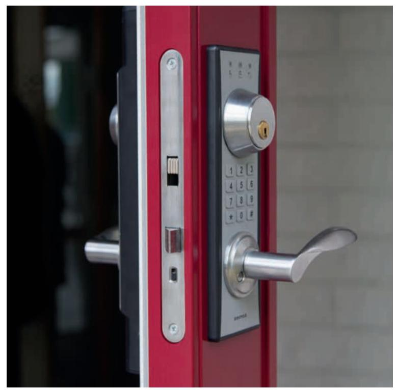

### Företaget

Exma Säkerhetssystem AB startade sin verksamhet i Eskilstuna 1986 och har under åren vuxit sig till en central del inom framtagandet av säkra lås, till både bostäder och högsäkerhetsanläggningar. Redan från början specialiserade vi oss på att bli experter inom mekaniska och elektroniska lås samt passersystem.

Vår kompetens etablerade oss snabbt och vi har, sedan länge, djupgående samarbeten med andra aktörer inom branschen. Vi flyttar fram positionerna för användarvänliga lås av högsta kvalitet avseende såväl hållbarhet som säkerhet.

