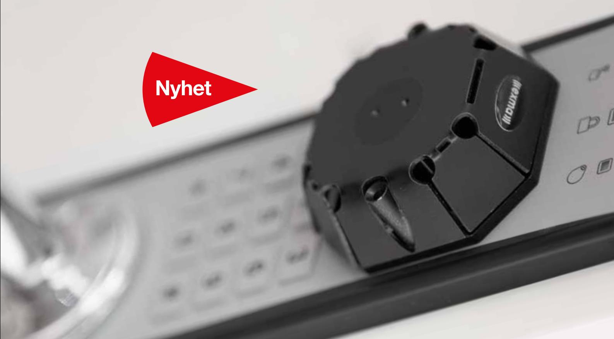
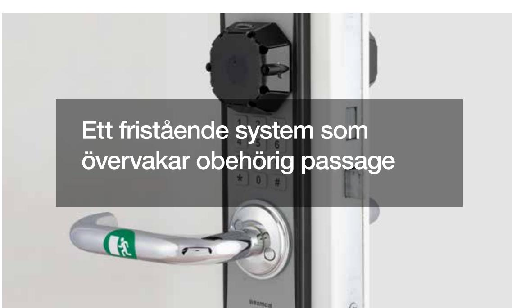

# Trådlös bevakning av utrymningsvägar **Duo Alarm**

Det svensktillverkade låssystemet

# Tryggt och säkert

Exma Duo Alarm ger en flexibel, passiv passagekontroll. Dörren lämnas olåst och om den öppnas utan att giltig kod larmar systemet. En idealisk lösning i situationer där exempelvis utrymningsvägar leds genom lager eller andra känsliga områden. Systemet rymmer upp till 999 koder med valbar längd på 3–7 siffror.

## Enkel installation

Exma Duo Alarm är en fristående lösning som är enkel att installera. Ingen ytterligare kabeldragning eller håltagning behövs, vare sig i dörr eller intilliggande karm och vägg.

## Användarvänligt

Systemet är smidigt för användaren. All hantering sker från tangentbordet via koder – direkt på enheten.

| Specifikationer för Duo Alarm                            |                                             |
|----------------------------------------------------------|---------------------------------------------|
| Batterispänning (4 st 1,5V AA standardbatterier = 6V) | Ja                                          |
| Stand-alone                                              | Ja                                          |
| Systemindikeringar                                       | Ja                                          |
| Låsmanövrering med dörrtrycket                        | Ja                                          |
| Akustisk verifiering                                     | Ja                                          |
| Batterilivslängd vid normal användning                | 12–24 månader utan larm 12 h vid larm |
| Batterivarning                                           | Ja                                          |
| Storlek, yttre enhet, BxHxD                              | 70x230x10 mm                                |
| Storlek, inre enhet, BxHxD                               | 80x300x28 mm                                |
| Larm på in- och utsida                                   | Ja                                          |
| Ljudstyrka vid larm                                      | ca 100 dB                                   |

