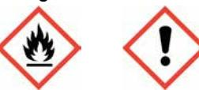
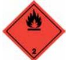

# SÄKERHETSDATABLAD

## Textile / Animal

I enlighet med Förordning (EG) Nr 1907/2006, Bilaga II, ändrad genom Förordning (EG) Nr 453/2010

| AVSNITT 1: Namnet på ämnet/blandningen och bolaget/företaget                                              |                                                                                                                                         |  |  |
|-----------------------------------------------------------------------------------------------------------|-----------------------------------------------------------------------------------------------------------------------------------------|--|--|
| 1.1. Produktbeteckning                                                                                    |                                                                                                                                         |  |  |
| Produktnamn                                                                                               | Textile / Animal                                                                                                                        |  |  |
| Produktnummer                                                                                             | 35159, 35160, 35161, 35163, 35164, 35165                                                                                                |  |  |
| 1.2. Relevanta identifierade användningar av ämnet eller blandningen och användningar som det avråds från |                                                                                                                                         |  |  |
| Identifierade användningar                                                                                | Reflekterande spray                                                                                                                     |  |  |
| 1.3. Närmare upplysningar om den som tillhandahåller säkerhetsdatablad                                    |                                                                                                                                         |  |  |
| Leverantör                                                                                                |                                                                                                                                         |  |  |
|                                                                                                           | TrackInvent AB Rönnowsgatan 8C SE-252 25 Helsingborg SWEDEN +46(0)40 – 23 13 10 info@trackinvent.se www.albedo100.com |  |  |
| 1.4. Telefonnummer för nödsituationer                                                                     |                                                                                                                                         |  |  |
| Nationellt telefonnummer för nödsituationer                                                            | Giftinformationen 010-456 67 00. Vid akuta fall, ring 112, begär giftinformation.                                                       |  |  |
| AVSNITT 2: Farliga egenskaper                                                                             |                                                                                                                                         |  |  |
| 2.1. Klassificering av ämnet eller blandningen                                                            |                                                                                                                                         |  |  |
| Klassificering (EC 1272/2008)                                                                             |                                                                                                                                         |  |  |
| Fysikaliska faror                                                                                         | Aerosol 1 - H222, H229                                                                                                                  |  |  |
| Hälsofaror                                                                                                | Skin Irrit. 2 - H315 STOT SE 3 - H336                                                                                                   |  |  |
| Miljöfaror                                                                                                | Aquatic Chronic 3 - H412                                                                                                                |  |  |

### 2.2. Märkningsuppgifter

Piktogram

Signalord Fara

Faroangivelser H222 Extremt brandfarlig aerosol. H229 Tryckbehållare: Kan sprängas vid uppvärmning. H315 Irriterar huden. H336 Kan göra att man blir dåsig eller omtöcknad. H412 Skadliga långtidseffekter för vattenlevande organismer. EUH208 Innehåller Butan-2-one O,O',O''-(methylsilylidyne)trioxime. Kan orsaka en allergisk reaktion.

| Skyddsangivelser | P102 Förvaras oåtkomligt för barn.                                                                 |
|------------------|----------------------------------------------------------------------------------------------------|
|                  | P210 Får inte utsättas för värme, heta ytor, gnistor, öppna lågor och andra antändningskällor.     |
|                  | Rökning förbjuden.                                                                                 |
|                  | P211 Spreja inte över öppen låga eller andra antändningskällor.                                    |
|                  | P251 Får inte punkteras eller brännas, gäller även tömd behållare.                                 |
|                  | P271 Används endast utomhus eller i väl ventilerade utrymmen.                                      |
|                  | P410+P412 Skyddas från solljus. Får inte utsättas för temperaturer över 50°C/122°F.                |
|                  | P501 Innehållet/ behållaren lämnas i enlighet med nationella bestämmelser.                         |
| Innehåller       | Kolväten, C7, N-Alkaner, Isoalkaner, Cykliska                                                      |
| Kompletterande   | P261 Undvik att inandas sprej.                                                                     |
| skyddsangivelser | P264 Tvätta nedstänkt hud grundligt efter användning.                                              |
|                  | P273 Undvik utsläpp till miljön.                                                                   |
|                  | P280 Använd skyddshandskar/ skyddskläder/ ögonskydd/ ansiktsskydd.                                 |
|                  | P302+P352 VID HUDKONTAKT: Tvätta med mycket vatten.                                                |
|                  | P304+P340 VID INANDNING: Flytta personen till frisk luft och se till att andningen underlättas. |
|                  | P312 Vid obehag, kontakta GIFTINFORMATIONSCENTRALEN/ läkare.                                       |
|                  | P321 Särskild behandling (se medicinskt råd på etiketten).                                         |
|                  | P332+P313 Vid hudirritation: Sök läkarhjälp.                                                       |
|                  | P362+P364 Ta av nedstänkta kläder och tvätta dem innan de används igen.                            |
|                  | P403+P233 Förvaras på väl ventilerad plats. Behållaren ska vara väl tillsluten.                    |
|                  | P405 Förvaras inlåst.                                                                              |

## 2.3. Andra faror

Produkten innehåller inte något ämne som är klassificerat som PBT eller vPvB. Innehåller: Isobutan.

### AVSNITT 3: Sammansättning/information om beståndsdelar

| 3.2. Blandningar                                                      |                      |                                                           |
|-----------------------------------------------------------------------|----------------------|-----------------------------------------------------------|
| BUTAN CAS-nummer: 106-97-8                                         | EG-nummer: 203-448-7 | 50-70% REACH-registreringsnummer: 01- 2119474691-32 |
| Klassificering Flam. Gas 1 - H220 Press. Gas, Compressed - H280 |                      |                                                           |
| Kolväten, C7, N-Alkaner, Isoalkaner, Cykliska                         |                      |                                                           |
|                                                                       |                      | 15-24.9%                                                  |
| CAS-nummer: —                                                         | EG-nummer: 927-510-4 | REACH-registreringsnummer: 01- 2119475515-33-0000      |

| DIMETYLETER CAS-nummer: 115-10-6                                                                                                                                                              | EG-nummer: 204-065-8 | 15-24.9% REACH-registreringsnummer: 01- 2119472128-37       |
|--------------------------------------------------------------------------------------------------------------------------------------------------------------------------------------------------|----------------------|-------------------------------------------------------------------|
| Klassificering Flam. Gas 1 - H220 Press. Gas, Compressed - H280                                                                                                                            |                      |                                                                   |
| PROPAN CAS-nummer: 74-98-6                                                                                                                                                                    | EG-nummer: 200-827-9 | 2.5-4.99% REACH-registreringsnummer: 01- 2119486944-21      |
| Klassificering Flam. Gas 1 - H220 Press. Gas, Compressed - H280                                                                                                                            |                      |                                                                   |
| PENTAN CAS-nummer: 109-66-0                                                                                                                                                                   | EG-nummer: 203-692-4 | 0.1-0.99% REACH-registreringsnummer: 01- 2119459286-30-0000 |
| Klassificering Flam. Liq. 2 - H225 STOT SE 3 - H336 Asp. Tox. 1 - H304 Aquatic Chronic 2 - H411                                                                                      |                      |                                                                   |
| XYLEN CAS-nummer: 1330-20-7                                                                                                                                                                   | EG-nummer: 215-535-7 | 0.1-0.99% REACH-registreringsnummer: 01- 2119488216-32-0000 |
| Klassificering Flam. Liq. 3 - H226 Acute Tox. 4 - H312 Acute Tox. 4 - H332 Skin Irrit. 2 - H315 Eye Irrit. 2 - H319 STOT SE 3 - H335 STOT RE 2 - H373 Asp. Tox. 1 - H304 |                      |                                                                   |
| Butan-2-one O,O',O''-(methylsilylidyne)trioxime CAS-nummer: 22984-54-9                                                                                                                        | EG-nummer: 245-366-4 | 0.1-0.99%                                                         |
| Klassificering Acute Tox. 4 - H312 Eye Irrit. 2 - H319 Skin Sens. 1 - H317                                                                                                              |                      |                                                                   |

Alla faroangivelser anges i klartext i avsnitt 16.

Sammansättningskommentare r Naftorna innehåller mindre än 0,1 % Bensen, vilket gör att de inte är klassade som mutagena eller cancerframkallande.

AVSNITT 4: Åtgärder vid första hjälpen 4.1. Beskrivning av åtgärder vid första hjälpen Generell information Sök läkarhjälp om besvär kvarstår. Inandning Flytta den skadade personen till frisk luft och håll denne varm och i stillhet i en position som underlättar andningen. Förtäring Drick ett par glas vatten eller mjölk. FRAMKALLA EJ KRÄKNING! Kontakta genast läkare. Hudkontakt Tvätta huden noggrant med tvål och vatten. Kontakt med ögonen Skölj med vatten. Sök läkarhjälp om besvär kvarstår. 4.2. De viktigaste symptomen och effekterna, både akuta och fördröjda Generell information Lösningsmedelsmissbruk kan leda till dödsfall. Inandning Kan göra att man blir dåsig eller omtöcknad. Ångor kan orsaka huvudvärk, trötthet, yrsel och illamående. Förtäring På grund av de fysikaliska egenskaperna hos produkten, är det osannolikt att förtäring skulle förekomma. Om produkten kommer ned i lungorna efter förtäring eller kräkning kan kemisk lunginflammation uppkomma. Kan orsaka illamående, huvudvärk, yrsel och förgiftning. Hudkontakt Irriterar huden. Produkten innehåller en liten mängd av ett sensibiliserande ämne. Kan orsaka sensibilisering eller allergiska reaktioner hos känsliga individer. Kontakt med ögonen Kan orsaka tillfällig ögonirritation. 4.3. Angivande av omedelbar medicinsk behandling och särskild behandling som eventuellt krävs Anmärkningar för läkaren Inga specifika rekommendationer. AVSNITT 5: Brandbekämpningsåtgärder 5.1. Släckmedel Lämpliga släckmedel Släck med skum, koldioxid eller pulver. 5.2. Särskilda faror som ämnet eller blandningen kan medföra Särskilda faror Behållare kan brisera eller explodera vid upphettning, beroende på häftig tryckstegring. Extremt brandfarligt. 5.3. Råd till brandbekämpningspersonal Skyddsåtgärder vid brandbekämpning Behållare i närheten av brand ska flyttas eller kylas med vatten. Särskild skyddsutrustning för brandbekämpningspersonal Använd kemskyddsdräkt. Använd andningsapparat med lufttillförsel (SCBA) och lämpliga skyddskläder. AVSNITT 6: Åtgärder vid oavsiktliga utsläpp 6.1. Personliga skyddsåtgärder, skyddsutrustning och åtgärder vid nödsituationer Personliga skyddsåtgärder För personligt skydd, se Avsnitt 8. 6.2. Miljöskyddsåtgärder

- Miljöskyddsåtgärder Släpp inte ut i avlopp eller vattendrag eller på marken.
- 6.3. Metoder och material för inneslutning och sanering

| Metoder för sanering                                                  | Stora spill: Valla in och absorbera spill med sand, jord eller annat icke brännbart material. Små spill: Torka bort med papper eller textil. Spill samlas upp i täta behållare och lämnas för destruktion enligt gällande lokala föreskrifter. |  |  |
|-----------------------------------------------------------------------|------------------------------------------------------------------------------------------------------------------------------------------------------------------------------------------------------------------------------------------------------|--|--|
| 6.4. Hänvisning till andra avsnitt                                    |                                                                                                                                                                                                                                                      |  |  |
| Hänvisning till andra avsnitt                                         | För personligt skydd, se Avsnitt 8. Angående avfallshantering, se punkt 13.                                                                                                                                                                          |  |  |
| AVSNITT 7: Hantering och lagring                                      |                                                                                                                                                                                                                                                      |  |  |
| 7.1. Skyddsåtgärder för säker hantering                               |                                                                                                                                                                                                                                                      |  |  |
| Skyddsåtgärder vid användning                                      | Får inte utsättas för värme, gnistor och öppen låga. Skyddas mot direkt solljus. Ät inte, drick inte eller rök inte under hanteringen.                                                                                                            |  |  |
| 7.2. Förhållanden för säker lagring, inklusive eventuell oförenlighet |                                                                                                                                                                                                                                                      |  |  |
| Skyddsåtgärder vid lagring                                            | Aerosolburkar: Får inte utsättas för direkt solljus eller temperaturer över 50°C. Förpackningen förvaras torrt.                                                                                                                                   |  |  |
| 7.3. Specifik slutanvändning                                          |                                                                                                                                                                                                                                                      |  |  |
| Specifik slutanvändning                                               | De identifierade användningarna för produkten finns beskrivna i Avsnitt 1.2.                                                                                                                                                                         |  |  |
| AVSNITT 8: Begränsning av exponeringen/personligt skydd               |                                                                                                                                                                                                                                                      |  |  |
| 8.1. Kontrollparametrar                                               |                                                                                                                                                                                                                                                      |  |  |
| Gränsvärden för exponering på arbetsplatsen                           |                                                                                                                                                                                                                                                      |  |  |
| BUTAN                                                                 |                                                                                                                                                                                                                                                      |  |  |

Nivågränsvärde (8 timmar, NGV): Ingen standard. Ingen standard. Korttidsvärde (15 minuter, KTV): Ingen standard. Ingen standard.

#### Kolväten, C7, N-Alkaner, Isoalkaner, Cykliska

Nivågränsvärde (8 timmar, NGV): AFS 200 ppm 800 mg/m³ Korttidsvärde (15 minuter, KTV): AFS 300 ppm 1200 mg/m³

#### DIMETYLETER

Nivågränsvärde (8 timmar, NGV): AFS 500 ppm 950 mg/m³ Korttidsvärde (15 minuter, KTV): AFS 800 ppm 1500 mg/m³

#### PROPAN

Korttidsvärde (15 minuter, KTV): Ingen standard.

### PENTAN

Nivågränsvärde (8 timmar, NGV): AFS 600 ppm 1800 mg/m³ Korttidsvärde (15 minuter, KTV): AFS 750 ppm 2000 mg/m³

### XYLEN

Nivågränsvärde (8 timmar NGV): HGV 50 ppm 221 mg/m³ Korttidsgränsvärde (15 minuter KGV): HGV 100 ppm 442 mg/m³ H

AFS = Arbetsmiljöverkets Författningssamling. HGV = Hygieniskt gränsvärde

H = Ämnet kan lätt upptas genom huden.

### Kolväten, C7, N-Alkaner, Isoalkaner, Cykliska

DNEL Arbetare - Dermalt; Korttids- systemiska effekter: 300 mg/kg/dag Arbetare - Inandning; Långtids- systemiska effekter: 2085 mg/m³ Konsument - Dermalt; Långtids- systemiska effekter: 149 mg/kg/dag Konsument - Inandning; Långtids- systemiska effekter: 447 mg/m³

## DIMETYLETER (CAS: 115-10-6)

| DNEL | Näringsverksamhet - Inandning; Långtids- systemiska effekter: 1894 mg/m³ Konsument - Inandning; Långtids- systemiska effekter: 471 mg/m³                                                                                                                                                                                                                         |
|------|---------------------------------------------------------------------------------------------------------------------------------------------------------------------------------------------------------------------------------------------------------------------------------------------------------------------------------------------------------------------|
| PNEC | - Sötvatten; 0,155 mg/l - Saltvatten; 0,016 mg/l - Sediment (Sötvatten); 0,681 mg/kg - Sediment (Havsvatten); 0,069 mg/kg - Jord; 0,045 mg/kg                                                                                                                                                                                                           |
|      | PENTAN (CAS: 109-66-0)                                                                                                                                                                                                                                                                                                                                              |
| PNEC | - vatten; 0,027 mg/l                                                                                                                                                                                                                                                                                                                                                |
|      | XYLEN (CAS: 1330-20-7)                                                                                                                                                                                                                                                                                                                                              |
| DNEL | Näringsverksamhet - Inandning; Korttids- systemiska effekter: 289 mg/m³ Näringsverksamhet - Dermalt; Korttids- lokala effekter: 174 mg/m³ Näringsverksamhet - Inandning; Korttids- lokala effekter: 289 mg/m³ Näringsverksamhet - Inandning; Långtids- systemiska effekter: 77 mg/m³ Näringsverksamhet - Inandning; Långtids- lokala effekter: 77 mg/m³ |
| PNEC | - Sötvatten; 0,327 mg/l                                                                                                                                                                                                                                                                                                                                             |

## 8.2. Begränsning av exponeringen

### Skyddsutrustning

| Lämpliga tekniska kontrollåtgärder | All hantering ska bara ske i välventilerade utrymmen.                                                                                                        |
|---------------------------------------|--------------------------------------------------------------------------------------------------------------------------------------------------------------|
| Ögonskydd/ansiktsskydd                | Ögonskydd som uppfyller en godkänd standard ska användas om en riskbedömning indikerar att kontakt med ögonen är möjlig.                                  |
| Handskydd                             | Det rekommenderas att kemikalieresistenta, ogenomträngliga handskar används. Det rekommenderas att handskar är gjorda av följande material: Nitril/Viton. |
|                                       | Annat skydd för hud och kropp Använd lämplig skyddsutrustning vid långvarig exponering och/eller hög koncentration av ångor, sprej eller dimma.           |
| Hygienåtgärder                        | Tvätta händerna vid slutet på varje arbetspass och innan måltider, rökning och toalettbesök.                                                                 |
| Andningsskydd                         | Ingen särskild rekommendation angiven men skyddsfilter kan behövas mot organiska ångor eller damm.                                                        |

### AVSNITT 9: Fysikaliska och kemiska egenskaper

| 9.1. Information om grundläggande fysikaliska och kemiska egenskaper |                                |
|----------------------------------------------------------------------|--------------------------------|
| Utseende                                                             | Aerosol.                       |
| Färg                                                                 | Färglös.                       |
| Lukt                                                                 | Svag. Organiska lösningsmedel. |
| Lukttröskel                                                          | Ej fastställt.                 |
| pH                                                                   | Ej fastställt.                 |

| Smältpunkt                                               | Ej fastställt.                              |
|----------------------------------------------------------|---------------------------------------------|
| Initial kokpunkt och kokpunktsintervall               | Ej fastställt.                              |
| Flampunkt                                                | Tekniskt omöjligt att ta fram uppgifter.    |
| Avdunstningshastighet                                    | Ej fastställt.                              |
| Avdunstningsfaktor                                       | Ej fastställt.                              |
| Brandfarlighet (fast form, gas)                          | Ej fastställt.                              |
| Övre/undre brännbarhetsgräns eller explosionsgräns | Ej fastställt.                              |
| Annan brandfarlighet                                     | Ej fastställt.                              |
| Ångtryck                                                 | Ej fastställt.                              |
| Ångdensitet                                              | Ej fastställt.                              |
| Relativ densitet                                         | 0,65                                        |
| Bulkdensitet                                             | Ej fastställt.                              |
| Löslighet                                                | Inga specifika testdata finns tillgängliga. |
| Fördelningskoefficient                                   | Ej fastställt.                              |
| Självantändningstemperatur                               | Ej fastställt.                              |
| Sönderfallstemperatur                                    | Ej fastställt.                              |
| Viskositet                                               | Ej fastställt.                              |
| Explosiva egenskaper                                     | Ej fastställt.                              |
| Explosiv under inverkan av låga                       | Ja                                          |
| Oxiderande egenskaper                                    | Ej fastställt.                              |
| 9.2. Annan information                                   |                                             |
| Annan information                                        | Inte relevant.                              |
| Brytningsindex                                           | Ej fastställt.                              |
| Partikelstorlek                                          | Ej fastställt.                              |
| Molekylvikt                                              | Ej fastställt.                              |
| Flyktighet                                               | Mycket flyktig.                             |
| Mättnadskoncentration                                    | Ej fastställt.                              |
| Kritisk temperatur                                       | Ej fastställt.                              |
| Flyktig organisk förening                                | Ingen information krävs.                    |
| AVSNITT 10: Stabilitet och reaktivitet                   |                                             |

### 10.1. Reaktivitet

Reaktivitet Det finns inga kända reaktivitetsdata associerade med produkten.

10.2. Kemisk stabilitet

| Stabilitet                                                       | Stabil vid normal omgivningstemperatur och avsedd användning.                                                                                    |
|------------------------------------------------------------------|--------------------------------------------------------------------------------------------------------------------------------------------------|
| 10.3. Risken för farliga reaktioner                              |                                                                                                                                                  |
| Risken för farliga reaktioner                                    | Okänd.                                                                                                                                           |
| 10.4. Förhållanden som ska undvikas                              |                                                                                                                                                  |
| Förhållanden som ska undvikas                                 | Undvik värme, lågor och andra antändningskällor.                                                                                                 |
| 10.5. Oförenliga material                                        |                                                                                                                                                  |
| Material som ska undvikas                                        | Det är inte troligt att något specifikt material eller grupp av material kommer att reagera med produkten så att en farlig situation uppstår. |
| 10.6. Farliga sönderdelningsprodukter                            |                                                                                                                                                  |
| Farliga sönderdelningsprodukter                               | Okänd.                                                                                                                                           |
| AVSNITT 11: Toxikologisk information                             |                                                                                                                                                  |
| 11.1. Information om de toxikologiska effekterna                 |                                                                                                                                                  |
| Toxikologiska effekter                                           | Ingen data finns tillgänglig för produkten som sådan.                                                                                            |
| Akut toxicitet - oral Anmärkningar (oralt LD₅₀)               | Kriterierna för klassificering kan på grundval av tillgängliga data inte anses vara uppfyllda.                                                   |
| Akut toxicitet - dermalt Anmärkningar (dermalt LD₅₀)          | Kriterierna för klassificering kan på grundval av tillgängliga data inte anses vara uppfyllda.                                                   |
| Akut toxicitet - inandning Anmärkningar (inandning LC₅₀)   | Kriterierna för klassificering kan på grundval av tillgängliga data inte anses vara uppfyllda.                                                   |
| Frätande/irriterande på huden Frätande/irriterande på huden   | Irriterar huden.                                                                                                                                 |
| Allvarlig ögonskada/ögonirritation                               |                                                                                                                                                  |
| Allvarlig ögonskada/ögonirritation                            | Kriterierna för klassificering kan på grundval av tillgängliga data inte anses vara uppfyllda.                                                   |
| Luftvägssensibilisering Luftvägssensibilisering               | Kriterierna för klassificering kan på grundval av tillgängliga data inte anses vara uppfyllda.                                                   |
| Hudsensibilisering Hudsensibilisering                         | Kriterierna för klassificering kan på grundval av tillgängliga data inte anses vara uppfyllda.                                                   |
| Mutagenitet i könsceller Genotoxicitet - in vitro             | Kriterierna för klassificering kan på grundval av tillgängliga data inte anses vara uppfyllda.                                                   |
| Cancerogenitet Cancerogenitet                                 | Kriterierna för klassificering kan på grundval av tillgängliga data inte anses vara uppfyllda.                                                   |
| Reproduktionstoxicitet Reproduktionstoxicitet - fertilitet | Kriterierna för klassificering kan på grundval av tillgängliga data inte anses vara uppfyllda.                                                   |
| Specifik organtoxicitet – enstaka exponering                     |                                                                                                                                                  |

STOT - enstaka exponering Kan göra att man blir dåsig eller omtöcknad.

| Specifik organtoxicitet – upprepad exponering |                                                                                                                                                                                                                                                                                                                                                |  |
|-----------------------------------------------|------------------------------------------------------------------------------------------------------------------------------------------------------------------------------------------------------------------------------------------------------------------------------------------------------------------------------------------------|--|
| STOT - upprepad exponering                    | Kriterierna för klassificering kan på grundval av tillgängliga data inte anses vara uppfyllda.                                                                                                                                                                                                                                                 |  |
| Fara vid aspiration                           |                                                                                                                                                                                                                                                                                                                                                |  |
| Fara vid aspiration                           | Kriterierna för klassificering kan på grundval av tillgängliga data inte anses vara uppfyllda. Aerosolbehållare. Dimman är finfördelad och bildar ingen ansamling.                                                                                                                                                                          |  |
| Generell information                          | Långvarig och upprepad kontakt med lösningsmedel över en lång period kan leda till bestående hjärtbesvär.                                                                                                                                                                                                                                   |  |
| Inandning                                     | Kan göra att man blir dåsig eller omtöcknad. Ångor kan ha en narkotisk effekt. Symptom efter överexponering kan inkludera följande: Huvudvärk. Trötthet. Yrsel. Illamående, kräkning. Kan orsaka luftvägsirritation.                                                                                                                     |  |
| Förtäring                                     | På grund av de fysikaliska egenskaperna hos produkten, är det osannolikt att förtäring skulle förekomma. Om produkten kommer ned i lungorna efter förtäring eller kräkning kan kemisk lunginflammation uppkomma. Kan orsaka irritation. Symptom efter överexponering kan inkludera följande: Magsmärta. Illamående, kräkning. Diarré. |  |
| Hudkontakt                                    | Irriterar huden. Produkten innehåller en liten mängd av ett sensibiliserande ämne. Kan orsaka sensibilisering eller allergiska reaktioner hos känsliga individer.                                                                                                                                                                           |  |
| Kontakt med ögonen                            | Kan orsaka tillfällig ögonirritation.                                                                                                                                                                                                                                                                                                          |  |
| Akuta och kroniska hälsofaror                 | Långvarig och upprepad kontakt med lösningsmedel över en lång period kan leda till bestående hjärtbesvär. Långvarig eller upprepad exponering för ångor i höga koncentrationer kan orsaka följande negativa effekter: Illamående, kräkning. Huvudvärk.                                                                                   |  |

### BUTAN

| Akut toxicitet - oral                         |                                               |
|-----------------------------------------------|-----------------------------------------------|
| Anmärkningar (oralt LD₅₀)                     | Inte tillämpligt.                             |
| Akut toxicitet - dermalt                      |                                               |
| Anmärkningar (dermalt LD₅₀)                | Inte tillämpligt.                             |
| Akut toxicitet - inandning                    |                                               |
| Akut toxicitet inandning (LC₅₀ ångor mg/l) | 20,0                                          |
| Anmärkningar (inandning LC₅₀)              |                                               |
|                                               | Kolväten, C7, N-Alkaner, Isoalkaner, Cykliska |
|                                               |                                               |
| Akut toxicitet - oral                         |                                               |
| Akut toxicitet oral (LD₅₀ mg/kg)           | 58 400,0                                      |
| Djurslag                                      | Råtta                                         |
| ATE oral (mg/kg)                              | 58 400,0                                      |
| Akut toxicitet - dermalt                      |                                               |

| Djurslag                                      | Råtta                |             |
|-----------------------------------------------|----------------------|-------------|
| ATE dermalt (mg/kg)                           | 29 200,0             |             |
| Akut toxicitet - inandning                    |                      |             |
| Akut toxicitet inandning (LC₅₀ ångor mg/l) | 23,3                 |             |
| Djurslag                                      | Råtta                |             |
| ATE inandning (ångor mg/l)                 | 23,3                 |             |
|                                               |                      | DIMETYLETER |
| Akut toxicitet - oral                         |                      |             |
| Anmärkningar (oralt LD₅₀)                     | Inte tillämpligt.    |             |
| Akut toxicitet - dermalt                      |                      |             |
| Anmärkningar (dermalt LD₅₀)                | Inte tillämpligt.    |             |
| Hudkontakt                                    | Risk för köldskador. |             |
|                                               |                      | PROPAN      |
| Akut toxicitet - oral                         |                      |             |
| Anmärkningar (oralt LD₅₀)                     | Inte tillämpligt.    |             |
| Akut toxicitet - dermalt                      |                      |             |
| Anmärkningar (dermalt LD₅₀)                | Inte tillämpligt.    |             |
| Akut toxicitet - inandning                    |                      |             |
| Akut toxicitet inandning (LC₅₀ ångor mg/l) | 20,0                 |             |
| Anmärkningar (inandning LC₅₀)              |                      |             |
|                                               |                      | PENTAN      |
| Akut toxicitet - oral                         |                      |             |
| Akut toxicitet oral (LD₅₀ mg/kg)           | 400,0                |             |
| Djurslag                                      | Råtta                |             |
| Akut toxicitet - dermalt                      |                      |             |
| Akut toxicitet dermalt (LD₅₀ mg/kg)        | 3 000,0              |             |
| Djurslag                                      | Kanin                |             |
| Akut toxicitet - inandning                    |                      |             |

|                 | Akut toxicitet inandning (LC₅₀ ångor mg/l)          | 364,0                                                                   |
|-----------------|--------------------------------------------------------|-------------------------------------------------------------------------|
|                 | Djurslag                                               | Råtta                                                                   |
|                 | ATE inandning (ångor mg/l)                          | 364,0                                                                   |
|                 |                                                        | XYLEN                                                                   |
|                 | Akut toxicitet - dermalt                               |                                                                         |
|                 | Akut toxicitet dermalt (LD₅₀ mg/kg)                 | 5,0                                                                     |
|                 | Djurslag                                               | Kanin                                                                   |
|                 | ATE dermalt (mg/kg)                                    | 1 100,0                                                                 |
|                 | Akut toxicitet - inandning                             |                                                                         |
|                 | Akut toxicitet inandning (LC₅₀ gaser ppmV)          | 6 700,0                                                                 |
|                 | Djurslag                                               | Råtta                                                                   |
|                 | Akut toxicitet inandning (LC₅₀ ångor mg/l)          | 6 350,0                                                                 |
|                 | Djurslag                                               | Råtta                                                                   |
|                 | ATE inandning (gaser ppmV)                          | 4 500,0                                                                 |
|                 | ATE inandning (ångor mg/l)                          | 15,0                                                                    |
|                 | Cancerogenitet                                         |                                                                         |
|                 | IARC cancerogenitet                                    | IARC Grupp 3 Kan ej klassificeras som cancerframkallande för människor. |
|                 | Butan-2-one O,O',O''-(methylsilylidyne)trioxime        |                                                                         |
|                 | Akut toxicitet - dermalt                               |                                                                         |
|                 | ATE dermalt (mg/kg)                                    | 1 100,0                                                                 |
|                 | AVSNITT 12: Ekologisk information                      |                                                                         |
| Ekotoxicitet    |                                                        | Det finns inga ekotoxicitetsdata för produkten.                         |
| 12.1. Toxicitet |                                                        |                                                                         |
| Toxicitet       |                                                        | Det finns inga data om produkten som sådan.                             |
|                 |                                                        | BUTAN                                                                   |
|                 | Akut toxicitet - fisk                                  | Mycket flyktig. LC50, 96 timmar: 24.11 mg/l,                         |
|                 | Akut toxicitet - vattenlevande ryggradslösa djur | Mycket flyktig. EC₅₀, 48 timmar: 14.22 mg/l, Daphnia magna           |

## Kolväten, C7, N-Alkaner, Isoalkaner, Cykliska

| Akut toxicitet - fisk                                  | LC50, 96 timmar: >13,4 mg/l, Onchorhynchus mykiss (Regnbågsöring) |
|--------------------------------------------------------|-------------------------------------------------------------------|
| Akut toxicitet - vattenlevande ryggradslösa djur | EC₅₀, 48 timmar: 3 mg/l, Daphnia magna                            |

### DIMETYLETER

| Akut toxicitet - fisk             | LC50, 96 timmar: > 4.1 mg/l, Poecilia reticulata (Guppy) |
|-----------------------------------|----------------------------------------------------------|
| Akut toxicitet - vattenlevande | EC₅₀, 48 timmar: > 4.4 mg/l, Daphnia magna               |
| ryggradslösa djur                 |                                                          |

Akut toxicitet - vattenväxter EC₅₀, 96 timmar: 154.9 mg/l, Sötvattensalger

### PROPAN

| Akut toxicitet -  | Mycket flyktig.              |
|-------------------|------------------------------|
| vattenlevande     | EC₅₀, 48 timmar: 27.14 mg/l, |
| ryggradslösa djur |                              |

Akut toxicitet - vattenväxter , : ,

### PENTAN

| Akut toxicitet - fisk                                  | LC50, 96 timmar: 4,26 mg/l, Onchorhynchus mykiss (Regnbågsöring) |
|--------------------------------------------------------|------------------------------------------------------------------|
| Akut toxicitet - vattenlevande ryggradslösa djur | EC₅₀, 48 timmar: 2,7-9,1 mg/l, Daphnia magna                     |

Akut toxicitet - vattenväxter IC₅₀, 72 timmar: 7,51 mg/l, Selenastrum capricornutum

### XYLEN

| Akut toxicitet - fisk                                  | LC50, 96 timmar: 21 mg/l, Pimephales promelas (Knölskallelöja) |
|--------------------------------------------------------|----------------------------------------------------------------|
| Akut toxicitet - vattenlevande ryggradslösa djur | EC₅₀, 48 timmar: 1-5 mg/l, Daphnia magna                       |

Akut toxicitet - vattenväxter IC₅₀, 72 timmar: 3-5 mg/l, Selenastrum capricornutum

#### 12.2. Persistens och nedbrytbarhet

Persistens och nedbrytbarhet Det finns inga data gällande nedbrytbarheten av produkten.

### BUTAN

Persistens och nedbrytbarhet

Produkten är biologiskt lättnedbrytbar.

### DIMETYLETER

Persistens och nedbrytbarhet

Produkten är inte biologiskt lättnedbrytbar.

### PROPAN

|                          | Persistens och nedbrytbarhet        |                | Produkten är biologiskt lättnedbrytbar.                                                            |
|--------------------------|----------------------------------------|----------------|----------------------------------------------------------------------------------------------------|
|                          | Biologisk nedbrytning                  |                | Vatten - :                                                                                         |
|                          | 12.3. Bioackumuleringsförmåga          |                |                                                                                                    |
|                          | Bioackumuleringsförmåga                |                | Inga data tillgängliga om bioackumulering.                                                         |
| Fördelningskoefficient   |                                        | Ej fastställt. |                                                                                                    |
|                          |                                        |                | BUTAN                                                                                              |
|                          | Bioackumuleringsförmåga                |                | Produkten är inte bioackumulerande.                                                                |
|                          |                                        |                | DIMETYLETER                                                                                        |
|                          | Bioackumuleringsförmåga                |                | Produkten innehåller inte något ämne som förväntas vara bioackumulerande.                          |
|                          |                                        |                | PROPAN                                                                                             |
|                          | Bioackumuleringsförmåga                |                | Produkten är inte bioackumulerande.                                                                |
|                          | Fördelningskoefficient                 |                | :                                                                                                  |
|                          |                                        |                | PENTAN                                                                                             |
|                          | Bioackumuleringsförmåga                |                | BCF: 171,                                                                                          |
|                          | Fördelningskoefficient                 |                | log Pow: 3,4                                                                                       |
|                          |                                        |                | XYLEN                                                                                              |
|                          | Bioackumuleringsförmåga                |                | BCF: 25,                                                                                           |
|                          | Fördelningskoefficient                 |                | log Pow: 3,11-3,2                                                                                  |
| 12.4. Rörligheten i jord |                                        |                |                                                                                                    |
| Rörlighet                |                                        |                | Ingen information tillgänglig                                                                      |
|                          |                                        |                | BUTAN                                                                                              |
|                          | Rörlighet                              |                | Produkten innehåller flyktiga organiska föreningar (VOCs) som lätt kan avdunsta från alla ytor. |
|                          |                                        |                | DIMETYLETER                                                                                        |
|                          | Adsorptions/desorptionsko efficient |                | Vatten - Koc: ~ 7.759 @ °C                                                                         |
|                          |                                        |                | PROPAN                                                                                             |
|                          | Rörlighet                              |                | Produkten innehåller flyktiga organiska föreningar (VOCs) som lätt kan avdunsta från alla ytor. |

12.5. Resultat av PBT- och vPvB-bedömningen

Resultat av PBT- och vPvBbedömningen Produkten innehåller inte något ämne som är klassificerat som PBT eller vPvB.

|  |  | 12.6. Andra skadliga effekter |  |
|--|--|-------------------------------|--|
|--|--|-------------------------------|--|

| Andra skadliga effekter                   | Ingen information krävs.                                                                                                                                                                                                                                                                                                             |
|-------------------------------------------|--------------------------------------------------------------------------------------------------------------------------------------------------------------------------------------------------------------------------------------------------------------------------------------------------------------------------------------|
| AVSNITT 13: Avfallshantering              |                                                                                                                                                                                                                                                                                                                                      |
| 13.1. Avfallsbehandlingsmetoder           |                                                                                                                                                                                                                                                                                                                                      |
| Generell information                      | Tillverkaren av denna produkt uppfyller kraven om producentansvar enligt miljöbalken och dess förordning om producentansvar (SFS 2014:1073) genom att betala förpackningsavgift för omhändertagande och återvinning av förpackningsavfallet.                                                                                   |
| Avfallshanteringsmetoder                  | Plastlock och ventilknapp sorteras som hårdplast. Pystomma aerosoler sorteras som metallavfall. Ej tömda aerosolburkar sorteras som FARLIGT AVFALL och skall tas om hand om enligt Avfallsförordningen (SFS 2011:927). Kontakta kommunens miljöförvaltning för lokala bestämmelser.                                         |
| Avfallsslag                               | Ej tömda förpackningar: Avfallskod 14 06 03* Tomma förpackningar: Avfallskod 15 01 04                                                                                                                                                                                                                                             |
| AVSNITT 14: Transportinformation          |                                                                                                                                                                                                                                                                                                                                      |
| Generell                                  | Aerosoler får transporteras på väg (ADR) som begränsad mängd ( 1L ) om varje kolli väger högst 30 kg i kartong eller 20 kg på brickor med sträck- eller krympfilm. Varje kolli skall märkas med en kvadrat, ställt på ett hörn (diamantformad), den övre och undre delen skall vara svart, med en sidlängd av minst 100 mm. |
| 14.1. UN-nummer                           |                                                                                                                                                                                                                                                                                                                                      |
| UN Nr. (ADR/RID)                          | 1950                                                                                                                                                                                                                                                                                                                                 |
| UN Nr. (IMDG)                             | 1950                                                                                                                                                                                                                                                                                                                                 |
| UN Nr. (ICAO)                             | 1950                                                                                                                                                                                                                                                                                                                                 |
| UN Nr. (ADN)                              | 1950                                                                                                                                                                                                                                                                                                                                 |
| 14.2. Officiell transportbenämning        |                                                                                                                                                                                                                                                                                                                                      |
| Officiell transportbenämning (ADR/RID) | AEROSOLS                                                                                                                                                                                                                                                                                                                             |
| Officiell transportbenämning (IMDG)    | AEROSOLS                                                                                                                                                                                                                                                                                                                             |
| Officiell transportbenämning (ICAO)    | AEROSOLS                                                                                                                                                                                                                                                                                                                             |
| Officiell transportbenämning (ADN)     | AEROSOLS                                                                                                                                                                                                                                                                                                                             |
| 14.3. Faroklass för transport             |                                                                                                                                                                                                                                                                                                                                      |
| ADR/RID klass                             | 2.1                                                                                                                                                                                                                                                                                                                                  |
| ADR/RID klassificeringskod                | 5F                                                                                                                                                                                                                                                                                                                                   |
| ADR/RID etikett                           | 2.1                                                                                                                                                                                                                                                                                                                                  |
| IMDG klass                                | 2.1                                                                                                                                                                                                                                                                                                                                  |
| ICAO klass/riskgrupp                      | 2.1                                                                                                                                                                                                                                                                                                                                  |

ADN klass 2.1

### Transportetiketter

### 14.4. Förpackningsgrupp

Inte tillämpligt.

### 14.5. Miljöfaror

Miljöfarligt ämne/vattenförorenande ämne Nej.

| 14.6. Särskilda skyddsåtgärder |          |  |
|--------------------------------|----------|--|
| EmS                            | F-D, S-U |  |
| ADR transportkategori          | 2        |  |
| Tunnelrestriktionskod          | (D)      |  |

### 14.7. Bulktransport enligt bilaga II till MARPOL 73/78 och IBC-koden

Bulktransport enligt bilaga II till MARPOL 73/78 och IBCkoden Inte relevant.

#### AVSNITT 15: Gällande föreskrifter

| 15.1. Föreskrifter/lagstiftning om ämnet eller blandningen när det gäller säkerhet, hälsa och miljö |                                                                                                                                                                                                                                                                                    |  |
|-----------------------------------------------------------------------------------------------------|------------------------------------------------------------------------------------------------------------------------------------------------------------------------------------------------------------------------------------------------------------------------------------|--|
| Nationella föreskrifter                                                                             | Myndigheten för samhällsskydd och beredskaps föreskrifter om aerosolbehållare: MSBFS 2014:1 AFS 2015:7 Arbetsmiljöverkets författningssamling om Hygieniska Gränsvärden                                                                                                      |  |
| EU-förordning                                                                                       | Europaparlamentets och Rådets Förordning (EG) nr 1907/2006 av den 18 december 2006 om registrering, utvärdering, godkännande och begränsning av kemikalier (REACH) (med ändringar). Europaparlamentets och Rådets Förordning (EG) nr 1272/2008 av den 16 december 2008 om |  |

klassificering, märkning och förpackning av ämnen och blandningar (med ändringar).

### 15.2. Kemikaliesäkerhetsbedömning

Ingen kemikaliesäkerhetsbedömning har genomförts.

#### AVSNITT 16: Annan information

| Generell information                                             | Genomgång av säkerhetsdatablad med personal som skall hantera produkten rekommenderas.                                                                                                 |
|------------------------------------------------------------------|-------------------------------------------------------------------------------------------------------------------------------------------------------------------------------------------|
| Klassificeringsförfarande enligt Förordning (EG) 1272/2008 | Asp. Tox. 1 - H304: Kriterierna för klassificering kan på grundval av tillgängliga data inte anses vara uppfyllda. Aerosolbehållare. Dimman är finfördelad och bildar ingen ansamling. |
| Revisionskommentarer                                             | OBSERVERA: Streck i marginalen indikerar betydande ändringar jämfört med den tidigare utgåvan. Reviderad formulering. Reviderad klassificering.                                        |
| Utgiven av                                                       | Östergren                                                                                                                                                                                 |
| Revisionsdatum                                                   | 2017-05-17                                                                                                                                                                                |
| Revision                                                         | 2.1                                                                                                                                                                                       |

| Ersätter datum            | 2017-04-19                                                                                                                                                                                                                                                                                                                                                                                                                                                                                                                                                                                                                                                                                                                                                                                                                                                                                                                                              |
|---------------------------|---------------------------------------------------------------------------------------------------------------------------------------------------------------------------------------------------------------------------------------------------------------------------------------------------------------------------------------------------------------------------------------------------------------------------------------------------------------------------------------------------------------------------------------------------------------------------------------------------------------------------------------------------------------------------------------------------------------------------------------------------------------------------------------------------------------------------------------------------------------------------------------------------------------------------------------------------------|
| SDS nummer                | 20865                                                                                                                                                                                                                                                                                                                                                                                                                                                                                                                                                                                                                                                                                                                                                                                                                                                                                                                                                   |
| Faroangivelser i fulltext | H220 Extremt brandfarlig gas. H222 Extremt brandfarlig aerosol. H225 Mycket brandfarlig vätska och ånga. H226 Brandfarlig vätska och ånga. H229 Tryckbehållare: Kan sprängas vid uppvärmning. H280 Innehåller gas under tryck. Kan explodera vid uppvärmning. H304 Kan vara dödligt vid förtäring om det kommer ner i luftvägarna. H312 Skadligt vid hudkontakt. H315 Irriterar huden. H317 Kan orsaka allergisk hudreaktion. H319 Orsakar allvarlig ögonirritation. H332 Skadligt vid inandning. H335 Kan orsaka irritation i luftvägarna. H336 Kan göra att man blir dåsig eller omtöcknad. H373 Kan orsaka organskador genom lång eller upprepad exponering. H411 Giftigt för vattenlevande organismer med långtidseffekter. H412 Skadliga långtidseffekter för vattenlevande organismer. EUH208 Innehåller Butan-2-one O,O',O''-(methylsilylidyne)trioxime. Kan orsaka en allergisk reaktion. |

Denna information gäller endast det specifika materialet och är möjligen inte relevant för sådant material som används i kombination med andra material eller i annan process. Denna information är, enligt företagets kunskap och övertygelse, korrekt och pålitlig vid angivet datum. Ingen garanti, försäkran eller framställning görs emellertid för dess korrekthet, pålitlighet eller fullständighet. Det är användarens ansvar att försäkra sig om användbarheten av sådan information för det egna särskilda användningsområdet.