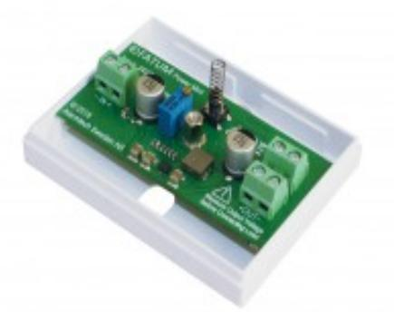
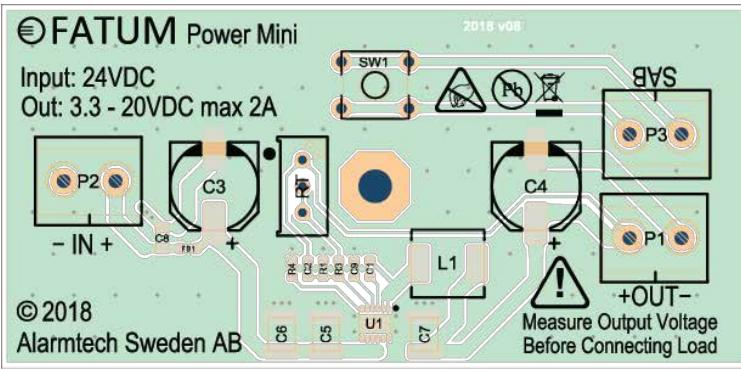

# 28097

## Power X1, DC/DC Omvandlare MINI 5-32 V -> 3.3-30 V

## **Produktdetajler:**

| Inspänning          | 5-32 VDC                                 |
|---------------------|------------------------------------------|
| Utspänning          | 3 - 30 VDC Justeras med potentiometer |
| Strömförbrukning    | Max 2A                                   |
| Sabotageskydd       | Ja                                       |
| Mått (L x B x H) mm | 58 x 76 x 27                             |

FATUM mini DC-DC omvandlare är lätt att använda för olika applikationer där det finns en strömförsörjning med delar av utrustningen som kräver en annan lägre inspänning. Inspänningsområdet är från 5V till 32V och max utspänning är inspänningen minus 2V. Max utström är 2A inom hela reglerområdet. Vilströmen är 75uA utan last vilket gör den lämplig för batteridrift. Kretsen är kortslutningsskyddad och temperaturskyddad.

### **Features**

- 5V to 32V inspänning
- 2A max kontinuerlig utström
- Reglerbar utspänning med potentiometer 3.3V-30V
- Max utspänning = Inspänning 2V
- 75-μA vilström i tomgång utan last
- Mjukstart med full last
- Kortslutningsskyddad
- Temperaturskyddad
- Stabil utspänning med lågt rippel
- Sabotageskyddad

### **BESTÄLLINGSINFORMATION**

Powered by TCPDF (www.tcpdf.org)

| Typ      | E-nr    | Beskrivning                               |
|----------|---------|-------------------------------------------|
| 28097.03 | 5010340 | DC-DC omvandlare MINI, 5-32 V -> 3.3-30 V |