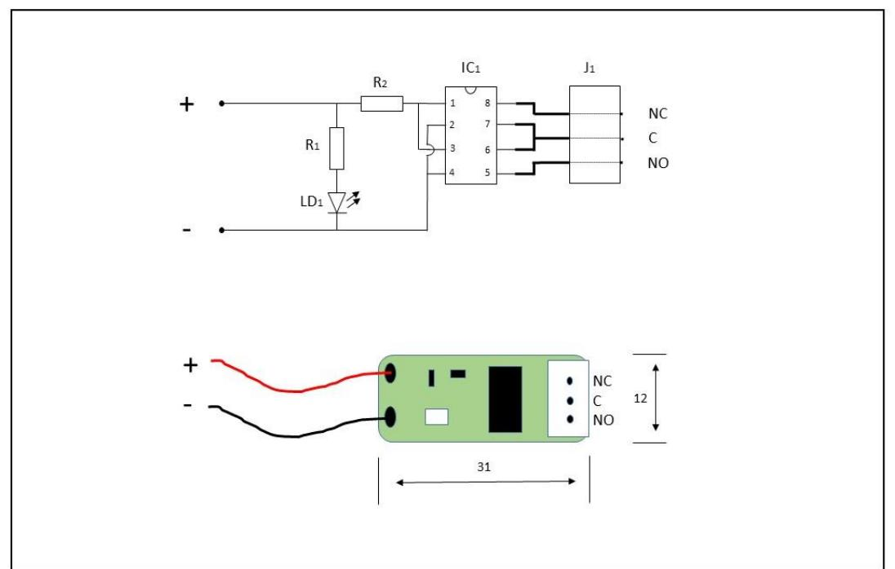
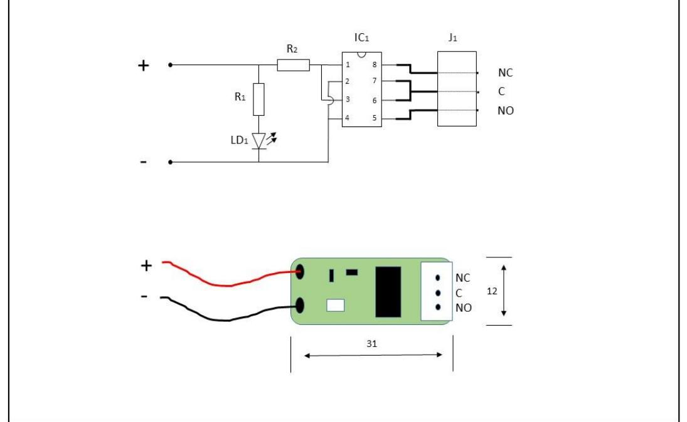

# **Datasheet and mounting instruction RCM 1, RCM 2**

# **DESCRIPTION**

RCM 1 and RCM 2 are very small universal relay cards that fit most types of security installations (burglar alarm, passage system, fire alarm, etc.). Both RCM 1 and RCM 2 have alternating relay with wire connection for relay control. The output terminals are of "push-in" type. When the voltage is applied, the relay is activated and this is indicated by the LED that is switched on. RCM 1 and RCM 2 are identical in size, the difference is the relay contacts: RCM 1 handles max 120mA, RCM 2 handles up to 1A.

# **MOUNTING INSTRUCTION**

RCM 1 and RCM 2 are mounted with the supplied selfadhesive tape.

## **ORDER CODE**

| Relay module RCM 1 | E-nr T.B.D. | RCM 1 |
|--------------------|-------------|-------|
| Relay module RCM 2 | E-nr T.B.D. | RCM 2 |

# **TECHNICAL SPECIFICATION**

| Unit                               | RCM 1                                          | RCM 2     |  |
|------------------------------------|------------------------------------------------|-----------|--|
| Relay                              | SPDT                                           |           |  |
| Input                              | 2 x 15cm wire                                  |           |  |
| Output                             | 3 x push-in, 0.14 – 0.34 mm2 (26 to 22 AWG) |           |  |
| Contact rating                     | 30 V, 120 mA                                   | 30 V, 1 A |  |
| Supply voltage                     | 8 – 30 V DC                                    |           |  |
| Supply current, relay energized | 4.5mA (at 8 V) 19 mA (at 30 V)              |           |  |
| Dimensions [mm]                    | 31x12x7 (LxBxH)                                |           |  |
| Weight [g]                         | 3                                              |           |  |
| Mounting                           | Self-adhesive tape                             |           |  |
| Operating temperature           | -20 °C to +50 °C                               |           |  |
| Compliance                         |                                                |           |  |

We reserve the rights to changes without notice

# **Datablad och installationsmanual RCM 1, RCM 2**

# **Systems Relämoduler**

# **BESKRIVNING**

RCM 1 och RCM 2 är mycket små universella reläkort som passar till de flesta typer av säkerhetsinstallationer (inbrottslarm, passagesystem, brandlarm mm). Både RCM 1 och RCM 2 har växlande relä med trådanslutning för relästyrning. Utgångsterminalerna är av ""push-in" typ. När spänning ansluts drar reläet och aktivt relä indikeras med att lysdioden tänds. RCM 1 och RCM 2 är identiska i storlek, skillnaden är reläkontakterna: RCM 1 hanterar max 120mA, RCM 2 hanterar upp till 1A.

## **MONTERING**

RCM 1 och RCM 2 monteras med en fästkudde som medföljer.

#### **BESTÄLLNINGSNUMMER**

| Relämodul RCM 1 | E-nr T.B.D. | RCM 1 |
|-----------------|-------------|-------|
| Relämodul RCM 2 | E-nr T.B.D. | RCM 2 |

## **TEKNISKA DATA**

| Relämodul                           | RCM 1                                            | RCM 2     |
|-------------------------------------|--------------------------------------------------|-----------|
| Relä                                | Växlande                                         |           |
| Ingångar                            | 2 x 15cm tråd                                    |           |
| Utgångar                            | 3 x push-in, 0.14 – 0.34 mm2 (26 till 22 AWG) |           |
| Reläkontakter                       | 30 V, 120 mA                                     | 30 V, 1 A |
| Inspänning                          | 8 – 30 V DC                                      |           |
| Strömförbrukning, relä aktiverat | 4.5mA (vid 8 V) 19 mA (vid 30 V)              |           |
| Storlek [mm]                        | 31x12x7 (LxBxH)                                  |           |
| Vikt [g]                            | 3                                                |           |
| Fastsättning                        | Fästkudde                                        |           |
| Temperatur område                | -20 °C till +50 °C                               |           |
| Normer                              |                                                  |           |

Vi förbehåller oss rätten till konstruktionsändringar