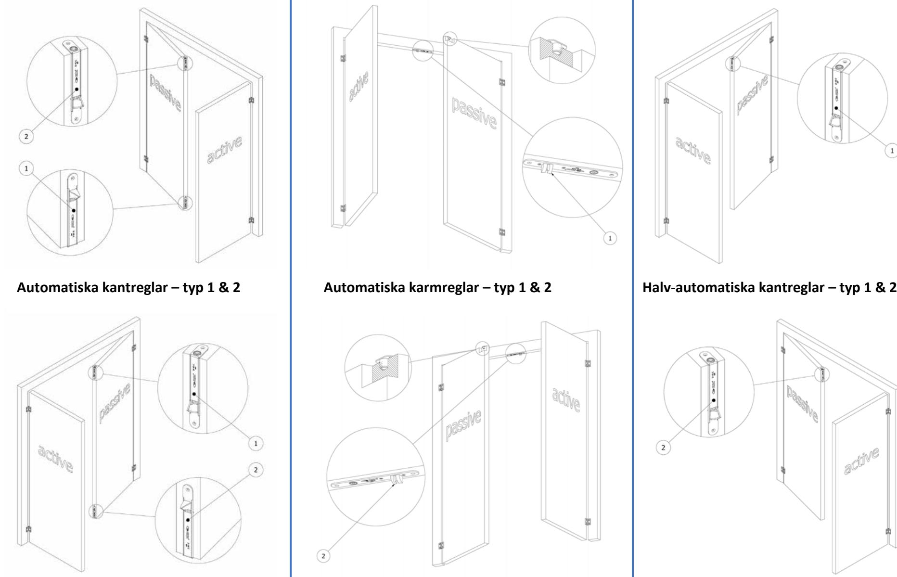

| Kantregel GUIDE trädörrar (2022-1) |                                           | A A 28 HZ OLD | M A 30 HZ OLD | +8 / +15 / +20 / +30 förlängd regel A A 28 HZ OLD | +8 / +15 / +20 / +30 M förlängd regel A 30 HZ OLD | A-C A 31 HZ OLD | A-DS A 34 HZ OLD | M-DS A 36 HZ OLD | A A 34 HZ OLD | A 35 HZS OLD  | A A 37 HZ OLD | A A 39 HZ OLD | Ø12 A-R32F Ø10 / A 33 HZ Ø8 / regel OLD | Ø12 M-R32 Ø10 / A 33 HZ Ø8 / regel OLD | A-20T m m regel 30 / 60 A 43 HZ OLD | M-20 m m regel 30 / 60 A 33 HZ OLD |
|------------------------------------------|-------------------------------------------|---------------------|---------------------|---------------------------------------------------------------|---------------------------------------------------------------|-----------------------|------------------------|------------------------|---------------------|------------------|---------------------|---------------------|-----------------------------------------------------------|----------------------------------------------------------|----------------------------------------------------|---------------------------------------------------|
|                                          | automatisk / manuell / halv-automatisk    | A                   | M                   | A                                                             | M                                                             | A                     | A                      | M                      | A                   | H-A              | A                   | A                   | A                                                         | M                                                        | A                                                  | M                                                 |
| funktion                                 | monteras i passiva dörrkantens hörn       | ✽                   | ✽                   | ✽                                                             | ✽                                                             | ✽                     |                        |                        | ✽                   | ✽                | ✽                   | ✽                   |                                                           |                                                          |                                                    |                                                   |
|                                          | monteras upptill i dörrkarmens överstycke |                     |                     |                                                               |                                                               |                       |                        |                        |                     |                  |                     |                     |                                                           |                                                          |                                                    |                                                   |
| egenskaper                               | produkthöjd                               | 168                 | 168                 | 168 +8 / +15 +20 / +30                                     | 168 +8 / +15 +20 / +30                                     | 160                   |                        | 189 + 50 189 + 50      | 190                 | 190              | 190                 | 188                 |                                                           | 200 +82 200 +82                                          | 200 +70                                            | 200 +70                                           |
|                                          | passar i profil / urtag djup              | 20                  | 20                  | 20                                                            | 20                                                            | 20                    | 23                     | 19                     | 23                  | 23               | 23                  | 23                  | 41                                                        | 40                                                       | 36                                                 | 31                                                |
|                                          | regel tvingande (T) / fjädrande (F)       | T                   | T                   | T                                                             | T                                                             | F                     | T                      | T                      | F                   | (F)              | T                   | F                   | F                                                         | T                                                        | T                                                  | T                                                 |
|                                          | stolpe rund (●) / kantig (□)              | ●                   | ●                   | ●                                                             | ●                                                             | ●                     | ●                      | ●                      | ●                   | ●                | ●                   | □                   | ●                                                         | ●                                                        | ●                                                  | □                                                 |
|                                          | stolpe i rostfritt stål                   |                     |                     |                                                               |                                                               |                       |                        |                        |                     |                  |                     |                     | ✽                                                         | ✽                                                        |                                                    |                                                   |
|                                          | passar med automatiska tätningströsklar   |                     |                     | ✽                                                             | ✽                                                             |                       | ✽                      | ✽                      |                     |                  |                     |                     | ✽                                                         | ✽                                                        | ✽                                                  | ✽                                                 |
|                                          | dorndjup utan stolpe                      | 10                  | 10                  | 10                                                            | 10                                                            | 8                     | 9                      | 9                      | 8                   | 0-16             | 0-16                | 8                   | 32                                                        | 32                                                       | 20                                                 | 20                                                |
|                                          | dorndjup med stolpe                       | 12                  | 12                  | 12                                                            | 12                                                            | 10                    | 12                     | 12                     | 11                  | 3-19             | 3-19                | 11                  | 34                                                        | 34                                                       | 22                                                 | 23                                                |
| regel                                    | dimension                                 | Ø 10                | Ø 10                | Ø 10                                                          | Ø 10                                                          | Ø 12                  | Ø 8                    | Ø 8                    |                     | Ø 12 15x17 15x17 |                     | Ø 10                | Ø8 / Ø10 / Ø12                                         | Ø8 / Ø10 / Ø12                                        | Ø 12                                               | Ø 12                                              |
|                                          | utstick / längd                           | +1                  | +1                  | +8 / +15 +20 / +30                                         | +8 / +15 +20 / +30                                         | +1                    | 50                     | 50                     | +1                  | +14              | +1                  | +1                  | 60                                                        | 60                                                       | 30 / 60                                            | 30 / 60                                           |
|                                          | justerbarhet                              | -1 +12           | -1 +6            | 0 +13                                                      | 0 +7                                                       | 0                     | -3 +11              | -3 +11              | 0                   | 0                | 0                   | 0                   | -7 +10                                                 | -7 +10                                                | -4 / -4 +10 / +10                               | -7 / -4 +7 / +15                               |
|                                          | projektion                                | 13                  | 20                  | 20 / 27 32 / 42                                            | 27 / 34 39 / 49                                            | 15                    | 15                     | 20                     | 15                  | 0                | 14                  | 15                  | 15                                                        | 18                                                       | 17                                                 | 20                                                |
| stolpe                                   | bredd                                     | 25                  | 25                  | 25                                                            | 25                                                            | 20                    | 18                     | 18                     | 18                  | 18               | 18                  | 16                  | 22                                                        | 22                                                       | 24                                                 | 22                                                |
|                                          | höjd                                      | 168                 | 168                 | 168                                                           | 168                                                           | 160                   | 189                    | 189                    | 189                 | 190              | 190                 | 188                 | 200                                                       | 200                                                      | 200                                                | 200                                               |
|                                          | tjocklek                                  | 2                   | 2                   | 2                                                             | 2                                                             | 2                     | 3                      | 3                      | 3                   | 3                | 3                   | 3                   | 2                                                         | 2                                                        | 2                                                  | 3                                                 |
|                                          | djup (L-formade stolpar)                  |                     |                     |                                                               |                                                               | 40                    |                        |                        | 50                  | 50               | 50                  | 50                  |                                                           |                                                          |                                                    |                                                   |

## **OLDA Kantregelguide – Automatiska kantreglar (HZA), Automatiska karmreglar (HZA), Halv-automatiska kantreglar (HZS)**

| Kantregel GUIDE dörrar av stål- & aluminiumprofiler (2022-1) |                                           | OLDA 26 HZA | OLDA 27 HZA | OLDA 31 HZA-C | OLDA 34 HZA-DS | OLDA 36 HZM-DS    | OLDA 34 HZA | OLDA 35 HZS      | OLDA 37 HZA | OLDA 39 HZA | OLDA 33 HZA-10F | OLDA 33 HZA-30F | OLDA 33 HZA-R32F regel Ø8 / Ø10 / Ø12 | regel Ø8 / Ø10 / Ø12 OLDA 33 HZM-R32 | OLDA 43 HZA-20T m regel 30 / 60 m | OLDA 33 HZM-20 m regel 30 / 60 m | OLDA 43 HZA-32T m regel 30 / 60 m | OLDA 33 HZM-32 m regel 30 / 60 m | OLDA 600 HZA | OLDA 602 HZA |
|-----------------------------------------------------------------------|-------------------------------------------|-------------|-------------|---------------|----------------|-------------------|-------------|------------------|-------------|-------------|-----------------|-----------------|------------------------------------------|-----------------------------------------|-----------------------------------------|----------------------------------------|-----------------------------------------|----------------------------------------|--------------|--------------|
| funktion                                                              | automatisk / manuell / halv-automatisk    | A           | A           | A             | A              | M                 | A           | H-A              | A           | A           | A               | A               | A                                        | M                                       | A                                       | M                                      | A                                       | M                                      | A            | A            |
|                                                                       | monteras i passiva dörrkantens hörn       | ✽           |             | ✽             |                |                   | ✽           | ✽                | ✽           | ✽           |                 |                 |                                          |                                         |                                         |                                        |                                         |                                        |              |              |
|                                                                       | monteras upptill i dörrkarmens överstycke |             |             |               |                |                   |             |                  |             |             |                 |                 |                                          |                                         |                                         |                                        |                                         |                                        | ✽            | ✽            |
| egenskaper                                                            | produkthöjd                               | 78          | 97 +195     | 160           |                | 189 + 50 189 + 50 | 190         | 190              | 190         | 188         |                 | 193 +68 193 +68 |                                          | 200 +82 200 +82                         | 200 +70                                 | 200 +70                                | 200 +70                                 | 200 +70                                | 136          | 200          |
|                                                                       | passar i profil / urtag djup              | 68          | 50          | 20            | 23             | 19                | 23          | 23               | 23          | 23          | 20              | 39              | 41                                       | 40                                      | 36                                      | 31                                     | 36                                      | 40                                     | 42           | 38           |
|                                                                       | regel tvingande (T) / fjädrande (F)       | T           | T           | F             | T              | T                 | F           | (F)              | T           | F           | (F)             | (F)             | F                                        | T                                       | T                                       | T                                      | T                                       | T                                      | T            | T            |
|                                                                       | stolpe rund (●) / kantig (□)              | ●           | ●           | ●             | ●              | ●                 | ●           | ●                | ●           | □           | □               | □               | ●                                        | ●                                       | ●                                       | □                                      | □                                       | □                                      | ●            | ●            |
|                                                                       | stolpe i rostfritt stål                   |             |             |               |                |                   |             |                  |             |             |                 |                 | ✽                                        | ✽                                       |                                         |                                        |                                         |                                        |              | ✽            |
|                                                                       | passar med automatiska tätningströsklar   |             |             |               | ✽              | ✽                 |             |                  |             |             |                 |                 | ✽                                        | ✽                                       | ✽                                       | ✽                                      | ✽                                       | ✽                                      |              |              |
| regel                                                                 | dorndjup utan stolpe                      | 18-64       | 40          | 8             | 9              | 9                 | 8           | 0-16             | 0-16        | 8           | 10              | 30              | 32                                       | 32                                      | 20                                      | 20                                     | 32                                      | 32                                     | 60 c/c    | 100 c/c   |
|                                                                       | dorndjup med stolpe                       | 21-66       | 42,5        | 10            | 12             | 12                | 11          | 3-19             | 3-19        | 11          | 12              | 32              | 34                                       | 34                                      | 22                                      | 23                                     | 34                                      | 35                                     | 0            | 0            |
|                                                                       | dimension                                 | 44x10       | Ø 12        | Ø 12          | Ø 8            | Ø 8               |             | Ø 12 15x17 15x17 |             | Ø 10        | Ø 12            | Ø 12            | Ø8 / Ø10 / Ø12                        | Ø8 / Ø10 / Ø12                       | Ø 12                                    | Ø 12                                   | Ø 12                                    | Ø 12                                   | Ø 14         | Ø 14         |
|                                                                       | utstick / längd                           | 0           | 42          | +1            | 50             | 50                | +1          | +14              | +1          | +1          | 32              | 32              | 60                                       | 60                                      | 30 / 60                                 | 30 / 60                                | 30 / 60                                 | 30 / 60                                | +1           | +1           |
|                                                                       | justerbarhet                              | 0           | -9 +9    | 0             | -3 +11      | -3 +11         | 0           | 0                | 0           | 0           | -8 +10       | -8 +10       | -7 +10                                | -7 +10                               | -4 / -4 +10 / +10                    | -7 / -4 +7 / +15                    | -4 / -4 +10 / +10                    | -7 / -4 +7 / +15                    | -4 +4     | -2 +2     |
|                                                                       | projektion                                | 23          | 15          | 15            | 15             | 20                | 15          | 0                | 14          | 15          | 16              | 16              | 15                                       | 18                                      | 17                                      | 20                                     | 17                                      | 20                                     | 20           | 25           |
| stolpe                                                                | bredd                                     | 25          | 25          | 20            | 18             | 18                | 18          | 18               | 18          | 16          | 24              | 24              | 22                                       | 22                                      | 24                                      | 22                                     | 22                                      | 22                                     | 24           | 24           |
|                                                                       | höjd                                      | 78          | 97          | 160           | 189            | 189               | 189         | 190              | 190         | 188         | 193             | 193             | 200                                      | 200                                     | 200                                     | 200                                    | 200                                     | 200                                    | 136          | 200          |
|                                                                       | tjocklek                                  | 2,5         | 2,5         | 2             | 3              | 3                 | 3           | 3                | 3           | 3           | 2               | 2               | 2                                        | 2                                       | 2                                       | 3                                      | 2                                       | 3                                      | 2,5          | 2,5          |
|                                                                       | djup (L-formade stolpar)                  | 87,5        |             | 40            |                |                   | 50          | 50               | 50          | 50          |                 |                 |                                          |                                         |                                         |                                        |                                         |                                        |              |              |

## **OLDA Kantregelguide – Automatiska kantreglar (HZA), Automatiska karmreglar (HZA), Halv-automatiska kantreglar (HZS)**

