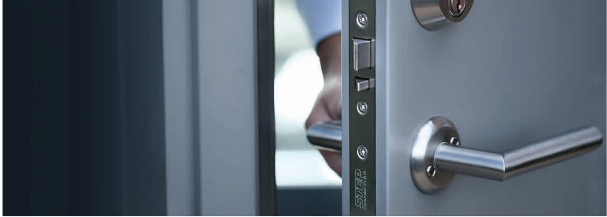
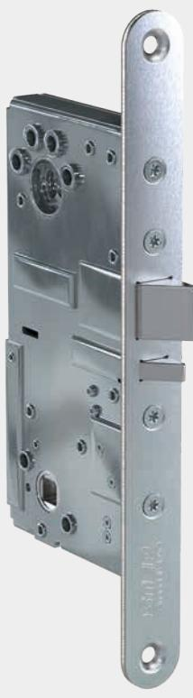
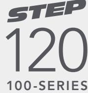
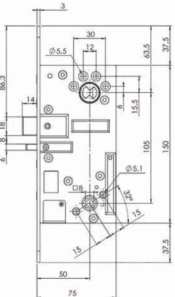
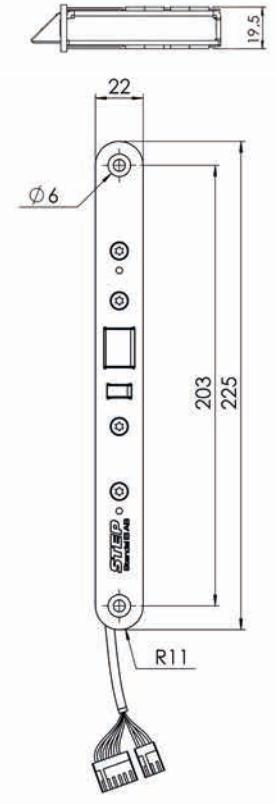
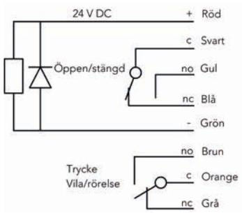

#### www.steplock.se

# STEP 120 – Kraftfull prestanda, hög driftsäkerhet

STEP 120 är ett eltryckeslås som ingår i STEP 100-serien. Konstruktionen är utvecklat för daglåsning och framtagen med STEPs höga kvalitetskrav och fina materialval, vilket säkerställer en kraftfull prestanda med hög driftsäkerhet. Låset har flera flexibla egenskaper och kan användas i dörrmiljöer med både brand- och utrymningskrav.

#### Rejäl konstruktion med hög flexibilitet

STEP 120 har en klassisk kolvplacering och kan fås med eller utan split funktion. Väljer du en av produkterna med split funktion kan du låta valfri sida av låset ske med mekanisk utpassering.

Utrymning och hög hållbarhet säkerställs genom att den mekaniskt styrda sidan har en rejäl fastsättning där split funktionen säkras av rostfria och härdade detaljer.

STEP 120 har flera valbara funktioner, som dörrhängning, rättvänd/omvänd funktion samt val av mekaniskt inkopplad sida. Låset är utvecklat för en enkel driftsättning där inställningen av de valbara funktionerna sker lättåtkomligt och smidigt från låshusets utsida.

Inbyggda mikrobrytare indikerar stängt och förreglat läge samt tryckesmanövrering, för inkoppling till passersystem.

#### Uppfyller både utrymnings- och brandkrav

Med STEP nödutrymningsbehör och STEP 120 eltryckeslås kan du säkerställa utrymningskraven enligt SS-EN 179. All passage från insidan kan då ske med samma trycke. Brandgodkänd upp till brandteknisk klass E/EI 120. 120

#### När det måste fungera. När det måste fungera.

## Tekniska data

Brandgodkänd upp till E/EI 120

### Strömförbrukning i rättvänd och omvänd funktion*

| 24 V DC + 15 % - 10 %                                            | 12 V DC + 15 % - 10 % |  |
|------------------------------------------------------------------|-----------------------|--|
| Max 60 mA                                                        | Max 120 mA            |  |
| * Strömförbrukning 0 mA i vila (rättvänd = låst, omvänd = olåst) |                       |  |

| Art.nr   | Benämning                                                     |
|----------|---------------------------------------------------------------|
| ST120    | Eltryckeslås 24 V DC, klassisk kolvplacering, split funktion. |
| ST120-12 | Eltryckeslås 12 V DC, klassisk kolvplacering, split funktion. |
| ST122    | Eltryckeslås 24 V DC, klassisk kolvplacering.                 |
| ST122-12 | Eltryckeslås 12 V DC, klassisk kolvplacering.                 |

- Durability: Grade X enligt SS-EN 14846.
- Brandgodkänd för brandteknisk klass E/EI 120.
- Mikrobrytare enpoligt växlande, max. 30 V DC, 1 A.
- Inbyggda mikrobrytare indikerar stängt och förreglat
- läge samt tryckesmanövrering. • Skyddsdiod finns inbyggd.
- Vändbar för att passa höger- och vänsterdörrar.
- Omställbar rättvänd/omvänd funktion.
- Omställbar elektrisk/mekaniskt manövrerad sida.
- Anpassat för runda och ovala skandinaviska cylindrar.
- Dorndjup 50 mm.
- Återfjädrande trycken rekommenderas.

Måttskiss STEP 120.

Kopplingsschema STEP 120.