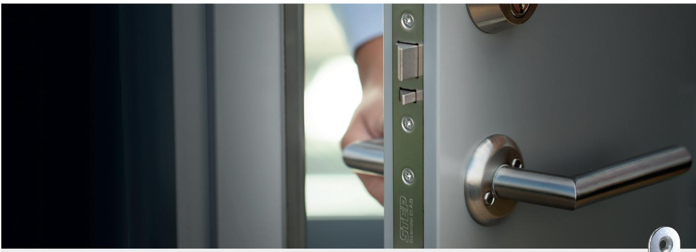
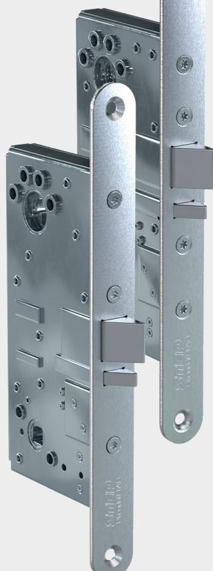
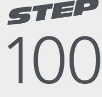
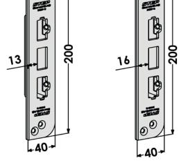
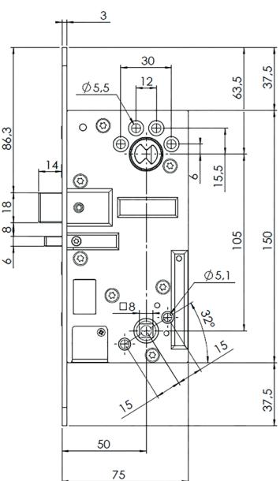
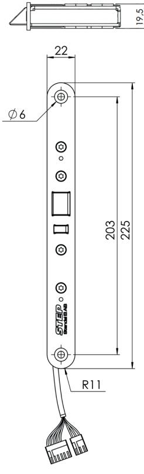
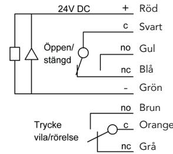

#### www.steplock.se

# STEP 100-serien – Kraftfull prestanda, hög driftsäkerhet

STEP 100 är en serie eltryckeslås utvecklat för daglåsning. Konstruktionen är framtagen med STEPs höga kvalitetskrav och fina materialval vilket säkerställer en kraftfull prestanda med hög driftsäkerhet. Låsen har flera flexibla egenskaper och kan användas i dörrmiljöer med både brand- och utrymningskrav.

### Rejäl konstruktion med hög flexibilitet

STEP 100 finns med modern eller klassisk kolvplacering samt med eller utan split funktion. Väljer du en av produkterna med split funktion kan du låta valfri sida av låset ske med mekanisk utpassering.

Utrymning och hög hållbarhet säkerställs genom att den mekaniskt styrda sidan har en rejäl fastsättning där split funktionen säkras av rostfria och härdade detaljer.

Låsen har flera valbara funktioner, som dörrhängning, rättvänd/omvänd funktion samt valet av mekaniskt inkopplad sida. Låsen är utvecklade för en enkel driftsättning där inställningen av de valbara funktionerna sker lättåtkomligt och smidigt från låshusets utsida.

Inbyggda mikrobrytare indikerar stängt och förreglat läge samt tryckesmanövrering, för inkoppling till passersystem.

#### Uppfyller både utrymnings- och brandkrav

Med STEP nödutrymningsbehör och STEP 100 eltryckeslås kan du säkerställa utrymningskraven enligt SS-EN 179. All passage från insidan kan då ske med samma trycke. Brandprovad upp till brandteknisk klass E/EI 120.

## När det måste fungera.

# Tekniska data

| Strömförbrukning i rättvänd och omvänd funktion*                 |                       |
|------------------------------------------------------------------|-----------------------|
| 24 V DC + 15 % - 10 %                                            | 12 V DC + 15 % - 10 % |
| Max 60 mA                                                        | Max 120 mA            |
| * Strömförbrukning 0 mA i vila (rättvänd = låst, omvänd = olåst) |                       |

| Art.nr   | Benämning                                                     |
|----------|---------------------------------------------------------------|
| ST110    | Eltryckeslås 24 V DC, modern kolvplacering, split funktion.   |
| ST110-12 | Eltryckeslås 12 V DC, modern kolvplacering, split funktion.   |
| ST112    | Eltryckeslås 24 V DC, modern kolvplacering.                   |
| ST112-12 | Eltryckeslås 12 V DC, modern kolvplacering.                   |
| ST120    | Eltryckeslås 24 V DC, klassisk kolvplacering, split funktion. |
| ST120-12 | Eltryckeslås 12 V DC, klassisk kolvplacering, split funktion. |
| ST122    | Eltryckeslås 24 V DC, klassisk kolvplacering.                 |
| ST122-12 | Eltryckeslås 12 V DC, klassisk kolvplacering.                 |

- Durability: Grade X enligt SS-EN 14846.
- Brandprovad för brandteknisk klass E/EI 120.
- Mikrobrytare enpoligt växlande, max. 30 V DC, 1 A.
- Inbyggda mikrobrytare indikerar stängt och förreglat läge samt tryckesmanövrering.
- Skyddsdiod finns inbyggd.
- Vändbar för att passa höger- och vänsterdörrar.
- Omställbar rättvänd/omvänd funktion.
- Anpassat för runda och ovala Skandinaviska cylindrar.
- Dorndjup 50 mm.

| Art.nr tillbehör | Benämning                            |
|------------------|--------------------------------------|
| ST2009-13        | Slutbleck 200x40 mm. Plösmått 13 mm. |
| ST2009-16        | Slutbleck 200x40 mm. Plösmått 16 mm. |
| ST2009-13        | ST2009-16                            |
|                  |                                      |

## STEP nödutrymningsbehör ger en säker utrymning

Med STEP nödutrymningsbehör kan du säkerställa utrymningskraven enligt SS-EN 179. All passage från insidan kan då ske med samma trycke, vilket skapar en säker utrymning vid en nödsituation. Anpassad för användning tillsammans med eltryckeslås STEP 100.

- Finns för höger- och vänsterhängd dörr.
- Tillverkad i rostfritt stål.
- Brandprovad upp till brandteknisk klass E/EI 120.

Måttskiss för ST120 med klassisk kolvplacering, samt kopplingsschema.