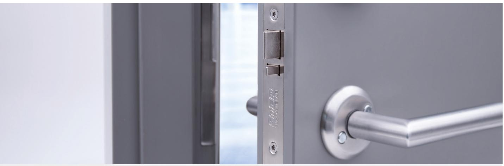
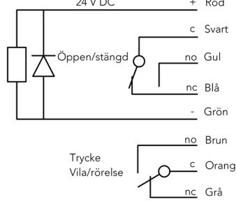
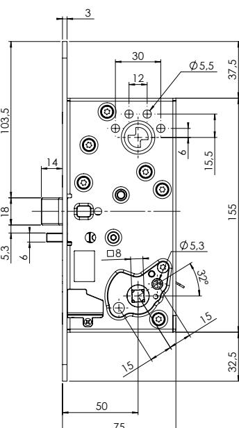
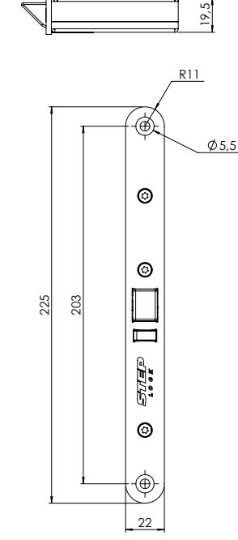

### www.steplock.se

# STEP 110

### – eltryckeslås med Direct DriveTM funktion och modern kolvplacering

STEP 110 är ett slitstarkt eltryckeslås med modern kolvplacering. Låset är utrustat med direktdrift, så kallad Direct Drive™, vilket medför en mycket mjuk och följsam upplevelse kring användningen av trycket.

### Direct DriveTM ger en följsam känsla med direkt manövrering

Eltryckeslåsets patentsökta Direct DriveTM-funktion ger en direkt manövrering och en mycket följsam känsla när dörrens trycke används. Konceptet ger en helt ny dimension av hur ett eltryckeslås kan upplevas.

### Modern kolvplacering och flera flexibla egenskaper

STEP 110 har en modern kolvplacering där cylinderfallkolven är placerad i centrum av låskistan. Låset kan fås med eller utan splitfunktion. Väljer du en av produkterna med splitfunktion kan du låta valfri sida av låset ske med mekanisk utpassering.

Utrymning och hög hållbarhet säkerställs genom att den mekaniskt styrda sidan har en rejäl fastsättning där splitfunktionen säkras av rostfria och härdade detaljer.

STEP 110 har flera valbara funktioner, som dörrhängning, rättvänd/omvänd funktion samt val av mekaniskt inkopplad sida. Inbyggda mikrobrytare indikerar stängt och förreglat läge samt tryckesmanövrering, för inkoppling till passersystem.

### Brett användningsområde

Med STEP nödutrymningsbehör och STEP 110 eltryckeslås kan du säkerställa utrymningskraven enligt SS-EN 179. All passage från insidan kan då ske med samma trycke.

Konstruktionen lämpar sig mycket väl för användning tillsammans med elsutbleck. 110

# 100-SERIES

#### När det måste fungera. När det måste fungera.

## Tekniska data

| Strömförbrukning i rättvänd och omvänd funktion |                                                                |
|-------------------------------------------------|----------------------------------------------------------------|
| 24 V DC + 15 % - 10 %                           | 12 V DC + 15 % - 10 %                                          |
| Max 60 mA                                       | Max 120 mA                                                     |
|                                                 | Strömförbrukning 0 mA i vila (rättvänd = låst, omvänd = olåst) |

| Art.nr   | Benämning                                                            |
|----------|----------------------------------------------------------------------|
| ST110    | Eltryckeslås STEP 110. Modern kolvplacering, splitfunktion, 24 V DC. |
| ST110-12 | Eltryckeslås STEP 110. Modern kolvplacering, splitfunktion, 12 V DC. |
| ST112    | Eltryckeslås STEP 110. Modern kolvplacering, 24 V DC.                |
| ST112-12 | Eltryckeslås STEP 110. Modern kolvplacering, 12 V DC.                |

### Art.nr tillbehör Benämning ST1087 Skruv- och kontaktkit för STEP 110. ST1088-40 STEP Tryckespinne 8x8x40 mm. ST1088-50 STEP Tryckespinne 8x8x50 mm. ST1088-60 STEP Tryckespinne 8x8x60 mm. ST1088-70 STEP Tryckespinne 8x8x70 mm.

- Mikrobrytare enpoligt växlande, max. 30 V DC, 1 A.
ST1088-80 STEP Tryckespinne 8x8x80 mm. ST1193 Osymmetrisk låshusstolpe för STEP 110.

- Inbyggd Direct Drive™-funktion som ger en direkt manövrering av trycket.
This document shall not be copied without owners written allowance and its content shall not be exposed for third part nor be used for unauthorized purpose.

14

6

103,5

This document shall not be copied without owners written allowance and its content shall not be exposed for third part nor be used for unauthorized purpose.

12

15

 50 75

8

30 5,5

6 15,5

5,3

32°

15

19,5

3

- Inbyggda mikrobrytare indikerar stängt och förreglat läge samt tryckes-
- manövrering.
- Skyddsdiod finns inbyggd.
- Vändbar för att passa höger- och vänsterdörrar.
- Omställbar rättvänd/omvänd funktion.
- Omställbar elektrisk/mekaniskt manövrerad sida.
- Anpassat för runda och ovala skandinaviska cylindrar.
- Dorndjup 50 mm.
- Både återfjädrande trycken och icke återfjädranden trycken kan användas. 18 5,3
- Samma verktyg kan användas för samtliga skruvar.
- Halogenfri kabel.
- Patentsökt Direct DriveTM-funktion.

### STEP 110 KPL

STEP 110 KPL är ett komplett set som innehåller STEP 110 eltryckeslås, STEP kabelöverföring och 10 m halogenfri kabel. 

| This document shall not be copied without owners written allowance and its content shall not be exposed for third part nor be used for unauthorized purpose. STEP kabelöverföring är tillverkad i rostfritt stål och passar både trä-, stål- och aluminiumdörrar. Fjädern har en bred innerdiameter på 10,8 mm som underlättar genomföringen av kabeln. |                                                                   |  |  |
|------------------------------------------------------------------------------------------------------------------------------------------------------------------------------------------------------------------------------------------------------------------------------------------------------------------------------------------------------------------|-------------------------------------------------------------------|--|--|
| Art.nr                                                                                                                                                                                                                                                                                                                                                           | Benämning                                                         |  |  |
| ST110 KPL                                                                                                                                                                                                                                                                                                                                                        | Komplett set. Inklusive ST110, kabelöverföring och 10 m kabel.    |  |  |
| ST110-12 KPL                                                                                                                                                                                                                                                                                                                                                     | Komplett set. Inklusive ST110-12, kabelöverföring och 10 m kabel. |  |  |
| ST112 KPL                                                                                                                                                                                                                                                                                                                                                        | Komplett set. Inklusive ST112, kabelöverföring och 10 m kabel.    |  |  |
| ST112-12 KPL                                                                                                                                                                                                                                                                                                                                                     | Komplett set. Inklusive ST112-12, kabelöverföring och 10 m kabel. |  |  |
|                                                                                                                                                                                                                                                                                                                                                                  |                                                                   |  |  |
|                                                                                                                                                                                                                                                                                                                                                                  |                                                                   |  |  |
|                                                                                                                                                                                                                                                                                                                                                                  |                                                                   |  |  |

Måttskiss STEP 110.

37,5 155 32,5

Kopplingsschema STEP 110.

R11

R11

225

225

203

203

22

Material

Owner

Material <not specified>

Surface finish

Designed by Checked by

22

5,5

5,5

Material

Material

Owner

Approved - date General tolerance Viewing Scale

Step 110 24V ST110

Title/Description

Stendals El AB A2

LJN 2019-09-04 SS-ISO 2768-1 m 1:1

Drawing no Revision Sheet

Sheet size

1/1

Owner

Material <not specified>

Material <not specified>

Surface finish

Surface finish

Designed by Checked by

Designed by Checked by

Approved - date General tolerance Viewing Scale

Approved - date General tolerance Viewing Scale

Step 110 24V ST110

Step 110 24V ST110

Title/Description

Title/Description

Stendals El AB A2

Stendals El AB A2

LJN 2019-09-04 SS-ISO 2768-1 m 1:1

LJN 2019-09-04 SS-ISO 2768-1 m 1:1

Drawing no Revision Sheet

Drawing no Revision Sheet

Sheet size

Sheet size

1/1

1/1

75

