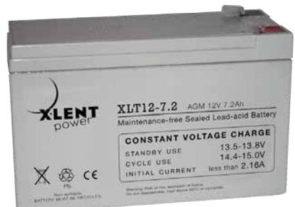
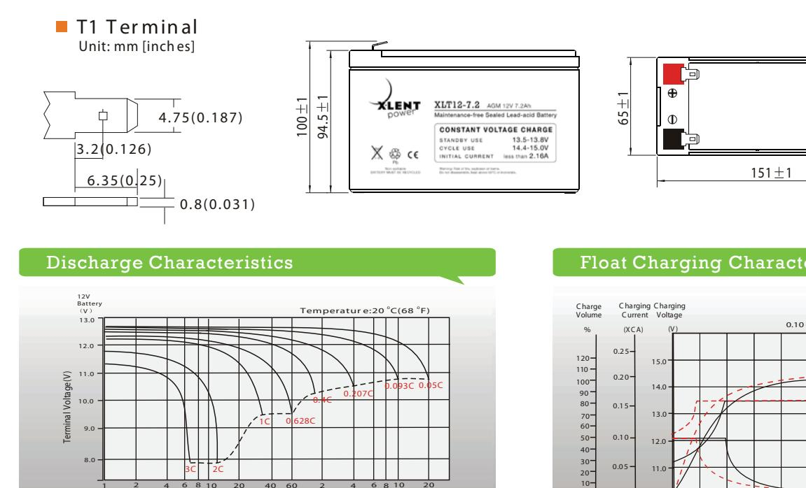
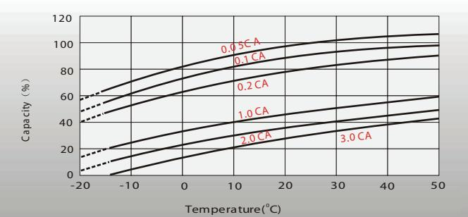
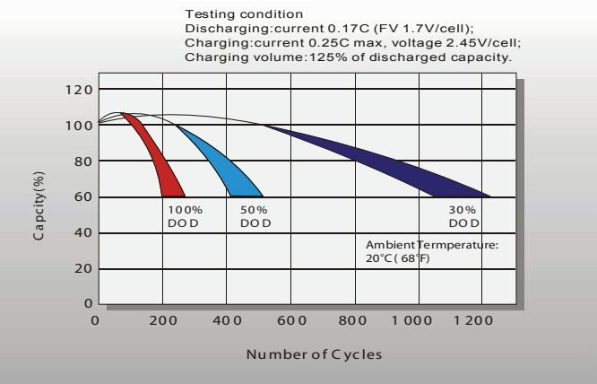
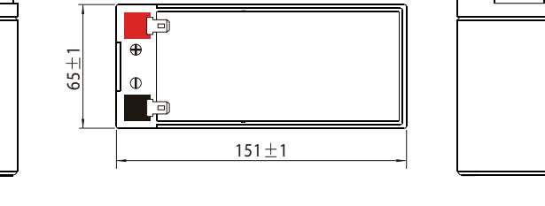
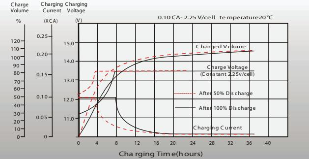
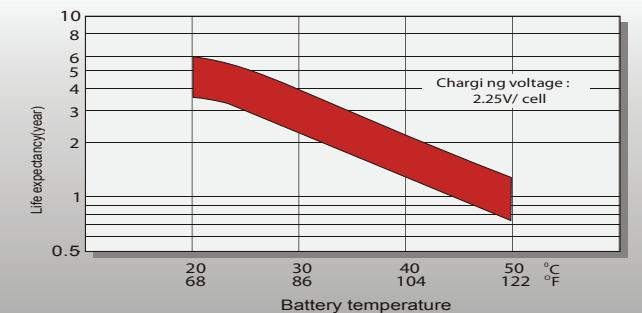
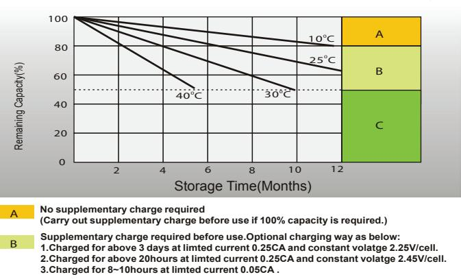

# XLT Series - General Purpose XLT12-7 12V 7.0Ah

| Specifications                |                                                                                                                              |                                                               |  |  |  |  |  |  |
|-------------------------------|------------------------------------------------------------------------------------------------------------------------------|---------------------------------------------------------------|--|--|--|--|--|--|
| Nominal Voltage               | 12V                                                                                                                          |                                                               |  |  |  |  |  |  |
| Nominal Capacity(20HR)        | 7.00Ah                                                                                                                       |                                                               |  |  |  |  |  |  |
|                               | Length                                                                                                                       | 151 1mm (5.94 inches)                                      |  |  |  |  |  |  |
|                               | Width                                                                                                                        | 65 1mm (2.56 inches)                                       |  |  |  |  |  |  |
| Dimension                     | Container Height                                                                                                             | 94.5 1mm (3.72 inches)                                     |  |  |  |  |  |  |
|                               | Total Height (with Terminal) 100 1mm (3.94 inches)                                                                     |                                                               |  |  |  |  |  |  |
| Approx Weight                 | Approx 2.18 kg (4.81lbs)                                                                                                     |                                                               |  |  |  |  |  |  |
| Terminal                      | T1 / T2                                                                                                                      |                                                               |  |  |  |  |  |  |
| Container Material            | ABS                                                                                                                          |                                                               |  |  |  |  |  |  |
|                               | 7.00 AH/0.340A                                                                                                               | 0 0 (20hr ,1.80V/cell,20 C/68 F)                        |  |  |  |  |  |  |
|                               | 6.31 AH/0.631A                                                                                                               | 0 0 (10hr,1.80V/cell,20 C/68 F)                         |  |  |  |  |  |  |
| Rated Capacity                | 5.70 AH/1.14A                                                                                                                | 0 0 (5hr,1.75V/cell,20 C/68 F)                          |  |  |  |  |  |  |
|                               | 5.13 AH/1.71A                                                                                                                | 0 0 (3hr,1.75V/cell,20 C/68 F)                          |  |  |  |  |  |  |
|                               | 4.18 AH/4.18A                                                                                                                | 0 0 (1hr,1.60V/cell,20 C/68 F)                          |  |  |  |  |  |  |
| Max. Discharge Current        | 105A (5s)                                                                                                                    |                                                               |  |  |  |  |  |  |
| Internal Resistance           | Approx 23mÙ                                                                                                                  |                                                               |  |  |  |  |  |  |
|                               | 0 Discharge : -15 50 C (5                                                                                              | 0 122 F)                                                   |  |  |  |  |  |  |
| Operating Temp.Range          | 0 0 Charge : 0 40 C (32 104 F)                                                                             |                                                               |  |  |  |  |  |  |
|                               | 0 0 Storage : -15 40 C (5 104 F)                                                                              |                                                               |  |  |  |  |  |  |
| Nominal Operating Temp. Range | 0 0 20 3 C (68 5 F )                                                                                             |                                                               |  |  |  |  |  |  |
|                               | Initial Charging Current less than 2.1A.Voltage                                                                              |                                                               |  |  |  |  |  |  |
| Cycle Use                     | 0 0 0 14.25V~14.85V at 20 C(68 F)Temp. Coefficient -30mV/ C                                                         |                                                               |  |  |  |  |  |  |
|                               | No limit on Initial Charging Current Voltage                                                                                 |                                                               |  |  |  |  |  |  |
| Standby Use                   | 0                                                                                                                            | 0 0 13.4V~13.7V at 20 C(68 F)Temp. Coefficient -20mV/ C |  |  |  |  |  |  |
|                               | o o 40 C (104 F)                                                                                                    | 103%                                                          |  |  |  |  |  |  |
| Capacity affected by          | o o 25 C ( 77 F)                                                                                                    | 100%                                                          |  |  |  |  |  |  |
| Temperature                   | o o 0 C ( 32 F)                                                                                                     | 86%                                                           |  |  |  |  |  |  |
| Self Discharge                | XLNT power XLT series batteries may be stored for up to 6 months at 20°C (68°F) and then a freshening charge is required. |                                                               |  |  |  |  |  |  |

months at 20°C (68°F) and then a freshening charge is required. For higher temperatures the time interval will be shorter.

## Applications

- All purpose
- Uninterruptable Power Supply (UPS)
- Electric Power System (EPS)
- Emergency backup power supply
- Emergency light
- Railway signal
- Aircraft signal
- Alarm and security system
- Electronic apparatus and equipment
- Communication power supply
- DC power supply
- Auto control system

| 0 0 Cons tant Current Dis ch arge (Amperes) at 20 C (68 F ) |      |       |       |       |       |       |      |      |      |      |      |      |       |       |       |
|-------------------------------------------------------------------|------|-------|-------|-------|-------|-------|------|------|------|------|------|------|-------|-------|-------|
| F.V/Tim e                                                         | 5min | 10min | 15min | 20min | 30min | 45min | 1h   | 2h   | 3h   | 4h   | 5h   | 6h   | 8h    | 10h   | 20h   |
| 1.85V/cell                                                        | 12.7 | 9.72  | 8.06  | 6.97  | 5.39  | 3.97  | 3.34 | 2.00 | 1.56 | 1.27 | 1.04 | 0.91 | 0.733 | 0.612 | 0.336 |
| 1.80V/cell                                                        | 17.0 | 12.4  | 9.73  | 8.23  | 6.35  | 4.61  | 3.75 | 2.18 | 1.68 | 1.36 | 1.11 | 0.98 | 0.778 | 0.631 | 0.340 |
| 1.75V/cell                                                        | 19.2 | 13.7  | 10.6  | 8.86  | 6.60  | 4.79  | 3.92 | 2.26 | 1.71 | 1.39 | 1.14 | 1.00 | 0.791 | 0.648 | 0.343 |
| 1.70V/cell                                                        | 21.1 | 14.9  | 11.4  | 9.31  | 6.87  | 4.98  | 4.04 | 2.32 | 1.76 | 1.42 | 1.17 | 1.02 | 0.802 | 0.661 | 0.349 |
| 1.65V/cell                                                        | 23.3 | 16.1  | 12.1  | 9.89  | 7.24  | 5.10  | 4.14 | 2.35 | 1.84 | 1.47 | 1.20 | 1.04 | 0.815 | 0.675 | 0.354 |
| 1.60V/cell                                                        | 25.7 | 17.4  | 12.9  | 10.5  | 7.65  | 5.32  | 4.18 | 2.45 | 1.89 | 1.52 | 1.24 | 1.07 | 0.823 | 0.682 | 0.356 |

| 0 0 Cons tant P ower Dis ch arge (Watts ) at 20 C (68 F ) |      |       |       |       |       |       |      |      |      |      |      |      |      |      |       |
|-----------------------------------------------------------------|------|-------|-------|-------|-------|-------|------|------|------|------|------|------|------|------|-------|
| F.V/Tim e                                                       | 5min | 10min | 15min | 20min | 30min | 45min | 1h   | 2h   | 3h   | 4h   | 5h   | 6h   | 8h   | 10h  | 20h   |
| 1.85V/cell                                                      | 23.2 | 18.0  | 15.0  | 13.1  | 10.3  | 7.63  | 6.45 | 3.88 | 3.05 | 2.49 | 2.03 | 1.79 | 1.45 | 1.21 | 0.666 |
| 1.80V/cell                                                      | 30.7 | 22.7  | 17.9  | 15.3  | 11.9  | 8.80  | 7.19 | 4.21 | 3.26 | 2.64 | 2.17 | 1.91 | 1.53 | 1.25 | 0.672 |
| 1.75V/cell                                                      | 33.9 | 24.5  | 19.3  | 16.3  | 12.3  | 9.05  | 7.48 | 4.35 | 3.31 | 2.69 | 2.22 | 1.95 | 1.55 | 1.28 | 0.677 |
| 1.70V/cell                                                      | 36.3 | 26.1  | 20.4  | 17.0  | 12.7  | 9.37  | 7.70 | 4.45 | 3.39 | 2.76 | 2.27 | 1.99 | 1.57 | 1.30 | 0.689 |
| 1.65V/cell                                                      | 39.5 | 27.9  | 21.5  | 17.9  | 13.3  | 9.52  | 7.82 | 4.48 | 3.52 | 2.84 | 2.33 | 2.03 | 1.59 | 1.33 | 0.698 |
| 1.60V/cell                                                      | 42.6 | 29.6  | 22.6  | 18.9  | 13.9  | 9.87  | 7.85 | 4.65 | 3.61 | 2.92 | 2.40 | 2.07 | 1.61 | 1.34 | 0.701 |

### Dimensions

Temperature Effects in Relation to Battery Capacity

Dis charge T ime

ម

#### Float Charging Characteristics

#### Effect of Temperature on Long Term Float L ife

#### Self Discharge Characteristics

Supplementary charge may often fail to recover the capacity.
The battery should never be left standing till this is reached.