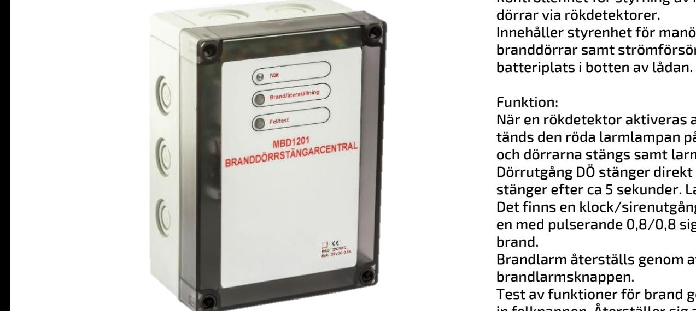
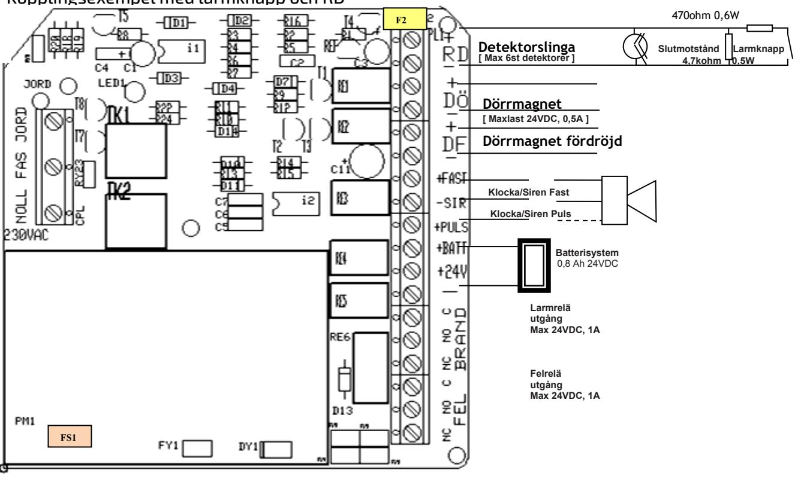

## **MBD1201 Branddörrstängarcentral**

 **SM40** 

## Skydd:

Aggregatet är skyddat mot överbelastning och kortslutning.

Inbyggt skydd mot djupurladdning av batterierna. Nät och batteri är skyddas av säkring.

### Indikeringar och larm

- Drift: Indikeras med grön lysdiod. Slingfel: Indikeras med gul lysdiod. Växlande potentialfritt larmrelä (1A 50V).
- Brandlarm: Indikeras med röd lysdiod. Växlande potentialfritt larmrelä (1A 50V).

## BESKRIVNING

Kontrollenhet för styrning av magnetupphängda dörrar via rökdetektorer. Innehåller styrenhet för manövrering av branddörrar samt strömförsörjning och

batteriplats i botten av lådan.

## Funktion:

När en rökdetektor aktiveras av rökutveckling tänds den röda larmlampan på kontrollenheten och dörrarna stängs samt larmreläet växlar. Dörrutgång DÖ stänger direkt och dörrutgång DF stänger efter ca 5 sekunder. Larmrelä växlar. Det finns en klock/sirenutgång med fast signal och en med pulserande 0,8/0,8 signal som startar vid brand.

Brandlarm återställs genom att trycka in brandlarmsknappen.

Test av funktioner för brand görs genom att trycka in felknappen. Återställer sig automatiskt. Vid avbrott i detektorslingan tänds gul fellampa och felrelä växlar.

Förberedd för genomförningar på alla sidor. Kapslingsklass IP31

Plats för underhållsfria blybatterier – 2x0,8Ah.

## TEKNISKA DATA

| Inspänning  | 230VAC +/- 15%            |
|-------------|---------------------------|
|             | 1 fas 50-60Hz             |
| Utspänning  | 24VDC                     |
| Strömförbr. | Typ 20mA                  |
| Ström       | max 0,6A                  |
| Reglering   | max 0,5 %                 |
|             | Rippelspänn. max 0,1 % av |
|             | utspänningen              |
| Temp.omr-   | -15 – 40 C                |

### CE-märkt - EN61000-6-3:2001, EN61000-6-2:2005

| E Nummer | Typ      | Beskrivning            | Utsp. | Utström | Batterikapacitet max | HxBxD mm       |
|-------------|----------|------------------------|-------|---------|----------------------|----------------|
| 6305000     | MBD1201  | Brandörrstängarcentral | 24VDC | 0,6A    | 0,8Ah                | 230 x 100 x 50 |
| 6305001     | MBD-BATT | Batteripaket 2x0,8Ah   | 24VDC |         | 0,8Ah                |                |
|             |          |                        |       |         |                      |                |

Postadress/Postal address Swansons Telemekanik AB Hålstensvägen 4 SE-446 37 Älvängen

Telefon nr/Telephone no +46(0)303-746 320 Hemsida/Webb Swansonstelemekanik.se e-post info@swtm.se VAT.NO SE556289017701

# **MBD1201**

**Branddörrstängarcentral**

## SÄKERHET

Endast auktoriserad och erfaren personal inom AC och DC får använda, arbeta, serva/underhålla, installera denna enhet.  **SM40 Strömförsörjning med plats för batteri**

Endast isolerade verktyg får användas i enheten. Observera att farliga spänningar och strömmar förekommer i apparaten både när interna säkringarna är av eller på.

Denna instruktion skall läsas igenom grundligt och förstås av all handhavande personal. Vid minsta tveksamhet om systemets uppbyggnad, funktion, komponenter samt säkerhet skall leverantören kontaktas.

Kontrollera att kretskort sitter fast och inte är transportskadade.

Om batterier används är dessa alltid elektrokemiskt aktiva.

Kortslut inte batteripolerna.

| Säkring FS1 | Säkring F2 | Max antal detektorer | Maxbelastning dörrmagnet |
|----------------|---------------|-------------------------|-----------------------------|
| 2A             | 0,1A          | 4st                     | 500mA                       |
|                | Polyfuse      |                         |                             |

## Kopplingsexempel med larmknapp och RD

## INKOPPLING

- Montera aggregatet fritt. Minst 100mm på varje sida. Anslut först 230V AC.
- Lysdiod för nätspänning tänds. Kontrollera att utspänningen är riktig.
- Vid behov justera utspänningen med V1 på likriktarkortet.
- Om lysdiod för nätindikering ej tänds kontrollera inspänning och ingångssäkringarna.
- Anslut batterierna och därefter lasten.
- Detektorslingan får ej kortslutas. Slut ett 470 ohms motstånd över slutmotståndet eller tryck in knappen FEL/TEST för att testa brand.
- Löser utgångssäkringarna, kontrollera inkoppling och inkopplade apparater.

## TEKNISKA DATA

Inspänning 230VAC +/- 15% 1 fas 50-60Hz

Utspänning 24V 27,3V +/- 0,1V Temp.omr- -15 – 40 C

 

Postadress/Postal address Swansons Telemekanik AB Hålstensvägen 4 SE-446 37 Älvängen

Telefon nr/Telephone no +46(0)303-746 320 Hemsida/Webb Swansonstelemekanik.se e-post info@swtm.se VAT.NO SE556289017701