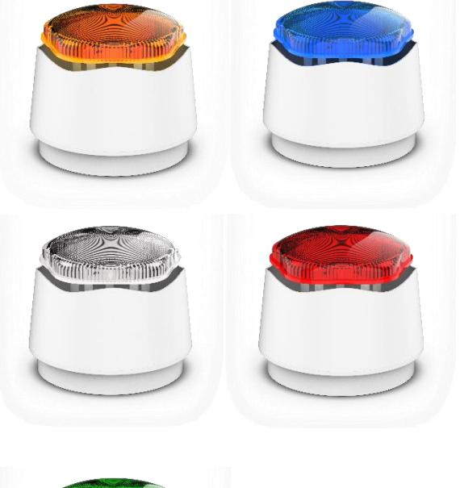
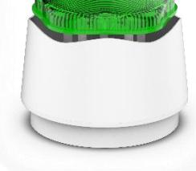

## **Larmdon Sirén/blixt SB-BE-X45**

## Kombilarmdon xenon IP45

Den kombinerade sirén-blixten levereras med energisnål xenon-blixt. Sirénen har 32 olika tonkaraktärer. Låg energiförbrukning. Godkänd enligt EN 54-3 och CPD certifierad. Kapslingsklass IP45.

Passar även bra i kombibrandlarm med 12 VDC spänning.

Larmdonet utfört i vit kapsling med sockel IP45. Linserna finns i färgerna orange, blå, vit, röd och grön.

| Artikelnummer |          |                |
|---------------|----------|----------------|
| SB-BE         | E6302043 | Sirén/Blixt    |
| X45-OR        |          | IP45 orange |
| SB-BE         | E6302044 | Sirén/Blixt    |
| X45-BL        |          | IP45 blå    |
| SB-BE         | E6302045 | Sirén/Blixt    |
| X45-VT        |          | IP45 vit    |
| SB-BE         | E6302046 | Sirén/Blixt    |
| X45-RD        |          | IP45 röd    |
| SB-BE         | E6302047 | Sirén/Blixt    |
| X45-GN        |          | IP45 grön   |

| Tekniska Specifikationer |                        |  |
|--------------------------|------------------------|--|
| Dimensioner              | D=92mm. H=85mm         |  |
| Spänning                 | 9-30 VDC               |  |
| Strömförbrukning         | 40-90 mA            |  |
| Ljudstyrka               | 94-110 dBA             |  |
| Ljudkaraktär             | 32 Toner               |  |
| Volymkontroll            | 3 Steg                 |  |
| Vikt                     | 350 g                  |  |
| Temperaturområde         | -40 till +55 grader |  |
| Godkännande              | CPD, EN54-3            |  |

