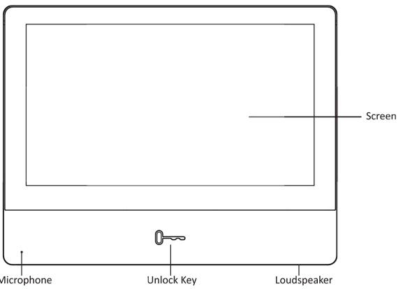
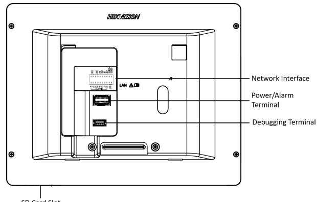
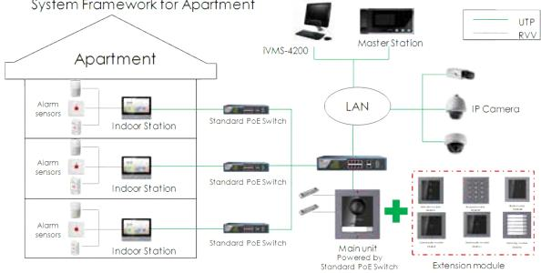
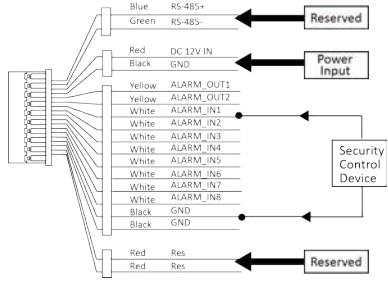
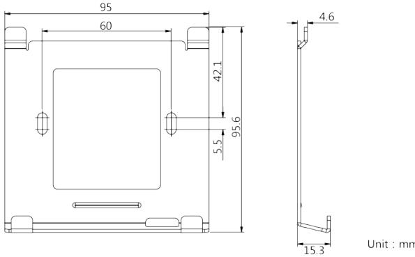
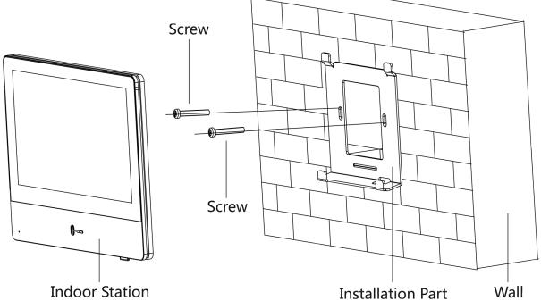

# Network Indoor Station

Installation Guide

## **Symbol ŽŶǀĞŶƟŽŶƐ**

The symbols that may be found in this document are ĚĞĮnĞĚ as follows.

| Symbol | ĞƐĐƌŝƉƟŽŶ                                                                                                                                                           |
|--------|---------------------------------------------------------------------------------------------------------------------------------------------------------------------|
| Danger | Indicates a hazardous ƐŝƚƵĂƟŽn which, if not avoided, will or could result in death or serious injury.                                                           |
| ĂƵƟŽŶ  | Indicates a ƉŽƚĞnƟĂůůLJ hazardous ƐŝƚƵĂƟŽn which, if not avoided, could result in equipment damage, data loss, performance ĚĞŐƌĂĚĂƟŽn͕ or unexpected results. |
| Note   | Provides ĂĚĚŝƟŽnĂů ŝnĨŽƌmĂƟŽn to emphasize or supplement important points of the main text.                                                                   |

## Contents

| 1 About this Manual                    |  |
|----------------------------------------|--|
| 2 Appearance                           |  |
| 3 Typical Application                  |  |
| 4 Wiring Description                   |  |
| 5 Installation                         |  |
| 5.1 Installation Accessory Description |  |
| 5.2 Wall Mounting                      |  |

### **1 About this Manual**

Get the manual and related ƐŽŌwĂƌĞ from or the ŽĸĐŝĂů website (ŚƩƉ͗ͬͬ www͘ŚŝŬvŝƐŝŽn͘ĐŽm)͘

| Product               | Model                        |
|-----------------------|------------------------------|
| Network Indoor ^ƚĂƟŽn | DS-KH8350-WTE1,DS-KH8350-TE1 |
|                       |                              |

Scan the QR code to get the ĐŽnĮŐƵƌĂƟŽn guide for detailed ŝnĨŽƌmĂƟŽn͘

Scan the QR code to get the ŽƉĞƌĂƟŽn guide for detailed ŝnĨŽƌmĂƟŽn͘

#### **2 Appearance**

#### **Front Panel**

**Figure 2-1 Front Panel**

**Rear Panel**

**Figure 2-2 Rear Panel**

#### **Note**

- The Unlock key is valid only when does the indoor ƐƚĂƟŽn speak with the door ƐƚĂƟŽn or open the live view of the door ƐƚĂƟŽn͘
- You can not use the debugging terminal.

### **3 Typical ƉƉůŝĐĂƟŽŶ**

### **4 Wiring ĞƐĐƌŝƉƟŽŶ**

There are 20 pins in the terminal on the rear panel of the indoor ƐƚĂƟŽn͗ 2 RS-485 pins, 2 power pins, 2 GND pins, 2 alarm output pins, 8 alarm input pins, and 4 reserved pins.

**Figure 4-1 Wiring ĞƐĐƌŝƉƟŽŶ (Alarm Input Device)**

### **5 /ŶƐƚĂůůĂƟŽŶ**

It supports wall mŽƵnƟnŐ͘ There are two ŝnƐƚĂůůĂƟŽn modes.

#### **5.1 /ŶƐƚĂůůĂƟŽŶ Accessory ĞƐĐƌŝƉƟŽŶ**

The wall mŽƵnƟnŐ plate is required when installing the indoor ƐƚĂƟŽn on the wall. The dimension of wall mŽƵnƟnŐ plate is shown below.

**Figure 5-1 Wall DŽƵŶƟŶŐ Plate**

#### **5.2 Wall DŽƵŶƟŶŐ**

#### **Before You Start**

- Make sure the device in the package is in good ĐŽnĚŝƟŽn and all the assembly parts are included.
- The power supply the indoor ƐƚĂƟŽn supports is 12 VDC. Please make sure your power supply matches your indoor ƐƚĂƟŽn͘
- Make sure all related equipments are ƉŽwĞƌͲŽī during the ŝnƐƚĂůůĂƟŽn͘
- Check the product ƐƉĞĐŝĮĐĂƟŽn for the ŝnƐƚĂůůĂƟŽn environment.

#### **Steps**

- **1.** Fix the wall mŽƵnƟnŐ plate to the wall with 2 supplied screws.
- **2.** Put the indoor ƐƚĂƟŽn on the holder of the wall mŽƵnƟnŐ plate.

**Figure 5-2 Installing the Plate**

