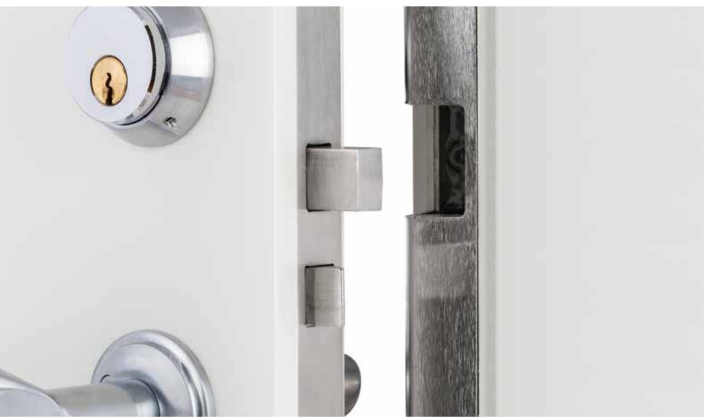
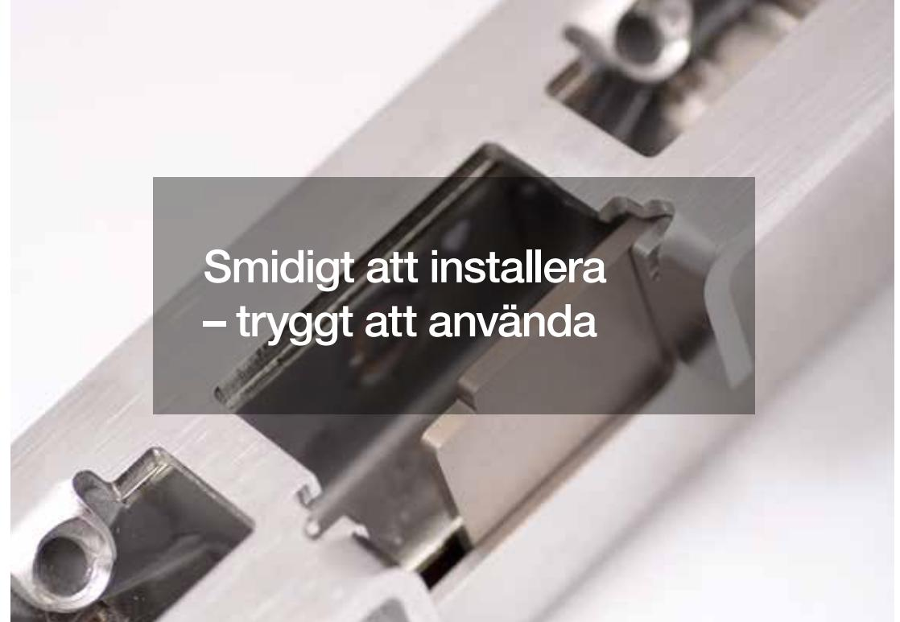
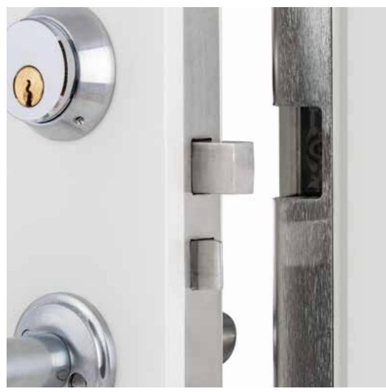

# Motoriserad låsning

**Compact**

Det svensktillverkade låssystemet

# Extremt högt ställda kvalitetskrav, för maximal säkerhet och flexibilitet

Genom ett övergripande arbeta med lokal förankring har vi de flesta underleverantörer och samarbetspartners på nära håll – ofta till och med på gångavstånd.

Förutom att det ger oss en bra dialog, som säkerställer vår höga kvalitet, innebär det också att vi slipper onödiga resor och transporter. Vi erbjuder med andra ord något mer än svensktillverkat: Det är Eskilstunatillverkat.

I motorslutblecket Exma Compact är alla delar integrerade. I praktiken

innebär det att ingen separat styrenhet behövs; enklare kan det inte bli.

## Säkerhet av högsta kvalitet

Med Exma Compact får du en stabil låsanordning som möter de allra högsta kraven enligt *brythållfasthet* och *borrskydd* i SS-EN 14846:2008.

Våra kvalitetskrav på produkten är extremt högt ställda, vilket medför att Exma Compact har en oöverträffad livslängd.

# Håller längre

Genom att satsa på ett välkonstruerat system, tillverkat enligt svenska standarder i låsstaden Eskilstuna, investerar du på långsiktig hållbarhet.

Detta ger dig en attraktiv prislapp i det längre perspektivet

## Modern elektronik

Vi på Exma lägger mycket fokus på att utveckla elektroniken i våra produkter och även i Exma Compact är detta en central del.

Förutom vår höga interna kompetens och långa erfarenhet har vi också täta samarbeten med lokala samarbetspartners. Detta medför att vi har stabila kvalitetskontroller i alla led. Samtidigt kan vi ta in förstklassig spetskompetens, som lyfter våra produkter ännu ett snäpp över andra alternativ på marknaden.

# Smidigt att installera och integrera

Eftersom ingen styrenhet behövs är Exma Compact väldigt enkel att montera. Dessutom går den utmärkt att integrera med produkter och system från andra tillverkare.

Motorslutblecket monteras i dörrkarmen, utan någon karmöverföring eller kabeldragning i själva dörren.

Givetvis ingår monterings- och användarinstruktioner med våra produkter. Vi erbjuder också utbildningar inom såväl installation som underhåll av Exma Compact och alla andra av våra låssystem.

Hos oss får du både produkter av högsta möjliga kvalitet och trygg support – som säkerställer att du får maximal nytta av ditt Exma-system under många år.

| Specifikationer för Compact              |                                    |
|------------------------------------------|------------------------------------|
| Drivspänning                             | 18-24V DC Filtrerad likspänning |
| Strömförbrukning vid vila                | 85 mA                              |
| Strömförbrukning vid gång                | 300 mA                             |
| Strömförbrukning vid motorstart. (50 mS) | 500mA                              |
| Temperaturområde                         | -20°C – +60°C                      |
| Låsningstid                              | c:a 0,3 sek                        |
| Klimattestad 240 tim i saltdimkammare    | Ja                                 |
| Material                                 | Rostfritt                          |
| Brythållfasthet i träkarm                | Grade 3                            |
| Antal låsningscykler vid normal drift    | > 1000 000                         |
| Öppnasignal                              | Reläslutning eller spänning     |
| Storlek, BxHxD                           | 26x180x34 mm                       |
| Storlek, med stolpe, BxHxD               | 39x245x39 mm                       |

