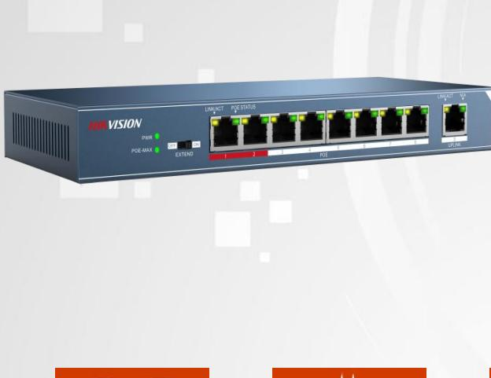
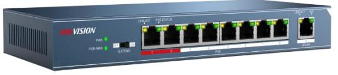

## **DS-3E0109P-E 8-ports 100Mbps Unmanaged PoE Switch**

#### **Overview**

DS-3E0109P-E is an 8 10/100Mbps ports unmanaged switch that requires no configuration and provides 8 PoE (Power over Ethernet) ports. It can automatically detect and supply power with all IEEE 802.3af/at compliant Powered Devices (PDs). In this situation, the electrical power is transmitted along with data in one single cable allowing you to expand your network to where there are no power lines or outlets, where you wish to fix devices such as IP Cameras or IP Phones, etc.

#### **Features**

- IEEE 802.3at and IEEE 802.3af Power over Ethernet (PoE) compliant
- 8 x 10/100Mbps Auto-MDIX PoE ports
- Provides up to 30 watts per PoE port
- PoE power budget 123W
- 4 kV surge protection for PoE ports
- IEEE 802.3x flow control support
- Plug-and-play installation
- 1.8 Gbps switching fabric
- 1.25 Mbits RAM Data Buffer
- 4K MAC address entries
- Sturdy metal enclosure

| NO. | Description   |
|-----|---------------|
| 1   | PWR           |
| 2   | POE-MAX       |
| 3   | EXTEND        |
| 4   | LINK/ACT      |
| 5   | POE STATUS |
| 6   | PoE PORT   |
| 7   | UPLINK        |
| 8   | N/A           |
|     |               |

# **DS-3E0109P-E 8-ports 100Mbps Unmanaged PoE Switch**

### **Specifications**

| Model                  | DS-3E0109P-E                                    |  |  |
|------------------------|-------------------------------------------------|--|--|
| Ports                  |                                                 |  |  |
| Network Ports          | 9                                               |  |  |
| PoE Port            | 8, 10/100Mbps RJ45 ports               |  |  |
| Uplink Port            | 1, 100M Ethernet Port                  |  |  |
| Standard               |                                                 |  |  |
| Network Protocol       | IEEE802.3,802.3u,802.3x, 802.3af, 802.3at |  |  |
| Performance            |                                                 |  |  |
| Switching Capacity     | 1.8Gbps                                         |  |  |
| Max. Forwarding Rate   | 1.34Mpps                                        |  |  |
| High Priority Ports    | Ports 1-2                                    |  |  |
| Forwarding Mode        | Store-and-forward                               |  |  |
| MAC Address Table      | 4k                                              |  |  |
| Flow Control           | IEEE802.3x full duplex                    |  |  |
| Power Over Ethernet    |                                                 |  |  |
| PoE Standard        | IEEE802.3af, IEEE802.3at                     |  |  |
| PoE Power Budget | 123W                                            |  |  |
|                        | Extend On:250m,10M,CAT 5e                 |  |  |
| Working Mode           | Extend Off:100m                              |  |  |
| General                |                                                 |  |  |
| Power Supply           | 51V DC, 2.5A                              |  |  |
| Power Consumption      | ≤127W                                           |  |  |
| Surge Protection       | 4KV                                             |  |  |
| Working Temperature    | 0℃-40℃ Temperature:                          |  |  |
| Working Humidity       | Humidity: 10%-90% , non-condensing     |  |  |
| Storage Temperature    | -40℃-70℃ Temperature:                        |  |  |
| Storage Humidity       | Humidity: 5%-90% , non-condensing      |  |  |
| Weight                 | 0.57kg                                          |  |  |
| Dimension              | 235mm*103mm*27mm                                |  |  |

