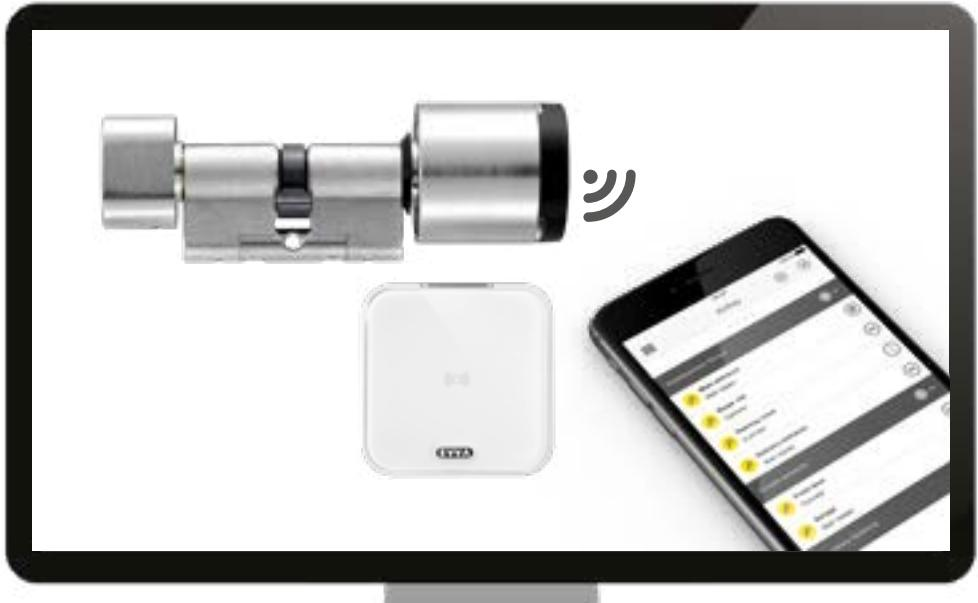

### AirKey-registrering

 Gå till https://airkev.ewa.com och klicka på *AirKey-registrering*.

|   | (TVVA) Airkey                                                                                                                                                                  |
|---|--------------------------------------------------------------------------------------------------------------------------------------------------------------------------------|
| 2 |                                                                                                                                                                                |
|   | foundation in forluy                                                                                                                                                           |
|   | tua fire to concession   bugin   brays = 1 = 1 = 1 = 1 = 1 = 1 = 1 = 1 = 1 = 1 = 1 = 1 = 1 = 1 = 1 = 1 = 1 = 1 = 1 = 1 = 1 = 1 = 1 = 1 = 1 = 1 = 1 = 1 = 1 = 1 = 1 = 1 = 1 = 1 |
|   | 16-11-14                                                                                                                                                                       |
|   | [] Select would B. Debusive                                                                                                                                                    |
|   | -                                                                                                                                                                              |
|   | = 546-1001                                                                                                                                                                     |
|   | Seat 75-84                                                                                                                                                                     |
|   | Second Callery                                                                                                                                                                 |
|   |                                                                                                                                                                                |
|   | 00 10                                                                                                                                                                          |
|   | 1                                                                                                                                                                              |

 Fyll i fälten i formuläret. Fält som är markerade med * är obligatoriska. Glöm inte att ange captcha i textfältet och att kryssa för de båda kryssrutorna för de allmänna affärsvillkoren (AGB) och licensavtalet för slutanvändare (EULA).

| 3          |                                                                                                                                                                            |
|------------|----------------------------------------------------------------------------------------------------------------------------------------------------------------------------|
|            | Mark North, Internation Saller                                                                                                                                             |
|            | The country of the below to the count of cours of could in be areas                                                                                                        |
|            | Profession in the repression, purchased and superior information for the back and one of the status and in or established and and of 2000 contribution of the Colors of |
|            | There ancessfile that the supportunities of from an relibering less for resument on tall                                                                                   |
|            | I was and confer                                                                                                                                                           |
|            | 1.0 0 10000                                                                                                                                                                |
| Mad Incoll | You IT 11 4. dasherater                                                                                                                                                    |

 Du får en bekräftelse via e-post för att slutföra AirKey-registreringen. Den innehåller följande information:

- Länk för att ställa in lösenord.
- Kundnummer
- Användar-ID

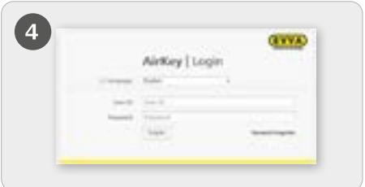

 När du har valt ett lösenord kan du logga in på https://airkey.evva. com med ditt användar-ID (vilket finns i e-postmeddelandet) och det valda lösenordet.

En detaljerad beskrivning finns i AirKey-systemhandboken i **kapitel 4.2, Registrering i AirKey-onlineadministrationen.**

## Fylla på kredit

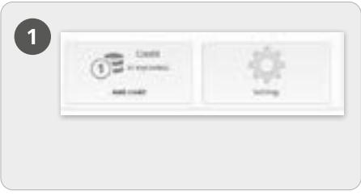

 På startisdan *Hem* väljer du rutan *Kredit*. Du behöver ett KeyCredit-kort med ett skrapfält på baksidan. Under fältet finns en kreditkod.

| 2 |                  |
|---|------------------|
|   | 17 Augu regit |
|   |                  |

- Klicka på *Fylla på kredit*.
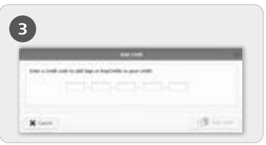

 Ange koden på KeyCredit-kortet (systemet skiljer inte mellan stora och små bokstäver).

 Klicka på *Fylla på kredit*. Är koden är giltig visas en bekräftelse.

> En detaljerad beskrivning finns i AirKeysystemhandboken i **kapitel 4.6, Fylla på kredit**.

### Skapa smarttelefon och registrera med "Send a Key"

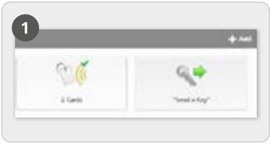

 På startsidan Hem väljer du rutan *"Send a Key"*.

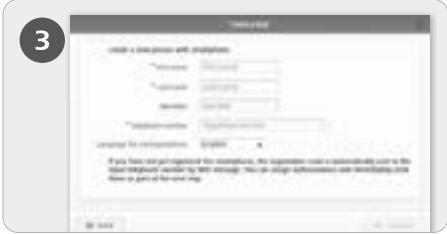

 När alla obligatoriska uppgifter är ifyllda klickar du på *Fortsätt*.

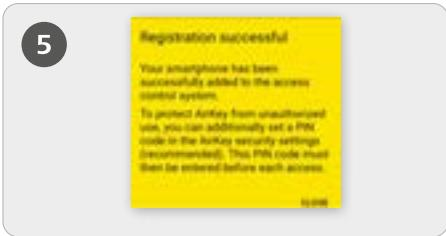

 Är AirKey-appen redan förinstallerad genomförs registreringen automatiskt via länken. Är AirKeyappen inte installerad vidarebefordras man till nedladdningen av AirKey-appen via länken.

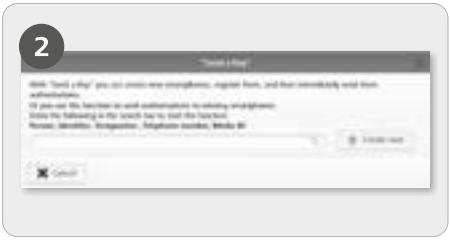

 Sök efter befintliga personer eller smarttelefoner i sökfältet. Om denna person och smarttelefon ännu inte har skapats ska du välja *Skapa ny*.

 Den nya användaren får ett SMS med en länk till AirKey-appen för registrering i systemet.

I detta fall skiljer sig processen mellan Android och iPhone enligt följande: **Android:** När AirKey-appen installerats och öppnats genomförs registreringen automatiskt. **iPhone:** När AirKey-appen installerats och öppnats måste telefonnumret anges. Ange ditt telefonnummer med +46 och bekräfta med *Registrera*. Du får ytterligare ett sms. Lämna AirKey-appen öppen och klicka på den åttasiffriga registreringskoden som visas i sms:et. Bekräfta med *Registrera* för att slutföra registreringen.

En detaljerad beskrivning finns i AirKey-systemhandboken i **kapitel 4.9.1 Funktion "Send a Key"**

# Lägga till låskomponent med smarttelefonen

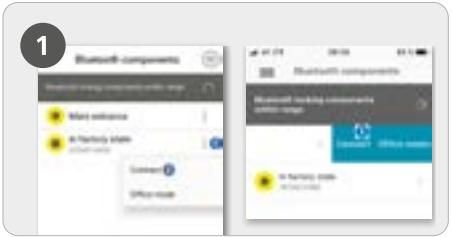

 Öppna AirKey-appen och välj Bluetoothkomponenter, aktivera cylindern genom beröring av den svarta läsardelen.

 **Android:** Klicka på de tre punkterna vid låskomponenten i fabriksläge .

#### *Välj sedan Anslut*

 **iPhone:** Svep vänster i appens symbol för enhet i fabriksläge och väljAnslut. .

*Underhållsläge måste vara aktiverat för smarttelefonen!*

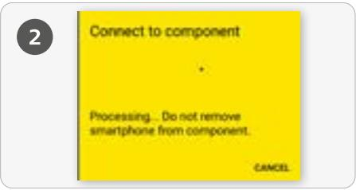

 En anslutning till enheten upprättas. Avlägsna inte smarttelefonen från NFC- eller Bluetooth-anslutningens räckvidd till enheten.

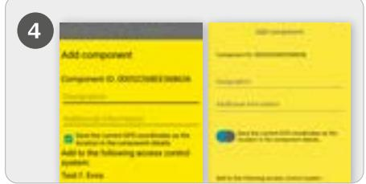

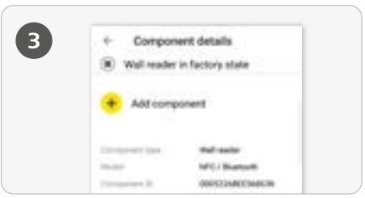

 Nu visas enhetens detaljer. Klicka på *Lägg till komponent*.

 Ange en tydlig beteckning med eventuell tilläggsinformation och klicka på Lägg till.

 *De aktuella GPS-koordinaterna fastställs automatiskt som enhetens plats. Detta indikeras med den förkryssade turkosa rutan resp. det blå skjutreglaget. Detta kan ta några sekunder.*

 Visas fler tillgängliga system välj ditt aktuella system.

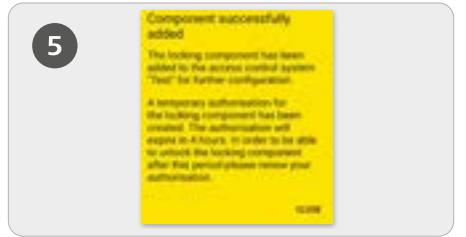

 Via Bluetooth upprättas automatiskt en anslutning till enheten för att slutföra processen. Om cylindern inte längre blinkar blått måste den aktiveras igen genom beröring.

#### **Geotaggning/Plats**

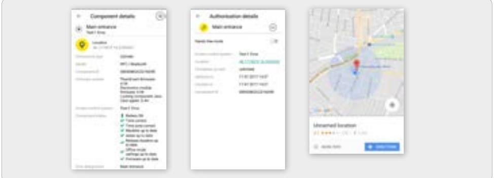

 Om den turkosa rutan kryssades för eller det blå skjutreglaget aktiverades i samband med att enheten lades till visas positionsuppgifter både i enhetsdetaljerna och i enhetens behörighetsdetaljer. I appens meny Behörigheter visas enhetens geotaggning/plats som länk. När man klickar på länken vidarebefordras man automatiskt till den installerade karttjänsten i smarttelefonen, t.ex. Google Maps eller Apple kartor.

Aktivera specialbehörigheten "Underhållsläge" för denna smarttelefon:

Underhållsläge kan endast aktiveras på en smarttelefon som tilldelats en person. I detta läge har smarttelefonen behörighet att aktivera enheter i fabriksläge samt att lägga till eller ta bort enheter och medier i ett system. Dessutom kan firmware i enheter och Keyring-versionen hos medier uppdateras.

| 10133493                   |                                                                                                  |
|----------------------------|--------------------------------------------------------------------------------------------------|
| Martenance subcrision.     | This unariphone can be used in perform additional maintersance operations on Airfley composeets. |
| Office vande               | Medium can activate the manad office mode                                                        |
| Show event log data        | Show eventliog data in Airkey app                                                                |
| Reflection construction    | Normal release duration Extended release duration                                             |
| TW cade of the Aarliny app | No PIN code set.                                                                                 |
| Update shereach access     | Artivated The ArKer and data on the smartshore is undated after each acress?                     |

Specialbehörigheten "Underhållsläge" aktiveras på startsidan *Home* i rutan *Smarttelefoner.*

I listan medier klickar du på smarttelefonen det gäller.

 I fliken *Detaljer* i avsnittet *Inställningar* klickar du för underhållsbehörighet och klickar sedan på Spara.

> En detaljerad beskrivning finns i AirKey-systemhandboken i **kapitel 4.11 Lägga till låskomponent**.

### Kort, taggar, kombinycklar och armband - koda medier

| Division Heille |   | Connect in component                                          |
|-----------------|---|---------------------------------------------------------------|
|                 |   | 10000                                                         |
| Moreture        |   |                                                               |
| E trickes !     | 1 | Processing, De millement a harly from component 100 100 |

 Starta AirKey-appen och välj *Koda medier* i huvudmenyn.

 Följ instruktionerna i Appen och håll det icke aktiverade ID-mediet mot enheten för uppdatering.

 En anslutning till enheten och mediet upprättas. OBS! En cylinder måste aktiveras genom beröring.

*Underhållsläge måste vara aktiverade för smarttelefonen!*

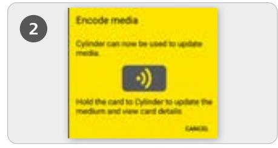

 Väck en enhet genom att beröra det svarta läsarhuvudet och anslut till appen för att genomföra en uppdatering av mediet.

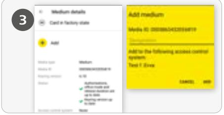

 Klicka på *Lägg till* i ID-mediets detaljer. Ange en tydlig beteckning för ID-mediet och klicka på *Lägg till*.

Visas fler tillgängliga system välj ditt aktuella system.

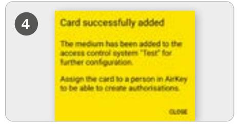

 Håll det icke aktiverade mediet mot enheten igen för att slutföra processen.

### Skapa person/ Tilldela medie till person

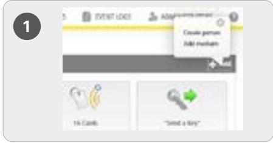

 På startsidan *Hem* i det grå fältet i *Media & personerväljer* du *Lägg till -> Skapa person*.

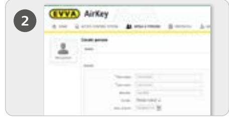

 Fyll i fälten i formuläret. Fält som är markerade med * är obligatoriska.

Klicka på *Spara*.

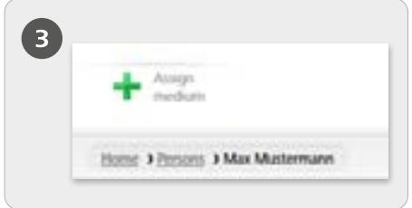

 Klicka nu på symbolen Tilldela ID-medium (under personsymbolen).

|  | "but of the containt to the acquire to spirist "Marketineer" 104-2000 AUDI AUTO INTERNAL ALABOR S. LEON BLANDS AND POLICE |                                                                                                                                                                                |  |
|--|------------------------------------------------------------------------------------------------------------------------------|--------------------------------------------------------------------------------------------------------------------------------------------------------------------------------|--|
|  |                                                                                                                              | Schul Despothe Timbers-with V. WHER 4 11 1 1 1 1 1 1 1 1 1 1 1 1 1 1 1 1 1 1 1 1 1 1 1 1 1 1 1 1 1 1 1 1 1 1 1 1 1 1 1 1 1 1 1 1 1 1 1 1 1 1 1 1 1 1 1 1 1 1 1 1 1 1 1 1 1 1 1 |  |
|  |                                                                                                                              | J WASTER WARD STATE THE MANUSE                                                                                                                                                 |  |
|  | S . And                                                                                                                      |                                                                                                                                                                                |  |
|  |                                                                                                                              | 2 Super commend nast 1 445 be a control control and a long to the comments of the comments                                                                                  |  |

 I listan väljer du ett ID-medium som ska tilldelas personen.

Endast medier som ännu inte tilldelats någon person visas.

- Klicka på *Fortsätt*.
 Klicka därefter på *Tilldela ID-medium*. Mediet har tilldelats vald person korrekt.

En detaljerad beskrivning finns i vår AirKey-systemhandbok i *kapitel 4.7 Skapa person* och i *kapitel 5.6.5 Tilldela medium till person*. En detaljerad beskrivning finns i AirKeysystemhandboken i k*apitel 4.7.1 Importera persouppgifter*.

### Tilldela behörigheter

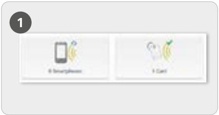

 På startsidan *Home* väljer du rutan *Smartphones* resp. *Kort*.

- Klicka på önskat ID-medium i listan.
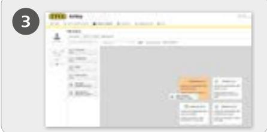

 Dra och släpp knappen med vald dörr eller valt område till mittfältet. Först när du har förflyttat vald dörr/valt område till mittfältet visas möjliga behörighetstyper.

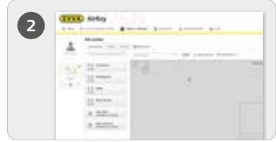

 Om mediet är tilldelat en person visas en översikt över behörigheter.

| 4 | B MAI MENT    |    |
|---|---------------|----|
|   | in former and |    |
|   | B deep asheel |    |
|   | 1 has 4 1  |    |
|   |               |    |
|   | X (and        | 三四 |

 Klicka på *Spara* om alla rättigheter för önskad behörighet ska konfigureras.

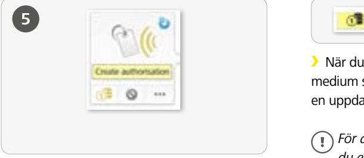

 När du har skapat behörigheten för ett IDmedium ska du avsluta med *Skapa rättighetoch*  en uppdatering av respektive ID-medium.

*För att skapa önskade rättigheter behöver du en KeyCredit!*

En detaljerad beskrivning finns i AirKey-Systemhandboken i **kapitel 4.14 Tilldela rättigheter.**

### Handsfreeläge för Bluetooth-enheter

|  | 1000                                                                                                                                     |
|--|------------------------------------------------------------------------------------------------------------------------------------------|
|  | Start   PRODUCT 18 THE                                                                                                                   |
|  | minister and super and                                                                                                                   |
|  | THE COLLECTION CONSULTION CONSULTION CONSULTION CONSULTION OF tions and the production of the many company of the belief on the super |
|  | The started to the model and the promoted to the commender of the commender of the commended to the commend of                           |
|  | deal for police allian to children "section" station" contributed "public concellented.                                                  |

 Det finns ett handsfreeläge för Bluetooth-enheter Handsfree är en funktion som innebär att enheten inte behöver aktiveras med att öppna appen. Användaren kan konfigurera funktionen så att aktivering kan ske även när skärmlåset på smarttelefonen är aktiverat. På startsidan *Hem* väljer du rutan *Inställningar* och aktiverar sedan funktionen "Tillträde ur låst skärm" i fliken "Allmänt".

|  |  | I huvudmenyn                                              |
|--|--|-----------------------------------------------------------|
|  |  |                                                           |
|  |  | Inställningar i Airkey-appen måste handsfreeläget vara |
|  |  |                                                           |
|  |  | aktiverat.                                                |
|  |  |                                                           |
|  |  |                                                           |
|  |  |                                                           |

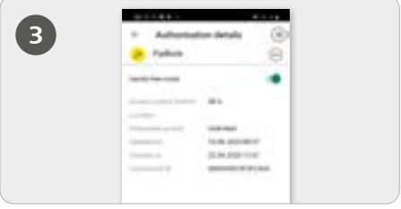

 Dessutom måste handsfreeläget även vara aktiverat för enheten i appen under menyn *Behörigheter*

**Funktion:** Efter beröring skickar cylindern en Bluetooth-signal. På väggläsare fungerar detta automatiskt utan beröring. Om en AirKey-app inom enhetens räckvidd tar emot denna Bluetooth-signal startar aktiveringsprocessen.

En detaljerad beskrivning finns i AirKey-systemhandboken i **kapitel 6.9 Inställningar i AirKeyappen** och i **kapitel 6.16 Exkurs: Handsfree i översikt.**

### Avaktivera ID-medium - vid förlust

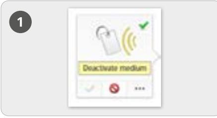

#### **Avaktivera**

- På startsidan *Home* väljer du rutan *Smartphones* resp. *Kort*.
- Klicka på önskat ID-medium i listan.
- Klicka på *Avaktivera ID-medium*.

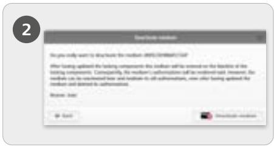

 Ange en orsak för avaktiveringen. Som orsak kan du välja "Förlust", "Defekt" eller "Annat". Klicka på Fortsätt. Bekräfta säkerhetsfrågan med Avaktivera ID-medium

- Klicka på *Fortsätt*.
- Bekräfta säkerhetsfrågan med *Avaktivera ID-medium*.

*Uppdatera de enheter för vilka IDmediet hade behörighet. Detta tar bort uppdateringarna för blacklist och de avaktiverade medierna har inte längre rättighet till enheten.*

En detaljerad beskrivning finns i AirKey-systemhandbok i **kapitel 5.6.17 Avaktivera ID-medium** och i **Kapitel 5.6.19 Återaktivera ID-medium**.

#### **Översikt AirKey-system**

https://www.evva.com/de/airkey/website/

#### **AirKey onlineadministration**

http://airkey.evva.com

**AirKey systemhandbok** https://www.evva.com/de/airkey/systemmanual/

#### **Handbok AirKey-programvara**

http://video.evva.com/tutorials/airkey/software/de/

#### **Monteringsanvisningar, datablad och viktiga bruksanvisningar**

https://www.evva.com/de/downloads

| ……………………………………………………………………………………………………………………………………………………………………………………………………………………………………………………………………………………………………………………………………………………………………………………………………………………………………………………………………………… |  |
|--------------------------------------------------------------------------------------------------------------------------------------------------------------------------------|--|
|                                                                                                                                                                                |  |
|                                                                                                                                                                                |  |
|                                                                                                                                                                                |  |
|                                                                                                                                                                                |  |
|                                                                                                                                                                                |  |
|                                                                                                                                                                                |  |
|                                                                                                                                                                                |  |
|                                                                                                                                                                                |  |
|                                                                                                                                                                                |  |
|                                                                                                                                                                                |  |
|                                                                                                                                                                                |  |
|                                                                                                                                                                                |  |
|                                                                                                                                                                                |  |
|                                                                                                                                                                                |  |
|                                                                                                                                                                                |  |
|                                                                                                                                                                                |  |
|                                                                                                                                                                                |  |
|                                                                                                                                                                                |  |
|                                                                                                                                                                                |  |
|                                                                                                                                                                                |  |
|                                                                                                                                                                                |  |
|                                                                                                                                                                                |  |
|                                                                                                                                                                                |  |
|                                                                                                                                                                                |  |
|                                                                                                                                                                                |  |
|                                                                                                                                                                                |  |
|                                                                                                                                                                                |  |
|                                                                                                                                                                                |  |
|                                                                                                                                                                                |  |
|                                                                                                                                                                                |  |
|                                                                                                                                                                                |  |
|                                                                                                                                                                                |  |
|                                                                                                                                                                                |  |
|                                                                                                                                                                                |  |
|                                                                                                                                                                                |  |
|                                                                                                                                                                                |  |
|                                                                                                                                                                                |  |
|                                                                                                                                                                                |  |
|                                                                                                                                                                                |  |
|                                                                                                                                                                                |  |
|                                                                                                                                                                                |  |
| …………………………………………………………………………………………………………………………………………………………………………………………………………………………………………………………………………………………………………………………………………………………………………………………………………………………………………………………………………   |  |
|                                                                                                                                                                                |  |
|                                                                                                                                                                                |  |

|                                                                                                                                                   |  |  |
|------------------------------------------------------------------------------------------------------------------------------------------------------------------------------|--|--|
|                                                                                                                                                                              |  |  |
| ………………………………………………………………………………………………………………………………………………………………………………………………………………………………………………………………………………………………………………………………………………………………………………………………………………………………………………………………………… |  |  |
|                                                                                                                                                                              |  |  |