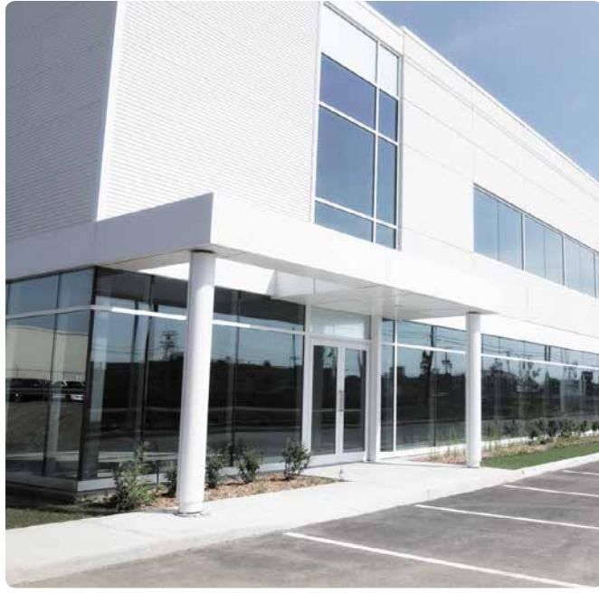
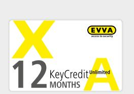
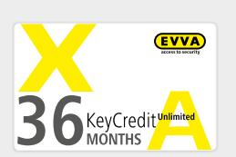

# **Programvara** | KeyCredits

## Företag med anläggningar på olika platser

### **Obegränsade KeyCredits**

Obegränsade KeyCredits i 12 eller 36 månader är den skräddarsy‑ dda lösningen för medelstora och stora företag.

Det medför låga investeringskostnader och, till skillnad mot KeyCredits 10/50/100, ingår ett obegränsat antal ändringar av tillträdesbehörigheterna.

Självklart kan du växla till 10/50/100 efter 12 eller 36 månader,

#### **Obegränsade KeyCredits i 12 månader**

ID-medier kan skapas och ändras obegränsat, oavsett antal tillträdesbehörigheter, under 12 månader.

| Rekommenderad användning | Fler än 50 personer under en period av 12 månader Frekventa ändringar i tillträdesbehörigheterna |
|--------------------------|-----------------------------------------------------------------------------------------------------|
|                          | Fler än 100 personer under en period av 12 månader                                                  |
| Produktkod               | E.ZU.LM.KC12M                                                                                       |

#### **Obegränsade KeyCredits i 36 månader**

ID-medier kan skapas och ändras obegränsat, oavsett antal tillträdesbehörigheter, under 36 månader.

| Rekommenderad användning | Fler än 50 personer under en period av 36 månader Frekventa ändringar i tillträdesbehörigheterna |
|--------------------------|-----------------------------------------------------------------------------------------------------|
|                          | Fler än 100 personer under en period av 36 månader                                                  |
| Produktkod               | E.ZU.LM.KC36M                                                                                       |

AirKey produktkatalog | Med förbehåll för tryckfel och tekniska ändringar.