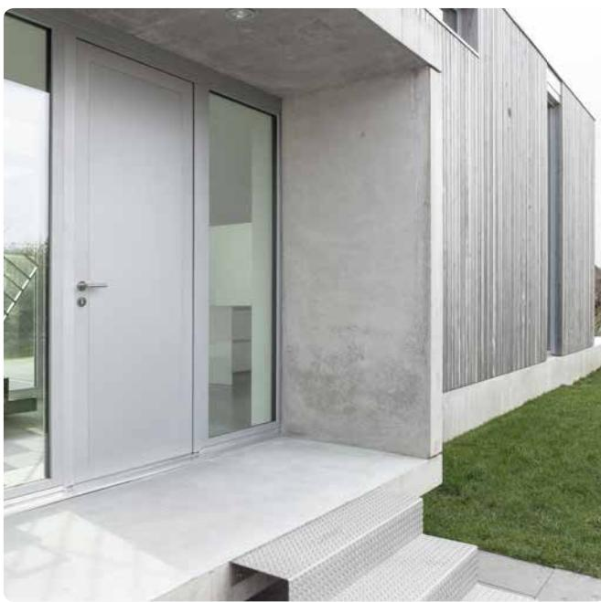
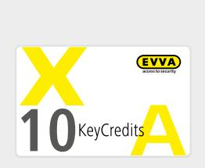
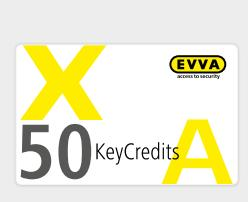
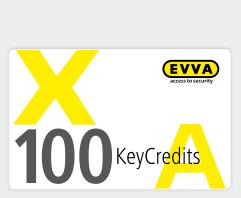

# Små eller medelstora företag och privatpersoner

## **KeyCredits 10, 50, 100**

KeyCredits 10/50/100 är den skräddarsydda lösningen för små och medelstora företag. Detta gäller särskilt om tillträdesbe‑ hörigheterna ändras sällan eller om endast få personer har tillträde till byggnaden.

Du kan utnyttja alla funktioner hos en avancerad programvara för tillträdeskontroll, och du betalar endast för det du behöver tack vare det avgiftsfria AirKey-programmet. Du behöver bara en KeyCredit för att skapa eller ändra ett ID-medium, oavsett antal tillträdesbehörigheter.

Du kan när som helst växla till obegränsade KeyCredits. Enskilda, oanvända krediter förblir självfallet giltiga och kan förbrukas när de obegränsade KeyCredits har gått ut.

## **KeyCredits 10**

Skapa eller ändra ett ID-medium, oavsett antal tillträdesbehörigheter, tio gånger. Rekommenderad användning 1-9 personer

|            | Få ändringar i tillträdesbehörigheterna |
|------------|-----------------------------------------|
| Produktkod | E.ZU.LM.KC010                           |

### **KeyCredits 50**

Skapa eller ändra ett ID-medium, oavsett antal tillträdesbehörigheter, 50 gånger.

| Rekommenderad användning | 1-9 personer Frekventa ändringar i tillträdesbehörigheterna |
|--------------------------|----------------------------------------------------------------|
|                          | 10-49 personer Få ändringar i tillträdesbehörigheterna      |
| Produktkod               | E.ZU.LM.KC050                                                  |

### **KeyCredits 100**

Skapa eller ändra ett ID-medium, oavsett antal tillträdesbehörigheter, 100 gånger.

| Rekommenderad användning | 10-49 personer Frekventa ändringar i tillträdesbehörigheterna |
|--------------------------|------------------------------------------------------------------|
|                          | 50-100 personer Få ändringar i tillträdesbehörigheterna       |
| Produktkod               | E.ZU.LM.KC100                                                    |