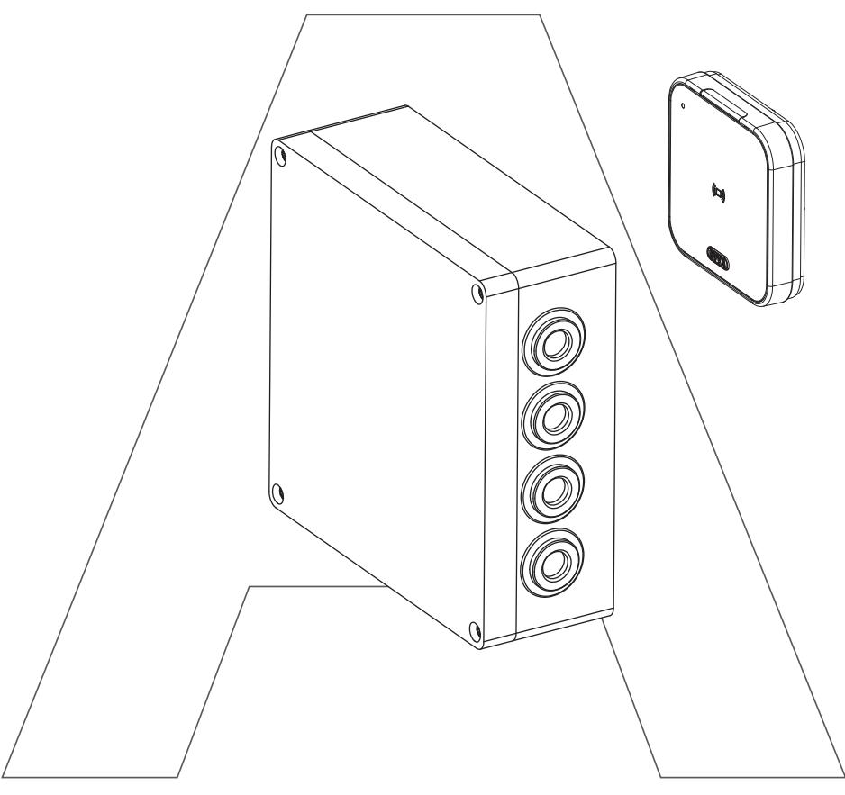

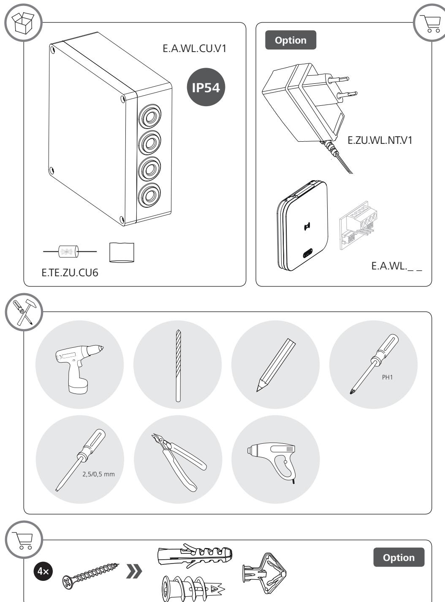

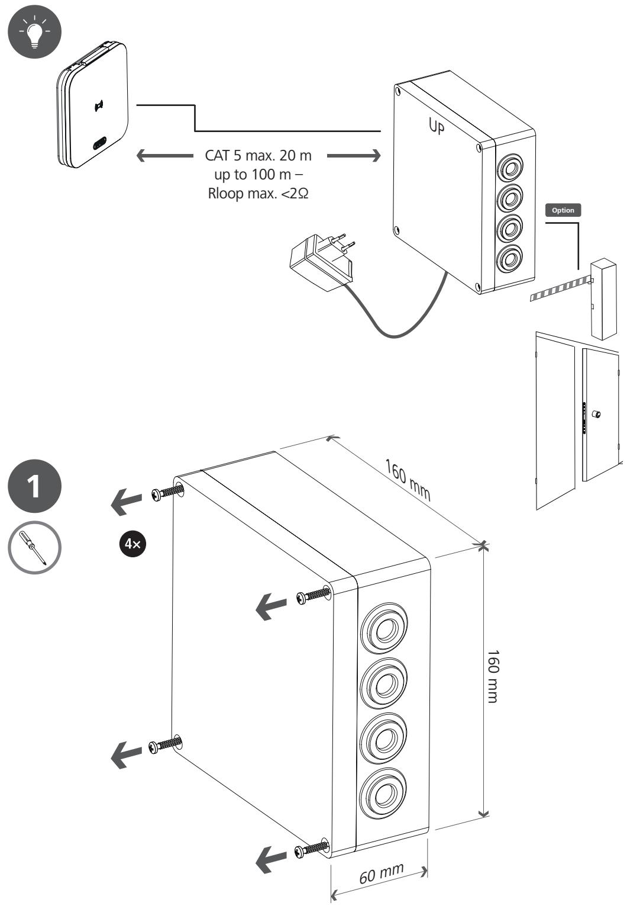

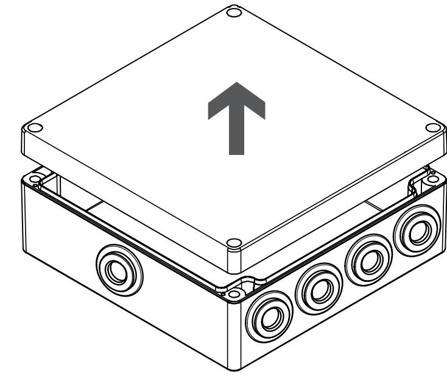

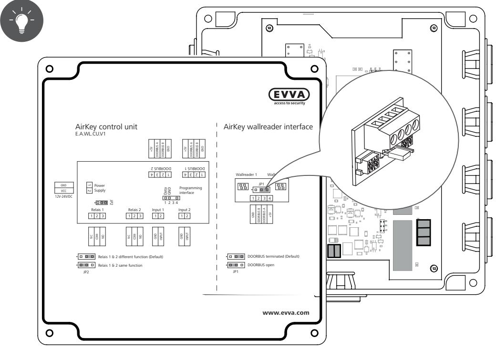

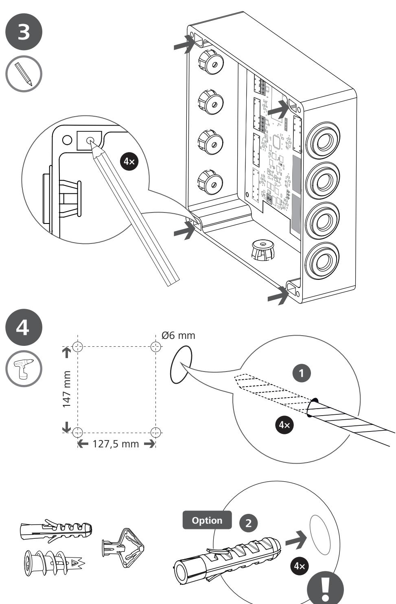

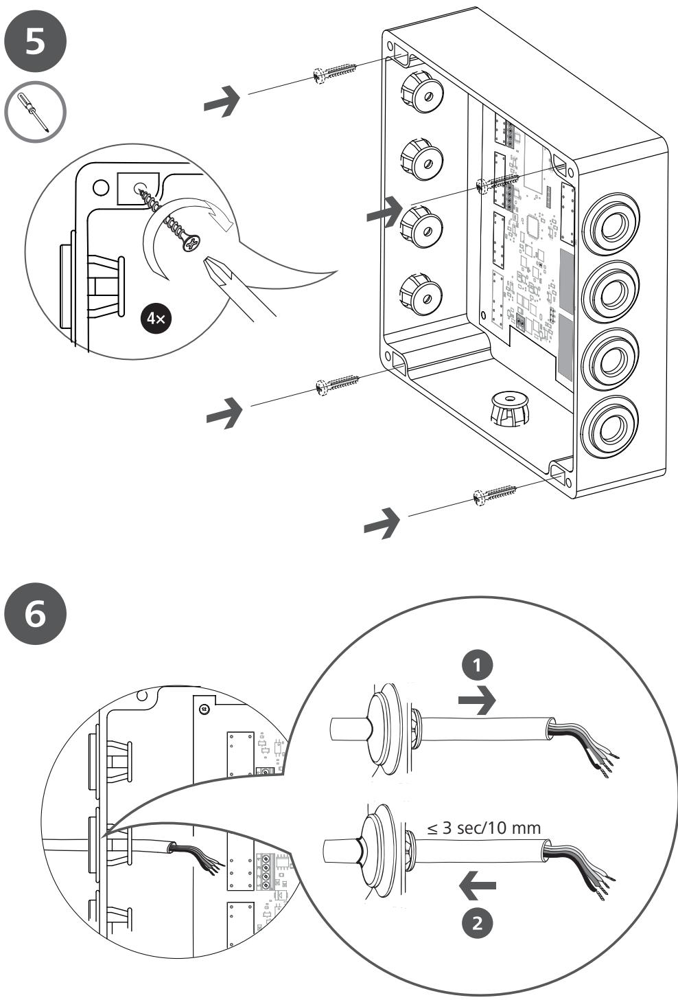

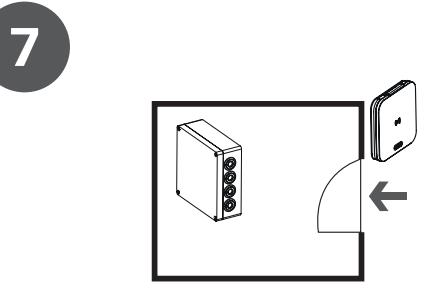

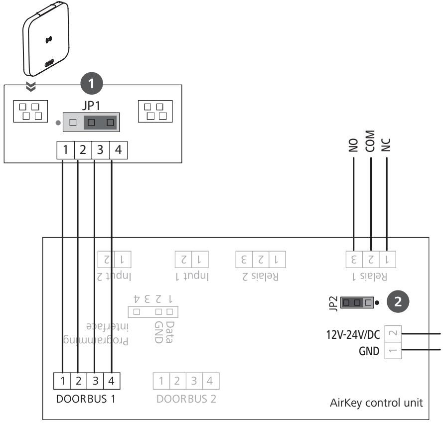

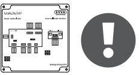

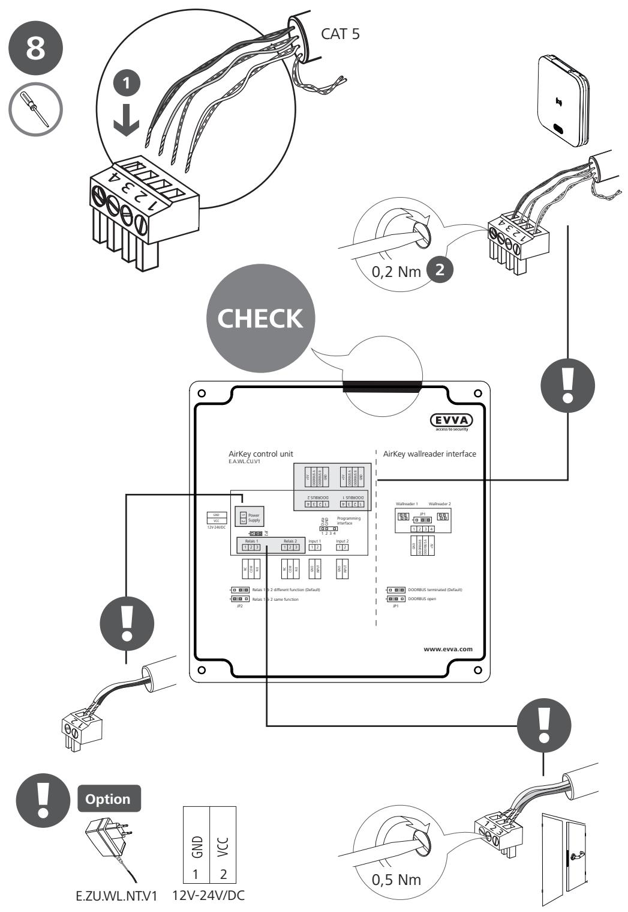

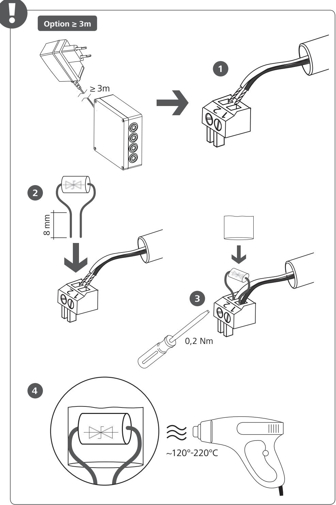

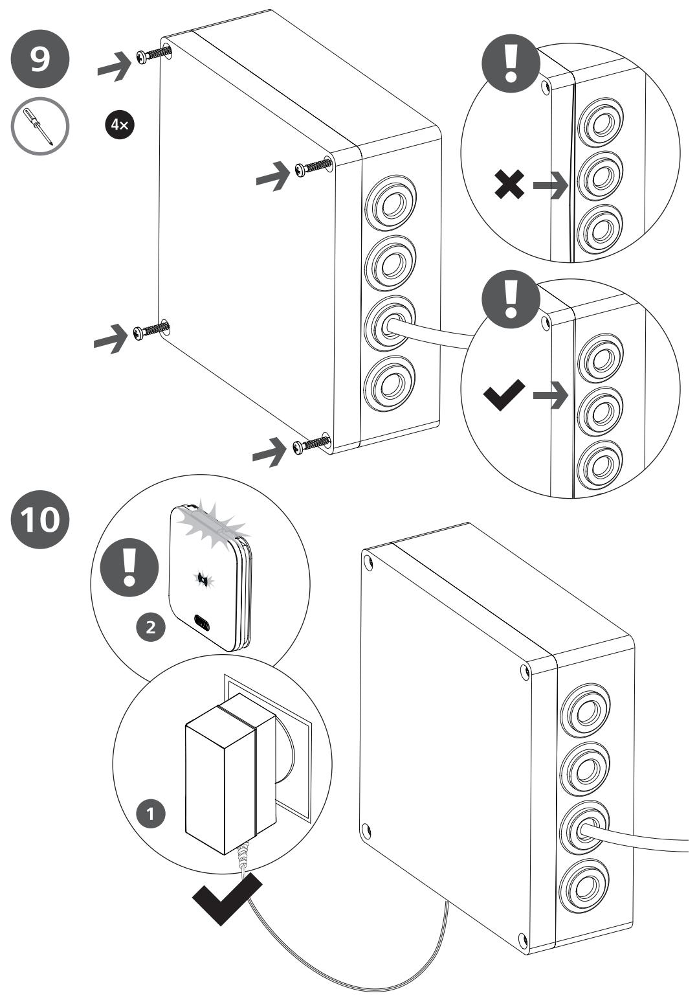

## **01 CONTROL UNIT WITH DC LOW CURRENT ELECTRIC STROKES**

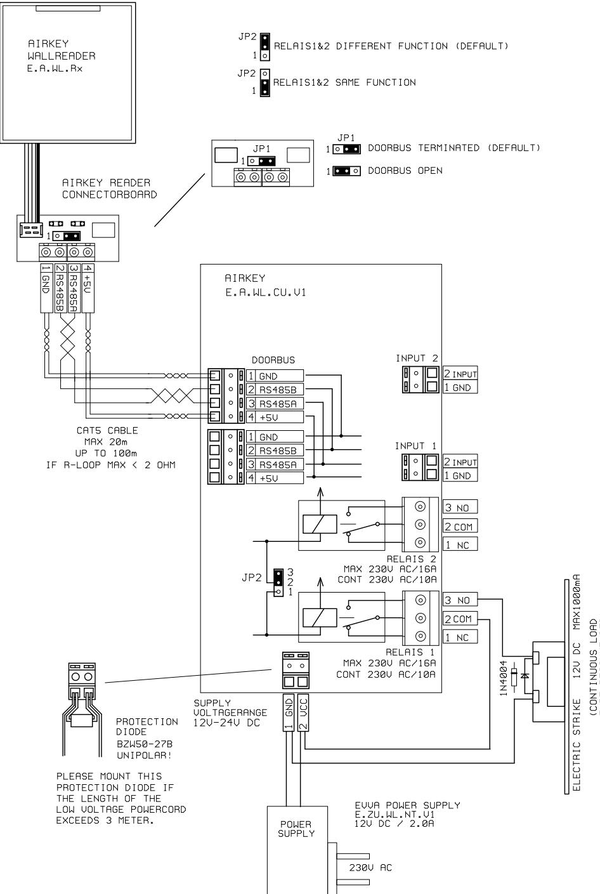

## **02 CONTROL UNIT WITH DC HIGH CURRENT ELECTRIC STROKES**

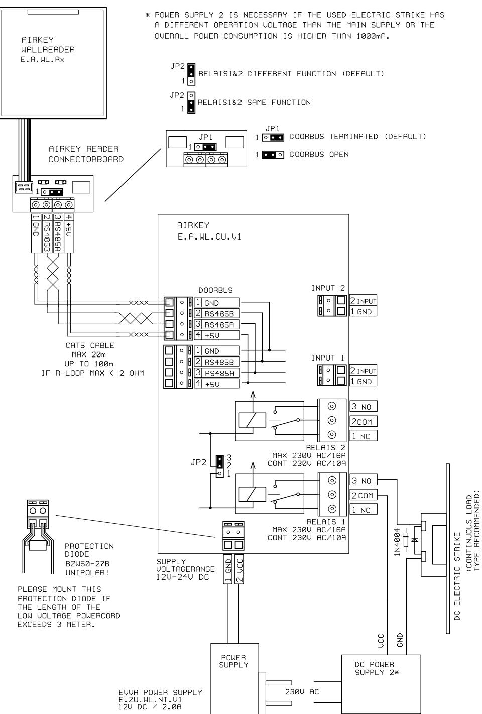

## **03 CONTROL UNIT WITH AC ELECTRIC STROKES**

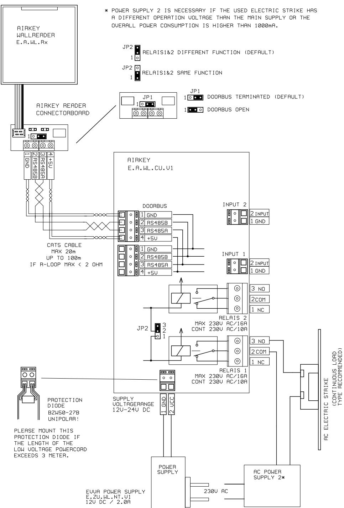

## **04 CONTROL UNIT WITH EXTERNAL DOOR CONTROL UNIT**

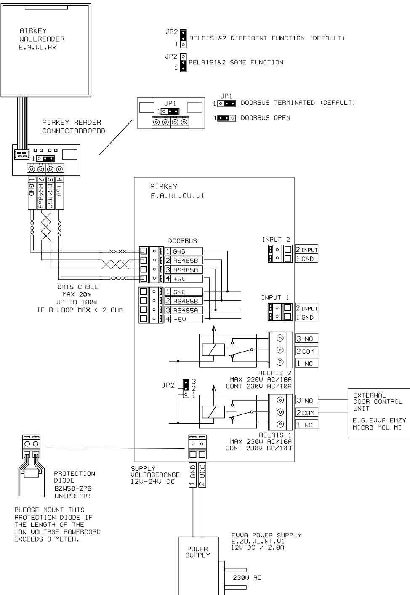

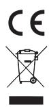

**www.evva.com**

EVVA Sicherheitstechnologie GmbH | Wienerbergstraße 59–65 | A-1120 Wien