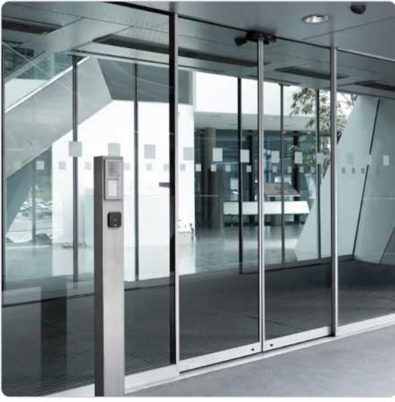
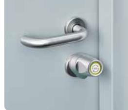
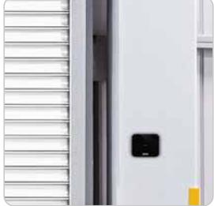
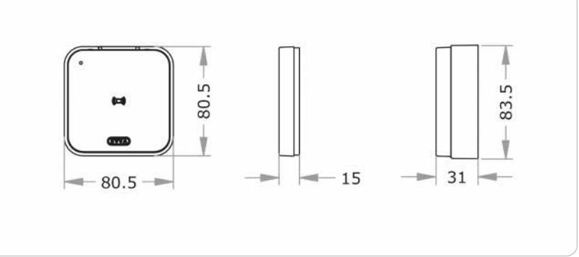

## AirKey-väggläsare | Ram för utanpåliggande montering, ram för infälld montering

## **Product description SE**

AirKey väggläsare i kombination med styrenheten används för att styra elektroniska lås i alla typer av dörrar och dörrmiljöer. Används exempelvis för elektroniskt styrda skjutoch svängdörrar, hissar och portsystem. AirKey väggläsare passar för användning både inom- och utomhus.

| Installationstyp          | RU – utanpåliggande montering   RA – infälld montering                                                                                                                                                                                                                                                                                                                             |
|---------------------------|------------------------------------------------------------------------------------------------------------------------------------------------------------------------------------------------------------------------------------------------------------------------------------------------------------------------------------------------------------------------------------|
| Glasfärg                  | SW – svart   SI – silver   WS – vit                                                                                                                                                                                                                                                                                                                                                |
| Färg på ram               | SWM – matt svart   SWP – polerad svart   WSM – matt vit   WSP – polerad matt   SIM – matt silver   SIP – polerad silver                                                                                                                                                                                                                                                      |
| Säkerhetsfunktioner       | Väggläsaren ansluts till styrenheten   4 mm tjock glaspanel   Händelselogg   Integrerat EAL5+-certifierat säkerhetselement   ECDSA- och AES-kryptering                                                                                                                                                                                                                       |
| Standarder och riktlinjer | CE-märkt   IP65-klassat                                                                                                                                                                                                                                                                                                                                                            |
| Teknisk installation      | Inom- och utomhus   Upp till 100 m avstånd mellan väggläsare och styrenhet (rekommenderad kabeltyp: CAT5, max. 100 m, Rloop max. 2 Ω)                                                                                                                                                                                                                                        |
| Dimensioner               | 80 × 80 × 15 mm                                                                                                                                                                                                                                                                                                                                                                    |
| Kompatibla ID-tekniker    | NFC-smartkort som kortidentifieringsmedia, nyckelbrickor och kombinycklar   Bluetooth 4.0 (BLE)   NFC                                                                                                                                                                                                                                                                        |
| Strömförsörjning          | Strömförsörjning via styrenhet till väggläsare                                                                                                                                                                                                                                                                                                                                     |
| Användarvillkor           | Omgivningstemperatur -25 °C till +70 °C   Fuktighet < 90 %, icke kondenserade   IP 65-klassning                                                                                                                                                                                                                                                                                 |
| Logg                      | Senaste 1 000 händelserna                                                                                                                                                                                                                                                                                                                                                          |
| Gränssnitt                | BLE   NFC   AirKey styrenhet   Relä ingångar/utgångar                                                                                                                                                                                                                                                                                                                              |
| Komponenter               | RA – infälld montering: AirKey väggläsare, Ram för infälld montering, Två väggpackningar, Skruvsats, Demonteringsverktyg, Monteringsanvisning, Viktig information   RU – utanpåliggande montering: AirKey väggläsare, Ram för infälld montering och ram för utanpåliggande montering, Skruvsats, Demonteringsverktyg, Monteringsanvisning, Viktig information |
| Produktkod                | E.A.WL.[Monteringsplats].[Glasfärg].[Ramfärg]                                                                                                                                                                                                                                                                                                                                      |
| Exempel                   | E.A.WL.RU.SW.SWP                                                                                                                                                                                                                                                                                                                                                                   |

## **Dimensional drawing SE**

Powered by TCPDF (www.tcpdf.org)