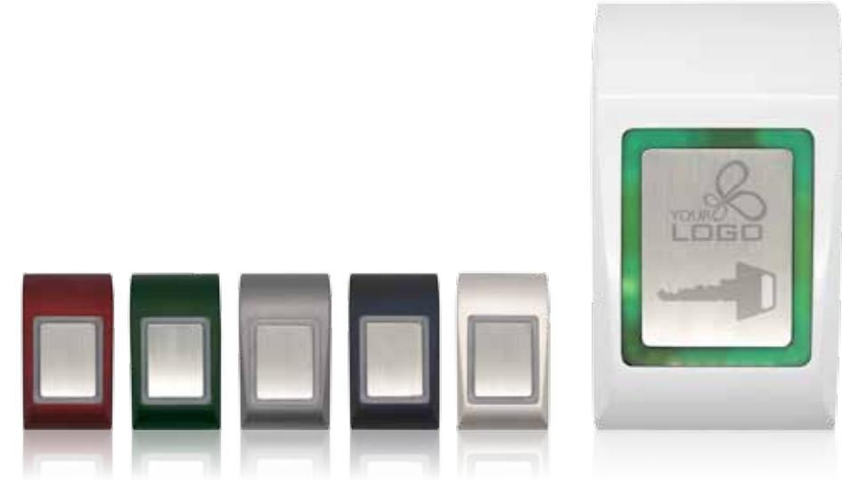
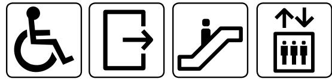
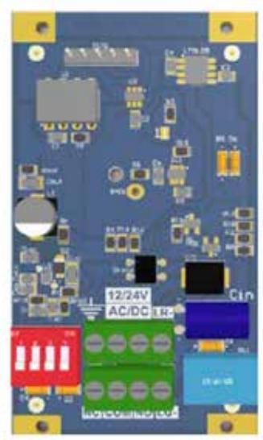
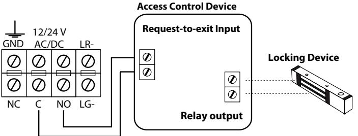
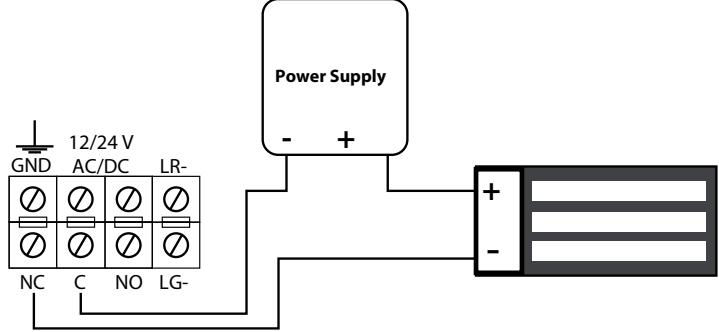
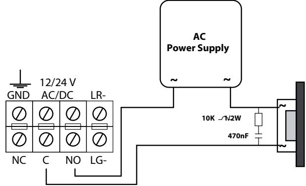
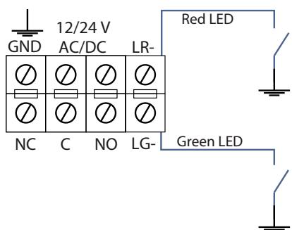
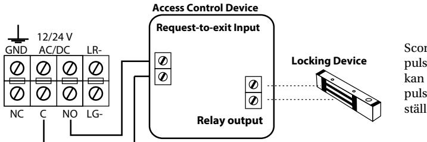

# Öppnaknapp Scoria Touch

*Scoria Touch är en öppnaknapp som fungerar dels som oberoende öppnaknapp (Stand Alone) i direkt samverkan med ett elektriskt lås, eller ansluten till ett passersystems undercentral.*

## **1.0 Beskrivning**

### **1.1 Introduktion**

Scoria Touch är en öppnaknapp som fungerar dels som oberoende öppnaknapp (Stand Alone) i direkt samverkan med ett elektriskt lås. Eller ansluten till ett passersystems undercentral. Med sin smäckra design i gjuten metall, kombinerar Scoria Touch elegans och estetik med robusthet och tillförlitlighet. I en och samma produkt.

# **1.2 Funktioner**

- Touch kontroll
- Puls eller Latch funktion på relä valbart
- Kan med fördel appliceras i rad olika användningsområden
- Vandalsäker
- Separat anslutning till jord
- Tydlig visuell indikering för låst/olåst
- Tydlig summer indikering vid användande
- Fri extern LED styrning

## **1.3 Teknisk specifikation**

- Spänningsmatning: 12/24V AC/DC
- Strömförbrukning: Max 65mA
- Utgång växlande relä: 1A 24 DC / 120V AC.
- Ljuskälla (LED): Normal Röd
- Vid aktivering grön LED
- Vilande röd LED
- Omgivningstemperatur: –15° 55°C (inomhusbruk)
- Luftfuktighet: Ej kondenserande upp till 95%
- Dimensioner (mm): L92 x B51 x H25
- Kapsling: Pressgjuten zink
- Touch panel: Rostfritt stål

# **2.0 Installation**

## **2.1 Montering**

- 1. Välj en lämplig plats på vägg eller plan yta.
- 2. Fäst borrmall på utvald plats. Borra 3 hål enligt anvisningarna.
- 3. Montera medföljande skruvpluggar.
- 4. Dra kabel enligt anvisning genom monteringsplattans anvisade hål.
- 5. Fäst monteringplattan använd medföljande skruv.
- 6. Anslut kablarna enligt inkopplingsanvisningen
- 7. Placera kåpan över monteringsplattans överliggande anvisning. Vik ned kåpan över monteringsplattan.
- 8. Fixera kåpan mot monteringsplattan och fast den med medföljande insexskruv M3 x 6 mm I botten med medföljande verktyg.

**Notera:** Skydd mot transienter och strömspikar vid statisk urladdning (ESD) eller från strömförsörjning finns inbyggda i produkten. För att detta skydd skall verka på bästa sätt skall chassit vara jordat på korrekt sätt.

## **3.0 Användningsområden**

- Belysning
- Öppnaknapp (Passerkontroll)
- Hisstyrning
- Industriell panel

**Notera:** Skydd mot transienter och strömspikar vid statisk urladdning (ESD) eller från strömförsörjning finns inbyggda i produkten. För att detta skydd skall verka på bästa sätt skall chassit vara jordat på korrekt sätt.

#### **3.2 PCB användningsområden inkoppling**

#### **3.3 Inkoppling relä normalt sluten strömförsörjning DC**

#### **3.4 Inkoppling relä normalt öppen strömförsörjning AC**

#### **3.5 External LED control**

**Notera:** LED kan enbart styras extern om enheten matas med likspänning DC.

#### **4.0 Funktionsinställningar**

Scoria Touch kan antingen konfigureras för puls eller latch mode. Olika tidsinställning kan göras för att ange reläets aktiv erade pulstid. Två stycken byglingsfält används för ställa in valbara pulstider.

Tabellen visar byglingfältets olika positioner för de olika inställningsvalen.

| Operation  | Switch 1 | Switch 2 | DipSwitch     |
|------------|----------|----------|---------------|
| Latch Mode | ON       | ON       | ON 1 2 3 4 |
| 10 Seconds | ON       | OFF      | ON 1 2 3 4 |
| 5 Seconds  | OFF      | ON       | ON 1 2 3 4 |
| 3 Seconds  | OFF      | OFF      | ON 1 2 3 4 |

**Notera:**

• Gör byglingsvalen innan produkten strömsätts.

• Bryt spänningen om inställningen av byglingarna skall ändras.

| LED Control mode                                                  | Switch 3 | Switch 4 | DipSwitch     |
|-------------------------------------------------------------------|----------|----------|---------------|
| Internal LED control                                              | ON       | ON       | ON 1 2 3 4 |
| External LED control                                              | OFF      | OFF      | ON 1 2 3 4 |
| Double LED control *                                              | ON       | ON       | ON 1 2 3 4 |
| Mixed LED control** Red LED – external Green LED – internal | OFF      | ON       | ON 1 2 3 4 |

* Dubbel kontroll: Sätt DIP-omkopplare 3 & 4 i läge ON. Anslut "LG-" och "LR-" till extern styrenhet. LED lyser om internt eller externt styrning leder till GND

** Mixat läge: En färg kan styras internt (ex. grön lysdiod DIP-omkopplare är PÅ) och andra färgen (ex. grön) externt.